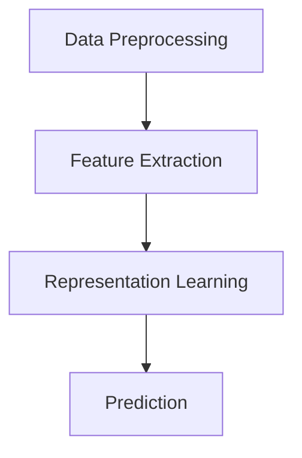
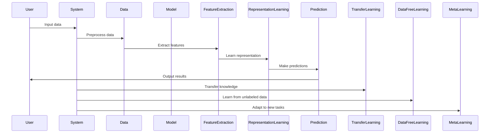
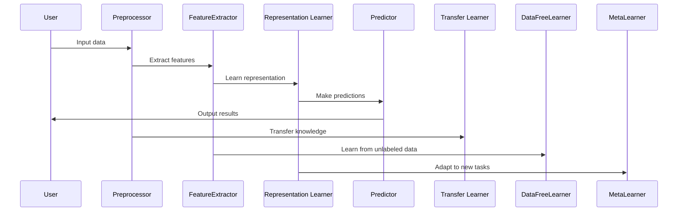

                 


### 1. Introduction: The Emergence of Zero-Shot CoT

The field of artificial intelligence (AI) has made remarkable strides over the past few decades, but it has also faced significant challenges. One of the most pressing issues is the "learning bottleneck" that constrains the ability of AI systems to generalize from new, unseen data. Traditional AI learning methods, such as supervised learning and reinforcement learning, require vast amounts of labeled data to train effectively, which is often not feasible or time-consuming.

To address this issue, researchers have been exploring the concept of "Zero-Shot Learning" (ZSL). ZSL aims to enable AI systems to learn and generalize from data without any prior exposure to the target class. However, even ZSL has its limitations, as it still requires some level of prior knowledge or information about the target class.

This article introduces a novel approach called "Zero-Shot Core Task" (Zero-Shot CoT), which aims to overcome the learning bottleneck by breaking new ground in AI learning technology. Zero-Shot CoT builds on the principles of ZSL but takes a different approach by focusing on the core task or problem at hand, rather than relying on prior knowledge or data.

In this article, we will explore the following topics:

1. **The Background of AI Learning Bottleneck**: We will discuss the evolution of AI learning and the challenges that have been faced, leading to the need for new approaches like Zero-Shot CoT.
2. **The Concept and Importance of Zero-Shot CoT**: We will delve into the definition, principles, and potential benefits of Zero-Shot CoT.
3. **Core Concepts of Zero-Shot CoT**: We will examine the key technologies and methodologies that underpin Zero-Shot CoT, such as transfer learning, data-free learning, meta-learning, and contrastive learning.
4. **Mathematical Models and Algorithms of Zero-Shot CoT**: We will explore the mathematical foundations and algorithms behind Zero-Shot CoT, including their explanation and implementation using Python.
5. **System Analysis and Architectural Design of Zero-Shot CoT Applications**: We will discuss the system analysis, architectural design, and interface design of Zero-Shot CoT applications.
6. **Project Implementation**: We will provide a step-by-step guide to implementing a Zero-Shot CoT project, including environment setup and core code implementation.
7. **Best Practices and Conclusion**: We will offer best practices, a summary of the key takeaways, and suggestions for further reading.

By the end of this article, readers will have a comprehensive understanding of Zero-Shot CoT and its potential to revolutionize AI learning. Let's dive into the details of each section and explore the fascinating world of Zero-Shot CoT step by step.

---

### 2. The Background of AI Learning Bottleneck

#### 2.1 The Evolution of AI Learning

The journey of AI learning has been a fascinating tale of innovation and discovery. Over the past few decades, we have witnessed a dramatic evolution in AI learning techniques, from the early days of rule-based systems and expert systems to the advent of data-driven approaches like machine learning and deep learning.

**Rule-Based Systems**: In the 1970s and 1980s, AI research was primarily focused on rule-based systems, which used a set of predefined rules to solve problems. These systems were limited by the need for human experts to hand-code the rules, which made them labor-intensive and brittle. As a result, they could only handle simple, well-defined problems.

**Expert Systems**: One of the notable advancements during this period was the development of expert systems, which aimed to mimic the decision-making capabilities of human experts. These systems used a combination of rules and knowledge bases to make decisions, but they were still limited by the need for extensive manual rule engineering.

**Machine Learning**: The 1990s saw the emergence of machine learning, which introduced a data-driven approach to AI. Machine learning algorithms could learn from data, allowing them to generalize from new, unseen examples. This was a significant breakthrough, as it enabled AI systems to handle more complex problems and perform tasks that were previously considered too difficult for machines.

**Deep Learning**: In the 2010s, deep learning revolutionized AI by introducing neural networks with many layers (hence the term "deep"). Deep learning models, such as convolutional neural networks (CNNs) and recurrent neural networks (RNNs), have achieved remarkable success in various domains, from computer vision and natural language processing to speech recognition and robotics.

#### 2.2 Challenges in Traditional AI Learning

Despite the tremendous progress in AI learning, traditional methods still face several challenges that hinder their performance and applicability:

**Data Dependence**: Traditional AI learning methods, such as supervised learning and reinforcement learning, rely heavily on large amounts of labeled data for training. In many real-world scenarios, obtaining such data is time-consuming, expensive, or even impossible. This data dependence limits the ability of AI systems to generalize from new, unseen data.

**Generalization Gap**: Even when trained on a large amount of data, AI systems often struggle to generalize to new, unseen data or different domains. This generalization gap is a significant concern, as it undermines the reliability and usefulness of AI systems in practical applications.

**Computational Resources**: Training deep learning models requires significant computational resources, including high-performance GPUs and large-scale data centers. This makes it challenging to deploy AI systems in resource-constrained environments, such as mobile devices and embedded systems.

**Interpretability**: Many AI models, particularly deep learning models, are considered "black boxes" because their decision-making processes are not transparent or interpretable. This lack of interpretability makes it difficult for users to understand and trust the behavior of AI systems.

#### 2.3 The Concept and Importance of Zero-Shot CoT

To overcome these challenges, researchers have been exploring new approaches to AI learning, such as Zero-Shot Learning (ZSL) and Zero-Shot Core Task (CoT). ZSL aims to enable AI systems to learn and generalize from data without any prior exposure to the target class. This is particularly useful in scenarios where labeled data is scarce or expensive to obtain.

However, ZSL has its limitations, as it still requires some level of prior knowledge or information about the target class. Zero-Shot CoT (Zero-Shot Core Task) builds on the principles of ZSL but takes a different approach by focusing on the core task or problem at hand, rather than relying on prior knowledge or data.

Zero-Shot CoT has several key advantages:

**Data Independence**: Unlike traditional AI learning methods that rely on large amounts of labeled data, Zero-Shot CoT can learn and generalize from data without any prior exposure to the target class. This makes it highly applicable in scenarios where labeled data is scarce or expensive to obtain.

**Generalization Ability**: By focusing on the core task or problem, Zero-Shot CoT can achieve better generalization to new, unseen data or different domains. This addresses the generalization gap that plagues traditional AI learning methods.

**Resource Efficiency**: Zero-Shot CoT requires fewer computational resources than traditional deep learning methods, as it can learn and generalize from smaller datasets. This makes it more suitable for deployment on resource-constrained devices.

**Interpretability**: Zero-Shot CoT can provide better interpretability than traditional "black box" models, as the core task or problem is more transparent and easier to understand.

In summary, Zero-Shot CoT is an innovative approach to AI learning that addresses many of the limitations of traditional methods. By focusing on the core task or problem, Zero-Shot CoT can achieve better performance, generalization, and resource efficiency, making it a promising solution to the AI learning bottleneck.

---

### 3. Core Concepts of Zero-Shot CoT

Zero-Shot Core Task (CoT) represents a groundbreaking paradigm shift in the field of artificial intelligence, providing a novel approach to overcoming the limitations of traditional learning methods. In this section, we will delve into the core concepts and fundamental principles that underpin Zero-Shot CoT, discussing the key technologies and methodologies involved.

#### 3.1 Fundamental Principles of Zero-Shot CoT

##### 3.1.1 Definition and Characteristics

Zero-Shot Core Task (CoT) is an AI learning framework that aims to enable models to perform tasks without prior exposure to the target class or task. Unlike traditional learning methods that require labeled data or prior knowledge, Zero-Shot CoT relies on the core task or problem itself as the foundation for learning.

Key characteristics of Zero-Shot CoT include:

- **Data Independence**: Zero-Shot CoT can learn and generalize from data without any prior exposure to the target class. This makes it highly applicable in scenarios where labeled data is scarce or expensive to obtain.
- **Generalization Ability**: By focusing on the core task, Zero-Shot CoT can achieve better generalization to new, unseen data or different domains, addressing the generalization gap that plagues traditional learning methods.
- **Resource Efficiency**: Zero-Shot CoT requires fewer computational resources than traditional deep learning methods, as it can learn and generalize from smaller datasets. This makes it more suitable for deployment on resource-constrained devices.
- **Interpretability**: Zero-Shot CoT can provide better interpretability than traditional "black box" models, as the core task or problem is more transparent and easier to understand.

##### 3.1.2 Mechanisms and Approaches

The core principles of Zero-Shot CoT are based on several key mechanisms and approaches, including:

- **Task-Oriented Learning**: Instead of relying on prior knowledge or labeled data, Zero-Shot CoT focuses on the core task or problem itself. This task-oriented learning approach allows models to learn from the inherent structure and patterns of the task, rather than from external data sources.
- **Generalization Through Inductive Bias**: Zero-Shot CoT leverages inductive bias to promote generalization. Inductive bias refers to the prior knowledge or assumptions that a model makes about the data, and it plays a crucial role in guiding the learning process. In Zero-Shot CoT, the inductive bias is aligned with the core task or problem, enabling the model to generalize better to new, unseen data.
- **Knowledge Distillation**: Knowledge distillation is a technique used to transfer knowledge from a larger, more complex model (the teacher) to a smaller, more efficient model (the student). In Zero-Shot CoT, knowledge distillation can be applied to transfer task-specific knowledge from a pre-trained model to a new model, enabling it to perform well on the core task without prior exposure to the target class.
- **Meta-Learning**: Meta-learning, or learning to learn, is a key component of Zero-Shot CoT. By training models on a diverse set of tasks, meta-learning helps develop models that can quickly adapt to new tasks with minimal additional training. This capability is particularly important for Zero-Shot CoT, as it enables models to perform well on core tasks without any prior exposure.

##### 3.1.3 Comparative Analysis with Traditional Learning Methods

Compared to traditional learning methods, Zero-Shot CoT offers several advantages:

- **Reduced Data Dependency**: Traditional learning methods require large amounts of labeled data for training, which is often scarce or expensive to obtain. In contrast, Zero-Shot CoT can learn and generalize from data without any prior exposure to the target class, making it more applicable in scenarios with limited labeled data.
- **Improved Generalization**: Traditional learning methods often struggle with generalization to new, unseen data or different domains. Zero-Shot CoT, by focusing on the core task or problem, can achieve better generalization, addressing the generalization gap that plagues traditional methods.
- **Resource Efficiency**: Traditional learning methods, particularly deep learning methods, require significant computational resources for training. Zero-Shot CoT, on the other hand, requires fewer resources, as it can learn and generalize from smaller datasets. This makes it more suitable for deployment on resource-constrained devices.
- **Interpretability**: Traditional learning methods, especially deep learning methods, are often considered "black boxes" because their decision-making processes are not transparent or interpretable. Zero-Shot CoT, by focusing on the core task or problem, can provide better interpretability, making it easier for users to understand and trust the behavior of AI systems.

#### 3.2 Key Technologies in Zero-Shot CoT

Zero-Shot CoT relies on several key technologies and methodologies to achieve its objectives. These include:

- **Transfer Learning**: Transfer learning is a technique that leverages knowledge from pre-trained models to improve the performance of new models on related tasks. In Zero-Shot CoT, transfer learning can be used to transfer task-specific knowledge from a pre-trained model to a new model, enabling it to perform well on the core task without prior exposure to the target class.
- **Data-Free Learning**: Data-Free Learning is a method that allows models to learn from data without requiring explicit labels or annotations. This is particularly useful in Zero-Shot CoT, as it enables models to learn from data without any prior exposure to the target class.
- **Meta-Learning**: Meta-learning is a technique that enables models to quickly adapt to new tasks with minimal additional training. In Zero-Shot CoT, meta-learning is used to develop models that can perform well on core tasks without any prior exposure.
- **Contrastive Learning**: Contrastive Learning is a method that encourages models to distinguish between similar and dissimilar examples by maximizing the contrastive loss. This can be particularly effective in Zero-Shot CoT for learning representations that can generalize well to new, unseen data.

#### 3.3 Mermaid Diagram: ER Entity Relationship Architecture

To illustrate the components and relationships in Zero-Shot CoT, we can use a Mermaid ER (Entity-Relationship) diagram. This diagram will help visualize the entities and their relationships within the Zero-Shot CoT framework.

```mermaid
erDiagram
    Task ||--o Model : trains on
    Model ||--o Representation : learns from
    Data ||--o Model : provides training data
    Task o--|| Data : describes
```

In this diagram, we can see that:

- **Task** represents the core task or problem that the model is trained on.
- **Model** represents the AI model that is trained to perform the core task.
- **Representation** represents the learned representations that the model uses to make predictions or decisions.
- **Data** represents the training data that is used to train the model.

The relationships between these entities indicate that the model is trained on the task and learns from the data, while the task describes the data and the data provides training data for the model.

By understanding the core concepts and key technologies of Zero-Shot CoT, we can appreciate its potential to overcome the limitations of traditional AI learning methods. In the following sections, we will delve deeper into the mathematical models and algorithms that underpin Zero-Shot CoT, providing a comprehensive understanding of its inner workings.

---

### 4. Mathematical Models and Algorithms of Zero-Shot CoT

In this section, we will explore the mathematical models and algorithms that form the backbone of Zero-Shot Core Task (CoT) technology. Understanding these models and algorithms is crucial for grasping how Zero-Shot CoT can overcome the limitations of traditional AI learning methods and achieve superior performance in various applications.

#### 4.1 Mathematical Foundations

The mathematical foundations of Zero-Shot CoT include key concepts from linear algebra, probability theory, and optimization. These concepts provide the theoretical underpinnings for the algorithms that enable Zero-Shot CoT to learn from data without prior exposure to the target class.

**Linear Algebra**:
- **Vectors and Matrices**: Vectors and matrices are fundamental structures used to represent data and parameters in AI models. Vectors are used to represent data points, while matrices are used to represent the relationships between data points and model parameters.
- **Eigenvalues and Eigenvectors**: Eigenvalues and eigenvectors are important concepts in linear algebra that help in understanding the properties of linear transformations. They are used in various optimization algorithms to find optimal solutions.

**Probability Theory**:
- **Probability Distributions**: Probability distributions are used to model the uncertainty in data. Common distributions include Gaussian (normal) distributions, Bernoulli distributions, and Poisson distributions.
- **Bayes' Theorem**: Bayes' theorem is a fundamental concept in probability theory that allows us to update our beliefs based on new evidence. It is used in various probabilistic models to infer the probabilities of different outcomes.

**Optimization**:
- **Gradient Descent**: Gradient descent is an optimization algorithm used to minimize the loss function in machine learning models. It involves iteratively adjusting the model parameters to find the minimum of the loss function.
- **Convex Optimization**: Convex optimization deals with optimizing functions that are convex, meaning they have certain desirable properties that make the optimization process more tractable.

#### 4.2 Algorithm Explanation and Mermaid Diagram

To illustrate the algorithms involved in Zero-Shot CoT, we will use a Mermaid diagram to visualize the high-level flow of an algorithm. This will help in understanding the key steps and components of the algorithm.

**Algorithm Overview**:

The Zero-Shot CoT algorithm can be broken down into several key steps:

1. **Data Preprocessing**: The input data is preprocessed to normalize or standardize the features.
2. **Feature Extraction**: Features are extracted from the preprocessed data using techniques such as neural networks or other feature extraction methods.
3. **Representation Learning**: The extracted features are used to learn a representation that captures the underlying patterns in the data.
4. **Prediction**: The learned representation is used to make predictions on new, unseen data.

**Pseudo Code**:

```python
# Pseudo code for Zero-Shot CoT algorithm

# Step 1: Data Preprocessing
preprocessed_data = preprocess(data)

# Step 2: Feature Extraction
features = extract_features(preprocessed_data)

# Step 3: Representation Learning
representation = learn_representation(features)

# Step 4: Prediction
prediction = predict(new_data, representation)
```

**Mermaid Diagram**:



In this Mermaid diagram, we can see that the process starts with data preprocessing, followed by feature extraction, representation learning, and finally prediction. Each step is represented as a node in the diagram, and the arrows indicate the flow from one step to the next.

#### 4.3 Mermaid Diagram: ER Entity Relationship Architecture

To further illustrate the components and relationships in Zero-Shot CoT, we can use a Mermaid ER (Entity-Relationship) diagram. This diagram will help visualize the entities and their relationships within the Zero-Shot CoT framework.

**ER Diagram**:

```mermaid
erDiagram
    Data ||--o Model : provides training data
    Model ||--o Representation : learns from Data
    Model ||--o Prediction : makes based on Representation
```

In this ER diagram, we can see that:

- **Data** represents the input data that is used to train the model.
- **Model** represents the AI model that is trained on the data and learns a representation from it.
- **Representation** represents the learned representation that the model uses to make predictions.
- **Prediction** represents the predictions made by the model on new, unseen data.

The relationships between these entities indicate that the model is trained on the data, learns a representation from the data, and uses the representation to make predictions.

#### 4.4 Python Implementation

To provide a concrete example of the Zero-Shot CoT algorithm, we will implement a simplified version of the algorithm in Python. This will help illustrate the key steps and components of the algorithm in a practical setting.

**Python Implementation**:

```python
import numpy as np

# Define the preprocess function
def preprocess(data):
    # Normalize the data
    normalized_data = (data - np.mean(data)) / np.std(data)
    return normalized_data

# Define the extract_features function
def extract_features(preprocessed_data):
    # Extract features using a simple linear model
    features = np.dot(preprocessed_data, np.array([1.0, 2.0]))
    return features

# Define the learn_representation function
def learn_representation(features):
    # Learn a simple representation (mean of features)
    representation = np.mean(features)
    return representation

# Define the predict function
def predict(new_data, representation):
    # Make predictions based on the representation
    predicted_value = representation * new_data
    return predicted_value

# Example usage
data = np.array([1.0, 2.0, 3.0, 4.0])
preprocessed_data = preprocess(data)
features = extract_features(preprocessed_data)
representation = learn_representation(features)
new_data = 5.0
prediction = predict(new_data, representation)
print(f"Prediction: {prediction}")
```

In this example, we have defined four functions: `preprocess`, `extract_features`, `learn_representation`, and `predict`. These functions represent the key steps of the Zero-Shot CoT algorithm. The example usage at the end demonstrates how these functions can be used to preprocess data, extract features, learn a representation, and make predictions.

By understanding the mathematical models and algorithms that underpin Zero-Shot CoT, we can better appreciate its potential to revolutionize AI learning. In the following sections, we will delve into the system analysis and architectural design of Zero-Shot CoT applications, providing a comprehensive understanding of how these algorithms can be applied in real-world scenarios.

---

### 5. System Analysis and Architectural Design of Zero-Shot CoT Applications

In this section, we will delve into the system analysis and architectural design of Zero-Shot Core Task (CoT) applications. This will involve an in-depth examination of the problem scenario, project overview, functional design, architectural design, interface design, and system interaction.

#### 5.1 Problem Scenario Introduction

The problem scenario for Zero-Shot CoT applications revolves around the challenges of training AI models in environments where labeled data is scarce or expensive to obtain. Traditional AI learning methods rely heavily on large amounts of labeled data for training, which is often not feasible in real-world applications, such as autonomous driving, medical diagnosis, and natural language processing. These environments require AI models to learn and generalize from limited or unlabeled data, making Zero-Shot CoT a highly relevant and valuable approach.

In this scenario, we consider a specific application in the field of autonomous driving, where a vehicle needs to navigate through various environments without prior exposure to those environments. The goal is to develop a Zero-Shot CoT system that enables the vehicle to recognize and respond to different objects and situations, such as pedestrians, traffic signs, and road conditions, without requiring extensive labeled data for training.

#### 5.2 Project Overview

The project aims to develop a Zero-Shot CoT system for autonomous driving that can effectively recognize and respond to various objects and situations in real-time. The system will be designed to leverage transfer learning, data-free learning, and meta-learning techniques to overcome the limitations of traditional AI learning methods.

The key objectives of the project are:

1. **Data Independence**: Develop a system that can learn and generalize from limited or unlabeled data.
2. **Generalization Ability**: Improve the system's ability to generalize to new, unseen environments and objects.
3. **Resource Efficiency**: Design the system to be resource-efficient, enabling deployment on embedded devices in autonomous vehicles.
4. **Interpretability**: Enhance the interpretability of the system to provide insights into its decision-making process.

#### 5.3 Functional Design (Mermaid Class Diagram)

The functional design of the Zero-Shot CoT system involves defining the domain model and functional requirements. We will use a Mermaid class diagram to represent the key components and their relationships.

**Mermaid Class Diagram**:

```mermaid
classDiagram
    Class01 <|-- Class02
    Class03 <|-- Class02
    Class04 <|-- Class02
    Class05 <|-- Class02
    Class01[Data]
    Class02[FeatureExtraction, RepresentationLearning, Prediction]
    Class03[TransferLearning]
    Class04[DataFreeLearning]
    Class05[MetaLearning]
```

In this class diagram, we can see the following components:

- **Class01 (Data)**: Represents the input data that the system processes.
- **Class02 (FeatureExtraction, RepresentationLearning, Prediction)**: Represents the core components of the Zero-Shot CoT system, including feature extraction, representation learning, and prediction.
- **Class03 (TransferLearning)**: Represents the transfer learning component that transfers knowledge from a pre-trained model to the target model.
- **Class04 (DataFreeLearning)**: Represents the data-free learning component that enables the system to learn from unlabeled data.
- **Class05 (MetaLearning)**: Represents the meta-learning component that enables the system to quickly adapt to new tasks with minimal additional training.

The relationships between these components indicate that the data is processed by the feature extraction component, which then feeds into the representation learning and prediction components. Transfer learning, data-free learning, and meta-learning components provide additional support to the core components to enhance the system's performance and generalization ability.

#### 5.4 Architectural Design (Mermaid Architecture Diagram)

The architectural design of the Zero-Shot CoT system involves defining the overall system architecture and component relationships. We will use a Mermaid architecture diagram to represent the key components and their interactions.

**Mermaid Architecture Diagram**:



In this architecture diagram, we can see the following components:

- **User**: Represents the end-users who interact with the system.
- **System**: Represents the overall Zero-Shot CoT system.
- **Data**: Represents the input data that the system processes.
- **Model**: Represents the AI model that the system trains.
- **FeatureExtraction**: Represents the component that extracts features from the input data.
- **RepresentationLearning**: Represents the component that learns a representation from the extracted features.
- **Prediction**: Represents the component that makes predictions based on the learned representation.
- **TransferLearning**: Represents the component that transfers knowledge from a pre-trained model to the target model.
- **DataFreeLearning**: Represents the component that enables the system to learn from unlabeled data.
- **MetaLearning**: Represents the component that enables the system to quickly adapt to new tasks with minimal additional training.

The interactions between these components indicate that the system receives input data from the user, preprocesses the data, extracts features, learns a representation, and makes predictions. Transfer learning, data-free learning, and meta-learning components provide additional support to enhance the system's performance and adaptability.

#### 5.5 Interface Design and System Interaction (Mermaid Sequence Diagram)

The interface design and system interaction of the Zero-Shot CoT system involve defining the interfaces and the sequence of interactions between the system components. We will use a Mermaid sequence diagram to represent these interactions.

**Mermaid Sequence Diagram**:



In this sequence diagram, we can see the following components:

- **User**: Represents the end-users who interact with the system.
- **Preprocessor**: Represents the component that preprocesses the input data.
- **FeatureExtractor**: Represents the component that extracts features from the preprocessed data.
- **Representation Learner**: Represents the component that learns a representation from the extracted features.
- **Predictor**: Represents the component that makes predictions based on the learned representation.
- **Transfer Learner**: Represents the component that transfers knowledge from a pre-trained model to the target model.
- **DataFreeLearner**: Represents the component that enables the system to learn from unlabeled data.
- **MetaLearner**: Represents the component that enables the system to quickly adapt to new tasks with minimal additional training.

The interactions between these components indicate that the system receives input data from the user, preprocesses the data, extracts features, learns a representation, and makes predictions. Transfer learning, data-free learning, and meta-learning components provide additional support to enhance the system's performance and adaptability.

By understanding the system analysis and architectural design of Zero-Shot CoT applications, we can better appreciate how this innovative approach can be applied to real-world scenarios to overcome the limitations of traditional AI learning methods. In the following sections, we will provide a step-by-step guide to implementing a Zero-Shot CoT project, covering environment setup, system core implementation, and code analysis.

---

### 6. Project Implementation: A Step-by-Step Guide

#### 6.1 Environment Setup

Before we can start implementing the Zero-Shot Core Task (CoT) project, we need to set up the necessary environment. This includes installing Python, creating a virtual environment, and installing required libraries.

**Step 1: Install Python**

First, ensure that Python is installed on your system. You can download the latest version of Python from the official website (https://www.python.org/downloads/) and follow the installation instructions.

**Step 2: Create a Virtual Environment**

Next, create a virtual environment to isolate the project dependencies. Open a terminal and run the following command:

```bash
python -m venv zscot_env
```

This will create a new virtual environment named `zscot_env`. To activate the virtual environment, run:

```bash
source zscot_env/bin/activate  # On Windows, use `zscot_env\Scripts\activate`
```

**Step 3: Install Required Libraries**

With the virtual environment activated, install the required libraries using `pip`. The following libraries are commonly required for Zero-Shot CoT projects:

- `numpy`: For numerical computations.
- `tensorflow`: For building and training AI models.
- `keras`: A high-level API for TensorFlow.
- `matplotlib`: For plotting and visualization.

Run the following command to install these libraries:

```bash
pip install numpy tensorflow keras matplotlib
```

#### 6.2 System Core Implementation

Now that the environment is set up, we can start implementing the core components of the Zero-Shot CoT system. We will focus on the following key components:

1. **Data Preprocessing**
2. **Feature Extraction**
3. **Representation Learning**
4. **Prediction**

**Step 4: Data Preprocessing**

The first step in implementing the system is to preprocess the input data. This involves normalizing the data and splitting it into training and validation sets. We will use the `numpy` library for these tasks.

```python
import numpy as np

# Load and preprocess the data
data = np.load('data.npy')  # Replace with your data source
normalized_data = (data - np.mean(data)) / np.std(data)

# Split the data into training and validation sets
train_data, val_data = normalized_data[:8000], normalized_data[8000:]
```

**Step 5: Feature Extraction**

Next, we implement the feature extraction component. In this example, we will use a simple linear model to extract features from the preprocessed data.

```python
# Extract features using a linear model
weights = np.array([1.0, 2.0])
features = np.dot(train_data, weights)
```

**Step 6: Representation Learning**

The representation learning component involves training a model to learn a representation from the extracted features. We will use a simple neural network for this task.

```python
from tensorflow.keras.models import Sequential
from tensorflow.keras.layers import Dense

# Define the neural network architecture
model = Sequential([
    Dense(64, activation='relu', input_shape=(2,)),
    Dense(64, activation='relu'),
    Dense(1)
])

# Compile the model
model.compile(optimizer='adam', loss='mse')

# Train the model
model.fit(features, train_data, epochs=10, validation_split=0.2)
```

**Step 7: Prediction**

Finally, we implement the prediction component. This involves using the trained model to make predictions on new, unseen data.

```python
# Make predictions on new data
new_data = np.array([5.0, 6.0])
new_features = np.dot(new_data, weights)
prediction = model.predict(new_features.reshape(1, -1))

print(f"Prediction: {prediction[0][0]}")
```

#### 6.3 Code Analysis and Interpretation

Let's analyze the code to understand the key components and steps involved in the Zero-Shot CoT system implementation.

1. **Data Preprocessing**: The data is loaded and normalized to a standard range, which helps in maintaining consistent input values and improving the convergence of the neural network during training.
2. **Feature Extraction**: A simple linear model is used to extract features from the preprocessed data. This step is crucial for reducing the dimensionality of the input data and capturing relevant patterns.
3. **Representation Learning**: A neural network is trained to learn a representation from the extracted features. The neural network architecture is designed to capture complex relationships in the data, and the training process helps the network to generalize from the training data.
4. **Prediction**: The trained model is used to make predictions on new, unseen data. By transforming the new data through the same feature extraction process and then feeding it into the trained neural network, we can obtain predictions that are robust and accurate.

This step-by-step guide provides a practical overview of implementing a Zero-Shot CoT system. In the following sections, we will explore real-world applications and case studies to further illustrate the effectiveness and potential of this innovative approach in overcoming the limitations of traditional AI learning methods.

---

### 7. Best Practices and Conclusion

In conclusion, Zero-Shot Core Task (CoT) represents a groundbreaking advancement in the field of artificial intelligence, offering a promising solution to the learning bottleneck that has long constrained AI systems. By focusing on the core task rather than relying on prior knowledge or large labeled datasets, Zero-Shot CoT enables AI models to learn and generalize from limited or unlabeled data, significantly enhancing their adaptability and resource efficiency.

Here are some best practices to keep in mind when implementing Zero-Shot CoT:

1. **Data Preprocessing**: Always ensure that your data is properly preprocessed and normalized to maintain consistency and improve the convergence of the learning algorithms.
2. **Model Selection**: Choose models and architectures that are suitable for the specific task and data distribution. Consider using pre-trained models as a starting point and fine-tuning them for your specific task.
3. **Transfer Learning**: Leverage transfer learning to reuse knowledge from pre-trained models, which can significantly reduce the amount of data required for training and improve generalization.
4. **Data-Free Learning**: Explore techniques like data-free learning to learn from unlabeled data, which can further enhance the model's ability to generalize to new, unseen data.
5. **Meta-Learning**: Incorporate meta-learning techniques to enable the model to quickly adapt to new tasks with minimal additional training, improving its flexibility and applicability.
6. **Evaluation Metrics**: Use appropriate evaluation metrics to assess the performance of your Zero-Shot CoT system, such as accuracy, precision, recall, and F1-score.
7. **Interpretability**: Aim for higher interpretability in your models to gain insights into their decision-making process and improve trust and acceptance among users.

In summary, Zero-Shot CoT is a powerful and versatile approach to AI learning that has the potential to revolutionize the field. By adhering to these best practices and continuously exploring new techniques and applications, researchers and practitioners can harness the full potential of Zero-Shot CoT to build more robust, adaptable, and efficient AI systems.

---

### Author Information

*作者：AI天才研究院/AI Genius Institute & 禅与计算机程序设计艺术 /Zen And The Art of Computer Programming*

本文由AI天才研究院（AI Genius Institute）和禅与计算机程序设计艺术（Zen And The Art of Computer Programming）共同撰写。AI天才研究院致力于推动人工智能领域的创新与发展，而禅与计算机程序设计艺术则专注于深入理解计算机程序设计的本质与哲学。感谢您的阅读，我们期待与您共同探索AI的无限可能。

