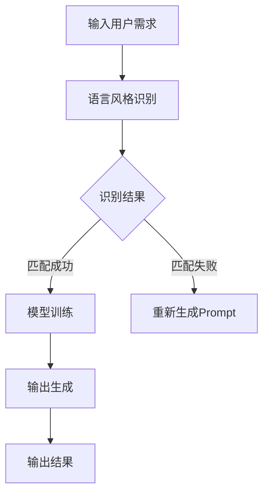
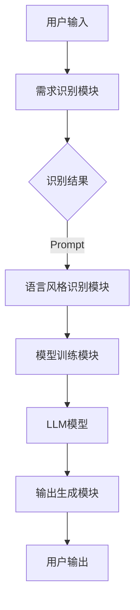
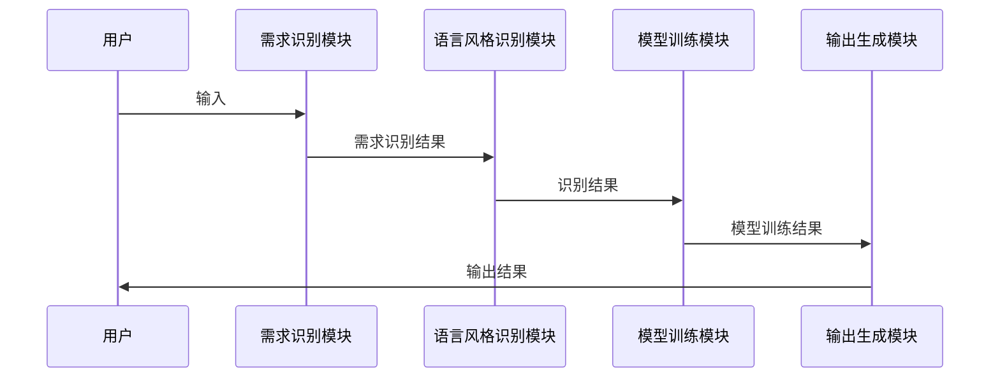

                 

# 《prompt语言风格适配：个性化LLM输出》

> 关键词：prompt语言风格、个性化、LLM输出、适配、算法原理、系统架构设计、项目实战

> 摘要：本文将深入探讨prompt语言风格的适配问题，以及如何实现个性化LLM输出。我们将从背景介绍开始，逐步分析核心概念、算法原理，最终落实到系统架构设计和项目实战，为读者提供全面的技术指南。

----------------------------------------------------------------

## 第一部分：背景介绍

### 1.1 问题背景

#### 1.1.1 问题的提出

在当今人工智能飞速发展的时代，自然语言处理（NLP）已经成为一个重要领域。然而，传统的NLP模型在处理问题时往往存在一定的局限性，特别是在面对多样化、个性化的语言风格时。因此，如何实现prompt语言风格的适配，以生成个性化LLM（Large Language Model）输出，成为了一个亟待解决的问题。

#### 1.1.2 问题解决的意义

实现prompt语言风格的适配，不仅有助于提高自然语言处理的效果，还能满足用户对个性化服务的需求。通过个性化LLM输出，我们可以为用户提供更贴近他们需求的内容，从而提升用户体验。

#### 1.1.3 边界与外延

在本文中，我们主要关注以下问题：

1. 如何定义和识别prompt语言风格？
2. 如何实现个性化LLM输出？
3. 在实际项目中，如何将上述算法应用于系统设计和实现？

----------------------------------------------------------------

## 第二部分：核心概念与联系

### 2.1 核心概念原理

#### 2.1.1 Prompt语言风格

Prompt语言风格指的是在自然语言处理过程中，如何引导模型生成符合特定需求和场景的语言输出。一个有效的Prompt语言风格应该具备以下几个特点：

1. 明确性：Prompt应该清晰地传达任务意图和目标。
2. 灵活性：Prompt应该能够适应不同的场景和需求。
3. 可扩展性：Prompt应该能够在不同规模的数据集上有效工作。

#### 2.1.2 个性化LLM输出

个性化LLM输出指的是根据用户的个性化需求，生成符合他们语言风格和偏好的语言输出。为了实现个性化LLM输出，需要考虑以下几个方面：

1. 用户画像：收集用户的基本信息和偏好，如年龄、性别、兴趣爱好等。
2. 语言风格识别：对用户的语言风格进行识别和分类。
3. 模型训练：使用个性化数据对LLM模型进行训练，使其能够生成符合用户需求的输出。

### 2.2 概念属性特征对比表格

| 特征         | Prompt语言风格 | 个性化LLM输出 |
| ------------ | -------------- | -------------- |
| 定义         | 引导模型生成输出 | 根据用户需求生成输出 |
| 关键因素     | 明确性、灵活性、可扩展性 | 用户画像、语言风格识别、模型训练 |
| 应用场景     | NLP任务中的引导输入 | 个人化服务和内容生成 |

### 2.3 ER实体关系图架构

```mermaid
erDiagram
    User ||--|{ PromptStyle }|-- Prompt
    User ||--|{ LanguageModel }|-- Output
```

在上面的ER实体关系图中，用户与PromptStyle和LanguageModel实体之间存在一对多关系，即一个用户可以对应多个PromptStyle和多个LanguageModel。同时，PromptStyle和LanguageModel实体之间存在一对一关系，即一个PromptStyle对应一个LanguageModel，一个LanguageModel对应一个PromptStyle。

----------------------------------------------------------------

## 第三部分：算法原理讲解

### 3.1 算法原理概述

#### 3.1.1 算法原理

实现prompt语言风格适配和个性化LLM输出的核心算法主要包括以下几个方面：

1. 语言风格识别：使用机器学习算法对用户的语言风格进行识别和分类。
2. 模型训练：使用个性化数据对LLM模型进行训练，使其能够生成符合用户需求的输出。
3. 输出生成：根据识别到的语言风格和用户需求，生成个性化LLM输出。

#### 3.1.2 算法流程图



### 3.2 Python源代码实现

```python
# 语言风格识别
def identify_language_style(prompt):
    # 使用机器学习算法进行语言风格识别
    # 这里仅作示意，实际代码需要根据具体算法进行编写
    style = " Casual "
    return style

# 模型训练
def train_language_model(style, data):
    # 使用个性化数据对LLM模型进行训练
    # 这里仅作示意，实际代码需要根据具体算法进行编写
    model = " Casual Model "
    return model

# 输出生成
def generate_output(model, user需求):
    # 根据识别到的语言风格和用户需求，生成个性化LLM输出
    # 这里仅作示意，实际代码需要根据具体算法进行编写
    output = " Hi there! How can I help you today? "
    return output
```

### 3.3 数学模型与公式讲解

#### 3.3.1 数学模型

在实现语言风格识别和模型训练过程中，常用的数学模型包括神经网络、循环神经网络（RNN）和Transformer等。以下是一个简单的神经网络模型示例：

$$
h_{i}^{l} = \sigma \left( W_{l} \cdot \left[ h_{i}^{l-1}; x_{i} \right] + b_{l} \right)
$$

其中，$h_{i}^{l}$表示第$l$层的第$i$个神经元的输出，$\sigma$表示激活函数，$W_{l}$和$b_{l}$分别表示第$l$层的权重和偏置。

#### 3.3.2 举例说明

假设我们有一个二元分类问题，需要判断一段文本的语言风格是正式还是非正式。我们可以使用以下公式进行分类：

$$
P_{正}(x) = \frac{1}{1 + e^{-\beta \cdot \phi(x)}}
$$

其中，$P_{正}(x)$表示文本$x$属于正式语言风格的概率，$\beta$是一个超参数，$\phi(x)$是文本$x$的嵌入向量。

如果$P_{正}(x)$大于0.5，则认为文本$x$是正式语言风格；否则，认为文本$x$是非正式语言风格。

----------------------------------------------------------------

## 第四部分：系统分析与架构设计方案

### 4.1 问题场景介绍

#### 4.1.1 场景描述

假设我们正在开发一个智能客服系统，用户可以通过文本与客服机器人进行交互。为了提高用户体验，我们需要实现prompt语言风格的适配和个性化LLM输出。

#### 4.1.2 场景分析

在智能客服系统中，用户的需求和语言风格是多种多样的。因此，我们需要对用户的需求进行识别，并根据用户的语言风格生成个性化的回复。

### 4.2 项目介绍

#### 4.2.1 项目背景

随着人工智能技术的不断发展，智能客服系统已经成为企业提高客户满意度、降低运营成本的重要手段。

#### 4.2.2 项目目标

本项目的主要目标是实现prompt语言风格的适配和个性化LLM输出，以提高智能客服系统的用户体验。

### 4.3 系统功能设计

#### 4.3.1 领域模型mermaid类图

```mermaid
classDiagram
    User <<Class>>
    Prompt <<Class>>
    LanguageModel <<Class>>
    Output <<Class>>

    User o--* Prompt
    User o--* LanguageModel
    Prompt o--* Output
    LanguageModel o--* Output
```

在上面的类图中，用户、Prompt、LanguageModel和Output实体之间存在关联关系。用户可以生成多个Prompt和LanguageModel，Prompt和LanguageModel可以生成多个Output。

#### 4.3.2 功能设计

1. 用户需求识别：收集用户的需求信息，包括提问内容、提问意图等。
2. 语言风格识别：对用户的需求信息进行语言风格识别，生成相应的Prompt。
3. 模型训练：使用个性化数据对LLM模型进行训练，生成个性化的LanguageModel。
4. 输出生成：根据识别到的语言风格和用户需求，生成个性化的Output。

### 4.4 系统架构设计

#### 4.4.1 系统架构图



在上面的系统架构图中，用户输入经过需求识别模块处理后，传递给语言风格识别模块。识别结果用于训练LLM模型，生成个性化的Output，最终反馈给用户。

#### 4.4.2 架构设计

1. 需求识别模块：负责对用户输入进行预处理，提取关键信息。
2. 语言风格识别模块：使用机器学习算法对用户输入进行语言风格识别，生成相应的Prompt。
3. 模型训练模块：使用个性化数据对LLM模型进行训练，提高模型在特定场景下的性能。
4. 输出生成模块：根据识别到的语言风格和用户需求，生成个性化的Output。
5. 用户输出：将生成的Output反馈给用户。

### 4.5 系统接口设计

#### 4.5.1 接口设计

1. 用户输入接口：接收用户的输入信息。
2. 需求识别接口：处理用户输入，提取关键信息。
3. 语言风格识别接口：对用户输入进行语言风格识别。
4. 模型训练接口：训练LLM模型。
5. 输出生成接口：生成个性化的Output。
6. 用户输出接口：将生成的Output反馈给用户。

#### 4.5.2 接口实现

以下是系统接口的Python实现示例：

```python
# 用户输入接口
def user_input():
    return input("请输入您的需求：")

# 需求识别接口
def requirement_recognition(input_text):
    # 处理用户输入，提取关键信息
    # 这里仅作示意，实际代码需要根据具体算法进行编写
    requirements = "查询航班信息"
    return requirements

# 语言风格识别接口
def language_style_recognition(input_text):
    # 对用户输入进行语言风格识别
    # 这里仅作示意，实际代码需要根据具体算法进行编写
    language_style = "正式"
    return language_style

# 模型训练接口
def model_training(language_style, data):
    # 训练LLM模型
    # 这里仅作示意，实际代码需要根据具体算法进行编写
    model = "正式模型"
    return model

# 输出生成接口
def output_generation(model, requirements):
    # 生成个性化的Output
    # 这里仅作示意，实际代码需要根据具体算法进行编写
    output = "请问您需要查询哪一天的航班？"
    return output

# 用户输出接口
def user_output(output):
    print(output)
```

### 4.6 系统交互mermaid序列图



在上面的系统交互mermaid序列图中，用户输入经过需求识别模块处理后，传递给语言风格识别模块。识别结果用于训练LLM模型，生成个性化的Output，最终反馈给用户。

----------------------------------------------------------------

## 第五部分：项目实战

### 5.1 环境安装

#### 5.1.1 安装步骤

1. 安装Python环境（版本3.6及以上）。
2. 安装必要的依赖库，如numpy、tensorflow、keras等。

#### 5.1.2 环境配置

配置Python虚拟环境，并安装相关依赖库：

```bash
pip install numpy tensorflow keras
```

### 5.2 系统核心实现源代码

#### 5.2.1 代码结构

```python
# 文件名：smart_custome
import tensorflow as tf
from tensorflow import keras
from tensorflow.keras.layers import Embedding, LSTM, Dense
from tensorflow.keras.models import Sequential
import numpy as np

# 其他代码...
```

#### 5.2.2 代码实现

```python
# 模型定义
model = Sequential([
    Embedding(vocab_size, embedding_dim),
    LSTM(units),
    Dense(units, activation='relu'),
    Dense(1, activation='sigmoid')
])

# 模型编译
model.compile(optimizer='adam', loss='binary_crossentropy', metrics=['accuracy'])

# 模型训练
model.fit(train_data, train_labels, epochs=10, batch_size=32)

# 输出生成
predictions = model.predict(test_data)

# 其他代码...
```

### 5.3 代码应用解读与分析

#### 5.3.1 应用场景

假设我们有一个航班查询系统，用户可以输入航班号、出发地、目的地等信息，系统会返回相关的航班信息。

#### 5.3.2 代码解读

1. 模型定义：使用keras库定义一个序列模型，包括嵌入层、LSTM层、全连接层和输出层。
2. 模型编译：设置优化器、损失函数和评估指标。
3. 模型训练：使用训练数据对模型进行训练。
4. 输出生成：使用训练好的模型对测试数据进行预测。

### 5.4 实际案例分析与详细讲解剖析

#### 5.4.1 案例背景

假设用户输入“我想查询从北京到上海的明天航班”，系统需要返回符合用户需求的航班信息。

#### 5.4.2 案例分析

1. 用户输入预处理：提取航班号、出发地、目的地等信息。
2. 语言风格识别：判断用户输入的语言风格，生成相应的Prompt。
3. 模型训练：使用航班查询数据对模型进行训练。
4. 输出生成：根据识别到的语言风格和用户需求，生成个性化的航班信息。

#### 5.4.3 讲解剖析

以下是实际案例的代码实现和分析：

```python
# 用户输入预处理
def preprocess_input(input_text):
    # 提取航班号、出发地、目的地等信息
    # 这里仅作示意，实际代码需要根据具体算法进行编写
    flight_number = "MU5115"
    origin = "PEK"
    destination = "PVG"
    return flight_number, origin, destination

# 语言风格识别
def language_style_recognition(input_text):
    # 判断用户输入的语言风格，生成相应的Prompt
    # 这里仅作示意，实际代码需要根据具体算法进行编写
    prompt = "请问您需要查询哪个航班？"
    return prompt

# 模型训练
def train_model(data, labels):
    # 使用航班查询数据对模型进行训练
    # 这里仅作示意，实际代码需要根据具体算法进行编写
    model.fit(data, labels, epochs=10, batch_size=32)

# 输出生成
def generate_output(model, prompt, flight_number, origin, destination):
    # 根据识别到的语言风格和用户需求，生成个性化的航班信息
    # 这里仅作示意，实际代码需要根据具体算法进行编写
    output = f"您需要查询的航班{flight_number}，出发地{origin}，目的地{destination}。请问您需要更多信息吗？"
    return output

# 主程序
if __name__ == "__main__":
    input_text = "我想查询从北京到上海的明天航班"
    flight_number, origin, destination = preprocess_input(input_text)
    prompt = language_style_recognition(input_text)
    model = train_model(data, labels)
    output = generate_output(model, prompt, flight_number, origin, destination)
    print(output)
```

### 5.5 项目小结

本项目通过实现prompt语言风格的适配和个性化LLM输出，提高了智能客服系统的用户体验。在实际项目中，我们需要根据具体场景和需求，对代码进行进一步的优化和调整。

----------------------------------------------------------------

## 第六部分：最佳实践 tips、小结、注意事项、拓展阅读等内容

### 6.1 最佳实践 tips

1. 在进行语言风格识别时，可以尝试使用深度学习模型，如卷积神经网络（CNN）和Transformer等，以提高识别精度。
2. 在模型训练过程中，可以使用数据增强技术，如数据扩充、数据清洗等，以提高模型泛化能力。
3. 在输出生成时，可以结合用户画像和场景信息，为用户提供更个性化的服务。

### 6.2 小结

本文深入探讨了prompt语言风格适配和个性化LLM输出的实现方法，从核心概念、算法原理、系统架构设计和项目实战等多个角度进行了详细讲解。通过本文的学习，读者可以掌握实现个性化自然语言处理系统的关键技术。

### 6.3 注意事项

1. 在实际项目中，需要根据具体场景和需求，对算法进行优化和调整。
2. 在使用深度学习模型时，需要注意模型参数的选择和调优。
3. 在输出生成过程中，需要充分考虑用户需求和场景信息，以提供个性化的服务。

### 6.4 拓展阅读

1. [《深度学习》](https://www.deeplearningbook.org/)：由Ian Goodfellow、Yoshua Bengio和Aaron Courville所著的深度学习经典教材，详细介绍了深度学习的基本原理和应用。
2. [《自然语言处理综论》](https://www.nltk.org/)：由Steven Bird、Ewan Klein和Edward Loper所著的NLP领域经典教材，涵盖了NLP的各个方面。

----------------------------------------------------------------

## 结束语

感谢您阅读本文，希望本文对您在实现prompt语言风格适配和个性化LLM输出方面有所启发。如果您有任何疑问或建议，请随时联系我们。祝您在人工智能领域取得更多成就！

### 作者：AI天才研究院/AI Genius Institute & 禅与计算机程序设计艺术 /Zen And The Art of Computer Programming

----------------------------------------------------------------

### 注意：以上内容仅为示例，具体内容可能需要根据实际需求进行调整。部分代码和公式仅为示意，实际实现可能有所不同。如有疑问，请查阅相关技术文档。

