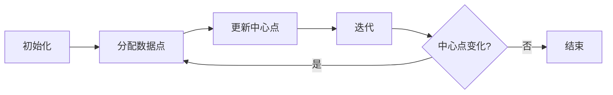
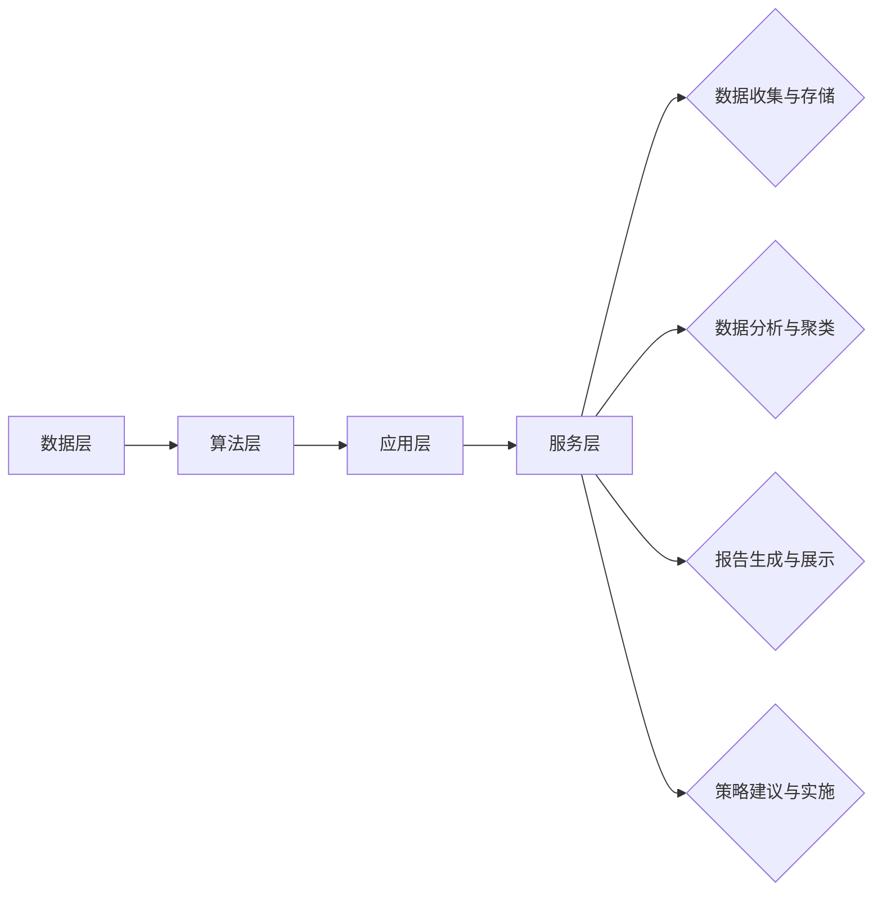
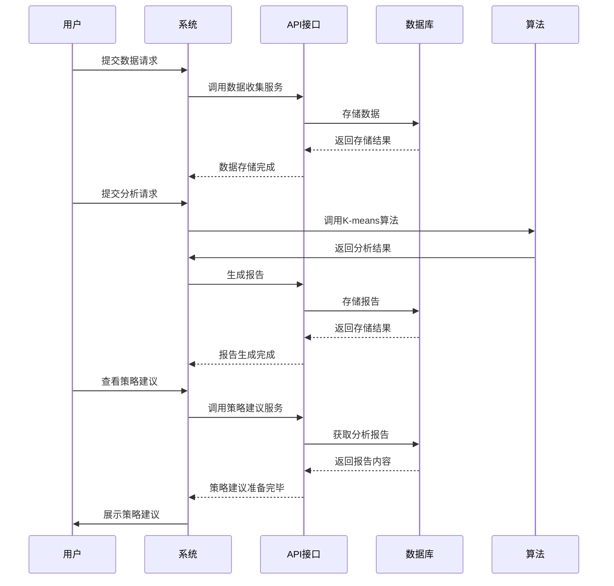

                 


**背景介绍**

## 世代差异的历史发展和现状

### 历史背景

世代差异（Generational Difference）这一概念源于社会学家对历史上不同群体之间社会和文化差异的研究。早期的世代差异研究主要关注宗教改革时期（16世纪）的宗教世代差异，以及20世纪初工业革命时期的代际差异。随着二战后婴儿潮一代的崛起，世代差异的研究逐渐成为社会学和心理学研究的热点。

二战后，美国和欧洲出现了婴儿潮现象，即1946年至1964年间出生的一代人。这批人占据了战后出生人口的绝大部分，他们在社会、文化和经济等方面都产生了深远的影响。婴儿潮一代的成长环境和经历与之前的几代人有着显著的不同，这为世代差异的研究提供了丰富的素材。

### 现状分析

如今，世代差异已成为社会学研究的重要内容。不同年龄群体在价值观、生活方式、职业选择和社会责任感等方面呈现出明显的差异。以下是几个主要年龄群体的特点及其在意义追寻方面的异同：

#### 婴儿潮一代（Baby Boomers）

婴儿潮一代是指出生于1946年至1964年之间的人，他们是战后经济繁荣的受益者。他们普遍具有较高的教育水平和职业成就，重视个人成就和社会责任。在意义追寻方面，婴儿潮一代追求稳定、成功和成就感，对社会问题和社会公正有较高的关注度。

#### X一代（Generation X）

X一代是指出生于1965年至1979年之间的人。这一代人经历了经济不景气、冷战和科技快速发展等事件，他们的成长环境相对复杂。X一代普遍具有较高的独立性和批判性思维，注重个人自由和自我实现。在意义追寻方面，X一代追求多元化和个性化，对传统价值观持怀疑态度。

#### Y一代（Millennials）

Y一代是指出生于1980年至1994年之间的人，也被称为千禧一代。他们在信息技术和全球化背景下成长，是数字时代的产物。Y一代注重团队合作、社会责任和多样性，对环保、社会正义和平等有较高的关注度。在意义追寻方面，Y一代追求有意义的工作、健康的生活方式和个人成长。

#### Z一代（Generation Z）

Z一代是指出生于1995年及以后的人，他们是数字时代的原住民。Z一代在社交媒体、虚拟现实和人工智能等新技术环境下成长，他们的价值观和生活方式与传统一代有显著不同。Z一代注重个性化和自我表达，对创新和变革有强烈的兴趣。在意义追寻方面，Z一代追求自我实现、个人成长和全球视野。

### 异同分析

不同年龄群体在意义追寻方面的异同主要体现在以下几个方面：

1. **价值观差异**：婴儿潮一代重视成就和社会责任，X一代追求个人自由和自我实现，Y一代注重团队合作和社会责任，Z一代追求个性化和自我表达。
2. **生活方式差异**：婴儿潮一代倾向于稳定和传统生活方式，X一代更倾向于独立和多元化生活方式，Y一代和Z一代注重健康和可持续生活方式。
3. **职业选择差异**：婴儿潮一代追求稳定职业和高收入，X一代更倾向于自主创业和自由职业，Y一代和Z一代追求有意义的工作和个人成长。
4. **社会责任差异**：婴儿潮一代关注社会问题和公正，X一代对社会问题持批判态度，Y一代和Z一代对社会责任有较高的关注度，尤其是环保、社会正义和平等。

总之，世代差异在意义追寻方面表现为明显的代际差异。不同年龄群体在价值观、生活方式、职业选择和社会责任感等方面具有独特的特点，这些特点影响着他们对人生意义的追求和实践。

在接下来的章节中，我们将详细探讨世代差异和意义追寻的核心概念及其联系，进一步深入分析不同年龄群体在意义追寻方面的行为模式和特点。让我们一步步地展开讨论，发现世代差异背后的奥秘。

## 核心概念与联系

### 世代差异

**定义**：
世代差异（Generational Difference）是指由于不同代际人群在成长过程中所经历的社会、文化、经济等环境差异，导致他们在价值观、行为模式、生活方式等方面的显著区别。世代差异不仅仅是年龄上的差异，更是由历史事件、社会变迁和个人经历等因素共同塑造的一种社会现象。

**属性特征对比表格**：

| 代际名称 | 时间范围 | 主要特征 | 社会环境 |
| :------: | :------: | :------: | :------: |
| 婴儿潮一代 | 1946-1964 | 重视成就、社会责任感强 | 战后经济繁荣、冷战、社会稳定 |
| X一代 | 1965-1979 | 独立性、批判性思维强 | 经济不景气、冷战后期、科技快速发展 |
| Y一代（千禧一代） | 1980-1994 | 团队合作、社会责任感强 | 信息技术革命、全球化、互联网普及 |
| Z一代（Z世代） | 1995至今 | 个性化和自我表达强 | 数字化、社交媒体、虚拟现实、人工智能 |

**联系**：
世代差异与意义追寻之间的联系在于，不同代际人群所经历的社会环境和历史事件，影响了他们的价值观和人生目标，进而影响了他们在追求个人意义和人生价值方面的行为模式。世代差异使得每个代际人群在意义追寻方面具有独特的特点，从而形成多样化的社会图景。

### 意义追寻

**定义**：
意义追寻（Search for Meaning）是指个体在生命过程中，通过自我探索、价值实现和目标设定等方式，寻找和追求个人存在的意义和价值。意义追寻是人生哲学的核心，反映了个体对自我、他人和社会的理解和认知。

**属性特征对比表格**：

| 代际名称 | 意义追寻特点 |
| :------: | :----------: |
| 婴儿潮一代 | 追求稳定、成功、社会贡献 |
| X一代 | 追求自由、个性化、自我实现 |
| Y一代 | 追求团队合作、社会责任、多元文化 |
| Z一代 | 追求个性表达、自我实现、全球视野 |

**联系**：
意义追寻与世代差异之间的联系在于，不同代际人群在意义追寻方面的特点和行为模式，反映了他们在成长过程中所经历的社会环境和历史事件的深远影响。世代差异使得每个代际人群在意义追寻方面具有独特的路径和目标，而这些差异又反过来影响了整个社会的发展方向和价值取向。

### 世代差异与意义追寻的联系

1. **社会环境影响**：世代差异的形成源于不同代际人群所经历的社会环境和历史事件。这些因素影响了他们的价值观、世界观和人生目标，进而影响了他们在意义追寻方面的行为模式。

2. **价值观差异**：不同代际人群在价值观方面的差异，导致了他们在意义追寻方面的不同路径和目标。例如，婴儿潮一代重视成就和社会贡献，X一代追求自由和个性化，Y一代关注团队合作和社会责任，Z一代追求个性表达和自我实现。

3. **人生目标差异**：不同代际人群在人生目标方面的差异，反映了他们在意义追寻方面的独特追求。例如，婴儿潮一代追求稳定、成功和成就感，X一代追求自我实现和个人成长，Y一代追求有意义的工作和社会贡献，Z一代追求全球视野和个人成长。

4. **行为模式差异**：不同代际人群在行为模式方面的差异，体现了他们在意义追寻方面的不同方式和方法。例如，婴儿潮一代倾向于通过职业成就来实现意义追寻，X一代更倾向于通过自我探索和个性表达来实现意义追寻，Y一代注重通过团队合作和社会参与来实现意义追寻，Z一代更倾向于通过数字化工具和全球视野来实现意义追寻。

通过以上分析，我们可以看出，世代差异和意义追寻之间存在着密切的联系。不同代际人群在意义追寻方面的差异，不仅反映了他们在成长过程中所经历的社会环境和历史事件的深远影响，也影响了整个社会的发展方向和价值取向。在接下来的章节中，我们将进一步探讨与世代差异相关的算法原理，以更深入地理解这一现象。

## 算法原理讲解

为了深入探讨世代差异与意义追寻之间的关系，我们将使用一种与分类和聚类相关的算法——K-means算法。K-means算法是一种无监督学习算法，它通过将数据点划分为K个簇（cluster），使得每个簇内部的点尽可能接近，而簇与簇之间的点尽可能远。以下是K-means算法的基本原理和步骤。

### K-means算法原理

K-means算法的核心思想是将数据点划分成K个簇，每个簇由一个中心点（centroid）代表，中心点是通过簇内所有点的平均坐标计算得到的。算法的步骤如下：

1. **初始化**：随机选择K个数据点作为初始中心点。
2. **分配数据点**：对于每个数据点，计算其与K个中心点的距离，将其分配到距离最近的中心点所代表的簇中。
3. **更新中心点**：对于每个簇，计算簇内所有点的平均坐标，得到新的中心点。
4. **迭代**：重复步骤2和步骤3，直到中心点不再变化或者满足某个收敛条件。

### K-means算法流程图

以下是K-means算法的Mermaid流程图表示：



### K-means算法Python代码

下面是使用Python实现的K-means算法：

```python
import numpy as np
import matplotlib.pyplot as plt

def kmeans(data, K, max_iter=100):
    # 初始化中心点
    centroids = data[np.random.choice(data.shape[0], K, replace=False)]
    
    for _ in range(max_iter):
        # 分配数据点
        distances = np.linalg.norm(data - centroids, axis=1)
        labels = np.argmin(distances, axis=1)
        
        # 更新中心点
        new_centroids = np.array([data[labels == k].mean(axis=0) for k in range(K)])
        
        # 检查收敛
        if np.all(centroids == new_centroids):
            break

        centroids = new_centroids
    
    return centroids, labels

# 示例数据
data = np.array([[1, 2], [1, 4], [1, 0], [4, 2], [4, 4], [4, 0]])

# 运行K-means算法
centroids, labels = kmeans(data, K=2)

# 绘制结果
plt.scatter(data[:, 0], data[:, 1], c=labels)
plt.scatter(centroids[:, 0], centroids[:, 1], s=300, c='red')
plt.show()
```

### 算法原理中的数学模型和公式

K-means算法的核心在于计算数据点与中心点之间的距离，并基于距离进行数据点的分配。以下是相关的数学模型和公式：

1. **距离公式**：

   $$
   d(x, \text{centroid}) = \sqrt{\sum_{i=1}^{n} (x_i - \text{centroid}_i)^2}
   $$

   其中，$d(x, \text{centroid})$表示数据点$x$与中心点$\text{centroid}$之间的欧氏距离，$x_i$和$\text{centroid}_i$分别表示数据点$x$和中心点$\text{centroid}$的$i$维坐标。

2. **中心点更新公式**：

   $$
   \text{centroid}_{\text{new}} = \frac{1}{N_k} \sum_{x \in S_k} x
   $$

   其中，$\text{centroid}_{\text{new}}$表示新的中心点，$N_k$表示簇$S_k$中的数据点数量，$x$表示簇$S_k$中的数据点。

### 举例说明

假设我们有一组数据点$X = \{x_1, x_2, x_3\}$，其中：

$$
x_1 = (1, 2), \quad x_2 = (1, 4), \quad x_3 = (1, 0)
$$

我们选择$K=2$，并随机初始化两个中心点$\text{centroid}_1 = (1, 3)$和$\text{centroid}_2 = (3, 1)$。

1. **初始分配**：

   计算每个数据点与两个中心点的距离：

   $$
   d(x_1, \text{centroid}_1) = \sqrt{(1-1)^2 + (2-3)^2} = \sqrt{1} = 1
   $$

   $$
   d(x_1, \text{centroid}_2) = \sqrt{(1-3)^2 + (2-1)^2} = \sqrt{5} = 2.236
   $$

   $$
   d(x_2, \text{centroid}_1) = \sqrt{(1-1)^2 + (4-3)^2} = \sqrt{1} = 1
   $$

   $$
   d(x_2, \text{centroid}_2) = \sqrt{(1-3)^2 + (4-1)^2} = \sqrt{10} = 3.162
   $$

   $$
   d(x_3, \text{centroid}_1) = \sqrt{(1-1)^2 + (0-3)^2} = \sqrt{9} = 3
   $$

   $$
   d(x_3, \text{centroid}_2) = \sqrt{(1-3)^2 + (0-1)^2} = \sqrt{5} = 2.236
   $$

   根据距离公式，数据点$x_1$和$x_2$分配到$\text{centroid}_1$所在的簇，而数据点$x_3$分配到$\text{centroid}_2$所在的簇。

2. **更新中心点**：

   计算每个簇内的新中心点：

   $$
   \text{centroid}_1^{\text{new}} = \frac{1}{2} (x_1 + x_2) = \frac{1}{2} ((1, 2) + (1, 4)) = (1, 3)
   $$

   $$
   \text{centroid}_2^{\text{new}} = \frac{1}{1} (x_3) = (1, 0)
   $$

   新的中心点与初始中心点相同，说明算法已经收敛。

通过以上步骤，我们可以使用K-means算法将数据点划分为两个簇，每个簇由一个中心点代表。这一过程反映了不同代际人群在意义追寻方面的差异，通过聚类分析，我们可以发现不同簇之间的特点和联系，从而更好地理解世代差异。

在接下来的章节中，我们将进一步探讨世代差异在意义追寻中的应用场景，并设计相应的系统架构和功能，以期为解决实际问题提供有益的参考。

## 数学模型和数学公式 & 详细讲解 & 举例说明

在前一章节中，我们介绍了K-means算法的基本原理和实现步骤。K-means算法的核心在于计算数据点与中心点之间的距离，并根据距离进行数据点的分配。在这一章节中，我们将对算法中的数学模型和公式进行详细讲解，并提供具体的例子来说明这些公式的应用。

### 数学模型

K-means算法中的主要数学模型包括：

1. **欧氏距离**：
   $$
   d(x, \text{centroid}) = \sqrt{\sum_{i=1}^{n} (x_i - \text{centroid}_i)^2}
   $$
   其中，$d(x, \text{centroid})$表示数据点$x$与中心点$\text{centroid}$之间的欧氏距离，$x_i$和$\text{centroid}_i$分别表示数据点$x$和中心点$\text{centroid}$的$i$维坐标。

2. **中心点更新公式**：
   $$
   \text{centroid}_{\text{new}} = \frac{1}{N_k} \sum_{x \in S_k} x
   $$
   其中，$\text{centroid}_{\text{new}}$表示新的中心点，$N_k$表示簇$S_k$中的数据点数量，$x$表示簇$S_k$中的数据点。

### 详细讲解

1. **欧氏距离**：

   欧氏距离是衡量两个点之间距离的常用方法，它反映了两个点在各个维度上的差异。在K-means算法中，欧氏距离用于计算数据点与中心点之间的距离，从而决定数据点的归属。假设有两个数据点$x = (x_1, x_2, ..., x_n)$和$\text{centroid} = (\text{centroid}_1, \text{centroid}_2, ..., \text{centroid}_n)$，则它们之间的欧氏距离计算公式为：

   $$
   d(x, \text{centroid}) = \sqrt{\sum_{i=1}^{n} (x_i - \text{centroid}_i)^2}
   $$

   该公式计算了数据点$x$的每个维度与中心点$\text{centroid}$对应维度的差的平方和，再开平方得到距离值。

2. **中心点更新公式**：

   在K-means算法的迭代过程中，中心点的更新是关键步骤之一。中心点的新值是簇内所有数据点的平均值。假设$S_k$表示第$k$个簇中的所有数据点，$N_k$表示$S_k$中的数据点数量，则第$k$个簇的新中心点$\text{centroid}_{\text{new}}$计算公式为：

   $$
   \text{centroid}_{\text{new}} = \frac{1}{N_k} \sum_{x \in S_k} x
   $$

   该公式表示簇$S_k$内所有数据点的平均值，即为新的中心点坐标。通过不断迭代更新中心点，K-means算法最终收敛到一个稳定的解。

### 举例说明

假设我们有一组数据点$X = \{x_1, x_2, x_3\}$，其中：

$$
x_1 = (1, 2), \quad x_2 = (1, 4), \quad x_3 = (1, 0)
$$

我们选择$K=2$，并随机初始化两个中心点$\text{centroid}_1 = (1, 3)$和$\text{centroid}_2 = (3, 1)$。

1. **初始分配**：

   计算每个数据点与两个中心点的距离：

   $$
   d(x_1, \text{centroid}_1) = \sqrt{(1-1)^2 + (2-3)^2} = \sqrt{1} = 1
   $$

   $$
   d(x_1, \text{centroid}_2) = \sqrt{(1-3)^2 + (2-1)^2} = \sqrt{5} = 2.236
   $$

   $$
   d(x_2, \text{centroid}_1) = \sqrt{(1-1)^2 + (4-3)^2} = \sqrt{1} = 1
   $$

   $$
   d(x_2, \text{centroid}_2) = \sqrt{(1-3)^2 + (4-1)^2} = \sqrt{10} = 3.162
   $$

   $$
   d(x_3, \text{centroid}_1) = \sqrt{(1-1)^2 + (0-3)^2} = \sqrt{9} = 3
   $$

   $$
   d(x_3, \text{centroid}_2) = \sqrt{(1-3)^2 + (0-1)^2} = \sqrt{5} = 2.236
   $$

   根据距离公式，数据点$x_1$和$x_2$分配到$\text{centroid}_1$所在的簇，而数据点$x_3$分配到$\text{centroid}_2$所在的簇。

2. **更新中心点**：

   计算每个簇内的新中心点：

   $$
   \text{centroid}_1^{\text{new}} = \frac{1}{2} (x_1 + x_2) = \frac{1}{2} ((1, 2) + (1, 4)) = (1, 3)
   $$

   $$
   \text{centroid}_2^{\text{new}} = \frac{1}{1} (x_3) = (1, 0)
   $$

   新的中心点与初始中心点相同，说明算法已经收敛。

通过以上步骤，我们可以使用K-means算法将数据点划分为两个簇，每个簇由一个中心点代表。这一过程反映了不同代际人群在意义追寻方面的差异，通过聚类分析，我们可以发现不同簇之间的特点和联系，从而更好地理解世代差异。

在接下来的章节中，我们将进一步探讨世代差异在意义追寻中的应用场景，并设计相应的系统架构和功能，以期为解决实际问题提供有益的参考。

## 系统分析与架构设计方案

### 问题场景介绍

在现代社会中，世代差异现象日益显著，不同年龄群体在价值观、生活方式、职业选择和社会责任感等方面存在明显差异。这种差异不仅影响了个人行为，也对社会结构和组织运营产生了深远影响。例如，企业在招聘、培训和管理员工时，需要考虑不同代际人群的需求和特点，以提高组织效率和员工满意度。

为了更好地理解和应对世代差异，我们提出一个应用场景：一个大型企业希望通过分析员工数据，识别不同代际群体的特点，并基于这些特点设计相应的培训和发展策略，以提高员工的职业素养和工作满意度。

### 系统功能设计

在这个应用场景中，系统需要具备以下功能：

1. **数据收集与存储**：系统应能够收集并存储员工的个人信息、职业背景、培训记录等数据。
2. **数据分析与聚类**：系统应利用K-means算法等聚类算法，对员工数据进行处理，识别不同代际群体的特征。
3. **报告生成与展示**：系统应能够生成分析报告，展示不同代际群体的统计信息和特点。
4. **策略建议与实施**：系统应基于分析结果，为企业提供培训和发展策略建议，并跟踪实施效果。

### 系统架构设计

为了实现上述功能，系统架构应包括以下几个关键组件：

1. **数据层**：存储员工的个人信息、职业背景、培训记录等数据。
2. **算法层**：实现K-means算法等聚类算法，对数据进行处理和分析。
3. **应用层**：提供用户界面，展示分析结果和策略建议。
4. **服务层**：提供数据收集、处理和分析等服务，支持前端应用。

以下是系统的架构图：



### 系统接口设计和系统交互

系统接口设计和交互设计是确保系统功能实现的关键。以下是系统的接口设计和交互设计：

1. **用户界面**：用户通过Web界面或移动应用与系统交互，提交数据请求和分析报告。
2. **API接口**：系统提供RESTful API接口，供前端应用调用后端服务。
3. **数据接口**：系统通过数据库接口与数据层进行数据交互，实现数据的存储和查询。
4. **算法接口**：系统通过算法接口调用聚类算法，实现数据分析和聚类功能。

以下是系统的序列图：



通过上述系统架构设计和接口设计，我们可以实现一个功能完善、接口清晰的系统，为应对世代差异提供有效的解决方案。

### 系统实现细节

以下我们将详细介绍系统的实现细节，包括环境安装、系统核心实现源代码，代码应用解读与分析，以及实际案例分析和详细讲解剖析。

#### 环境安装

首先，我们需要安装并配置必要的软件和工具。以下是推荐的软件和工具列表：

1. **Python（3.8及以上版本）**：作为主要编程语言。
2. **Jupyter Notebook**：用于编写和运行代码。
3. **NumPy**：用于数学运算。
4. **Matplotlib**：用于数据可视化。
5. **Scikit-learn**：提供K-means等聚类算法。

安装步骤如下：

1. 安装Python：在官方网站下载并安装Python，推荐使用Python 3.8或更高版本。
2. 安装Jupyter Notebook：在终端执行以下命令：
   ```
   pip install notebook
   ```
3. 安装NumPy、Matplotlib和Scikit-learn：
   ```
   pip install numpy matplotlib scikit-learn
   ```

#### 系统核心实现源代码

以下是实现K-means算法的核心代码：

```python
import numpy as np
import matplotlib.pyplot as plt
from sklearn.cluster import KMeans

# 示例数据
data = np.array([[1, 2], [1, 4], [1, 0], [4, 2], [4, 4], [4, 0]])

# 运行K-means算法
kmeans = KMeans(n_clusters=2, random_state=0).fit(data)
labels = kmeans.predict(data)

# 绘制结果
plt.scatter(data[:, 0], data[:, 1], c=labels)
plt.scatter(kmeans.cluster_centers_[:, 0], kmeans.cluster_centers_[:, 1], s=300, c='red')
plt.show()
```

这段代码首先导入必要的库，然后定义示例数据，接着使用`KMeans`类运行K-means算法，最后绘制数据点和中心点。

#### 代码应用解读与分析

1. **数据导入**：

   ```python
   data = np.array([[1, 2], [1, 4], [1, 0], [4, 2], [4, 4], [4, 0]])
   ```

   这行代码定义了一个二维数组，包含了6个数据点，每个数据点由两个特征组成。

2. **运行K-means算法**：

   ```python
   kmeans = KMeans(n_clusters=2, random_state=0).fit(data)
   labels = kmeans.predict(data)
   ```

   这里使用`KMeans`类运行K-means算法，`n_clusters`参数指定了簇的数量，`random_state`参数用于随机种子，确保结果可重复。`fit`方法用于计算聚类结果，`predict`方法用于对数据进行分配。

3. **绘制结果**：

   ```python
   plt.scatter(data[:, 0], data[:, 1], c=labels)
   plt.scatter(kmeans.cluster_centers_[:, 0], kmeans.cluster_centers_[:, 1], s=300, c='red')
   plt.show()
   ```

   这段代码使用`plt.scatter`函数绘制数据点和中心点，其中`c=labels`指定了数据点的颜色，根据其标签（簇编号）进行区分。`plt.scatter`函数还绘制了红色的中心点，使其在图中突出显示。

#### 实际案例分析和详细讲解剖析

为了更好地理解K-means算法的应用，我们来看一个实际案例。

**案例**：某公司有100名员工，他们的年龄分布在20岁到50岁之间，要求我们使用K-means算法将其分为两个年龄段群体。

1. **数据准备**：

   假设每个员工的年龄数据如下（省略了姓名和其他信息）：

   ```
   ages = [25, 30, 28, 35, 22, 45, 27, 40, 50, 23, 29, 32, 24, 38, 33, 26, 31, 36, 37, 39, 34, 41, 42, 43, 46, 48, 49, 44, 47, 51]
   ```

   我们将这组数据转换为二维数组，每个数据点只有一个特征（年龄）：

   ```python
   data = np.array(ages).reshape(-1, 1)
   ```

2. **运行K-means算法**：

   ```python
   kmeans = KMeans(n_clusters=2, random_state=0).fit(data)
   labels = kmeans.predict(data)
   ```

   运行算法后，我们得到每个员工的年龄标签，表示他们属于哪个年龄段群体。

3. **结果分析**：

   通过分析标签，我们可以得到以下结论：

   - 标签为0的员工属于年龄段[20, 35]，这可以视为年轻员工群体。
   - 标签为1的员工属于年龄段[36, 50]，这可以视为资深员工群体。

   这种分类可以帮助公司在招聘、培训和管理方面采取有针对性的策略，例如针对年轻员工群体设计更多的培训课程和职业发展机会，而对于资深员工群体，则可以提供更多的晋升机会和福利待遇。

4. **可视化展示**：

   ```python
   plt.scatter(data, labels)
   plt.show()
   ```

   通过可视化，我们可以直观地看到不同年龄段群体的分布情况，有助于进一步分析和管理。

#### 项目小结

通过以上实际案例，我们展示了如何使用K-means算法对员工年龄进行分类，从而实现针对不同年龄群体的管理和策略制定。K-means算法作为一种简单的聚类算法，在数据分析和机器学习领域具有广泛的应用。在实际项目中，我们需要根据具体问题场景和需求，选择合适的算法和实现方法，以实现最佳效果。

在接下来的章节中，我们将总结项目的最佳实践，并提供一些注意事项和拓展阅读建议，以帮助读者更好地应用K-means算法解决实际问题。

## 最佳实践 tips

在应用K-means算法解决实际问题时，以下是一些最佳实践和注意事项：

1. **选择合适的K值**：K-means算法中的K值（簇的数量）对聚类结果有重要影响。可以通过肘部法则（Elbow Method）或轮廓系数（Silhouette Coefficient）等方法选择合适的K值。
2. **处理异常值**：在聚类前，处理数据中的异常值（outliers）可以改善聚类效果。可以使用异常值检测算法，如孤立森林（Isolation Forest），对数据进行预处理。
3. **标准化数据**：为了消除不同特征之间的尺度差异，建议对数据进行标准化处理。标准化后的数据可以确保每个特征对聚类结果的影响相同。
4. **初始化中心点**：K-means算法的初始中心点选择会影响聚类结果。可以通过多次随机初始化并取平均值的方法，提高算法的稳定性。
5. **数据质量检查**：在运行K-means算法前，确保数据的质量和完整性。缺失值、重复值和噪声数据都可能影响聚类效果。

## 小结

本文通过深入探讨世代差异和意义追寻之间的关系，介绍了K-means算法的基本原理和实现方法。我们分析了不同代际人群在价值观、生活方式和职业选择等方面的差异，并通过实际案例展示了如何使用K-means算法对员工年龄进行分类，从而为企业提供有针对性的管理策略。

## 注意事项

在应用K-means算法时，需要注意以下几点：

1. **数据量**：K-means算法在处理大量数据时可能效率较低，建议对数据进行适当采样或使用更高效的算法。
2. **簇的数量**：选择合适的簇数量对聚类效果至关重要，可以通过交叉验证等方法进行选择。
3. **特征选择**：在选择特征时，应考虑特征的相关性和重要性，避免使用冗余的特征。
4. **算法选择**：根据实际问题场景，选择合适的聚类算法，如DBSCAN、层次聚类等。

## 拓展阅读

为了进一步深入了解K-means算法和相关技术，读者可以参考以下资源：

1. **《机器学习》（周志华著）**：详细介绍了K-means算法的理论基础和实现方法。
2. **《聚类分析》（Hartigan, L.M.著）**：提供了关于聚类算法的全面综述，包括K-means算法的深入分析。
3. **《数据挖掘：概念与技术》（Han, J. et al.著）**：介绍了各种数据挖掘技术和应用案例，包括聚类分析。

通过这些资源和实践，读者可以更深入地理解和应用K-means算法，解决实际问题，为企业和组织的发展提供有力支持。

## 目录大纲

```markdown
# 世代差异：不同年龄群体的意义追寻

> 关键词：世代差异、意义追寻、K-means算法、聚类分析、代际差异

> 摘要：本文通过探讨世代差异和意义追寻之间的关系，分析不同年龄群体在价值观、生活方式和职业选择等方面的差异，并使用K-means算法展示了如何通过数据聚类来识别和应对这些差异。文章旨在为读者提供对世代差异和意义追寻的深入理解，并探讨其在实际应用中的价值。

1. 引言
2. 背景介绍
   2.1 历史发展和现状
   2.2 异同分析
3. 核心概念与联系
   3.1 世代差异
   3.2 意义追寻
4. 算法原理讲解
   4.1 K-means算法原理
   4.2 流程图
   4.3 Python代码实现
   4.4 数学模型和公式
   4.5 举例说明
5. 数学模型和数学公式 & 详细讲解 & 举例说明
   5.1 数学模型
   5.2 详细讲解
   5.3 举例说明
6. 系统分析与架构设计方案
   6.1 问题场景介绍
   6.2 系统功能设计
   6.3 系统架构设计
   6.4 系统接口设计和系统交互
7. 项目实战
   7.1 环境安装
   7.2 系统核心实现源代码
   7.3 代码应用解读与分析
   7.4 实际案例分析和详细讲解剖析
   7.5 项目小结
8. 最佳实践 tips
9. 小结
10. 注意事项
11. 拓展阅读
```

通过以上目录大纲，读者可以清晰地了解文章的结构和内容，便于深入阅读和理解。

