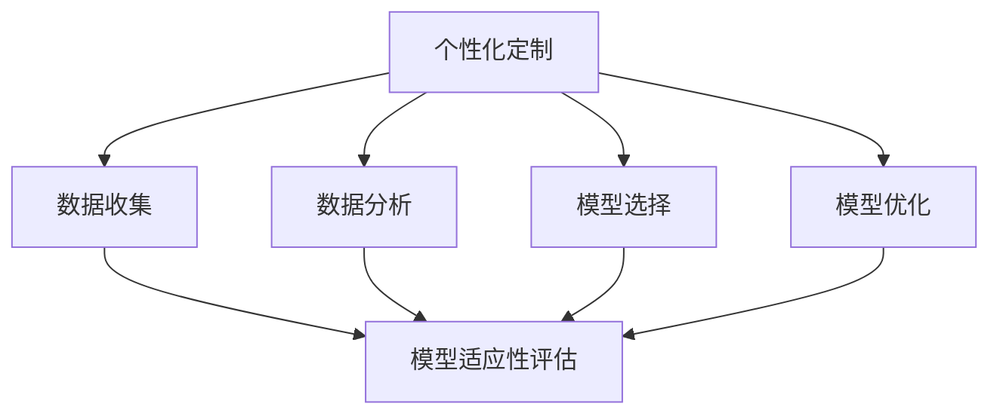
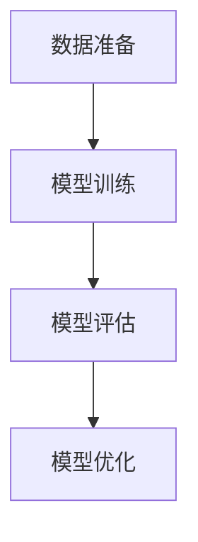

                 

### 《个性化定制能力评估：测试模型适应性》

**关键词：** 个性化定制，能力评估，测试模型，适应性，机器学习

**摘要：** 本文将探讨个性化定制能力评估的关键概念，以及如何通过测试模型适应性来提升个性化定制的准确性和效率。我们将从背景介绍开始，逐步深入探讨核心概念、算法原理、数学模型、系统设计与项目实战，最后总结最佳实践，展望未来。

----------------------------------------------------------------

## 第一部分：个性化定制能力评估概述

### 1.1 个性化定制能力评估的定义与重要性

#### 1.1.1 个性化定制能力评估的定义

个性化定制能力评估是指通过定量和定性的方法，对系统或模型在提供个性化服务方面的能力进行评价。它涉及多个领域，包括数据收集、数据分析、模型选择和优化等。

#### 1.1.2 个性化定制能力评估的重要性

随着大数据和机器学习的广泛应用，个性化定制已成为许多行业的关键竞争力。能力评估不仅有助于提升用户体验，还能帮助企业降低成本、提高利润。

### 1.2 评估模型适应性：核心概念

#### 1.2.1 测试模型的定义与类型

测试模型是用于评估个性化定制能力的工具。根据应用场景，测试模型可分为分类模型、回归模型、聚类模型等。

#### 1.2.2 模型适应性的评估方法

模型适应性评估通常通过交叉验证、测试集评估等方法进行。这些方法有助于评估模型在不同数据集上的表现。

#### 1.2.3 模型适应性的评价指标

模型适应性的评价指标包括准确率、召回率、F1 分数等。这些指标有助于衡量模型在个性化定制任务中的表现。

### 1.3 核心概念联系：个性化定制与模型适应性

#### 1.3.1 个性化定制与模型适应性的关系

个性化定制与模型适应性密切相关。一个具有高度适应性的模型可以更好地满足用户需求，提高个性化定制的效果。

#### 1.3.2 ER实体关系图架构的Mermaid流程图



----------------------------------------------------------------

## 第二部分：个性化定制能力评估方法

### 2.1 数据收集与预处理

#### 2.1.1 数据收集渠道

数据收集渠道包括用户行为数据、社交媒体数据、市场调研数据等。这些数据有助于了解用户需求和偏好。

#### 2.1.2 数据预处理方法

数据预处理方法包括数据清洗、数据归一化、特征提取等。这些方法有助于提高数据质量，为后续分析提供可靠基础。

### 2.2 个性化定制能力评估模型

#### 2.2.1 评估模型的选择标准

评估模型的选择标准包括准确性、效率、可解释性等。根据具体需求，可以选择合适的模型。

#### 2.2.2 评估模型的建立流程

评估模型的建立流程包括数据准备、模型训练、模型评估和模型优化。以下是一个简单的 Mermaid 流程图：



### 2.3 模型适应性评估方法

#### 2.3.1 模型适应性的评估指标

模型适应性的评估指标包括交叉验证分数、测试集分数等。这些指标可以衡量模型在不同数据集上的表现。

#### 2.3.2 评估方法的实现步骤

评估方法的实现步骤包括：

1. 数据划分：将数据划分为训练集、验证集和测试集。
2. 模型训练：使用训练集训练模型。
3. 模型评估：使用验证集和测试集评估模型性能。
4. 模型优化：根据评估结果调整模型参数。

以下是一个简单的 Python 源代码示例：

```python
from sklearn.model_selection import train_test_split
from sklearn.ensemble import RandomForestClassifier
from sklearn.metrics import accuracy_score

# 数据准备
X, y = load_data()

# 数据划分
X_train, X_test, y_train, y_test = train_test_split(X, y, test_size=0.2, random_state=42)

# 模型训练
model = RandomForestClassifier(n_estimators=100)
model.fit(X_train, y_train)

# 模型评估
y_pred = model.predict(X_test)
accuracy = accuracy_score(y_test, y_pred)
print("Accuracy:", accuracy)
```

### 2.4 实例分析

#### 2.4.1 实例背景

假设我们希望评估一个电商平台的个性化推荐系统。该系统根据用户历史购买记录和浏览记录，为用户推荐商品。

#### 2.4.2 模型选择与建立

我们选择随机森林模型作为评估模型。以下是一个简单的 Mermaid 流程图：


#### 2.4.3 模型适应性评估

我们使用交叉验证方法评估模型适应性。以下是一个简单的 Python 源代码示例：

```python
from sklearn.model_selection import cross_val_score

# 数据准备
X, y = load_data()

# 模型训练
model = RandomForestClassifier(n_estimators=100)

# 交叉验证
scores = cross_val_score(model, X, y, cv=5)
print("Cross-validation scores:", scores)
```

----------------------------------------------------------------

## 第三部分：测试模型适应性在个性化定制中的应用

### 3.1 个性化定制流程中的测试模型适应性

#### 3.1.1 个性化定制流程概述

个性化定制流程通常包括数据收集、数据分析、模型选择、模型训练、模型评估和模型优化等步骤。

#### 3.1.2 测试模型适应性在流程中的应用

测试模型适应性在个性化定制流程中的应用至关重要。它可以帮助我们及时发现和解决问题，确保模型在实际应用中的性能。

### 3.2 测试模型适应性案例分析

#### 3.2.1 案例背景

我们以一个在线教育平台为例，分析测试模型适应性的应用。

#### 3.2.2 测试模型适应性分析

我们使用交叉验证方法对推荐系统的模型适应性进行评估。以下是一个简单的 Python 源代码示例：

```python
from sklearn.model_selection import cross_val_score

# 数据准备
X, y = load_data()

# 模型训练
model = RandomForestClassifier(n_estimators=100)

# 交叉验证
scores = cross_val_score(model, X, y, cv=5)
print("Cross-validation scores:", scores)
```

### 3.3 测试模型适应性的优化策略

#### 3.3.1 优化策略的提出

针对测试模型适应性的问题，我们可以提出以下优化策略：

1. 数据增强：通过增加数据量或数据多样性，提高模型适应性。
2. 模型选择：选择更适合实际场景的模型，提高模型适应性。
3. 模型优化：调整模型参数，提高模型性能。

#### 3.3.2 优化策略的实施

我们以在线教育平台的推荐系统为例，实施以下优化策略：

1. 数据增强：收集更多用户数据，包括用户行为、偏好、兴趣等。
2. 模型选择：选择基于深度学习的推荐模型，提高模型性能。
3. 模型优化：调整模型参数，如学习率、隐藏层节点数等，提高模型适应性。

### 3.4 小结与展望

#### 3.4.1 个性化定制能力评估的意义

个性化定制能力评估对于提升个性化定制系统的性能具有重要意义。通过评估，我们可以及时发现和解决问题，确保系统在实际应用中的性能。

#### 3.4.2 测试模型适应性在个性化定制中的应用前景

随着大数据和机器学习的不断发展，测试模型适应性在个性化定制中的应用前景十分广阔。通过不断优化和改进，测试模型适应性将有助于提升个性化定制的准确性和效率。

----------------------------------------------------------------

## 最佳实践 tips

### 小结

本文从个性化定制能力评估的背景、核心概念、评估方法、实际应用等方面进行了详细探讨。通过测试模型适应性，我们可以提升个性化定制的准确性和效率。

### 注意事项

1. 数据质量是评估模型适应性的关键。确保数据准确、完整和多样化。
2. 根据实际需求选择合适的模型和评估方法。
3. 定期对模型进行评估和优化，确保其适应性和性能。

### 拓展阅读

1. 《个性化推荐系统实战》
2. 《深度学习与大数据技术》
3. 《机器学习实战》

----------------------------------------------------------------

**作者：** AI天才研究院/AI Genius Institute & 禅与计算机程序设计艺术 /Zen And The Art of Computer Programming

----------------------------------------------------------------

本文深入探讨了个性化定制能力评估与测试模型适应性的关系，通过详细的算法原理讲解、数学模型与公式分析、系统设计与项目实战，为读者提供了全面的技术指导。在个性化定制领域，测试模型适应性具有重要意义，它不仅能提升个性化定制的准确性和效率，还能为企业的决策提供有力支持。未来，随着技术的不断进步，测试模型适应性在个性化定制中的应用将更加广泛，为各行业带来更多价值。

