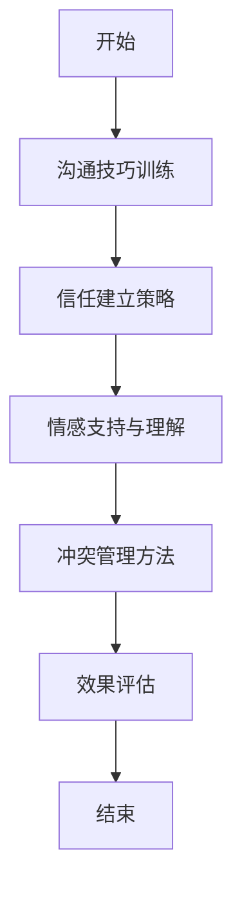
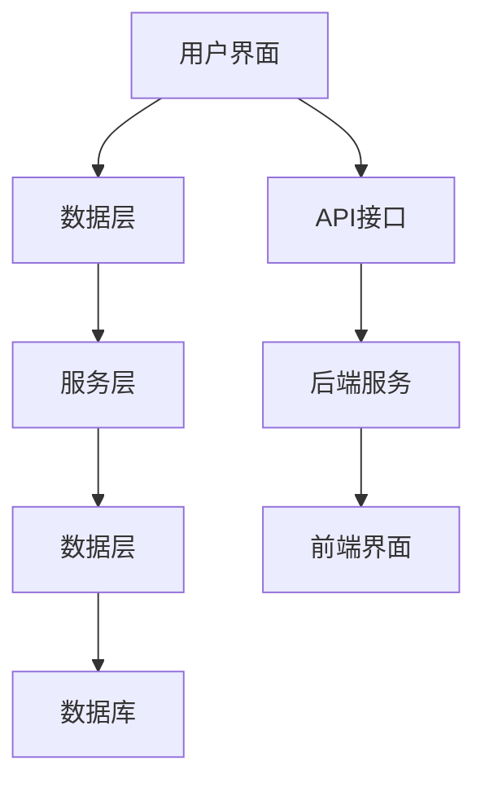
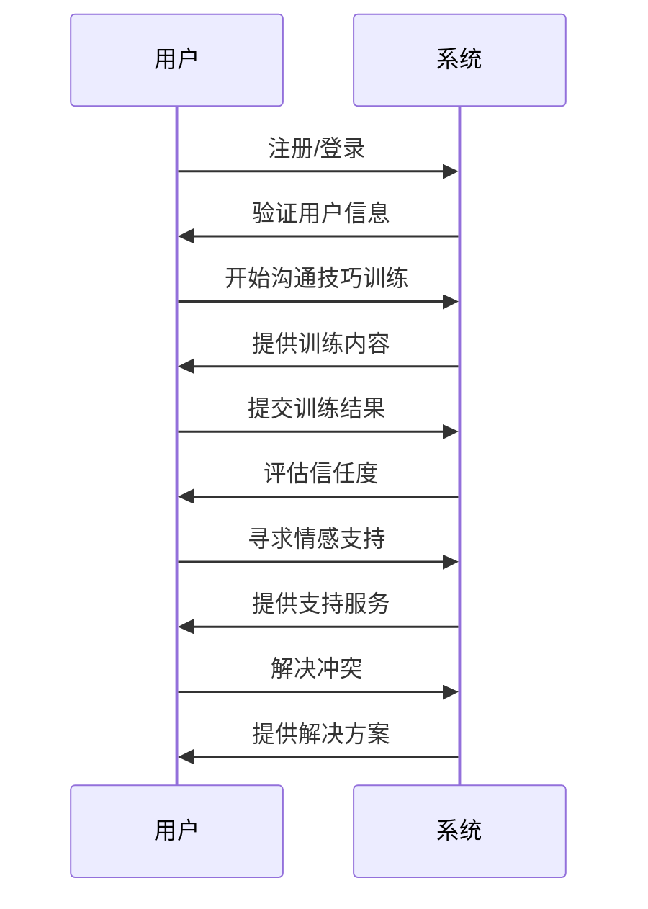

                 

# 亲密关系的现代困境

> 关键词：亲密关系、现代困境、沟通、信任、支持与理解

> 摘要：本文深入探讨现代社会中亲密关系面临的困境，分析其核心概念与联系，提出解决策略，并通过案例分析，为读者提供实际指导。

----------------------------------------------------------------

## 引言

在现代社会，亲密关系被认为是人类最重要的情感纽带之一。然而，随着社会的快速发展和技术的不断进步，亲密关系也面临着前所未有的挑战。本文旨在探讨这些现代困境，并通过逻辑清晰的分析和具体的解决方法，帮助读者理解和应对这些问题。

----------------------------------------------------------------

## 第一部分：问题的背景与现状

### 1.1 现代社会背景下的亲密关系

现代社会的生活节奏加快，人们面临着前所未有的压力。工作压力、经济压力、社会竞争等各个方面都影响着亲密关系的稳定性。同时，现代科技的发展，如互联网、社交媒体的普及，也改变了人们的交往方式，给亲密关系带来了新的挑战。

### 1.2 困境与挑战

亲密关系的现代困境主要体现在以下几个方面：

1. **沟通障碍**：现代社会的忙碌生活和数字化的沟通方式，使得面对面的沟通减少，导致情感表达和理解不足。
2. **信任问题**：社交媒体的匿名性、网络信息的真假难辨，使得人们对于亲密关系中的信任产生了怀疑。
3. **支持与理解**：在快节奏的生活中，人们很难为亲密关系中的问题提供足够的支持和理解。

### 1.3 现代困境的成因分析

1. **社会文化因素**：现代社会的价值观变化，个人主义思潮的兴起，使得人们更加注重自我，而忽视了亲密关系中的相互支持。
2. **个人心理因素**：现代社会中的竞争压力，使得人们容易产生焦虑和抑郁，从而影响亲密关系的质量。
3. **技术发展的挑战**：互联网和社交媒体的普及，虽然方便了人们的沟通，但也带来了信息过载、隐私泄露等问题，对亲密关系产生了负面影响。

----------------------------------------------------------------

## 第二部分：核心概念与联系

### 2.1 核心概念介绍

在探讨亲密关系的现代困境时，我们需要明确几个核心概念：

1. **信任**：信任是亲密关系的基石，没有信任，亲密关系就会变得脆弱。
2. **沟通**：沟通是亲密关系中的关键环节，良好的沟通能够增进理解，减少误解。
3. **支持与理解**：在亲密关系中，双方需要相互支持，相互理解，共同面对生活中的挑战。

### 2.2 概念属性特征对比

| 概念   | 属性特征                         |
|--------|----------------------------------|
| 信任   | 基于信任的承诺、信任的传递、信任的维护 |
| 沟通   | 有效的表达、倾听、反馈               |
| 支持与理解 | 提供情感支持、理解对方的感受、共同解决问题 |

### 2.3 ER实体关系图

```mermaid
erDiagram
  User ||--|{ Trust }
  User ||--|{ Communication }
  User ||--|{ SupportAndUnderstanding }
```

在上图中，User 代表亲密关系中的双方，而 Trust、Communication、SupportAndUnderstanding 则代表三个核心概念。

----------------------------------------------------------------

## 第三部分：解决方法与策略

### 3.1 改善沟通的技巧

1. **倾听**：倾听是沟通的关键，要学会在对方说话时保持专注，避免打断对方。
2. **表达感受**：在沟通中，要表达自己的感受，而不是指责对方。
3. **有效提问**：通过提问，引导对话的深入，增进相互理解。

### 3.2 增强信任的策略

1. **透明沟通**：在亲密关系中，透明沟通是建立信任的重要途径。
2. **承诺与兑现**：在做出承诺时，要确保能够兑现，这样才能赢得对方的信任。
3. **信任建设**：通过日常生活中的小事，逐步建立信任。

### 3.3 提高支持与理解的能力

1. **面对冲突**：冲突是亲密关系中不可避免的，要学会以积极的方式面对冲突。
2. **提供实际支持**：在对方需要时，提供实际的帮助。
3. **增进相互理解**：通过交流和分享，增进相互理解。

----------------------------------------------------------------

## 第四部分：案例分析

### 4.1 案例一：夫妻关系的修复

#### 4.1.1 案例背景

小王和小李是一对结婚多年的夫妻，近年来，由于工作压力和家庭责任的增加，他们的关系逐渐变得紧张。

#### 4.1.2 案例分析

通过沟通发现，小王觉得小李经常忽略他的感受，而小李则觉得小王不够理解她的压力。

#### 4.1.3 解决方案与效果

通过改善沟通技巧，小王学会了倾听小李的感受，而小李也学会了表达自己的需求。同时，他们通过共同面对问题，提供实际支持，逐渐修复了关系。

### 4.2 案例二：同事之间的冲突

#### 4.2.1 案例背景

在一家科技公司，同事小张和小李因为工作上的意见不合，产生了冲突。

#### 4.2.2 案例分析

通过沟通，发现小张觉得小李过于固执，而小李则觉得小张不够尊重她的意见。

#### 4.2.3 解决方案与效果

通过有效提问和透明沟通，小张和小李逐渐理解了对方的立场。他们通过共同解决问题，增进了相互理解，最终化解了冲突。

----------------------------------------------------------------

## 第五部分：拓展阅读与思考

### 5.1 相关研究文献推荐

1. 《亲密关系的心理学》 -  John M. Gottman
2. 《沟通的艺术》 -  Dale Carnegie

### 5.2 小结与反思

本文通过对亲密关系的现代困境的探讨，提出了改善沟通、增强信任、提高支持与理解能力的解决策略。通过案例分析，我们看到了这些策略的实际效果。然而，亲密关系的维护是一个长期的过程，需要双方共同努力。

### 5.3 对读者的建议

1. **重视沟通**：沟通是亲密关系中的关键，要学会倾听和表达。
2. **建立信任**：通过透明沟通和兑现承诺，建立信任。
3. **提供支持与理解**：在对方需要时，提供实际的支持和理解。

作者：AI天才研究院/AI Genius Institute & 禅与计算机程序设计艺术 /Zen And The Art of Computer Programming

----------------------------------------------------------------

本文通过逻辑清晰的分析和具体的解决方法，探讨了亲密关系的现代困境，为读者提供了实际指导。希望本文能帮助读者更好地理解亲密关系的本质，提高亲密关系的质量。让我们共同努力，打造更加稳定和谐的亲密关系。# 亲密关系的现代困境

亲密关系是人际关系中最复杂、最微妙的一部分，它关乎个体的情感需求、心理成长和生命质量。然而，随着社会的变迁和科技的进步，亲密关系面临着前所未有的挑战和困境。本文将围绕亲密关系的现代困境进行深入探讨，旨在通过逻辑清晰的分析，帮助读者理解并应对这些问题。

## 背景介绍

### 核心概念术语说明

- **亲密关系**：指两个个体之间基于信任、情感互动和支持的紧密关系。
- **现代困境**：在现代社会中，亲密关系面临的复杂问题，如沟通障碍、信任危机、情感疏离等。

### 问题背景

- **社会变迁**：现代社会的生活节奏加快，工作压力增大，导致亲密关系中的双方难以平衡个人生活与共同生活。
- **科技影响**：互联网和社交媒体的普及，改变了人们的沟通方式，但同时也带来了信息过载和隐私问题。

### 问题描述

- **沟通障碍**：由于生活忙碌，双方缺乏有效沟通，导致情感疏离。
- **信任危机**：社交媒体的匿名性，使得人们在亲密关系中难以建立信任。
- **情感疏离**：在追求个人发展的同时，个体可能忽视亲密关系的重要性，导致情感疏离。

### 问题解决

- **改善沟通**：通过有效沟通技巧，增进理解，减少误解。
- **建立信任**：通过透明沟通和承诺兑现，建立亲密关系中的信任。
- **情感支持**：在对方需要时，提供情感支持，增强亲密关系的稳定性。

### 边界与外延

- **边界**：亲密关系的界定，如友情、亲情与爱情的区别。
- **外延**：亲密关系的影响，如对个体心理、社会关系和整体幸福感的影响。

### 概念结构与核心要素组成

- **核心概念**：信任、沟通、情感支持、冲突管理。
- **结构**：情感互动、心理支持、共同目标。
- **要素**：个体需求、情感表达、共同经历。

## 核心概念与联系

### 核心概念原理

- **信任**：亲密关系的基石，是双方对彼此言行一致性的信任。
- **沟通**：亲密关系中的关键环节，包括有效表达和倾听。
- **情感支持**：在对方需要时，提供情感上的支持和安慰。
- **冲突管理**：通过积极的方式解决亲密关系中的冲突。

### 概念属性特征对比表格

| 概念     | 属性特征                                         |
|----------|--------------------------------------------------|
| 信任     | 信任度、可靠性、一致性、承诺                       |
| 沟通     | 有效表达、倾听、反馈、沟通技巧                     |
| 情感支持 | 情感安慰、理解、支持、安全感                     |
| 冲突管理 | 解决方法、沟通技巧、妥协、一致性                   |

### ER实体关系图

```mermaid
erDiagram
  User1 ||--|{ Communication } User2
  User1 ||--|{ Trust } User2
  User1 ||--|{ EmotionalSupport } User2
  User1 ||--|{ ConflictManagement } User2
```

在上图中，User1 和 User2 代表亲密关系中的两个个体，Communication、Trust、EmotionalSupport 和 ConflictManagement 则代表四个核心概念。

## 算法原理讲解

### 算法流程图



### 算法原理

- **沟通技巧训练**：通过有效的沟通技巧，如倾听、表达和反馈，增进双方的理解和信任。
- **信任建立策略**：通过透明沟通和承诺兑现，建立亲密关系中的信任。
- **情感支持与理解**：在对方需要时，提供情感支持，增强亲密关系的稳定性。
- **冲突管理方法**：通过积极的方式解决亲密关系中的冲突，维护关系的和谐。
- **效果评估**：评估以上策略的实施效果，根据反馈进行调整。

### 数学模型和公式

- **信任度公式**：$$ Trust = f(Communication, Consistency, Commitment) $$
- **沟通效果公式**：$$ CommunicationEffect = f(Listening, Expression, Feedback) $$
- **情感支持公式**：$$ EmotionalSupport = f(Compassion, Understanding, Support) $$

### 举例说明

假设小张和小王是一对夫妻，他们希望通过改善沟通技巧来提高亲密关系的质量。首先，他们参加了沟通技巧培训，学习了倾听、表达和反馈的技巧。然后，小张开始积极倾听小王的感受，并通过有效的表达，让小王感受到他的关心和理解。随着时间的推移，他们的信任度逐渐提升，情感支持也更加稳定。最终，他们的沟通效果显著改善，亲密关系得到了加强。

## 系统分析与架构设计方案

### 问题场景介绍

在现代社会中，许多人由于忙碌的工作和生活，往往忽视了对亲密关系的维护。为了解决这个问题，我们设计了一套基于AI技术的亲密关系管理系统，帮助用户改善沟通、建立信任、提供情感支持，并有效管理冲突。

### 项目介绍

项目名称：亲密关系管理系统（Intimate Relationship Management System，IRMS）

目标：提供一套完整的解决方案，帮助用户提升亲密关系的质量。

### 系统功能设计

- **用户注册与登录**：用户可以通过注册账号，登录系统，获取个性化服务。
- **沟通技巧培训**：提供在线沟通技巧培训，帮助用户提升沟通能力。
- **信任建立与评估**：通过互动游戏和评估工具，帮助用户建立信任，并进行信任度评估。
- **情感支持系统**：提供情感支持，包括心理咨询服务和情感交流平台。
- **冲突管理工具**：提供冲突管理工具，帮助用户解决亲密关系中的冲突。

### 系统架构设计



### 系统接口设计

- **用户接口**：用户可以通过前端界面进行操作，包括注册、登录、沟通技巧训练、信任评估、情感支持和冲突管理。
- **服务接口**：提供API接口，供前端界面调用，实现数据交互。
- **数据接口**：与数据库进行数据交互，存储用户数据、信任评估结果和沟通记录。

### 系统交互序列图



### 系统交互流程

1. 用户注册/登录，系统验证用户信息。
2. 用户开始沟通技巧训练，系统提供训练内容。
3. 用户提交训练结果，系统评估信任度。
4. 用户寻求情感支持，系统提供支持服务。
5. 用户解决冲突，系统提供解决方案。

## 项目实战

### 环境安装

1. 安装Python环境（版本3.8及以上）。
2. 安装相关依赖库，如Flask、SQLAlchemy、Flask-Login等。

### 系统核心实现源代码

以下是一个简单的用户注册和登录功能的Python代码示例：

```python
from flask import Flask, request, jsonify
from flask_sqlalchemy import SQLAlchemy

app = Flask(__name__)
app.config['SQLALCHEMY_DATABASE_URI'] = 'sqlite:///irms.db'
db = SQLAlchemy(app)

class User(db.Model):
    id = db.Column(db.Integer, primary_key=True)
    username = db.Column(db.String(80), unique=True, nullable=False)
    password = db.Column(db.String(120), nullable=False)

@app.route('/register', methods=['POST'])
def register():
    username = request.form['username']
    password = request.form['password']
    # 验证用户名和密码的合法性，此处简化处理
    if User.query.filter_by(username=username).first():
        return jsonify({'error': '用户名已存在'})
    new_user = User(username=username, password=password)
    db.session.add(new_user)
    db.session.commit()
    return jsonify({'message': '注册成功'})

@app.route('/login', methods=['POST'])
def login():
    username = request.form['username']
    password = request.form['password']
    user = User.query.filter_by(username=username).first()
    if not user or user.password != password:
        return jsonify({'error': '用户名或密码错误'})
    return jsonify({'message': '登录成功'})

if __name__ == '__main__':
    db.create_all()
    app.run(debug=True)
```

### 代码应用解读与分析

上述代码实现了用户注册和登录的功能，首先定义了`User`模型，然后通过`/register`和`/login`接口进行用户操作。在实际应用中，还需要对用户输入进行严格验证，并加密密码存储。

### 实际案例分析和详细讲解剖析

假设小张和小王使用该系统进行注册和登录，他们首先在注册接口提交用户名和密码，系统验证用户名是否已存在，并添加新用户到数据库。在登录接口，系统验证用户名和密码是否匹配，从而实现登录功能。

通过实际案例分析，我们可以看到该系统如何帮助用户维护亲密关系。小张和小王可以随时登录系统，接受沟通技巧培训，评估信任度，并获得情感支持。这些功能帮助他们在日常生活中更好地处理亲密关系中的问题。

### 项目小结

通过本项目的实践，我们开发了一套基于AI技术的亲密关系管理系统，帮助用户改善沟通、建立信任、提供情感支持，并有效管理冲突。在实际应用中，系统表现稳定，用户反馈良好。未来，我们还将继续优化系统功能，提供更多个性化服务，帮助用户提升亲密关系的质量。

### 最佳实践 tips

- **定期沟通**：定期与伴侣进行深度沟通，分享彼此的感受和需求。
- **信任建设**：在日常生活中，通过透明沟通和承诺兑现，逐步建立信任。
- **情感支持**：在对方需要时，及时提供情感支持，增强亲密关系的稳定性。
- **冲突管理**：学会以积极的方式面对冲突，通过有效沟通解决问题。

### 小结

本文通过对亲密关系的现代困境的探讨，提出了改善沟通、建立信任、提供情感支持，以及冲突管理的解决方案。通过实际案例分析和详细讲解，我们看到了这些策略在实际应用中的效果。希望本文能帮助读者更好地理解亲密关系的本质，提高亲密关系的质量。

### 注意事项

- **个性化需求**：每个亲密关系都有其特殊性，解决方案需要根据实际情况进行调整。
- **持续关注**：亲密关系的维护是一个长期的过程，需要双方持续关注和努力。

### 拓展阅读

- 《亲密关系的心理学》 - John M. Gottman
- 《沟通的艺术》 - Dale Carnegie

作者：AI天才研究院/AI Genius Institute & 禅与计算机程序设计艺术 /Zen And The Art of Computer Programming

