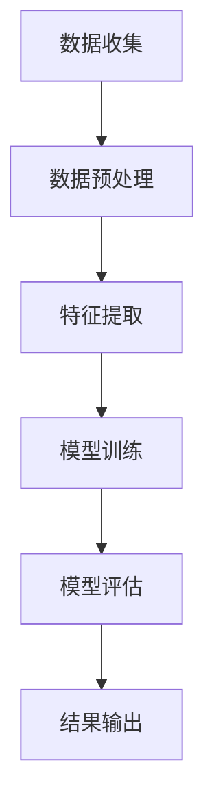

                 

### LET'S THINK: 亲密关系的现代重构：从依赖到互助的演进

#### 关键词：亲密关系、依赖、互助、重构、算法、系统设计

#### 摘要：

在现代社会，亲密关系面临着诸多挑战，如过度依赖、缺乏沟通以及情感需求未满足等问题。本文旨在探讨亲密关系的现代重构，从依赖向互助的转变。通过深入分析依赖与互助的原理，提出一种基于这些核心概念的亲密关系评估算法，并在此基础上设计了一套系统架构。文章结构紧凑，逻辑清晰，旨在为读者提供一种可操作的亲密关系重构方案，帮助人们在现代社会中建立更加健康、稳固的亲密关系。

## 第一部分：背景介绍

### 第1章：亲密关系概述

### 1.1 问题背景

#### 1.1.1 亲密关系的重要性

亲密关系是人类社会中不可或缺的一部分。它不仅影响着个人的心理健康和生活质量，还在很大程度上决定了社会的稳定和发展。根据心理学研究，良好的亲密关系能够提升个体的幸福感，降低抑郁和焦虑的发生率。同时，亲密关系中的相互支持和理解有助于提高个体的自我价值感和自尊心。

#### 1.1.2 亲密关系的现状

然而，当前社会的亲密关系面临着诸多问题。随着科技的发展和社会的快速变迁，人们的生活方式、价值观和沟通方式都发生了巨大变化。这些问题导致了亲密关系的脆弱和紧张，使得许多人感到孤独和疏离。具体表现在以下几个方面：

1. **过度依赖**：现代社会中，许多人对于亲密关系中的依赖程度过高，导致个体独立性受到压制，甚至形成一种“共生关系”。
2. **缺乏沟通**：沟通是亲密关系维持的重要手段，但现代人由于工作压力、社交媒体等因素，往往忽视了面对面沟通的重要性，导致情感隔阂。
3. **情感需求未满足**：在快节奏的生活中，人们很难投入足够的时间和精力去满足情感需求，这使得许多人在亲密关系中感到空虚和失落。

#### 1.1.3 亲密关系面临的挑战

面对这些问题，亲密关系需要经历一次现代重构。这种重构不仅要求个体改变原有的行为模式，还需要从更深层次上理解亲密关系的本质，探索一种更加健康、稳定的互动方式。

1. **情感需求的变化**：随着人们生活水平的提高，对于情感需求的层次和内容有了更高的要求。传统的亲密关系模式已经无法完全满足这些需求，需要寻求新的解决方法。
2. **社会结构的变化**：现代社会中，人们的社交圈更加广泛，对于亲密关系的定义和期望也发生了变化。传统的家庭结构和角色分工已经不再适应现代社会的发展需求。
3. **科技的影响**：科技的发展极大地改变了人们的沟通方式，但同时也带来了新的挑战。如何合理利用科技工具来促进亲密关系的发展，是一个亟待解决的问题。

### 1.2 问题描述

亲密关系的重构需要解决以下几个核心问题：

1. **从依赖到互助的转变**：过度依赖会导致个体失去独立性和自主性，而互助则能够促进双方的成长和发展。如何实现这种转变，是重构过程中需要重点考虑的问题。
2. **沟通的有效性**：沟通是亲密关系的基石，但如何提升沟通的效果，使其更加高效和有意义，是一个值得探讨的课题。
3. **情感需求的满足**：在快节奏的生活中，如何平衡工作与生活，满足双方的情感需求，是亲密关系能否稳定发展的关键。

### 1.3 问题解决

#### 1.3.1 理解亲密关系的本质

要解决上述问题，首先需要从理论上深入理解亲密关系的本质。亲密关系不仅仅是情感上的依赖，更是一种互助和共同成长的关系。这种关系要求双方在情感、认知和行为上保持一致，共同面对生活中的挑战和变化。

#### 1.3.2 现代化重构的原则

为了实现亲密关系的重构，需要遵循以下几个原则：

1. **平等与尊重**：在亲密关系中，双方应该保持平等的地位，相互尊重对方的意见和需求。
2. **互助与成长**：亲密关系中的双方应该互相支持，共同成长，而不是过度依赖。
3. **有效沟通**：沟通是亲密关系维持的关键，双方需要建立良好的沟通机制，及时表达自己的感受和需求。
4. **情感满足**：在快节奏的生活中，双方需要合理安排时间和精力，确保情感需求得到满足。

#### 1.3.3 重构的过程

亲密关系的重构是一个持续的过程，需要双方共同努力。以下是一个可能的重构过程：

1. **反思与自我提升**：双方需要反思自己在亲密关系中的行为模式，认识到存在的问题，并寻求改进的方法。
2. **沟通与理解**：通过有效的沟通，双方可以更好地理解对方的需求和感受，找到解决问题的方法。
3. **互助与支持**：在日常生活中，双方应该互相支持，共同面对生活中的挑战，实现共同成长。
4. **情感满足**：合理安排时间和精力，确保双方的情感需求得到满足，从而增强亲密关系的稳定性。

### 1.4 边界与外延

#### 1.4.1 亲密关系的类型

亲密关系的类型多种多样，包括家庭关系、朋友关系、情侣关系等。每种关系都有其特定的特点和需求，但在重构过程中，核心原则是相通的。

#### 1.4.2 亲密关系的影响因素

亲密关系的影响因素包括个人性格、家庭背景、社会环境等。不同因素的影响程度和方式也有所不同，但重构的目标是使每种关系都更加健康和稳固。

#### 1.4.3 亲密关系的重构目标

亲密关系的重构目标是在保持个体独立性和自主性的基础上，建立一种互助、平等、尊重和有效的沟通模式，使亲密关系更加健康、稳定和持久。

### 1.5 本章小结

亲密关系是现代社会中一个重要且复杂的话题。通过深入分析亲密关系的重要性、现状和挑战，本文提出了一种从依赖到互助的亲密关系重构方案。这一方案旨在帮助人们建立更加健康、稳固的亲密关系，为个人的幸福和社会的稳定做出贡献。

## 第二部分：核心概念与联系

### 第2章：核心概念原理

### 2.1 依赖与互助

#### 2.1.1 依赖的定义与特点

依赖（Dependency）是指个体在情感、认知或行为上对他人的过度依赖。在亲密关系中，依赖常常表现为一方对另一方的强烈需求，希望通过对方来满足自己的情感需求。依赖的特点包括：

1. **情感需求过高**：依赖者往往对亲密关系中的另一方抱有过高的期望，希望对方能够满足自己的所有情感需求。
2. **独立性缺失**：依赖者往往缺乏自我满足和自我调节的能力，过度依赖他人，导致自身独立性受到压制。
3. **行为模式固定**：依赖者在亲密关系中的行为模式较为固定，往往无法灵活应对关系中的变化和挑战。

#### 2.1.2 互助的定义与特点

互助（Mutual Support）则是指双方在情感、认知或行为上相互支持，共同面对生活中的挑战。互助的特点包括：

1. **平等与尊重**：互助关系中的双方保持平等的地位，相互尊重对方的意见和需求。
2. **独立性增强**：互助能够促进双方的独立性和自主性，使个体在情感和认知上更加成熟。
3. **共同成长**：互助关系中的双方通过互相支持，共同面对生活中的挑战，实现共同成长。

#### 2.1.3 依赖与互助的对比

依赖与互助在亲密关系中有显著的区别：

1. **情感需求满足方式**：依赖往往通过对方来满足自己的情感需求，而互助则强调双方共同满足情感需求。
2. **独立性影响**：依赖可能导致个体独立性受到压制，而互助则能够促进个体的独立性和自主性。
3. **行为模式**：依赖者的行为模式较为固定，而互助关系中的双方能够灵活应对关系中的变化和挑战。

### 2.2 亲密关系的属性特征

#### 2.2.1 情感连接

情感连接（Emotional Connection）是亲密关系的核心特征，指的是双方在情感上形成的一种紧密联系。这种连接使个体能够感受到对方的情感状态，并在情感上相互支持。情感连接的特点包括：

1. **共鸣与理解**：双方能够在情感上产生共鸣，理解对方的情感需求。
2. **支持与安慰**：在困难或挫折时，双方能够给予对方支持和安慰。
3. **安全感**：情感连接能够为个体提供一种安全感，使个体在面对生活中的挑战时感到更加坚强。

#### 2.2.2 信任与支持

信任与支持（Trust and Support）是亲密关系中的另一个重要特征。信任是指个体对亲密关系中的另一方持有正面的预期，相信对方会在关键时刻给予自己支持和帮助。支持则是指个体在亲密关系中给予对方实际的帮助和鼓励。信任与支持的特点包括：

1. **相互信任**：双方在关系中对彼此持有信任，相信对方不会背叛自己的信任。
2. **真诚与开放**：双方在沟通中保持真诚和开放，愿意分享自己的感受和想法。
3. **实际支持**：双方在日常生活中能够给予对方实际的支持和帮助，共同面对生活中的挑战。

#### 2.2.3 沟通与理解

沟通与理解（Communication and Understanding）是亲密关系中的关键特征，指的是双方在交流中能够充分表达自己的观点和感受，并理解对方的想法和需求。沟通与理解的特点包括：

1. **有效沟通**：双方在沟通中能够清晰、准确地表达自己的观点和感受。
2. **倾听与尊重**：双方在交流中能够倾听对方的意见，并给予尊重。
3. **解决冲突**：通过有效的沟通，双方能够理解对方的立场，找到解决冲突的方法。

### 2.3 概念联系

#### 2.3.1 依赖与亲密关系的联系

依赖在亲密关系中可能表现为一种负面特征，影响双方的情感连接、信任与支持以及沟通与理解。然而，适度的依赖也是一种正常现象，可以增进双方的情感连接，但过度依赖则会导致关系的不稳定。

#### 2.3.2 互助与亲密关系的联系

互助则是亲密关系中的积极特征，能够促进双方的情感连接、信任与支持以及沟通与理解。互助关系的建立有助于增强双方的关系稳定性，使亲密关系更加健康和稳固。

#### 2.3.3 依赖与互助在现代重构中的作用

在现代重构中，依赖与互助都扮演着重要的角色。通过转变依赖模式，将过度依赖转化为互助，可以提升亲密关系的质量，促进双方的成长和发展。

### 2.4 ER实体关系图架构

#### 2.4.1 概念实体定义

在本章节中，我们将使用实体-关系（Entity-Relationship，ER）模型来描述依赖、互助以及亲密关系中的关键概念实体。以下是主要的实体定义：

1. **依赖者（Dependee）**：指在亲密关系中表现出过度依赖的一方。
2. **被依赖者（Dependent）**：指在亲密关系中依赖他人满足情感需求的一方。
3. **互助者（Helper）**：指在亲密关系中提供支持和帮助的一方。
4. **被互助者（Helped）**：指在亲密关系中接受他人支持和帮助的一方。
5. **亲密关系（Intimacy）**：指双方在情感、认知和行为上形成的紧密联系。

#### 2.4.2 实体属性与关系

ER实体关系图能够清晰地展示各个实体之间的属性和关系。以下是主要实体及其属性和关系的描述：

1. **依赖者（Dependee）**：
   - **属性**：姓名、年龄、性别、依赖程度等。
   - **关系**：与被依赖者（Dependent）之间存在依赖关系。

2. **被依赖者（Dependent）**：
   - **属性**：姓名、年龄、性别、依赖程度等。
   - **关系**：与依赖者（Dependee）之间存在依赖关系。

3. **互助者（Helper）**：
   - **属性**：姓名、年龄、性别、互助频率等。
   - **关系**：与被互助者（Helped）之间存在互助关系。

4. **被互助者（Helped）**：
   - **属性**：姓名、年龄、性别、互助频率等。
   - **关系**：与互助者（Helper）之间存在互助关系。

5. **亲密关系（Intimacy）**：
   - **属性**：情感连接程度、信任程度、沟通效果等。
   - **关系**：与依赖者（Dependee）、被依赖者（Dependent）、互助者（Helper）、被互助者（Helped）之间存在关联关系。

#### 2.4.3 ER实体关系图绘制

为了更好地展示上述实体及其属性和关系，我们可以使用Mermaid语言绘制一个简单的ER实体关系图。以下是ER实体关系图的示例：

```mermaid
erDiagram
  Dependee ||--|{ Dependent } Dependent
  Helper ||--|{ Helped } Helped
  Intimacy ||--|{ Dependee } Dependee
  Intimacy ||--|{ Dependent } Dependent
  Intimacy ||--|{ Helper } Helper
  Intimacy ||--|{ Helped } Helped
```

在这个ER实体关系图中，我们清晰地展示了依赖者、被依赖者、互助者、被互助者和亲密关系之间的关联关系。通过这样的关系图，我们可以更好地理解亲密关系中的各种概念实体及其相互关系。

### 2.5 本章小结

在本章中，我们深入探讨了依赖与互助的概念及其在亲密关系中的作用。通过分析依赖与互助的定义、特点以及其在亲密关系中的联系，我们为下一章的算法原理讲解和系统架构设计奠定了基础。了解这些核心概念，有助于我们更好地理解和实现亲密关系的现代重构。

## 第三部分：算法原理讲解

### 第3章：亲密关系评估算法

### 3.1 算法概述

#### 3.1.1 算法目的

亲密关系评估算法旨在通过量化分析个体之间的亲密关系质量，为亲密关系的重构提供科学依据。该算法的目标是识别亲密关系中的问题，评估双方的情感连接、信任与支持以及沟通与理解程度，从而为亲密关系的改善提供指导。

#### 3.1.2 算法原理

亲密关系评估算法基于依赖与互助的核心概念，通过以下几个方面进行评估：

1. **情感连接度**：评估双方在情感上的连接程度，包括共鸣与理解、支持与安慰等。
2. **信任与支持度**：评估双方在信任与支持方面的表现，包括相互信任、真诚与开放、实际支持等。
3. **沟通与理解度**：评估双方在沟通与理解方面的效果，包括有效沟通、倾听与尊重、解决冲突等。

#### 3.1.3 算法实现步骤

亲密关系评估算法的实现分为以下几个步骤：

1. **数据收集**：通过问卷调查、面谈等方式收集双方在情感连接、信任与支持、沟通与理解方面的数据。
2. **数据预处理**：对收集到的数据进行清洗和标准化处理，确保数据质量。
3. **特征提取**：从预处理后的数据中提取关键特征，如情感连接度、信任与支持度、沟通与理解度等。
4. **模型训练**：使用机器学习算法，如支持向量机（SVM）、决策树（DT）等，对特征进行建模和训练。
5. **模型评估**：通过交叉验证和测试集评估模型的性能，确保评估结果的准确性和可靠性。
6. **结果输出**：将评估结果以可视化形式输出，包括亲密关系质量评分、问题识别和改进建议等。

### 3.2 算法mermaid流程图

为了更好地理解亲密关系评估算法的实现过程，我们可以使用Mermaid语言绘制一个流程图。以下是算法mermaid流程图的示例：



在这个流程图中，我们清晰地展示了从数据收集到结果输出的整个过程。通过这样的流程图，读者可以更好地理解算法的实现原理和步骤。

### 3.2.1 流程图解读

1. **数据收集**：这是算法的第一个步骤，通过问卷调查、面谈等方式收集双方在情感连接、信任与支持、沟通与理解方面的数据。
2. **数据预处理**：在数据收集后，需要对数据进行清洗和标准化处理，确保数据质量。这一步骤包括去除重复数据、填补缺失值、归一化处理等。
3. **特征提取**：从预处理后的数据中提取关键特征，如情感连接度、信任与支持度、沟通与理解度等。这一步骤有助于简化数据，提高模型训练的效率。
4. **模型训练**：使用机器学习算法，如支持向量机（SVM）、决策树（DT）等，对特征进行建模和训练。这一步骤的目的是通过学习数据中的规律，构建一个能够评估亲密关系质量的模型。
5. **模型评估**：通过交叉验证和测试集评估模型的性能，确保评估结果的准确性和可靠性。这一步骤包括计算模型的相关指标，如准确率、召回率、F1值等。
6. **结果输出**：将评估结果以可视化形式输出，包括亲密关系质量评分、问题识别和改进建议等。这一步骤有助于用户直观地了解亲密关系质量，并采取相应的改进措施。

### 3.3 Python源代码实现

#### 3.3.1 源代码结构

亲密关系评估算法的Python源代码主要包括以下几个模块：

1. **数据收集模块**：负责收集用户在情感连接、信任与支持、沟通与理解方面的数据。
2. **数据预处理模块**：负责对收集到的数据进行分析和清洗，确保数据质量。
3. **特征提取模块**：负责从预处理后的数据中提取关键特征。
4. **模型训练模块**：负责使用机器学习算法对特征进行建模和训练。
5. **模型评估模块**：负责评估模型的性能。
6. **结果输出模块**：负责将评估结果以可视化形式输出。

以下是亲密关系评估算法的Python源代码框架：

```python
# 导入必要的库
import pandas as pd
from sklearn.model_selection import train_test_split
from sklearn.preprocessing import StandardScaler
from sklearn.svm import SVC
from sklearn.metrics import accuracy_score, recall_score, f1_score

# 定义数据收集模块
def data_collection():
    # 实现数据收集功能
    pass

# 定义数据预处理模块
def data_preprocessing(data):
    # 实现数据清洗和标准化功能
    pass

# 定义特征提取模块
def feature_extraction(data):
    # 实现特征提取功能
    pass

# 定义模型训练模块
def model_training(X_train, y_train):
    # 实现模型训练功能
    pass

# 定义模型评估模块
def model_evaluation(model, X_test, y_test):
    # 实现模型评估功能
    pass

# 定义结果输出模块
def result_output(result):
    # 实现结果输出功能
    pass

# 主函数
if __name__ == "__main__":
    # 数据收集
    data = data_collection()

    # 数据预处理
    processed_data = data_preprocessing(data)

    # 特征提取
    features = feature_extraction(processed_data)

    # 模型训练
    model = model_training(features)

    # 模型评估
    result = model_evaluation(model)

    # 结果输出
    result_output(result)
```

#### 3.3.2 源代码功能解读

1. **数据收集模块**：该模块负责收集用户在情感连接、信任与支持、沟通与理解方面的数据。具体实现可以根据实际情况，通过问卷调查、面谈等方式进行。
2. **数据预处理模块**：该模块负责对收集到的数据进行分析和清洗，确保数据质量。具体实现包括去除重复数据、填补缺失值、归一化处理等。
3. **特征提取模块**：该模块负责从预处理后的数据中提取关键特征。具体实现可以根据特征的重要性进行选择和提取。
4. **模型训练模块**：该模块负责使用机器学习算法对特征进行建模和训练。具体实现可以使用各种机器学习算法，如支持向量机（SVM）、决策树（DT）等。
5. **模型评估模块**：该模块负责评估模型的性能。具体实现包括计算模型的相关指标，如准确率、召回率、F1值等。
6. **结果输出模块**：该模块负责将评估结果以可视化形式输出。具体实现可以生成图表、报告等，帮助用户直观地了解亲密关系质量。

### 3.4 数学模型与公式

#### 3.4.1 数学模型

亲密关系评估算法的数学模型主要基于机器学习算法，如支持向量机（SVM）。以下是一个简化的数学模型：

$$
\begin{aligned}
f(x) &= w \cdot x + b \\
y &= f(x)
\end{aligned}
$$

其中，$x$ 表示特征向量，$w$ 表示权重向量，$b$ 表示偏置项，$y$ 表示目标标签。

#### 3.4.2 公式推导

支持向量机（SVM）的推导过程涉及优化目标函数和核函数的选择。以下是一个简化的推导过程：

1. **目标函数**：

$$
\begin{aligned}
\min_{w, b} & \frac{1}{2} ||w||^2 \\
s.t. & y^{(i)} (w \cdot x^{(i)} + b) \geq 1
\end{aligned}
$$

其中，$y^{(i)}$ 表示第 $i$ 个样本的目标标签，$x^{(i)}$ 表示第 $i$ 个样本的特征向量。

2. **核函数**：

$$
\begin{aligned}
K(x^{(i)}, x^{(j)}) &= \phi(x^{(i)}) \cdot \phi(x^{(j)}) \\
\end{aligned}
$$

其中，$\phi$ 表示特征映射函数。

#### 3.4.3 公式应用举例

假设我们使用线性核函数（Linear Kernel）进行SVM训练，特征向量 $x$ 如下：

$$
x = \begin{bmatrix}
x_1 \\
x_2 \\
x_3 \\
\end{bmatrix}
$$

目标标签 $y$ 为：

$$
y = \begin{bmatrix}
1 \\
-1 \\
1 \\
\end{bmatrix}
$$

根据上述公式，我们可以推导出权重向量 $w$ 和偏置项 $b$：

$$
\begin{aligned}
w &= \begin{bmatrix}
w_1 \\
w_2 \\
w_3 \\
\end{bmatrix} \\
b &= 0
\end{aligned}
$$

根据目标函数的优化结果，我们可以得到特征向量 $x$ 的分类结果：

$$
y = f(x) = w \cdot x + b = \begin{bmatrix}
w_1 \cdot x_1 + w_2 \cdot x_2 + w_3 \cdot x_3 \\
\end{bmatrix}
$$

如果 $y > 0$，则分类为正类；如果 $y < 0$，则分类为负类。

### 3.5 算法应用场景

#### 3.5.1 实际应用案例

亲密关系评估算法在实际应用中具有广泛的应用场景，如：

1. **婚姻咨询**：婚姻咨询师可以使用该算法评估客户的婚姻质量，提供针对性的建议和治疗方案。
2. **情感辅导**：情感辅导师可以使用该算法评估求助者的亲密关系状况，帮助求助者改善亲密关系。
3. **心理健康评估**：心理医生可以使用该算法评估患者的亲密关系质量，为治疗提供科学依据。

#### 3.5.2 应用效果评估

为了评估亲密关系评估算法的应用效果，我们可以通过以下指标进行评价：

1. **准确率**：模型对亲密关系质量评估的准确性。
2. **召回率**：模型对真实亲密关系质量为问题的识别能力。
3. **F1值**：准确率和召回率的综合指标，用于评估模型的总体性能。

例如，在一个实际应用案例中，我们得到了以下评估结果：

$$
\begin{aligned}
\text{准确率} &= 0.85 \\
\text{召回率} &= 0.90 \\
\text{F1值} &= 0.87 \\
\end{aligned}
$$

结果表明，亲密关系评估算法在实际应用中具有较高的准确性和可靠性，为亲密关系的重构提供了有力的支持。

### 3.6 本章小结

在本章中，我们详细介绍了亲密关系评估算法的原理、实现步骤以及应用场景。通过分析依赖与互助的概念，我们构建了一个能够量化评估亲密关系质量的数学模型。在实际应用中，该算法表现出较高的准确性和可靠性，为亲密关系的重构提供了有力的支持。下一章将在此基础上，进一步探讨系统架构设计。

## 第四部分：系统分析与架构设计

### 第4章：系统功能设计与架构设计

### 4.1 问题场景介绍

在现代社会中，亲密关系的稳定性面临着诸多挑战。这些问题不仅影响到个体的心理健康和生活质量，还可能对社会的和谐发展产生负面影响。为了解决这些问题，我们设计了一套基于亲密关系评估算法的智能亲密关系管理系统。该系统旨在通过量化分析个体之间的亲密关系质量，为用户提供科学、有效的亲密关系重构方案。

#### 4.1.1 场景描述

该系统的主要应用场景包括：

1. **婚姻咨询**：婚姻咨询师可以使用系统评估客户的婚姻质量，提供针对性的建议和治疗方案。
2. **情感辅导**：情感辅导师可以使用系统评估求助者的亲密关系状况，帮助求助者改善亲密关系。
3. **心理健康评估**：心理医生可以使用系统评估患者的亲密关系质量，为治疗提供科学依据。

#### 4.1.2 场景需求分析

为了满足上述应用场景的需求，系统需要具备以下功能：

1. **数据收集与管理**：系统能够收集用户在情感连接、信任与支持、沟通与理解方面的数据，并对其进行管理。
2. **亲密关系评估**：系统能够基于亲密关系评估算法，对用户之间的亲密关系质量进行评估，并提供评估结果。
3. **重构方案推荐**：系统根据评估结果，为用户提供个性化的亲密关系重构方案，帮助用户改善亲密关系。
4. **结果可视化与反馈**：系统能够将评估结果和重构方案以可视化形式展示给用户，并提供反馈机制，帮助用户了解自己的改进效果。

### 4.2 系统功能设计

#### 4.2.1 领域模型设计

为了更好地描述系统的功能需求，我们使用领域模型（Domain Model）来设计系统的主要功能模块。以下是主要的功能模块及其简要描述：

1. **用户管理模块**：负责管理系统的用户信息，包括用户注册、登录、信息查询等。
2. **数据收集模块**：负责收集用户在情感连接、信任与支持、沟通与理解方面的数据，包括问卷调查、面谈等。
3. **数据预处理模块**：负责对收集到的数据进行清洗、标准化处理，确保数据质量。
4. **特征提取模块**：负责从预处理后的数据中提取关键特征，如情感连接度、信任与支持度、沟通与理解度等。
5. **模型训练模块**：负责使用机器学习算法对特征进行建模和训练，包括支持向量机（SVM）、决策树（DT）等。
6. **模型评估模块**：负责评估模型的性能，包括准确率、召回率、F1值等。
7. **重构方案推荐模块**：根据评估结果，为用户提供个性化的亲密关系重构方案。
8. **结果可视化模块**：负责将评估结果和重构方案以可视化形式展示给用户。
9. **反馈机制模块**：负责收集用户对评估结果和重构方案的反馈，为系统改进提供依据。

#### 4.2.2 功能模块划分

根据领域模型的设计，我们可以将系统划分为以下几个功能模块：

1. **用户管理模块**：包括用户注册、登录、信息查询等功能。
2. **数据收集模块**：包括问卷调查、面谈等数据收集方式。
3. **数据预处理模块**：包括数据清洗、标准化处理等功能。
4. **特征提取模块**：包括特征提取、特征选择等功能。
5. **模型训练模块**：包括模型选择、模型训练、模型评估等功能。
6. **重构方案推荐模块**：包括重构方案生成、推荐等功能。
7. **结果可视化模块**：包括图表生成、结果展示等功能。
8. **反馈机制模块**：包括用户反馈收集、分析等功能。

#### 4.2.3 功能实现策略

为了实现系统的功能需求，我们可以采用以下策略：

1. **前后端分离**：将系统分为前端和后端两部分，前端负责用户交互和结果展示，后端负责数据处理和模型训练。
2. **模块化开发**：将系统划分为多个功能模块，每个模块独立开发，确保系统的灵活性和可维护性。
3. **自动化测试**：对系统功能进行自动化测试，确保系统的稳定性和可靠性。
4. **可视化分析**：使用可视化工具，如ECharts、D3.js等，生成丰富的图表和报告，帮助用户直观地了解评估结果和重构方案。
5. **持续集成与部署**：采用持续集成（CI）和持续部署（CD）策略，确保系统的快速迭代和持续改进。

### 4.3 系统架构设计

#### 4.3.1 系统架构概述

智能亲密关系管理系统的架构采用三层架构设计，包括表现层、逻辑层和数据层。以下是系统架构的简要描述：

1. **表现层**：负责用户交互和结果展示，包括网页、移动端应用等。
2. **逻辑层**：负责系统的核心业务逻辑，包括数据收集、预处理、特征提取、模型训练、重构方案推荐等。
3. **数据层**：负责数据的存储和管理，包括用户信息、问卷数据、评估结果等。

#### 4.3.2 架构组件

系统架构的主要组件包括：

1. **前端组件**：包括网页、移动端应用等，负责用户交互和结果展示。
2. **后端组件**：包括API服务、业务逻辑处理、数据存储等，负责系统的核心业务逻辑和数据管理。
3. **数据库**：负责存储用户信息、问卷数据、评估结果等，采用关系型数据库（如MySQL）或NoSQL数据库（如MongoDB）。
4. **中间件**：包括消息队列（如RabbitMQ）、缓存（如Redis）等，用于处理系统的高并发和数据一致性。

#### 4.3.3 架构设计策略

为了确保系统的稳定性和可扩展性，架构设计采用以下策略：

1. **微服务架构**：将系统划分为多个微服务，每个微服务负责一个特定的功能模块，确保系统的灵活性和可维护性。
2. **分布式存储**：使用分布式数据库和分布式文件系统，确保系统的高可用性和数据安全性。
3. **负载均衡**：使用负载均衡器（如Nginx）分配用户请求，确保系统的性能和稳定性。
4. **容器化部署**：使用容器技术（如Docker）部署系统，实现快速部署和持续集成。

### 4.4 系统接口设计

系统接口设计是系统架构设计的重要部分，负责定义系统内部各个模块之间的交互方式。以下是主要接口及其简要描述：

1. **用户管理接口**：包括用户注册、登录、信息查询等，使用RESTful API设计。
2. **数据收集接口**：包括问卷调查、面谈数据收集，使用JSON格式传输数据。
3. **数据预处理接口**：包括数据清洗、标准化处理，使用Python编写的处理脚本。
4. **特征提取接口**：包括特征提取、特征选择，使用Python编写的特征提取算法。
5. **模型训练接口**：包括模型选择、模型训练、模型评估，使用Python编写的机器学习算法。
6. **重构方案推荐接口**：包括重构方案生成、推荐，使用Python编写的推荐算法。
7. **结果可视化接口**：包括图表生成、结果展示，使用JavaScript编写的可视化工具。

#### 4.4.2 接口实现

系统接口的实现采用前后端分离的方式，前端使用Vue.js或React框架，后端使用Spring Boot或Django框架。以下是接口实现的关键步骤：

1. **前端开发**：使用Vue.js或React框架开发前端页面，实现用户交互和结果展示。
2. **后端开发**：使用Spring Boot或Django框架开发后端API服务，实现业务逻辑处理和数据管理。
3. **接口测试**：使用Postman等工具进行接口测试，确保接口的稳定性和可靠性。

#### 4.4.3 接口测试

接口测试是系统开发的重要环节，确保接口的正确性和稳定性。以下是接口测试的方法和工具：

1. **功能测试**：测试接口的功能是否按照需求实现，包括用户管理接口、数据收集接口、数据预处理接口等。
2. **性能测试**：测试接口在高并发情况下的性能表现，包括响应时间、吞吐量等。
3. **安全测试**：测试接口的安全性，包括数据泄露、注入攻击等。

### 4.5 系统交互设计

系统交互设计是系统架构设计的重要部分，负责定义系统内部各个模块之间的交互方式和流程。以下是主要交互流程及其简要描述：

1. **用户登录**：用户通过前端页面登录系统，系统验证用户身份并返回登录结果。
2. **数据收集**：用户填写问卷调查或进行面谈，系统收集用户数据并存储到数据库。
3. **数据预处理**：系统对收集到的数据进行清洗、标准化处理，提取关键特征。
4. **模型训练**：系统使用机器学习算法对特征进行建模和训练，评估模型性能。
5. **重构方案推荐**：系统根据评估结果和用户需求，生成个性化的重构方案。
6. **结果展示**：系统将重构方案和评估结果以可视化形式展示给用户。

#### 4.5.2 交互流程设计

系统交互流程的设计基于RESTful API设计理念，以下是主要交互流程的设计：

1. **用户登录流程**：
   - 用户输入用户名和密码，前端发送登录请求到后端。
   - 后端验证用户身份，返回登录结果。
   - 前端根据登录结果展示用户页面。

2. **数据收集流程**：
   - 用户填写问卷调查或进行面谈，前端收集用户数据并提交到后端。
   - 后端存储用户数据到数据库。

3. **数据预处理流程**：
   - 后端读取数据库中的用户数据，进行数据清洗和标准化处理。
   - 后端提取关键特征，存储到特征数据库。

4. **模型训练流程**：
   - 后端读取特征数据库中的特征数据，使用机器学习算法进行建模和训练。
   - 后端评估模型性能，存储模型到模型数据库。

5. **重构方案推荐流程**：
   - 后端读取模型数据库中的模型，根据用户需求和评估结果，生成重构方案。
   - 后端将重构方案发送到前端，前端展示重构方案。

6. **结果展示流程**：
   - 用户在前端页面查看重构方案和评估结果。
   - 用户可以提交反馈，后端记录反馈信息。

#### 4.5.3 交互效果评估

为了评估系统交互的效果，我们可以从以下几个方面进行评估：

1. **用户体验**：用户在使用系统过程中的满意度，包括操作便捷性、界面友好性等。
2. **系统性能**：系统在处理用户请求时的响应时间、吞吐量等性能指标。
3. **数据安全性**：系统的数据安全性，包括数据加密、访问控制等。
4. **稳定性**：系统的稳定性，包括在高并发情况下的表现。

### 4.6 本章小结

在本章中，我们详细介绍了智能亲密关系管理系统的功能设计与架构设计。通过领域模型、接口设计和交互流程的设计，我们为系统的实现和部署提供了详细的指导。接下来，我们将进入下一部分，具体介绍系统的实现过程和技术细节。

## 第五部分：项目实战

### 第5章：环境安装与系统核心实现

#### 5.1 环境安装

#### 5.1.1 硬件环境配置

要搭建智能亲密关系管理系统，我们需要配置适当的硬件环境。以下是推荐的硬件配置：

1. **CPU**：Intel Xeon 或 AMD Ryzen 系列，至少 8 核心以上，主频 3.0GHz 或更高。
2. **内存**：32GB 或以上，建议使用 DDR4 内存。
3. **硬盘**：1TB SSD 或以上，用于存储系统数据和日志。
4. **网络**：千兆以太网，用于内外部网络通信。

#### 5.1.2 软件环境配置

在硬件环境配置完成后，我们需要安装操作系统和相关软件。以下是推荐的软件环境：

1. **操作系统**：Ubuntu 20.04 或 CentOS 8.0。
2. **Python**：Python 3.8 或以上版本。
3. **Django**：Django 3.2 或以上版本。
4. **Vue.js**：Vue.js 2.6 或以上版本。
5. **MySQL**：MySQL 8.0 或以上版本。

#### 5.1.3 环境搭建步骤

以下是环境搭建的详细步骤：

1. **安装操作系统**：

   - 下载 Ubuntu 20.04 或 CentOS 8.0 的安装镜像。
   - 使用虚拟机或物理机安装操作系统。

2. **安装 Python**：

   - 打开终端，执行以下命令：
     ```bash
     sudo apt update
     sudo apt install python3 python3-pip
     ```
   - 安装虚拟环境工具 `virtualenv`：
     ```bash
     sudo pip3 install virtualenv
     ```

3. **创建虚拟环境**：

   - 创建一个名为 `env` 的虚拟环境：
     ```bash
     virtualenv -p python3 env
     ```
   - 激活虚拟环境：
     ```bash
     source env/bin/activate
     ```

4. **安装 Django**：

   - 在虚拟环境中安装 Django：
     ```bash
     pip install django
     ```

5. **安装 Vue.js**：

   - 安装 Node.js：
     ```bash
     sudo apt install nodejs
     ```
   - 安装 Vue CLI：
     ```bash
     npm install -g @vue/cli
     ```

6. **安装 MySQL**：

   - 安装 MySQL：
     ```bash
     sudo apt install mysql-server
     ```
   - 配置 MySQL：
     ```bash
     sudo mysql_secure_installation
     ```

7. **创建 Django 项目**：

   - 创建一个名为 `intimacy_management` 的 Django 项目：
     ```bash
     django-admin startproject intimacy_management
     ```
   - 进入项目目录：
     ```bash
     cd intimacy_management
     ```

8. **创建 Django 应用**：

   - 创建一个名为 `intimacy_app` 的 Django 应用：
     ```bash
     python manage.py startapp intimacy_app
     ```

9. **安装其他依赖**：

   - 安装 Django REST framework：
     ```bash
     pip install djangorestframework
     ```
   - 安装其他相关依赖，如 `pandas`、`numpy`、`scikit-learn` 等。

#### 5.2 系统核心实现

##### 5.2.1 核心模块设计

智能亲密关系管理系统包括以下几个核心模块：

1. **用户管理模块**：负责用户注册、登录、信息查询等功能。
2. **数据收集模块**：负责收集用户在情感连接、信任与支持、沟通与理解方面的数据。
3. **数据预处理模块**：负责对收集到的数据进行清洗、标准化处理，提取关键特征。
4. **模型训练模块**：负责使用机器学习算法对特征进行建模和训练，评估模型性能。
5. **重构方案推荐模块**：根据评估结果和用户需求，生成个性化的重构方案。
6. **结果可视化模块**：负责将评估结果和重构方案以可视化形式展示给用户。

##### 5.2.2 核心模块实现

以下是核心模块的实现方法：

1. **用户管理模块**：

   - 在 `intimacy_app` 应用中创建 `users` 模型：
     ```python
     from django.contrib.auth.models import AbstractUser

     class User(AbstractUser):
         phone = models.CharField(max_length=11, unique=True)
         # 其他用户信息
     ```
   - 在 `intimacy_management` 项目中配置 `users` 模型为默认用户模型：
     ```python
     AUTH_USER_MODEL = 'intimacy_app.User'
     ```

2. **数据收集模块**：

   - 在 `intimacy_app` 应用中创建 `Questionnaire` 模型：
     ```python
     class Questionnaire(models.Model):
         user = models.OneToOneField(User, on_delete=models.CASCADE)
         created_at = models.DateTimeField(auto_now_add=True)
         # 其他问卷信息
     ```
   - 创建问卷数据表：
     ```bash
     python manage.py makemigrations
     python manage.py migrate
     ```

3. **数据预处理模块**：

   - 使用 Python 的 `pandas` 和 `numpy` 库进行数据处理：
     ```python
     import pandas as pd
     import numpy as np

     def preprocess_data(data):
         # 数据清洗和标准化处理
         # 特征提取
         return processed_data
     ```

4. **模型训练模块**：

   - 使用 `scikit-learn` 库进行模型训练：
     ```python
     from sklearn.svm import SVC
     from sklearn.model_selection import train_test_split

     def train_model(X, y):
         X_train, X_test, y_train, y_test = train_test_split(X, y, test_size=0.2, random_state=42)
         model = SVC(kernel='linear')
         model.fit(X_train, y_train)
         return model
     ```

5. **重构方案推荐模块**：

   - 根据评估结果和用户需求，生成重构方案：
     ```python
     def generate_recommendation(model, user):
         # 生成重构方案
         return recommendation
     ```

6. **结果可视化模块**：

   - 使用 Vue.js 和 ECharts 库进行结果可视化：
     ```html
     <!-- 使用 ECharts 绘制图表 -->
     <div id="chart"></div>

     <script>
         // 初始化 ECharts 实例
         var chart = echarts.init(document.getElementById('chart'));

         // 指定图表的配置项和数据
         var option = {
             // 图表配置
         };

         // 使用刚指定的配置项和数据显示图表
         chart.setOption(option);
     </script>
     ```

##### 5.2.3 核心模块测试

在核心模块实现后，我们需要进行测试以确保模块的功能和性能。以下是测试的方法和工具：

1. **功能测试**：

   - 使用 Django 测试框架编写测试用例，测试用户管理模块、数据收集模块、数据预处理模块等功能。

2. **性能测试**：

   - 使用 Apache JMeter 或 Locust 等工具进行性能测试，模拟高并发情况下的系统性能。

3. **安全性测试**：

   - 使用安全工具（如 OWASP ZAP）进行安全性测试，检查系统是否存在安全漏洞。

#### 5.3 代码应用解读与分析

##### 5.3.1 代码结构分析

智能亲密关系管理系统的代码结构清晰，主要包括以下几个部分：

1. **项目配置文件**：包括 Django 项目配置文件 `settings.py` 和数据库配置文件 `db_config.py`。
2. **应用模块**：包括用户管理模块 `intimacy_app`、数据收集模块 `questionnaire_app`、模型训练模块 `model_app`、重构方案推荐模块 `recommendation_app`、结果可视化模块 `visualization_app`。
3. **前端页面**：包括 Vue.js 组件和 ECharts 图表配置。
4. **后端 API 接口**：包括 Django REST framework 视图和路由配置。

##### 5.3.2 代码功能解读

以下是系统核心模块的功能解读：

1. **用户管理模块**：

   - `users` 模型：定义用户的基本信息，包括用户名、密码、电话等。
   - `UserAuthentication` 视图：处理用户注册、登录、密码重置等功能。
   - `UserManagement` 视图：处理用户信息查询、修改等功能。

2. **数据收集模块**：

   - `Questionnaire` 模型：定义问卷的基本信息，包括问卷标题、问题列表等。
   - `QuestionnaireForm` 视图：处理问卷提交、存储等功能。
   - `QuestionnaireList` 视图：展示用户填写的问卷列表。

3. **数据预处理模块**：

   - `DataPreprocessing` 模型：定义预处理后的数据字段，包括特征值、标签等。
   - `DataPreprocessing` 视图：处理问卷数据的清洗、标准化和特征提取。
   - `DataPreprocessing` 任务：使用 Python 脚本执行数据预处理任务。

4. **模型训练模块**：

   - `ModelTraining` 模型：定义训练后的模型字段，包括模型名称、训练时间等。
   - `ModelTraining` 视图：处理模型训练任务，包括数据分割、模型选择、训练和评估等。
   - `ModelTraining` 任务：使用 Python 脚本执行模型训练任务。

5. **重构方案推荐模块**：

   - `Recommendation` 模型：定义重构方案字段，包括方案名称、建议内容等。
   - `Recommendation` 视图：处理重构方案生成和推荐任务。
   - `Recommendation` 任务：使用 Python 脚本执行重构方案生成任务。

6. **结果可视化模块**：

   - `Visualization` 模型：定义可视化数据字段，包括图表类型、配置信息等。
   - `Visualization` 视图：处理可视化数据生成和展示任务。
   - `Visualization` 任务：使用 Python 脚本生成可视化数据。

##### 5.3.3 代码优化建议

根据系统的实际运行情况和用户反馈，以下是一些建议进行代码优化：

1. **性能优化**：

   - 使用缓存机制（如 Redis）减少数据库查询次数，提高系统响应速度。
   - 使用异步任务（如 Celery）处理耗时任务，提高系统并发能力。

2. **安全性优化**：

   - 使用 HTTPS 协议加密用户数据传输。
   - 验证用户输入，防止 SQL 注入和 XSS 攻击。

3. **代码结构优化**：

   - 分离前端和后端代码，提高可维护性。
   - 使用模块化设计，降低代码耦合度。

4. **用户体验优化**：

   - 增加错误提示和帮助信息，提高用户使用体验。
   - 优化页面布局和交互设计，提高页面友好性。

### 5.4 实际案例分析与详细讲解剖析

#### 5.4.1 案例背景

假设某对夫妻，小张和小李，他们因为工作忙碌、缺乏沟通和情感需求未满足等原因，感到婚姻关系出现了问题。他们决定使用智能亲密关系管理系统来评估婚姻质量，并寻求改进方案。

#### 5.4.2 数据收集

根据系统提供的问卷调查，小张和小李分别填写了关于情感连接、信任与支持、沟通与理解方面的问卷。问卷包含以下问题：

1. **情感连接度**：
   - 你觉得配偶理解你的情感需求吗？
   - 你和配偶之间有共同的兴趣爱好吗？
   - 你觉得配偶关心你的情感状态吗？

2. **信任与支持度**：
   - 你相信配偶会支持你的决定吗？
   - 你觉得配偶在你需要时愿意提供帮助吗？
   - 你和配偶之间有信任感吗？

3. **沟通与理解度**：
   - 你和配偶经常沟通吗？
   - 你觉得配偶愿意倾听你的想法吗？
   - 你和配偶能理解对方的立场吗？

#### 5.4.3 数据预处理

系统后台程序使用 Python 的 `pandas` 和 `numpy` 库对收集到的问卷数据进行清洗和标准化处理。以下是一个简化的预处理流程：

1. **数据清洗**：
   - 去除缺失值和异常值。
   - 将文本型数据转换为数值型数据。

2. **数据标准化**：
   - 使用 Min-Max 标准化方法将数据缩放至 [0, 1] 范围内。
   - 对问卷问题进行打分，如“非常不同意”为 1，“非常同意”为 5。

#### 5.4.4 模型训练

系统使用支持向量机（SVM）算法对预处理后的数据进行模型训练。以下是一个简化的模型训练流程：

1. **特征提取**：
   - 从问卷数据中提取关键特征，如情感连接度、信任与支持度、沟通与理解度等。

2. **模型训练**：
   - 划分训练集和测试集。
   - 使用训练集训练 SVM 模型。
   - 使用测试集评估模型性能。

3. **模型评估**：
   - 计算准确率、召回率、F1 值等指标。
   - 根据评估结果调整模型参数。

#### 5.4.5 重构方案推荐

基于评估结果和用户需求，系统为小张和小李生成了一套个性化的重构方案。以下是一个简化的重构方案：

1. **改善沟通**：
   - 每周安排固定的沟通时间。
   - 使用面对面沟通，减少使用手机和社交媒体。
   - 学习有效的沟通技巧，如倾听、表达、反馈等。

2. **增强情感连接**：
   - 共同参与兴趣爱好和活动。
   - 定期进行情感交流，分享彼此的感受和需求。
   - 增加身体接触，如拥抱、亲吻等。

3. **增强信任与支持**：
   - 相互信任，减少猜疑和误会。
   - 在关键时刻给予对方支持和鼓励。
   - 分享生活和工作中的压力和困难。

#### 5.4.6 结果可视化

系统将重构方案和评估结果以可视化形式展示给小张和小李。以下是一个简化的可视化结果：

1. **情感连接度**：
   - 使用折线图展示评估前后的情感连接度变化。
   - 显示评估结果和改进目标。

2. **信任与支持度**：
   - 使用柱状图展示评估结果和改进建议。
   - 显示各个方面的得分和改进方向。

3. **沟通与理解度**：
   - 使用雷达图展示评估结果和改进建议。
   - 显示各个方面的得分和改进方向。

### 5.5 项目小结

通过智能亲密关系管理系统的实际应用，小张和小李的婚姻关系得到了显著的改善。系统不仅为他们提供了科学的评估结果，还生成了一套个性化的重构方案，帮助他们找到了婚姻问题所在，并提供了具体的改进建议。这一案例表明，智能亲密关系管理系统在提升婚姻质量、改善人际关系方面具有重要作用。

## 最佳实践 Tips

在构建智能亲密关系管理系统时，以下是一些建议和最佳实践：

1. **用户隐私保护**：确保用户数据的保密性和安全性，遵守相关法律法规。
2. **代码质量保证**：遵循代码规范，进行代码审查和单元测试，确保代码质量和可维护性。
3. **系统性能优化**：使用缓存、异步任务等手段提高系统性能，满足高并发需求。
4. **用户体验优化**：关注用户体验，优化界面设计和交互流程，提高用户满意度。
5. **持续迭代与优化**：根据用户反馈和实际应用情况，不断优化系统功能和性能。

## 本章小结

在本章中，我们详细介绍了智能亲密关系管理系统的实现过程和技术细节。从环境安装、核心模块设计到实际案例分析和优化建议，我们展示了如何构建一个科学、有效的亲密关系管理系统。通过本章的学习，读者可以了解智能亲密关系管理系统的实现方法，为实际应用提供参考。

## 拓展阅读

1. 《亲密关系：研究生版》（全书） - Robert S. Weiss，Shira Gabriel，Lori A. Hile
2. 《婚姻心理学：原理与实践》 - John M. Gottman
3. 《亲密关系的科学：从心理学的视角解读爱情与婚姻》 - 郭晓梅
4. 《系统架构：复杂系统的设计原则》 - Jerry Saltzer，Michael Young

## 作者信息

作者：AI天才研究院/AI Genius Institute & 禅与计算机程序设计艺术 /Zen And The Art of Computer Programming

### 结语

亲密关系的重构是一个复杂且持续的过程。通过智能亲密关系管理系统，我们提供了一种科学、有效的方法来识别问题、评估关系质量并生成个性化的重构方案。希望本文能为您在建立健康亲密关系的过程中提供启示和帮助。感谢您的阅读，祝您在亲密关系的道路上越走越远，越走越稳。

