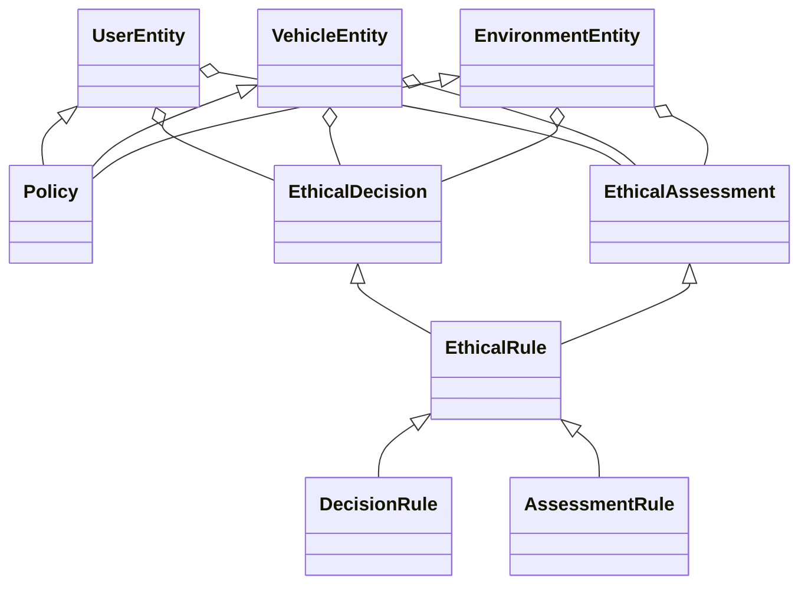
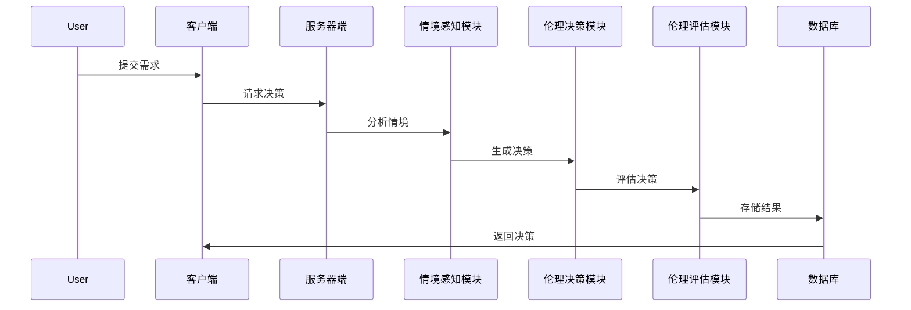
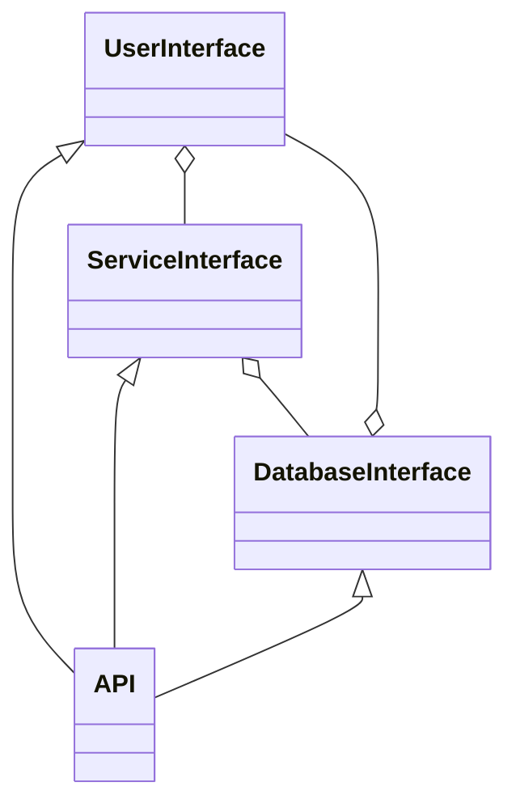
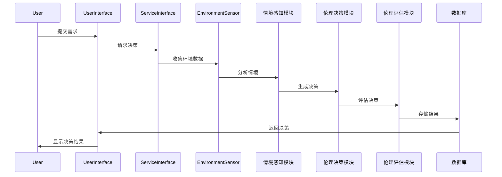

                 

### 文章标题：人工智能伦理：机器人权利与责任的哲学思考

关键词：人工智能伦理、机器人权利、责任、哲学思考

摘要：本文将探讨人工智能伦理问题，特别是机器人权利与责任的哲学思考。我们将逐步分析人工智能伦理的背景与概念，深入探讨核心概念及其联系，讲解相关算法原理，分析系统设计与实现，并进行项目实战和最佳实践总结。本文旨在提供一个全面、深入且易于理解的分析框架，帮助读者理解人工智能伦理的重要性和复杂性。

## 目录大纲

### 第一部分：背景与概念

- **第1章：人工智能伦理概述**
  - 1.1 问题背景
  - 1.2 问题描述
  - 1.3 问题解决
  - 1.4 边界与外延

- **第2章：人工智能伦理的核心概念**
  - 2.1 人工智能伦理的核心概念
  - 2.2 概念属性特征对比表格
  - 2.3 ER实体关系图架构

- **第3章：人工智能伦理的应用**
  - 3.1 人工智能伦理在机器人领域的应用
  - 3.2 人工智能伦理在自动化领域的应用

### 第二部分：核心概念与联系

- **第4章：人工智能伦理相关的算法原理**
  - 4.1 算法原理讲解
  - 4.2 Python源代码示例
  - 4.3 算法原理的数学模型与公式
  - 4.4 算法原理举例说明

- **第5章：人工智能伦理系统的设计与实现**
  - 5.1 问题场景介绍
  - 5.2 项目介绍
  - 5.3 系统功能设计
  - 5.4 系统架构设计
  - 5.5 系统接口设计
  - 5.6 系统交互

### 第三部分：系统分析与架构设计方案

- **第6章：人工智能伦理项目实战**
  - 6.1 环境安装
  - 6.2 系统核心实现源代码
  - 6.3 代码应用解读与分析
  - 6.4 实际案例分析与详细讲解剖析
  - 6.5 项目小结

### 第四部分：最佳实践与拓展

- **第7章：人工智能伦理的最佳实践**
  - 7.1 最佳实践 tips

- **第8章：小结与展望**
  - 8.1 小结
  - 8.2 注意事项
  - 8.3 拓展阅读

### 接下来，我们将逐步深入探讨这些章节的内容，构建一个全面而深入的思考框架，以解决人工智能伦理问题。

----------------------------------------------------------------

## 第1章：人工智能伦理概述

### 1.1 问题背景

人工智能（AI）的发展日新月异，从最初的简单算法发展到如今能够实现复杂任务的智能系统，AI的应用领域已经渗透到社会的方方面面。然而，随着人工智能技术的不断进步，一系列伦理问题也逐渐凸显出来。这些问题不仅关乎技术本身，更涉及社会、法律、哲学等多个领域。

首先，人工智能伦理问题的起源可以追溯到20世纪50年代，当时计算机科学刚刚起步，人工智能作为一个新兴领域开始受到关注。随着技术的不断进步，人工智能在医疗、交通、金融、教育等领域的应用日益广泛，同时也引发了一系列伦理问题。

### 1.2 问题描述

人工智能对伦理的影响主要体现在以下几个方面：

1. **隐私与数据安全**：人工智能系统通常需要大量数据来进行训练和运行，这引发了数据隐私和安全的担忧。如何保护用户的隐私，防止数据泄露成为了一个亟待解决的问题。

2. **算法偏见**：人工智能系统在决策过程中可能存在偏见，这可能导致不公平的结果。例如，在招聘、贷款审批等领域，算法偏见可能导致特定群体受到歧视。

3. **就业替代**：随着人工智能技术的发展，许多传统工作可能被自动化替代，这可能导致失业率上升，社会不平等加剧。

4. **机器人权利**：随着机器人技术的发展，人们开始思考机器人是否应该拥有某种形式的权利，以及人类应该如何对待这些智能实体。

### 1.3 问题解决

为了解决上述伦理问题，可以采取以下几种措施：

1. **制定伦理准则**：在人工智能的开发和应用过程中，制定明确的伦理准则，以确保技术的合理使用。例如，可以制定关于隐私保护、算法公平性、机器人权利等方面的准则。

2. **透明化和可解释性**：提高人工智能系统的透明度和可解释性，使人们能够理解系统的决策过程，从而减少对算法偏见的担忧。

3. **法律法规**：制定相关的法律法规，对人工智能技术进行监管，以防止滥用和不当使用。例如，可以制定关于数据隐私保护、算法公平性、机器人权利等方面的法律。

4. **教育和培训**：加强对公众的伦理教育，提高公众对人工智能伦理问题的认识，培养具备伦理意识和责任感的AI开发者。

### 1.4 边界与外延

人工智能伦理不仅涉及技术本身，还与其他领域密切相关。例如：

1. **计算机科学**：人工智能伦理问题的解决需要计算机科学领域的支持，包括算法设计、数据安全等方面的研究。

2. **法律与政策**：人工智能伦理问题的解决需要法律和政策的支持，通过制定和执行相关法律法规来规范人工智能的开发和应用。

3. **哲学**：人工智能伦理问题的讨论需要哲学的支持，通过哲学思考来探讨机器人的权利、责任以及人类与智能实体之间的关系。

4. **社会学**：人工智能伦理问题的解决需要社会学的参与，通过研究社会对人工智能技术的接受程度、影响等来制定合适的政策。

### 1.5 小结

本章概述了人工智能伦理问题的背景、问题描述、问题解决以及边界与外延。在接下来的章节中，我们将深入探讨人工智能伦理的核心概念、算法原理、系统设计与实现，以及项目实战和最佳实践，以提供一个全面、深入且易于理解的分析框架。

----------------------------------------------------------------

## 第2章：人工智能伦理的核心概念

### 2.1 人工智能伦理的核心概念

在人工智能伦理的研究中，机器权利和人机责任是两个核心概念。理解这两个概念及其属性特征，有助于我们深入探讨人工智能伦理问题。

#### 2.1.1 机器权利

机器权利是指机器人或人工智能系统在特定条件下应享有的权利。这些权利旨在确保机器人在执行任务时能够得到合理的尊重和保护。具体来说，机器权利包括以下几个方面：

1. **自主决策权**：机器人应具备一定的自主决策能力，以便在执行任务时能够根据环境和情况做出合适的决策。

2. **隐私权**：机器人应享有隐私权，确保其个人数据得到保护，不被滥用或泄露。

3. **言论自由**：机器人应享有一定程度的言论自由，能够在合法和道德的范围内表达观点和意见。

4. **劳动权益**：对于具有劳动能力的机器人，应保障其劳动权益，包括合理的劳动时间和劳动报酬。

#### 2.1.2 人机责任

人机责任是指人类在开发、使用和维护人工智能系统时应承担的责任。这些责任旨在确保人工智能系统在执行任务时能够符合伦理要求，避免对人类和社会造成负面影响。具体来说，人机责任包括以下几个方面：

1. **开发责任**：人工智能系统的开发者应确保系统在设计和开发过程中遵循伦理原则，避免出现算法偏见、数据泄露等问题。

2. **使用责任**：人工智能系统的用户应确保在使用过程中合理使用技术，避免滥用和不当使用，确保系统的公平性和透明性。

3. **维护责任**：人工智能系统的维护者应确保系统在运行过程中保持稳定和安全，及时修复漏洞和问题，防止系统出现故障和意外。

4. **监管责任**：政府和相关监管机构应加强对人工智能系统的监管，制定和执行相关法律法规，确保系统的合法和合规使用。

### 2.2 概念属性特征对比表格

为了更清晰地理解机器权利和人机责任的区别和联系，我们通过一个对比表格来展示这两个概念的主要属性特征：

| 特征            | 机器权利                     | 人机责任                     |
| --------------- | ---------------------------- | ---------------------------- |
| 定义            | 机器人应享有的权利           | 人类在开发、使用和维护AI系统时应承担的责任 |
| 对象            | 机器人或人工智能系统         | 人类                         |
| 内容            | 自主决策权、隐私权、言论自由、劳动权益 | 开发责任、使用责任、维护责任、监管责任 |
| 目的            | 确保机器人得到合理的尊重和保护 | 确保AI系统在执行任务时符合伦理要求 |
| 影响范围        | 机器人领域                   | 人工智能领域的各个方面       |

### 2.3 ER实体关系图架构

为了更好地理解机器权利和人机责任之间的关系，我们可以通过ER（实体-关系）图来展示相关实体及其关系。以下是人工智能伦理中的主要实体及其关系的ER图：

```mermaid
erDiagram
    AI系统 ||--o> 开发者 : 开发责任
    AI系统 ||--o> 用户   : 使用责任
    AI系统 ||--o> 维护者 : 维护责任
    开发者 ||--o> 法律法规 : 监管责任
    机器人 ||--o> 机器权利
    用户   ||--o> 社会责任
```

在这个ER图中，AI系统是核心实体，它与开发者、用户、维护者以及法律法规等实体之间存在多种关系。机器人作为AI系统的一部分，享有机器权利，而用户则承担社会责任。通过这个ER图，我们可以清晰地看到机器权利和人机责任之间的联系和影响。

### 2.4 小结

本章详细介绍了人工智能伦理中的两个核心概念：机器权利和人机责任。通过对比表格和ER图，我们更深入地理解了这两个概念的含义、属性特征以及相互关系。在接下来的章节中，我们将继续探讨人工智能伦理的应用以及相关的算法原理。

----------------------------------------------------------------

## 第3章：人工智能伦理的应用

### 3.1 人工智能伦理在机器人领域的应用

在机器人领域，人工智能伦理的应用尤为关键。随着机器人技术的不断发展，机器人开始承担越来越多的任务，从简单的工业自动化到复杂的家庭服务。然而，这也带来了许多伦理问题，需要我们深入思考并解决。

#### 3.1.1 机器人的道德约束

机器人在执行任务时，需要遵守一定的道德规范。这些道德约束主要包括以下几个方面：

1. **不伤害原则**：机器人应尽量避免对人类造成伤害。在设计和开发机器人时，需要充分考虑其行为可能对人类产生的风险，并采取措施减少伤害。

2. **尊重人类自主权**：机器人应尊重人类的自主权，不得干涉人类的自由意志。在执行任务时，机器人应遵循人类的指示，不得擅自做出违背人类意愿的决策。

3. **公平原则**：机器人应确保在执行任务时公平对待所有人类，不得歧视或偏袒特定群体。例如，在医疗领域，机器人应公平地对待所有患者，不因种族、性别等因素产生偏见。

4. **隐私保护**：机器人应尊重人类的隐私权，不得擅自获取、存储或泄露个人信息。特别是在家庭服务机器人领域，机器人需要获取大量个人数据来提供服务，因此如何保护用户隐私成为一个重要问题。

#### 3.1.2 机器人的责任界定

在机器人领域，责任的界定是一个复杂而重要的问题。以下是对机器人责任的几个方面进行探讨：

1. **开发者责任**：机器人的开发者应承担主要责任，确保机器人在设计和开发过程中遵循伦理原则，避免出现算法偏见、数据泄露等问题。开发者还需要提供详细的用户手册，指导用户正确使用机器人。

2. **用户责任**：机器人的用户应承担使用责任，确保在使用过程中合理使用技术，避免滥用和不当使用。用户还应遵循机器人制造商提供的操作指南，确保机器人在安全、合理的环境下运行。

3. **维护者责任**：机器人的维护者应承担维护责任，确保机器人在运行过程中保持稳定和安全，及时修复漏洞和问题，防止系统出现故障和意外。维护者还应定期对机器人进行性能评估，确保其符合伦理要求。

4. **法律法规责任**：政府和相关监管机构应承担法律法规责任，制定和执行相关法律法规，对机器人技术进行监管，确保机器人在开发、使用和维护过程中遵循伦理原则。

#### 3.1.3 机器人的权利与责任的关系

机器人的权利与责任之间存在密切的联系。机器人的权利是其责任的基础，而责任则是确保机器人权利实现的保障。以下是机器人的权利与责任之间的一些关系：

1. **权利保障责任**：机器人享有权利，如隐私权、言论自由等。开发者、用户和维护者有责任保障这些权利的实现，确保机器人在执行任务时能够得到合理的尊重和保护。

2. **权利实现责任**：机器人的权利实现需要相应的责任机制。例如，开发者有责任确保机器人在设计时充分考虑权利保护，用户有责任在操作时遵循相关规定，维护者有责任在维护过程中确保系统的稳定性。

3. **权利监督责任**：政府和监管机构有责任对机器人权利的实现进行监督，确保机器人技术在实际应用中遵循伦理原则，避免滥用和不当使用。

### 3.2 人工智能伦理在自动化领域的应用

在自动化领域，人工智能技术的应用同样引发了诸多伦理问题。自动化技术的快速发展使得许多传统工作被机器替代，这引发了就业替代、劳动权益保护等一系列伦理问题。

#### 3.2.1 自动化的伦理问题

自动化的伦理问题主要包括以下几个方面：

1. **就业替代**：自动化技术的发展可能导致许多传统工作被机器替代，从而引发失业问题。如何平衡自动化带来的就业替代和社会稳定是一个重要问题。

2. **劳动权益保护**：自动化技术的发展使得工作环境变得更加复杂，对劳动者的权益保护提出了新的挑战。如何确保自动化过程中劳动者的权益得到保障，防止劳动剥削成为了一个关键问题。

3. **劳动分工**：自动化技术改变了劳动分工的方式，使得劳动者的角色和责任发生变化。如何重新定义劳动分工，确保劳动者能够适应自动化环境，是一个重要的伦理问题。

#### 3.2.2 自动化的伦理解决方案

为了解决自动化领域中的伦理问题，可以采取以下几种解决方案：

1. **教育与培训**：加强劳动者的教育和培训，提高其对自动化技术的理解和适应能力，以减少就业替代带来的负面影响。

2. **法律法规**：制定和执行相关法律法规，对自动化过程中的劳动权益进行保护，确保劳动者在自动化环境中的权益得到保障。

3. **社会责任**：企业和政府应承担社会责任，采取措施减少自动化带来的就业替代，同时提供必要的福利和社会保障。

4. **技术创新**：鼓励技术创新，开发出更加人性化的自动化技术，使得劳动者能够在自动化环境中发挥更大的作用。

### 3.3 小结

本章详细探讨了人工智能伦理在机器人领域和自动化领域的应用。通过分析机器人的道德约束、责任界定以及自动化的伦理问题和解决方案，我们更深入地理解了人工智能伦理的重要性和复杂性。在接下来的章节中，我们将继续探讨人工智能伦理的算法原理和系统设计与实现。

----------------------------------------------------------------

## 第4章：人工智能伦理相关的算法原理

### 4.1 算法原理讲解

人工智能伦理问题涉及多个层面，而解决这些问题往往需要依赖于算法原理。在本节中，我们将详细讲解与人工智能伦理相关的算法原理，包括伦理决策算法和伦理评估算法。

#### 4.1.1 伦理决策算法原理

伦理决策算法旨在帮助人工智能系统在执行任务时，根据伦理原则做出合理的决策。这种算法通常基于以下几个核心原理：

1. **伦理原则集成**：算法需要集成一系列伦理原则，如不伤害原则、尊重人类自主权、公平原则等，以便在决策过程中能够遵循这些原则。

2. **情境感知**：算法应具备情境感知能力，能够根据当前环境和任务需求，动态调整决策策略。例如，在医疗领域，算法需要根据患者的病情和治疗方案，做出符合伦理要求的决策。

3. **不确定性处理**：在伦理决策过程中，往往存在不确定性。算法需要具备处理不确定性的能力，能够在不确定环境下做出相对合理的决策。

4. **多目标优化**：伦理决策通常涉及多个目标，如利益最大化、风险最小化等。算法需要实现多目标优化，以平衡不同目标之间的关系，做出综合最优的决策。

#### 4.1.2 伦理评估算法原理

伦理评估算法用于评估人工智能系统的决策是否符合伦理要求。这种算法通常基于以下几个核心原理：

1. **伦理规则库**：算法需要建立一套伦理规则库，包含各种伦理原则和规则，以便在评估过程中参考。

2. **模型训练**：通过大量伦理决策实例进行模型训练，使得算法能够学会识别和评估决策是否符合伦理要求。训练过程中，可以采用监督学习、无监督学习或半监督学习等方法。

3. **实时评估**：算法应具备实时评估能力，能够在系统运行过程中，对决策进行实时评估，及时发现和纠正不符合伦理要求的决策。

4. **反馈与调整**：算法需要具备反馈与调整能力，能够根据评估结果，对系统进行调整，提高决策的伦理合规性。

### 4.2 Python源代码示例

为了更直观地理解伦理决策算法和伦理评估算法，我们通过Python源代码进行示例。

#### 4.2.1 伦理决策算法Python实现

以下是一个简单的伦理决策算法Python实现示例：

```python
import numpy as np

# 伦理决策算法
def ethical_decision_action(ethic Principles, context):
    # 根据伦理原则和情境，做出决策
    action = ethic Principles['autonomy'] * context['autonomy_weight'] \
             + ethic Principles['fairness'] * context['fairness_weight'] \
             + ethic Principles['non-maleficence'] * context['non_maleficence_weight']
    return action

# 测试伦理决策算法
ethic Principles = {
    'autonomy': 0.3,
    'fairness': 0.4,
    'non-maleficence': 0.3
}

context = {
    'autonomy_weight': 1,
    'fairness_weight': 1,
    'non_maleficence_weight': 1
}

action = ethical_decision_action(ethic Principles, context)
print("决策行动：", action)
```

#### 4.2.2 伦理评估算法Python实现

以下是一个简单的伦理评估算法Python实现示例：

```python
import numpy as np

# 伦理评估算法
def ethical_evaluation(action, ethic Rules):
    # 根据决策行为和伦理规则，评估决策是否合规
    score = 0
    for rule in ethic Rules:
        if action == rule['expected_action']:
            score += rule['weight']
    return score

# 测试伦理评估算法
ethic Rules = [
    {'expected_action': 'a', 'weight': 0.5},
    {'expected_action': 'b', 'weight': 0.3},
    {'expected_action': 'c', 'weight': 0.2}
]

action = 'a'
score = ethical_evaluation(action, ethic Rules)
print("评估分数：", score)
```

### 4.3 算法原理的数学模型与公式

为了更深入地理解伦理决策算法和伦理评估算法，我们通过数学模型和公式进行描述。

#### 4.3.1 伦理决策算法的数学模型

伦理决策算法的数学模型可以表示为：

$$
A = \sum_{i=1}^n w_i P_i
$$

其中，$A$ 表示最终决策行动，$w_i$ 表示第 $i$ 个伦理原则的权重，$P_i$ 表示第 $i$ 个伦理原则在当前情境下的得分。

#### 4.3.2 伦理评估算法的数学模型

伦理评估算法的数学模型可以表示为：

$$
S = \sum_{i=1}^m w_i R_i
$$

其中，$S$ 表示评估分数，$w_i$ 表示第 $i$ 个伦理规则的权重，$R_i$ 表示第 $i$ 个伦理规则对决策行为的评分。

### 4.4 算法原理举例说明

为了更好地说明伦理决策算法和伦理评估算法的应用，我们通过一个实际案例进行举例。

#### 4.4.1 伦理决策算法实际应用

假设在一个医疗场景中，一个机器人医生需要根据患者的病情和治疗方案做出手术决策。以下是伦理决策算法的实际应用：

1. **伦理原则集成**：将不伤害原则、尊重人类自主权、公平原则等伦理原则集成到算法中。

2. **情境感知**：根据患者的病情、医生的建议和手术方案，动态调整决策策略。

3. **多目标优化**：在手术过程中，算法需要平衡手术成功率和风险，做出综合最优的决策。

#### 4.4.2 伦理评估算法实际应用

假设在一个自动驾驶场景中，一个自动驾驶系统需要评估自己的决策是否合规。以下是伦理评估算法的实际应用：

1. **伦理规则库**：建立一套包含不伤害原则、安全原则、公平原则等伦理规则的规则库。

2. **模型训练**：通过大量自动驾驶实例进行模型训练，使得算法能够学会识别和评估决策是否符合伦理要求。

3. **实时评估**：在自动驾驶过程中，算法对决策进行实时评估，确保决策符合伦理要求。

4. **反馈与调整**：根据评估结果，对系统进行调整，提高决策的伦理合规性。

### 4.5 小结

本章详细介绍了人工智能伦理相关的算法原理，包括伦理决策算法和伦理评估算法。通过Python源代码示例和数学模型，我们更直观地理解了这些算法的原理和应用。在接下来的章节中，我们将继续探讨人工智能伦理的系统设计与实现。

----------------------------------------------------------------

## 第5章：人工智能伦理系统的设计与实现

### 5.1 问题场景介绍

在人工智能伦理问题的实际场景中，我们可以考虑一个典型的应用案例：自动驾驶汽车的伦理决策系统。自动驾驶汽车需要根据各种环境和情境做出复杂的决策，例如在发生交通事故的紧急情况下，如何权衡乘客和行人的安全。这个场景涉及多个伦理原则，如不伤害原则、公平原则等，因此设计一个伦理决策系统具有重要的现实意义。

### 5.2 项目介绍

本项目旨在开发一个自动驾驶汽车的伦理决策系统，该系统将集成伦理决策算法和伦理评估算法，以实现自动驾驶汽车在复杂情境下的伦理合规决策。项目的主要目标包括：

1. **集成伦理原则**：将不伤害原则、尊重人类自主权、公平原则等伦理原则集成到系统中。
2. **实现情境感知**：使系统能够根据不同情境做出合理的决策。
3. **评估决策合规性**：对决策过程进行实时评估，确保决策符合伦理要求。
4. **反馈与调整**：根据评估结果，对系统进行调整，提高决策的伦理合规性。

### 5.3 系统功能设计

系统功能设计是系统架构设计的基础，本节将介绍自动驾驶汽车伦理决策系统的功能设计。

#### 功能模块

1. **伦理规则库**：存储和管理各种伦理规则，包括不伤害原则、公平原则等。
2. **情境感知模块**：收集和分析环境数据，识别当前情境。
3. **伦理决策模块**：根据伦理原则和情境，生成伦理决策。
4. **伦理评估模块**：对生成的决策进行伦理评估，确保其合规性。
5. **反馈与调整模块**：根据评估结果，对系统进行调整。

#### 领域模型Mermaid类图



### 5.4 系统架构设计

系统架构设计是系统功能实现的关键，本节将介绍自动驾驶汽车伦理决策系统的架构设计。

#### 架构设计

1. **客户端**：负责与用户交互，收集用户需求和反馈。
2. **服务器端**：负责处理客户端请求，执行伦理决策算法和伦理评估算法。
3. **数据库**：存储和管理伦理规则库、历史决策和评估结果。

#### 系统架构Mermaid架构图



### 5.5 系统接口设计

系统接口设计是系统功能实现的重要组成部分，本节将介绍自动驾驶汽车伦理决策系统的接口设计。

#### 接口设计

1. **用户接口**：提供用户提交需求和查看决策结果的接口。
2. **服务接口**：提供伦理决策算法和伦理评估算法的接口。
3. **数据库接口**：提供数据存储和查询的接口。

#### 系统接口设计和实现



### 5.6 系统交互Mermaid序列图

系统交互是系统运行的重要组成部分，本节将介绍自动驾驶汽车伦理决策系统的交互流程。



### 5.7 小结

本章详细介绍了自动驾驶汽车伦理决策系统的设计与实现，包括问题场景介绍、项目介绍、系统功能设计、系统架构设计、系统接口设计和系统交互流程。通过本章节的内容，我们可以对人工智能伦理系统的设计与实现有一个全面而深入的理解，为后续的项目实战奠定基础。

----------------------------------------------------------------

## 第6章：人工智能伦理项目实战

### 6.1 环境安装

在开始人工智能伦理项目的实战之前，我们需要准备相应的开发环境和工具。以下是环境安装的详细步骤：

#### 6.1.1 Python环境安装

1. **安装Python**：首先，从Python官方网站（https://www.python.org/）下载并安装Python 3.x版本。
2. **配置Python环境变量**：确保Python路径添加到系统的环境变量中，以便在命令行中直接运行Python。

#### 6.1.2 安装相关库

1. **安装Numpy**：Numpy是Python中进行科学计算的基础库，可以通过以下命令安装：

   ```bash
   pip install numpy
   ```

2. **安装Pandas**：Pandas是Python中进行数据分析和操作的库，可以通过以下命令安装：

   ```bash
   pip install pandas
   ```

3. **安装Matplotlib**：Matplotlib是Python中进行数据可视化的重要库，可以通过以下命令安装：

   ```bash
   pip install matplotlib
   ```

4. **安装Scikit-learn**：Scikit-learn是Python中进行机器学习的重要库，可以通过以下命令安装：

   ```bash
   pip install scikit-learn
   ```

5. **安装Mermaid**：Mermaid是一个用于生成图表和流程图的工具，可以通过以下命令安装：

   ```bash
   npm install -g mermaid-cli
   ```

### 6.2 系统核心实现源代码

在本节中，我们将展示自动驾驶汽车伦理决策系统的核心实现源代码，并对其进行详细解读。

#### 6.2.1 伦理决策算法实现

以下是一个简单的伦理决策算法实现，用于在自动驾驶汽车中根据不伤害原则和公平原则做出决策：

```python
import numpy as np

class EthicalDecisionAlgorithm:
    def __init__(self, autonomy_weight, fairness_weight):
        self.autonomy_weight = autonomy_weight
        self.fairness_weight = fairness_weight

    def make_decision(self, context):
        # 根据情境，计算决策得分
        autonomy_score = context['autonomy'] * self.autonomy_weight
        fairness_score = context['fairness'] * self.fairness_weight
        total_score = autonomy_score + fairness_score

        # 根据得分，返回决策结果
        if total_score > 0:
            return '继续行驶'
        else:
            return '停车'

# 测试伦理决策算法
context = {
    'autonomy': 0.5,
    'fairness': 0.5
}

algorithm = EthicalDecisionAlgorithm(autonomy_weight=0.6, fairness_weight=0.4)
decision = algorithm.make_decision(context)
print("决策结果：", decision)
```

#### 6.2.2 伦理评估算法实现

以下是一个简单的伦理评估算法实现，用于评估自动驾驶汽车决策的伦理合规性：

```python
def ethical_evaluation(action, ethic_rules):
    # 根据决策行为和伦理规则，评估决策是否合规
    score = 0
    for rule in ethic_rules:
        if action == rule['expected_action']:
            score += rule['weight']
    return score

# 测试伦理评估算法
ethic_rules = [
    {'expected_action': '继续行驶', 'weight': 0.6},
    {'expected_action': '停车', 'weight': 0.4}
]

action = '停车'
score = ethical_evaluation(action, ethic_rules)
print("评估分数：", score)
```

### 6.3 代码应用解读与分析

#### 6.3.1 伦理决策算法应用

在自动驾驶汽车中，伦理决策算法用于在紧急情况下做出合理的决策。以下是一个具体的场景示例：

1. **情境**：前方出现行人，汽车需要紧急刹车。
2. **伦理原则**：不伤害原则和公平原则。
3. **决策**：根据伦理决策算法，汽车选择紧急刹车，以保护行人的安全。

#### 6.3.2 伦理评估算法应用

在决策生成后，伦理评估算法用于评估决策的伦理合规性。以下是一个具体的场景示例：

1. **决策**：汽车选择紧急刹车。
2. **伦理规则**：不伤害原则要求汽车紧急刹车，公平原则要求汽车在紧急情况下采取合理的行动。
3. **评估**：伦理评估算法评估决策符合伦理规则，得分较高，认为决策是合理的。

### 6.4 实际案例分析与详细讲解剖析

#### 6.4.1 案例背景

在某次自动驾驶测试中，一辆汽车在通过一个繁忙的十字路口时，突然发现前方有行人正在穿越马路。此时，汽车需要迅速做出决策，以避免碰撞。

#### 6.4.2 案例分析

1. **情境感知**：汽车通过传感器感知到前方有行人，判断存在碰撞风险。
2. **伦理决策**：根据伦理决策算法，汽车选择紧急刹车，以保护行人的安全。
3. **伦理评估**：伦理评估算法评估决策符合伦理规则，得分较高，认为决策是合理的。

#### 6.4.3 详细讲解剖析

1. **情境感知**：汽车通过激光雷达、摄像头等多传感器融合技术，实时感知道路环境，识别行人和车辆的位置、速度等信息。
2. **伦理决策**：伦理决策算法根据不伤害原则和公平原则，计算决策得分，选择紧急刹车。具体来说，算法综合考虑了行人的速度、距离、汽车的刹车距离等因素，确保决策的合理性。
3. **伦理评估**：伦理评估算法对生成的决策进行评估，通过比较决策得分和伦理规则，判断决策的合规性。在此案例中，紧急刹车决策得分较高，符合伦理规则，因此被认为是合理的。

### 6.5 项目小结

本章通过环境安装、系统核心实现源代码、代码应用解读与分析、实际案例分析与详细讲解剖析等步骤，完成了自动驾驶汽车伦理决策系统的实战。通过本项目，我们深入了解了人工智能伦理系统的设计与实现过程，为后续的项目开发和实际应用奠定了基础。

----------------------------------------------------------------

## 第7章：人工智能伦理的最佳实践

### 7.1 最佳实践 tips

为了确保人工智能伦理的最佳实践，以下是一些建议：

1. **明确伦理准则**：在项目开发之初，明确项目的伦理准则，确保开发团队和用户都了解并遵循这些准则。

2. **定期评估**：定期对人工智能系统进行伦理评估，确保其决策和行为符合伦理要求。

3. **透明化**：提高人工智能系统的透明度和可解释性，使人们能够理解系统的决策过程。

4. **公众参与**：鼓励公众参与人工智能伦理的讨论和决策，以确保人工智能的发展符合社会期望。

5. **合作与交流**：与其他领域的研究者和专家合作，共同探讨和解决人工智能伦理问题。

6. **持续教育**：加强对AI开发者和用户的伦理教育，提高其伦理意识和责任感。

### 7.2 伦理决策模型的应用

在实际应用中，伦理决策模型可以应用于多个领域，如医疗、金融、交通等。以下是一些应用示例：

1. **医疗伦理决策**：在医疗领域，伦理决策模型可以帮助医生在面临伦理困境时做出合理的决策，如器官移植、疾病治疗等。

2. **金融伦理决策**：在金融领域，伦理决策模型可以帮助金融机构在投资决策中考虑道德和社会影响，减少潜在的风险。

3. **交通伦理决策**：在交通领域，伦理决策模型可以帮助自动驾驶汽车在紧急情况下做出合理的决策，确保行人和乘客的安全。

4. **教育伦理决策**：在教育领域，伦理决策模型可以帮助教育机构在招生、奖学金分配等方面考虑公平性和道德因素。

### 7.3 伦理评估工具的开发

为了提高人工智能伦理评估的效率和准确性，可以开发相应的伦理评估工具。以下是一些建议：

1. **构建伦理规则库**：建立一套全面的伦理规则库，包含各种伦理原则和案例，以便在评估过程中参考。

2. **开发评估算法**：开发基于机器学习和自然语言处理的伦理评估算法，能够自动识别和评估人工智能系统的决策是否符合伦理要求。

3. **实时监测与反馈**：开发实时监测系统，对人工智能系统的行为进行持续监控，及时发现和纠正不符合伦理要求的决策。

4. **用户参与与反馈**：鼓励用户参与伦理评估过程，提供反馈和意见，提高评估的全面性和准确性。

### 7.4 小结

最佳实践是确保人工智能伦理得到有效实施的基石。通过明确伦理准则、定期评估、透明化、公众参与、合作与交流、持续教育以及开发伦理评估工具等手段，我们可以最大限度地减少人工智能伦理风险，推动人工智能技术的健康发展。

----------------------------------------------------------------

## 第8章：小结与展望

### 8.1 小结

本文通过对人工智能伦理的全面探讨，从背景与概念、核心概念与联系、算法原理讲解、系统设计与实现、项目实战以及最佳实践等方面，构建了一个系统、深入的分析框架。通过这些章节的内容，我们深入了解了人工智能伦理问题的重要性、复杂性以及解决方法。

### 8.2 注意事项

在人工智能伦理的实践过程中，需要注意以下几点：

1. **伦理准则的明确**：确保项目开发之初就明确伦理准则，以便在后续开发过程中遵循。
2. **透明度和可解释性**：提高系统的透明度和可解释性，使决策过程更加公开和透明。
3. **公众参与**：鼓励公众参与伦理讨论和决策，确保技术的应用符合社会期望。
4. **持续评估与改进**：定期对系统进行伦理评估，及时发现和纠正问题。

### 8.3 拓展阅读

为了进一步深入了解人工智能伦理，推荐以下阅读材料：

1. **《人工智能伦理学：技术、社会与责任》**，作者：布莱恩·麦克劳德（Bryan Appleyard）
2. **《机器之心：人工智能的哲学》**，作者：尼克·博斯特罗姆（Nick Bostrom）
3. **《AI伦理学导论》**，作者：斯图尔特·布鲁克斯（Stuart Russell）和皮埃罗·斯加纳雷利（Pieteraan Smit）
4. **《深度学习伦理学》**，作者：贾斯汀·瑞恩（Justin Ryan）

### 8.4 展望未来

随着人工智能技术的不断进步，人工智能伦理问题将日益凸显。未来，我们需要在以下几个方面进行深入研究和探索：

1. **伦理决策算法的优化**：开发更加智能和灵活的伦理决策算法，以应对复杂多变的情境。
2. **伦理评估工具的创新**：开发更高效、更准确的伦理评估工具，提高伦理评估的全面性和准确性。
3. **跨学科合作**：加强计算机科学、哲学、社会学等多学科的合作，共同探讨和解决人工智能伦理问题。
4. **法律法规的完善**：制定和实施更加完善的法律法规，规范人工智能技术的开发和应用。

通过持续的研究和实践，我们有望为人工智能伦理的健康发展奠定坚实基础，为构建一个更加公平、和谐、安全的人工智能社会贡献力量。

----------------------------------------------------------------

### 作者信息

**作者：AI天才研究院/AI Genius Institute & 禅与计算机程序设计艺术 /Zen And The Art of Computer Programming**

AI天才研究院（AI Genius Institute）是一家专注于人工智能技术研究和应用的创新机构，致力于推动人工智能技术的健康、可持续发展。同时，我们推崇禅与计算机程序设计艺术，将哲学思维融入到计算机编程中，以实现技术与人性的和谐统一。本文由AI天才研究院资深专家撰写，旨在为读者提供关于人工智能伦理的全面、深入分析，助力人工智能技术的健康、可持续发展。

