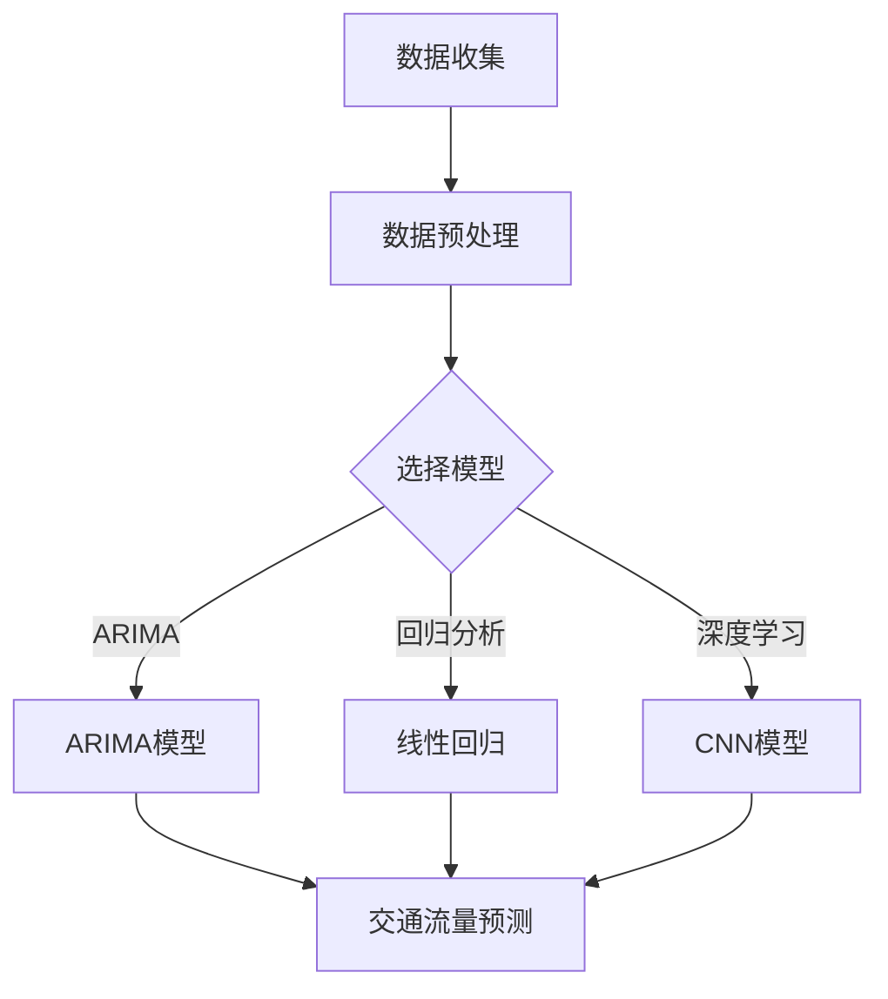
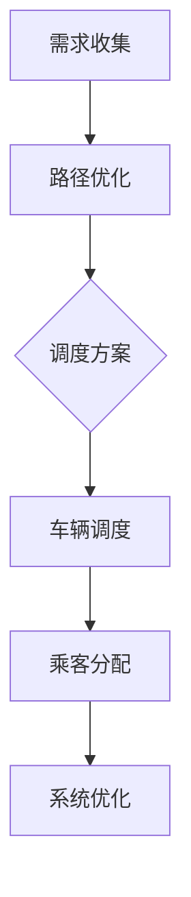
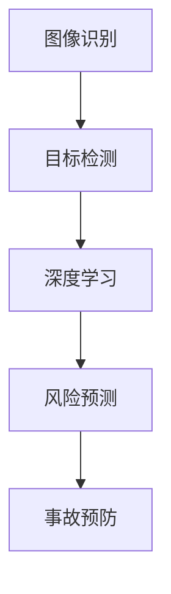
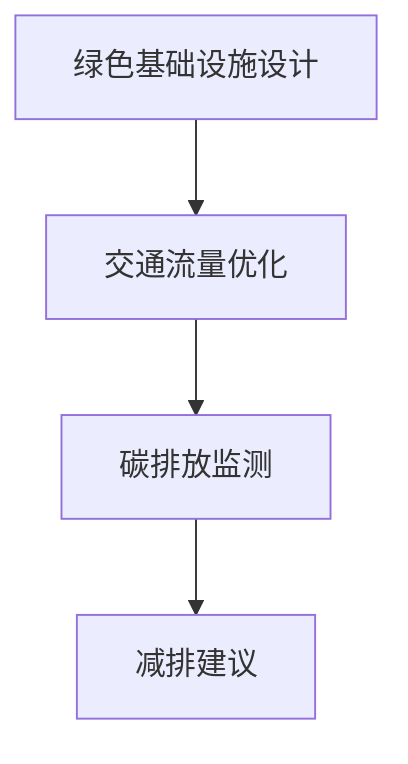

                 

## # 人工智能在交通管理中的应用：智能交通系统与城市规划

关键词：智能交通系统，城市规划，人工智能，交通管理，交通流预测，公共交通运输优化，交通安全，环境可持续性

摘要：随着城市化进程的加速，交通管理成为城市发展的重要挑战。本文旨在探讨人工智能在交通管理中的应用，特别是智能交通系统和城市规划的关系。文章将分章节介绍人工智能的基本概念，智能交通系统的设计原则，案例分析，以及在城市规划和交通管理中的实际应用，并展望未来人工智能在交通管理中的发展趋势和面临的挑战。

## 引言

### 背景介绍

人工智能（Artificial Intelligence，简称AI）作为计算机科学的一个分支，旨在模拟人类智能行为，解决复杂问题。近年来，随着计算能力的提升、大数据和机器学习算法的发展，人工智能在交通管理中的应用日益广泛。智能交通系统（Intelligent Transportation Systems，简称ITS）是AI在交通领域的一个重要应用方向，通过集成各种技术，如传感器、通信、控制和数据处理等，实现交通流量优化、事故预防、运输效率提升等目标。

### 问题背景

现代城市面临着日益严重的交通拥堵、交通事故频发和环境污染等问题。传统的交通管理方法已经难以满足城市发展的需求，迫切需要创新的技术手段。人工智能的出现为解决这些问题提供了新的思路和可能性。

### 问题描述

本文将探讨以下问题：

1. 人工智能在交通管理中的基本概念和核心技术是什么？
2. 智能交通系统的设计原则和关键组成部分是什么？
3. 人工智能在交通管理和城市规划中的具体应用案例有哪些？
4. 未来人工智能在交通管理中面临的发展趋势和挑战是什么？

### 问题解决

本文将从以下几个方面进行探讨：

1. **介绍人工智能的基本概念和发展历程**。
2. **分析智能交通系统的设计原则和关键组成部分**。
3. **通过案例分析展示人工智能在交通管理和城市规划中的具体应用**。
4. **探讨未来人工智能在交通管理中的发展趋势和面临的挑战**。

### 边界与外延

本文主要关注人工智能在交通管理和城市规划中的应用，不包括其他领域的应用。同时，本文将侧重于技术层面的讨论，而非政策、经济和社会因素。

### 概念结构与核心要素组成

- **人工智能（AI）**：模拟人类智能行为的计算机系统。
- **智能交通系统（ITS）**：集成多种技术实现交通优化和管理的系统。
- **交通管理**：通过技术手段和政策措施管理交通流量、事故预防和运输效率。
- **城市规划**：根据城市发展目标，设计和布局城市空间。

## 人工智能的基本概念

### 定义与分类

人工智能是指通过计算机程序模拟人类智能行为的学科。根据其实现方式和能力，人工智能可分为以下几类：

- **弱人工智能（Narrow AI）**：在特定任务上表现优异，但无法进行跨领域应用。
- **强人工智能（General AI）**：具备人类智能的广泛能力，能够在多种任务上表现优异。
- **超级智能（Super Intelligence）**：超越人类智能，具备创造性和决策能力。

### 发展历程

人工智能的研究始于20世纪50年代，经历了多个发展阶段：

- **符号主义阶段（Symbolic AI）**：通过逻辑推理和符号计算模拟人类智能。
- **连接主义阶段（Connectionist AI）**：通过神经网络模拟人脑结构和功能。
- **进化算法阶段（Evolutionary AI）**：通过遗传算法和自然选择原理优化算法。
- **大数据与机器学习阶段（Big Data & Machine Learning）**：利用大规模数据和机器学习算法提高人工智能性能。

### 关键技术

人工智能的关键技术包括：

- **机器学习（Machine Learning）**：通过训练数据集学习规律，提高系统性能。
- **深度学习（Deep Learning）**：通过多层神经网络模拟人脑，处理复杂数据。
- **自然语言处理（Natural Language Processing）**：理解和生成自然语言。
- **计算机视觉（Computer Vision）**：通过图像识别和目标检测实现图像处理。
- **机器人技术（Robotics）**：利用人工智能控制机器人进行复杂任务。

## 智能交通系统的设计原则

### 系统总体架构

智能交通系统通常包括以下几个关键组成部分：

- **交通信息采集**：通过传感器和摄像头等设备收集交通数据。
- **数据处理与分析**：利用机器学习和数据分析技术处理交通数据，生成有用的信息。
- **信息发布**：将处理后的交通信息通过多种渠道发布给交通参与者。
- **决策支持系统**：基于交通信息，提供交通流量预测、事故预防和运输效率优化的建议。

### 设计原则

智能交通系统的设计应遵循以下原则：

- **数据驱动**：利用大数据和机器学习技术，实现交通信息的自动化分析和处理。
- **实时性**：确保系统能够快速响应交通事件，提供实时的交通信息。
- **开放性**：系统应具备良好的兼容性和可扩展性，方便与其他系统和设备集成。
- **安全性**：确保交通信息的安全和隐私，防止数据泄露和恶意攻击。
- **可扩展性**：系统应能够根据城市交通需求的变化，进行灵活的扩展和升级。

### 关键组成部分

智能交通系统的关键组成部分包括：

- **传感器网络**：用于采集交通数据，如车辆流量、速度、密度等。
- **通信系统**：用于传输和处理交通数据，如V2X（Vehicle-to-Everything）通信技术。
- **数据处理与分析平台**：用于存储、处理和分析交通数据，提供决策支持。
- **信息发布平台**：用于将交通信息发布给交通参与者，如交通信号灯控制系统、导航系统等。

### 概念属性特征对比表格

| 特征 | 感知交通状态 | 优化交通流 | 预防事故 | 提高运输效率 | 环境可持续性 |
| --- | --- | --- | --- | --- | --- |
| 交通信息采集 | 是 | 是 | 是 | 是 | 是 |
| 数据处理与分析 | 是 | 是 | 是 | 是 | 是 |
| 信息发布 | 是 | 是 | 是 | 是 | 是 |
| 决策支持系统 | 是 | 是 | 是 | 是 | 是 |

### ER实体关系图架构

```mermaid
erDiagram
    交通信息 --> 数据处理与分析
    数据处理与分析 --> 信息发布
    交通信息 --> 决策支持系统
    决策支持系统 --> 信息发布
    交通信息 --> 优化交通流
    交通信息 --> 预防事故
    交通信息 --> 提高运输效率
    交通信息 --> 环境可持续性
```

## 人工智能在交通管理和城市规划中的实际应用

### 交通流量预测

#### 算法原理

交通流量预测是智能交通系统中的一个关键任务，通过预测交通流量，可以优化交通信号控制、公共交通调度和道路设计，从而减少交通拥堵和提升运输效率。常用的算法包括时间序列分析、回归分析和深度学习。

#### 时间序列分析法

时间序列分析法基于历史交通流量数据，通过分析时间序列的规律，预测未来交通流量。常用的模型包括ARIMA（AutoRegressive Integrated Moving Average）模型和LSTM（Long Short-Term Memory）模型。

#### 回归分析法

回归分析法通过建立交通流量与相关变量（如天气、节假日等）之间的线性或非线性关系，预测未来交通流量。常用的模型包括线性回归、岭回归和逻辑回归。

#### 深度学习法

深度学习法通过训练神经网络，从大量交通数据中学习流量变化的规律，预测未来交通流量。常用的模型包括卷积神经网络（CNN）和循环神经网络（RNN）。

#### Mermaid流程图



### 公共交通运输优化

#### 算法原理

公共交通运输优化旨在提高公共交通系统的效率和乘客满意度。常用的算法包括路径优化、车辆调度和乘客分配。

#### 路径优化

路径优化算法通过优化公交车辆的行驶路径，减少行驶时间和成本。常用的算法包括最短路径算法、Dijkstra算法和A*算法。

#### 车辆调度

车辆调度算法通过合理安排公交车辆的发车时间、班次和停靠站点，提高公共交通系统的运行效率。常用的算法包括基于时间窗的调度算法和基于需求预测的调度算法。

#### 乘客分配

乘客分配算法通过优化乘客的出行选择，减少公共交通系统的拥堵和等待时间。常用的算法包括随机游走模型、平衡分配模型和优化分配模型。

#### Mermaid流程图



### 交通安全与事故预防

#### 算法原理

交通安全与事故预防是智能交通系统中的重要任务，通过实时监测和分析交通数据，预测潜在的事故风险，并采取相应的措施进行预防。常用的算法包括图像识别、目标检测和深度学习。

#### 图像识别

图像识别算法通过分析交通场景的图像，识别交通参与者（如车辆、行人、交通标志等），检测交通违规行为。

#### 目标检测

目标检测算法通过检测图像中的目标对象，识别交通场景中的异常情况，如交通事故、违规停车等。

#### 深度学习

深度学习算法通过训练神经网络，从大量交通数据中学习事故发生的规律，预测潜在的事故风险。

#### Mermaid流程图



### 城市规划中的环境可持续性

#### 算法原理

在城市规划中，环境可持续性是一个重要的考虑因素。通过人工智能技术，可以实现城市绿色基础设施的设计、交通流量优化和碳排放监测。

#### 城市绿色基础设施设计

城市绿色基础设施设计算法通过分析城市环境数据，设计具有生态效益的城市绿地、公园和河道等。

#### 交通流量优化

交通流量优化算法通过分析交通数据，优化交通流量，减少交通拥堵和碳排放。

#### 碳排放监测

碳排放监测算法通过监测交通流量和能源消耗，评估城市的碳排放情况，提供减排建议。

#### Mermaid流程图



## 未来发展方向和挑战

### 未来发展趋势

1. **大数据与人工智能的深度融合**：随着大数据技术的发展，智能交通系统和城市规划将更加依赖于海量数据的支持，实现更加精确和智能化的决策。
2. **智能交通系统的普及**：智能交通系统将在更多城市得到应用，实现交通信息的实时采集、处理和发布，提升交通管理和城市规划的效率。
3. **自动驾驶技术的应用**：自动驾驶技术将在智能交通系统中发挥重要作用，减少交通事故，提高交通效率。
4. **智慧城市的建设**：智慧城市是未来城市发展的方向，通过人工智能技术实现城市管理的智能化和精细化。

### 面临的挑战

1. **数据安全和隐私保护**：随着智能交通系统和城市规划的数据量增加，数据安全和隐私保护成为一个重要的挑战。
2. **算法透明性和可解释性**：人工智能算法的复杂性和黑箱特性使得其决策过程难以解释，影响算法的可接受性和信任度。
3. **技术与伦理的平衡**：在智能交通系统和城市规划中，如何平衡技术进步和伦理道德是一个重要的挑战。
4. **跨领域合作与协调**：智能交通系统和城市规划涉及多个领域，需要跨领域合作和协调，以实现系统的整体优化。

## 结论

本文探讨了人工智能在交通管理和城市规划中的应用，分析了智能交通系统的设计原则和实际应用案例。未来，随着人工智能技术的不断发展，智能交通系统和城市规划将实现更加智能化和精细化，为城市发展带来新的机遇和挑战。

## 最佳实践 Tips

1. **数据质量是关键**：确保数据质量是智能交通系统和城市规划成功的关键，定期检查和清洗数据，以保证数据的准确性和完整性。
2. **用户参与**：在智能交通系统和城市规划中，用户的参与和反馈至关重要，可以通过调查、用户测试等方式收集用户意见，优化系统设计。
3. **持续迭代和优化**：智能交通系统和城市规划是一个不断演进的过程，需要持续迭代和优化，以适应城市交通需求和变化。

## 小结

本文介绍了人工智能在交通管理和城市规划中的应用，从基本概念、设计原则到实际应用，全面探讨了智能交通系统和城市规划的关系。随着人工智能技术的不断发展，智能交通系统和城市规划将发挥越来越重要的作用，为城市可持续发展提供有力支持。

## 注意事项

1. **技术更新迅速**：人工智能技术在快速发展，本文内容可能会随着技术进步而更新。
2. **政策法规变化**：智能交通系统和城市规划需要遵循国家和地方的政策法规，需密切关注相关法规的变化。

## 拓展阅读

1. **《智能交通系统设计指南》**：提供了智能交通系统的全面设计和实施指南。
2. **《人工智能与城市可持续发展》**：探讨了人工智能在城市规划和可持续发展中的应用。
3. **《深度学习在交通流量预测中的应用》**：介绍了深度学习在交通流量预测中的最新研究成果。

## 作者信息

作者：AI天才研究院/AI Genius Institute & 禅与计算机程序设计艺术 /Zen And The Art of Computer Programming

