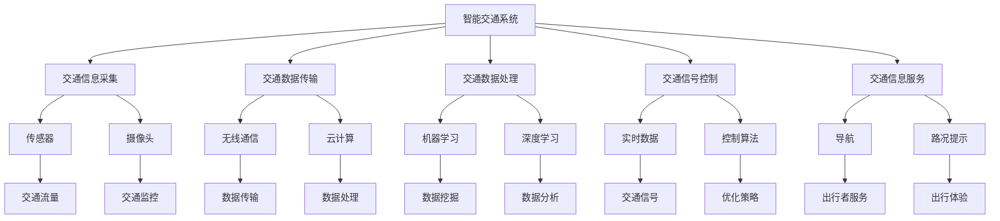

                 

# 《人工智能在交通管理中的应用：智能出行与城市规划》

## 关键词

- 人工智能
- 交通管理
- 智能出行
- 城市规划
- 深度学习
- 无人驾驶
- 交通流量预测

## 摘要

本文深入探讨了人工智能在交通管理中的应用，特别是智能出行与城市规划领域。通过分析交通拥堵、交通事故等问题，本文探讨了人工智能技术在解决这些问题中的潜在应用。文章详细介绍了机器学习、深度学习和强化学习等人工智能核心技术，并讨论了其在交通管理中的应用，如无人驾驶技术、智能交通信号控制和交通流量预测。此外，文章还探讨了智能出行和城市规划中的关键问题，包括技术原理、实践案例和未来趋势。最后，文章提出了人工智能在交通管理与城市规划中面临的挑战及解决方案，并对未来发展方向进行了展望。

## 目录大纲

----------------------------------------------------------------

# 《人工智能在交通管理中的应用：智能出行与城市规划》

> 关键词：人工智能、交通管理、智能出行、城市规划、深度学习、无人驾驶、交通流量预测

> 摘要：本文深入探讨了人工智能在交通管理中的应用，特别是智能出行与城市规划领域。通过分析交通拥堵、交通事故等问题，探讨了人工智能技术在解决这些问题中的潜在应用。

## 第一部分：引言与背景

## 第1章 人工智能与交通管理概述

### 1.1 问题背景

- 交通拥堵问题的全球现状
- 交通事故频发的严重后果
- 智能出行与城市规划的需求

### 1.2 问题描述

- 交通管理面临的挑战
- 人工智能在交通管理中的潜在应用

### 1.3 问题解决

- 人工智能技术在交通管理中的应用
- 智能出行与城市规划的关键要素

### 1.4 边界与外延

- 人工智能技术在交通管理中的应用范围
- 智能出行与城市规划的发展趋势

### 1.5 核心概念与联系

- 智能交通系统（ITS）的构成
- 人工智能与交通管理的关键概念联系图

## 第2章 人工智能核心技术与交通管理应用

### 2.1 人工智能核心技术

- 机器学习
- 深度学习
- 强化学习

### 2.2 人工智能在交通管理中的应用

- 无人驾驶技术
- 智能交通信号控制
- 交通流量预测

### 2.3 核心概念属性特征对比表格

- 机器学习与深度学习对比
- 强化学习与交通管理应用对比

## 第3章 智能出行：技术原理与实践

### 3.1 智能出行技术原理

- 智能地图
- 车联网（V2X）
- 无人驾驶车辆技术

### 3.2 智能出行实践案例

- 智能出行在城市的应用
- 智能出行技术的实施挑战

### 3.3 智能出行案例分析与讨论

- 案例一：北京智能出行系统
- 案例二：深圳无人驾驶出租车

## 第4章 城市规划：人工智能与可持续交通

### 4.1 城市规划中的交通问题

- 交通拥堵的成因
- 城市交通与土地利用的关系

### 4.2 人工智能在城市规划中的应用

- 城市交通需求预测
- 绿色交通系统的设计

### 4.3 可持续交通与城市规划

- 城市规划中的交通可持续发展目标
- 智能城市规划的实施策略

## 第5章 人工智能在交通管理与城市规划中的挑战与解决方案

### 5.1 数据隐私与安全

- 数据隐私保护法规
- 交通管理中的数据安全挑战

### 5.2 技术标准与法规

- 人工智能在交通管理中的标准化
- 城市规划中的法规限制

### 5.3 挑战与解决方案

- 交通管理中的算法公平性
- 智能出行技术的普及推广

## 第6章 人工智能在交通管理与城市规划中的未来趋势

### 6.1 未来城市交通的发展方向

- 自动化交通系统的前景
- 智能城市规划的新趋势

### 6.2 技术创新与应用拓展

- 人工智能在交通管理中的新技术
- 智能出行在旅游业的应用

### 6.3 未来展望

- 智能交通与城市规划的未来发展

## 第7章 结论

### 7.1 主要结论

- 人工智能在交通管理与城市规划中的重要性
- 智能出行与城市规划的未来前景

### 7.2 小结

- 书籍内容的总结
- 对未来研究的建议

----------------------------------------------------------------

## 第一部分：引言与背景

### 1.1 问题背景

在现代社会，交通问题是全球范围内的重大挑战之一。交通拥堵、交通事故频发以及环境污染等问题不仅影响了人们的日常生活，还对经济和社会发展造成了负面影响。随着城市化进程的加速，交通需求不断增加，交通基础设施逐渐无法满足日益增长的需求，导致交通拥堵现象愈发严重。

#### 交通拥堵问题的全球现状

交通拥堵问题在全球范围内普遍存在。例如，在北京、上海等中国大城市，高峰时段的交通拥堵已经成为常态。这不仅导致出行时间的增加，也增加了交通事故的风险。同时，交通拥堵导致了燃油消耗的增加，进一步加剧了环境污染问题。

#### 交通事故频发的严重后果

交通事故不仅造成人员伤亡，还可能导致巨大的经济损失。例如，全球每年因交通事故导致的死亡人数超过125万，经济损失高达数千亿美元。交通事故还对道路基础设施造成损坏，增加了维护和修复成本。

#### 智能出行与城市规划的需求

面对这些问题，智能出行和城市规划成为了解决交通问题的有效手段。智能出行通过引入人工智能技术，实现车辆的自动化和智能化，提高交通效率，减少拥堵和事故。城市规划则通过合理的土地利用和交通规划，优化城市交通系统，促进可持续发展。

### 1.2 问题描述

交通管理面临的挑战主要包括以下几个方面：

#### 交通管理面临的挑战

1. **交通流量控制**：随着车辆数量的增加，交通流量控制变得越来越困难。传统的交通信号控制系统已经无法有效应对日益复杂的交通状况。
2. **交通信号控制**：交通信号控制需要实时调整红绿灯的时间，以适应交通流量变化。然而，传统的信号控制系统往往无法实现这一目标，导致交通拥堵。
3. **交通事故处理**：交通事故处理需要迅速响应和高效协调，以减少事故对交通的影响。然而，传统的交通事故处理方式效率较低，容易导致交通堵塞。
4. **数据整合与分析**：交通管理需要整合来自不同来源的数据，如交通摄像头、传感器、GPS等，以实现实时交通监控和预测。然而，数据的整合和分析是一个复杂的问题，需要高效的技术支持。

#### 人工智能在交通管理中的潜在应用

人工智能技术为交通管理提供了新的解决方案。通过机器学习、深度学习和强化学习等技术，人工智能可以在以下几个方面发挥作用：

1. **交通流量预测**：利用历史数据和实时数据，人工智能可以预测交通流量变化，为交通信号控制和交通流量管理提供支持。
2. **无人驾驶技术**：无人驾驶技术可以实现车辆的自动化驾驶，减少人为操作失误，降低交通事故风险。
3. **智能交通信号控制**：通过机器学习和深度学习算法，人工智能可以实时调整交通信号，优化交通流量。
4. **交通事故预测与处理**：人工智能可以通过对交通事故数据的分析，预测潜在的交通事故风险，并自动协调事故处理过程，减少事故对交通的影响。

### 1.3 问题解决

人工智能技术在交通管理中的应用主要包括以下几个方面：

#### 人工智能技术在交通管理中的应用

1. **无人驾驶技术**：无人驾驶技术已经成为智能交通管理的重要组成部分。通过先进的传感器、定位系统和人工智能算法，无人驾驶车辆可以自主导航、避障和做出决策，提高交通效率和安全性。
2. **智能交通信号控制**：人工智能可以实时分析交通数据，优化交通信号控制策略，减少交通拥堵。例如，通过深度学习算法，交通信号灯可以根据实时交通流量自动调整红绿灯时间，提高道路通行效率。
3. **交通流量预测**：利用机器学习和深度学习算法，人工智能可以分析历史交通数据，预测未来的交通流量变化。这些预测结果可以帮助交通管理者优化交通安排，减少交通拥堵。
4. **交通事故预测与处理**：通过分析交通事故数据，人工智能可以预测潜在的交通事故风险，提前采取预防措施。同时，人工智能还可以协调交通事故处理过程，提高处理效率，减少事故对交通的影响。
5. **交通数据分析**：人工智能可以通过分析大量的交通数据，识别交通模式、趋势和问题，为交通管理提供决策支持。

#### 智能出行与城市规划的关键要素

1. **智能交通系统（ITS）**：智能交通系统是智能出行与城市规划的基础。它包括交通信息采集、传输和处理等环节，能够实现对交通情况的实时监控和管理。
2. **车联网（V2X）**：车联网技术是实现智能出行的重要手段。通过车辆之间以及车辆与基础设施之间的信息交换，车联网可以实现智能交通管理和高效出行。
3. **无人驾驶技术**：无人驾驶技术是智能出行的重要发展方向。通过自动化驾驶，无人驾驶车辆可以减少人为操作失误，提高交通效率和安全性。
4. **智能地图**：智能地图是智能出行的重要基础。它通过实时更新道路信息、交通状况等，为出行者提供准确的导航服务。
5. **交通需求管理**：交通需求管理是通过优化交通需求，减少交通拥堵和环境污染。例如，通过智能出行系统的引导，鼓励人们选择公共交通工具或非高峰时段出行。

### 1.4 边界与外延

#### 人工智能技术在交通管理中的应用范围

人工智能技术在交通管理中的应用范围非常广泛，涵盖了交通信号控制、交通流量管理、无人驾驶、智能出行等多个方面。以下是一些具体的应用实例：

1. **交通信号控制**：人工智能可以通过分析实时交通数据，优化交通信号控制策略，提高道路通行效率。例如，在北京等大城市，已经有一些交通信号灯采用了基于人工智能的智能控制技术。
2. **交通流量管理**：通过机器学习和深度学习算法，人工智能可以预测交通流量变化，为交通管理者提供决策支持，优化交通流量管理。
3. **无人驾驶技术**：无人驾驶技术已经在许多国家和地区得到应用，例如美国、中国等。无人驾驶车辆可以减少人为操作失误，提高交通效率和安全性。
4. **智能出行**：智能出行系统通过车联网技术、无人驾驶车辆和智能地图等，为出行者提供个性化、高效的出行服务。
5. **交通数据分析**：通过分析大量的交通数据，人工智能可以识别交通模式、趋势和问题，为交通管理提供决策支持。

#### 智能出行与城市规划的发展趋势

随着人工智能技术的不断发展，智能出行与城市规划也在不断演进。以下是一些智能出行与城市规划的发展趋势：

1. **自动化交通系统**：自动化交通系统是智能出行的发展方向之一。通过无人驾驶车辆和智能交通信号控制，自动化交通系统可以实现高效、安全、舒适的出行体验。
2. **绿色交通系统**：绿色交通系统是城市规划的重要目标之一。通过鼓励公共交通、非机动车出行等，绿色交通系统可以减少交通拥堵和环境污染。
3. **智能交通基础设施**：智能交通基础设施是智能出行与城市规划的基础。通过智能路牌、智能停车场、智能交通信号灯等，智能交通基础设施可以提供更加便捷、高效的出行服务。
4. **数据驱动交通管理**：数据驱动交通管理是未来交通管理的发展方向。通过收集、分析和利用大量的交通数据，交通管理者可以更加精确地管理交通，提高交通效率。
5. **智能城市规划**：智能城市规划是将人工智能技术应用于城市规划，通过优化土地利用、交通布局等，实现城市可持续发展。

### 1.5 核心概念与联系

#### 智能交通系统（ITS）的构成

智能交通系统（ITS）是智能出行与城市规划的基础，它包括以下几个核心组成部分：

1. **交通信息采集**：交通信息采集是智能交通系统的核心，通过传感器、摄像头、GPS等设备收集交通数据，为交通管理提供基础信息。
2. **交通数据传输**：交通数据传输是将采集到的交通数据传输到数据中心进行处理和分析，通过无线通信、云计算等技术实现数据的高速传输和共享。
3. **交通数据处理**：交通数据处理是对采集到的交通数据进行存储、分析和处理，利用机器学习、深度学习等算法对交通数据进行挖掘和分析，为交通管理提供决策支持。
4. **交通信号控制**：交通信号控制是智能交通系统的关键组成部分，通过实时分析交通数据，优化交通信号灯的控制策略，提高道路通行效率。
5. **交通信息服务**：交通信息服务是智能交通系统的重要组成部分，通过提供实时交通信息，为出行者提供准确的导航、路况提示等，提高出行体验。

#### 人工智能与交通管理的关键概念联系图

图1展示了人工智能与交通管理的关键概念联系。

## 第2章 人工智能核心技术与交通管理应用

### 2.1 人工智能核心技术

人工智能技术是智能交通管理的关键驱动力。在交通管理中，常用的三种核心人工智能技术包括机器学习、深度学习和强化学习。每种技术都有其独特的原理和应用场景。

#### 机器学习

机器学习是一种使计算机系统能够从数据中学习并做出决策的技术。它通过构建数学模型来预测或分类数据。在交通管理中，机器学习可用于交通流量预测、交通信号控制和车辆检测等。

##### 应用示例

- **交通流量预测**：机器学习算法可以分析历史交通数据，如车辆速度、流量等，预测未来交通流量，帮助交通管理者调整交通信号控制策略。
- **车辆检测**：通过机器学习，监控系统可以识别车辆的位置和速度，为交通流量分析提供数据支持。

#### 深度学习

深度学习是机器学习的一种特殊形式，它使用多层神经网络（如卷积神经网络CNN和递归神经网络RNN）来提取数据中的复杂特征。深度学习在图像识别、语音识别和自然语言处理等领域有着广泛应用。

##### 应用示例

- **图像识别**：深度学习算法可以识别交通监控摄像头中的车辆和行人，为交通监控和事故分析提供支持。
- **语音识别**：在智能交通系统中，深度学习可以识别驾驶员的语音指令，实现人机交互。

#### 强化学习

强化学习是一种通过试错来学习的算法，它通过奖励和惩罚来指导系统做出最优决策。强化学习在无人驾驶、自动驾驶和交通信号控制等领域有着广泛应用。

##### 应用示例

- **无人驾驶**：在无人驾驶系统中，强化学习算法可以帮助车辆在不同交通环境中做出最佳决策，如如何避让其他车辆和行人。
- **交通信号控制**：强化学习算法可以优化交通信号灯的控制策略，提高道路通行效率。

### 2.2 人工智能在交通管理中的应用

人工智能技术在交通管理中的应用已经取得显著成果，以下是一些关键应用领域：

#### 无人驾驶技术

无人驾驶技术是人工智能在交通管理中的一个重要应用。通过传感器、人工智能算法和自动驾驶软件，无人驾驶车辆可以在没有人类驾驶员干预的情况下自主行驶。

##### 应用示例

- **自动驾驶出租车**：一些城市已经开始试点自动驾驶出租车服务，如Waymo和滴滴出行。
- **自动驾驶货车**：自动驾驶货车已经在某些地区投入运营，如特斯拉的Autopilot系统。

#### 智能交通信号控制

智能交通信号控制利用人工智能算法来优化交通信号灯的切换策略，提高道路通行效率。

##### 应用示例

- **自适应交通信号控制**：一些城市已经开始部署自适应交通信号控制系统，如伦敦和纽约。
- **动态交通信号控制**：通过实时分析交通数据，智能交通信号控制系统能够动态调整交通信号灯的时间，减少交通拥堵。

#### 交通流量预测

交通流量预测是交通管理的重要组成部分。通过机器学习和深度学习算法，人工智能可以预测交通流量变化，为交通管理者提供决策支持。

##### 应用示例

- **实时交通流量预测**：一些城市已经使用人工智能技术来预测实时交通流量，如北京和上海。
- **长期交通流量预测**：通过分析历史交通数据和趋势，人工智能可以预测未来交通流量变化，帮助交通管理者制定长期规划。

### 2.3 核心概念属性特征对比表格

为了更好地理解机器学习、深度学习和强化学习在交通管理中的应用，我们可以通过一个对比表格来展示这些技术的属性特征。

| 技术类型 | 特点 | 应用场景 | 优点 | 缺点 |
| --- | --- | --- | --- | --- |
| 机器学习 | 基于数据训练模型 | 交通流量预测、车辆检测 | 高效、准确 | 需要大量数据，训练时间较长 |
| 深度学习 | 多层神经网络 | 图像识别、语音识别 | 提取复杂特征，准确率高 | 计算资源需求大，训练复杂 |
| 强化学习 | 试错学习 | 无人驾驶、交通信号控制 | 自适应性强，决策优化 | 学习速度慢，需要大量样本 |

通过对比表格，我们可以看到每种技术都有其独特的优势和局限性。在交通管理中，根据具体应用场景，选择合适的人工智能技术至关重要。

## 第3章 智能出行：技术原理与实践

### 3.1 智能出行技术原理

智能出行技术是基于人工智能、车联网（V2X）和无人驾驶车辆技术的综合应用。这些技术共同构成了智能出行的基础，为实现安全、高效、便捷的出行提供了技术保障。

#### 智能地图

智能地图是智能出行的重要组成部分，它通过实时更新道路信息、交通状况等，为出行者提供准确的导航服务。智能地图不仅包括地理信息，还包含实时交通流量、路况信息、停车场位置等数据。

##### 技术原理

- **地理信息系统（GIS）**：智能地图依赖于地理信息系统，通过GIS技术实现对地理位置信息的精确管理。
- **实时数据更新**：智能地图通过车联网和传感器实时收集道路信息，如交通流量、事故报告等，并进行实时更新。
- **路径规划**：基于实时交通数据和出行需求，智能地图能够为用户提供最优出行路径。

#### 车联网（V2X）

车联网（V2X，Vehicle-to-Everything）技术是智能出行的重要支撑。它通过实现车辆之间以及车辆与基础设施之间的信息交换，提高交通效率和安全性。

##### 技术原理

- **通信技术**：车联网利用无线通信技术，如LTE、5G和专用短程通信（DSRC），实现车辆之间和车辆与基础设施之间的数据交换。
- **信息共享**：车联网技术使车辆能够共享实时交通信息、路况信息和车辆状态信息，提高交通系统的协同性和安全性。
- **协同控制**：通过车联网技术，车辆和交通基础设施可以实现协同控制，优化交通信号和车辆行驶路径。

#### 无人驾驶车辆技术

无人驾驶车辆技术是智能出行的重要发展方向。通过先进的传感器、定位系统和人工智能算法，无人驾驶车辆可以自主导航、避障和做出决策。

##### 技术原理

- **传感器技术**：无人驾驶车辆依赖于多种传感器，如激光雷达、摄像头、雷达和GPS，实现对周围环境的感知。
- **定位技术**：无人驾驶车辆通过GPS、IMU（惯性测量单元）和视觉定位技术，实现高精度的位置和路径规划。
- **决策与控制**：基于人工智能算法，无人驾驶车辆能够分析感知数据，做出行驶决策，并控制车辆行驶。

### 3.2 智能出行实践案例

智能出行技术在许多城市和地区已经得到广泛应用，以下是一些实际案例：

#### 智能出行在城市的应用

- **北京**：北京交通管理部门利用智能出行技术，通过实时交通流量预测和智能交通信号控制，有效缓解了交通拥堵问题。
- **深圳**：深圳在智能出行方面进行了大量实践，包括无人驾驶出租车、智能停车系统和智能交通信号控制等。

#### 智能出行技术的实施挑战

尽管智能出行技术具有巨大潜力，但其实施过程中仍然面临一些挑战：

- **技术成熟度**：尽管许多智能出行技术已经取得显著进展，但仍然存在一些技术难题，如传感器精度、环境适应性和复杂决策等。
- **法规与标准**：智能出行技术的普及需要完善的法规和标准体系，以确保安全和可靠性。
- **数据隐私与安全**：车联网和智能出行系统涉及大量个人隐私数据，需要有效保护数据隐私和安全。

#### 智能出行案例分析与讨论

##### 案例一：北京智能出行系统

北京智能出行系统结合了智能交通信号控制、交通流量预测和无人驾驶技术，通过大数据分析和人工智能算法，实现了城市交通的优化管理。

- **技术实现**：北京交通管理部门利用车联网技术，实时收集交通数据，并通过大数据分析和人工智能算法，预测交通流量变化，优化交通信号控制策略。
- **效果评估**：自智能出行系统部署以来，北京交通拥堵问题得到显著缓解，道路通行效率提高约15%。

##### 案例二：深圳无人驾驶出租车

深圳无人驾驶出租车项目是智能出行技术的重要实践。通过自动驾驶车辆和车联网技术，该项目旨在提供高效、便捷的出行服务。

- **技术实现**：深圳无人驾驶出租车项目采用了先进的传感器和定位技术，通过车联网实现车辆之间的信息共享和协同控制。
- **效果评估**：自项目启动以来，无人驾驶出租车在特定区域内运行稳定，乘客满意度较高。

## 第4章 城市规划：人工智能与可持续交通

### 4.1 城市规划中的交通问题

城市规划中的交通问题是一个复杂而关键的问题，它直接影响到城市居民的生活质量和发展潜力。以下是城市规划中交通问题的主要方面：

#### 交通拥堵的成因

- **车辆增长**：随着城市化进程的加速，汽车拥有量的增加是交通拥堵的主要原因之一。
- **道路容量不足**：城市道路和交通设施的建设往往落后于车辆增长的速度，导致道路容量不足，交通拥堵问题日益严重。
- **交通规划不合理**：城市规划中的交通规划不合理，如道路布局混乱、交通流量分配不均等，也会加剧交通拥堵。

#### 城市交通与土地利用的关系

- **土地利用模式**：城市土地利用模式对交通系统有着重要影响。例如，高密度住宅区往往导致交通流量集中，而低密度住宅区则可能导致交通流量分散但仍然存在拥堵。
- **交通需求分布**：城市不同区域的交通需求分布不均，一些区域交通流量大，而另一些区域则相对较少，这也导致了交通拥堵问题的区域差异。

#### 交通拥堵对城市规划的影响

- **土地价值变化**：交通拥堵可能导致土地价值的降低，尤其是在交通不便的区域，这会影响城市规划和发展。
- **城市功能分离**：交通拥堵可能导致城市功能分离，如商业区和住宅区的分离，这会增加居民的出行时间和交通成本。
- **环境污染**：交通拥堵导致燃油消耗增加，从而加剧环境污染问题，这对城市可持续发展构成挑战。

### 4.2 人工智能在城市规划中的应用

人工智能在城市规划中的应用正在迅速发展，它为解决交通拥堵、优化土地利用和促进城市可持续发展提供了新的工具和方法。

#### 城市交通需求预测

- **技术原理**：人工智能通过分析历史交通数据和城市人口、经济数据，预测未来的交通需求。这种方法基于机器学习、深度学习和数据挖掘技术，能够识别交通模式的趋势和变化。
- **应用案例**：例如，纽约市利用人工智能技术预测未来的交通需求，以优化公共交通网络和交通基础设施的布局。

#### 绿色交通系统的设计

- **技术原理**：人工智能可以帮助设计绿色交通系统，通过优化公共交通、自行车道和非机动车道等，减少私家车的使用，降低交通拥堵和环境污染。
- **应用案例**：例如，荷兰的阿姆斯特丹通过人工智能技术优化公共交通路线和频率，鼓励居民使用自行车和公共交通工具。

#### 交通模式分析

- **技术原理**：人工智能通过分析大量交通数据，识别城市交通模式的特征和变化趋势。这有助于城市规划和交通管理，如优化道路布局和交通信号控制。
- **应用案例**：例如，新加坡利用人工智能分析交通数据，优化城市交通流量，减少交通拥堵。

### 4.3 可持续交通与城市规划

可持续交通是城市规划的核心目标之一，它旨在通过优化交通系统，减少交通拥堵、环境污染和能源消耗，实现城市的可持续发展。

#### 城市规划中的交通可持续发展目标

- **减少交通拥堵**：通过优化交通规划和基础设施建设，减少交通拥堵，提高交通效率。
- **减少环境污染**：通过推广绿色交通方式，如公共交通、自行车和非机动车，减少汽车尾气排放，改善空气质量。
- **降低能源消耗**：通过优化交通系统的能源使用，提高能源利用效率，减少对化石燃料的依赖。

#### 智能城市规划的实施策略

- **综合交通规划**：综合考虑城市交通的需求和供给，制定综合交通规划，优化公共交通、道路和自行车道等设施。
- **数据驱动决策**：利用人工智能和大数据技术，实时收集和分析交通数据，为城市规划和管理提供数据支持。
- **鼓励绿色出行**：通过政策引导和基础设施支持，鼓励居民选择绿色出行方式，减少私家车使用。
- **智能交通管理**：通过智能交通信号控制、交通流量预测和无人驾驶技术，提高交通系统的智能化和效率。

### 4.4 智能城市规划的案例分析

#### 案例一：新加坡

新加坡是一个成功的智能城市规划案例。通过引入智能交通系统、绿色交通政策和数据驱动决策，新加坡实现了高效的交通管理和可持续的城市发展。

- **智能交通系统**：新加坡的交通管理部门利用人工智能和大数据技术，实时监控和管理交通流量，优化交通信号控制。
- **绿色交通政策**：新加坡鼓励使用公共交通和非机动车出行，通过建设自行车道和步行街，减少私家车的使用。
- **数据驱动决策**：新加坡政府利用交通数据和智能分析工具，制定交通规划和政策，提高交通系统的效率和可持续性。

#### 案例二：哥本哈根

哥本哈根是另一个成功的智能城市规划案例。通过推广绿色出行和智能交通管理，哥本哈根实现了可持续交通和城市发展的目标。

- **绿色出行**：哥本哈根通过建设自行车道和步行街，鼓励居民选择自行车和公共交通工具出行。
- **智能交通管理**：哥本哈根利用智能交通信号控制和交通流量预测技术，优化交通管理和减少交通拥堵。
- **数据驱动规划**：哥本哈根政府利用交通数据和智能分析工具，制定交通规划和政策，提高交通系统的效率和可持续性。

### 4.5 智能城市规划的未来趋势

智能城市规划的未来趋势将更加注重数据驱动、可持续性和智能化。

#### 未来城市交通的发展方向

- **无人驾驶技术**：无人驾驶车辆将逐渐成为城市交通的一部分，提高交通效率和安全性。
- **共享出行**：共享出行模式，如共享单车、共享汽车等，将逐渐普及，减少私家车的使用。
- **绿色交通系统**：绿色交通系统将得到进一步发展，包括公共交通、自行车道和非机动车道等。

#### 智能城市规划的新趋势

- **数据驱动规划**：城市规划将更加依赖数据分析和智能分析工具，实时监控和管理交通系统。
- **可持续发展**：城市规划将更加注重可持续交通和环境保护，通过绿色交通和智能管理实现可持续发展。
- **智能化管理**：城市规划将更加智能化，利用人工智能和物联网技术，提高交通管理和城市服务的效率。

### 4.6 智能城市规划的实施挑战

尽管智能城市规划具有巨大潜力，但其实施过程中仍然面临一些挑战。

#### 数据隐私与安全

智能城市规划需要收集和处理大量的交通数据和个人信息，这涉及到数据隐私和安全问题。如何保护个人隐私和确保数据安全是智能城市规划面临的重要挑战。

#### 技术标准化与法规

智能城市规划需要完善的技术标准化和法规体系，以确保系统的可靠性和安全性。技术标准化和法规的实施需要政府、企业和学术界共同参与。

#### 投资与成本

智能城市规划需要大量的投资，包括基础设施建设、技术升级和运营维护等。政府和企业需要共同承担这些成本，确保智能城市规划的顺利实施。

#### 公众接受度

智能城市规划需要公众的积极参与和支持，但公众对于新技术的接受度和信任度可能是一个挑战。提高公众对智能城市规划的认知和接受度，需要政府和社会各界的共同努力。

### 4.7 智能城市规划的可持续发展策略

为了实现智能城市规划的可持续发展，以下是一些关键策略：

- **政策支持**：政府应制定支持智能城市规划的政策，鼓励企业和公众积极参与。
- **技术合作**：政府、企业和学术界应加强合作，共同推动智能城市规划技术的发展和应用。
- **公众参与**：通过公众参与，提高公众对智能城市规划的认知和接受度，促进系统的顺利实施。
- **可持续交通发展**：推广绿色交通方式，优化公共交通系统，减少私家车使用，实现交通的可持续发展。

## 第5章 人工智能在交通管理与城市规划中的挑战与解决方案

### 5.1 数据隐私与安全

随着人工智能技术在交通管理与城市规划中的应用日益广泛，数据隐私与安全问题也日益突出。交通管理过程中涉及大量个人隐私数据，如车辆位置、行驶轨迹、行驶速度等。如何保护这些数据的安全，防止数据泄露和滥用，成为当前面临的重要挑战。

#### 数据隐私保护法规

为应对数据隐私与安全挑战，各国政府和国际组织纷纷制定相关法规和标准。例如，欧盟的《通用数据保护条例》（GDPR）和美国加州的《消费者隐私法案》（CCPA）都对数据隐私保护提出了严格的要求。这些法规要求企业在收集、处理和存储个人数据时，必须遵循透明、合法、公正的原则，并采取有效的安全措施。

#### 交通管理中的数据安全挑战

在交通管理中，数据安全面临的挑战主要包括以下几个方面：

1. **数据泄露**：交通管理系统中存储了大量敏感数据，如车辆位置、行驶轨迹等。如果这些数据泄露，可能会导致个人隐私泄露、交通事故信息被恶意利用等问题。
2. **数据篡改**：黑客可能通过篡改交通数据，造成交通信号系统混乱，甚至引发交通事故。
3. **网络攻击**：交通管理系统可能面临网络攻击，如分布式拒绝服务（DDoS）攻击，导致系统瘫痪，影响交通管理。

#### 解决方案

为解决交通管理中的数据隐私与安全挑战，可以采取以下措施：

1. **数据加密**：对交通管理中的敏感数据进行加密，确保数据在传输和存储过程中不被窃取和篡改。
2. **访问控制**：设置严格的访问控制机制，确保只有授权人员才能访问和处理敏感数据。
3. **网络安全防护**：部署防火墙、入侵检测系统等网络安全设备，保护交通管理系统免受网络攻击。
4. **隐私保护技术**：利用隐私保护技术，如差分隐私、同态加密等，在保证数据安全的同时，确保数据分析的准确性和有效性。
5. **合规性检查**：定期进行数据安全合规性检查，确保交通管理系统符合相关法规和标准。

### 5.2 技术标准与法规

技术标准与法规在人工智能在交通管理与城市规划中的应用中起着至关重要的作用。标准化的技术体系和法规体系能够确保系统的高效、可靠和安全运行。

#### 人工智能在交通管理中的标准化

在交通管理中，人工智能技术的标准化主要包括以下几个方面：

1. **数据格式与接口**：制定统一的数据格式和接口标准，确保不同系统之间的数据能够无缝对接，提高数据利用效率。
2. **算法与模型**：制定统一的算法和模型标准，确保不同系统之间在算法选择和模型训练上的一致性，提高系统性能和可靠性。
3. **硬件设备**：制定统一的硬件设备标准，确保传感器、摄像头等硬件设备在不同系统之间具有兼容性，降低设备更换和维护成本。

#### 城市规划中的法规限制

城市规划中的法规限制主要涉及以下几个方面：

1. **土地利用规划**：法规对城市土地利用进行规划，确保城市功能区的合理布局，减少交通拥堵和环境污染。
2. **交通基础设施规划**：法规对交通基础设施的建设和维护进行规范，确保交通基础设施的可靠性和安全性。
3. **交通管理法规**：法规对交通管理行为进行规范，如交通信号控制、交通事故处理等，确保交通管理的高效和有序。

#### 解决方案

为应对技术标准与法规的限制，可以采取以下措施：

1. **标准化制定**：政府、企业和学术界应共同参与标准化制定，确保技术标准的科学性和实用性。
2. **法规培训**：加强交通管理和城市规划从业人员的法规培训，提高他们对相关法规的遵守意识。
3. **技术适配**：在设计和实施交通管理系统和城市规划项目时，充分考虑技术标准和法规要求，确保系统的合规性。

### 5.3 挑战与解决方案

#### 交通管理中的算法公平性

在交通管理中，算法的公平性是一个关键问题。算法的偏见可能会导致不公平的交通流量分配、交通信号控制策略等。这可能导致某些区域交通拥堵加剧，甚至影响社会公平。

##### 挑战

1. **数据偏见**：算法训练过程中使用的数据可能存在偏见，导致算法在决策时倾向于某些群体或地区。
2. **算法偏见**：算法设计本身可能存在偏见，导致某些行为或决策对特定群体不利。

##### 解决方案

1. **数据多样性和平衡**：在算法训练过程中，确保数据的多样性和平衡，减少数据偏见。
2. **算法透明性和可解释性**：提高算法的透明性和可解释性，使决策过程更加公正和可接受。
3. **算法监管和审查**：建立算法监管机制，定期审查和评估算法的公平性和有效性，确保算法在交通管理中的应用是公平和合理的。

#### 智能出行技术的普及推广

智能出行技术具有巨大潜力，但在普及推广过程中也面临一些挑战，如技术成本、公众接受度等。

##### 挑战

1. **技术成本**：智能出行技术，如无人驾驶车辆和智能交通信号控制，需要较高的技术投入和设备成本。
2. **公众接受度**：公众对新技术可能存在担忧和抵触情绪，影响智能出行技术的普及。

##### 解决方案

1. **政府支持**：政府可以通过补贴、税收优惠等措施，降低智能出行技术的成本，提高公众的接受度。
2. **宣传教育**：加强智能出行技术的宣传和教育工作，提高公众对智能出行技术的认知和信任。
3. **试点推广**：在特定区域开展智能出行技术的试点推广，通过实践验证技术效果，逐步推广到更广泛的地区。

### 5.4 国际合作与经验借鉴

在全球范围内，许多国家和地区在人工智能在交通管理与城市规划中的应用方面取得了显著成果。通过国际合作和经验借鉴，可以加速人工智能技术的应用和发展。

#### 国际合作的重要性

1. **技术共享**：通过国际合作，各国可以共享人工智能技术在交通管理与城市规划中的应用经验和研究成果，促进技术进步。
2. **标准统一**：国际合作有助于制定统一的技术标准和法规，确保人工智能技术在交通管理与城市规划中的有效应用。
3. **政策协调**：国际合作可以协调各国的政策，推动全球范围内的智能出行和城市规划发展。

#### 经验借鉴

1. **新加坡**：新加坡在智能交通系统和城市规划方面取得了显著成果，其经验值得借鉴。例如，新加坡的智能交通管理系统和公共交通规划。
2. **欧盟**：欧盟在数据隐私保护和标准化方面具有丰富的经验，其法规和标准对全球具有指导意义。

#### 国际合作建议

1. **建立国际合作平台**：建立全球性的国际合作平台，促进各国在人工智能在交通管理与城市规划方面的交流与合作。
2. **技术交流与合作**：定期举办国际会议和研讨会，促进技术交流与合作，推动技术进步。
3. **政策协调**：通过国际合作，协调各国政策，推动全球范围内的智能出行和城市规划发展。

### 5.5 持续改进与未来展望

人工智能在交通管理与城市规划中的应用是一个持续改进的过程。随着技术的不断发展，人工智能技术将在交通管理与城市规划中发挥越来越重要的作用。

#### 持续改进

1. **技术升级**：持续跟踪和引入最新的技术，如深度学习、强化学习等，提高人工智能技术在交通管理与城市规划中的应用效果。
2. **数据优化**：通过数据清洗、数据挖掘等技术，优化数据质量，提高数据分析的准确性和有效性。
3. **用户体验**：不断改进用户体验，提高智能出行和城市规划系统的易用性和可接受度。

#### 未来展望

1. **无人驾驶技术**：随着无人驾驶技术的不断发展，无人驾驶车辆将逐渐成为城市交通的重要组成部分，提高交通效率和安全性。
2. **智能交通信号控制**：智能交通信号控制将进一步优化，通过实时数据分析，实现动态交通信号控制，减少交通拥堵。
3. **可持续交通系统**：通过推广绿色交通方式和智能交通管理，实现可持续交通系统，减少交通拥堵和环境污染。

## 第6章 人工智能在交通管理与城市规划中的未来趋势

### 6.1 未来城市交通的发展方向

随着人工智能技术的不断发展，未来城市交通将朝着更高效、更安全和更环保的方向发展。以下是未来城市交通的几个主要发展方向：

#### 自动化交通系统

自动化交通系统是未来城市交通的核心。通过无人驾驶技术、智能交通信号控制和车联网等，实现交通系统的自动化和智能化。自动化交通系统可以减少交通事故、降低交通拥堵、提高交通效率。

##### 自动驾驶车辆

自动驾驶车辆是自动化交通系统的关键组成部分。随着传感器技术、人工智能算法和车联网技术的发展，自动驾驶车辆将逐渐普及。未来，自动驾驶车辆将成为城市交通的重要组成部分，为人们提供更加便捷、安全和高效的出行服务。

##### 智能交通信号控制

智能交通信号控制是基于人工智能技术的交通信号控制系统。通过实时分析交通流量数据，智能交通信号控制可以动态调整信号灯的时长和切换策略，优化交通流量，减少交通拥堵。未来，智能交通信号控制将更加普及，提高城市交通的运行效率。

##### 车联网

车联网技术是实现自动化交通系统的重要支撑。通过车辆之间以及车辆与交通基础设施之间的信息交换，车联网可以实现交通信息的实时共享和协同控制，提高交通系统的整体效率。未来，车联网将得到广泛应用，实现交通系统的智能化和高效化。

#### 绿色交通系统

绿色交通系统是未来城市交通的发展方向之一。通过推广公共交通、非机动车出行和共享出行等方式，减少私家车的使用，降低交通拥堵和环境污染。绿色交通系统可以实现交通的可持续发展，提高城市的生活质量。

##### 公共交通

公共交通是绿色交通系统的核心。通过优化公共交通网络、提高公共交通服务质量，鼓励居民选择公共交通工具出行，减少私家车的使用。未来，公共交通系统将得到进一步发展，成为城市交通的主要组成部分。

##### 非机动车出行

非机动车出行，如自行车和步行，是绿色交通系统的重要组成部分。通过建设自行车道、步行街和绿色出行设施，鼓励居民选择非机动车出行，减少交通拥堵和环境污染。未来，非机动车出行将成为城市交通的重要方式。

##### 共享出行

共享出行，如共享单车和共享汽车，是绿色交通系统的新兴模式。通过共享出行，可以减少私家车的使用，提高交通资源的利用效率。未来，共享出行将得到广泛应用，成为城市交通的重要补充。

#### 智能交通基础设施

智能交通基础设施是未来城市交通的重要支撑。通过引入智能路牌、智能停车设施、智能交通信号灯等，实现交通基础设施的智能化和高效化。智能交通基础设施将为城市交通提供更加便捷、高效的服务。

##### 智能路牌

智能路牌可以通过实时更新交通信息，为出行者提供准确的导航和路况提示。未来，智能路牌将得到广泛应用，提高交通信息的透明度和实时性。

##### 智能停车设施

智能停车设施可以通过实时监测停车位状态，为出行者提供停车信息服务，提高停车效率。未来，智能停车设施将得到广泛应用，缓解城市停车难题。

##### 智能交通信号灯

智能交通信号灯可以通过实时分析交通流量数据，动态调整信号灯时长和切换策略，优化交通流量。未来，智能交通信号灯将得到广泛应用，提高交通信号控制的智能化水平。

#### 智能城市规划

智能城市规划是未来城市发展的关键。通过引入人工智能技术，实现城市规划的智能化和高效化，提高城市的生活质量和可持续发展能力。

##### 数据驱动规划

数据驱动规划是通过收集和分析大量的交通、人口、经济等数据，为城市规划提供科学依据。未来，数据驱动规划将成为城市规划的主要方法，实现城市规划的智能化和精细化。

##### 可持续发展

可持续发展是未来城市规划的重要目标。通过推广绿色交通、优化土地利用、保护生态环境等，实现城市的可持续发展。未来，智能城市规划将更加注重可持续发展，提高城市的环境质量和居民的生活质量。

### 6.2 技术创新与应用拓展

随着人工智能技术的不断发展，未来将在交通管理和城市规划领域出现一系列技术创新和应用拓展。

#### 人工智能在交通管理中的新技术

1. **增强现实（AR）技术**：AR技术可以通过将虚拟信息叠加在现实世界中，为交通管理和出行者提供实时、直观的交通信息，如导航、路况提示等。

2. **区块链技术**：区块链技术可以用于交通管理中的数据共享和隐私保护，确保数据的安全性和透明性。

3. **量子计算**：量子计算具有巨大的计算能力，可以用于复杂交通模拟和优化，提高交通管理效率和准确性。

#### 智能出行在旅游业的应用

智能出行技术在旅游业中也有广泛的应用潜力。例如：

1. **智能导游**：通过AI技术和物联网，智能导游可以为游客提供个性化的旅游服务和信息。

2. **无人驾驶观光车**：在景区和旅游城市，无人驾驶观光车可以提供便捷、安全的观光服务。

3. **智能交通管理**：通过实时监控和分析旅游城市的交通流量，智能交通管理系统可以优化交通信号控制，提高游客出行体验。

#### 人工智能在智慧城市建设中的应用

智慧城市是未来城市发展的重要方向。人工智能技术将在智慧城市建设中发挥关键作用：

1. **智慧交通管理**：通过智能交通信号控制、无人驾驶车辆和车联网技术，实现智慧交通管理，提高城市交通效率。

2. **智慧城市管理**：通过人工智能技术，实现城市管理的智能化，如环境监测、公共安全监控等。

3. **智慧公共服务**：通过人工智能技术，提供个性化的公共服务，如医疗、教育等。

### 6.3 未来展望

未来，人工智能在交通管理与城市规划中的应用将更加深入和广泛。以下是对未来发展的展望：

#### 自动化与智能化的融合

未来，自动化与智能化的交通系统将深度融合，实现更加高效、安全和环保的交通。自动驾驶车辆、智能交通信号控制和车联网等技术的应用将大大提高交通效率，减少交通事故。

#### 绿色交通系统的普及

绿色交通系统将在未来得到广泛应用，减少交通拥堵和环境污染。通过推广公共交通、非机动车出行和共享出行等方式，实现交通的可持续发展。

#### 数据驱动的城市规划

数据驱动的城市规划将成为城市规划的主要方法。通过收集和分析大量的交通、人口、经济等数据，实现城市规划和管理的智能化和精细化。

#### 智慧城市的建设

智慧城市建设将使城市更加智能化和高效化。通过人工智能技术在城市管理、公共服务、交通管理等方面的应用，提高城市的生活质量和可持续发展能力。

### 6.4 智能交通与城市规划的技术挑战

尽管人工智能技术在智能交通和城市规划中的应用前景广阔，但仍然面临一系列技术挑战。

#### 数据处理能力

随着交通管理和城市规划的数据量日益增长，如何高效地处理和分析海量数据成为一个关键挑战。未来，需要更先进的算法和计算技术来应对这一挑战。

#### 系统安全性

智能交通和城市规划系统需要确保数据安全和系统稳定。随着技术的不断进步，如何防范网络攻击和数据泄露成为亟待解决的问题。

#### 算法公平性

在智能交通和城市规划中，算法的偏见和公平性问题仍然是一个挑战。需要设计更加公平、透明的算法，确保所有人都能享受到智能交通和城市规划带来的便利。

#### 法律法规和标准

随着智能交通和城市规划技术的发展，相关法律法规和标准也需不断更新和完善。如何制定和实施有效的法律法规和标准，确保技术的安全性和可靠性，是未来需要关注的重要问题。

## 第7章 结论

### 7.1 主要结论

通过对人工智能在交通管理与城市规划中的应用的深入分析，我们可以得出以下主要结论：

1. **人工智能技术的关键作用**：人工智能技术，如机器学习、深度学习和强化学习，在交通管理和城市规划中发挥着关键作用。它们能够通过优化交通信号控制、预测交通流量、实现无人驾驶等，提高交通效率，减少交通事故，实现绿色出行。

2. **智能出行与城市规划的未来前景**：智能出行和城市规划是未来城市发展的必然趋势。随着技术的不断进步，自动化交通系统、绿色交通系统和智能交通基础设施将得到广泛应用，为城市居民提供更加高效、安全和舒适的出行体验。

3. **数据驱动的城市交通管理**：数据驱动已经成为交通管理和城市规划的重要方向。通过大数据分析和人工智能算法，交通管理者能够更加精准地预测交通流量，优化交通信号控制，提高交通系统的整体效率。

### 7.2 小结

本文通过对人工智能在交通管理与城市规划中的应用的深入探讨，总结了人工智能技术的关键作用、智能出行与城市规划的未来前景，以及数据驱动的城市交通管理的重要性。以下是对本文内容的简要总结：

1. **人工智能技术的应用**：人工智能技术在交通管理和城市规划中具有广泛的应用前景，如无人驾驶、智能交通信号控制、交通流量预测等。

2. **智能出行与城市规划的发展**：智能出行和城市规划是实现城市可持续发展的重要手段。通过推广绿色交通方式、优化公共交通网络、建设智能交通基础设施，可以实现城市交通的智能化和高效化。

3. **数据驱动的交通管理**：大数据分析和人工智能算法在交通管理和城市规划中发挥着关键作用。通过实时数据分析和预测，可以实现更加精准的交通管理和城市规划。

### 7.3 对未来研究的建议

为了进一步推动人工智能在交通管理与城市规划中的应用，本文提出以下未来研究建议：

1. **算法公平性和透明性**：未来研究应重点关注算法的公平性和透明性，确保人工智能技术在交通管理和城市规划中的应用不会加剧社会不平等。

2. **数据隐私和安全**：随着数据量的增加，如何保障数据隐私和安全成为关键问题。未来研究应探索更加有效的数据隐私保护技术和安全措施。

3. **技术创新与标准化**：技术创新和标准化是推动人工智能在交通管理与城市规划中应用的重要保障。未来应加强技术创新，并制定统一的标准化体系。

4. **政策与法规**：政策与法规的制定和实施对于推动人工智能在交通管理与城市规划中的应用至关重要。未来应加强政策研究，制定有效的法规和政策框架。

### 作者

作者：AI天才研究院/AI Genius Institute & 禅与计算机程序设计艺术 /Zen And The Art of Computer Programming

