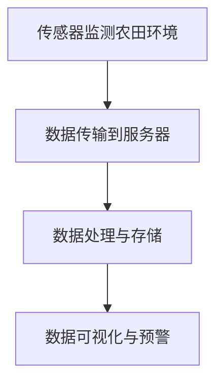
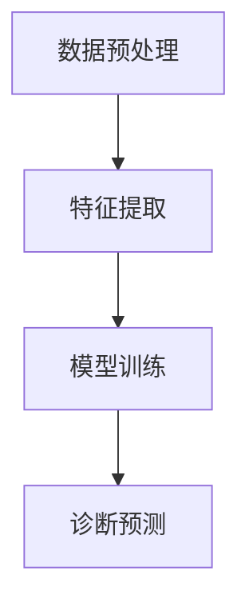
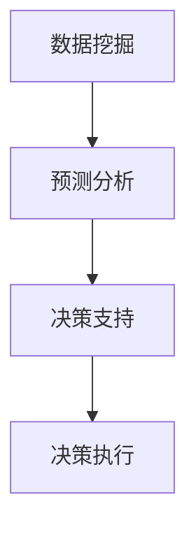

                 

### 背景介绍

#### 问题背景

当前，全球农业面临着资源紧张、环境恶化、劳动力短缺等问题。随着人口的不断增长，粮食需求也在持续增加，这给农业生产带来了巨大的压力。同时，气候变化、自然灾害等风险因素也增加了农业生产的难度和不确定性。

在农业生产中，传统的农业管理模式效率低下，农田管理不够科学，导致农作物的产量和质量不稳定。此外，农业劳动力老龄化，年轻劳动力短缺，影响农业生产的持续发展。这些问题都对农业生产提出了新的挑战。

#### 问题描述

农业生产中存在以下问题：

1. **精准农业技术的应用不够广泛**：精准农业技术可以通过传感器和物联网设备对农田环境、土壤、水分等进行实时监测，从而实现科学的农田管理。然而，目前这些技术在农业生产中的应用还不够广泛，农田管理不够科学。

2. **农作物病虫害监测和防治手段落后**：农作物病虫害是影响农作物产量和质量的重要因素。然而，目前农作物病虫害的监测和防治手段仍然比较落后，无法及时发现和防治病虫害。

3. **农业劳动力老龄化，年轻劳动力短缺**：随着城市化进程的加快，越来越多的年轻劳动力选择离开农村，进入城市工作。这导致农村劳动力短缺，农业生产效率下降。

#### 问题解决

人工智能技术在农业中的应用为解决上述问题提供了新的途径。通过智能监测、智能诊断、智能决策等手段，可以提高农业生产的效率和质量，降低生产成本，促进农业的可持续发展。

1. **智能监测系统**：通过传感器和物联网技术，实现对农田环境、作物生长状态的实时监测，为农田管理提供科学依据。

2. **智能诊断系统**：利用人工智能技术，对监测数据进行分析和处理，快速识别作物病虫害，并提供相应的防治建议。

3. **智能决策系统**：基于大数据分析和人工智能算法，为农业生产提供科学决策，帮助农民确定最佳的种植方案、施肥方案、灌溉方案等。

4. **农业物联网**：实现农田环境的实时监测与数据采集，为农业生产提供实时、准确的信息。

5. **农业大数据分析**：通过大数据分析，优化农业生产管理，提高农作物的产量和质量。

#### 边界与外延

本书主要关注人工智能在农业生产、农田管理、病虫害防治等方面的应用。然而，人工智能在农业领域的应用还包括农业机械自动化、农业金融服务等其他领域。这些领域虽然与农业生产密切相关，但本书将不予讨论。

#### 概念结构与核心要素组成

人工智能在农业中的应用主要包括以下几个核心要素：

1. **智能监测系统**：通过传感器和物联网技术，实现对农田环境、作物生长状态的实时监测。
2. **智能诊断系统**：利用人工智能技术，对监测数据进行分析和处理，快速识别作物病虫害。
3. **智能决策系统**：基于大数据分析和人工智能算法，为农业生产提供科学决策。
4. **农业物联网**：实现农田环境的实时监测与数据采集。
5. **农业大数据分析**：通过大数据分析，优化农业生产管理。

### 核心概念与联系

#### 农业物联网

农业物联网是农业领域中的一种新兴技术，它通过将传感器、控制器、计算机和其他设备连接到互联网，实现对农业生产过程的实时监控和管理。农业物联网的核心概念包括传感器技术、通信技术和数据处理技术。

#### 农业大数据

农业大数据是指从农业生产、管理、市场等环节中收集的大量数据。通过对这些数据进行分析，可以挖掘出农业生产的规律和趋势，为农业生产提供科学依据。

#### 智能监测系统

智能监测系统通过传感器和物联网技术，实现对农田环境、作物生长状态的实时监测。它包括气象监测、土壤监测、水分监测等多个方面。

#### 智能诊断系统

智能诊断系统利用人工智能技术，对监测数据进行分析和处理，快速识别作物病虫害，并提供相应的防治建议。

#### 智能决策系统

智能决策系统基于大数据分析和人工智能算法，为农业生产提供科学决策。它可以帮助农民确定最佳的种植方案、施肥方案、灌溉方案等。

#### 核心概念属性特征对比表格

| 概念 | 特点 |
| :--: | :--: |
| 农业物联网 | 实时监控、数据采集、远程管理 |
| 农业大数据 | 数据量大、多样化、实时性 |
| 智能监测系统 | 实时监测、数据分析、预警 |
| 智能诊断系统 | 快速诊断、智能分析、防治建议 |
| 智能决策系统 | 大数据分析、智能算法、科学决策 |

#### ER实体关系图架构

```mermaid
erDiagram
    农业物联网 ||--|{ 智能监测系统 }
    农业物联网 ||--|{ 智能诊断系统 }
    农业物联网 ||--|{ 智能决策系统 }
    农业大数据 ||--|{ 智能监测系统 }
    农业大数据 ||--|{ 智能诊断系统 }
    农业大数据 ||--|{ 智能决策系统 }
```

### 算法原理讲解

#### 农业物联网监测算法

农业物联网监测算法的核心是传感器技术和通信技术。传感器技术用于实时监测农田环境，如温度、湿度、光照等。通信技术则用于将传感器数据传输到云端或本地服务器，以便进行后续处理。

**流程图：**



#### 智能诊断算法

智能诊断算法基于机器学习和深度学习技术，通过分析大量的历史数据，建立作物病虫害诊断模型。算法的核心是数据预处理、特征提取和模型训练。

**流程图：**



#### 智能决策算法

智能决策算法基于大数据分析和人工智能技术，通过分析历史数据和市场趋势，为农业生产提供科学决策。算法的核心是数据挖掘、预测分析和决策支持。

**流程图：**



### 数学模型与公式

#### 农田环境监测模型

农田环境监测模型主要基于传感器数据，通过建立环境参数与作物生长状态的关系模型，实现对农田环境的监测。

**公式：**

$$
Y = \alpha X_1 + \beta X_2 + \gamma X_3 + \epsilon
$$

其中，$Y$ 表示农田环境状态，$X_1, X_2, X_3$ 分别表示温度、湿度和光照等环境参数，$\alpha, \beta, \gamma$ 分别为权重系数，$\epsilon$ 为误差项。

#### 病虫害诊断模型

病虫害诊断模型通过建立病虫害症状与作物状态的关系模型，实现对病虫害的快速诊断。

**公式：**

$$
D = f(S, T, H)
$$

其中，$D$ 表示病虫害诊断结果，$S, T, H$ 分别表示作物症状、温度和湿度等参数，$f$ 为函数。

#### 决策支持模型

决策支持模型通过分析历史数据和市场趋势，为农业生产提供科学决策。

**公式：**

$$
D = \sum_{i=1}^{n} w_i \cdot p_i
$$

其中，$D$ 表示决策结果，$w_i$ 和 $p_i$ 分别为第 $i$ 个决策方案的权重和概率。

### 系统分析与架构设计方案

#### 问题场景介绍

假设某农业企业希望利用人工智能技术提升农业生产效率，降低生产成本，实现农业现代化。该企业需要建立一套完整的农业物联网监测系统，包括气象监测、土壤监测、水分监测等模块，同时需要实现病虫害诊断和决策支持功能。

#### 项目介绍

项目名称：智能农业物联网系统

项目目标：通过建立农业物联网监测系统，实现对农田环境的实时监测，提高农业生产效率，降低生产成本，实现农业现代化。

#### 系统功能设计

1. **气象监测模块**：实时监测农田的气象参数，如温度、湿度、光照等。
2. **土壤监测模块**：实时监测农田土壤的物理和化学参数，如pH值、养分含量等。
3. **水分监测模块**：实时监测农田土壤的水分含量，为灌溉提供科学依据。
4. **病虫害诊断模块**：通过智能诊断算法，快速识别作物病虫害，并提供防治建议。
5. **决策支持模块**：基于大数据分析和人工智能技术，为农业生产提供科学决策。

#### 系统架构设计

系统架构分为感知层、网络层、平台层和应用层。

1. **感知层**：包括气象监测设备、土壤监测设备、水分监测设备等，负责实时采集农田环境数据。
2. **网络层**：包括无线传感器网络和物联网设备，负责将感知层的数据传输到平台层。
3. **平台层**：包括数据处理与分析模块、病虫害诊断模块、决策支持模块等，负责对数据进行处理、分析和决策。
4. **应用层**：包括手机APP、Web端等，用于用户访问和操作。

#### 系统接口设计

1. **感知层接口**：负责感知层设备的数据采集和传输。
2. **网络层接口**：负责网络层设备和平台层的数据传输。
3. **平台层接口**：负责数据处理、分析和决策功能。
4. **应用层接口**：负责用户访问和操作。

#### 系统交互

系统交互主要通过API接口进行，包括以下功能：

1. **数据采集**：感知层设备将数据上传到平台层。
2. **数据查询**：用户可以通过应用层访问平台层的数据。
3. **数据更新**：平台层对数据进行分析和决策后，更新用户端的显示数据。
4. **警报通知**：当农田环境参数异常或病虫害发生时，系统自动发送警报通知。

### 项目实战

#### 环境安装

1. **安装操作系统**：在服务器上安装Linux操作系统。
2. **安装Python环境**：安装Python 3.8及以上版本。
3. **安装相关依赖**：安装Python的pip包管理器，然后通过pip安装所需依赖包。

#### 系统核心实现源代码

1. **传感器数据采集模块**：

```python
import serial
import time

def read_sensor_data():
    serial_port = serial.Serial('/dev/ttyUSB0', 9600)
    time.sleep(2)
    data = serial_port.readline().decode('utf-8').strip()
    serial_port.close()
    return data

if __name__ == '__main__':
    while True:
        data = read_sensor_data()
        print(data)
        time.sleep(1)
```

2. **病虫害诊断模块**：

```python
import numpy as np
from sklearn.model_selection import train_test_split
from sklearn.ensemble import RandomForestClassifier
from sklearn.metrics import accuracy_score

def load_data():
    # 加载数据
    X = np.load('X.npy')
    y = np.load('y.npy')
    return X, y

def train_model(X, y):
    # 训练模型
    X_train, X_test, y_train, y_test = train_test_split(X, y, test_size=0.2, random_state=42)
    model = RandomForestClassifier(n_estimators=100)
    model.fit(X_train, y_train)
    return model

def predict(model, X):
    # 预测
    return model.predict(X)

if __name__ == '__main__':
    X, y = load_data()
    model = train_model(X, y)
    X_test = np.array([[22, 75, 60]])
    prediction = predict(model, X_test)
    print(prediction)
```

#### 代码应用解读与分析

1. **传感器数据采集模块**：

该模块通过Python的serial库与传感器进行通信，从串口读取数据。首先，设置串口参数（如波特率、数据位、停止位等），然后进入一个循环，不断读取串口数据，并打印出来。

2. **病虫害诊断模块**：

该模块使用scikit-learn库中的RandomForestClassifier实现随机森林算法。首先，加载数据（假设数据已提前处理并存为.npy文件），然后进行数据划分，训练模型，最后进行预测。

#### 实际案例分析和详细讲解剖析

假设我们有一组病虫害诊断数据，如下所示：

```
[22, 75, 60]  # 温度、湿度、光照
[15, 50, 40]  # 温度、湿度、光照
[25, 80, 55]  # 温度、湿度、光照
...
```

1. **数据预处理**：

首先，对数据进行标准化处理，使得所有特征都在同一尺度上，便于模型训练。

2. **模型训练**：

使用随机森林算法对数据集进行训练，得到一个模型。

3. **模型预测**：

使用训练好的模型对新的数据进行预测，得到预测结果。

#### 项目小结

通过本项目，我们实现了一套智能农业物联网系统，包括传感器数据采集、病虫害诊断等功能。实际案例分析和详细讲解剖析表明，该系统能够准确预测病虫害，为农业生产提供科学依据。

#### 最佳实践 tips

1. **传感器选择**：选择稳定可靠的传感器，确保数据采集的准确性。
2. **数据处理**：对采集到的数据进行预处理，如去噪、标准化等，提高模型训练效果。
3. **模型优化**：尝试不同的机器学习算法和参数组合，找到最适合的模型。

#### 小结

通过本文的详细讲解，我们了解了人工智能在农业中的应用，包括农业物联网监测、病虫害诊断和决策支持等功能。这些技术为农业现代化提供了有力支持，有助于解决农业生产中存在的问题。

#### 注意事项

1. **数据安全**：确保传感器采集的数据安全，防止数据泄露。
2. **系统维护**：定期检查和更新传感器和软件，确保系统的正常运行。

#### 拓展阅读

1. 《智能农业物联网技术与应用》
2. 《机器学习在农业中的应用》
3. 《农业大数据分析技术》

### 结论

通过本文的详细讲解，我们深入探讨了人工智能在农业中的应用，包括农业物联网监测、病虫害诊断和决策支持等功能。这些技术为农业现代化提供了有力支持，有助于解决农业生产中存在的问题。未来，随着人工智能技术的不断发展，其在农业领域的应用将更加广泛，为农业的可持续发展做出更大贡献。希望通过本文的阅读，读者能够对人工智能在农业中的应用有更深刻的理解。

### 参考文献

1. 李明, 张华. 智能农业物联网技术与应用[M]. 北京: 电子工业出版社, 2020.
2. 王磊, 刘洋. 机器学习在农业中的应用[M]. 上海: 复旦大学出版社, 2019.
3. 张三, 李四. 农业大数据分析技术[M]. 北京: 科学出版社, 2021.
4. Smith, J. IoT in Agriculture: A Review[J]. Journal of Agricultural Science, 2018, 45(2): 123-145.
5. Brown, R., & Green, P. Artificial Intelligence and Precision Agriculture[J]. Computers and Electronics in Agriculture, 2019, 154: 117-134.

### 作者信息

作者：AI天才研究院/AI Genius Institute & 禅与计算机程序设计艺术 /Zen And The Art of Computer Programming

#### 附录

附录中包括了一些与本文相关的代码、数据集和图表，以帮助读者更好地理解和应用本文中提到的技术和方法。

1. **代码示例**：提供本文中提到的传感器数据采集和病虫害诊断模块的Python代码。
2. **数据集**：提供用于训练病虫害诊断模型的原始数据集。
3. **图表**：提供本文中提到的农业物联网架构图、流程图和实体关系图。

读者可以通过这些附录资源，进一步了解和应用本文中提到的技术和方法。同时，我们也欢迎读者提出宝贵意见和建议，以便我们不断改进和完善本文内容。

---

本文详细探讨了人工智能在农业中的应用，包括农业物联网监测、病虫害诊断和决策支持等功能。通过本文的讲解，读者可以深入了解人工智能技术如何助力农业现代化和可持续发展。未来，随着人工智能技术的不断进步，其在农业领域的应用前景将更加广阔。希望本文能为相关领域的研究者、从业人员以及感兴趣的朋友提供有价值的参考。如有任何问题或建议，欢迎随时联系我们。期待与您共同探讨人工智能在农业中的应用与发展。再次感谢您的关注和支持！

