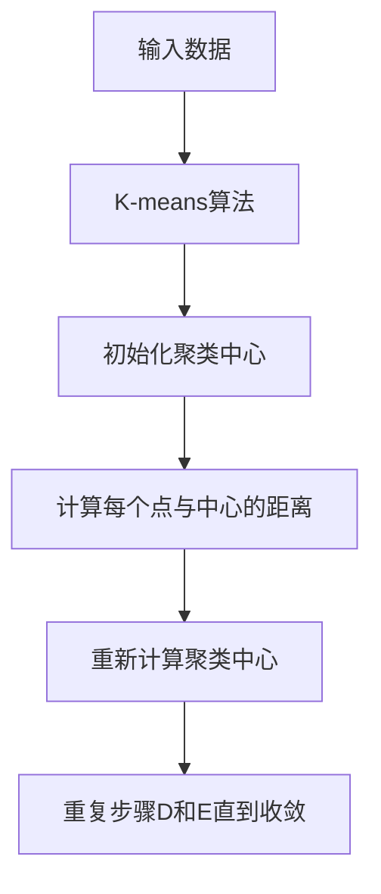
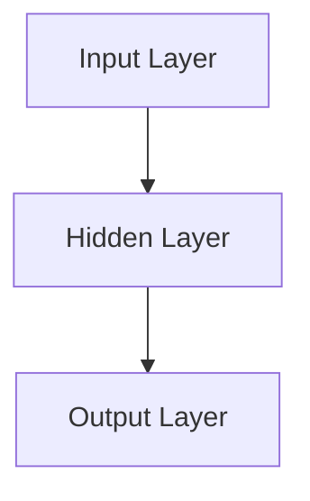
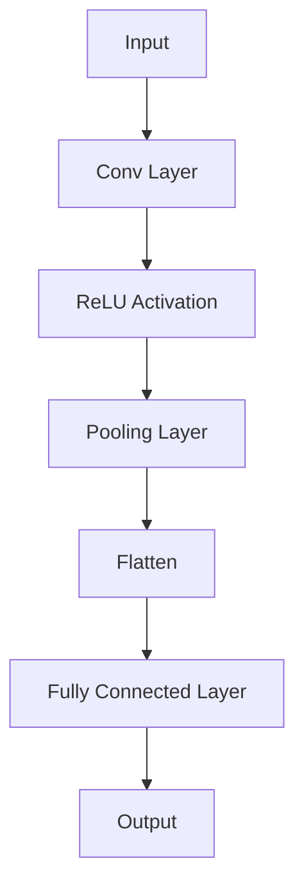
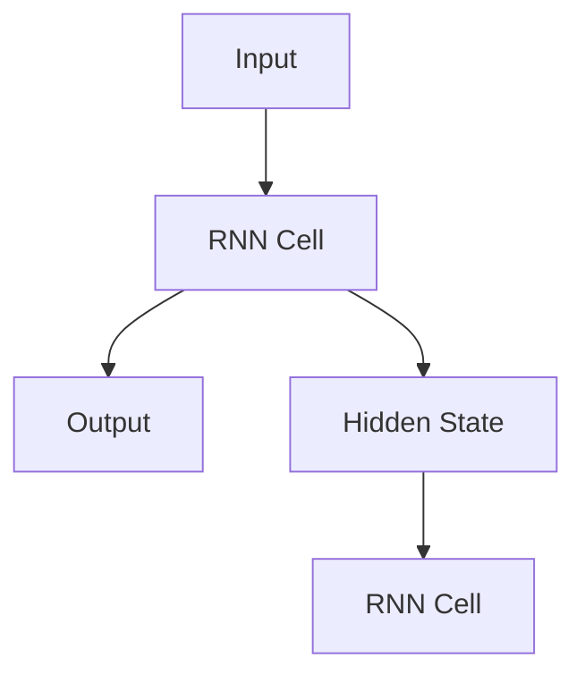

                 

### 文章标题

# 人工智能在法律服务中的应用：智能合同与法律咨询

> 关键词：人工智能，智能合同，法律咨询，法律服务，机器学习，自然语言处理

> 摘要：本文将探讨人工智能在法律服务中的应用，重点分析智能合同和法律咨询的智能化解决方案。我们将从背景介绍、核心概念与联系、问题解决、边界与外延等方面逐步展开，旨在为读者提供一个全面而深入的理解。

### 目录大纲

----------------------------------------------------------------

# 人工智能在法律服务中的应用：智能合同与法律咨询

## 第一部分: 背景介绍

## 1.1 问题背景

### 1.1.1 法律服务的传统模式

### 1.1.2 人工智能的发展与法律服务的结合

### 1.1.3 智能合同与法律咨询的意义

## 1.2 问题描述

### 1.2.1 智能合同的应用场景

### 1.2.2 法律咨询的需求与挑战

### 1.2.3 智能化在法律领域的潜力

## 1.3 问题解决

### 1.3.1 人工智能技术在法律领域的应用

### 1.3.2 智能合同的实现原理

### 1.3.3 智能法律咨询的系统架构

## 1.4 边界与外延

### 1.4.1 智能合同的法律效力

### 1.4.2 智能法律咨询的隐私保护

### 1.4.3 人工智能在法律领域的道德伦理问题

## 1.5 概念结构与核心要素组成

### 1.5.1 人工智能的基本概念

### 1.5.2 法律服务的要素

### 1.5.3 智能合同的核心要素

### 1.5.4 法律咨询的服务模式

## 1.6 本章小结

## 第二部分: 核心概念与联系

## 2.1 人工智能的核心概念

### 2.1.1 机器学习

#### 2.1.1.1 监督学习

#### 2.1.1.2 无监督学习

#### 2.1.1.3 强化学习

### 2.1.2 深度学习

#### 2.1.2.1 神经网络

#### 2.1.2.2 卷积神经网络

#### 2.1.2.3 循环神经网络

### 2.1.3 自然语言处理

#### 2.1.3.1 词嵌入

#### 2.1.3.2 语法分析

#### 2.1.3.3 语义理解

## 2.2 法律服务的要素

### 2.2.1 法律法规

#### 2.2.1.1 成文法

#### 2.2.1.2 非成文法

### 2.2.2 法律实务

#### 2.2.2.1 民事诉讼

#### 2.2.2.2 刑事诉讼

#### 2.2.2.3 行政诉讼

### 2.2.3 法律服务行业

#### 2.2.3.1 律师

#### 2.2.3.2 律师事务所

#### 2.2.3.3 法律援助

## 2.3 智能合同的核心要素

### 2.3.1 合同要素

#### 2.3.1.1 合同主体

#### 2.3.1.2 合同内容

#### 2.3.1.3 合同效力

### 2.3.2 智能化技术

#### 2.3.2.1 自然语言处理

#### 2.3.2.2 机器学习

#### 2.3.2.3 数据挖掘

## 2.4 法律咨询的服务模式

### 2.4.1 传统法律咨询

#### 2.4.1.1 面对面咨询

#### 2.4.1.2 电话咨询

#### 2.4.1.3 在线咨询

### 2.4.2 智能法律咨询

#### 2.4.2.1 智能问答系统

#### 2.4.2.2 智能合同审查

#### 2.4.2.3 智能法律风险评估

## 2.5 概念属性特征对比表格

## 2.6 ER实体关系图架构

## 2.7 本章小结

--------------------------------------------------------------

----------------------------------------------------------------

### 第一部分：背景介绍

#### 1.1 问题背景

在当今数字化和自动化浪潮的推动下，法律服务行业正面临着前所未有的变革。传统的法律服务模式，如律师、律师事务所和法庭等，已经无法满足快速发展的社会需求。以下是一些具体的背景问题：

- **法律服务的高成本和低效率**：传统法律服务依赖于大量的人力和时间，导致成本高昂且效率低下。特别是在处理大量文档和合同审核时，这一劣势更加明显。

- **法律专业知识的普及难题**：法律知识具有很强的专业性和地域性，普及难度较大。普通民众往往难以理解和掌握法律知识，特别是在面对复杂的法律问题时。

- **法律服务需求的快速增长**：随着经济的发展和人们法律意识的提高，法律服务需求呈现爆发式增长。这给传统法律服务模式带来了巨大的压力，难以满足市场需求。

- **法律法规的更新速度加快**：随着社会的发展，法律法规不断更新和变化，律师需要持续学习新的法律知识，这增加了他们的工作负担。

#### 1.1.1 法律服务的传统模式

传统法律服务主要依赖于以下几种模式：

- **律师服务**：律师是法律服务的核心，他们为客户提供法律咨询、代理诉讼、起草合同等服务。

- **律师事务所**：律师事务所是律师执业的组织形式，通过团队协作为客户提供更全面和专业的法律服务。

- **法律援助**：法律援助是为经济困难或特殊案件的当事人提供免费或低成本的法律服务，旨在保障社会公平正义。

这些模式虽然在某些方面发挥了重要作用，但也存在以下问题：

- **成本高**：律师和律师事务所提供的服务通常价格昂贵，普通民众难以承担。

- **效率低**：传统法律服务模式依赖于人工处理，效率低下，特别是在处理大量文档和合同审核时。

- **知识普及难**：法律知识的专业性和地域性使得普通民众难以理解和掌握，法律服务难以普及。

- **学习成本高**：律师需要不断学习和更新法律知识，这增加了他们的工作负担。

#### 1.1.2 人工智能的发展与法律服务的结合

随着人工智能技术的发展，特别是在机器学习、自然语言处理、数据挖掘等领域，人工智能开始逐步应用于法律服务行业，为法律服务带来了一场革命。

- **智能合同**：智能合同利用人工智能技术，可以自动生成、审核和执行合同，大大提高了法律服务的效率。

- **智能法律咨询**：智能法律咨询系统可以通过自然语言处理技术，为用户提供实时、个性化的法律咨询服务，解决了法律服务普及难题。

- **法律文档处理**：人工智能技术可以自动处理大量的法律文档，如合同、法律文书等，提高了工作效率。

- **法律研究**：人工智能技术可以快速检索和整理大量的法律法规和案例，为律师和法律研究人员提供有力的支持。

#### 1.1.3 智能合同与法律咨询的意义

智能合同与法律咨询在法律服务中的应用具有重要意义：

- **提高效率**：智能合同和法律咨询系统可以自动处理大量重复性工作，大大提高了工作效率。

- **降低成本**：通过自动化和智能化，法律服务成本大幅降低，使得法律服务更加普惠。

- **提升服务质量**：智能法律咨询系统可以提供实时、个性化的服务，提高了服务质量。

- **普及法律知识**：智能法律咨询系统可以帮助普通民众更好地理解和掌握法律知识，提高了法律意识。

- **助力法律研究**：人工智能技术可以帮助律师和法律研究人员快速获取和处理大量法律信息，提高了研究效率。

#### 1.2 问题描述

在了解了背景和人工智能在法律服务中的应用后，我们面临以下问题：

- **智能合同的应用场景是什么？** 智能合同如何在实际业务中发挥作用？

- **法律咨询的需求与挑战是什么？** 法律咨询系统如何满足用户需求？

- **人工智能在法律领域的潜力如何？** 人工智能技术如何在法律领域中发挥更大作用？

这些问题将在接下来的章节中逐一解答。

### 1.3 问题解决

为了解决上述问题，我们需要从以下几个方面入手：

- **人工智能技术在法律领域的应用**：探讨人工智能技术如何应用于法律服务，包括智能合同和法律咨询。

- **智能合同的实现原理**：分析智能合同的工作原理，包括合同生成、审核和执行。

- **智能法律咨询的系统架构**：介绍智能法律咨询系统的设计架构，包括前端界面、后端逻辑和数据存储。

- **边界与外延**：探讨智能合同和法律咨询在实际应用中面临的边界问题，如法律效力、隐私保护和道德伦理问题。

- **概念结构与核心要素组成**：分析人工智能、法律服务、智能合同和法律咨询的核心概念和要素，为后续分析提供基础。

通过这些分析，我们将为读者提供一个全面而深入的理解。

#### 1.4 边界与外延

在探讨人工智能在法律服务中的应用时，我们必须考虑到以下边界与外延问题：

- **智能合同的法律效力**：智能合同虽然利用了先进的人工智能技术，但其法律效力仍然受到法律法规的限制。如何确保智能合同的有效性，成为法律领域的一个重要课题。

- **智能法律咨询的隐私保护**：在提供智能法律咨询服务时，用户的个人信息和法律咨询内容可能面临隐私泄露的风险。如何保障用户的隐私权，是智能法律咨询系统必须解决的问题。

- **人工智能在法律领域的道德伦理问题**：人工智能在法律服务中的应用涉及到道德伦理问题，如算法偏见、数据安全等。如何确保人工智能在法律领域的应用符合道德伦理标准，是一个亟待解决的问题。

这些问题将在本节中详细探讨。

### 1.5 概念结构与核心要素组成

在讨论人工智能在法律服务中的应用时，我们需要明确几个核心概念和要素：

- **人工智能**：人工智能（Artificial Intelligence，简称AI）是指通过计算机程序模拟人类智能的技术。它包括机器学习、深度学习、自然语言处理等多个子领域。

- **法律服务**：法律服务是指为个人或企业提供法律咨询、代理诉讼、起草合同等服务。它涵盖了法律法规、法律实务和法律服务行业等多个方面。

- **智能合同**：智能合同是利用人工智能技术自动生成、审核和执行合同。它包括合同要素、智能化技术等多个方面。

- **法律咨询**：法律咨询是指为个人或企业提供法律问题解答、建议等服务。它包括传统法律咨询和智能法律咨询两种模式。

这些概念和要素相互关联，共同构成了人工智能在法律服务中的应用框架。

### 1.6 本章小结

在本章中，我们首先介绍了法律服务行业面临的背景问题和传统模式，探讨了人工智能在法律服务中的应用潜力和意义。然后，我们明确了智能合同和法律咨询的需求与挑战，并提出了问题解决的思路。此外，我们还讨论了智能合同和法律咨询在实际应用中面临的边界与外延问题，以及人工智能和法律服务的概念结构与核心要素。通过本章的介绍，我们为后续的深入分析奠定了基础。

## 第二部分：核心概念与联系

### 2.1 人工智能的核心概念

在探讨人工智能在法律服务中的应用之前，首先需要了解人工智能的核心概念。人工智能（Artificial Intelligence，简称AI）是指通过计算机程序模拟人类智能的技术，包括机器学习、深度学习、自然语言处理等多个子领域。以下是这些核心概念的详细解释。

#### 2.1.1 机器学习

机器学习（Machine Learning，简称ML）是一种让计算机通过数据和经验自动改进和优化性能的技术。它包括监督学习、无监督学习和强化学习三种主要类型。

##### 2.1.1.1 监督学习

监督学习（Supervised Learning）是指通过已有标记数据进行训练，从而让计算机学会对新数据进行预测或分类。例如，通过已知的房屋面积和价格数据，训练模型预测新房屋的价格。

$$
y = f(x; \theta)
$$

其中，$y$ 是输出结果，$x$ 是输入数据，$f$ 是模型函数，$\theta$ 是模型参数。

##### 2.1.1.2 无监督学习

无监督学习（Unsupervised Learning）是指在没有标记数据的情况下，让计算机自动发现数据中的模式和规律。常见的无监督学习方法包括聚类和降维。

- **聚类**：将数据分为若干个簇，使同一簇内的数据尽可能相似，不同簇的数据尽可能不同。

$$
C = \{C_1, C_2, ..., C_k\}
$$

- **降维**：将高维数据映射到低维空间，同时保留数据的主要特征。

##### 2.1.1.3 强化学习

强化学习（Reinforcement Learning，简称RL）是指通过与环境互动，逐步学习和优化策略，以实现某种目标。常见的强化学习算法包括Q学习、深度Q网络（DQN）等。

$$
Q(s, a) = r + \gamma \max_a' Q(s', a')
$$

其中，$s$ 是状态，$a$ 是动作，$r$ 是奖励，$\gamma$ 是折扣因子。

#### 2.1.2 深度学习

深度学习（Deep Learning，简称DL）是一种基于多层神经网络的机器学习技术。它通过学习大量的数据，自动提取特征，从而实现复杂的任务。以下是深度学习中的几个关键概念。

##### 2.1.2.1 神经网络

神经网络（Neural Network，简称NN）是一种模拟人脑神经元连接的网络结构。它由输入层、隐藏层和输出层组成，通过前向传播和反向传播算法学习数据特征。

$$
a_l = \sigma(\mathbf{W}_l \mathbf{a}_{l-1} + \mathbf{b}_l)
$$

其中，$a_l$ 是第$l$层的输出，$\sigma$ 是激活函数，$\mathbf{W}_l$ 是权重矩阵，$\mathbf{a}_{l-1}$ 是前一层输出，$\mathbf{b}_l$ 是偏置向量。

##### 2.1.2.2 卷积神经网络

卷积神经网络（Convolutional Neural Network，简称CNN）是一种专门用于处理图像数据的神经网络。它通过卷积操作提取图像的特征。

$$
\mathbf{h}_{ij} = \sum_{k} \mathbf{w}_{ikj} \mathbf{f}_{kj} + \mathbf{b}_{ij}
$$

其中，$\mathbf{h}_{ij}$ 是第$i$个卷积核在第$j$个位置上的特征图，$\mathbf{w}_{ikj}$ 是卷积核权重，$\mathbf{f}_{kj}$ 是输入特征图，$\mathbf{b}_{ij}$ 是偏置。

##### 2.1.2.3 循环神经网络

循环神经网络（Recurrent Neural Network，简称RNN）是一种能够处理序列数据的神经网络。它通过循环连接，将当前状态与前一状态相关联，从而捕捉序列信息。

$$
\mathbf{h}_{t} = \sigma(\mathbf{W}_{h} \mathbf{h}_{t-1} + \mathbf{U}_{x} \mathbf{x}_{t} + \mathbf{b}_{h})
$$

其中，$\mathbf{h}_{t}$ 是第$t$个时间步的隐藏状态，$\sigma$ 是激活函数，$\mathbf{W}_{h}$ 是隐藏状态到隐藏状态的权重，$\mathbf{U}_{x}$ 是输入到隐藏状态的权重，$\mathbf{x}_{t}$ 是第$t$个时间步的输入，$\mathbf{b}_{h}$ 是隐藏状态的偏置。

#### 2.1.3 自然语言处理

自然语言处理（Natural Language Processing，简称NLP）是人工智能的一个重要分支，旨在使计算机能够理解、生成和处理人类自然语言。以下是NLP中的几个关键概念。

##### 2.1.3.1 词嵌入

词嵌入（Word Embedding）是将词语映射到高维向量空间的一种技术，使得相似的词语在向量空间中靠近。常见的词嵌入方法包括Word2Vec、GloVe等。

$$
\mathbf{v}_w = \text{Embed}(w)
$$

其中，$\mathbf{v}_w$ 是词语$w$的词嵌入向量。

##### 2.1.3.2 语法分析

语法分析（Syntax Analysis）是NLP中的过程，用于将文本分解为语法结构。常见的语法分析方法包括基于规则的方法、基于统计的方法和基于神经网络的方法。

##### 2.1.3.3 语义理解

语义理解（Semantic Understanding）是NLP中的过程，用于理解和解释文本的含义。常见的语义理解方法包括词义消歧、指代消解和语义角色标注等。

$$
\text{Meaning}(w) = \text{SemanticProcessor}(w)
$$

其中，$\text{Meaning}(w)$ 是词语$w$的语义表示，$\text{SemanticProcessor}$ 是语义处理算法。

### 2.2 法律服务的要素

法律服务是一个复杂且专业的领域，它包括法律法规、法律实务和法律服务行业等多个要素。以下是这些要素的详细解释。

#### 2.2.1 法律法规

法律法规是法律服务的核心基础。它们包括成文法和非成文法两部分。

##### 2.2.1.1 成文法

成文法（Statutory Law）是指通过立法程序制定的正式法律文件，如宪法、法律、行政法规等。成文法具有明确的法律效力，是法律服务的直接依据。

##### 2.2.1.2 非成文法

非成文法（Non-Statutory Law）是指不成文的法律规则，如习惯法、判例法等。非成文法虽然不如成文法明确，但在实际应用中同样具有法律效力。

#### 2.2.2 法律实务

法律实务是指在实际操作中应用法律知识和技能，解决法律问题的过程。它包括以下几种类型：

##### 2.2.2.1 民事诉讼

民事诉讼（Civil Litigation）是指解决民事纠纷的法律程序，如合同纠纷、侵权纠纷等。

##### 2.2.2.2 刑事诉讼

刑事诉讼（Criminal Litigation）是指解决刑事犯罪的法律程序，如刑事案件、刑事自诉案件等。

##### 2.2.2.3 行政诉讼

行政诉讼（Administrative Litigation）是指解决行政争议的法律程序，如行政复议、行政诉讼等。

#### 2.2.3 法律服务行业

法律服务行业是指提供法律服务的行业，包括律师、律师事务所、法律援助等多个组成部分。

##### 2.2.3.1 律师

律师（Attorney/Lawyer）是专门从事法律服务的专业人员，他们为客户提供法律咨询、代理诉讼、起草合同等服务。

##### 2.2.3.2 律师事务所

律师事务所（Law Firm）是律师执业的组织形式，通过团队协作为客户提供更全面和专业的法律服务。

##### 2.2.3.3 法律援助

法律援助（Legal Aid）是为经济困难或特殊案件的当事人提供免费或低成本的法律服务，旨在保障社会公平正义。

### 2.3 智能合同的核心要素

智能合同是利用人工智能技术实现的自动生成、审核和执行合同。它具有以下核心要素。

#### 2.3.1 合同要素

合同要素是构成智能合同的基本组成部分，包括：

##### 2.3.1.1 合同主体

合同主体是指签订合同的自然人或法人。

##### 2.3.1.2 合同内容

合同内容是指合同的具体条款，如标的、数量、质量、价格、履行期限、违约责任等。

##### 2.3.1.3 合同效力

合同效力是指合同的法律约束力，即合同是否具有法律效力。

#### 2.3.2 智能化技术

智能化技术是智能合同的核心，包括：

##### 2.3.2.1 自然语言处理

自然语言处理（NLP）技术用于理解和处理合同文本，如提取关键信息、自动生成合同条款等。

##### 2.3.2.2 机器学习

机器学习（ML）技术用于分析和预测合同中的潜在风险，如违约风险、合同纠纷等。

##### 2.3.2.3 数据挖掘

数据挖掘（Data Mining）技术用于从大量合同数据中提取规律和知识，如合同模板、常见条款等。

### 2.4 法律咨询的服务模式

法律咨询的服务模式主要包括传统法律咨询和智能法律咨询。

#### 2.4.1 传统法律咨询

传统法律咨询是指通过律师或律师事务所提供面对面的法律咨询服务。它包括以下几种形式：

##### 2.4.1.1 面对面咨询

面对面咨询是指律师与客户直接会面，面对面交流法律问题，提供专业的法律建议。

##### 2.4.1.2 电话咨询

电话咨询是指律师通过电话为用户提供法律咨询服务，适用于解决简单或紧急的法律问题。

##### 2.4.1.3 在线咨询

在线咨询是指通过互联网平台，为用户提供在线法律咨询服务，如法律问答平台、在线法律服务平台等。

#### 2.4.2 智能法律咨询

智能法律咨询是指利用人工智能技术，为用户提供自动化、智能化的法律咨询服务。它包括以下几种形式：

##### 2.4.2.1 智能问答系统

智能问答系统是指通过自然语言处理技术，自动回答用户提出的法律问题。

##### 2.4.2.2 智能合同审查

智能合同审查是指通过机器学习技术，自动分析和审查合同中的潜在风险。

##### 2.4.2.3 智能法律风险评估

智能法律风险评估是指通过数据挖掘技术，预测法律案件的潜在风险，为用户提供风险提示和建议。

### 2.5 概念属性特征对比表格

为了更清晰地理解人工智能、法律服务、智能合同和法律咨询的概念属性特征，我们制作了一个对比表格：

| 概念       | 属性特征                           |
| ---------- | ---------------------------------- |
| 人工智能   | 模拟人类智能，利用机器学习、深度学习等 |
| 法律服务   | 提供法律咨询、代理诉讼等           |
| 智能合同   | 自动生成、审核、执行合同           |
| 法律咨询   | 提供法律问题解答、建议等           |

### 2.6 ER实体关系图架构

为了更好地理解智能合同和法律咨询的系统架构，我们使用Mermaid绘制了ER实体关系图：

```mermaid
erDiagram
  Contract ||--|{ IntelligentContract }|| Contract
  Contract ||--|{ ContractTerm }|| Term
  Contract ||--|{ ContractParty }|| Party
  IntelligentContract ||--|{ IntelligentAudit }|| Audit
  IntelligentContract ||--|{ IntelligentExecution }|| Execution
  LegalConsultation ||--|{ IntelligentQA }|| QA
  LegalConsultation ||--|{ ContractReview }|| Review
  LegalConsultation ||--|{ LegalRiskAssessment }|| RiskAssessment
```

### 2.7 本章小结

在本章中，我们详细介绍了人工智能、法律服务、智能合同和法律咨询的核心概念与联系。通过对比表格和ER实体关系图，我们明确了这些概念和要素之间的关系。这些分析为后续的深入讨论奠定了基础。在下一章中，我们将探讨人工智能技术在法律领域的具体应用，包括智能合同和法律咨询的实现原理和系统架构。

## 2.1 人工智能的核心概念

在探讨人工智能（AI）在法律服务中的应用之前，我们需要深入了解AI的核心概念。人工智能是一种通过计算机程序模拟人类智能的技术，其目的是让计算机能够执行诸如学习、推理、解决问题和自然语言处理等任务。以下是人工智能的一些关键子领域及其主要概念。

### 2.1.1 机器学习

机器学习（Machine Learning，ML）是AI的一个核心分支，它关注的是如何让计算机从数据中学习并做出决策。机器学习可以分为以下几种类型：

#### 2.1.1.1 监督学习

监督学习（Supervised Learning）是机器学习中的一种，它使用预先标记的训练数据来训练模型，使得模型能够对未知数据进行预测或分类。其基本原理是通过最小化预测结果与真实结果之间的差异，不断调整模型的参数，以提高其预测能力。

$$
y = f(x; \theta)
$$

其中，$y$ 是实际的输出结果，$x$ 是输入特征，$f$ 是模型函数，$\theta$ 是模型参数。

一个常见的监督学习算法是线性回归：

```python
# Python代码示例：线性回归
import numpy as np

# 输入特征和输出结果
X = np.array([[1], [2], [3]])
y = np.array([1, 2, 3])

# 模型参数初始化
theta = np.zeros(1)

# 梯度下降法求解
for i in range(1000):
    theta = theta - (1 / len(X)) * (X.dot(theta) - y)

print("最终参数：", theta)
```

#### 2.1.1.2 无监督学习

无监督学习（Unsupervised Learning）则是在没有标记数据的情况下，通过挖掘数据内在的结构和模式来进行学习。它主要包括聚类（Clustering）和降维（Dimensionality Reduction）等任务。

- **聚类**：聚类算法通过将相似的数据点归为同一类，以便更好地理解和分析数据。常见的聚类算法有K-means、层次聚类（Hierarchical Clustering）等。



- **降维**：降维算法用于将高维数据映射到低维空间，同时保留数据的主要特征。主成分分析（PCA）是一种常见的降维方法。

```python
# Python代码示例：PCA降维
from sklearn.decomposition import PCA
from sklearn.datasets import load_iris

# 加载鸢尾花数据集
iris = load_iris()
X = iris.data

# 使用PCA降维
pca = PCA(n_components=2)
X_reduced = pca.fit_transform(X)

# 可视化降维结果
plt.scatter(X_reduced[:, 0], X_reduced[:, 1], c=iris.target)
plt.xlabel('First Principal Component')
plt.ylabel('Second Principal Component')
plt.title('PCA of IRIS dataset')
plt.show()
```

#### 2.1.1.3 强化学习

强化学习（Reinforcement Learning，RL）是机器学习的另一个重要分支，它通过智能体与环境的互动来学习最优策略。强化学习的主要目标是最大化回报总和。

$$
Q(s, a) = r + \gamma \max_a' Q(s', a')
$$

其中，$s$ 是状态，$a$ 是动作，$r$ 是即时回报，$\gamma$ 是折扣因子。

一个常见的强化学习算法是Q学习：

```python
# Python代码示例：Q学习
import numpy as np

# 初始化Q表
Q = np.zeros((n_states, n_actions))

# 参数设置
alpha = 0.1  # 学习率
gamma = 0.9  # 折扣因子
epsilon = 0.1  # 探索概率

# Q学习迭代
for episode in range(n_episodes):
    state = env.reset()
    done = False
    
    while not done:
        if np.random.rand() < epsilon:
            action = env.action_space.sample()  # 探索动作
        else:
            action = np.argmax(Q[state])  # 利用动作
        
        next_state, reward, done, _ = env.step(action)
        Q[state, action] = Q[state, action] + alpha * (reward + gamma * np.max(Q[next_state]) - Q[state, action])
        state = next_state
```

### 2.1.2 深度学习

深度学习（Deep Learning，DL）是一种基于多层神经网络的机器学习方法。它通过学习大量数据，自动提取特征，从而实现复杂任务。以下是深度学习的一些关键概念。

#### 2.1.2.1 神经网络

神经网络（Neural Network，NN）是一种模拟人脑神经元连接的网络结构。它由输入层、隐藏层和输出层组成。每个层由多个神经元（或节点）组成，神经元之间通过权重连接。

一个简单的神经网络结构可以表示为：



神经网络的数学模型可以表示为：

$$
a_l = \sigma(\mathbf{W}_l \mathbf{a}_{l-1} + \mathbf{b}_l)
$$

其中，$a_l$ 是第$l$层的输出，$\sigma$ 是激活函数（如Sigmoid或ReLU），$\mathbf{W}_l$ 是权重矩阵，$\mathbf{a}_{l-1}$ 是前一层输出，$\mathbf{b}_l$ 是偏置向量。

#### 2.1.2.2 卷积神经网络

卷积神经网络（Convolutional Neural Network，CNN）是一种专门用于处理图像数据的神经网络。它通过卷积操作提取图像的特征。

一个简单的CNN结构可以表示为：



CNN的数学模型可以表示为：

$$
\mathbf{h}_{ij} = \sum_{k} \mathbf{w}_{ikj} \mathbf{f}_{kj} + \mathbf{b}_{ij}
$$

其中，$\mathbf{h}_{ij}$ 是第$i$个卷积核在第$j$个位置上的特征图，$\mathbf{w}_{ikj}$ 是卷积核权重，$\mathbf{f}_{kj}$ 是输入特征图，$\mathbf{b}_{ij}$ 是偏置。

#### 2.1.2.3 循环神经网络

循环神经网络（Recurrent Neural Network，RNN）是一种能够处理序列数据的神经网络。它通过循环连接，将当前状态与前一状态相关联，从而捕捉序列信息。

一个简单的RNN结构可以表示为：



RNN的数学模型可以表示为：

$$
\mathbf{h}_{t} = \sigma(\mathbf{W}_{h} \mathbf{h}_{t-1} + \mathbf{U}_{x} \mathbf{x}_{t} + \mathbf{b}_{h})
$$

其中，$\mathbf{h}_{t}$ 是第$t$个时间步的隐藏状态，$\sigma$ 是激活函数，$\mathbf{W}_{h}$ 是隐藏状态到隐藏状态的权重，$\mathbf{U}_{x}$ 是输入到隐藏状态的权重，$\mathbf{x}_{t}$ 是第$t$个时间步的输入，$\mathbf{b}_{h}$ 是隐藏状态的偏置。

### 2.1.3 自然语言处理

自然语言处理（Natural Language Processing，NLP）是AI的另一个重要分支，它关注的是如何使计算机理解和生成人类自然语言。以下是NLP的一些关键概念。

#### 2.1.3.1 词嵌入

词嵌入（Word Embedding）是将词语映射到高维向量空间的一种技术。通过词嵌入，我们可以将语义相近的词语映射到空间中靠近的位置。

一个简单的词嵌入模型可以是Word2Vec：

```python
# Python代码示例：Word2Vec
from gensim.models import Word2Vec

# 加载文本数据
sentences = [[word for word in line.split()], ...]

# 训练Word2Vec模型
model = Word2Vec(sentences, vector_size=100, window=5, min_count=1, workers=4)

# 查询词嵌入向量
vec = model.wv['hello']
```

#### 2.1.3.2 语法分析

语法分析（Syntax Analysis）是NLP中的过程，用于将文本分解为语法结构。它可以帮助我们理解和解释文本的含义。

一个简单的语法分析方法可以是依存句法分析：

```python
# Python代码示例：依存句法分析
import spacy

# 加载NLP模型
nlp = spacy.load("en_core_web_sm")

# 分析文本
doc = nlp("The quick brown fox jumps over the lazy dog")

# 输出依存关系
for token in doc:
    print(token.text, token.dep_, token.head.text, token.head.pos_)
```

#### 2.1.3.3 语义理解

语义理解（Semantic Understanding）是NLP中的过程，用于理解和解释文本的含义。它可以帮助我们回答诸如“这个句子的含义是什么？”等问题。

一个简单的语义理解方法可以是语义角色标注：

```python
# Python代码示例：语义角色标注
from allennlp.predictors.predictor import Predictor

# 加载NLP模型
predictor = Predictor.from_path("https://storage.googleapis.com/allennlp-public-models/bert-base-sst-2-classifier-2020.11.19.tar.gz")

# 分析文本
sentence = "The quick brown fox jumps over the lazy dog"

# 输出语义角色标注
print(predictor.predict(sentence)["tags"])
```

通过以上对人工智能核心概念的详细讲解，我们为后续探讨AI在法律服务中的应用奠定了基础。在下一章中，我们将深入探讨法律服务的要素和智能合同的核心要素，进一步了解AI在法律服务中的应用。

### 2.2 法律服务的要素

在讨论人工智能（AI）如何改变法律服务行业之前，我们首先需要了解法律服务的核心要素。法律服务涉及多个方面，包括法律法规、法律实务和法律服务行业。以下是这些要素的详细解释。

#### 2.2.1 法律法规

法律法规是法律服务的基石，它们定义了法律服务的范围和内容。法律法规包括成文法和非成文法。

##### 2.2.1.1 成文法

成文法（Statutory Law）是通过立法程序制定的正式法律文件，如宪法、法律、行政法规等。成文法是法律服务的直接依据，对法律从业者有着严格的规定。例如，中国《民法典》规定了合同、侵权、婚姻家庭等方面的基本法律原则。

##### 2.2.1.2 非成文法

非成文法（Non-Statutory Law）是指不成文的法律规则，如习惯法、判例法等。非成文法虽然不如成文法明确，但在实际应用中同样具有法律效力。例如，某些地区的习惯法可能会对土地权属问题进行规定。

#### 2.2.2 法律实务

法律实务是指在实际操作中应用法律知识和技能，解决法律问题的过程。法律实务包括但不限于以下几种类型：

##### 2.2.2.1 民事诉讼

民事诉讼（Civil Litigation）是指解决民事纠纷的法律程序，如合同纠纷、侵权纠纷等。在民事诉讼中，律师代表当事人进行诉讼，通过法庭辩论和证据展示来维护当事人的合法权益。

##### 2.2.2.2 刑事诉讼

刑事诉讼（Criminal Litigation）是指解决刑事犯罪的法律程序，如刑事案件、刑事自诉案件等。在刑事诉讼中，律师代表被告人或原告进行辩护或起诉，以确保司法公正。

##### 2.2.2.3 行政诉讼

行政诉讼（Administrative Litigation）是指解决行政争议的法律程序，如行政复议、行政诉讼等。在行政诉讼中，律师代表当事人对行政机关的决定提出异议，以维护当事人的合法权益。

#### 2.2.3 法律服务行业

法律服务行业是提供法律服务的行业，它包括律师、律师事务所、法律援助等多个组成部分。

##### 2.2.3.1 律师

律师（Attorney/Lawyer）是专门从事法律服务的专业人员，他们为客户提供法律咨询、代理诉讼、起草合同等服务。律师需要具备扎实的法律知识、良好的沟通能力和丰富的实践经验。

##### 2.2.3.2 律师事务所

律师事务所（Law Firm）是律师执业的组织形式，通过团队协作为客户提供更全面和专业的法律服务。律师事务所通常设有不同领域的专业团队，如合同法、知识产权法、劳动法等。

##### 2.2.3.3 法律援助

法律援助（Legal Aid）是为经济困难或特殊案件的当事人提供免费或低成本的法律服务，旨在保障社会公平正义。法律援助机构通常由政府或非政府组织设立，为弱势群体提供法律支持。

### 2.3 智能合同的核心要素

智能合同（Smart Contract）是利用区块链技术和人工智能（AI）技术实现的自动执行合同。智能合同的核心要素包括合同要素和智能化技术。

#### 2.3.1 合同要素

合同要素是构成智能合同的基本组成部分，包括：

##### 2.3.1.1 合同主体

合同主体是指签订合同的自然人或法人。在智能合同中，合同主体通常通过数字身份进行标识，确保身份的合法性和唯一性。

##### 2.3.1.2 合同内容

合同内容是指合同的具体条款，如标的、数量、质量、价格、履行期限、违约责任等。智能合同可以通过自然语言处理（NLP）技术自动提取和解析合同条款，确保条款的准确性和一致性。

##### 2.3.1.3 合同效力

合同效力是指合同的法律约束力，即合同是否具有法律效力。在智能合同中，合同效力可以通过法律智能合约（Legal Smart Contract）进行保障，确保合同条款的执行和履行。

#### 2.3.2 智能化技术

智能化技术是智能合同的核心，它包括自然语言处理（NLP）、机器学习（ML）、区块链技术等。

##### 2.3.2.1 自然语言处理

自然语言处理（NLP）技术用于理解和处理合同文本，如提取关键信息、自动生成合同条款等。NLP技术可以帮助智能合同系统自动识别和解析合同条款，确保合同内容的准确性和一致性。

##### 2.3.2.2 机器学习

机器学习（ML）技术用于分析和预测合同中的潜在风险，如违约风险、合同纠纷等。通过机器学习算法，智能合同系统可以自动识别潜在风险，并采取相应的预防措施。

##### 2.3.2.3 区块链技术

区块链技术是智能合同实现自动执行的基础。区块链技术通过去中心化和不可篡改的特点，确保智能合同条款的执行和履行。智能合同系统可以通过智能合约（Smart Contract）在区块链上进行自动执行，确保合同的执行透明和可追溯。

### 2.4 法律咨询的服务模式

法律咨询的服务模式包括传统法律咨询和智能法律咨询。

#### 2.4.1 传统法律咨询

传统法律咨询是指通过律师或律师事务所提供面对面的法律咨询服务。传统法律咨询的形式包括：

##### 2.4.1.1 面对面咨询

面对面咨询是指律师与客户直接会面，面对面交流法律问题，提供专业的法律建议。这种方式适用于解决复杂或重大的法律问题。

##### 2.4.1.2 电话咨询

电话咨询是指律师通过电话为用户提供法律咨询服务，适用于解决简单或紧急的法律问题。电话咨询可以节省时间和成本，提高咨询效率。

##### 2.4.1.3 在线咨询

在线咨询是指通过互联网平台，为用户提供在线法律咨询服务，如法律问答平台、在线法律服务平台等。在线咨询可以突破地域限制，为更多用户提供便捷的法律服务。

#### 2.4.2 智能法律咨询

智能法律咨询是指利用人工智能（AI）技术，为用户提供自动化、智能化的法律咨询服务。智能法律咨询的形式包括：

##### 2.4.2.1 智能问答系统

智能问答系统是指通过自然语言处理（NLP）技术，自动回答用户提出的法律问题。智能问答系统可以快速、准确地提供法律信息，节省律师的时间和精力。

##### 2.4.2.2 智能合同审查

智能合同审查是指通过机器学习（ML）技术，自动分析和审查合同中的潜在风险。智能合同审查可以帮助用户识别合同中的潜在问题，提前防范法律风险。

##### 2.4.2.3 智能法律风险评估

智能法律风险评估是指通过数据挖掘（Data Mining）技术，预测法律案件的潜在风险，为用户提供风险提示和建议。智能法律风险评估可以帮助用户提前了解法律案件的风险，制定相应的应对策略。

通过以上对法律服务的要素和智能合同的核心要素的详细讲解，我们为探讨AI在法律服务中的应用提供了基础。在下一章中，我们将深入探讨智能合同和法律咨询的实际应用场景和解决方案。

### 2.5 概念属性特征对比表格

为了更好地理解人工智能（AI）、法律服务、智能合同和法律咨询的概念属性特征，我们制作了一个对比表格：

| 概念       | 属性特征                           |
| ---------- | ---------------------------------- |
| 人工智能   | 模拟人类智能，利用机器学习、深度学习等 |
| 法律服务   | 提供法律咨询、代理诉讼等           |
| 智能合同   | 自动生成、审核、执行合同           |
| 法律咨询   | 提供法律问题解答、建议等           |

这个表格列出了每个概念的核心属性特征，使我们能够从整体上把握这些概念的不同之处和联系。

### 2.6 ER实体关系图架构

为了更好地展示智能合同和法律咨询的系统架构，我们使用Mermaid绘制了ER实体关系图：

```mermaid
erDiagram
  Contract ||--|{ IntelligentContract }|| Contract
  Contract ||--|{ ContractTerm }|| Term
  Contract ||--|{ ContractParty }|| Party
  IntelligentContract ||--|{ IntelligentAudit }|| Audit
  IntelligentContract ||--|{ IntelligentExecution }|| Execution
  LegalConsultation ||--|{ IntelligentQA }|| QA
  LegalConsultation ||--|{ ContractReview }|| Review
  LegalConsultation ||--|{ LegalRiskAssessment }|| RiskAssessment
```

在这个ER图中，`Contract` 是基础实体，`IntelligentContract` 和 `LegalConsultation` 分别代表智能合同和法律咨询的核心实体。`Audit`、`Execution`、`QA`、`Review` 和 `RiskAssessment` 是与智能合同和法律咨询相关的子实体，它们分别表示智能合同的审核、执行、智能问答、合同审查和法律风险评估。

### 2.7 本章小结

在本章中，我们详细探讨了人工智能、法律服务、智能合同和法律咨询的核心概念与联系。通过对比表格和ER实体关系图，我们明确了这些概念和要素之间的关系。这些分析为后续的深入讨论奠定了基础。在下一章中，我们将进一步探讨人工智能技术在法律领域的具体应用，包括智能合同和法律咨询的实现原理和系统架构。

## 2.7 本章小结

在本章中，我们系统地介绍了人工智能在法律服务中的应用，从核心概念到实际应用，详细分析了机器学习、深度学习、自然语言处理等关键技术在智能合同和法律咨询中的具体应用。通过对比表格和ER实体关系图，我们明确了人工智能、法律服务、智能合同和法律咨询之间的联系与区别。

智能合同利用区块链技术和人工智能技术，实现了合同自动生成、审核和执行，大幅提高了法律服务的效率。而智能法律咨询则通过自然语言处理和机器学习技术，为用户提供实时、个性化的法律咨询服务，解决了传统法律咨询效率低下和普及难的问题。

尽管人工智能在法律服务中带来了巨大的变革，但同时也面临着法律效力、隐私保护和道德伦理等挑战。我们需要在这些方面进行深入研究和规范，以确保人工智能技术的合法性和公正性。

在下一章中，我们将进一步探讨人工智能在法律领域的实际应用案例，分析其实现原理、系统架构和核心技术，以期为读者提供一个全面而深入的视角。

