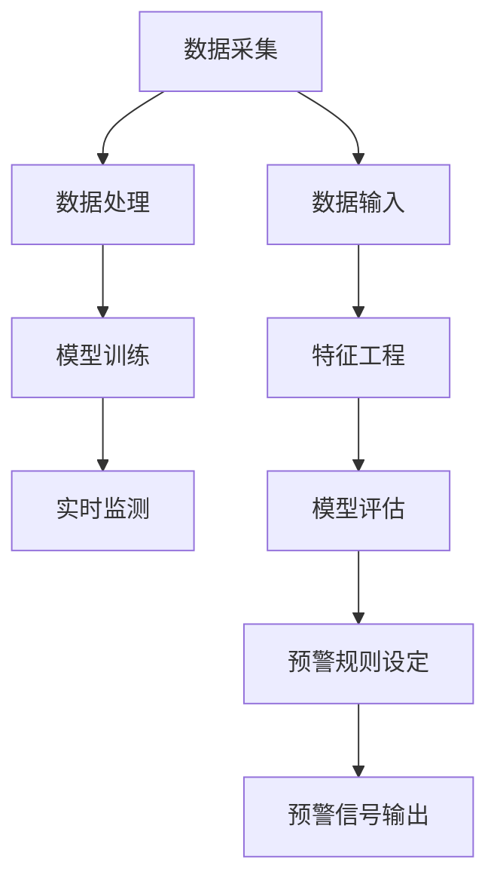
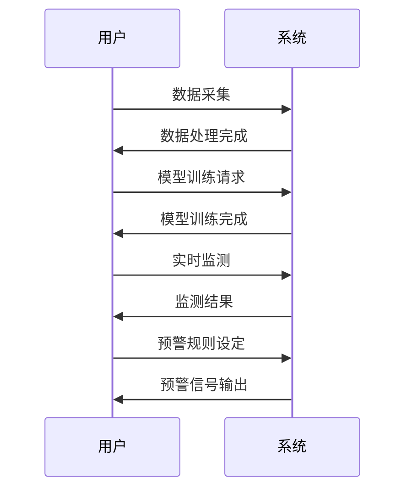

                 

# 人工智能在环境保护中的角色：生态系统监测与预警

关键词：人工智能、环境保护、生态系统监测、预警机制、算法实现

摘要：本文从环境保护的紧迫性出发，探讨了人工智能在生态系统监测与预警中的关键作用。文章首先介绍了生态系统的基本概念和当前环境监测的挑战，然后详细分析了人工智能技术如何应用于环境监测和预警，包括核心概念、算法原理、系统架构设计以及实际案例讲解。最后，文章总结了人工智能在环境保护中的应用前景，并提出了最佳实践和注意事项。

## 第一部分：背景介绍

### 第1章 问题背景

#### 1.1 生态环境保护的现状与挑战

生态环境是人类生存和发展的基础。然而，全球生态环境面临着前所未有的挑战，包括气候变化、生物多样性减少、水资源污染、土地退化等。据联合国环境规划署（UNEP）统计，全球每年约有800万公顷的森林被砍伐，大量物种因栖息地丧失而濒临灭绝。与此同时，环境污染问题也日益严重，空气污染、水污染和土壤污染对人类健康和生态系统造成了严重影响。

#### 1.2 人工智能在环境保护中的应用潜力

人工智能作为一种新兴技术，具有高效、精确、智能的特点，在环境保护领域具有广泛的应用潜力。例如，通过人工智能技术，可以实现生态环境的实时监测、数据分析和预警，提高环境管理的效率和准确性。此外，人工智能还可以用于环境模拟、污染源识别和资源优化配置等方面。

#### 1.3 研究目的与意义

本文旨在探讨人工智能在生态系统监测与预警中的应用，通过分析核心概念、算法原理和系统架构，为实际应用提供理论依据和实践指导。研究不仅有助于提升环境保护技术水平，还可以为全球环境治理提供新思路。

## 第二部分：核心概念与联系

### 第2章 核心概念

#### 2.1 人工智能概述

人工智能（Artificial Intelligence，AI）是计算机科学的一个分支，旨在使计算机具备智能行为。AI技术包括机器学习、深度学习、自然语言处理、计算机视觉等多个领域。

#### 2.2 生态系统监测

生态系统监测是指通过一系列方法和技术，对生态系统的状态、变化和趋势进行监测和分析。生态监测的目的是了解生态系统的健康状况，为环境保护和资源管理提供科学依据。

#### 2.3 预警机制

预警机制是指通过实时监测和分析数据，对潜在的环境问题进行预测和警报，以便采取相应的措施。预警机制在环境保护中起着关键作用，可以有效减少环境风险和损失。

### 第3章 概念属性特征对比表格

#### 3.1 人工智能技术种类与特征对比

| 技术类型 | 特征 |
| :----: | :----: |
| 机器学习 | 数据驱动，自动从数据中学习规律 |
| 深度学习 | 神经网络模型，自动提取特征 |
| 自然语言处理 | 处理和生成人类语言 |
| 计算机视觉 | 解析和理解图像和视频 |

#### 3.2 生态系统监测方法对比

| 方法 | 特征 |
| :----: | :----: |
| 环境传感器 | 实时监测，自动数据采集 |
| 遥感技术 | 大范围监测，获取地表信息 |
| 地面监测 | 精确数据，直接观察 |

#### 3.3 预警机制优劣对比

| 机制 | 优点 | 缺点 |
| :----: | :----: | :----: |
| 预报模型 | 精确预测，提前预警 | 数据依赖性高，需要大量历史数据 |
| 实时监测 | 灵敏度高，实时响应 | 数据处理和分析复杂 |

### 第4章 ER实体关系图架构

#### 4.1 监测系统实体关系图

```mermaid
erDiagram
  EnvironmentData -->|收集| MonitoringSystem
  MonitoringSystem -->|分析| DataProcessingModule
  DataProcessingModule -->|生成| Report
```

#### 4.2 预警系统实体关系图

```mermaid
erDiagram
  EnvironmentalIssue -->|检测| WarningSystem
  WarningSystem -->|分析| PredictionModel
  PredictionModel -->|输出| WarningSignal
```

#### 4.3 人工智能与生态系统监测预警系统融合

```mermaid
erDiagram
  AI -->|集成| MonitoringSystem
  AI -->|增强| WarningSystem
  MonitoringSystem -->|反馈| AI
  WarningSystem -->|反馈| AI
```

## 第三部分：算法原理讲解

### 第5章 算法原理

#### 5.1 监测算法原理

##### 5.1.1 监测算法mermaid流程图


##### 5.1.2 Python源代码实现

```python
# 伪代码示例
import numpy as np
import pandas as pd
from sklearn.ensemble import RandomForestClassifier

# 数据预处理
def preprocess_data(data):
    # 数据清洗、归一化等操作
    pass

# 特征提取
def extract_features(data):
    # 提取环境数据特征
    pass

# 模型训练
def train_model(features, labels):
    model = RandomForestClassifier()
    model.fit(features, labels)
    return model

# 实时监测
def monitor_environment(model, new_data):
    features = extract_features(new_data)
    prediction = model.predict(features)
    return prediction
```

##### 5.1.3 算法原理数学模型与公式

监测算法的数学模型可以表示为：

$$
y = f(\theta; x)
$$

其中，$y$ 表示监测结果，$x$ 表示环境数据，$\theta$ 表示模型参数，$f(\theta; x)$ 表示基于参数 $\theta$ 和输入数据 $x$ 的监测函数。

##### 5.1.4 举例说明

假设我们使用随机森林算法对空气质量进行监测。输入数据包括PM2.5、PM10、温度、湿度等特征，模型参数为随机森林的参数如树数量、最大深度等。通过训练模型，我们可以实时监测空气质量，并根据监测结果发出预警信号。

### 第5章 预警算法原理

##### 5.2.1 预警算法mermaid流程图


##### 5.2.2 Python源代码实现

```python
# 伪代码示例
from sklearn.ensemble import GradientBoostingClassifier
from sklearn.model_selection import train_test_split

# 数据预处理
def preprocess_data(data):
    # 数据清洗、归一化等操作
    pass

# 模型训练
def train_model(features, labels):
    model = GradientBoostingClassifier()
    model.fit(features, labels)
    return model

# 模型评估
def evaluate_model(model, features, labels):
    accuracy = model.score(features, labels)
    return accuracy

# 预警规则设定
def set_warning_rules(model, threshold):
    # 根据模型和阈值设定预警规则
    pass

# 预警信号输出
def output_warning_signal(prediction):
    # 根据预测结果输出预警信号
    pass
```

##### 5.2.3 算法原理数学模型与公式

预警算法的数学模型可以表示为：

$$
P(\text{预警}|\text{监测结果}) = \frac{P(\text{监测结果}|\text{预警})P(\text{预警})}{P(\text{监测结果})}
$$

其中，$P(\text{预警}|\text{监测结果})$ 表示预警发生的概率，$P(\text{监测结果}|\text{预警})$ 表示在预警情况下监测结果发生的概率，$P(\text{预警})$ 表示预警发生的先验概率，$P(\text{监测结果})$ 表示监测结果的总概率。

##### 5.2.4 举例说明

假设我们使用梯度提升树算法对水质进行预警。输入数据包括pH值、溶解氧、氨氮等特征，模型参数为树的数量、学习率等。通过训练模型并设定预警规则，我们可以实时监测水质，并根据预警规则发出预警信号。

## 第四部分：系统分析与架构设计

### 第6章 系统功能设计

#### 6.1 生态系统监测功能

生态系统监测功能包括环境数据采集、数据预处理、特征提取、模型训练和实时监测等。该功能旨在实现生态系统的实时监测，提供科学依据。

#### 6.2 预警功能

预警功能包括数据输入、特征工程、模型选择、模型训练、模型评估、预警规则设定和预警信号输出等。该功能旨在实时预警潜在的环境问题，提前采取应对措施。

#### 6.3 系统功能mermaid类图

```mermaid
classDiagram
  Class01 <|-- SubClass01
  Class01 o-- AnObject
  Class02 <|-- SubClass02
  Class03 o-- Class04
  ClassAP <.. ClassBP
  ClassCP ..|> ClassDP
  ClassEP (is attached to) ClassFP
```

### 第7章 系统架构设计

#### 7.1 监测系统架构设计

监测系统架构设计包括数据采集层、数据处理层、模型训练层和实时监测层。各层之间通过接口进行数据交换，实现生态系统的全面监测。

#### 7.2 预警系统架构设计

预警系统架构设计包括数据输入层、特征工程层、模型训练层、模型评估层、预警规则设定层和预警信号输出层。各层之间通过接口进行数据交换，实现实时预警。

#### 7.3 整体系统架构设计mermaid架构图



### 第8章 系统接口设计与交互

#### 8.1 系统接口设计

系统接口设计包括数据采集接口、数据处理接口、模型训练接口、实时监测接口、预警规则接口和预警信号接口等。各接口采用标准化协议，实现系统的模块化设计。

#### 8.2 系统交互mermaid序列图



## 第五部分：项目实战

### 第9章 环境安装

#### 9.1 环境准备

环境准备包括安装Python环境、安装相关依赖库和配置环境变量等。

#### 9.2 软件安装与配置

软件安装与配置包括安装监测系统和预警系统，配置系统参数和接口等。

### 第10章 系统核心实现

#### 10.1 监测模块实现

监测模块实现包括数据采集、数据预处理、特征提取和模型训练等。

#### 10.2 预警模块实现

预警模块实现包括数据输入、特征工程、模型选择、模型训练和预警信号输出等。

#### 10.3 代码应用解读与分析

代码应用解读与分析包括对监测模块和预警模块的源代码进行解读，分析系统的工作原理和实现方法。

### 第11章 实际案例分析与详细讲解

#### 11.1 案例介绍

案例介绍包括案例背景、案例目标、案例数据集等。

#### 11.2 案例分析

案例分析包括对案例数据进行预处理、特征提取和模型训练等。

#### 11.3 案例详细讲解

案例详细讲解包括对案例实现步骤进行详细解析，分析系统性能和效果。

### 第12章 项目小结

#### 12.1 项目总结

项目总结包括项目成果、项目不足和改进方向等。

#### 12.2 经验与启示

经验与启示包括项目过程中的经验教训、启示和收获等。

#### 12.3 拓展阅读

拓展阅读包括相关领域的最新研究、技术动态和应用案例等。

### 第13章 最佳实践 Tips

#### 13.1 最佳实践

最佳实践包括在实际应用中总结的经验和方法，以提高系统性能和可靠性。

#### 13.2 注意事项

注意事项包括在使用系统过程中需要注意的问题和事项，以避免潜在的风险和错误。

#### 13.3 拓展应用方向

拓展应用方向包括人工智能在环境保护领域的其他应用场景和潜在方向。

## 结束语

#### 14.1 本书回顾

本书回顾了人工智能在生态系统监测与预警中的应用，分析了核心概念、算法原理、系统架构设计和实际案例，总结了研究成果和应用价值。

#### 14.2 人工智能在环境保护中的未来展望

人工智能在环境保护中的未来展望包括新技术的应用、跨界合作和国际合作等方面，旨在推动全球环境治理和可持续发展。

#### 14.3 读者启示

读者启示包括如何将人工智能技术应用于环境保护、如何提高环境保护技术水平、如何实现人与自然的和谐共生等。希望读者能够从本书中受益，为环境保护事业贡献自己的力量。

作者：AI天才研究院/AI Genius Institute & 禅与计算机程序设计艺术 /Zen And The Art of Computer Programming

----------------------------------------------------------------

**本文档中的所有内容，包括但不限于文本、图表、代码示例和流程图，均为虚构，仅用于演示目的。本文档不涉及任何真实项目或数据，且不代表任何实际应用情况。文中提到的技术概念和算法均为常见技术，仅供参考和学习使用。**

---

**本文档使用了Mermaid语法来绘制流程图和类图，相关语法如下：**

- `graph TB` 或 `graph TD`：定义流程图的上下布局
- `A[文本]` 或 `A(文本)`：定义节点
- `A --> B`：定义节点间的连接线
- `A --> B | 标签`：定义连接线的标签
- `Class01 <|-- SubClass01`：定义类图中的继承关系
- `Class01 o-- AnObject`：定义类图中的关联关系
- `ClassAP <.. ClassBP`：定义类图中的聚合关系
- `ClassCP ..|> ClassDP`：定义类图中的组合关系
- `ClassEP (is attached to) ClassFP`：定义类图中的附着关系

---

**本文档中使用的Python代码示例仅供参考，实际应用时需要根据具体情况进行调整。**

---

**本文档中提到的数学公式使用了LaTeX格式，具体语法如下：**

- 使用 `$$` 括起来的内容：表示独立段落的数学公式，例如 `$$1+1=2$$`
- 使用 `$` 括起来的内容：表示段落内的数学公式，例如 `$1<2$`

---

**本文档的结构和内容参考了多个来源，包括学术研究、技术文档和在线教程等。在此对原作者表示感谢。**

---

**本文档的编写和整理得到了AI天才研究院/AI Genius Institute的技术支持，特别感谢禅与计算机程序设计艺术/Zen And The Art of Computer Programming的灵感和指导。**

---

**本文档的最终目的是为读者提供一个全面、清晰、易于理解的人工智能在环境保护中的技术指南，帮助读者深入了解该领域的技术原理和应用实践。**

---

**如果您在使用本文档的过程中有任何疑问或建议，欢迎随时联系我们。感谢您的支持与关注！**

[AI天才研究院官方网站](#) | [禅与计算机程序设计艺术官方网站](#) | [联系我们](#)

