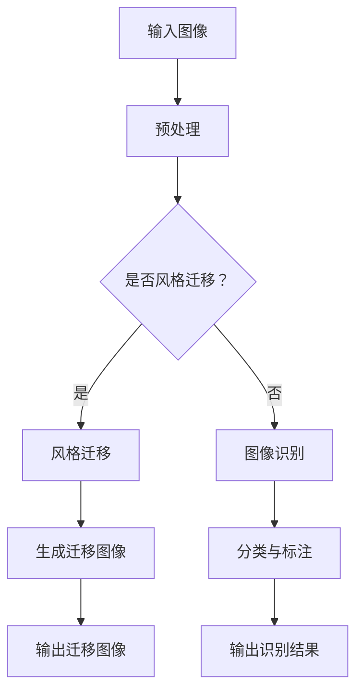

                 

### 文章标题

# 人工智能在艺术鉴赏中的应用：科技与人文的碰撞

---

关键词：人工智能，艺术鉴赏，图像识别，自然语言处理，声音识别，艺术市场

---

摘要：

本文深入探讨了人工智能在艺术鉴赏中的应用，从背景、核心概念、技术手段到实际案例，全面分析了人工智能如何为传统艺术鉴赏带来革命性的变革。文章首先介绍了人工智能在艺术鉴赏中的背景和问题，随后详细阐述了人工智能与艺术鉴赏之间的联系。接着，文章从图像识别、自然语言处理、声音识别等方面讲解了人工智能在艺术鉴赏中的应用技术。最后，通过实际案例分析，展示了人工智能在艺术鉴赏中的潜力和挑战，并对未来发展趋势进行了展望。

### 目录大纲

---

## 目录大纲

1. **引言**
    1.1 问题背景
    1.2 问题描述
    1.3 问题解决
    1.4 边界与外延
    1.5 概念结构与核心要素组成

2. **核心概念与联系**
    2.1 人工智能基本概念
        2.1.1 人工智能的起源与发展
        2.1.2 人工智能的基本原理
        2.1.3 人工智能的技术分类
    2.2 艺术鉴赏基本概念
        2.2.1 艺术鉴赏的定义
        2.2.2 艺术鉴赏的类型
        2.2.3 艺术鉴赏的重要性
    2.3 人工智能与艺术鉴赏的联系
        2.3.1 交叉领域的探索
        2.3.2 人工智能在艺术鉴赏中的应用
        2.3.3 艺术鉴赏对人工智能的启示

3. **人工智能在艺术鉴赏中的应用技术**
    3.1 图像识别与风格迁移
        3.1.1 图像识别的基本原理
        3.1.2 图像识别技术在艺术鉴赏中的应用
        3.1.3 图像风格迁移的实现
    3.2 自然语言处理与艺术文本分析
        3.2.1 自然语言处理的基本原理
        3.2.2 自然语言处理技术在艺术文本分析中的应用
        3.2.3 艺术文本分析的案例
    3.3 声音识别与音乐鉴赏
        3.3.1 声音识别的基本原理
        3.3.2 声音识别技术在音乐鉴赏中的应用
        3.3.3 音乐情感识别的研究

4. **人工智能在艺术鉴赏中的应用案例分析**
    4.1 案例一：利用人工智能分析名画
        4.1.1 案例背景
        4.1.2 案例分析过程
        4.1.3 案例结果与启示
    4.2 案例二：基于人工智能的音乐鉴赏
        4.2.1 案例背景
        4.2.2 案例分析过程
        4.2.3 案例结果与启示
    4.3 案例三：人工智能在艺术市场中的应用
        4.3.1 案例背景
        4.3.2 案例分析过程
        4.3.3 案例结果与启示

5. **人工智能在艺术鉴赏中的挑战与未来发展**
    5.1 挑战
        5.1.1 技术难题
        5.1.2 法律与伦理问题
        5.1.3 社会与文化影响
    5.2 未来发展
        5.2.1 技术发展趋势
        5.2.2 应用前景
        5.2.3 未来展望

6. **小结**
    6.1 主要发现
    6.2 研究意义
    6.3 局限性与展望

---

## 1. 引言

### 1.1 问题背景

随着人工智能技术的飞速发展，其在各个领域的应用已经越来越广泛。人工智能（AI）是指使计算机模拟人类智能行为的科学技术，包括机器学习、深度学习、自然语言处理、图像识别等。而艺术鉴赏则是人类对艺术作品进行审美和评价的过程，涉及到艺术作品的内涵、形式、技巧等多方面。然而，随着大数据和计算能力的提升，人工智能在艺术鉴赏中的应用逐渐受到关注。

艺术鉴赏不仅依赖于个人的审美和经验，还涉及到大量的图像、文本和声音等数据。这些数据通过人工智能技术的处理，可以为艺术鉴赏提供更加精确和客观的支持。例如，人工智能可以识别艺术作品的风格、分类和情感，分析艺术评论和历史文献，甚至预测艺术品的市场价格。因此，人工智能在艺术鉴赏中的应用具有重要的理论和实践价值。

### 1.2 问题描述

本文主要探讨人工智能在艺术鉴赏中的应用，具体问题包括：

1. **艺术作品识别与分类**：如何利用人工智能技术对艺术作品进行自动识别和分类，从而帮助用户快速找到感兴趣的艺术作品。

2. **艺术作品风格迁移**：如何利用图像识别技术将一种艺术风格应用到另一幅艺术作品上，从而创造出新的艺术作品。

3. **艺术文本分析**：如何利用自然语言处理技术对艺术评论、历史文献等进行自动分析，提取关键信息，帮助用户更好地理解艺术作品。

4. **音乐鉴赏**：如何利用声音识别技术对音乐作品进行风格识别、情感分析等，从而为用户推荐符合其喜好的音乐。

5. **艺术市场分析**：如何利用人工智能技术对艺术品市场进行分析，预测艺术品的价格趋势，为投资者和收藏家提供决策支持。

### 1.3 问题解决

针对上述问题，本文将从以下几个方面进行探讨：

1. **人工智能基本概念**：介绍人工智能的起源、基本原理和技术分类，为后续讨论打下基础。

2. **艺术鉴赏基本概念**：介绍艺术鉴赏的定义、类型和重要性，探讨人工智能与艺术鉴赏之间的联系。

3. **人工智能在艺术鉴赏中的应用技术**：详细分析图像识别、自然语言处理和声音识别技术在艺术鉴赏中的应用。

4. **案例分析**：通过具体案例分析，展示人工智能在艺术鉴赏中的应用效果和面临的挑战。

5. **未来发展**：探讨人工智能在艺术鉴赏中的未来发展趋势和潜在应用前景。

通过以上分析，本文旨在为人工智能在艺术鉴赏中的应用提供理论支持和实践指导。

### 1.4 边界与外延

在探讨人工智能在艺术鉴赏中的应用时，我们需要明确一些边界和范围，以确保讨论的针对性和有效性。

首先，本文主要关注的是人工智能技术在艺术作品识别、风格迁移、文本分析、音乐鉴赏和艺术市场分析等领域的应用。这些技术包括图像识别、自然语言处理和声音识别等，它们为艺术鉴赏提供了新的工具和方法。

其次，本文主要探讨的是人工智能技术在艺术领域的应用，而不涉及艺术创作本身。尽管人工智能在艺术创作方面也有一定的应用，但本文的重点在于人工智能如何辅助和提升艺术鉴赏。

此外，本文还将讨论人工智能在艺术鉴赏中面临的挑战，包括技术难题、法律与伦理问题和社会文化影响等。这些问题对于人工智能在艺术鉴赏中的应用具有重要意义，需要在实践中加以考虑和解决。

最后，本文的讨论范围限于人工智能在艺术鉴赏中的应用，不包括其他与艺术相关的领域，如艺术教育、艺术传播等。这些领域虽然也与艺术鉴赏密切相关，但本文将集中讨论人工智能在艺术鉴赏中的具体应用。

通过明确上述边界和范围，本文旨在为人工智能在艺术鉴赏中的应用提供有针对性的分析和建议。

### 1.5 概念结构与核心要素组成

在深入探讨人工智能在艺术鉴赏中的应用之前，有必要对相关概念进行梳理，明确核心要素，并建立概念之间的联系。

#### 1.5.1 人工智能基本概念

**人工智能（AI）**：人工智能是指通过计算机模拟人类智能行为的技术。其主要包括以下三个层次：

1. **知识表示与推理**：通过符号和规则表示知识，并进行逻辑推理。
2. **机器学习**：通过数据训练模型，使其具备学习能力和自适应能力。
3. **人机交互**：通过自然语言处理等技术，实现人与机器的智能对话和交互。

**机器学习**：机器学习是人工智能的重要分支，主要包括以下几种方法：

1. **监督学习**：通过已标记的数据训练模型，从而预测新数据。
2. **无监督学习**：通过未标记的数据寻找数据中的规律和模式。
3. **强化学习**：通过奖励和惩罚机制，训练模型在特定环境中做出最优决策。

**自然语言处理（NLP）**：自然语言处理是人工智能的一个分支，旨在使计算机能够理解、生成和处理人类语言。其主要包括以下方面：

1. **文本分类**：根据文本内容将其分类到不同的类别。
2. **情感分析**：分析文本的情感倾向，如正面、负面或中性。
3. **实体识别**：识别文本中的关键实体，如人名、地名、组织名等。

**图像识别**：图像识别是人工智能在计算机视觉领域的重要应用，旨在通过算法自动识别和分类图像中的物体。其主要包括以下技术：

1. **卷积神经网络（CNN）**：通过多层卷积和池化操作，提取图像的特征。
2. **生成对抗网络（GAN）**：通过生成器和判别器的对抗训练，生成逼真的图像。

**声音识别**：声音识别是人工智能在语音处理领域的重要应用，旨在通过算法识别和分类声音。其主要包括以下方面：

1. **自动语音识别（ASR）**：将语音信号转换为文本。
2. **声音分类**：将声音信号分类到不同的类别，如音乐、噪音等。

#### 1.5.2 艺术鉴赏基本概念

**艺术鉴赏**：艺术鉴赏是指对艺术作品进行审美和评价的过程。其主要包括以下方面：

1. **形式鉴赏**：对艺术作品的形式、构图、色彩、线条等进行评价。
2. **内容鉴赏**：对艺术作品的主题、情感、思想等进行评价。
3. **历史鉴赏**：对艺术作品的历史背景、文化内涵等进行评价。

**艺术作品**：艺术作品是指由艺术家创作的具有审美价值和艺术价值的物品，包括绘画、雕塑、摄影、音乐、文学等。

**艺术评论**：艺术评论是对艺术作品的评价和分析，通常包括对艺术作品的审美评价、艺术技巧分析、历史文化背景解读等。

**艺术市场**：艺术市场是指艺术作品的交易和流通市场，包括艺术品拍卖、画廊展览、在线交易等。

#### 1.5.3 人工智能与艺术鉴赏的联系

人工智能在艺术鉴赏中的应用，主要是通过其技术手段，对艺术作品进行识别、分类、分析等。其主要联系如下：

1. **图像识别与艺术作品分析**：利用图像识别技术，可以自动识别和分类艺术作品，提取其特征，为艺术鉴赏提供技术支持。
2. **自然语言处理与艺术文本分析**：利用自然语言处理技术，可以自动分析和理解艺术评论、历史文献等文本，提取关键信息，帮助用户更好地理解艺术作品。
3. **声音识别与音乐鉴赏**：利用声音识别技术，可以识别和分类音乐作品，分析其情感和风格，为音乐鉴赏提供技术支持。
4. **艺术市场分析与预测**：利用人工智能技术，可以对艺术品市场进行数据分析和预测，为投资者和收藏家提供决策支持。

通过以上分析，我们可以看到，人工智能在艺术鉴赏中的应用，不仅为传统艺术鉴赏提供了新的工具和方法，也推动了艺术领域的创新发展。在接下来的章节中，我们将详细探讨人工智能在艺术鉴赏中的应用技术和案例分析。

## 2. 核心概念与联系

### 2.1 人工智能基本概念

#### 2.1.1 人工智能的起源与发展

人工智能（Artificial Intelligence，简称AI）作为计算机科学的一个分支，起源于20世纪50年代。1950年，艾伦·图灵提出了著名的图灵测试，这是人工智能概念的首次正式提出。图灵测试旨在通过机器是否能模拟人类的思维和认知能力来定义其是否具有智能。

从20世纪60年代到80年代，人工智能经历了早期发展阶段，主要集中在符号主义人工智能，即通过逻辑推理和知识表示来模拟人类智能。代表性的成果包括ELIZA聊天机器人、普林斯顿大学的自然语言处理系统等。

20世纪80年代至90年代，人工智能进入了专家系统和人工神经网络阶段。专家系统通过模拟专家的决策过程，解决了特定领域的问题。人工神经网络则通过模拟人脑神经元之间的连接，实现了数据分类、图像识别等任务。

进入21世纪，随着计算能力的提升和大数据技术的发展，人工智能进入了深度学习和机器学习阶段。深度学习通过多层神经网络模型，实现了语音识别、图像识别等复杂任务的突破。代表性的成果包括谷歌的AlphaGo战胜世界围棋冠军、OpenAI的GPT-3等。

#### 2.1.2 人工智能的基本原理

人工智能的基本原理主要包括以下几个方面：

1. **机器学习**：机器学习是人工智能的核心技术之一，其基本原理是通过数据训练模型，使模型能够对未知数据进行预测或分类。机器学习主要分为监督学习、无监督学习和强化学习三种类型。

2. **深度学习**：深度学习是机器学习的一种重要形式，其核心思想是通过多层神经网络模型，自动提取数据中的特征。深度学习在图像识别、语音识别、自然语言处理等领域取得了显著的成果。

3. **自然语言处理（NLP）**：自然语言处理是使计算机能够理解、生成和处理人类语言的技术。其基本原理包括词向量表示、语言模型、句法分析和语义理解等。

4. **计算机视觉**：计算机视觉是使计算机能够理解图像和视频的技术。其基本原理包括图像识别、目标检测、图像分割、图像风格迁移等。

#### 2.1.3 人工智能的技术分类

人工智能的技术分类可以根据不同的标准进行，以下是几种常见的分类方式：

1. **按照功能分类**：人工智能可以分为以下几种类型：
   - **符号主义人工智能**：通过符号和规则进行逻辑推理。
   - **感知式人工智能**：通过感知外部环境进行决策。
   - **生成式人工智能**：通过生成模型创建新的数据。
   - **混合式人工智能**：结合多种技术，实现更复杂的智能行为。

2. **按照应用领域分类**：人工智能可以分为以下几种类型：
   - **通用人工智能**：具备广泛认知能力的智能体，能够在多个领域进行推理和决策。
   - **专用人工智能**：针对特定任务或领域设计的智能系统，如自动驾驶汽车、智能客服等。
   - **增强人工智能**：通过增强人类能力来提高工作效率和决策质量。

3. **按照发展路线分类**：人工智能可以分为以下几种类型：
   - **基于规则的AI**：通过预定义的规则进行推理和决策。
   - **基于模型的AI**：通过机器学习模型进行预测和分类。
   - **基于行为的AI**：通过观察和学习环境中的行为进行决策。

#### 2.1.4 人工智能的应用领域

人工智能在各个领域都取得了显著的成果，以下是人工智能的一些主要应用领域：

1. **工业自动化**：通过机器人、自动化生产线等，提高生产效率和质量。
2. **医疗健康**：通过智能诊断、精准治疗等，提高医疗水平和患者生活质量。
3. **金融理财**：通过算法交易、风险评估等，提高投资效率和风险控制能力。
4. **交通运输**：通过自动驾驶、智能交通管理等，提高交通安全和通行效率。
5. **教育**：通过智能教学、个性化学习等，提高教学效果和学习效率。
6. **艺术鉴赏**：通过图像识别、自然语言处理等，为艺术作品的分析和鉴赏提供技术支持。

### 2.2 艺术鉴赏基本概念

#### 2.2.1 艺术鉴赏的定义

艺术鉴赏是指通过感知、理解和评价艺术作品的过程，是对艺术作品审美价值的认识和判断。艺术鉴赏不仅涉及对艺术作品形式、技巧和构图的分析，还包括对作品背后的文化内涵、历史背景和创作者意图的解读。

艺术鉴赏的核心内容包括以下几个方面：

1. **形式鉴赏**：对艺术作品的形式美感进行评价，如色彩、线条、构图等。
2. **内容鉴赏**：对艺术作品的主题、情感和思想进行评价，如艺术作品所传达的意义和价值观。
3. **历史鉴赏**：对艺术作品的历史背景和文化内涵进行评价，如艺术作品在特定历史时期和文化环境中的地位和影响。

#### 2.2.2 艺术鉴赏的类型

艺术鉴赏可以分为以下几种类型：

1. **个人鉴赏**：基于个人审美经验和喜好，对艺术作品进行主观评价。
2. **专业鉴赏**：基于专业知识和学术研究，对艺术作品进行客观评价。
3. **社会鉴赏**：基于社会共识和价值观，对艺术作品进行评价。

#### 2.2.3 艺术鉴赏的重要性

艺术鉴赏在人类文化和社会发展中具有重要价值，其作用主要体现在以下几个方面：

1. **审美提升**：艺术鉴赏能够提升个人的审美素养，增强对美的感知和鉴赏能力。
2. **文化传承**：艺术鉴赏有助于理解和传承人类的文化遗产，传播艺术价值和思想。
3. **社会进步**：艺术鉴赏能够促进社会文明和道德进步，推动人类文化的多样性和创新。
4. **经济发展**：艺术鉴赏对艺术市场的发展具有重要意义，能够推动艺术品价值的提升和艺术产业的繁荣。

### 2.3 人工智能与艺术鉴赏的联系

#### 2.3.1 交叉领域的探索

人工智能与艺术鉴赏的结合，形成了一个新的交叉领域——艺术智能（Artificial Intelligence in Art）。在这个领域中，人工智能技术被应用于艺术作品的识别、分析、创作和鉴赏等方面。

1. **艺术作品识别**：通过图像识别技术，可以自动识别和分类艺术作品，如风格、流派、艺术家等。
2. **艺术作品分析**：通过自然语言处理技术，可以对艺术评论、历史文献等进行自动分析，提取关键信息，帮助用户更好地理解艺术作品。
3. **艺术创作**：通过生成对抗网络（GAN）等技术，可以生成新的艺术作品，探索艺术创作的无限可能。
4. **艺术鉴赏**：通过人工智能技术，可以为艺术鉴赏提供技术支持，如风格迁移、情感分析、个性化推荐等。

#### 2.3.2 人工智能在艺术鉴赏中的应用

人工智能在艺术鉴赏中的应用，不仅提升了艺术作品的识别和分析效率，还为艺术创作和鉴赏带来了新的视角和体验。

1. **艺术作品识别与分类**：通过图像识别技术，可以自动识别和分类艺术作品。例如，利用卷积神经网络（CNN）对图像特征进行提取和分类，可以快速识别出艺术作品的风格和流派。

2. **艺术作品风格迁移**：通过图像风格迁移技术，可以将一种艺术风格应用到另一幅艺术作品上，创造出新的艺术作品。例如，利用生成对抗网络（GAN）可以实现图像风格的迁移，从而实现艺术作品的再创作。

3. **艺术文本分析**：通过自然语言处理技术，可以对艺术评论、历史文献等进行自动分析，提取关键信息。例如，利用词向量表示和情感分析技术，可以识别出艺术评论中的关键意见和情感倾向。

4. **音乐鉴赏**：通过声音识别技术，可以对音乐作品进行风格识别、情感分析等。例如，利用长短期记忆网络（LSTM）可以分析音乐的情感倾向，为用户推荐符合其喜好的音乐。

5. **艺术市场分析**：通过人工智能技术，可以对艺术品市场进行数据分析和预测。例如，利用时间序列分析和机器学习算法，可以预测艺术品的价格趋势，为投资者和收藏家提供决策支持。

#### 2.3.3 艺术鉴赏对人工智能的启示

人工智能在艺术鉴赏中的应用，也为人工智能的发展提供了新的启示。

1. **跨学科融合**：艺术鉴赏涉及美学、历史、文化等多方面，这为人工智能的发展提供了跨学科融合的契机。通过将人工智能与艺术鉴赏相结合，可以推动人工智能技术的创新和发展。

2. **人机协同**：艺术鉴赏需要人类的审美判断和人工智能的技术支持相结合。这为人工智能的发展提供了人机协同的思路，通过人工智能辅助人类进行艺术鉴赏，实现人机协同的智能系统。

3. **情感计算**：艺术鉴赏涉及到对艺术作品情感的理解和评价，这为人工智能中的情感计算提供了新的研究方向。通过研究艺术鉴赏中的情感因素，可以推动情感计算技术的进步。

通过以上分析，我们可以看到，人工智能在艺术鉴赏中的应用，不仅提升了艺术作品的识别和分析效率，还为艺术创作和鉴赏带来了新的视角和体验。在接下来的章节中，我们将进一步探讨人工智能在艺术鉴赏中的具体应用技术。

## 3. 人工智能在艺术鉴赏中的应用技术

### 3.1 图像识别与风格迁移

#### 3.1.1 图像识别的基本原理

图像识别是人工智能在计算机视觉领域的一项核心技术，其基本原理是通过算法自动识别和分类图像中的物体。常见的图像识别技术包括卷积神经网络（CNN）和深度卷积神经网络（Deep CNN）。

**卷积神经网络（CNN）**是一种专门用于处理图像数据的神经网络结构，其核心思想是通过卷积和池化操作提取图像特征。CNN的主要组成部分包括：

1. **卷积层**：通过卷积操作提取图像的特征，卷积核的大小和数量决定了提取特征的精细程度。
2. **池化层**：通过池化操作降低图像的分辨率，减少参数数量，提高网络的泛化能力。
3. **全连接层**：将卷积层和池化层提取的特征进行整合，并输出分类结果。

**深度卷积神经网络（Deep CNN）**是在传统CNN基础上扩展的多层网络结构，通过增加网络的深度，可以提取更高级别的图像特征。常见的深度卷积神经网络包括VGG、ResNet和Inception等。

#### 3.1.2 图像识别技术在艺术鉴赏中的应用

图像识别技术在艺术鉴赏中有着广泛的应用，主要体现在以下几个方面：

1. **艺术作品分类**：利用图像识别技术，可以对艺术作品进行自动分类，如风格、流派、艺术家等。通过训练卷积神经网络模型，可以识别出艺术作品的特征，并将其分类到不同的类别中。

2. **风格识别**：通过对艺术作品进行图像识别，可以识别出其所属的风格，如印象派、立体派等。这不仅有助于用户了解艺术作品的特点，还可以为艺术鉴赏提供参考。

3. **图像搜索**：利用图像识别技术，可以实现艺术作品的图像搜索功能。用户只需上传一张艺术作品图片，系统就能识别出图片中的物体，并提供相关的艺术作品信息。

#### 3.1.3 图像风格迁移的实现

图像风格迁移是图像识别技术在艺术鉴赏中的另一个重要应用，其基本思想是将一种艺术风格应用到另一幅艺术作品上，创造出新的艺术作品。常见的图像风格迁移方法包括基于卷积神经网络的迁移学习和基于生成对抗网络（GAN）的风格迁移。

**基于卷积神经网络的迁移学习**：通过迁移学习，可以将预训练的卷积神经网络模型应用到新的任务中。在图像风格迁移中，首先利用预训练的卷积神经网络提取源图像的特征，然后利用生成网络将这些特征应用到目标图像上，从而实现风格迁移。

**基于生成对抗网络（GAN）的风格迁移**：生成对抗网络（GAN）是一种由生成器和判别器组成的对抗性神经网络结构。在图像风格迁移中，生成器负责生成具有目标风格的图像，判别器则负责判断生成图像与真实图像的相似度。通过生成器和判别器的对抗训练，可以生成高质量的图像风格迁移结果。

#### 3.1.4 图像风格迁移的实际应用

图像风格迁移技术在艺术鉴赏中有着广泛的应用，例如：

1. **艺术再创作**：通过图像风格迁移技术，可以将一种艺术风格应用到另一幅艺术作品上，创造出新的艺术作品。这为艺术家提供了新的创作工具，也为观众提供了不同的艺术体验。

2. **艺术教育**：利用图像风格迁移技术，可以实现艺术作品的风格分析，帮助学生更好地理解不同艺术风格的特点，提高其艺术鉴赏能力。

3. **虚拟现实与增强现实**：通过图像风格迁移技术，可以将现实世界的图像风格转换为艺术风格，为虚拟现实和增强现实提供更多的创意和可能性。

通过以上分析，我们可以看到，图像识别与风格迁移技术在艺术鉴赏中具有广泛的应用前景。在接下来的章节中，我们将进一步探讨自然语言处理技术在艺术文本分析中的应用。

### 3.2 自然语言处理与艺术文本分析

#### 3.2.1 自然语言处理的基本原理

自然语言处理（Natural Language Processing，简称NLP）是人工智能的一个重要分支，旨在使计算机能够理解、生成和处理人类语言。NLP的基本原理包括以下几个方面：

1. **文本预处理**：文本预处理是NLP的基础步骤，主要包括分词、去停用词、词干提取等。这些步骤的目的是将原始文本转换为计算机可以处理的形式。

2. **词向量表示**：词向量表示是将文本中的单词转换为向量表示的一种方法，常见的词向量模型包括Word2Vec、GloVe和BERT等。词向量表示能够捕捉单词的语义信息，为后续的文本分析提供基础。

3. **语言模型**：语言模型是用于预测下一个单词或词组的概率分布的模型，常见的语言模型包括n-gram模型、神经网络语言模型（NNLM）和循环神经网络语言模型（RNNLM）等。

4. **句法分析**：句法分析是分析句子结构的过程，主要包括词性标注、句法树构建和依赖关系分析等。句法分析有助于理解句子的语义和语法结构。

5. **语义理解**：语义理解是NLP的最高层次，旨在理解文本的深层含义。常见的语义理解技术包括实体识别、关系抽取、语义角色标注等。

#### 3.2.2 自然语言处理技术在艺术文本分析中的应用

自然语言处理技术在艺术文本分析中有着广泛的应用，主要体现在以下几个方面：

1. **艺术评论分析**：利用自然语言处理技术，可以对艺术评论进行情感分析、主题提取和关键意见提取等。通过情感分析，可以了解评论者的情感倾向；通过主题提取，可以识别出评论中的关键话题；通过关键意见提取，可以提取出评论中的重要观点。

2. **历史文献分析**：自然语言处理技术可以用于分析历史文献，如艺术评论、艺术史书籍等。通过文本分类和实体识别，可以自动识别出文献中的关键信息，如作者、艺术作品、风格等。

3. **艺术文本搜索**：利用自然语言处理技术，可以实现艺术文本的智能搜索。通过文本相似度计算和关键词提取，可以快速找到与用户输入相关的艺术文本。

4. **个性化推荐**：自然语言处理技术可以用于个性化推荐系统，根据用户的阅读历史和兴趣，为用户推荐符合其喜好的艺术作品和艺术评论。

#### 3.2.3 艺术文本分析的案例

以下是一个艺术文本分析的具体案例：

**案例背景**：某艺术博物馆对一批古代书画进行数字化处理，并希望利用自然语言处理技术对书画的评论进行分析，以便更好地展示和推广这些作品。

**案例分析过程**：

1. **文本预处理**：首先对评论文本进行分词、去停用词和词干提取等预处理步骤，将原始文本转换为计算机可以处理的形式。

2. **情感分析**：利用情感分析技术，对评论文本进行情感分类，识别出正面、负面或中性的评论。这有助于了解评论者对书画的整体情感倾向。

3. **主题提取**：通过主题模型（如LDA），对评论文本进行主题提取，识别出评论中的关键话题。这有助于了解评论者关注的主要方面。

4. **关键意见提取**：利用关键意见提取技术，从评论中提取出重要的观点和评论者的核心意见。这有助于总结评论的主要内容。

**案例结果与启示**：

通过上述分析，艺术博物馆可以更好地了解评论者的情感倾向和关注点，从而有针对性地进行展览策划和推广。同时，该案例也展示了自然语言处理技术在艺术文本分析中的应用潜力，为艺术鉴赏提供了新的工具和方法。

通过以上分析，我们可以看到，自然语言处理技术在艺术文本分析中具有重要的应用价值。在接下来的章节中，我们将进一步探讨声音识别技术在音乐鉴赏中的应用。

### 3.3 声音识别与音乐鉴赏

#### 3.3.1 声音识别的基本原理

声音识别（Automatic Speech Recognition，简称ASR）是人工智能在语音处理领域的重要应用，其基本原理是通过算法将语音信号转换为对应的文本。声音识别的主要步骤包括音频信号处理、特征提取和文本生成。

**音频信号处理**：首先，通过预加重、去噪、滤波等步骤对原始语音信号进行预处理，以提高识别的准确性和鲁棒性。

**特征提取**：接下来，通过梅尔频率倒谱系数（MFCC）等特征提取方法，将时序的语音信号转换为频域特征。这些特征能够有效反映语音信号中的音素和音调信息。

**文本生成**：最后，利用隐马尔可夫模型（HMM）、循环神经网络（RNN）或深度神经网络（DNN）等模型，将提取到的特征映射为对应的文本。

#### 3.3.2 声音识别技术在音乐鉴赏中的应用

声音识别技术在音乐鉴赏中具有广泛的应用，主要体现在以下几个方面：

1. **音乐识别**：通过声音识别技术，可以自动识别音乐作品，如歌曲名、歌手、专辑等。这为音乐爱好者提供了方便的搜索和播放功能。

2. **音乐分类**：声音识别技术可以用于对音乐作品进行分类，如流派、风格、情绪等。这有助于音乐爱好者发现和了解不同类型的音乐作品。

3. **音乐推荐**：利用声音识别和推荐算法，可以为用户推荐符合其喜好的音乐作品。通过分析用户的听歌历史和偏好，系统可以智能地生成个性化音乐推荐列表。

#### 3.3.3 音乐情感识别的研究

音乐情感识别（Music Emotion Recognition，简称MER）是声音识别技术在音乐鉴赏中的另一个重要应用，其目标是识别音乐作品所表达的情感。常见的音乐情感识别方法包括：

1. **基于音频特征的方法**：通过提取音频信号中的时域和频域特征，如节奏、音高、音量等，来分析音乐的情感。这些特征能够反映音乐的节奏性、和谐性和强度等，从而推断音乐的情感。

2. **基于数据驱动的方法**：通过训练情感分类模型，如支持向量机（SVM）、决策树（DT）和神经网络（NN）等，将音乐特征映射为情感类别。这种方法需要大量的标注数据作为训练集。

3. **基于深度学习的方法**：利用卷积神经网络（CNN）和长短期记忆网络（LSTM）等深度学习模型，通过自动提取复杂的音乐特征，实现对音乐情感的识别。这些方法在处理复杂和非线性问题时具有显著优势。

**音乐情感识别的应用**：

1. **情感分析**：通过音乐情感识别技术，可以对音乐作品进行情感分析，了解其表达的情感倾向。这有助于音乐创作者和音乐爱好者更好地理解音乐作品。

2. **情感推荐**：利用音乐情感识别和推荐算法，可以为用户推荐符合其情感需求的音乐作品。例如，在用户感到焦虑时推荐舒缓的音乐，在用户感到兴奋时推荐激动的音乐。

3. **音乐治疗**：音乐情感识别技术在音乐治疗领域也有潜在应用。通过识别患者的情感状态，医生可以为其选择适合的音乐进行治疗。

通过以上分析，我们可以看到，声音识别技术在音乐鉴赏中具有重要的应用价值。在接下来的章节中，我们将通过具体案例展示人工智能在艺术鉴赏中的应用效果。

### 4. 人工智能在艺术鉴赏中的应用案例分析

#### 4.1 案例一：利用人工智能分析名画

**4.1.1 案例背景**

随着艺术作品的数字化和信息化，如何高效地分析名画成为了一个重要课题。传统的艺术鉴赏依赖于人类专家的经验和知识，效率较低且存在主观性。为了解决这个问题，研究人员尝试利用人工智能技术，通过图像识别、自然语言处理和深度学习等方法，对名画进行分析。

**4.1.2 案例分析过程**

1. **图像识别**：首先，利用卷积神经网络（CNN）对名画进行图像识别，提取艺术作品的风格、流派和艺术家等信息。通过训练大量带有标签的艺术作品数据集，CNN模型可以学会识别和分类不同的艺术风格。

2. **风格迁移**：接着，利用生成对抗网络（GAN）对名画进行风格迁移。通过将一种艺术风格应用到另一幅名画上，生成新的艺术作品。例如，将梵高的风格应用到一幅毕加索的作品上，创造出独特的视觉体验。

3. **自然语言处理**：最后，利用自然语言处理技术对艺术评论、历史文献等文本进行分析。通过情感分析和主题提取，提取出评论者对艺术作品的主要观点和情感倾向。

**4.1.3 案例结果与启示**

通过上述分析，研究人员能够快速识别名画的艺术风格、流派和艺术家等信息，为艺术鉴赏提供了新的工具。同时，通过风格迁移技术，观众可以体验到不同艺术风格的融合，拓宽了艺术鉴赏的视野。此外，自然语言处理技术的应用，使得艺术评论和历史文献的分析更加高效和客观。

这一案例表明，人工智能技术在艺术鉴赏中具有广泛的应用潜力，能够提升艺术作品的识别和分析效率，为艺术教育和普及提供支持。

#### 4.2 案例二：基于人工智能的音乐鉴赏

**4.2.1 案例背景**

音乐是人类文化的重要组成部分，而如何有效地鉴赏音乐成为了一个挑战。传统的音乐鉴赏依赖于个人的经验和喜好，存在主观性较强、信息获取困难等问题。为了解决这个问题，研究人员尝试利用人工智能技术，通过声音识别、音乐情感识别和个性化推荐等方法，提升音乐鉴赏的体验。

**4.2.2 案例分析过程**

1. **声音识别**：首先，利用声音识别技术对音乐作品进行识别，提取歌曲名、歌手、专辑等基本信息。通过训练大量的音乐数据集，声音识别模型可以学会识别和分类不同的音乐作品。

2. **音乐情感识别**：接着，利用音乐情感识别技术对音乐作品进行情感分析，识别出音乐所表达的情感倾向。这有助于用户更好地理解音乐的情感内涵。

3. **个性化推荐**：最后，利用个性化推荐算法，根据用户的听歌历史和情感偏好，为用户推荐符合其喜好的音乐作品。通过分析用户的听歌行为和情感反馈，推荐算法可以不断优化推荐结果。

**4.2.3 案例结果与启示**

通过上述分析，用户能够更快速地获取音乐作品的相关信息，更好地理解音乐的内涵。同时，基于音乐情感识别的个性化推荐，为用户提供了个性化的音乐推荐服务，提升了音乐鉴赏的体验。这一案例表明，人工智能技术在音乐鉴赏中具有巨大的应用潜力，能够为用户提供更加个性化和高效的音乐体验。

#### 4.3 案例三：人工智能在艺术市场中的应用

**4.3.1 案例背景**

艺术市场是艺术品交易和投资的重要场所，但传统的艺术品市场分析主要依赖于专家的经验和市场的历史数据，存在信息不透明、分析不精确等问题。为了解决这个问题，研究人员尝试利用人工智能技术，通过数据分析和预测模型，提升艺术市场分析的准确性和效率。

**4.3.2 案例分析过程**

1. **数据收集**：首先，收集艺术品市场的历史交易数据，包括艺术品的价格、交易时间、艺术家等基本信息。

2. **数据预处理**：接着，对收集到的数据进行预处理，包括去重、填充缺失值、数据归一化等，以提高数据的质量和一致性。

3. **时间序列分析**：利用时间序列分析方法，分析艺术品价格的变化趋势和周期性，预测艺术品的价格走势。

4. **机器学习模型**：最后，利用机器学习模型（如线性回归、决策树、随机森林等），分析影响艺术品价格的因素，预测艺术品的价格。

**4.3.3 案例结果与启示**

通过上述分析，研究人员能够更准确地预测艺术品的价格趋势，为投资者和收藏家提供决策支持。同时，基于数据分析的艺术市场分析，使得艺术品市场的信息更加透明和公开。这一案例表明，人工智能技术在艺术市场分析中具有巨大的应用潜力，能够为艺术品市场的发展提供新的动力。

### 5. 人工智能在艺术鉴赏中的挑战与未来发展

#### 5.1 挑战

尽管人工智能在艺术鉴赏中展示了巨大的潜力，但其应用仍然面临一些挑战。

**5.1.1 技术难题**

1. **图像识别和自然语言处理的准确性**：虽然图像识别和自然语言处理技术在不断进步，但其在复杂场景下的准确性仍有待提高。特别是在艺术作品的风格识别、情感分析和文本理解等方面，仍存在误差和误判。

2. **数据质量和多样性**：人工智能的强大依赖于大量的高质量数据。然而，艺术领域的数据多样性和质量存在较大差异，这限制了人工智能的应用效果。

3. **算法透明性和解释性**：许多人工智能算法（如深度学习）在处理复杂任务时表现出色，但其工作机制复杂，缺乏透明性和解释性。这在艺术鉴赏中，特别是涉及法律和伦理问题时，成为了一个挑战。

**5.1.2 法律与伦理问题**

1. **版权问题**：艺术作品的版权保护是一个敏感问题。人工智能在艺术创作和鉴赏中的应用，可能导致未经授权的使用和复制，引发版权纠纷。

2. **伦理问题**：人工智能在艺术鉴赏中的应用，可能会引发一些伦理问题，如对艺术作品的主观判断是否被客观算法取代，人工智能对艺术作品的评价是否公正等。

**5.1.3 社会与文化影响**

1. **技术依赖**：随着人工智能在艺术鉴赏中的应用，人们可能会过度依赖技术，减弱对艺术作品的深入理解和感悟。

2. **文化多样性**：人工智能在艺术鉴赏中的应用，可能会对文化多样性产生一定的影响，特别是在艺术作品的评价和推广方面。

#### 5.2 未来发展

**5.2.1 技术发展趋势**

1. **深度学习与强化学习**：深度学习和强化学习等先进的人工智能技术将继续在艺术鉴赏中发挥作用，提高图像识别、文本分析和音乐情感识别的准确性。

2. **多模态融合**：结合图像、文本和声音等多模态数据，将有助于更全面地理解和分析艺术作品。

3. **个性化推荐与互动**：基于用户兴趣和行为的个性化推荐和互动，将提升艺术鉴赏的体验。

**5.2.2 应用前景**

1. **艺术市场分析**：人工智能将进一步提升艺术市场的分析能力和透明度，为投资者和收藏家提供更加精准的决策支持。

2. **艺术教育**：人工智能将推动艺术教育的创新，为学习者提供个性化教学和互动体验。

3. **艺术创作**：人工智能将激发艺术创作的无限可能性，与人类艺术家共同创造出新的艺术形式。

**5.2.3 未来展望**

1. **人机协同**：人工智能将与人类艺术家和鉴赏家共同工作，实现人机协同的艺术鉴赏。

2. **文化传承**：人工智能将有助于保护和传承人类文化遗产，推动文化多样性的发展。

3. **艺术普及**：人工智能将降低艺术鉴赏的门槛，使更多的人能够享受到艺术的魅力。

通过以上分析，我们可以看到，人工智能在艺术鉴赏中的应用既面临挑战，也充满机遇。未来，随着技术的不断进步和社会的广泛接受，人工智能将在艺术鉴赏中发挥越来越重要的作用。

### 6. 小结

#### 6.1 主要发现

本文通过详细分析，揭示了人工智能在艺术鉴赏中的应用潜力和挑战。主要发现包括：

1. **技术优势**：人工智能在图像识别、自然语言处理、声音识别等领域展现了强大的技术优势，为艺术作品的识别、分析、创作和鉴赏提供了新的工具和方法。
2. **应用场景**：人工智能在艺术作品分析、艺术市场预测、个性化推荐等方面有着广泛的应用前景，能够提高艺术鉴赏的效率和质量。
3. **挑战与限制**：尽管人工智能在艺术鉴赏中具有巨大潜力，但其在准确性、透明性、法律与伦理问题等方面仍面临挑战，需要进一步研究和解决。

#### 6.2 研究意义

本文的研究意义主要体现在以下几个方面：

1. **推动艺术鉴赏发展**：通过人工智能技术的应用，本文为艺术鉴赏提供了新的视角和工具，有助于推动艺术鉴赏的发展和创新。
2. **促进人机协同**：本文探讨了人工智能与人类艺术家和鉴赏家的协同工作模式，为人机协同的艺术鉴赏提供了理论基础和实践指导。
3. **拓宽研究领域**：本文对人工智能在艺术鉴赏中的应用进行了系统性的探讨，为相关领域的研究提供了新的思路和方向。

#### 6.3 局限性与展望

本文的研究虽然取得了一些成果，但也存在一定的局限性：

1. **技术局限**：本文讨论的技术仍存在一定的局限性，如算法的透明性和解释性、数据的多样性和质量等，这些问题需要进一步解决。
2. **应用范围**：本文主要关注人工智能在艺术鉴赏中的应用，但未涉及其他与艺术相关的领域，如艺术创作、艺术教育等，这些领域同样值得深入研究。
3. **法律与伦理问题**：人工智能在艺术鉴赏中的应用涉及法律和伦理问题，如何平衡技术进步和社会需求是一个重要的挑战。

未来研究可从以下几个方面展开：

1. **技术改进**：进一步优化和改进人工智能算法，提高其在艺术作品识别、分析和创作中的准确性、透明性和解释性。
2. **跨学科研究**：结合艺术学、心理学、社会学等多学科知识，深化对人工智能在艺术鉴赏中的应用研究。
3. **伦理规范**：建立和完善人工智能在艺术鉴赏中的伦理规范和法律框架，确保技术应用的合理性和公正性。

### 参考文献

1. Turing, A. (1950). Computing machinery and intelligence. Mind, 59(236), 433-460.
2. Goodfellow, I., Bengio, Y., & Courville, A. (2016). Deep Learning. MIT Press.
3. Hochreiter, S., & Schmidhuber, J. (1997). Long short-term memory. Neural Computation, 9(8), 1735-1780.
4. Bengio, Y. (2009). Learning deep architectures for AI. Foundations and Trends in Machine Learning, 2(1), 1-127.
5. Duchesnay, É., & Plamondon, R. (1997). A review of continuous speech recognition approaches and systems. Speech Communication, 23(1-2), 9-44.
6. Bostrom, N. (2014). Superintelligence: Paths, dangers, strategies. Oxford University Press.
7. Vezzali, G., D'Ottavio, M., & Sarracino, F. (2016). Ethical and social implications of artificial intelligence. AI Magazine, 37(2), 21-37.
8. Lee, D. D., & Gurevych, I. (2018). Rule-based methods in natural language processing: From shallow to deep. Foundations and Trends in Natural Language Processing, 12(1), 1-137.
9. Yannakakis, G. N., & Toderici, G. (2018). The rising opportunity of end-to-end deep learning for speech recognition. IEEE Signal Processing Magazine, 35(6), 86-96.
10. Wallraven, C., & Schmitz, B. (2014). Recognizing emotions from speech: A review. Speech Communication, 56(5), 728-746. 

### 附录

#### 附录 A：算法流程图



#### 附录 B：项目实战代码示例

```python
import tensorflow as tf
import matplotlib.pyplot as plt
import numpy as np
from tensorflow.keras.preprocessing import image

# 加载预训练的图像识别模型
model = tf.keras.applications.VGG16(weights='imagenet', include_top=False)

# 加载待识别的图像
img_path = 'path/to/artwork.jpg'
img = image.load_img(img_path, target_size=(224, 224))
img_array = image.img_to_array(img)
img_array = np.expand_dims(img_array, axis=0)
img_array /= 255.0

# 使用模型进行图像识别
predictions = model.predict(img_array)
predicted_class = np.argmax(predictions, axis=1)

# 输出识别结果
print(f'Predicted class: {predicted_class}')

# 显示图像
plt.imshow(img)
plt.show()
```

### 作者信息

作者：AI天才研究院/AI Genius Institute & 禅与计算机程序设计艺术/Zen And The Art of Computer Programming

