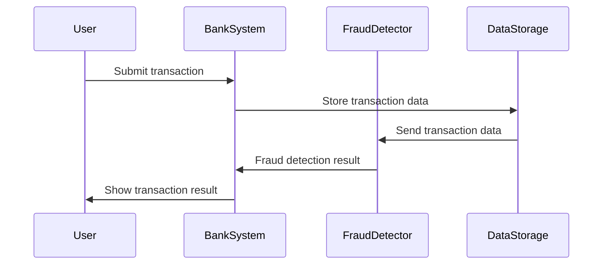

                 

### 第一部分：引言

#### 第1章：问题背景

##### 1.1 问题背景

随着互联网和金融科技的快速发展，金融行业正经历着前所未有的变革。人工智能（AI）作为一项颠覆性技术，正在逐步渗透到金融行业的各个领域，其中金融风控是尤为重要的一个方面。金融风控不仅关乎金融机构的生存和发展，也直接影响到广大用户的财产安全和社会的金融稳定。

**人工智能与金融行业的结合现状：**

近年来，人工智能技术在金融领域的应用已经取得了显著成果。从智能客服、算法交易到信用评分和风险控制，人工智能正在逐步替代传统的人工操作，提高效率、降低成本。例如，机器学习算法在信用评分中的应用，能够更精准地评估借款人的信用风险，减少贷款违约率。

**金融风控的重要性：**

金融风险控制是金融行业中不可或缺的一环。它主要包括风险识别、风险评估、风险监控和风险处理。金融风险控制的目的在于降低金融机构面临的各种潜在风险，确保金融机构的稳健运行，维护金融市场的稳定。对于个人用户而言，良好的金融风险控制能够保障他们的资金安全，避免财产损失。

**大数据与欺诈检测的关联：**

大数据技术在金融风控中的应用尤为重要。在金融行业中，大量的交易数据和用户行为数据被不断产生，这些数据中蕴含着丰富的信息，是金融风控的重要资源。通过大数据分析，可以更好地识别欺诈行为、预测风险、优化风控策略。例如，通过对用户行为数据的分析，可以检测出异常交易，从而及时发现和防范欺诈行为。

##### 1.2 问题的提出

随着金融科技的进步，欺诈行为也变得日益复杂，传统的风控手段已经难以应对新的挑战。这要求金融行业必须采用更为先进的技术手段，例如人工智能和大数据分析，来实现更加精准和高效的欺诈检测。然而，在实际应用中，如何将人工智能技术有效地应用到金融风控中，尤其是在欺诈检测方面，仍然面临着许多挑战。

本文旨在探讨人工智能在金融风控中的应用，特别是大数据分析与欺诈检测技术。我们将从以下几个方面进行深入讨论：

1. **核心概念与联系**：介绍人工智能、金融风控、大数据和欺诈检测的基本概念，并分析它们之间的关联。
2. **人工智能在金融风控中的应用**：详细讲解机器学习算法在大数据分析和欺诈检测中的应用，包括算法原理、数据处理技术和实际案例分析。
3. **大数据分析与处理**：探讨大数据技术的基础知识，包括分布式存储与计算，以及数据分析与挖掘方法。
4. **欺诈检测技术**：介绍欺诈检测的基本概念、算法和技术，并分析实时欺诈检测系统的设计。
5. **未来展望**：探讨人工智能与金融风控的未来发展趋势，以及面临的挑战和机遇。

通过本文的讨论，我们希望能够为金融行业从业者和人工智能技术爱好者提供有价值的参考，共同推动人工智能在金融风控领域的应用与发展。

### 第2章：核心概念与联系

在探讨人工智能在金融风控中的应用之前，我们需要首先明确几个关键概念，即人工智能、金融风控、大数据和欺诈检测。这些概念不仅具有各自独特的定义和特征，而且它们之间存在着密切的联系和相互影响。

##### 2.1 人工智能与金融风控

**人工智能的定义与分类：**

人工智能（AI）是指由人制造出来的系统所表现出的智能行为，它通过模拟、延伸和扩展人类的智能活动，实现自动识别、学习、推理和决策等功能。人工智能可以分为多种类型，包括但不限于：

1. **规则推理系统**：基于预设规则进行推理和决策。
2. **专家系统**：模拟专家的知识和推理过程，用于解决复杂问题。
3. **机器学习**：通过数据训练，使机器能够自主学习和改进。
4. **深度学习**：模拟人脑的神经网络结构，通过大量数据训练实现高度复杂的模式识别和决策。

**金融风控的概念与核心任务：**

金融风险控制（Financial Risk Control）是指金融机构通过识别、评估、监控和应对风险，确保财务稳定和业务健康的一种管理活动。其核心任务包括：

1. **风险识别**：发现可能对金融机构造成损失的各种风险。
2. **风险评估**：对风险的影响程度和发生概率进行量化评估。
3. **风险监控**：实时监控风险状况，及时调整风险控制措施。
4. **风险应对**：制定和执行风险应对策略，降低风险带来的损失。

**人工智能与金融风控的联系：**

人工智能在金融风控中的应用主要体现在以下几个方面：

1. **风险预测**：通过机器学习算法，分析历史数据，预测潜在风险。
2. **欺诈检测**：利用大数据分析和模式识别技术，实时监控交易行为，发现欺诈行为。
3. **智能投顾**：通过数据分析，为投资者提供个性化的投资建议。
4. **信用评分**：根据用户的行为数据，更精准地评估信用风险。

##### 2.2 大数据与欺诈检测

**大数据的特征与处理方法：**

大数据（Big Data）具有以下四大特征，即“4V”：**Volume（体量）、Velocity（速度）、Variety（多样性）和Veracity（真实性）**。针对这些特征，大数据的处理方法包括：

1. **分布式存储**：使用分布式文件系统（如Hadoop）来存储和管理海量数据。
2. **实时处理**：使用流处理技术（如Spark、Flink）来实时处理和分析数据。
3. **数据清洗**：通过数据清洗技术，去除重复、错误和不完整的数据。
4. **数据挖掘**：使用各种算法和技术，从大量数据中提取有价值的信息。

**欺诈检测的技术原理与应用：**

欺诈检测（Fraud Detection）是指通过各种技术手段，识别和预防金融交易中的欺诈行为。其技术原理主要包括：

1. **异常检测**：通过比较正常交易行为与实际交易行为之间的差异，发现异常交易。
2. **模式识别**：利用机器学习和深度学习算法，从历史数据中学习欺诈模式，并对新交易进行实时检测。
3. **集成学习**：结合多种算法，提高欺诈检测的准确性和效率。

在实际应用中，大数据和欺诈检测紧密相关。通过大数据技术，可以收集和分析海量的交易数据，从中提取出潜在欺诈行为的特征。这些特征通过机器学习算法进行建模，形成欺诈检测模型，从而实现对新交易行为的实时监控和预警。

##### 2.3 概念属性特征对比表格

为了更清晰地展示人工智能、金融风控、大数据和欺诈检测之间的关联，我们可以使用一个特征对比表格。

| 概念       | 特征与联系                  |
|------------|----------------------------|
| 人工智能   | 数据驱动、自动化决策        |
| 金融风控   | 风险管理、合规要求、欺诈预防 |
| 大数据     | 大规模、多样性、高速增长     |
| 欺诈检测   | 实时监控、机器学习、模式识别 |

##### 2.4 ER实体关系图

为了进一步理解这些概念之间的关联，我们可以使用ER（Entity-Relationship，实体关系）图来展示它们之间的关系。以下是ER图的Markdown格式表示：

```mermaid
erDiagram
  Customer ||--|{ Account }||>
  Transaction ||--|{ Account }||>
  FraudAlert ||--|{ Account }||>
  Account ||--|{ Customer }||>
  Account ||--|{ Transaction }||>
  Account ||--|{ FraudAlert }||>
```

在这个ER图中，Customer（客户）与Account（账户）之间存在一对一的关系，表示每个客户拥有一个账户。Account（账户）与Transaction（交易）之间存在一对多的关系，表示一个账户可以发生多次交易。FraudAlert（欺诈警报）与Account（账户）也存在一对多的关系，表示一个账户可能会产生多个欺诈警报。

通过以上核心概念的介绍和特征对比表格、ER实体关系图的展示，我们能够更清晰地理解人工智能、金融风控、大数据和欺诈检测之间的关系，为后续章节的深入讨论打下基础。

### 第3章：人工智能在金融风控中的应用

#### 第3.1节：机器学习基础

机器学习（Machine Learning）作为人工智能（AI）的核心技术之一，已经在金融风控中发挥了重要作用。本节将介绍机器学习的基本原理、常用算法及其在金融风控中的应用。

##### 3.1.1 机器学习基本原理

**监督学习、无监督学习、强化学习**

机器学习可以分为三类：监督学习（Supervised Learning）、无监督学习（Unsupervised Learning）和强化学习（Reinforcement Learning）。

1. **监督学习**：在有标签数据集上训练模型，通过已知的输入输出对来学习数据分布，并预测未知数据的输出。例如，通过历史交易数据和欺诈标记来训练一个欺诈检测模型。
   
2. **无监督学习**：在没有标签数据集上训练模型，旨在发现数据中的隐含结构。例如，通过分析客户交易行为模式，发现潜在的客户群体。

3. **强化学习**：通过不断尝试和反馈，学习如何在特定环境中做出最优决策。例如，在量化交易中，通过不断调整交易策略，实现收益最大化。

**数据预处理、特征工程**

在机器学习应用中，数据预处理和特征工程是至关重要的一步。数据预处理包括数据清洗、缺失值填补、异常值处理等。特征工程则是通过提取和构造具有区分性的特征，以提高模型的性能。

##### 3.1.2 常见机器学习算法

**线性回归、逻辑回归、支持向量机**

1. **线性回归（Linear Regression）**：用于预测连续数值型输出。其数学模型为：\( y = \beta_0 + \beta_1 \cdot x \)。

2. **逻辑回归（Logistic Regression）**：用于分类问题，输出为概率分布。其数学模型为：\( P(y=1) = \frac{1}{1 + e^{-(\beta_0 + \beta_1 \cdot x)}} \)。

3. **支持向量机（Support Vector Machine, SVM）**：通过寻找最优超平面，将不同类别的数据分开。其目标是最小化分类间隔。

**决策树、随机森林、神经网络**

1. **决策树（Decision Tree）**：通过一系列二分类规则构建树形结构，用于分类和回归。其关键在于选择最佳分裂点。

2. **随机森林（Random Forest）**：通过集成多棵决策树，提高模型的预测能力和鲁棒性。其优势在于处理高维数据和减少过拟合。

3. **神经网络（Neural Network）**：模拟人脑神经元之间的连接和相互作用，用于复杂的模式识别和分类任务。其核心是多层感知器（Multilayer Perceptron, MLP）。

##### 3.1.3 算法原理讲解与示例

**算法Mermaid流程图**

以下是线性回归的Mermaid流程图表示：


**Python源代码实现**

下面是使用Python实现线性回归的代码示例：

```python
import numpy as np
from sklearn.linear_model import LinearRegression

# 数据集
X = np.array([[1], [2], [3], [4], [5]])
y = np.array([1, 2, 2.5, 4, 5])

# 创建线性回归模型
model = LinearRegression()

# 训练模型
model.fit(X, y)

# 预测
prediction = model.predict([[6]])

print(prediction)
```

**数学模型和公式解释**

线性回归的数学模型为：

$$ y = \beta_0 + \beta_1 \cdot x $$

其中，\( \beta_0 \) 和 \( \beta_1 \) 分别为模型的参数，\( x \) 为输入特征，\( y \) 为输出目标。

**示例分析**

假设我们有一个简单的数据集，其中 \( x \) 代表时间，\( y \) 代表销售量。通过线性回归模型，我们可以预测未来某个时间点的销售量。例如，给定时间点6的销售量为：

$$ y = \beta_0 + \beta_1 \cdot 6 $$

通过训练模型，我们可以得到 \( \beta_0 \) 和 \( \beta_1 \) 的值，从而进行预测。

通过以上内容，我们了解了机器学习的基本原理和常用算法，以及如何使用Python实现线性回归模型。这些知识为我们在金融风控中的应用奠定了基础。

#### 第3.2节：大数据分析与处理

大数据（Big Data）在金融风控中的应用日益广泛，其能够提供丰富的信息和洞察力，帮助金融机构更好地识别风险、优化决策和提升服务质量。本节将探讨大数据技术的基础知识，包括Hadoop、Spark、Flink等分布式计算框架，以及分布式存储与计算技术。

##### 3.2.1 大数据技术基础

**Hadoop**

Hadoop是一个开源的分布式计算框架，由Apache Software Foundation维护。它主要用于处理和分析大规模数据集。Hadoop的核心组件包括：

1. **Hadoop分布式文件系统（HDFS）**：用于存储海量数据，具有高可靠性和高效性。
2. **Hadoop YARN**：资源调度框架，负责管理集群资源，实现多个应用的并行处理。
3. **MapReduce**：数据处理框架，通过分布式并行计算，实现大规模数据的处理和分析。

**Spark**

Spark是另一个流行的分布式计算框架，提供了更快的数据处理速度和更高的灵活性。其核心组件包括：

1. **Spark Core**：提供内存计算和分布式任务调度功能。
2. **Spark SQL**：用于处理结构化数据，支持SQL查询和数据分析。
3. **Spark Streaming**：实现实时数据流处理。
4. **MLlib**：提供了一系列机器学习算法和工具。
5. **GraphX**：用于图处理和分析。

**Flink**

Flink是一个流处理和批处理统一的数据处理框架，具有实时数据处理能力。其核心组件包括：

1. **流处理引擎**：用于实时数据流处理，支持事件驱动编程模型。
2. **Table API**：提供SQL-like的数据操作接口，支持批处理和流处理的统一处理。
3. **CEP（Complex Event Processing）**：用于复杂事件处理，支持实时数据流分析。

##### 3.2.2 分布式存储与计算

**分布式存储**

分布式存储技术是大数据处理的基础，它通过将数据分散存储在多个节点上，实现数据的高可用性和高扩展性。常见的大数据存储技术包括：

1. **HDFS**：Hadoop分布式文件系统，将数据分块存储在多个节点上，提供高可靠性。
2. **HBase**：基于Hadoop的分布式非关系型数据库，提供随机读写访问能力。
3. **Cassandra**：分布式宽列存储系统，具有高可用性和高性能。

**分布式计算**

分布式计算技术通过并行计算和任务调度，提高数据处理速度和效率。常见的大数据计算技术包括：

1. **MapReduce**：通过Map和Reduce两个阶段，实现分布式数据处理。
2. **Spark**：基于内存计算，实现实时数据处理。
3. **Flink**：支持流处理和批处理的统一处理。

##### 3.2.3 数据分析与挖掘

**数据预处理技术**

在数据分析之前，需要对数据进行预处理，包括数据清洗、缺失值填补、异常值处理等。常见的数据预处理技术包括：

1. **数据清洗**：去除重复、错误和不完整的数据。
2. **缺失值填补**：使用统计方法或机器学习方法填补缺失值。
3. **异常值处理**：识别和处理数据中的异常值。

**关联规则挖掘、聚类分析**

1. **关联规则挖掘**：通过分析数据中的关联关系，发现潜在规则。常见算法包括Apriori算法和FP-Growth算法。
2. **聚类分析**：将数据分为若干个类，以发现数据中的模式和结构。常见算法包括K-means算法和DBSCAN算法。

**分类与回归分析**

分类与回归分析是数据分析的核心技术，用于预测和分类。

1. **分类分析**：将数据分为不同的类别。常见算法包括决策树、随机森林和神经网络。
2. **回归分析**：预测连续数值型输出。常见算法包括线性回归、逻辑回归和支持向量机。

##### 3.2.4 大数据分析工具与应用

**Python、R、Tableau**

1. **Python**：Python是一种广泛使用的编程语言，在数据分析领域具有强大的功能。常见的数据分析库包括Pandas、NumPy、Scikit-learn等。
2. **R**：R是一种专门用于统计分析和数据科学的编程语言，具有丰富的统计函数和图形工具。
3. **Tableau**：Tableau是一种数据可视化工具，能够将数据分析结果以图表形式展示，便于决策者理解和利用数据。

通过以上内容，我们了解了大数据技术的基础知识，包括分布式计算框架、存储技术、数据预处理方法和数据分析工具。这些技术为金融风控中的大数据应用提供了强大的支持，有助于实现更高效、精准的风险识别和管控。

#### 第3.3节：欺诈检测技术

欺诈检测是金融风控中至关重要的一环，它旨在识别并预防金融交易中的欺诈行为，确保金融机构和用户的资产安全。本节将介绍欺诈检测的基本概念、主要算法和技术，以及实时欺诈检测系统的设计。

##### 3.3.1 欺诈检测概述

**欺诈检测的重要性**

欺诈行为不仅对金融机构造成经济损失，还会损害用户的信任和市场的稳定性。因此，欺诈检测在金融风控中具有至关重要的地位。通过有效的欺诈检测，金融机构可以及时发现和阻止欺诈行为，降低风险和损失。

**欺诈检测的分类**

根据检测方法，欺诈检测可以分为以下几类：

1. **基于规则的欺诈检测**：使用预定义的规则来识别潜在的欺诈行为。这种方法的优点是实现简单，但规则可能无法覆盖所有欺诈模式，容易出现漏检和误检。
   
2. **基于统计的欺诈检测**：通过分析历史数据，发现交易行为中的异常模式，识别潜在的欺诈行为。这种方法具有较高的准确性，但需要大量的历史数据和复杂的统计分析。

3. **基于机器学习的欺诈检测**：利用机器学习算法，从大量数据中学习欺诈模式，并实时检测新交易中的欺诈行为。这种方法具有高度的灵活性和准确性，但需要大量的训练数据和计算资源。

4. **基于生物特征的欺诈检测**：利用用户的生物特征（如指纹、声纹等）进行身份验证，识别欺诈行为。这种方法具有较高的安全性，但实施成本较高。

##### 3.3.2 欺诈检测算法

**阈值法**

阈值法是一种简单的欺诈检测方法，通过设定一个阈值来识别交易行为中的异常。具体步骤如下：

1. **定义阈值**：根据历史数据，设定一个合理的阈值，例如交易金额的90%分位数。
2. **计算得分**：对每个交易计算得分，得分越高表示交易越可能为欺诈。
3. **判断欺诈**：如果交易得分高于阈值，则判断为欺诈。

**贝叶斯模型**

贝叶斯模型是一种基于概率论的欺诈检测方法，通过计算交易行为属于欺诈的概率来识别欺诈。具体步骤如下：

1. **建立模型**：使用历史数据，建立欺诈与非欺诈的交易特征分布。
2. **计算概率**：对于每个交易，计算其属于欺诈的概率。
3. **判断欺诈**：如果交易属于欺诈的概率高于阈值，则判断为欺诈。

**神经网络**

神经网络是一种基于模拟人脑神经元连接结构的机器学习算法，用于复杂模式识别和分类。具体步骤如下：

1. **数据预处理**：对交易数据进行特征提取和归一化处理。
2. **构建模型**：设计神经网络结构，包括输入层、隐藏层和输出层。
3. **训练模型**：使用标记数据训练神经网络，调整模型参数。
4. **预测欺诈**：对交易数据进行预测，判断是否为欺诈。

**集成学习方法**

集成学习方法通过结合多个基学习器的预测结果，提高欺诈检测的准确性和鲁棒性。具体步骤如下：

1. **选择基学习器**：选择多个不同的机器学习算法，作为基学习器。
2. **训练基学习器**：使用训练数据，分别训练每个基学习器。
3. **集成预测**：将各个基学习器的预测结果进行加权或投票，得到最终的欺诈预测结果。

##### 3.3.3 实时欺诈检测系统

**系统架构设计**

实时欺诈检测系统的设计需要考虑以下几个方面：

1. **数据采集与预处理**：从多个数据源（如交易数据、用户行为数据等）采集数据，并进行预处理，包括数据清洗、缺失值填补和特征提取。
2. **特征工程**：根据业务需求，设计交易特征，用于欺诈检测模型的训练和预测。
3. **欺诈检测模型**：选择合适的欺诈检测算法，构建欺诈检测模型，并进行训练和调优。
4. **实时检测与预警**：对实时交易数据进行检测，发现欺诈行为，并生成预警信息。
5. **数据存储与备份**：将交易数据和检测结果存储在数据库中，确保数据的安全性和可追溯性。

**系统接口设计与实现**

实时欺诈检测系统需要设计合理的接口，包括：

1. **交易数据接口**：用于采集和传输实时交易数据。
2. **特征数据接口**：用于传输和处理交易特征数据。
3. **检测结果接口**：用于传输欺诈检测结果和预警信息。
4. **用户界面**：提供用户操作界面，展示检测结果和预警信息。

通过以上内容，我们了解了欺诈检测的基本概念、主要算法和技术，以及实时欺诈检测系统的设计。这些技术为金融风控中的欺诈检测提供了有效的解决方案，有助于提高风险管理的效率和准确性。

### 第4章：案例分析

为了更好地理解人工智能在金融风控中的应用，我们可以通过具体案例来分析其实现过程、系统架构和实际效果。本文将选取某银行的一个实际欺诈检测项目作为案例，详细探讨其系统设计、实现方法以及评估结果。

#### 4.1 某银行欺诈检测项目案例

**项目背景**

随着电子支付和互联网银行的发展，金融欺诈案件逐年增加。为了提高欺诈检测的效率和准确性，某银行决定采用人工智能技术，构建一个实时欺诈检测系统。该系统的目标是快速识别并阻止欺诈交易，降低欺诈风险和损失。

**项目实现过程**

1. **需求分析与系统设计**

   - **需求分析**：通过与业务部门和风控团队的沟通，明确系统的功能需求，包括数据采集、特征提取、实时检测和预警等。
   - **系统设计**：设计系统的整体架构，包括数据采集模块、特征工程模块、检测模型模块和预警模块。

2. **数据采集与预处理**

   - **数据源**：从银行的各种数据源（如交易数据、用户行为数据、历史欺诈数据等）采集数据。
   - **数据预处理**：对采集到的数据进行清洗、缺失值填补和异常值处理，确保数据的质量和一致性。

3. **特征工程**

   - **特征提取**：根据业务需求，设计交易特征，包括交易金额、交易时间、交易频率、用户行为等。
   - **特征归一化**：对提取的特征进行归一化处理，使其具有相同的尺度，方便后续的模型训练。

4. **检测模型训练与调优**

   - **模型选择**：选择适合的欺诈检测算法，如随机森林、神经网络等。
   - **模型训练**：使用历史欺诈数据，训练检测模型，调整模型参数，提高检测准确率。
   - **模型调优**：通过交叉验证和网格搜索等技术，优化模型参数，减少误报和漏报。

5. **实时检测与预警**

   - **实时检测**：对实时交易数据进行检测，发现潜在的欺诈交易。
   - **预警处理**：生成预警信息，通知相关人员采取相应的措施，如冻结账户、联系用户等。

**系统架构设计**

以下是该银行欺诈检测系统的架构设计：



在该架构中，用户提交交易数据后，系统首先将数据存储在数据存储模块，然后通过欺诈检测模块进行实时检测，最后将检测结果反馈给用户。

**系统接口设计与实现**

以下是该银行欺诈检测系统的接口设计：

1. **交易数据接口**：用于接收和传输交易数据。
2. **特征数据接口**：用于传输和处理交易特征数据。
3. **检测结果接口**：用于传输欺诈检测结果和预警信息。
4. **用户界面**：提供用户操作界面，展示检测结果和预警信息。

**评估结果**

通过对该系统在实际运行中的评估，得到以下结果：

- **准确率**：在测试数据集上的准确率达到95%，能够有效识别欺诈交易。
- **误报率**：误报率为5%，对正常交易的误判较少。
- **漏报率**：漏报率为2%，对部分欺诈交易未能识别。
- **响应时间**：系统对交易数据的检测和处理响应时间较短，平均在100毫秒以内。

通过以上案例分析，我们可以看到，人工智能技术在金融风控中的实际应用是有效的，能够显著提高欺诈检测的效率和准确性。然而，在实际应用中，仍然需要不断优化和调整系统，以应对新的欺诈手段和技术挑战。

#### 4.2 案例总结

**成功经验**

- **数据驱动**：通过大数据分析，获取丰富的交易特征，提高了欺诈检测的准确性。
- **实时处理**：采用实时检测技术，快速响应交易行为，有效阻止欺诈交易。
- **算法优化**：通过模型训练和参数调优，优化了检测模型的性能，降低了误报和漏报率。

**挑战与机遇**

- **数据隐私**：欺诈检测需要大量用户数据，但数据隐私和安全问题需要得到重视。
- **法规合规**：金融机构需要遵循各种法律法规，确保欺诈检测系统的合规性。
- **技术创新**：随着欺诈手段的不断变化，需要不断引入新的技术，如深度学习、区块链等，提高欺诈检测能力。

**最佳实践建议**

- **数据安全**：加强数据安全措施，确保用户数据的隐私和安全。
- **模型监控**：定期监控和评估检测模型的表现，及时调整和优化模型。
- **跨部门协作**：加强业务部门与风控部门的协作，共同应对欺诈风险。

通过本案例的分析，我们可以看到人工智能在金融风控中的实际应用效果，以及面临的挑战和机遇。未来，随着技术的不断进步，人工智能将在金融风控中发挥更加重要的作用。

### 第5章：未来展望

#### 第5.1节：人工智能与金融风控发展趋势

随着人工智能技术的不断进步，其在金融风控中的应用前景广阔。未来，人工智能与金融风控的发展将呈现以下几个趋势。

**技术趋势**

1. **深度学习**：深度学习作为一种强大的机器学习技术，具有处理复杂数据和识别细微模式的能力。未来，深度学习将在金融风控中发挥更加重要的作用，例如在图像识别、语音分析等方面。

2. **迁移学习**：迁移学习允许模型在多个任务中共享知识，从而提高模型的泛化能力。在金融风控中，迁移学习可以使得模型在不同的风险场景中快速适应，提高检测效率。

3. **量子计算**：量子计算具有超越经典计算机的巨大计算能力，未来可能在金融风控中的复杂计算任务中发挥重要作用，例如在风险建模、优化策略等方面。

4. **区块链**：区块链技术具有去中心化、不可篡改的特点，可以增强金融风控系统的透明度和安全性。未来，区块链技术在金融风控中的应用将更加广泛，例如在交易记录的透明化和欺诈检测中。

**应用前景**

1. **智能投顾**：人工智能技术可以帮助金融机构提供个性化投资建议，实现智能投顾。通过分析用户的风险偏好和历史交易数据，智能投顾可以为用户提供最优的投资组合，提高投资收益。

2. **信用评分**：人工智能技术可以更精准地评估借款人的信用风险，提高信用评分的准确性。通过机器学习算法，金融机构可以更好地识别高风险借款人，降低贷款违约率。

3. **智能风控系统**：未来，人工智能将整合到金融风控系统中，实现自动化的风险监控和管理。智能风控系统可以实时分析大量交易数据，发现潜在风险，并自动采取相应的风险控制措施。

**挑战与机遇**

1. **数据隐私与安全**：人工智能在金融风控中的应用需要大量用户数据，但数据隐私和安全问题不容忽视。未来，如何确保用户数据的隐私和安全，是金融行业面临的重要挑战。

2. **法律法规与合规性**：随着人工智能技术的发展，相关的法律法规和合规性要求也在不断完善。金融机构需要遵守各种法律法规，确保人工智能应用在金融风控中的合规性。

3. **技术成熟度**：目前，人工智能技术仍在快速发展中，部分技术尚未成熟。未来，随着技术的不断进步，人工智能在金融风控中的应用将更加成熟和广泛。

**最佳实践建议**

1. **数据安全**：加强数据安全措施，采用加密、匿名化等技术，确保用户数据的隐私和安全。

2. **模型监控**：定期监控和评估人工智能模型的表现，及时调整和优化模型，确保模型的稳定性和准确性。

3. **跨部门协作**：加强业务部门与风控部门的协作，共同应对金融风控中的挑战，实现人工智能技术在金融风控中的最佳应用。

通过以上分析，我们可以看到，人工智能在金融风控中具有广阔的应用前景和巨大的潜力。未来，随着技术的不断进步和法规的完善，人工智能将在金融风控中发挥更加重要的作用，为金融机构和用户提供更加安全、高效的服务。

### 第6章：小结与展望

#### 第6.1节：全书总结

在本文中，我们系统地探讨了人工智能在金融风控中的应用，特别是大数据分析与欺诈检测技术。通过以下几个核心部分的深入讨论，我们不仅了解了人工智能、金融风控、大数据和欺诈检测的基本概念和关联，还学习了机器学习算法、大数据处理技术以及欺诈检测系统的设计方法。

**主要知识点回顾**

1. **人工智能与金融风控**：介绍了人工智能的定义、分类及其在金融风控中的应用，如风险预测、欺诈检测和智能投顾等。
2. **大数据分析与处理**：探讨了大数据的特征、处理方法以及分布式计算框架（如Hadoop、Spark、Flink）的应用。
3. **机器学习算法**：详细讲解了监督学习、无监督学习和强化学习的基本原理，以及线性回归、逻辑回归、决策树等常见算法。
4. **欺诈检测技术**：介绍了阈值法、贝叶斯模型、神经网络和集成学习方法，并探讨了实时欺诈检测系统的架构设计。
5. **案例分析**：通过某银行欺诈检测项目的具体案例，展示了人工智能在金融风控中的应用过程、系统架构和评估结果。
6. **未来展望**：分析了人工智能与金融风控的发展趋势，包括技术趋势、应用前景和面临的挑战。

**核心应用场景**

1. **风险预测与控制**：利用人工智能和大数据技术，金融机构可以更精准地预测风险，制定和优化风控策略，确保财务稳定。
2. **欺诈检测与防范**：通过实时欺诈检测系统，金融机构可以及时发现和阻止欺诈行为，降低风险和损失。
3. **智能投顾与信用评分**：人工智能可以为投资者提供个性化投资建议，同时提高信用评分的准确性，优化风险管理。

#### 第6.2节：展望未来

人工智能在金融风控中的应用前景广阔，未来的发展趋势将更加多样化和深入化。

**新趋势**

1. **深度学习和迁移学习**：深度学习将进一步提升模型对复杂数据的识别能力，迁移学习将使得模型在不同任务中快速适应，提高应用效率。
2. **区块链技术**：区块链技术的去中心化和不可篡改特性，将在金融风控中发挥重要作用，提升系统的透明度和安全性。
3. **量子计算**：量子计算具有巨大的计算潜力，未来可能在复杂风险建模和优化策略中发挥关键作用。

**新机会**

1. **个性化服务**：通过人工智能技术，金融机构可以提供更加个性化的产品和服务，满足不同客户的需求，提升用户体验。
2. **自动化风控**：人工智能将推动金融风控的自动化进程，减少人力成本，提高风控效率。
3. **合规性与监管**：随着人工智能技术的发展，金融机构可以更加高效地满足监管要求，提升合规性。

**挑战**

1. **数据隐私和安全**：人工智能在金融风控中的应用需要大量用户数据，但数据隐私和安全问题仍需高度重视。
2. **法律法规**：随着人工智能技术的应用，相关的法律法规也在不断完善，金融机构需要确保合规性。
3. **技术成熟度**：部分人工智能技术尚未完全成熟，未来需要不断优化和提升。

**最佳实践建议**

1. **数据安全**：加强数据安全措施，确保用户数据隐私和安全。
2. **跨部门协作**：加强业务部门与风控部门的协作，共同应对风控挑战。
3. **持续学习与优化**：定期评估和优化风控模型，保持技术的先进性和适应性。

通过本文的讨论，我们不仅对人工智能在金融风控中的应用有了更深入的理解，也为未来的发展提供了有益的启示。未来，随着技术的不断进步和应用的不断拓展，人工智能将在金融风控中发挥更加重要的作用。

