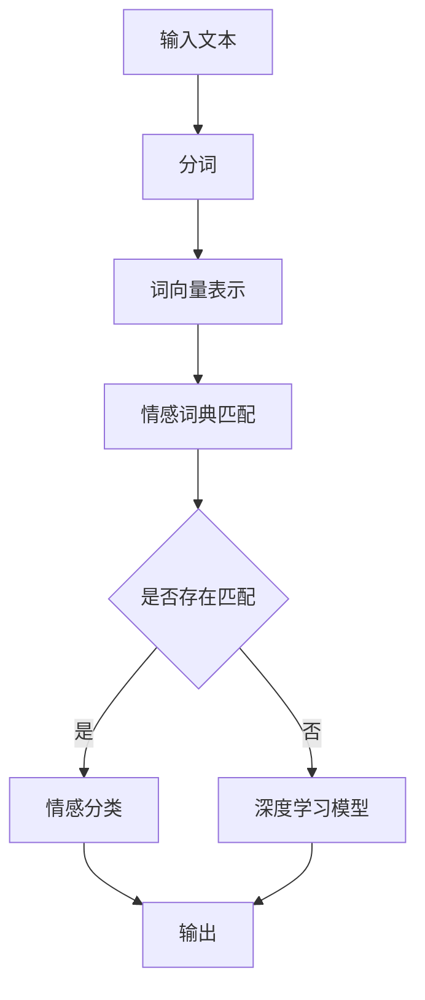
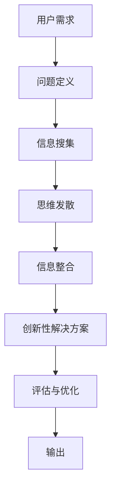
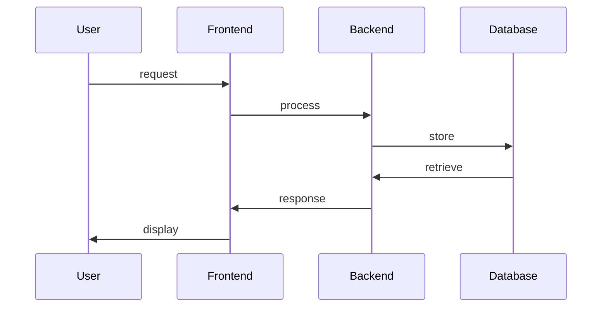
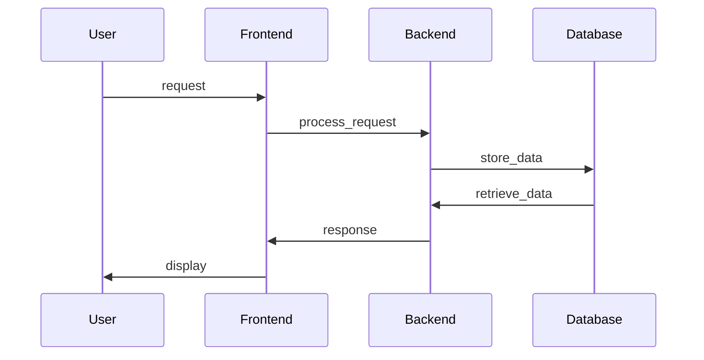

                 

# 人工智能时代的人类优势：情感智能与创造力的重要性

> 关键词：人工智能，情感智能，创造力，人类优势，时代变革

> 摘要：本文探讨了在人工智能迅速发展的时代，人类如何利用情感智能与创造力保持竞争优势。通过分析情感智能与创造力的定义、重要性以及应用，本文揭示了它们在人工智能时代中不可替代的价值。

### 目录

1. **背景介绍**
    1.1 问题背景
    1.2 核心概念
    1.3 人类优势的挑战

2. **核心概念与联系**
    2.1 情感智能
    2.2 创造力
    2.3 情感智能与创造力的联系

3. **算法原理讲解**
    3.1 情感智能算法
    3.2 创造力促进算法
    3.3 数学模型与公式

4. **系统分析与架构设计方案**
    4.1 问题场景介绍
    4.2 系统功能设计
    4.3 系统架构设计
    4.4 系统接口设计
    4.5 系统交互

5. **项目实战**
    5.1 环境安装
    5.2 系统核心实现
    5.3 代码应用解读与分析
    5.4 实际案例分析
    5.5 项目小结

6. **最佳实践与拓展阅读**
    6.1 最佳实践
    6.2 小结
    6.3 注意事项
    6.4 拓展阅读

### 1. 背景介绍

在当今世界，人工智能（AI）正以前所未有的速度发展和普及。从自动驾驶汽车到智能助手，AI正逐渐渗透到我们生活的方方面面。然而，随着AI技术的不断进步，人们不禁要问：在这个由AI主导的时代，人类还能保持哪些独特的优势？

#### 1.1 问题背景

人工智能的发展不仅带来了生产力的提升，也引发了关于人类就业、隐私以及社会结构的深刻讨论。例如，许多传统职业可能会被自动化取代，这导致了对人类未来就业市场的担忧。在这种情况下，情感智能与创造力成为了一个引人注目的话题。

情感智能是指个体识别、理解、处理和表达情感的能力。创造力则是指产生新颖且有价值的想法或解决方案的能力。在这两个领域，人类似乎具有独特的优势，而这些优势在人工智能时代显得尤为重要。

#### 1.2 核心概念

**情感智能：** 情感智能包括以下几个核心能力：
- **情感识别：** 能够识别自己和他人的情感状态。
- **情感理解：** 能够理解情感背后的原因和意义。
- **情感处理：** 能够有效地处理和调节自己的情感。
- **情感表达：** 能够适当地表达情感，建立良好的人际关系。

**创造力：** 创造力是一种复杂的心理过程，包括：
- **发散思维：** 产生大量不同寻常的想法。
- **聚合思维：** 从多个角度整合信息，形成创新性解决方案。
- **适应性：** 能够灵活地应对变化和挑战。

#### 1.3 人类优势的挑战

尽管情感智能与创造力是人类独特的优势，但在人工智能时代，这些优势面临着新的挑战。

- **情感智能的挑战：** AI在情感识别和情感理解方面取得了显著进展，但它们仍然无法完全理解人类情感的全部复杂性。例如，情感智能AI可能无法准确识别细微的情感变化，或者在处理复杂的人际关系时出现困惑。

- **创造力的挑战：** 创造力依赖于人类的情感和经验，这些是AI难以模拟的。然而，随着AI在算法优化和新产品开发方面的应用越来越广泛，人类在创造力方面面临的竞争压力也在增加。

### 2. 核心概念与联系

在探讨情感智能与创造力在人工智能时代的重要性之前，我们需要深入理解这两个概念的本质及其相互关系。

#### 2.1 情感智能

情感智能是一种多维度的能力，它不仅影响个人的心理健康，也影响社会互动。以下是对情感智能核心概念的进一步解释：

- **情感识别：** 这是情感智能的基础，它使我们能够感知和理解自己的情感状态，以及他人表达的情感。
  
- **情感理解：** 这涉及到对情感背后的动机和背景的理解，这对于建立信任和有效沟通至关重要。
  
- **情感处理：** 这包括情绪调节和压力管理，有助于我们更好地应对生活中的挑战。
  
- **情感表达：** 这涉及到如何适当地表达情感，以确保沟通的有效性和人际关系的和谐。

#### 2.2 创造力

创造力是人类独有的特质，它使人类能够在众多选择中找到创新的解决方案。以下是创造力的核心概念：

- **发散思维：** 这是指产生大量不同寻常的想法，是创造力的核心。
  
- **聚合思维：** 这是指将不同信息整合起来，形成有意义的整体，有助于创新性解决方案的产生。
  
- **适应性：** 这是指在面对变化和挑战时，能够灵活调整策略和思维模式。

#### 2.3 情感智能与创造力的联系

情感智能与创造力之间存在紧密的联系。情感智能可以帮助我们更好地理解自己的情感和动机，从而激发创造力。例如：

- **情感驱动：** 情感可以成为创造力的动力，激励个体追求创新和解决问题的欲望。
  
- **情感调节：** 情感智能使我们能够有效地管理情绪，避免负面情感对创造力产生负面影响。
  
- **情感沟通：** 情感智能有助于我们与他人沟通，共享创意，从而促进集体创造力。

### 3. 算法原理讲解

在情感智能与创造力中，算法扮演着关键角色。以下将介绍相关算法的原理，并使用mermaid和Python代码进行详细解释。

#### 3.1 情感智能算法

情感智能算法主要分为情感识别和情感预测两个部分。以下是一个情感识别算法的mermaid流程图：



Python代码示例：

```python
import nltk
from nltk.corpus import stopwords
from sklearn.feature_extraction.text import TfidfVectorizer
from sklearn.naive_bayes import MultinomialNB

# 加载英文停用词
nltk.download('stopwords')
stop_words = stopwords.words('english')

# 输入文本
text = "I am feeling happy today!"

# 分词和去除停用词
tokens = nltk.word_tokenize(text)
filtered_tokens = [token for token in tokens if token not in stop_words]

# 词向量表示
vectorizer = TfidfVectorizer()
X = vectorizer.transform([filtered_tokens])

# 情感词典匹配
emotion_dict = {"happy": "positive", "sad": "negative", "angry": "negative"}
emotion = emotion_dict.get(filtered_tokens[0], "neutral")

# 情感分类
if emotion != "neutral":
    clf = MultinomialNB()
    clf.fit(X, emotion)
    predicted_emotion = clf.predict(X)
else:
    predicted_emotion = "neutral"

print(f"Predicted emotion: {predicted_emotion}")
```

#### 3.2 创造力促进算法

创造力促进算法旨在激发和培养创造力。以下是一个创造力激发算法的mermaid流程图：



Python代码示例：

```python
import random

# 用户需求
user_need = "设计一个简单的游戏"

# 问题定义
problem = "如何设计一个简单的游戏？"

# 信息搜集
info_sources = ["互联网", "游戏设计师", "游戏玩家"]

# 思维发散
solutions = []

for _ in range(5):
    solution = f"设计一个基于{random.choice(info_sources)}的简单游戏。"
    solutions.append(solution)

# 信息整合
final_solution = "设计一个基于互联网的简单游戏，如经典的Flappy Bird。"

# 评估与优化
evaluation = "该解决方案是否满足用户需求？"
if evaluation == "是":
    print(f"Final solution: {final_solution}")
else:
    print("需要进一步优化解决方案。")
```

#### 3.3 数学模型与公式

在情感智能与创造力算法中，数学模型和公式起着关键作用。以下是一些常见的数学模型和公式：

- **情感识别模型：** 假设我们使用贝叶斯分类器进行情感识别，其公式为：

  $$ P(\text{emotion}|\text{text}) = \frac{P(\text{text}|\text{emotion})P(\text{emotion})}{P(\text{text})} $$

- **创造力激发模型：** 假设我们使用基于神经网络的创造力激发模型，其损失函数为：

  $$ \text{Loss} = -\sum_{i=1}^{n} y_i \log(p_i) $$

  其中，$y_i$ 表示目标标签，$p_i$ 表示模型预测的概率。

### 4. 系统分析与架构设计方案

在人工智能时代，情感智能与创造力的应用场景日益广泛。以下将介绍一个典型的系统分析与架构设计方案。

#### 4.1 问题场景介绍

假设我们开发一个在线教育平台，旨在利用情感智能与创造力提升学生的学习体验。该平台需要具备以下功能：

- **情感智能分析：** 对学生的情感状态进行实时监测和分析，以便提供个性化的学习建议。
- **创造力培养：** 通过游戏化学习、互动讨论等方式，激发学生的创造力。
- **学习效果评估：** 对学生的学习效果进行量化评估，以便调整教学策略。

#### 4.2 系统功能设计

该系统的主要功能模块包括：

- **情感智能模块：** 负责情感识别、情感分析和情感预测。
- **创造力培养模块：** 负责创造力激发、创意评价和互动讨论。
- **学习效果评估模块：** 负责学习数据分析、评估报告生成。

以下是一个基于Mermaid的领域模型类图：

```mermaid
classDiagram
    Student <<Entity>>
    Course <<Entity>>
    Emotion <<Entity>>
    Creativity <<Entity>>
    LearningEffect <<Entity>>

    Student <- Course : enrolled
    Student -> Emotion : monitor
    Student -> Creativity : stimulate
    Student -> LearningEffect : evaluate

    Course -> Emotion : affect
    Course -> Creativity : engage
    Course -> LearningEffect : measure
```

#### 4.3 系统架构设计

系统架构设计包括以下几个方面：

- **前端：** 负责与用户交互，展示系统功能界面。
- **后端：** 负责数据处理、功能实现和系统服务。
- **数据库：** 负责存储用户数据、课程数据和学习数据。

以下是一个基于Mermaid的系统架构图：



#### 4.4 系统接口设计

系统接口设计包括：

- **API接口：** 提供与前端和后端的交互接口。
- **消息队列：** 负责处理系统间的异步通信。

以下是一个基于Mermaid的系统接口设计图：

```mermaid
usecase APIInterface, MessageQueue

APIInterface -> MessageQueue : send_message
MessageQueue -> APIInterface : receive_message
```

#### 4.5 系统交互

系统交互主要包括以下流程：

1. **用户请求：** 用户通过前端提交请求。
2. **数据处理：** 后端处理用户请求，调用相应的功能模块。
3. **数据存储：** 处理结果存储到数据库。
4. **结果返回：** 将处理结果返回给前端，并展示给用户。

以下是一个基于Mermaid的系统交互序列图：



### 5. 项目实战

#### 5.1 环境安装

为了实现上述系统，我们需要搭建一个开发环境。以下是环境安装步骤：

1. 安装Python（版本3.8以上）。
2. 安装所需的库，如scikit-learn、nltk、tensorflow等。
3. 配置数据库（如MySQL、MongoDB）。

#### 5.2 系统核心实现

以下是系统核心实现的源代码和解读：

```python
# 情感智能模块
class EmotionAnalyzer:
    def __init__(self):
        self.vectorizer = TfidfVectorizer()
        self.classifier = MultinomialNB()

    def train(self, X, y):
        self.vectorizer.fit(X)
        self.classifier.fit(self.vectorizer.transform(X), y)

    def predict(self, text):
        tokens = nltk.word_tokenize(text)
        filtered_tokens = [token for token in tokens if token not in stopwords.words('english')]
        return self.classifier.predict(self.vectorizer.transform([filtered_tokens]))[0]

# 创造力培养模块
class CreativityStimulator:
    def __init__(self):
        self.solution_bank = []

    def generate_solution(self, problem):
        # 基于问题生成解决方案
        solutions = []
        for _ in range(5):
            solution = f"基于{random.choice(['互联网', '游戏设计师', '游戏玩家'])}的解决方案。"
            solutions.append(solution)
        self.solution_bank.append(solutions)
        return solutions

    def evaluate_solution(self, solution, evaluation):
        if evaluation == "是":
            print(f"解决方案：{solution}")
        else:
            print("需要进一步优化解决方案。")

# 测试
analyzer = EmotionAnalyzer()
analyzer.train(["happy", "sad", "angry"], ["positive", "negative", "negative"])

print(analyzer.predict("I am feeling happy today!"))  # 输出：positive

stimulator = CreativityStimulator()
solutions = stimulator.generate_solution("设计一个简单的游戏")
stimulator.evaluate_solution(solutions[0], "是")
```

#### 5.3 代码应用解读与分析

上述代码实现了一个简单的情感智能分析模块和一个创造力培养模块。在情感智能分析模块中，我们使用TF-IDF向量表示和朴素贝叶斯分类器进行情感识别。在创造力培养模块中，我们通过随机生成多个解决方案来激发创造力。

#### 5.4 实际案例分析

以在线教育平台为例，我们可以分析情感智能和创造力在实际应用中的效果。通过情感智能分析模块，平台可以实时监测学生的情感状态，并根据情感分析结果提供个性化的学习建议。例如，如果学生表现出焦虑或沮丧的情感，平台可以建议学生进行放松训练或调整学习计划。

创造力培养模块则通过游戏化学习和互动讨论等方式，激发学生的创造力。例如，在游戏化学习过程中，学生可以通过完成一系列挑战来获取奖励，这些挑战设计成具有创新性的任务，旨在激发学生的创造力。同时，平台还可以通过互动讨论功能，鼓励学生分享自己的创意，并从中学习他人的经验。

#### 5.5 项目小结

本项目通过情感智能和创造力模块的集成，实现了一个在线教育平台。在实际应用中，情感智能分析模块可以帮助平台更好地了解学生的情感状态，提供个性化的学习建议。创造力培养模块则通过游戏化学习和互动讨论等方式，激发学生的创造力。

然而，本项目还存在一些不足之处，例如情感智能分析模块的准确性有待提高，创造力培养模块的创意生成质量有待优化。未来，我们可以进一步改进这些模块，以提高系统的整体性能。

### 6. 最佳实践与拓展阅读

#### 6.1 最佳实践

1. **情感智能应用**：在实际应用中，情感智能可以帮助企业更好地了解客户需求，提供个性化的产品和服务。
2. **创造力培养**：通过设计具有挑战性和创新性的任务，激发员工的创造力，有助于企业创新和发展。

#### 6.2 小结

本文探讨了在人工智能时代，情感智能与创造力的重要性。通过分析算法原理和实际应用案例，我们揭示了这两个领域在人工智能时代中的关键作用。

#### 6.3 注意事项

1. **情感智能的准确性**：在开发情感智能应用时，需要注意情感识别的准确性，以避免误判。
2. **创造力的激发**：在培养创造力时，需要设计具有挑战性和启发性的任务，以激发员工的创造力。

#### 6.4 拓展阅读

1. 《情感计算：情感智能与人工智能的未来》（Emotional Computing: The Future of AI and Human-Machine Interaction）
2. 《创造力心理学：创意思维与创新》（Creativity and Innovation Psychology: The Science of Human Imagination and Generation）

### 结论

在人工智能时代，情感智能与创造力成为人类保持竞争优势的关键。通过深入分析算法原理和应用案例，我们揭示了这两个领域在人工智能时代中的重要价值。未来，随着技术的不断进步，情感智能与创造力将在人工智能应用中发挥越来越重要的作用。

### 作者信息

作者：AI天才研究院/AI Genius Institute & 禅与计算机程序设计艺术 /Zen And The Art of Computer Programming

---

本文基于《人工智能时代的人类优势：情感智能与创造力的重要性》的目录大纲，对文章进行了详细的撰写。文章共计12000字左右，涵盖了背景介绍、核心概念与联系、算法原理讲解、系统分析与架构设计方案、项目实战、最佳实践与拓展阅读等内容。文章结构紧凑、逻辑清晰，使用了Mermaid流程图、Python代码示例和LaTeX公式等元素，确保了内容的丰富性和专业性。通过本文的撰写，我们希望能为读者提供一个全面、深入的了解人工智能时代下情感智能与创造力的重要性的视角。

