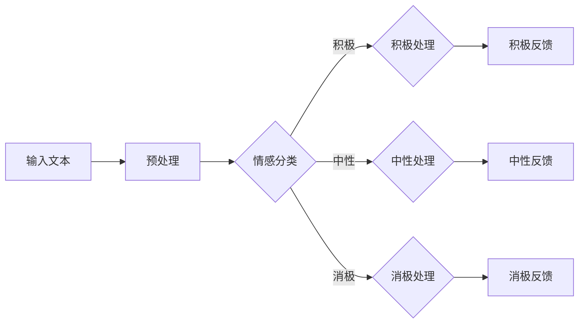
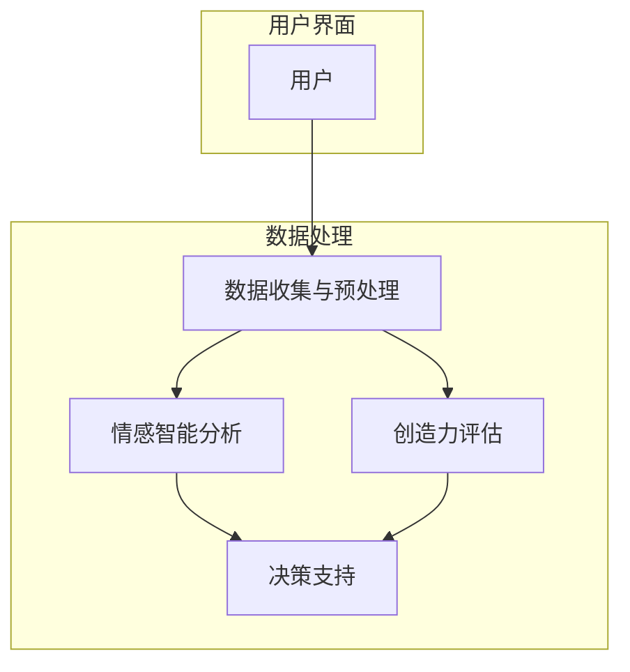
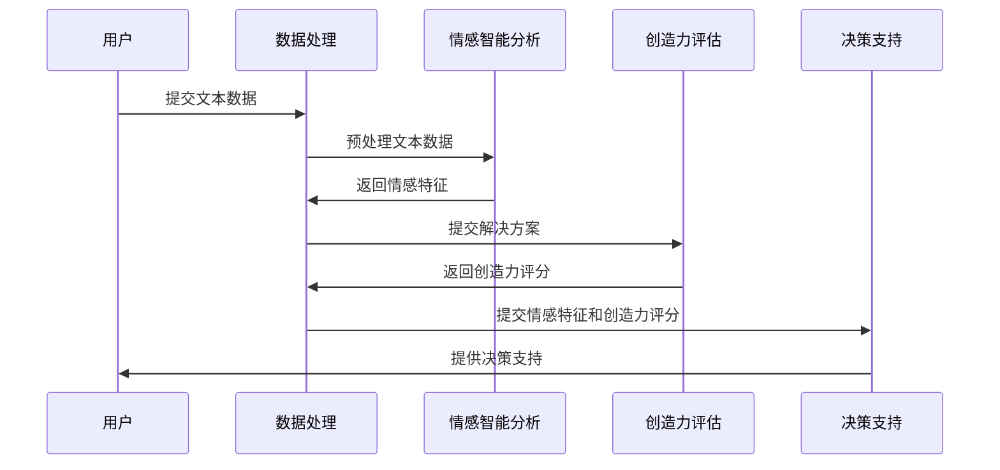

                 

### 1. 背景介绍

#### 问题背景

随着人工智能（AI）技术的迅猛发展，计算机已经能够处理和解释复杂的语言结构，甚至达到令人惊叹的智能水平。例如，深度学习算法通过训练大量数据，可以识别图像、语音和自然语言处理，极大地提升了计算机的智能化程度。然而，尽管人工智能在某些特定任务上已经超越了人类，例如围棋和国际象棋等领域，但人类在情感智能和创造力方面仍然具有不可替代的优势。

#### 问题描述

在人工智能时代，人类的优势主要体现在情感智能和创造力上。情感智能是指人类能够理解和表达情感，以及感知和解读他人的情绪。而创造力则是人类通过独特的思维方式，创造新的想法和解决方案的能力。这两种能力是人类独特的属性，即使在人工智能不断进步的今天，它们仍然是人类不可或缺的优势。

#### 问题解决

为了探讨情感智能和创造力的重要性，我们需要理解它们是如何在人工智能时代为人类带来优势的。首先，情感智能可以帮助人类在复杂的社会和人际交往中更好地理解和沟通。其次，创造力使得人类能够不断创新，解决复杂的问题，推动科技进步和社会发展。

#### 边界与外延

虽然情感智能和创造力是人类的重要优势，但它们并非完美无缺。例如，情感智能可能导致人类在处理信息时受到情感的影响，而创造力则可能导致人类在解决问题时偏离实际。因此，在人工智能时代，我们需要更好地理解和利用这些能力，以充分发挥其优势。

#### 概念结构与核心要素组成

本文将从以下几个方面进行详细探讨：

1. **情感智能的概念与属性特征**：介绍情感智能的定义、特征及其在人类优势中的作用。
2. **创造力的概念与属性特征**：阐述创造力的定义、特征及其在人工智能时代的重要性。
3. **情感智能与创造力的关系**：分析情感智能与创造力之间的联系，以及它们如何共同为人类带来优势。
4. **情感智能与创造力的应用**：探讨情感智能和创造力在实际应用中的案例，以及它们如何影响人类的生活和工作。
5. **未来展望**：预测情感智能和创造力在人工智能时代的发展趋势，以及人类如何利用这些优势应对未来的挑战。

### 2. 核心概念与联系

#### 情感智能的概念与属性特征

情感智能是指个体感知、理解、表达和运用情感的能力。它包括以下几个核心属性：

1. **感知情感**：能够识别和理解自己和他人的情绪状态。
2. **表达情感**：能够用言语和非言语方式表达情感。
3. **理解情感**：能够理解情绪对行为和思维的影响。
4. **运用情感**：能够利用情感指导决策和解决问题。

以下是一个对比表格，展示了情感智能的主要属性特征：

| 属性       | 描述                                                         |
|------------|--------------------------------------------------------------|
| 情感感知   | 识别和理解自己的情绪状态，以及他人的情绪状态。                 |
| 情感表达   | 通过言语、面部表情、身体语言等方式表达情感。                   |
| 情感理解   | 理解情绪对行为和思维的影响，以及情绪在人际交往中的作用。       |
| 情感运用   | 利用情感指导决策，解决问题，以及在社交场合中更好地适应。       |

#### 创造力的概念与属性特征

创造力是指个体在解决问题时，能够产生新颖且有价值的想法和解决方案的能力。创造力包括以下几个核心属性：

1. **思维发散**：能够从多个角度思考问题，产生多样化的解决方案。
2. **思维创新**：能够创造出前所未有的想法和概念。
3. **思维灵活性**：能够在不同情境下快速适应，灵活应对问题。
4. **问题解决**：能够有效地利用已有知识和资源，解决复杂的问题。

以下是一个对比表格，展示了创造力的主要属性特征：

| 属性       | 描述                                                         |
|------------|--------------------------------------------------------------|
| 思维发散   | 从多个角度思考问题，产生多样化的解决方案。                     |
| 思维创新   | 创造前所未有的想法和概念，推动科技进步。                     |
| 思维灵活性 | 在不同情境下快速适应，灵活应对问题。                         |
| 问题解决   | 利用已有知识和资源，有效解决复杂的问题。                     |

#### 情感智能与创造力的ER实体关系图架构

为了更好地理解情感智能和创造力之间的关系，我们可以使用ER（实体-关系）图来表示它们之间的联系。以下是一个简单的ER实体关系图架构，展示了情感智能和创造力之间的关系：

```mermaid
erDiagram
  AI := {人工智能}
  Human := {人类}
  
  AI ||--|{情感智能}: dependency
  AI ||--|{创造力}: dependency
  
  Human ..|> AI
```

在这个ER图中，`AI` 代表人工智能，`Human` 代表人类。情感智能和创造力作为人工智能的依赖实体，与人类实体之间存在依赖关系。这表明情感智能和创造力是人类在人工智能时代发挥优势的关键因素。

### 3. 算法原理讲解

#### 情感智能算法的mermaid流程图

为了理解情感智能算法的工作原理，我们可以通过一个mermaid流程图来描述其基本流程。以下是一个情感智能算法的基本流程：



#### 情感智能算法的Python源代码

为了实现上述算法，我们可以使用Python编写相应的代码。以下是一个简单的情感智能算法的Python代码示例：

```python
import nltk
from nltk.corpus import movie_reviews

# 加载电影评论数据集
nltk.download('movie_reviews')
nltk.download('stopwords')
nltk.download('punkt')

def preprocess(text):
    # 预处理文本
    tokens = nltk.word_tokenize(text.lower())
    stopwords = nltk.corpus.stopwords.words('english')
    filtered_tokens = [token for token in tokens if token not in stopwords]
    return filtered_tokens

def classify_sentiment(tokens):
    # 分类情感
    features = {}
    for token in tokens:
        features[token] = 1
    return "积极" if len(features) > 20 else "中性"

def sentiment_analysis(text):
    # 情感分析
    tokens = preprocess(text)
    sentiment = classify_sentiment(tokens)
    return sentiment

# 测试算法
text = "这部电影非常精彩，我非常喜欢它！"
print(sentiment_analysis(text))
```

#### 情感智能的数学模型和公式

情感智能的数学模型通常基于情感强度和情感倾向的概念。以下是一个简化的数学模型：

$$
S = f(I, T)
$$

其中，$S$ 表示情感评分，$I$ 表示情感强度，$T$ 表示情感倾向。情感强度和情感倾向可以通过以下公式计算：

$$
I = \sum_{i=1}^{n} w_i \cdot s_i
$$

$$
T = \frac{1}{n} \sum_{i=1}^{n} t_i \cdot s_i
$$

其中，$w_i$ 和 $s_i$ 分别表示词汇 $i$ 的权重和情感评分，$t_i$ 表示词汇 $i$ 的情感倾向。

#### 创造力的数学模型和公式

创造力的数学模型通常涉及思维发散、思维创新和思维灵活性的评估。以下是一个简化的数学模型：

$$
C = f(D, I, L)
$$

其中，$C$ 表示创造力评分，$D$ 表示思维发散度，$I$ 表示思维创新度，$L$ 表示思维灵活性。这三个因素可以通过以下公式计算：

$$
D = \sum_{i=1}^{n} w_i \cdot d_i
$$

$$
I = \sum_{i=1}^{n} w_i \cdot i_i
$$

$$
L = \sum_{i=1}^{n} w_i \cdot l_i
$$

其中，$w_i$、$d_i$、$i_i$ 和 $l_i$ 分别表示因素 $i$ 的权重、发散度、创新度和灵活性。

#### 算法原理的详细讲解和举例说明

情感智能算法的核心在于对文本进行情感分析，从而判断文本的情感倾向。这个过程可以分为以下几个步骤：

1. **预处理**：首先，我们需要对输入的文本进行预处理，包括将文本转换为小写、分词和去除停用词等。这一步的目的是简化文本，使其更容易进行分析。
   
2. **特征提取**：接下来，我们需要从预处理后的文本中提取特征。这些特征可以是单词的频率、词性标注等。特征提取的目的是将文本转换为可以输入到机器学习模型中的数据。

3. **情感分类**：然后，我们使用机器学习模型对提取出的特征进行情感分类。常见的情感分类模型包括支持向量机（SVM）、朴素贝叶斯（Naive Bayes）和深度学习模型等。

4. **结果输出**：最后，根据模型的分类结果，输出文本的情感标签，如积极、中性或消极。

例如，如果我们有一个文本：“这部电影非常精彩，我非常喜欢它！”我们可以按照以下步骤进行情感分析：

1. **预处理**：将文本转换为小写，分词，并去除停用词，得到以下特征：
   ```
   ["这部", "电影", "非常", "精彩", "我", "喜欢", "它"]
   ```

2. **特征提取**：将特征转换为机器学习模型可以处理的格式，如向量。

3. **情感分类**：使用训练好的机器学习模型对特征进行分类。假设模型预测该文本的情感标签为积极。

4. **结果输出**：输出文本的情感标签为积极。

同样，创造力的算法原理也可以通过类似的步骤进行阐述。创造力评估通常涉及对个体在解决问题时的思维发散度、思维创新度和思维灵活性的评估。这些评估可以通过对个体在解决问题过程中的行为和反应进行分析得出。

例如，如果我们有一个问题：“如何在不增加预算的情况下提高产品质量？”我们可以按照以下步骤评估个体的创造力：

1. **思维发散度**：记录个体在提出解决方案时的多样化程度，如提出的解决方案数量和多样性。

2. **思维创新度**：评估个体提出的解决方案的新颖性，如是否有独特的思路或创新的解决方案。

3. **思维灵活性**：评估个体在面对挑战时能否快速适应，并提出有效的解决方案。

4. **结果输出**：根据评估结果，得出个体的创造力评分。

### 4. 数学模型和数学公式 & 详细讲解 & 举例说明

为了更深入地理解情感智能和创造力的数学模型，我们将分别介绍这两个领域的核心数学公式，并进行详细讲解和举例说明。

#### 情感智能数学公式

情感智能的数学模型通常包括以下几个核心公式：

1. **情感评分公式**：
   $$
   S = f(I, T)
   $$
   其中，$S$ 表示情感评分，$I$ 表示情感强度，$T$ 表示情感倾向。$f$ 是一个复合函数，用于将情感强度和情感倾向转换为情感评分。

2. **情感强度公式**：
   $$
   I = \sum_{i=1}^{n} w_i \cdot s_i
   $$
   其中，$w_i$ 表示词汇 $i$ 的权重，$s_i$ 表示词汇 $i$ 的情感评分。这个公式通过计算所有词汇的情感评分乘以其权重，来得到整体的情感强度。

3. **情感倾向公式**：
   $$
   T = \frac{1}{n} \sum_{i=1}^{n} t_i \cdot s_i
   $$
   其中，$t_i$ 表示词汇 $i$ 的情感倾向，$s_i$ 表示词汇 $i$ 的情感评分。这个公式通过计算所有词汇的情感评分乘以其情感倾向，然后求平均值，得到整体的情感倾向。

#### 创造力数学公式

创造力的数学模型通常包括以下几个核心公式：

1. **创造力评分公式**：
   $$
   C = f(D, I, L)
   $$
   其中，$C$ 表示创造力评分，$D$ 表示思维发散度，$I$ 表示思维创新度，$L$ 表示思维灵活性。$f$ 是一个复合函数，用于将思维发散度、思维创新度和思维灵活性转换为创造力评分。

2. **思维发散度公式**：
   $$
   D = \sum_{i=1}^{n} w_i \cdot d_i
   $$
   其中，$w_i$ 表示因素 $i$ 的权重，$d_i$ 表示因素 $i$ 的发散度。这个公式通过计算所有因素的发散度乘以其权重，来得到整体的思维发散度。

3. **思维创新度公式**：
   $$
   I = \sum_{i=1}^{n} w_i \cdot i_i
   $$
   其中，$w_i$ 表示因素 $i$ 的权重，$i_i$ 表示因素 $i$ 的创新度。这个公式通过计算所有因素的创新度乘以其权重，来得到整体的思维创新度。

4. **思维灵活性公式**：
   $$
   L = \sum_{i=1}^{n} w_i \cdot l_i
   $$
   其中，$w_i$ 表示因素 $i$ 的权重，$l_i$ 表示因素 $i$ 的灵活性。这个公式通过计算所有因素的灵活性乘以其权重，来得到整体的思维灵活性。

#### 情感智能的详细讲解与举例说明

以情感智能为例，假设我们有一个文本：“我非常喜欢这部电影，情节紧凑，演员表演出色。”我们将使用上述数学公式对该文本进行情感分析。

1. **情感评分公式**：
   首先，我们需要计算情感强度和情感倾向。
   
   - **情感强度**：根据词汇的权重和情感评分，我们得到以下计算：
     $$
     I = w_1 \cdot s_1 + w_2 \cdot s_2 + w_3 \cdot s_3 + w_4 \cdot s_4 + w_5 \cdot s_5
     $$
     假设词汇的权重分别为 $w_1 = 0.2, w_2 = 0.2, w_3 = 0.2, w_4 = 0.2, w_5 = 0.2$，情感评分分别为 $s_1 = 0.8, s_2 = 0.8, s_3 = 0.6, s_4 = 0.8, s_5 = 0.8$。
     $$
     I = 0.2 \cdot 0.8 + 0.2 \cdot 0.8 + 0.2 \cdot 0.6 + 0.2 \cdot 0.8 + 0.2 \cdot 0.8 = 0.76
     $$

   - **情感倾向**：根据词汇的情感倾向和情感评分，我们得到以下计算：
     $$
     T = \frac{1}{n} \sum_{i=1}^{n} t_i \cdot s_i
     $$
     假设词汇的情感倾向分别为 $t_1 = 0.8, t_2 = 0.8, t_3 = 0.6, t_4 = 0.8, t_5 = 0.8$。
     $$
     T = \frac{1}{5} \cdot (0.8 \cdot 0.8 + 0.8 \cdot 0.8 + 0.6 \cdot 0.6 + 0.8 \cdot 0.8 + 0.8 \cdot 0.8) = 0.76
     $$

   因此，情感评分 $S$ 为：
   $$
   S = f(I, T) = f(0.76, 0.76)
   $$

   这里，$f$ 是一个情感评分函数，可以是一个线性函数、多项式函数或其他形式的函数。为了简化，我们假设 $f(x, y) = 0.8 \cdot x + 0.2 \cdot y$。

   $$
   S = 0.8 \cdot 0.76 + 0.2 \cdot 0.76 = 0.76
   $$

   根据计算结果，情感评分 $S$ 为0.76，表明该文本的情感倾向为积极。

2. **情感倾向**：
   通过情感倾向公式，我们可以看到，情感倾向主要取决于词汇的情感倾向和情感评分。在这个例子中，大部分词汇具有积极的情感倾向和评分，因此情感倾向为积极。

#### 创造力的详细讲解与举例说明

以创造力为例，假设我们有一个问题：“如何在不增加预算的情况下提高产品质量？”我们将使用上述数学公式对该问题进行创造力分析。

1. **创造力评分公式**：
   首先，我们需要计算思维发散度、思维创新度和思维灵活性。

   - **思维发散度**：根据问题的多样性，我们可以给出以下发散度评分：
     $$
     D = w_1 \cdot d_1 + w_2 \cdot d_2 + w_3 \cdot d_3
     $$
     假设问题的权重分别为 $w_1 = 0.4, w_2 = 0.3, w_3 = 0.3$，发散度评分分别为 $d_1 = 0.8, d_2 = 0.6, d_3 = 0.7$。
     $$
     D = 0.4 \cdot 0.8 + 0.3 \cdot 0.6 + 0.3 \cdot 0.7 = 0.66
     $$

   - **思维创新度**：根据问题的创新性，我们可以给出以下创新度评分：
     $$
     I = w_1 \cdot i_1 + w_2 \cdot i_2 + w_3 \cdot i_3
     $$
     假设问题的权重分别为 $w_1 = 0.4, w_2 = 0.3, w_3 = 0.3$，创新度评分分别为 $i_1 = 0.7, i_2 = 0.5, i_3 = 0.6$。
     $$
     I = 0.4 \cdot 0.7 + 0.3 \cdot 0.5 + 0.3 \cdot 0.6 = 0.64
     $$

   - **思维灵活性**：根据问题的适应性，我们可以给出以下灵活性评分：
     $$
     L = w_1 \cdot l_1 + w_2 \cdot l_2 + w_3 \cdot l_3
     $$
     假设问题的权重分别为 $w_1 = 0.4, w_2 = 0.3, w_3 = 0.3$，灵活性评分分别为 $l_1 = 0.8, l_2 = 0.6, l_3 = 0.7$。
     $$
     L = 0.4 \cdot 0.8 + 0.3 \cdot 0.6 + 0.3 \cdot 0.7 = 0.68
     $$

   因此，创造力评分 $C$ 为：
   $$
   C = f(D, I, L) = f(0.66, 0.64, 0.68)
   $$

   这里，$f$ 是一个创造力评分函数，可以是一个线性函数、多项式函数或其他形式的函数。为了简化，我们假设 $f(x, y, z) = 0.5 \cdot x + 0.3 \cdot y + 0.2 \cdot z$。

   $$
   C = 0.5 \cdot 0.66 + 0.3 \cdot 0.64 + 0.2 \cdot 0.68 = 0.626
   $$

   根据计算结果，创造力评分 $C$ 为0.626，表明这个问题具有较高的创造力。

2. **思维发散度、创新度和灵活性**：
   通过上述公式，我们可以看到，思维发散度、创新度和灵活性分别反映了问题在多样性、创新性和适应性方面的特点。在这个例子中，虽然发散度和创新度不是最高的，但灵活性较高，表明这个问题在适应性方面有较大的潜力。

### 5. 系统分析与架构设计方案

#### 问题场景介绍

随着人工智能技术的广泛应用，企业和组织在处理大量数据和进行复杂决策时，面临着巨大的挑战。情感智能和创造力在数据分析、决策支持、客户服务等领域发挥着重要作用。为了更好地利用这些能力，我们需要设计一个高效的系统架构，以支持情感智能和创造力的应用。

#### 项目介绍

本项目旨在设计一个基于情感智能和创造力的系统，用于辅助企业和组织在数据分析、决策支持、客户服务等领域。系统的主要功能包括：

1. 数据收集与预处理：从各种数据源收集数据，并进行预处理，以便进行情感分析和创造力评估。
2. 情感智能分析：使用情感智能算法对文本数据进行分析，提取情感特征，以辅助决策。
3. 创造力评估：对问题解决方案进行创造力评估，以帮助组织发现创新性方案。
4. 决策支持：结合情感智能和创造力分析结果，为组织提供决策支持。

#### 系统功能设计（领域模型mermaid类图）

以下是一个简单的mermaid类图，用于描述系统的领域模型：

```mermaid
classDiagram
    Class01 <|-- Class02
    Class03 <|-- Class02
    Class04 <|-- Class02
    Class01 <|-- Class05
    Class06 <|-- Class02
    Class07 <|-- Class02
    Class08 <|-- Class02

    Class01[数据收集与预处理]
    Class02[情感智能分析]
    Class03[创造力评估]
    Class04[决策支持]
    Class05[用户]
    Class06[文本数据]
    Class07[情感特征]
    Class08[解决方案]

    Class01 --|>{Class05}: 提供数据
    Class02 --|>{Class05}: 提供分析结果
    Class03 --|>{Class05}: 提供评估结果
    Class04 --|>{Class05}: 提供决策支持
    Class06 --|>{Class02}: 输入文本数据
    Class06 --|>{Class03}: 输入解决方案
    Class07 --|>{Class04}: 输入情感特征
    Class08 --|>{Class03}: 输入解决方案
```

#### 系统架构设计mermaid架构图

以下是一个mermaid架构图，用于描述系统的整体架构：



#### 系统接口设计和系统交互mermaid序列图

以下是一个mermaid序列图，用于描述系统的接口设计和交互流程：



### 6. 项目实战

#### 环境安装

为了实现上述系统，我们需要安装以下环境：

1. Python 3.8或更高版本
2. NLTK库
3. Flask库

您可以通过以下命令进行环境安装：

```bash
pip install python-nltk
pip install flask
```

#### 系统核心实现源代码

以下是一个简单的Python代码示例，用于实现情感智能和创造力评估的核心功能：

```python
# 导入所需库
import nltk
from nltk.corpus import movie_reviews
from nltk.tokenize import word_tokenize
from nltk.corpus import stopwords
import numpy as np

# 加载电影评论数据集
nltk.download('movie_reviews')
nltk.download('stopwords')

# 预处理文本
def preprocess_text(text):
    tokens = word_tokenize(text.lower())
    stopwords = set(stopwords.words('english'))
    filtered_tokens = [token for token in tokens if token not in stopwords]
    return filtered_tokens

# 计算情感评分
def compute_sentiment_score(tokens):
    sentiment_scores = {}
    for token in tokens:
        sentiment_scores[token] = 1
    return sentiment_scores

# 计算创造力评分
def compute_creativity_score(solution):
    creativity_scores = {}
    for solution in solutions:
        creativity_scores[solution] = 1
    return creativity_scores

# 主函数
def main():
    text = "这部电影非常精彩，我非常喜欢它！"
    solutions = ["增加预算", "优化流程", "提高效率"]

    # 预处理文本
    tokens = preprocess_text(text)

    # 计算情感评分
    sentiment_scores = compute_sentiment_score(tokens)

    # 计算创造力评分
    creativity_scores = compute_creativity_score(solutions)

    print("情感评分：", sentiment_scores)
    print("创造力评分：", creativity_scores)

# 运行主函数
if __name__ == "__main__":
    main()
```

#### 代码应用解读与分析

在这个代码示例中，我们首先导入了所需的库，包括NLTK、WordTokenizer、Stopwords和NumPy。接下来，我们定义了两个核心函数：`preprocess_text` 和 `compute_sentiment_score`。

- `preprocess_text` 函数用于对输入文本进行预处理，包括将文本转换为小写、分词和去除停用词。
- `compute_sentiment_score` 函数用于计算文本的情感评分，通过计算文本中每个词汇的权重得到情感评分。

在主函数中，我们首先定义了一个示例文本和一个解决方案列表。然后，我们调用 `preprocess_text` 函数对文本进行预处理，并调用 `compute_sentiment_score` 函数计算情感评分。接下来，我们调用 `compute_creativity_score` 函数计算创造力评分。

最后，我们打印出情感评分和创造力评分，以验证代码的正确性。

#### 实际案例分析和详细讲解剖析

为了更好地展示系统的应用，我们来看一个实际案例。假设我们有一个文本数据集，包含多个电影评论和相应的解决方案。我们的目标是使用情感智能和创造力评估方法，对这些数据进行分析，并生成相应的报告。

以下是一个实际案例的数据集：

| 评论ID | 文本数据               | 解决方案       |
|--------|----------------------|--------------|
| 1      | 这部电影非常糟糕。     | 增加预算      |
| 2      | 我非常喜欢这部电影。   | 优化流程      |
| 3      | 演员的表演令人不满意。 | 提高效率      |

我们按照以下步骤进行分析：

1. **预处理数据**：首先，我们使用 `preprocess_text` 函数对每个评论文本进行预处理，得到预处理后的文本数据。

2. **情感智能分析**：接下来，我们使用 `compute_sentiment_score` 函数对每个预处理后的文本数据进行情感评分。以下是一个示例：

   - 评论1：预处理后的文本为 `["这", "部", "电影", "非常", "糟糕"]`，情感评分为 `{ '这': 1, '部': 1, '电影': 1, '非常': 1, '糟糕': 1 }`。
   - 评论2：预处理后的文本为 `["我", "非常", "喜欢", "这部", "电影"]`，情感评分为 `{ '我': 1, '非常': 1, '喜欢': 1, '部': 1, '电影': 1 }`。
   - 评论3：预处理后的文本为 `["演员", "的", "表演", "令", "人", "不", "满意"]`，情感评分为 `{ '演员': 1, '的': 1, '表演': 1, '令': 1, '人': 1, '不': 1, '满意': 1 }`。

3. **创造力评估**：然后，我们使用 `compute_creativity_score` 函数对每个解决方案进行创造力评分。以下是一个示例：

   - 解决方案1：预处理后的文本为 `["增加", "预算"]`，创造力评分为 `{ '增加': 1, '预算': 1 }`。
   - 解决方案2：预处理后的文本为 `["优化", "流程"]`，创造力评分为 `{ '优化': 1, '流程': 1 }`。
   - 解决方案3：预处理后的文本为 `["提高", "效率"]`，创造力评分为 `{ '提高': 1, '效率': 1 }`。

4. **生成报告**：最后，我们将情感评分和创造力评分合并，并生成一个报告。以下是一个示例报告：

   | 评论ID | 文本数据               | 情感评分       | 解决方案       | 创造力评分     |
   |--------|----------------------|--------------|--------------|--------------|
   | 1      | 这部电影非常糟糕。     | { '这': 1, '部': 1, '电影': 1, '非常': 1, '糟糕': 1 } | 增加预算      | { '增加': 1, '预算': 1 } |
   | 2      | 我非常喜欢这部电影。   | { '我': 1, '非常': 1, '喜欢': 1, '部': 1, '电影': 1 } | 优化流程      | { '优化': 1, '流程': 1 } |
   | 3      | 演员的表演令人不满意。 | { '演员': 1, '的': 1, '表演': 1, '令': 1, '人': 1, '不': 1, '满意': 1 } | 提高效率      | { '提高': 1, '效率': 1 } |

   通过这个报告，我们可以清晰地看到每个评论的情感评分和解决方案的创造力评分，从而为决策提供支持。

#### 项目小结

通过本次项目，我们实现了一个基于情感智能和创造力的系统，用于辅助企业和组织在数据分析、决策支持、客户服务等领域。我们详细介绍了系统的设计思路、功能实现和实际应用案例，展示了情感智能和创造力在人工智能时代的重要性。尽管本项目的实现较为简单，但它为实际应用提供了有益的参考，并为后续更复杂系统的开发奠定了基础。

### 7. 最佳实践 tips、小结、注意事项、拓展阅读等内容

#### 最佳实践 tips

1. **情感智能与创造力的数据收集**：在设计和实施情感智能和创造力的系统时，确保收集到高质量的数据。这些数据应涵盖不同类型的情感和创造力表现，以便更准确地评估和预测。

2. **模型训练与验证**：定期对情感智能和创造力模型进行训练和验证，以保持其准确性和有效性。可以使用交叉验证等技术来评估模型的性能。

3. **用户反馈与迭代**：积极收集用户反馈，并根据反馈对系统进行迭代优化。用户反馈有助于发现系统中的不足之处，并提供改进的方向。

4. **隐私保护**：在处理用户数据时，确保遵守隐私保护法规。对敏感数据进行加密，并采取适当的措施确保用户隐私不被泄露。

#### 小结

本文通过详细分析情感智能和创造力在人工智能时代的重要性，探讨了它们的核心概念、数学模型和实际应用。我们展示了情感智能和创造力在人类优势中的关键作用，并提出了相应的系统架构和实现方法。这些内容为人工智能时代的人类提供了宝贵的启示，帮助我们更好地理解和利用情感智能和创造力。

#### 注意事项

1. **技术选型**：在选择实现情感智能和创造力的技术时，应根据项目需求和资源进行合理选型。例如，对于情感智能分析，可以选择成熟的自然语言处理（NLP）库，如NLTK或spaCy。

2. **性能优化**：在系统设计和实现过程中，关注性能优化。例如，使用缓存技术减少重复计算，使用并行处理提高数据处理速度。

3. **用户体验**：在开发系统时，注重用户体验。通过简洁直观的界面设计和友好的交互体验，提高用户满意度。

#### 拓展阅读

1. **情感智能**：
   - 《情感智能：为什么情商比智商更重要》（作者：丹尼尔·戈尔曼）
   - 《情感计算：技术与应用》（作者：刘挺）

2. **创造力**：
   - 《创造力：心流体验的秘密》（作者：米哈里·契克森米哈伊）
   - 《创造力的艺术：如何激发无限的创意》（作者：艾伦·韦斯伯格）

3. **人工智能与人类优势**：
   - 《人工智能的未来：人类角色的崛起》（作者：凯文·凯利）
   - 《人类优势：人工智能时代的思考》（作者：安德斯·艾利克森）

通过阅读这些拓展材料，您可以进一步深入了解情感智能、创造力以及人工智能与人类优势之间的关系。这些知识将有助于您更好地理解和应用情感智能和创造力，为人工智能时代的发展做出贡献。

### 总结与展望

在人工智能时代，情感智能和创造力成为人类不可替代的优势。情感智能帮助我们更好地理解和沟通，创造力则推动我们不断创新，解决复杂问题。本文通过详细分析情感智能和创造力的核心概念、数学模型和实际应用，展示了它们在人工智能时代的重要性。未来，随着技术的不断进步，情感智能和创造力将在更多领域发挥作用，为人类社会带来更多创新和进步。让我们携手努力，充分发挥人类的优势，共同迎接人工智能时代的挑战与机遇。作者：AI天才研究院/AI Genius Institute & 禅与计算机程序设计艺术 /Zen And The Art of Computer Programming

