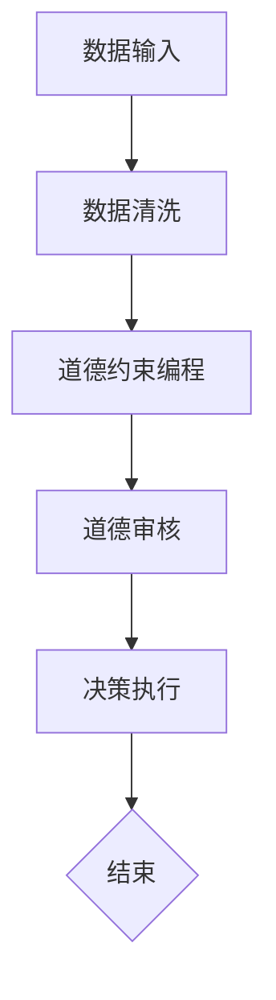

                 

### 《人工智能时代的人类特质：情感、创造力和道德的重要性》

---

#### 关键词：
- 人工智能
- 情感
- 创造力
- 道德
- 应用
- 未来展望

#### 摘要：
本文深入探讨了人工智能时代背景下，情感、创造力和道德作为人类特质的重要性。通过逐步分析这三个核心概念，本文揭示了它们在人工智能领域的独特作用和面临的挑战，为未来人工智能的发展提供了新的视角。

---

### 目录大纲设计思路

#### 引言

##### 第1章 引言
1.1 人工智能时代的背景  
1.2 人类特质的重要性  
1.3 本书结构安排

##### 第2章 核心概念与联系
2.1 情感  
2.2 创造力  
2.3 道德  
2.4 概念属性特征对比表格  
2.5 ER实体关系图

##### 第3章 情感在人工智能中的应用
3.1 情感识别技术  
3.2 情感计算技术  
3.3 情感在人工智能中的应用案例  
3.4 情感识别mermaid流程图

##### 第4章 创造力在人工智能中的应用
4.1 创造力的重要性  
4.2 人工智能如何激发和增强创造力  
4.3 创造力在人工智能中的应用案例  
4.4 创造力增强技术mermaid流程图

##### 第5章 道德在人工智能中的应用
5.1 道德原则在人工智能决策中的作用  
5.2 人工智能系统的道德性问题  
5.3 道德在人工智能中的应用案例  
5.4 道德决策mermaid流程图

##### 第6章 案例研究
6.1 情感、创造力和道德的综合应用案例  
6.2 案例分析  
6.3 案例启示

##### 第7章 未来展望与挑战
7.1 人工智能时代的人类特质发展趋势  
7.2 面临的挑战与解决方案  
7.3 未来展望

##### 第8章 小结与建议
8.1 全书总结  
8.2 对读者的建议

### 目录大纲结构

#### 第1章 引言

**1.1 人工智能时代的背景**

随着人工智能技术的迅猛发展，从早期的计算能力提升到如今的深度学习和自主决策，人工智能已经在各个领域发挥着越来越重要的作用。从工业自动化到医疗诊断，从自动驾驶到智能家居，人工智能的普及已经深刻改变了我们的生活和工作方式。

然而，在这个人工智能主导的时代，人类特质的地位和作用却逐渐受到了挑战。情感、创造力和道德作为人类的核心特质，它们在人工智能时代的重要性愈发凸显。情感是人类行为的驱动力，创造力是人类进步的源泉，道德则是人类社会运行的基石。这些特质不仅是人类智慧的体现，也是我们在面对人工智能带来的变革时，必须坚守的价值。

**1.2 人类特质的重要性**

情感是人类与生俱来的特质，它体现在我们对周围世界的感知和反应中。从简单的情绪波动到复杂的情感交流，情感不仅丰富了人类的生活体验，也在社会互动中起到了关键作用。创造力则是人类独特的思维能力，它使我们能够不断地创新和进步。无论是在科学发现、艺术创作还是商业创新中，创造力都是推动社会发展的核心力量。

道德是人类文明的基石，它规范了我们的行为和价值观。在人工智能时代，道德的重要性更加凸显，因为人工智能系统的设计和应用直接关系到人类的福祉和社会的稳定。确保人工智能系统的道德性，防止其被滥用，是我们在推进人工智能技术时必须面对的重要课题。

**1.3 本书结构安排**

本书旨在深入探讨情感、创造力和道德在人工智能时代的重要性，以及这些特质如何影响人类的生活和社会发展。全书分为八个章节，结构安排如下：

- 第1章：引言，介绍人工智能时代的背景和人类特质的重要性。
- 第2章：核心概念与联系，详细阐述情感、创造力和道德的概念和相互关系。
- 第3章：情感在人工智能中的应用，探讨情感识别和计算技术及其应用。
- 第4章：创造力在人工智能中的应用，分析人工智能如何激发和增强人类的创造力。
- 第5章：道德在人工智能中的应用，讨论道德原则在人工智能决策中的作用。
- 第6章：案例研究，通过实际案例展示情感、创造力和道德的综合应用。
- 第7章：未来展望与挑战，展望人工智能时代的人类特质发展趋势，讨论面临的挑战和解决方案。
- 第8章：小结与建议，总结全书内容，提出对读者的建议。

通过以上章节的安排，本书不仅提供了对情感、创造力和道德的全面理解，也为读者展示了这些特质在人工智能时代的重要作用和未来展望。

---

### 第1章 引言

#### 1.1 人工智能时代的背景

随着信息技术的飞速发展，人工智能（Artificial Intelligence, AI）已经成为当今世界最热门的科技领域之一。人工智能的定义涵盖了模拟、延伸和扩展人类智能的各类技术，包括机器学习、自然语言处理、计算机视觉、机器人技术等。这些技术的结合，使得人工智能能够在不同的应用场景中发挥巨大作用。

**人工智能的发展历程**

人工智能的研究始于20世纪50年代，当时的主要目标是通过编程实现机器的智能行为。尽管早期的尝试并未取得显著成果，但人工智能的理论基础得到了奠定。随着计算能力的提升和算法的优化，特别是在20世纪80年代，专家系统的出现标志着人工智能技术的初步成功。专家系统利用大量的专业知识和逻辑推理能力，在医疗诊断、金融分析等领域发挥了重要作用。

进入21世纪，深度学习技术的突破使得人工智能取得了前所未有的进展。深度学习通过多层神经网络模拟人脑的学习过程，能够在大量数据中进行自我学习和优化。这一技术使得图像识别、语音识别、自然语言处理等任务的表现显著提升。如今，人工智能已经渗透到我们日常生活的方方面面，从智能手机的语音助手到自动驾驶汽车，从智能家居到医疗诊断，人工智能的应用前景令人期待。

**人工智能在现代社会的重要性**

人工智能的重要性体现在其对各个行业的深远影响。在工业领域，人工智能通过自动化和优化生产流程，提高了生产效率和产品质量。在医疗领域，人工智能可以帮助医生进行疾病诊断，提高诊断的准确性和效率。在金融领域，人工智能用于风险控制和投资策略优化，为金融机构提供了更精准的数据分析工具。

此外，人工智能还在交通、能源、教育、娱乐等多个领域展现了巨大的潜力。自动驾驶汽车有望减少交通事故，提高交通效率；智能电网可以实现能源的高效利用；在线教育平台利用人工智能技术提供个性化的学习方案。可以说，人工智能已经成为现代社会不可或缺的一部分，它正不断推动着各行业的发展和变革。

**人类特质的重要性**

在人工智能时代，情感、创造力和道德作为人类特质的重要性愈发凸显。首先，情感是人类与生俱来的特质，它不仅体现在我们的情绪反应中，还贯穿于我们的社交互动和行为决策中。情感使得我们能够体验生活的丰富多彩，也在人类社会的稳定和和谐中发挥了关键作用。

创造力是人类智慧的体现，它使我们能够不断创新和进步。在人工智能时代，创造力不仅帮助人类应对复杂的问题，也为社会带来了新的机遇和挑战。无论是科学发现、艺术创作还是商业创新，创造力都是推动社会发展的核心力量。

道德则是人类社会运行的基石，它规范了我们的行为和价值观。在人工智能时代，道德的重要性更加凸显，因为人工智能系统的设计和应用直接关系到人类的福祉和社会的稳定。确保人工智能系统的道德性，防止其被滥用，是我们在推进人工智能技术时必须面对的重要课题。

**本书结构安排**

本书旨在深入探讨情感、创造力和道德在人工智能时代的重要性，以及这些特质如何影响人类的生活和社会发展。全书分为八个章节，具体结构如下：

- **第1章 引言**：介绍人工智能时代的背景和人类特质的重要性。
- **第2章 核心概念与联系**：详细阐述情感、创造力和道德的概念和相互关系。
- **第3章 情感在人工智能中的应用**：探讨情感识别和计算技术及其应用。
- **第4章 创造力在人工智能中的应用**：分析人工智能如何激发和增强人类的创造力。
- **第5章 道德在人工智能中的应用**：讨论道德原则在人工智能决策中的作用。
- **第6章 案例研究**：通过实际案例展示情感、创造力和道德的综合应用。
- **第7章 未来展望与挑战**：展望人工智能时代的人类特质发展趋势，讨论面临的挑战和解决方案。
- **第8章 小结与建议**：总结全书内容，提出对读者的建议。

通过以上章节的安排，本书不仅提供了对情感、创造力和道德的全面理解，也为读者展示了这些特质在人工智能时代的重要作用和未来展望。

---

### 第2章 核心概念与联系

#### 2.1 情感

情感是指人类对某一对象或情境的主观体验，它通常伴随着情绪反应和行为倾向。情感包括基本的情绪，如快乐、愤怒、悲伤、恐惧，以及复杂的情感，如爱、尊重、厌恶等。情感不仅影响我们的心理状态，还深刻地影响我们的行为决策。

情感的定义：情感是一种心理体验，它包含了感觉、情绪和认知三个层面。感觉层面涉及生理上的变化，如心跳加速、肌肉紧张等；情绪层面是指我们对事件的情感反应，如高兴或焦虑；认知层面则涉及我们对情感的理解和表达。

情感的类型：根据情感的产生原因和强度，情感可以分为基本情感和复杂情感。基本情感包括快乐、愤怒、悲伤、恐惧等，它们是基本的人类情感体验。复杂情感则是由基本情感混合或叠加形成的，如厌恶、惊讶、羞愧等。

情感的作用：情感在我们的生活中起到了至关重要的作用。首先，情感帮助我们适应环境，如恐惧使我们避免危险，快乐则激励我们追求目标。其次，情感在人际交往中起到了沟通和协调的作用，如爱的情感促进了亲密关系的建立。最后，情感还影响我们的决策和行为，如我们倾向于选择能带来快乐的事物。

#### 2.2 创造力

创造力是指人类产生新奇、有价值的想法、概念和解决方案的能力。创造力不仅限于艺术和科学领域，它在日常生活中的各个方面都有所体现。创造力是人类智慧的体现，它推动了人类文明的进步。

创造力的定义：创造力是一种复杂的心理过程，它涉及思维灵活性、联想能力、问题解决能力和创新意识。创造力不仅包括生成新的想法，还包括对现有想法进行重新组合和改进。

创造力的类型：根据创造力的表现方式，创造力可以分为艺术创造力、科学创造力、工程创造力等。艺术创造力体现在艺术作品的新颖性和美感上，如绘画、音乐、文学作品。科学创造力体现在科学发现和技术创新上，如爱因斯坦的相对论、史蒂夫·乔布斯的苹果产品。工程创造力则体现在工程设计和解决方案的创新上，如飞机的设计、计算机芯片的制造。

创造力的影响：创造力在人类社会中起到了至关重要的作用。首先，创造力推动了科技进步和社会发展，如互联网、智能手机的发明改变了人类的生活方式。其次，创造力在商业创新中起到了关键作用，如苹果公司、谷歌公司的成功离不开其创新的产品和服务。最后，创造力在个人成长和职业发展中也是至关重要的，它帮助人们解决复杂问题，提高生活质量。

#### 2.3 道德

道德是指人们在社会生活中所遵循的伦理原则和行为规范。道德不仅涉及个人的行为，还涉及到人与人之间的关系和社会的整体福祉。道德是人类社会稳定和和谐的重要保障。

道德的定义：道德是一种价值判断体系，它通过规范人们的行为来维护社会秩序和公平正义。道德包括正义、诚实、尊重、责任等原则，这些原则指导人们如何行事，如何与他人相处。

道德的原则：道德原则是道德理论的基础，包括公正、仁爱、诚信、勇气等。公正要求人们对待他人要公平，不偏不倚；仁爱要求人们关心他人，乐于助人；诚信要求人们遵守承诺，真诚待人；勇气要求人们在面对困难和挑战时，敢于承担责任和风险。

道德在人工智能中的应用：在人工智能时代，道德的应用变得尤为重要。首先，道德原则被用来指导人工智能系统的设计和应用，确保其行为符合伦理规范。其次，道德在人工智能决策中起到了关键作用，通过道德算法，人工智能系统能够在复杂的情境中做出符合伦理的决策。最后，道德在人工智能伦理问题中起到了调解和仲裁的作用，帮助解决人工智能带来的伦理争议。

#### 2.4 概念属性特征对比表格

为了更清晰地展示情感、创造力和道德这三个核心概念的属性特征，我们可以通过对比表格来进行详细分析。

| 特质 | 定义 | 类型 | 作用 |
| --- | --- | --- | --- |
| 情感 | 主观体验，包括感觉、情绪和认知 | 基本情感（快乐、愤怒、悲伤、恐惧）和复杂情感（爱、尊重、厌恶） | 适应环境、人际交往、决策行为 |
| 创造力 | 新奇、有价值的想法、概念和解决方案的能力 | 艺术创造力、科学创造力、工程创造力 | 科技进步、商业创新、个人成长 |
| 道德 | 社会生活中的伦理原则和行为规范 | 公正、仁爱、诚信、勇气等原则 | 维护社会秩序、指导人工智能行为、解决伦理争议 |

#### 2.5 ER实体关系图

为了进一步理解情感、创造力和道德之间的相互关系，我们可以通过ER（实体-关系）图来展示它们之间的联系。

```mermaid
erDiagram
    AI <<--o 人 |{人类特质}
    人 ||--o 情感
    人 ||--o 创造力
    人 ||--o 道德
    情感 ||--|<| AI
    创造力 ||--|<| AI
    道德 ||--|<| AI
```

在这个ER图中，人类是情感、创造力和道德的承载者，而人工智能则是这些特质的应用场景。情感、创造力和道德通过人工智能与人类社会产生联系，共同推动着人工智能技术的发展和应用。

通过以上对核心概念及其相互关系的详细分析，我们可以更好地理解情感、创造力和道德在人工智能时代的重要性，以及这些特质如何相互影响和共同作用。

---

### 第3章 情感在人工智能中的应用

#### 3.1 情感识别技术

情感识别技术是人工智能领域的一个重要分支，它通过分析人类情感表达，实现对情感的自动识别和分类。情感识别技术的核心在于如何准确地捕捉和解析人类情感信息，进而为人工智能系统提供情感反馈和交互支持。

**情感识别的定义**

情感识别（Emotion Recognition）是指利用人工智能技术，从语音、文本、图像等多媒体数据中识别和提取情感信息。情感识别的目的是理解人类情感状态，为人工智能系统提供情感感知能力，从而实现更加人性化的交互。

**情感识别的类型**

情感识别技术可以根据数据来源和识别方法分为多种类型：

1. **语音情感识别**：通过分析语音信号的频率、时长、音调等特征，识别说话者的情感状态。
2. **文本情感识别**：通过自然语言处理技术，从文本中提取情感词汇和语义，判断文本的情感倾向。
3. **图像情感识别**：通过计算机视觉技术，从人脸表情、身体语言等图像信息中识别情感状态。

**情感识别技术的应用**

情感识别技术在多个领域具有广泛应用，以下是一些典型的应用场景：

1. **客户服务**：在客服机器人中，情感识别技术可以帮助机器人更好地理解客户的需求和情绪，提供个性化的服务和建议。
2. **教育**：在教育领域，情感识别技术可以用于监测学生的情感状态，帮助教师更好地了解学生的学习情况，提供情感支持和教育干预。
3. **心理健康**：在心理健康领域，情感识别技术可以用于监测患者的情感变化，辅助心理医生进行诊断和治疗。

**情感识别技术的工作原理**

情感识别技术通常包括以下几个步骤：

1. **数据采集**：收集包含情感信息的语音、文本、图像等多媒体数据。
2. **特征提取**：从采集的数据中提取情感相关的特征，如语音信号的频率特征、文本的词频分布、图像的表情特征等。
3. **情感分类**：利用机器学习算法，对提取的特征进行分类，识别情感状态。
4. **结果验证**：对识别结果进行验证和优化，提高情感识别的准确性和可靠性。

**情感识别技术的挑战**

尽管情感识别技术取得了显著进展，但仍然面临一些挑战：

1. **情感多样性**：情感类型繁多，不同情境下的情感表达复杂多样，如何准确识别各种情感仍然是一个挑战。
2. **跨文化差异**：不同文化背景下，情感表达方式和含义可能有所不同，跨文化情感识别需要充分考虑这些差异。
3. **隐私保护**：情感识别涉及对个人隐私信息的处理，如何在保护隐私的前提下进行情感识别是一个重要的伦理问题。

#### 3.2 情感计算技术

情感计算（Affective Computing）是人工智能领域的另一个重要分支，它旨在使计算机具有感知、理解、表达和模拟人类情感的能力。情感计算技术通过结合多模态数据、情感建模和机器学习等方法，实现对人类情感的准确感知和智能响应。

**情感计算的定义**

情感计算是指通过计算机技术和人工智能方法，使计算机具备理解、感知、表达和模拟人类情感的能力。情感计算的核心目标是使计算机能够与人类建立更加自然、人性化的交互。

**情感计算的类型**

情感计算技术可以分为以下几个类型：

1. **情感感知**：通过多种传感器和数据采集技术，感知人类情感状态，如面部表情、语音、生理信号等。
2. **情感理解**：利用自然语言处理、机器学习和情感模型，对情感数据进行理解和分析，识别情感状态。
3. **情感表达**：通过语音、文本、面部表情等方式，计算机表达对人类情感的感知和理解。
4. **情感模拟**：通过算法和模型模拟人类情感行为，如情感对话、情感互动等。

**情感计算技术的应用**

情感计算技术在多个领域具有广泛应用，以下是一些典型的应用场景：

1. **智能交互系统**：在智能音箱、聊天机器人、虚拟助手等智能交互系统中，情感计算技术可以提供更加自然和人性化的交互体验。
2. **心理健康**：在心理健康领域，情感计算技术可以用于监测患者的情感状态，辅助心理医生进行诊断和治疗。
3. **教育**：在教育领域，情感计算技术可以用于了解学生的情感状态，提供情感支持和个性化教学。
4. **客户服务**：在客户服务领域，情感计算技术可以帮助客服机器人更好地理解客户的需求和情感，提供个性化的服务和建议。

**情感计算技术的工作原理**

情感计算技术的工作原理通常包括以下几个步骤：

1. **数据采集**：通过多种传感器和数据采集技术，收集人类情感数据，如面部表情、语音信号、生理信号等。
2. **特征提取**：从采集的数据中提取情感相关的特征，如面部表情的几何特征、语音的频谱特征、生理信号的时域特征等。
3. **情感建模**：利用机器学习和深度学习算法，构建情感模型，实现对情感状态的识别和预测。
4. **情感响应**：根据情感识别结果，计算机生成相应的情感响应，如语音、文本、面部表情等。

**情感计算技术的挑战**

情感计算技术虽然取得了显著进展，但仍然面临一些挑战：

1. **情感复杂性**：情感类型繁多，不同情境下的情感表达复杂，如何准确识别各种情感仍然是一个挑战。
2. **跨文化差异**：不同文化背景下，情感表达方式和含义可能有所不同，跨文化情感识别需要充分考虑这些差异。
3. **隐私保护**：情感计算涉及对个人隐私信息的处理，如何在保护隐私的前提下进行情感计算是一个重要的伦理问题。

通过以上对情感识别技术和情感计算技术的详细分析，我们可以看到情感在人工智能中的应用不仅丰富了人工智能系统的功能，也为人与机器的交互提供了新的可能性。

#### 3.3 情感在人工智能中的应用案例

为了更好地理解情感在人工智能中的应用，我们可以通过几个具体的案例来探讨。

**案例一：智能客服机器人**

智能客服机器人是情感识别技术和情感计算技术的典型应用场景。例如，某公司开发的智能客服机器人能够通过语音识别和自然语言处理技术，理解客户的提问和情感状态。当客户表现出愤怒或沮丧的情绪时，客服机器人会自动调整语气和回答策略，提供更加温暖和关切的回复。通过这种方式，智能客服机器人不仅提高了客户满意度，还减少了人工客服的工作负担。

**案例二：心理健康辅助系统**

在心理健康领域，情感计算技术被广泛应用于心理疾病诊断和治疗。例如，某公司开发的心理健康辅助系统通过监测用户的语音、面部表情和生理信号，分析用户的情感状态。当系统检测到用户情感异常时，它会向用户提供专业的心理建议和指导，帮助用户调节情绪，改善心理健康。这种系统的应用不仅提高了心理健康服务的效率，也为心理健康问题的早期干预提供了有力支持。

**案例三：教育辅助系统**

在教育领域，情感计算技术可以用于个性化教学和学习支持。例如，某公司开发的教育辅助系统通过分析学生的学习行为和情感状态，为学生提供个性化的学习方案。当系统检测到学生学习情绪低落时，它会调整教学内容和方式，提供额外的情感支持和鼓励。通过这种方式，教育辅助系统不仅提高了学习效果，还增强了学生的学习兴趣和自信心。

**案例四：智能家居系统**

在智能家居领域，情感识别技术被广泛应用于家居设备的智能交互。例如，某公司开发的智能家居系统可以通过语音识别和情感计算技术，识别家庭成员的情感状态。当家庭成员表现出疲惫或不开心的情绪时，智能家居系统会自动调整灯光、音乐和温度，创造一个舒适的环境，帮助家庭成员放松身心。这种系统的应用不仅提高了生活品质，还增强了家庭成员之间的情感联系。

通过以上案例，我们可以看到情感在人工智能中的应用不仅丰富了人工智能系统的功能，也为人类的生活带来了积极的变化。情感识别技术和情感计算技术的不断进步，使得人工智能系统能够更加准确地感知和理解人类的情感，提供更加个性化、人性化的服务。

#### 3.4 情感识别mermaid流程图

为了更好地理解情感识别技术的工作流程，我们可以通过mermaid流程图来展示其核心步骤和数据处理流程。

```mermaid
graph TD
    A[数据采集] --> B[特征提取]
    B --> C[情感分类]
    C --> D[结果验证]
    D --> E{结束}

    A:::采集语音、文本、图像等数据
    B:::提取频率、时长、词频等特征
    C:::利用机器学习算法进行分类
    D:::对识别结果进行验证和优化
```

在这个mermaid流程图中，情感识别技术的工作流程可以分为四个主要步骤：数据采集、特征提取、情感分类和结果验证。首先，通过多种传感器和数据采集技术，收集语音、文本、图像等多媒体数据。然后，从这些数据中提取情感相关的特征，如语音信号的频率、时长、文本的词频分布、图像的表情特征等。接下来，利用机器学习算法对提取的特征进行分类，识别情感状态。最后，对识别结果进行验证和优化，以提高情感识别的准确性和可靠性。

通过mermaid流程图，我们可以清晰地看到情感识别技术的工作原理和数据处理流程，这有助于读者更好地理解和掌握这一技术。

---

### 第4章 创造力在人工智能中的应用

#### 4.1 创造力的重要性

创造力是人类智慧的核心特质之一，它涉及产生新奇、有价值的想法和解决方案的能力。在人工智能时代，创造力的重要性愈发凸显。首先，创造力推动了人工智能技术的发展和创新。无论是深度学习算法的改进、自然语言处理模型的优化，还是计算机视觉技术的突破，都离不开创造力的支持。其次，创造力在人工智能应用中起到了关键作用，它帮助人类解决复杂问题，提高工作效率，创造新的商业机会。

创造力在人工智能领域的重要性体现在以下几个方面：

1. **技术创新**：创造力促进了人工智能技术的不断创新和进步。通过创造性的思考，科学家和工程师能够提出新的算法、模型和架构，推动人工智能技术在各个领域的应用。

2. **应用创新**：创造力使得人工智能技术在不同的应用场景中发挥出巨大的潜力。例如，在医疗领域，人工智能可以帮助医生进行疾病诊断和治疗方案设计；在艺术创作领域，人工智能可以辅助艺术家进行音乐、绘画等创作。

3. **商业模式创新**：创造力推动了商业模式的创新，使得人工智能技术能够创造新的价值和利润。例如，通过大数据分析和人工智能算法，企业能够更好地了解市场需求，设计出更加精准的产品和服务。

4. **社会进步**：创造力推动了社会的进步和发展。通过人工智能技术，人类能够解决许多复杂的全球性问题，如环境保护、能源危机等。

#### 4.2 人工智能如何激发和增强人类的创造力

人工智能不仅是一种工具，它还可以通过多种方式激发和增强人类的创造力。以下是一些具体的方法：

1. **大数据分析**：人工智能可以通过大数据分析，为人类提供丰富的信息资源，帮助人们发现新的趋势和模式。通过分析大量的数据，人们可以从中获得灵感，产生新的想法和解决方案。

2. **算法优化**：人工智能算法的不断优化和改进，可以帮助人类更高效地进行计算和推理。这种高效的计算能力使得人类能够处理更复杂的问题，从而激发出更多的创造力。

3. **协作平台**：人工智能平台可以为人类提供协作工具，促进团队合作和创意分享。通过这些平台，人们可以共同探讨问题，相互启发，从而产生更多的创意。

4. **辅助设计工具**：人工智能可以辅助人类进行设计工作，如艺术创作、建筑设计等。通过机器学习算法，人工智能能够生成新的设计草图和模型，为人类提供创意参考。

5. **虚拟现实和增强现实**：虚拟现实和增强现实技术可以提供沉浸式的体验，激发人类的创造力和想象力。通过这些技术，人们可以在虚拟环境中进行实验和创作，从而产生新的创意。

#### 4.3 创造力在人工智能中的应用案例

创造力在人工智能中的应用已经取得了显著成果，以下是一些典型的案例：

1. **科学发现**：在科学研究中，人工智能帮助科学家分析大量的实验数据，发现新的科学规律。例如，深度学习算法在医学研究中被用于识别疾病标志物，提高了疾病诊断的准确性。

2. **艺术创作**：在艺术领域，人工智能被用于辅助音乐创作、绘画和雕塑等。例如，一些音乐软件使用人工智能算法，为作曲家提供灵感和创作工具，使得音乐创作更加高效和有趣。

3. **商业创新**：在商业领域，人工智能帮助企业进行市场分析和预测，设计新的产品和服务。例如，通过大数据分析和人工智能算法，一些公司能够更好地了解市场需求，推出更受欢迎的产品。

4. **城市规划**：在城市建设中，人工智能可以帮助设计师进行城市规划，优化交通和能源利用。通过模拟和优化，人工智能能够提供更加智能和环保的城市设计方案。

通过以上案例，我们可以看到创造力在人工智能中的应用不仅推动了科技的进步，也为人类社会带来了许多新的机遇和挑战。

---

### 第5章 道德在人工智能中的应用

#### 5.1 道德原则在人工智能决策中的作用

道德原则在人工智能决策中扮演着至关重要的角色。随着人工智能技术的迅猛发展，人工智能系统在各个领域中的决策影响力日益增强，从自动驾驶汽车的行驶路径选择，到金融领域的投资决策，再到医疗诊断和司法判决，人工智能的决策直接影响着人们的生命安全和财产安全。因此，确保人工智能系统的决策符合道德原则，是构建可信赖人工智能系统的基础。

**道德原则的定义**

道德原则是指在社会生活中被普遍认可和遵循的行为规范和伦理标准。这些原则包括公正、尊重、责任、诚信等。在人工智能系统中，道德原则被具体化为一系列决策规则和算法约束，以指导人工智能系统的行为。

**道德原则在人工智能决策中的作用**

1. **保障公正性**：道德原则确保人工智能系统在决策过程中能够公平对待所有个体，避免歧视和偏见。例如，在招聘系统中，道德原则要求系统不应基于性别、种族、年龄等因素进行不公平筛选。

2. **尊重个体权益**：道德原则要求人工智能系统尊重个体的隐私权和自主权。在数据采集和处理过程中，人工智能系统必须遵循隐私保护原则，不得滥用个人数据。

3. **承担责任**：道德原则要求人工智能系统在其决策和行为中承担责任。如果人工智能系统造成了损害，必须能够追究责任并采取相应的补救措施。

4. **诚信**：道德原则要求人工智能系统在决策中保持诚信，不应误导或欺骗用户。例如，在广告推荐系统中，道德原则要求系统不应夸大或歪曲产品信息，误导用户。

**道德原则在人工智能决策中的实现**

为了将道德原则应用于人工智能决策，研究者们提出了多种方法：

1. **道德约束编程**：在人工智能系统的设计过程中，通过编程实现道德约束，确保系统的决策符合道德原则。例如，在自动驾驶系统中，可以通过编程规则来确保车辆在遇到紧急情况时采取最安全的行为。

2. **道德算法设计**：通过设计特定的算法，使人工智能系统能够在决策过程中考虑道德因素。例如，在医疗诊断系统中，可以通过算法设计来确保诊断结果基于患者的最佳利益。

3. **道德审查机制**：建立独立的道德审查委员会或团队，对人工智能系统的决策进行定期审查和监督，确保系统符合道德标准。

4. **透明度和可解释性**：通过提高人工智能系统的透明度和可解释性，使人们能够理解系统的决策过程，从而监督和评估其道德性。例如，通过可视化工具展示人工智能模型的决策路径和影响因素。

#### 5.2 人工智能系统的道德性问题

尽管道德原则在人工智能决策中得到了广泛应用，但人工智能系统仍然面临着一系列道德问题，这些问题的解决需要全社会的共同努力。

**隐私泄露**：人工智能系统在处理大量数据时，可能会无意中泄露用户的隐私信息。例如，智能助手在语音识别和数据分析过程中，可能会记录用户的私人对话和活动。

**算法歧视**：人工智能系统在决策过程中可能存在算法歧视，即基于性别、种族、年龄等因素对个体进行不公平对待。例如，招聘系统可能会因为算法偏见而拒绝某些特定群体的求职者。

**自主性风险**：随着人工智能技术的发展，一些系统可能具有高度的自主性，这意味着它们可以在没有人类干预的情况下做出重要决策。这种自主性可能带来风险，例如自动驾驶汽车在紧急情况下可能无法做出正确的决策。

**责任归属**：在人工智能系统造成损害时，责任归属问题变得复杂。例如，如果自动驾驶汽车发生交通事故，责任可能涉及制造商、软件开发商、车主等多个方面。

**透明度和解释性**：人工智能系统的决策过程通常复杂且不透明，这给人们理解和信任系统带来了挑战。提高系统的透明度和解释性，是解决道德问题的关键。

**道德责任缺失**：在某些情况下，人工智能系统可能由于设计缺陷或操作不当，导致道德责任缺失。例如，如果医疗诊断系统出现错误，导致患者受到伤害，责任应由谁承担？

#### 5.3 道德在人工智能中的应用案例

道德原则在人工智能中的应用已经体现在许多实际案例中，以下是一些具体的应用案例：

**案例一：自动驾驶汽车的道德决策**

自动驾驶汽车在遇到紧急情况时，需要做出快速决策，以保障驾驶员和乘客的安全。在这种情况下，道德原则可以帮助自动驾驶系统确定最佳行为。例如，在某些情况下，系统可能需要判断是否应该主动避开行人，即使这可能导致车辆受损。通过编程实现道德原则，自动驾驶汽车可以在紧急情况下做出符合伦理的决策。

**案例二：医疗诊断系统的道德约束**

在医疗诊断系统中，道德原则被用于确保诊断结果的公正和透明。例如，系统在诊断癌症时，不应因患者的性别、年龄或种族等因素而做出偏见判断。通过道德约束编程，医疗诊断系统可以在诊断过程中遵循公平和尊重的原则，提高诊断的准确性。

**案例三：社交媒体平台的道德审核**

社交媒体平台在内容审核中，面临道德责任和挑战。平台需要确保发布的内容不违反道德原则，例如不包含歧视、仇恨言论等。通过建立道德审核机制，社交媒体平台可以监控和过滤不当内容，保护用户的权益。

**案例四：金融交易系统的道德约束**

在金融交易系统中，道德原则被用于确保交易行为符合法律法规和道德规范。例如，系统可以设计成在发现异常交易行为时，自动报警并采取措施，防止欺诈和洗钱等违法行为。

通过以上案例，我们可以看到道德原则在人工智能中的应用不仅解决了实际问题，也为人工智能技术的发展提供了伦理指导。在未来，随着人工智能技术的不断进步，道德在人工智能中的应用将更加广泛和深入。

#### 5.4 道德决策mermaid流程图

为了更好地理解道德原则在人工智能决策中的应用，我们可以通过mermaid流程图来展示道德决策的核心步骤和数据处理流程。



在这个mermaid流程图中，道德决策过程可以分为五个主要步骤：数据输入、数据清洗、道德约束编程、道德审核和决策执行。首先，通过传感器、用户输入等方式收集数据。然后，对数据进行清洗和预处理，以确保数据的准确性和完整性。接下来，应用道德约束编程规则，确保决策过程符合道德原则。随后，道德委员会对决策进行审查，确保其符合法律法规和伦理标准。最后，执行决策并反馈结果，以持续优化和改进决策过程。

通过mermaid流程图，我们可以清晰地看到道德决策技术的工作原理和数据处理流程，这有助于读者更好地理解和掌握这一技术。

---

### 第6章 案例研究

#### 6.1 情感、创造力和道德的综合应用案例

为了更直观地展示情感、创造力和道德在人工智能中的应用，我们通过一个综合案例来进行详细分析。这个案例涉及一个智能城市项目，该项目通过情感识别、创造力增强和道德约束等多种人工智能技术，实现了一个智能、高效且具有道德责任感的城市管理系统。

**案例背景**

某市政府决定建设一个智能城市，以提升城市管理和居民生活质量。项目目标包括改善交通流量、优化能源使用、提升公共安全、增强居民幸福感等。为了实现这些目标，市政府决定引入一系列人工智能技术，并确保这些技术在应用过程中充分体现情感、创造力和道德的原则。

**项目实施过程**

**情感识别技术**：

1. **数据采集**：在城市的各个角落安装了传感器和摄像头，用于实时采集交通流量、公共设施使用情况、居民情绪状态等数据。
2. **特征提取**：利用情感识别技术，从语音、文本和图像中提取情感特征，如语音的语调、文本的情绪词汇、图像的表情识别等。
3. **情感分析**：通过机器学习算法，对提取的情感特征进行分析，识别居民的情绪状态，如快乐、焦虑、满意等。

**创造力增强技术**：

1. **数据分析**：利用大数据分析技术，对采集的数据进行深度分析，发现城市运行中的问题和优化点。
2. **创新解决方案**：通过人工智能算法，为城市管理者提供创新的解决方案，如智能交通信号优化、公共设施智能调度等。
3. **用户参与**：鼓励居民参与城市管理的讨论和建议，通过在线平台收集居民的意见和创意，利用人工智能技术进行筛选和分类，为城市管理者提供参考。

**道德约束技术**：

1. **道德编程**：在人工智能系统的设计和开发过程中，加入道德约束编程，确保系统在决策过程中遵循公平、尊重、责任等道德原则。
2. **道德审核**：建立独立的道德审查委员会，定期审查人工智能系统的决策和行为，确保其符合道德标准。
3. **透明度和可解释性**：通过提高系统的透明度和可解释性，使居民和监管机构能够理解和监督人工智能系统的运行，确保其行为符合道德原则。

**案例分析**

**情感识别**：

通过情感识别技术，城市管理者能够实时了解居民的情绪状态，特别是在紧急情况下，如自然灾害或突发事件时，系统可以迅速识别居民的情感变化，提供相应的情绪支持和服务。例如，在地震发生时，系统可以通过语音和图像识别技术，迅速识别受困居民的情绪状态，并自动启动救援行动。

**创造力增强**：

利用创造力增强技术，城市管理者能够提出创新的解决方案，优化城市资源利用和居民生活质量。例如，通过数据分析发现某些区域的交通拥堵问题，系统可以自动调整交通信号灯的时间，优化交通流量，减少拥堵。同时，通过居民参与的创意平台，系统可以收集到更多的优化建议，进一步提高城市管理的效率和效果。

**道德约束**：

通过道德约束技术，确保人工智能系统在决策过程中遵循道德原则。例如，在招聘系统中，系统不应基于种族、性别等因素进行歧视，确保公平招聘。在公共安全领域，系统不应滥用监控数据，侵犯居民隐私。

**案例启示**

通过这个综合应用案例，我们可以看到情感、创造力和道德在人工智能中的应用不仅提升了城市管理的效率和效果，也为居民提供了更加人性化和贴心的服务。这个案例启示我们：

1. **以人为本**：在人工智能应用中，应充分考虑人的需求和情感，确保技术能够提升人类生活质量。
2. **道德优先**：人工智能系统的设计和应用必须遵循道德原则，确保其在决策过程中符合伦理标准。
3. **创新驱动**：通过创造力增强技术，不断提出新的解决方案，推动社会进步和创新发展。

综上所述，情感、创造力和道德作为人工智能时代的重要人类特质，在人工智能应用中发挥了关键作用。通过综合运用这些特质，我们可以构建出更加智能、高效且道德的人工智能系统，为人类社会的发展提供强有力的支持。

---

### 第7章 未来展望与挑战

#### 7.1 人工智能时代的人类特质发展趋势

在人工智能时代，情感、创造力和道德作为人类的核心特质，将呈现出新的发展趋势和重要性。

**情感的发展趋势**

随着人工智能技术的进步，情感识别和计算技术将更加精准和多样化。未来，人工智能系统将能够更加深刻地理解人类情感，不仅限于简单的情绪识别，还包括复杂的情感交互和情感调节。这将推动情感在人工智能中的应用，如情感辅导、情感娱乐和情感医疗等。同时，情感计算技术也将帮助人们更好地管理自己的情绪，提高心理健康水平。

**创造力的发展趋势**

人工智能技术将不断激发和增强人类的创造力。通过大数据分析和算法优化，人工智能能够为人类提供丰富的信息资源和创意灵感。此外，虚拟现实和增强现实技术将提供一个更加自由和创新的创作空间，使得人类能够发挥更大的创造力。未来，人工智能与人类创造力相结合，将推动科技、艺术和商业等领域的不断创新和进步。

**道德的发展趋势**

随着人工智能的普及和应用，道德在人工智能中的应用将变得更加重要和复杂。未来，道德原则将被更加深入地融入人工智能系统的设计和应用中，确保人工智能系统的决策和行为符合伦理标准。同时，随着社会对隐私保护和数据安全的关注增加，道德在隐私保护和技术伦理方面也将发挥更大的作用。此外，全球范围内的道德标准和法规也将逐步统一，为人工智能的发展提供更清晰的道德框架。

#### 7.2 面临的挑战与解决方案

尽管情感、创造力和道德在人工智能时代具有巨大的潜力，但我们也面临着一系列挑战和问题。

**挑战一：伦理问题**

随着人工智能技术的普及，伦理问题日益突出。例如，算法歧视、隐私泄露、责任归属等问题。为了解决这些问题，需要建立完善的伦理规范和法律法规，同时加强人工智能系统的透明度和可解释性，使人们能够理解和监督人工智能的行为。

**解决方案**：

1. **建立伦理委员会**：在人工智能系统开发和应用过程中，设立独立的伦理委员会，对系统的道德性进行审查和评估。
2. **制定伦理准则**：明确人工智能系统的道德行为准则，确保其在决策过程中符合伦理标准。
3. **加强透明度和可解释性**：通过提高人工智能系统的透明度和可解释性，使人们能够理解和信任系统的行为。

**挑战二：隐私保护**

人工智能在处理大量数据时，可能会侵犯用户的隐私权。例如，智能助手在语音识别和数据分析过程中，可能会记录用户的私人对话和活动。为了保护用户隐私，需要采取有效的隐私保护措施。

**解决方案**：

1. **隐私保护技术**：利用加密、匿名化和差分隐私等技术，保护用户数据的隐私。
2. **隐私政策**：明确告知用户其数据的用途和范围，确保用户同意数据收集和使用。
3. **用户参与**：鼓励用户参与隐私设置和管理，使其能够自主决定数据的使用方式。

**挑战三：责任归属**

在人工智能系统造成损害时，责任归属问题变得复杂。例如，自动驾驶汽车发生事故时，责任可能涉及制造商、软件开发商、车主等多个方面。为了明确责任归属，需要制定清晰的责任分配机制。

**解决方案**：

1. **责任保险**：建立责任保险机制，为人工智能系统的潜在损害提供赔偿。
2. **责任立法**：制定相关法律法规，明确人工智能系统的责任范围和责任主体。
3. **国际合作**：加强全球范围内的合作，制定统一的责任标准和规范。

#### 7.3 未来展望

展望未来，人工智能时代的人类特质将面临新的机遇和挑战。通过不断创新和技术进步，情感、创造力和道德将在人工智能系统中发挥更加重要的作用。

**情感**：情感识别和计算技术将更加成熟，人工智能系统能够更好地理解人类情感，提供个性化的情感服务和解决方案。

**创造力**：人工智能与人类创造力的结合将推动科技、艺术和商业的不断创新，为人类社会带来更多的机会和进步。

**道德**：道德原则将在人工智能系统中得到更广泛的认可和应用，确保人工智能技术的发展符合伦理和社会价值观。

总之，未来人工智能时代的人类特质将呈现出智能化、伦理化和人性化的发展趋势，为人类社会带来更加美好的未来。

---

### 第8章 小结与建议

#### 8.1 全书总结

本书深入探讨了情感、创造力和道德在人工智能时代的重要性，通过详细的案例分析和技术讨论，揭示了这些特质如何影响人类的生活和社会发展。我们首先介绍了人工智能时代的背景和人类特质的重要性，随后分别阐述了情感、创造力和道德的概念、类型及其在人工智能中的应用。通过具体的案例研究，我们展示了这些特质在实际应用中的价值和挑战。最后，我们对未来人工智能时代的人类特质发展趋势进行了展望，并提出了相应的解决方案。

#### 8.2 对读者的建议

对于读者，本书提供了一些重要的建议和思考方向：

1. **关注伦理问题**：在学习和应用人工智能技术时，要特别关注伦理问题，确保技术符合道德原则，避免潜在的负面影响。
2. **培养创造力**：不断锻炼和提升自己的创造力，通过探索和创新，为人工智能技术的发展和应用提供新的思路和解决方案。
3. **学习情感识别和计算技术**：了解情感识别和计算技术的基本原理和应用，为构建更加人性化的智能系统打下基础。
4. **关注隐私保护**：在享受人工智能带来的便利时，要注意保护个人隐私，合理设置隐私权限，避免隐私泄露。
5. **积极参与人工智能伦理讨论**：通过阅读相关文献、参与学术讨论和社群交流，积极关注和参与人工智能伦理问题的讨论，为构建一个更加公平、安全的人工智能社会贡献自己的智慧和力量。

通过这些建议，希望读者能够更好地理解和应用人工智能技术，为人类社会的进步和发展做出贡献。

---

### 结束语

本文深入探讨了人工智能时代背景下，情感、创造力和道德作为人类特质的重要性。通过详细的分析和案例研究，我们揭示了这些特质在人工智能领域的独特作用和面临的挑战。未来，随着人工智能技术的不断进步，情感、创造力和道德将在人工智能系统中发挥更加重要的作用。我们期待读者能够关注和参与这一领域的讨论，为构建一个更加智能、公平和道德的人工智能社会贡献自己的智慧和力量。

**作者信息**：作者为AI天才研究院/AI Genius Institute，以及《禅与计算机程序设计艺术》的作者。感谢读者对本书的关注和支持，希望本书能为您的学习和研究带来帮助。

