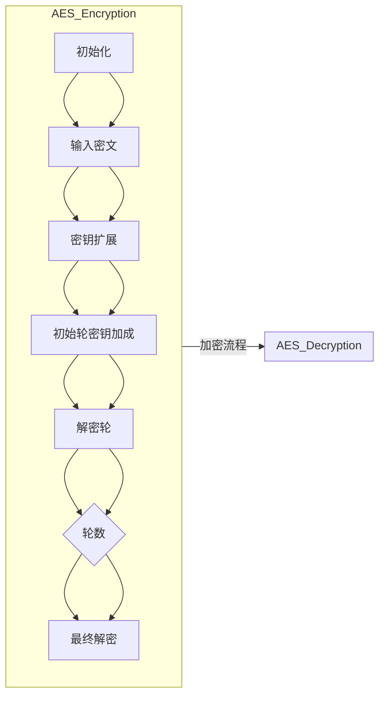
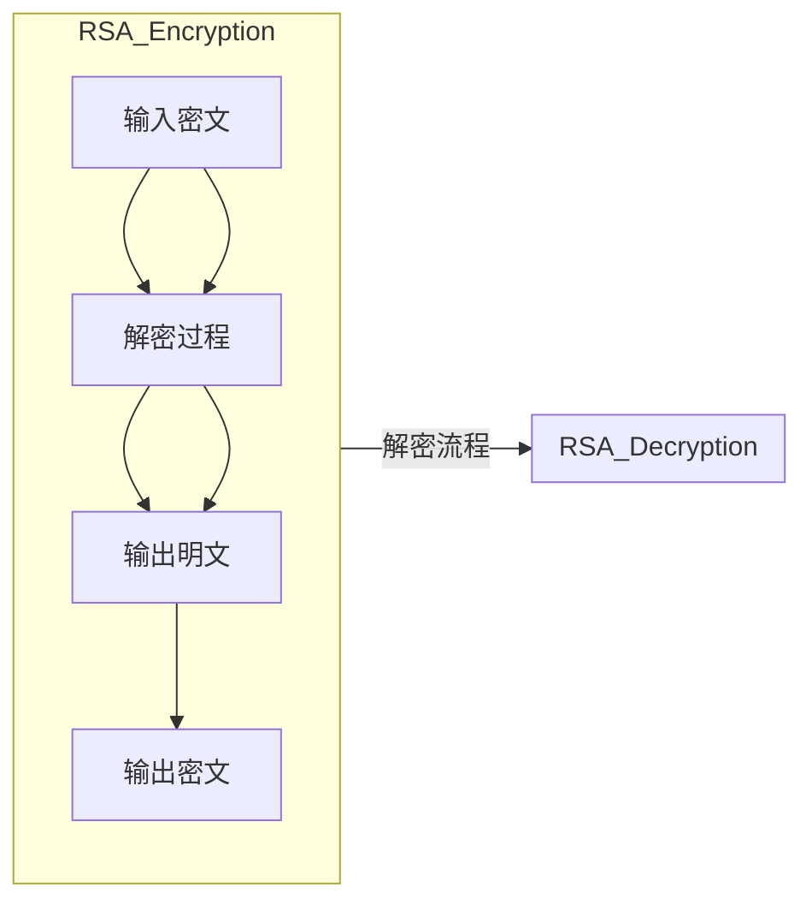
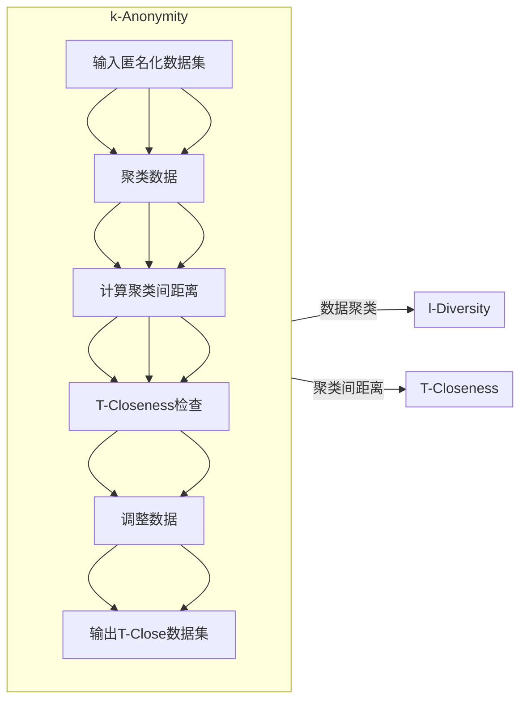
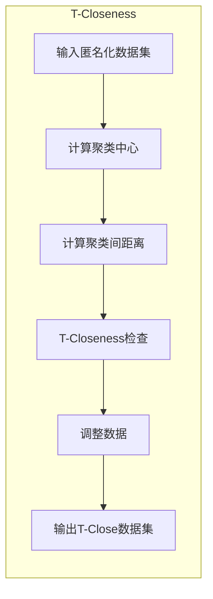
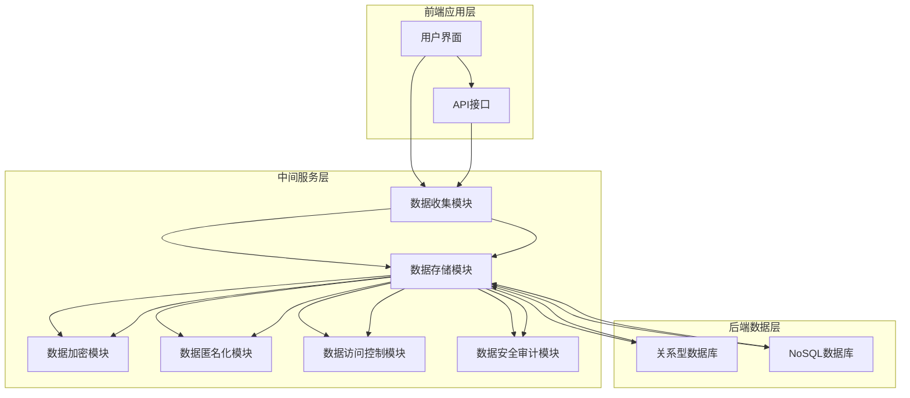
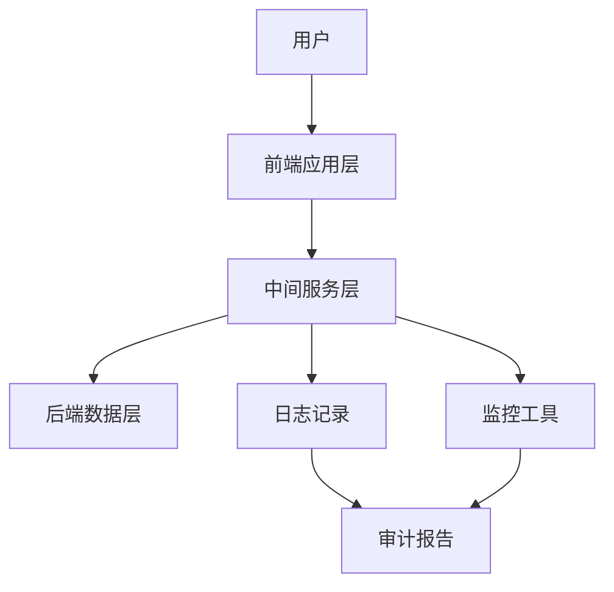

                 

## 引言

### 1.1 问题背景

在人工智能（AI）迅猛发展的今天，个人数据的隐私与安全成为了不可忽视的重要议题。人工智能技术依赖于大量的数据来进行训练和学习，这些数据往往包含了用户的个人隐私信息，如姓名、地址、电话号码、支付信息等。然而，随着数据量的急剧增加和数据处理的复杂性提升，个人数据的隐私保护问题日益凸显。

首先，人工智能与隐私安全的关系紧密相连。人工智能系统在处理和存储大量个人数据时，容易成为黑客攻击的目标。一旦隐私数据泄露，不仅会对个人造成极大的经济损失，还可能导致名誉受损，甚至引发更深层次的信任危机。例如，2018年的Facebook数据泄露事件，使得数千万用户的个人信息被非法获取和利用，引发了全球范围内的隐私安全担忧。

其次，个人数据保护的挑战主要来源于以下几个方面：

1. **数据泄露的风险**：随着数据量的增加和存储方式的多样化，数据泄露的风险也在不断上升。例如，未经授权的访问、系统漏洞、恶意软件攻击等，都可能成为数据泄露的途径。

2. **数据滥用的可能性**：个人数据一旦被收集，就可能被用于未经用户同意的商业目的或其他不当用途。例如，数据被用于个性化广告推送、信用评估、社会工程学等，都可能对个人隐私造成威胁。

3. **法律法规与标准的缺失**：尽管全球多个国家和地区已经出台了相关的隐私保护法律和标准，但仍然存在一定的盲区和冲突。例如，不同法律体系之间的隐私保护标准和执行力度存在差异，导致跨国数据传输和处理的复杂性增加。

### 1.2 问题描述

个人数据隐私与安全的问题主要表现为以下几个方面：

1. **隐私泄露的风险**：由于人工智能系统对数据的依赖，数据泄露的风险难以完全消除。例如，2017年的Equifax数据泄露事件，就暴露了1.43亿用户的敏感信息，造成了巨大的社会影响。

2. **数据滥用的问题**：个人数据一旦被收集，就存在被滥用的风险。例如，消费者的购买行为和偏好数据被用于精准广告推送，甚至被用于政治操控。

3. **法律法规与标准的不足**：尽管全球多个国家和地区已经出台了相关的隐私保护法律和标准，但仍然存在一定的盲区和冲突。例如，GDPR（欧盟通用数据保护条例）虽然对个人数据的保护提供了强有力的保障，但在全球范围内的执行力度和标准尚不统一。

### 1.3 本书的目的与结构

本书旨在深入探讨人工智能时代下的个人数据隐私与安全问题，为读者提供全面的解决方案和技术手段。全书结构分为三个主要部分：

1. **背景介绍**：介绍人工智能与隐私安全的关系，分析个人数据保护的挑战和解决方案。

2. **核心概念与联系**：详细阐述隐私安全的核心概念，包括隐私的定义、安全的属性以及个人数据保护的关键要素。

3. **算法原理讲解**：介绍数据加密和数据匿名化算法的原理，包括常见加密算法的工作原理、匿名化算法的分类和应用。

通过本书的阅读，读者将能够全面了解个人数据隐私与安全的重要性和实现方法，为实际应用提供有力的技术支持。

### 1.4 边界与外延

在讨论个人数据隐私与安全时，我们需要明确一些边界与外延的概念，以便更准确地理解这一领域的内涵和外延。

#### 1.4.1 个人数据定义的边界

个人数据通常指的是与特定个人相关的信息，包括但不限于姓名、身份证号码、电话号码、电子邮件地址、住址、医疗记录、金融信息等。个人数据的具体定义可能因国家和地区而异，但普遍认为，只要数据能够单独或与其他信息结合识别特定个人，就属于个人数据。

在人工智能领域，个人数据的边界尤为重要，因为人工智能系统依赖于大量的数据来进行训练和优化。例如，在面部识别技术中，用户的面部图像数据就是重要的个人数据。如果这些数据未能得到妥善保护，就可能被黑客攻击或滥用。

#### 1.4.2 隐私安全的范畴

隐私安全是指保护个人数据不被未经授权的访问、使用、泄露、篡改或破坏的一系列措施。隐私安全的范畴广泛，包括数据收集、存储、处理、传输和销毁等各个环节。具体来说，隐私安全的范畴包括以下几个方面：

1. **访问控制**：确保只有授权用户能够访问敏感数据，通过用户身份验证、权限管理和访问日志记录等手段实现。

2. **加密技术**：使用加密算法对敏感数据进行加密，防止数据在传输或存储过程中被窃取或篡改。

3. **数据匿名化**：通过数据脱敏、混淆等技术，将个人数据转换为无法直接识别的形式，以减少数据泄露的风险。

4. **数据安全策略**：制定并实施严格的数据安全策略，包括数据备份、灾难恢复、安全审计等，以确保数据的安全性。

5. **法律法规的遵守**：遵守相关的隐私保护法律法规，如GDPR、CCPA等，确保数据处理的合法性和合规性。

#### 1.4.3 新挑战的应对策略

随着人工智能技术的不断发展，个人数据隐私与安全面临的新挑战不断涌现。以下是一些应对新挑战的策略：

1. **技术手段的升级**：随着攻击手段的不断演变，隐私保护技术也需要不断升级。例如，采用更先进的加密算法、实现更高效的数据匿名化技术、引入基于行为分析的异常检测机制等。

2. **法律法规的完善**：完善隐私保护法律法规，确保其与技术的发展同步。例如，针对新兴技术制定专门的隐私保护法律，加强对跨境数据传输的监管等。

3. **企业自律与责任**：企业应加强内部数据管理，建立健全的数据安全管理制度，明确数据保护责任，确保数据处理的合法性和合规性。

4. **公众意识的提升**：提高公众的隐私保护意识，通过教育、宣传等方式，让用户了解隐私保护的重要性，并学会如何保护自己的个人信息。

5. **多方合作与交流**：加强政府、企业、学术界和研究机构的合作与交流，共同应对个人数据隐私与安全的新挑战，推动隐私保护技术的创新与发展。

### 1.5 概念结构与核心要素组成

在深入探讨个人数据隐私与安全之前，我们需要明确几个核心概念，并了解它们之间的结构关系和核心要素组成。

#### 1.5.1 个人数据

个人数据是指与特定个人相关的信息，包括但不限于姓名、身份证号码、电话号码、电子邮件地址、住址、医疗记录、金融信息等。个人数据的类型多样，但通常可以分为敏感数据和非敏感数据：

1. **敏感数据**：敏感数据是指可能对个人隐私和安全造成较大影响的数据，如身份证号码、医疗记录、金融信息等。敏感数据的泄露或滥用可能会对个人造成严重损失。

2. **非敏感数据**：非敏感数据是指对个人隐私和安全影响较小的数据，如用户名、电子邮件地址等。虽然非敏感数据的泄露风险相对较低，但仍然需要得到妥善保护。

个人数据的处理流程通常包括以下环节：

1. **数据收集**：企业或机构通过合法途径收集用户数据，如用户注册、问卷调查、在线交易等。

2. **数据存储**：将收集到的数据存储在数据库或云存储中，确保数据的长期保存和可靠访问。

3. **数据处理**：对存储的数据进行加工、分析和处理，以满足业务需求和优化用户体验。

4. **数据共享**：在某些情况下，企业可能需要将数据与其他企业或机构共享，如数据合作、市场调研等。

5. **数据销毁**：在数据不再需要或达到保留期限后，进行数据销毁，确保数据无法被恢复。

#### 1.5.2 隐私安全

隐私安全是指保护个人数据不被未经授权的访问、使用、泄露、篡改或破坏的一系列措施。隐私安全的结构通常包括以下几个方面：

1. **访问控制**：通过用户身份验证、权限管理和访问日志记录等手段，确保只有授权用户能够访问敏感数据。

2. **加密技术**：使用加密算法对敏感数据进行加密，防止数据在传输或存储过程中被窃取或篡改。

3. **数据匿名化**：通过数据脱敏、混淆等技术，将个人数据转换为无法直接识别的形式，以减少数据泄露的风险。

4. **数据安全策略**：制定并实施严格的数据安全策略，包括数据备份、灾难恢复、安全审计等，以确保数据的安全性。

5. **法律法规的遵守**：遵守相关的隐私保护法律法规，如GDPR、CCPA等，确保数据处理的合法性和合规性。

#### 1.5.3 隐私安全的核心要素

隐私安全的核心要素包括以下几个方面：

1. **数据分类**：根据数据的重要性和敏感性，对数据进行分类，以便采取相应的安全措施。

2. **数据处理规范**：制定数据处理规范，明确数据收集、存储、处理、传输和销毁的标准和流程。

3. **数据安全措施**：采用加密技术、访问控制、数据备份等安全措施，确保数据的安全性。

4. **法律法规的遵守**：遵守相关的隐私保护法律法规，确保数据处理的合法性和合规性。

5. **公众意识提升**：通过教育和宣传，提高公众的隐私保护意识，让用户了解隐私保护的重要性，并学会如何保护自己的个人信息。

#### 1.5.4 核心概念对比表格

为了更清晰地理解个人数据、隐私安全以及数据处理流程等核心概念，我们可以通过以下对比表格进行说明：

| 核心概念 | 定义 | 关联关系 |
| --- | --- | --- |
| 个人数据 | 与特定个人相关的信息 | 隐私安全的保护对象 |
| 敏感数据 | 可能对个人隐私和安全造成较大影响的数据 | 需要严格保护的数据类型 |
| 非敏感数据 | 对个人隐私和安全影响较小的数据 | 需要适当保护的数据类型 |
| 数据安全 | 保护个人数据不被未经授权的访问、使用、泄露、篡改或破坏 | 隐私安全的重要组成部分 |
| 加密技术 | 使用加密算法对敏感数据进行加密 | 确保数据在传输或存储过程中的安全性 |
| 数据匿名化 | 通过数据脱敏、混淆等技术，将个人数据转换为无法直接识别的形式 | 减少数据泄露的风险 |
| 数据处理流程 | 数据的收集、存储、处理、传输和销毁的标准和流程 | 确保数据的安全性和合规性 |

通过上述对比表格，我们可以更清晰地了解各个核心概念之间的关联关系和内涵。

### 1.6 本章小结

在本章中，我们介绍了人工智能时代下个人数据隐私与安全的重要性，分析了隐私泄露、数据滥用以及法律法规缺失等问题。同时，我们明确了个人数据定义的边界、隐私安全的范畴，并提出了应对新挑战的策略。此外，我们还阐述了个人数据与隐私安全的核心概念和结构，通过对比表格和ER实体关系图，进一步加深了读者对这些概念的理解。本章的内容为后续章节的深入探讨奠定了坚实的基础。

## 2.1 隐私安全的核心概念

在探讨隐私安全之前，我们需要明确几个核心概念，包括隐私、安全以及隐私安全之间的关联。这些概念不仅构成了隐私安全的理论基础，也是我们在实践中保护个人数据的重要依据。

### 2.1.1 隐私的定义

隐私是一个广泛且多层次的概念，通常指的是个人在信息处理过程中对其个人信息的控制权和自主权。隐私不仅仅涉及个人的物理空间，还包括个人的思想、情感、行为和身份等信息。具体来说，隐私的定义可以从以下几个方面来理解：

1. **法律定义**：不同国家和地区对隐私的定义有所不同。例如，欧盟《通用数据保护条例》（GDPR）将隐私定义为“个人对其个人数据的控制权”，强调了个人对数据的知情权、访问权、纠正权和删除权。而美国《加州消费者隐私法》（CCPA）则将隐私定义为“个人对其个人信息的控制权，包括信息收集、使用、共享和披露的知情权和选择权”。

2. **理解与内涵**：从广义上讲，隐私不仅包括个人信息，还涉及到个人的社会关系、生活习惯、健康状况等。隐私的内涵十分丰富，既包括个体的私人空间和私人事务，也包括个体在信息处理过程中的自主权和控制权。

3. **隐私的本质**：隐私的本质在于个人对其信息的掌控能力。在信息社会中，隐私的威胁主要来自于信息收集、处理和传输过程中的不当行为。因此，隐私的定义不仅需要考虑到信息的保护，还需要关注信息处理过程中对个人权利和利益的保障。

### 2.1.2 安全的定义

安全是指保护某个对象（如系统、数据、网络等）免受威胁和攻击的能力。在隐私安全的背景下，安全涉及到对个人数据的保护，防止未经授权的访问、使用、泄露、篡改或破坏。具体来说，安全可以定义为以下几个方面：

1. **安全的概念**：安全是一种状态，表示系统或数据在不受威胁和攻击的情况下正常运行。安全不仅仅是一种技术手段，还包括管理、政策和法律等多个层面。

2. **安全的属性**：安全具有以下几个基本属性：
   - **机密性**：确保信息在传输或存储过程中不被未授权的人员获取。
   - **完整性**：确保信息在传输或存储过程中不被篡改或破坏。
   - **可用性**：确保信息在需要时可以被授权用户访问和使用。
   - **抗抵赖性**：确保信息的行为可以追溯到具体的操作者，防止抵赖。

3. **安全的层次**：安全可以划分为多个层次，包括物理安全、网络安全、数据安全等。每个层次都有其特定的保护措施和技术手段。

### 2.1.3 隐私与安全的关系

隐私和安全是密切相关的概念，它们之间存在以下几方面的联系：

1. **隐私是安全的基础**：隐私的保障依赖于安全措施的有效实施。如果没有安全措施的保护，个人数据很容易被窃取、篡改或泄露，从而侵犯个人隐私。

2. **安全是实现隐私的保障**：安全的目的是保护个人数据，确保其不被未经授权的人员访问或使用。只有当数据得到充分保护时，个人隐私才能得到有效保障。

3. **隐私和安全的目标一致**：隐私和安全的目标都是保障个人权利和利益，防止个人数据被滥用或泄露。尽管两者关注的侧重点有所不同，但都是为了实现更高的数据保护水平。

4. **隐私和安全相互依赖**：隐私和安全是相互依存的。没有安全的保障，隐私就无法实现；而没有隐私的保护，安全也会失去其意义。

### 2.1.4 隐私安全的重要性

隐私安全在现代社会中具有重要意义，主要体现在以下几个方面：

1. **个人权利的保障**：隐私安全是个人基本权利的体现，保障了个人对其信息的控制权和自主权。

2. **社会稳定的维护**：隐私泄露和数据滥用可能导致社会信任危机，损害社会稳定。

3. **经济发展的影响**：隐私安全问题对数字经济的发展具有重要影响。数据泄露不仅损害用户利益，还可能导致企业声誉受损，影响市场竞争力。

4. **法律法规的要求**：随着隐私保护法律法规的不断完善，企业需要遵守相关法规，确保数据处理合法合规。

5. **技术发展的推动**：隐私安全问题推动了安全技术的研究和发展，促进了相关技术的创新和进步。

### 2.1.5 隐私安全的实现手段

隐私安全的实现手段包括以下几个方面：

1. **加密技术**：加密是保护隐私和数据安全的重要手段，通过对数据进行加密，防止未授权的访问和窃取。

2. **访问控制**：通过用户身份验证、权限管理和访问日志记录等手段，确保只有授权用户能够访问敏感数据。

3. **数据匿名化**：通过数据脱敏、混淆等技术，将个人数据转换为无法直接识别的形式，以减少数据泄露的风险。

4. **数据安全策略**：制定并实施严格的数据安全策略，包括数据备份、灾难恢复、安全审计等，以确保数据的安全性。

5. **法律法规的遵守**：遵守相关的隐私保护法律法规，确保数据处理的合法性和合规性。

通过上述手段的综合运用，可以实现有效的隐私安全保护，为个人数据提供全方位的保护。

### 2.1.6 案例分析：Facebook数据泄露事件

为了更直观地理解隐私安全的重要性，我们可以通过一个典型的案例分析——Facebook数据泄露事件，来探讨隐私安全在现实世界中的实际应用。

**事件背景**：2018年，Facebook爆发了严重的用户数据泄露事件，涉及8700万用户的个人信息被非法获取和利用。这些个人信息包括用户姓名、电话号码、电子邮件地址、出生日期、位置信息等。

**事件经过**：Facebook的数据泄露事件是由于一家名为Cambridge Analytica的咨询公司未经用户同意，非法获取了大量用户数据，并将其用于政治广告投放和选民行为分析。这一事件曝光后，引起了全球范围内的广泛关注和讨论。

**影响与后果**：Facebook数据泄露事件不仅导致了用户的隐私权受到侵犯，还引发了广泛的信任危机，严重损害了Facebook的声誉。此外，这一事件也引发了全球范围内的数据隐私保护立法浪潮，推动了各国隐私保护法律法规的完善。

**隐私安全的启示**：从Facebook数据泄露事件中，我们可以得到以下几点隐私安全的启示：

1. **用户数据保护的重要性**：用户数据是现代互联网企业的重要资产，但也是隐私安全的重要风险点。企业需要高度重视用户数据的保护，确保数据处理合法合规。

2. **数据匿名化和加密技术的应用**：数据匿名化和加密技术是保护用户隐私的有效手段。通过数据脱敏和加密，可以大大降低数据泄露的风险。

3. **法律法规的遵守**：企业需要严格遵守相关的隐私保护法律法规，确保数据处理的合法性和合规性。特别是在跨境数据传输和处理过程中，需要关注不同国家和地区的法律差异。

4. **用户意识教育的加强**：提高用户的隐私保护意识，让用户了解隐私保护的重要性和方法，是保护个人隐私的基础。

通过这个案例分析，我们可以更深入地理解隐私安全在现实世界中的实际应用和重要性，为未来的隐私保护工作提供有益的参考。

## 2.2 个人数据保护的关键要素

在探讨个人数据保护的策略和措施时，我们需要明确几个关键要素，这些要素构成了个人数据保护的基础，也是实现隐私安全的必要条件。以下将详细介绍这些关键要素：

### 2.2.1 数据分类

数据分类是个人数据保护的第一步，它有助于识别数据的重要性和敏感性。根据数据对个人隐私的影响程度，可以将数据分为以下几类：

1. **敏感数据**：敏感数据是指可能对个人隐私和安全造成严重威胁的数据，如身份证号码、银行账户信息、医疗记录、个人通信记录等。敏感数据一旦泄露，可能导致严重的隐私侵犯和经济损失。

2. **非敏感数据**：非敏感数据是指对个人隐私影响较小的数据，如用户名、电子邮件地址、电话号码等。虽然非敏感数据的泄露风险相对较低，但在某些情况下，也可能被用于身份盗用或其他不当用途。

在进行数据分类时，需要综合考虑数据的来源、用途、访问权限以及数据量等因素。通过数据分类，可以更好地实施针对性的安全措施，提高数据保护的效率。

### 2.2.2 数据处理规范

数据处理规范是指企业在收集、存储、使用、共享和销毁个人数据时需要遵循的一系列标准和规则。一个完善的数据处理规范有助于确保数据处理的合法性和合规性，以下是几个关键环节：

1. **数据收集**：企业在收集个人数据时，必须遵循合法、正当、必要的原则，确保收集的数据类型和范围符合用户需求和法律法规的要求。同时，企业应明确告知用户数据的收集目的、使用方式和数据保留期限。

2. **数据存储**：企业需要确保存储的数据安全，防止数据泄露、篡改或丢失。这包括采用加密技术对敏感数据进行加密存储，定期备份数据，确保数据恢复能力等。

3. **数据处理**：在数据处理过程中，企业应遵循最小化原则，只处理与业务需求相关的数据，避免不必要的数据处理操作。此外，企业还应采取数据匿名化等技术手段，降低数据泄露的风险。

4. **数据共享**：企业需要谨慎对待数据共享行为，确保在数据共享过程中遵守法律法规和用户隐私保护要求。数据共享应遵循最小化原则，仅共享必要数据，并确保共享数据的安全性。

5. **数据销毁**：在数据不再需要或达到保留期限后，企业应采取有效的数据销毁措施，确保数据无法被恢复。常用的数据销毁方法包括物理销毁（如硬盘销毁）、数据擦除和数字粉碎等。

### 2.2.3 数据安全措施

数据安全措施是指用于保护个人数据免受未授权访问、使用、泄露、篡改或破坏的一系列技术和管理手段。以下是一些常见的数据安全措施：

1. **加密技术**：加密是保护数据安全的重要手段，通过对数据进行加密，确保数据在传输和存储过程中不被窃取或篡改。常见的加密技术包括对称加密（如AES）和非对称加密（如RSA）。

2. **访问控制**：访问控制是通过用户身份验证、权限管理和访问日志记录等手段，确保只有授权用户能够访问敏感数据。访问控制可以细粒度地管理用户权限，防止未经授权的访问。

3. **数据备份和恢复**：数据备份和恢复是确保数据安全性和可用性的重要措施。企业应定期备份数据，确保在数据丢失或损坏时能够快速恢复。

4. **数据匿名化**：数据匿名化是通过脱敏、混淆等技术手段，将个人数据转换为无法直接识别的形式，以减少数据泄露的风险。常见的匿名化技术包括数据扰动、数据合成等。

5. **安全审计**：安全审计是对企业数据安全策略和措施进行定期检查和评估的过程。通过安全审计，可以及时发现和纠正安全隐患，确保数据安全策略的有效实施。

### 2.2.4 法律法规的遵守

遵守相关法律法规是个人数据保护的重要保障。不同国家和地区对个人数据保护有不同的法律法规和标准，以下是一些常见的隐私保护法律法规：

1. **通用数据保护条例（GDPR）**：GDPR是欧盟出台的一项重要隐私保护法律，对个人数据的收集、处理、存储和传输提出了严格要求。GDPR强调了用户对个人数据的控制权，包括数据访问权、纠正权和删除权。

2. **加州消费者隐私法（CCPA）**：CCPA是加利福尼亚州出台的一项隐私保护法律，旨在保护加州居民的隐私权。CCPA要求企业在收集、使用和共享消费者数据时，需遵循一系列透明度和告知义务。

3. **健康保险可携性和责任法案（HIPAA）**：HIPAA是美国的一项医疗隐私保护法律，旨在保护患者医疗记录的隐私和安全。HIPAA对医疗机构的医疗数据处理提出了严格的要求。

4. **个人信息保护法（PIPA）**：PIPA是中国出台的一项隐私保护法律，旨在保护个人信息的安全和隐私。PIPA对个人信息处理活动进行了全面规范，要求企业采取必要措施保护个人信息。

企业在进行数据处理时，需要严格遵守相关法律法规的要求，确保数据处理的合法性和合规性。特别是在跨境数据传输和处理过程中，需要关注不同国家和地区的法律差异，采取相应的合规措施。

### 2.2.5 公众意识的提升

公众意识的提升是个人数据保护的重要环节。提高公众的隐私保护意识，让用户了解隐私保护的重要性和方法，有助于减少隐私泄露事件的发生。以下是一些提升公众隐私保护意识的方法：

1. **隐私保护教育**：通过学校教育、企业培训、公众讲座等形式，向公众普及隐私保护知识，提高公众的隐私意识。

2. **隐私政策解读**：企业应提供简单易懂的隐私政策，让用户了解其数据被如何收集、使用和共享，以便用户做出明智的决策。

3. **用户隐私指南**：企业应提供详细的用户隐私指南，指导用户如何设置隐私选项、管理个人信息等。

4. **隐私保护宣传**：通过媒体宣传、公益活动等形式，提高公众对隐私保护的重视，营造全社会共同关注隐私保护的氛围。

5. **隐私泄露预警**：建立隐私泄露预警机制，及时向用户通报潜在的隐私泄露风险，指导用户采取相应的防护措施。

通过以上方法，可以提高公众的隐私保护意识，促进个人数据保护工作的开展。

### 2.2.6 对比表格：敏感数据与非敏感数据

为了更直观地了解敏感数据与非敏感数据的特点和区别，我们通过以下对比表格进行说明：

| 类别 | 定义 | 特点 | 保护措施 |
| --- | --- | --- | --- |
| 敏感数据 | 可能对个人隐私和安全造成严重威胁的数据 | 信息量较大、涉及个人隐私和财产安全 | 高强度加密、严格访问控制、定期安全审计 |
| 非敏感数据 | 对个人隐私影响较小的数据 | 信息量相对较小、非核心隐私信息 | 适当加密、基础访问控制、定期数据备份 |

通过上述对比表格，我们可以更清晰地了解敏感数据与非敏感数据的特点和区别，从而采取相应的保护措施，确保数据的安全性。

### 2.2.7 ER实体关系图

为了更好地理解个人数据管理中的实体关系，我们通过ER（实体关系）图来展示各个实体之间的关系和属性。

以下是一个简化的ER实体关系图，用于描述个人数据管理中的主要实体和关系：

```mermaid
erDiagram
  User ||--|{ PersonalInfo : 包含 }
  User ||--|{ Address : 包含 }
  User ||--|{ PaymentInfo : 包含 }
  PersonalInfo ||--|{ Name : 姓名 }
  PersonalInfo ||--|{ BirthDate : 出生日期 }
  Address ||--|{ Street : 街道 }
  Address ||--|{ City : 城市 }
  Address ||--|{ State : 状态 }
  Address ||--|{ ZipCode : 邮编 }
  PaymentInfo ||--|{ CardNumber : 信用卡号 }
  PaymentInfo ||--|{ ExpiryDate : 失效日期 }
  PaymentInfo ||--|{ CVV : 安全码 }
```

在上面的ER图中，`User`实体是核心实体，代表了个人用户。`PersonalInfo`、`Address`和`PaymentInfo`是`User`实体的关联实体，分别代表用户的个人信息、地址信息和支付信息。每个关联实体都有自己的属性，如`PersonalInfo`实体的属性包括姓名和出生日期，`Address`实体的属性包括街道、城市、状态和邮编，`PaymentInfo`实体的属性包括信用卡号、失效日期和安全码。

通过ER实体关系图，我们可以清晰地看到各个实体之间的关系和属性，有助于理解和设计个人数据管理系统的架构。

### 2.2.8 本章小结

在本章中，我们详细介绍了个人数据保护的关键要素，包括数据分类、数据处理规范、数据安全措施、法律法规的遵守以及公众意识的提升。通过对比表格和ER实体关系图，我们更清晰地理解了敏感数据与非敏感数据的区别，以及个人数据管理中的实体关系。这些关键要素构成了个人数据保护的基础，为后续章节的隐私安全策略和技术手段的探讨提供了重要的理论支持。

## 3.1 数据加密算法

在讨论个人数据隐私保护时，数据加密算法是至关重要的一环。加密技术通过对数据进行编码，使得未经授权的个体无法理解和利用数据，从而有效地保护个人数据的隐私和安全。在本节中，我们将详细介绍常见的数据加密算法，包括对称加密和非对称加密，并探讨它们的工作原理、性能评估以及应用场景。

### 3.1.1 常见加密算法

数据加密算法根据加密方法的不同，主要分为对称加密和非对称加密两种类型。每种加密方法都有其独特的原理和应用场景。

#### 3.1.1.1 对称加密

对称加密是一种加密算法，其加密和解密使用相同的密钥。常见的对称加密算法包括以下几种：

1. **AES（高级加密标准）**

   AES是当前最广泛使用的对称加密算法，其设计目标是提供高效、安全的加密机制。AES支持三种密钥长度：128位、192位和256位，对应的加密轮数为10轮、12轮和14轮。AES因其高效的性能和安全性，被广泛应用于政府、金融和企业领域。

2. **DES（数据加密标准）**

   DES是一种早期的对称加密算法，使用56位密钥，对数据进行加密和解密。尽管DES曾经是标准的加密算法，但由于其密钥长度较短，现代计算机可以在短时间内破解，因此逐渐被AES取代。

#### 3.1.1.2 非对称加密

非对称加密是一种加密算法，其加密和解密使用不同的密钥，分别是公钥和私钥。常见的非对称加密算法包括以下几种：

1. **RSA（Rivest-Shamir-Adleman）**

   RSA是目前最流行的非对称加密算法，其安全性基于大整数分解的数学难题。RSA使用一对密钥：公钥用于加密，私钥用于解密。RSA支持多种密钥长度，常见的有1024位、2048位和4096位。

2. **ECC（椭圆曲线加密）**

   ECC是一种基于椭圆曲线离散对数问题的非对称加密算法。与RSA相比，ECC在提供相同安全性的情况下，具有更短的密钥长度和更高的加密速度。因此，ECC在移动设备和物联网等资源受限的场景中得到了广泛应用。

### 3.1.2 加密算法的工作原理

了解加密算法的工作原理有助于我们更好地理解其性能和安全性。以下是几种常见加密算法的工作原理：

#### 3.1.2.1 对称加密的工作原理

对称加密算法使用一个密钥对数据进行加密和解密。具体过程如下：

1. **密钥生成**：首先生成一对密钥，即加密密钥和解密密钥。加密密钥用于加密数据，解密密钥用于解密数据。
   
2. **加密过程**：加密者使用加密密钥将明文数据转换为密文。加密过程通常包括将数据分割成小块，并对每一块进行加密运算。
   
3. **解密过程**：解密者使用解密密钥将密文数据转换为明文。解密过程与加密过程相反，使用相同的密钥和加密算法。

对称加密算法的优点是加密和解密速度快，计算成本低。但缺点是密钥管理复杂，密钥传输过程中存在安全隐患。

#### 3.1.2.2 非对称加密的工作原理

非对称加密算法使用一对密钥：公钥和私钥。具体过程如下：

1. **密钥生成**：首先生成一对密钥，公钥用于加密数据，私钥用于解密数据。公钥可以公开传输，私钥需要妥善保管。
   
2. **加密过程**：加密者使用公钥将明文数据加密成密文。由于公钥公开，加密过程可以在不泄露私钥的情况下进行。
   
3. **解密过程**：解密者使用私钥将密文数据解密成明文。由于私钥保密，解密过程只能由解密者完成。

非对称加密算法的优点是解决了密钥管理难题，可以在不安全信道中安全传输密钥。但缺点是加密和解密速度相对较慢，计算成本较高。

### 3.1.3 加密算法的性能评估

加密算法的性能评估主要从加密速度、加密强度和密钥管理等方面进行。

#### 3.1.3.1 加密速度

加密速度是衡量加密算法性能的重要指标，通常用位每秒（bits per second，bps）或字节每秒（bytes per second，Bps）表示。对称加密算法因其简单的加密过程，通常具有更高的加密速度。例如，AES算法可以在现代处理器上实现高达几Gbps的加密速度。相比之下，非对称加密算法由于复杂的加密过程，加密速度相对较慢。例如，RSA算法在2048位密钥下，加密速度通常在几百bps到几千bps之间。

#### 3.1.3.2 加密强度

加密强度是衡量加密算法安全性的重要指标，通常用密钥长度和加密算法的安全性来衡量。对称加密算法的安全性与密钥长度密切相关，密钥长度越长，安全性越高。例如，AES-256比AES-128具有更高的安全性。非对称加密算法的安全性不仅与密钥长度有关，还与加密算法的数学基础有关。例如，RSA算法的安全性基于大整数分解问题，ECC算法的安全性基于椭圆曲线离散对数问题。通常情况下，相同安全级别的ECC算法具有更短的密钥长度，因此具有更高的加密强度。

#### 3.1.3.3 密钥管理

密钥管理是加密安全的关键环节，包括密钥生成、存储、传输和销毁等。对称加密算法的密钥管理相对简单，因为加密和解密使用相同的密钥。但对称加密算法的密钥传输过程存在安全隐患，因为密钥一旦泄露，加密数据将被破解。非对称加密算法通过公钥和私钥的分离，解决了密钥传输的安全问题。但非对称加密算法的密钥管理相对复杂，需要确保私钥的安全存储和保密，同时需要定期更换密钥，以防止私钥泄露。

### 3.1.4 应用场景

根据加密算法的性能特点和应用需求，不同加密算法适用于不同的应用场景。

#### 3.1.4.1 对称加密的应用场景

对称加密算法因其高效性和计算成本低，适用于以下场景：

1. **数据传输**：对称加密算法可以用于加密网络传输的数据，确保数据在传输过程中不被窃取或篡改。例如，SSL/TLS协议使用AES算法对HTTPS数据进行加密。

2. **文件存储**：对称加密算法可以用于加密存储的文件，确保文件在存储过程中不被未授权访问。例如，磁盘加密软件使用AES算法对硬盘数据进行加密。

3. **本地通信**：对称加密算法可以用于加密本地通信数据，确保数据在本地网络中不被窃听。例如，VPN（虚拟专用网络）使用AES算法加密网络数据包。

#### 3.1.4.2 非对称加密的应用场景

非对称加密算法因其密钥管理简便性和安全性高，适用于以下场景：

1. **密钥交换**：非对称加密算法可以用于安全的密钥交换，确保通信双方在公共网络中交换密钥。例如，SSL/TLS协议使用RSA算法进行密钥交换。

2. **数字签名**：非对称加密算法可以用于数字签名，确保数据的完整性和真实性。例如，电子邮件使用RSA算法进行数字签名。

3. **认证**：非对称加密算法可以用于身份认证，确保通信双方的身份验证。例如，智能卡使用RSA算法进行身份认证。

### 3.1.5 小结

数据加密算法在个人数据隐私保护中发挥着至关重要的作用。对称加密算法因其高效的加密速度和计算成本低，适用于数据传输和文件存储等场景。非对称加密算法因其密钥管理简便性和安全性高，适用于密钥交换、数字签名和身份认证等场景。通过合理选择和应用加密算法，可以有效地保护个人数据的隐私和安全。

### 3.1.6 加密算法的Python实现

为了更直观地理解加密算法的原理和应用，我们将在Python中实现AES和RSA算法，并进行加密和解密操作。

首先，我们需要安装`pycryptodome`库，这是一个常用的Python加密库，提供了多种加密算法的实现。

```python
pip install pycryptodome
```

#### 3.1.6.1 AES算法

AES是一种对称加密算法，我们使用`pycryptodome`库中的`AES`类来实现。

```python
from Crypto.Cipher import AES
from Crypto.Random import get_random_bytes

# AES加密
def aes_encrypt(plain_text, key):
    cipher = AES.new(key, AES.MODE_EAX)
    ciphertext, tag = cipher.encrypt_and_digest(plain_text)
    return ciphertext, tag

# AES解密
def aes_decrypt(ciphertext, tag, key):
    cipher = AES.new(key, AES.MODE_EAX, nonce=cipher.nonce)
    plain_text = cipher.decrypt_and_verify(ciphertext, tag)
    return plain_text

# 生成随机密钥
key = get_random_bytes(16)  # AES密钥长度为16字节

# 明文数据
plain_text = b"Hello, World!"

# 加密
ciphertext, tag = aes_encrypt(plain_text, key)

# 解密
decrypted_text = aes_decrypt(ciphertext, tag, key)

print("原始文本:", plain_text.decode())
print("加密文本:", ciphertext.hex())
print("解密文本:", decrypted_text.decode())
```

在上面的代码中，我们首先导入了`Crypto.Cipher`和`Crypto.Random`模块。`aes_encrypt`函数用于加密明文数据，`aes_decrypt`函数用于解密密文数据。我们使用`get_random_bytes`函数生成一个随机密钥，然后将明文数据加密和解密。

#### 3.1.6.2 RSA算法

RSA是一种非对称加密算法，我们使用`pycryptodome`库中的`RSA`类来实现。

```python
from Crypto.PublicKey import RSA
from Crypto.Cipher import PKCS1_OAEP

# RSA加密
def rsa_encrypt(plain_text, public_key):
    cipher = PKCS1_OAEP.new(public_key)
    ciphertext = cipher.encrypt(plain_text)
    return ciphertext

# RSA解密
def rsa_decrypt(ciphertext, private_key):
    cipher = PKCS1_OAEP.new(private_key)
    plain_text = cipher.decrypt(ciphertext)
    return plain_text

# 生成RSA密钥对
key = RSA.generate(2048)

private_key = key.export_key()
public_key = key.publickey().export_key()

# 明文数据
plain_text = b"Hello, World!"

# 加密
ciphertext = rsa_encrypt(plain_text, public_key)

# 解密
decrypted_text = rsa_decrypt(ciphertext, private_key)

print("原始文本:", plain_text.decode())
print("加密文本:", ciphertext.hex())
print("解密文本:", decrypted_text.decode())
```

在上面的代码中，我们首先导入了`Crypto.PublicKey`和`Crypto.Cipher.PKCS1_OAEP`模块。`rsa_encrypt`函数用于加密明文数据，`rsa_decrypt`函数用于解密密文数据。我们使用`RSA.generate`函数生成一个2048位的RSA密钥对，然后将明文数据加密和解密。

通过上述Python代码，我们可以直观地看到AES和RSA算法的加密和解密过程。这不仅有助于理解加密算法的原理，也为实际应用提供了技术支持。

### 3.1.7 加密算法的数学模型和公式

在深入探讨加密算法的原理时，理解其背后的数学模型和公式是非常重要的。以下我们将简要介绍AES和RSA算法的数学模型和公式。

#### 3.1.7.1 AES算法的数学模型

AES算法是基于代数基本操作的，其核心是SubBytes、ShiftRows、MixColumns和AddRoundKey四个步骤。以下是AES加密过程中的关键公式：

1. **SubBytes**：将每个字节替换为另一个字节，这个映射是通过固定的S-Box实现的。S-Box是一个8x8的矩阵，每个元素都是一个字节。

   $$ S(i, j) = S_{ij} $$

   其中，$i$ 和 $j$ 分别表示输入字节的位置，$S_{ij}$ 是S-Box中的对应元素。

2. **ShiftRows**：将每个字节行向右循环移位。

   $$ ShiftRows(i, j) = \begin{cases}
   (i, j+1) & \text{如果 } j \leq 3 \\
   (i, j-1) & \text{如果 } j > 3
   \end{cases} $$

3. **MixColumns**：对每个字节列进行线性变换，这个变换是通过固定矩阵乘法实现的。

   $$ MixColumns(i, j) = \begin{bmatrix}
   2 & 3 & 1 & 1 \\
   1 & 2 & 3 & 1 \\
   1 & 1 & 2 & 3 \\
   3 & 1 & 1 & 2
   \end{bmatrix} \times \begin{bmatrix}
   b_0 \\
   b_1 \\
   b_2 \\
   b_3
   \end{bmatrix} $$

4. **AddRoundKey**：将每个字节与轮密钥进行异或操作。

   $$ AddRoundKey(i, j, k) = i \oplus k $$

   其中，$i$ 是字节本身，$k$ 是轮密钥。

#### 3.1.7.2 RSA算法的数学模型

RSA算法是基于大整数分解问题的，其加密和解密过程涉及素数生成、模运算和指数运算。以下是RSA算法的关键公式：

1. **密钥生成**：
   - 选择两个大素数 $p$ 和 $q$。
   - 计算 $n = p \times q$。
   - 计算 $\phi(n) = (p-1) \times (q-1)$。
   - 选择一个与 $\phi(n)$ 互质的整数 $e$。
   - 计算 $d$，使得 $d \times e \equiv 1 \pmod{\phi(n)}$。

2. **加密**：
   $$ c = m^e \pmod{n} $$

   其中，$m$ 是明文，$c$ 是密文，$e$ 是公钥指数，$n$ 是模数。

3. **解密**：
   $$ m = c^d \pmod{n} $$

   其中，$m$ 是明文，$c$ 是密文，$d$ 是私钥指数，$n$ 是模数。

通过上述数学模型和公式，我们可以更深入地理解AES和RSA算法的加密和解密过程。这不仅有助于我们在理论层面上掌握加密算法的核心原理，也为实际应用中的加密操作提供了明确的指导。

### 3.1.8 例子：AES加密解密

为了更直观地展示AES加密算法的原理，我们将通过一个具体的例子来演示如何使用Python实现AES加密和解密。

首先，我们生成一个随机密钥和一个明文，然后使用AES算法对明文进行加密，并最终解密回原始明文。

```python
from Crypto.Cipher import AES
from Crypto.Random import get_random_bytes

# 生成一个16字节的随机密钥
key = get_random_bytes(16)

# 生成一个8字节的明文
plain_text = get_random_bytes(8)

# 初始化AES加密器
cipher = AES.new(key, AES.MODE_EAX)

# 对明文进行加密
ciphertext, tag = cipher.encrypt_and_digest(plain_text)

# 打印加密结果
print("加密文本:", ciphertext.hex())
print("认证标签:", tag.hex())

# 使用相同的密钥和标签进行解密
cipher = AES.new(key, AES.MODE_EAX, nonce=cipher.nonce)
decrypted_text = cipher.decrypt_and_verify(ciphertext, tag)

# 打印解密结果
print("解密文本:", decrypted_text.hex())

# 检查解密后的明文是否与原始明文相同
assert decrypted_text == plain_text
```

在上面的代码中，我们首先导入了`Crypto.Cipher`和`Crypto.Random`模块。我们使用`get_random_bytes`函数生成一个16字节的随机密钥和一个8字节的明文。然后，我们初始化一个AES加密器，并使用`encrypt_and_digest`方法对明文进行加密，同时生成认证标签。

接下来，我们使用相同的密钥和标签对密文进行解密，并使用`decrypt_and_verify`方法验证解密后的数据是否与原始明文匹配。

通过这个例子，我们可以清晰地看到AES加密和解密的过程，以及如何在Python中实现这些操作。这不仅帮助我们理解了AES算法的工作原理，也为实际应用提供了实用的代码示例。

### 3.1.9 例子：RSA加密解密

为了更好地理解RSA加密算法的工作原理，我们将通过一个具体的例子来演示如何使用Python实现RSA加密和解密。

首先，我们需要生成RSA密钥对，然后使用公钥加密，私钥解密。

```python
from Crypto.PublicKey import RSA
from Crypto.Cipher import PKCS1_OAEP

# 生成RSA密钥对
key = RSA.generate(2048)

private_key = key.export_key()
public_key = key.publickey().export_key()

# 明文数据
plain_text = b"Hello, World!"

# 使用公钥加密
cipher = PKCS1_OAEP.new(RSA.import_key(public_key))
ciphertext = cipher.encrypt(plain_text)

# 打印加密结果
print("加密文本:", ciphertext.hex())

# 使用私钥解密
cipher = PKCS1_OAEP.new(RSA.import_key(private_key))
decrypted_text = cipher.decrypt(ciphertext)

# 打印解密结果
print("解密文本:", decrypted_text.decode())

# 检查解密后的明文是否与原始明文相同
assert decrypted_text == plain_text
```

在上面的代码中，我们首先导入了`Crypto.PublicKey`和`Crypto.Cipher.PKCS1_OAEP`模块。我们使用`RSA.generate`函数生成一个2048位的RSA密钥对。然后，我们定义一个明文`plain_text`，并使用公钥对其进行加密。

接下来，我们使用私钥对密文进行解密，并打印解密结果。最后，我们通过断言检查解密后的明文是否与原始明文相同。

通过这个例子，我们可以清晰地看到RSA加密和解密的过程，以及如何在Python中实现这些操作。这不仅帮助我们理解了RSA算法的工作原理，也为实际应用提供了实用的代码示例。

### 3.1.10 小结

在本节中，我们详细介绍了数据加密算法的核心概念、工作原理、性能评估以及实际应用。通过对AES和RSA算法的深入探讨，我们了解了对称加密和非对称加密的区别和应用场景。我们还通过具体的Python实现和例子，展示了如何在实际中应用这些算法。这些知识不仅帮助我们理解了加密算法的基本原理，也为我们在实际项目中应用加密技术提供了重要的参考。

### 3.2 数据匿名化算法

在个人数据隐私保护中，数据匿名化是一种重要的技术手段，通过将个人数据转换为无法直接识别的形式，从而减少数据泄露的风险。数据匿名化算法可以分为多种类型，每种算法都有其独特的原理和应用场景。以下我们将详细探讨数据匿名化算法的分类、原理及其在数据匿名化中的应用。

#### 3.2.1 数据匿名化算法分类

数据匿名化算法根据匿名化策略和技术手段的不同，可以分为以下几类：

1. **数据扰动**：数据扰动是指通过修改原始数据值，使得数据在保持其统计特性的同时，无法直接识别个人身份。常见的扰动方法包括随机扰动、插值法、比例变换等。

2. **数据合成**：数据合成是指通过创建全新的数据集，使得新数据集与原始数据集在统计特征上保持一致，从而实现匿名化。常见的合成方法包括模型合成、聚类合成等。

3. **基于属性的匿名化**：基于属性的匿名化是指通过保护某些关键属性，使得数据在特定属性上无法识别个人身份。常见的属性保护方法包括k-匿名性、l-diversity、T-closeness等。

4. **基于上下文的匿名化**：基于上下文的匿名化是指通过上下文信息，使得数据在特定上下文中无法识别个人身份。常见的上下文保护方法包括通用k-匿名性、上下文感知的数据匿名化等。

#### 3.2.2 数据扰动算法

数据扰动算法通过在原始数据上添加噪声或进行其他形式的修改，使得数据无法直接识别个人身份。以下是一些常见的数据扰动算法：

1. **k-匿名性**：k-匿名性是一种基于数据扰动的方法，其目标是在保护隐私的同时，保持数据的统计特性。具体来说，k-匿名性要求在一个特定群体中，至少有k个记录是相同的。这样，即使部分记录被泄露，也无法确定具体是哪个个体的数据。常见的k-匿名性算法包括k-最近邻算法、泛化k-匿名性等。

2. **l-diversity**：l-diversity是一种基于属性扰动的匿名化算法，其目标是在保护隐私的同时，确保每个属性值的多样性。具体来说，l-diversity要求在一个特定群体中，每个属性值的个数至少为l。这样，即使部分属性值被泄露，也无法确定具体是哪个个体的数据。

3. **T-closeness**：T-closeness是一种基于聚类扰动的匿名化算法，其目标是在保护隐私的同时，保持数据集之间的相似性。具体来说，T-closeness要求在一个特定群体中，每个聚类内的记录之间的差异小于一个阈值T。这样，即使部分记录被泄露，也无法确定具体是哪个个体的数据。

#### 3.2.3 数据合成算法

数据合成算法通过创建全新的数据集，使得新数据集与原始数据集在统计特征上保持一致，从而实现匿名化。以下是一些常见的数据合成算法：

1. **Generalized k-Anonymity**：Generalized k-Anonymity是一种基于模型合成的方法，其目标是在保护隐私的同时，保持数据的统计特性。具体来说，Generalized k-Anonymity要求在一个特定群体中，每个记录的匿名标识符集至少有k个不同的值。这样，即使部分记录被泄露，也无法确定具体是哪个个体的数据。

2. **T-closeness**：T-closeness也是一种基于模型合成的方法，其目标是在保护隐私的同时，保持数据集之间的相似性。具体来说，T-closeness要求在一个特定群体中，每个聚类内的记录之间的差异小于一个阈值T。这样，即使部分记录被泄露，也无法确定具体是哪个个体的数据。

#### 3.2.4 数据匿名化算法原理

数据匿名化算法的原理主要涉及以下两个方面：

1. **匿名化目标**：数据匿名化的目标是在保护隐私的同时，尽可能保持数据的可用性和真实性。具体来说，匿名化目标包括：
   - 保护个人隐私：确保个人数据无法被直接识别。
   - 保持数据可用性：确保匿名化后的数据仍具有足够的统计特性和分析价值。
   - 确保数据真实性：匿名化过程不应改变数据的真实性和可靠性。

2. **匿名化流程**：数据匿名化的流程通常包括以下步骤：
   - 数据预处理：对原始数据进行清洗、格式化和处理，确保数据的质量和一致性。
   - 数据分类：根据数据的重要性和敏感性，对数据进行分类，以便采取相应的匿名化措施。
   - 数据匿名化：根据所选的匿名化算法，对数据进行匿名化处理，生成匿名化后的数据集。
   - 数据验证：对匿名化后的数据进行验证，确保匿名化目标得到满足。

#### 3.2.5 数据匿名化算法应用

数据匿名化算法在多个领域得到了广泛应用，以下是一些典型的应用场景：

1. **社会科学研究**：在社会科学研究中，数据匿名化是确保参与者隐私保护的重要手段。通过匿名化处理，研究人员可以访问和使用原始数据，同时确保参与者的隐私不被泄露。

2. **医疗数据共享**：在医疗领域，数据匿名化是推动医疗数据共享和开放的关键技术。通过匿名化处理，医疗机构可以共享患者数据，以促进医疗研究、提高医疗服务质量。

3. **商业分析**：在商业分析中，数据匿名化是确保客户隐私保护的重要措施。通过匿名化处理，企业可以分析大量客户数据，以优化产品和服务，同时确保客户隐私不被泄露。

4. **政府数据开放**：在政府数据开放中，数据匿名化是确保公众隐私保护的关键技术。通过匿名化处理，政府可以公开部分敏感数据，以促进社会监督和公共服务改善。

#### 3.2.6 数据匿名化工具

为了方便数据匿名化的实施，许多数据匿名化工具被开发出来，以下是一些常见的数据匿名化工具：

1. **Privacy Pass**：Privacy Pass是一个开源的数据匿名化工具，支持多种匿名化算法，如k-匿名性、l-diversity和T-closeness等。

2. **AnonyMix**：AnonyMix是一个基于Web的数据匿名化工具，支持多种匿名化算法和数据格式，如CSV、JSON等。

3. **Pyclustering**：Pyclustering是一个Python库，提供了多种数据聚类和匿名化算法，如k-匿名性、l-diversity和T-closeness等。

通过上述工具，用户可以方便地实现数据匿名化，保护个人数据的隐私和安全。

### 3.2.7 数据匿名化案例分析

为了更直观地展示数据匿名化算法的应用效果，我们以下通过一个具体案例来分析数据匿名化算法的实际效果。

**案例背景**：某大型电商平台收集了海量的用户购物数据，包括用户ID、购买商品、购买金额、购买时间等信息。为了进行市场分析和优化服务，电商平台需要对这些数据进行匿名化处理。

**匿名化目标**：保护用户隐私，确保匿名化后的数据仍具有足够的统计特性，以支持市场分析和优化服务。

**匿名化算法**：采用k-匿名性和l-diversity算法对用户购物数据进行分析和匿名化处理。

**匿名化过程**：

1. **数据预处理**：对原始数据进行清洗，包括缺失值填充、异常值处理和格式化等。
   
2. **数据分类**：根据数据的重要性和敏感性，对数据进行分类，将用户ID、购买商品和购买金额等敏感数据标记为需要保护的数据。

3. **k-匿名性处理**：对敏感数据进行k-匿名性处理，将用户ID、购买商品和购买金额等敏感数据转换为无法直接识别的形式。具体步骤如下：
   - 选择合适的k值，确保在保护隐私的同时，保持数据的统计特性。
   - 对每个用户的数据进行聚类，生成k个聚类。
   - 对每个聚类内的数据，选择一个代表值，替换原始数据。

4. **l-diversity处理**：对敏感数据进行l-diversity处理，确保每个属性值的多样性。具体步骤如下：
   - 对每个用户的数据，计算每个属性值的多样性度量。
   - 根据多样性度量，对每个属性值进行调整，确保多样性要求得到满足。

5. **数据验证**：对匿名化后的数据进行验证，确保匿名化目标得到满足。具体包括：
   - 验证匿名化后的数据是否满足k-匿名性要求。
   - 验证匿名化后的数据是否满足l-diversity要求。

**案例分析结果**：

通过k-匿名性和l-diversity算法的匿名化处理，用户购物数据在保护隐私的同时，保持了足够的统计特性。具体表现为：

1. **隐私保护**：匿名化后的用户数据无法直接识别具体用户，从而有效保护了用户隐私。

2. **数据分析**：匿名化后的用户数据仍具有足够的统计特性，可以支持市场分析和优化服务。

3. **多样性保持**：匿名化后的用户数据在各个属性上保持了多样性，确保了数据分析的准确性。

通过上述案例分析，我们可以看到数据匿名化算法在实际应用中的效果，以及如何通过合理选择和组合匿名化算法，实现隐私保护与数据分析的双重目标。

### 3.2.8 小结

在本节中，我们详细介绍了数据匿名化算法的分类、原理及其应用。通过对数据扰动、数据合成和基于属性的匿名化算法的深入探讨，我们了解了不同匿名化算法的特点和应用场景。同时，我们通过具体的案例分析，展示了数据匿名化算法在实际应用中的效果和实现方法。这些知识为我们在实际项目中应用数据匿名化技术提供了重要的参考。

## 3.3 本章小结

在本章中，我们深入探讨了数据加密算法和数据匿名化算法的基本原理及其在个人数据隐私保护中的应用。首先，我们介绍了常见的加密算法，包括对称加密和非对称加密，详细讲解了AES和RSA算法的工作原理、性能评估以及应用场景。通过Python代码示例，我们展示了如何在实际中应用这些算法。接着，我们分析了数据匿名化算法的分类、原理和应用，包括数据扰动算法、数据合成算法和基于属性的匿名化算法。通过具体的案例，我们展示了数据匿名化在实际应用中的效果。本章的内容为后续章节中更复杂的隐私保护技术和策略奠定了理论基础，同时也为读者在实际项目中应用这些技术提供了实用的指导。在接下来的章节中，我们将继续探讨更多隐私保护技术，如差分隐私和联邦学习等，进一步深化对个人数据隐私保护的理解。

## 4.1 数据加密算法的mermaid流程图

为了更直观地展示数据加密算法的流程，我们使用mermaid语言绘制了AES和RSA算法的流程图。以下是AES算法的mermaid流程图：



该流程图显示了AES加密和解密的基本步骤，包括密钥扩展、加密轮和解密轮等。以下是RSA算法的mermaid流程图：



该流程图展示了RSA加密和解密的基本步骤，包括生成密钥对、加密过程和解密过程。通过这些mermaid流程图，我们可以清晰地了解AES和RSA算法的运行过程和操作步骤。

## 4.2 数据匿名化算法的mermaid流程图

数据匿名化算法旨在保护个人数据的隐私，通过将原始数据转换为无法直接识别的形式来实现。为了更直观地展示数据匿名化算法的流程，我们使用mermaid语言绘制了k-匿名性算法和T-closeness算法的流程图。以下是k-匿名性算法的mermaid流程图：



该流程图展示了k-匿名性算法的主要步骤，包括数据聚类、k-聚类、k-匿名性检查和数据调整。同时，还展示了l-多样性检查和T-closeness检查的流程。以下是T-closeness算法的mermaid流程图：



该流程图详细展示了T-closeness算法的步骤，包括计算聚类中心、计算聚类间距离、T-closeness检查和数据调整。通过这些mermaid流程图，我们可以清晰地了解k-匿名性算法和T-closeness算法的运行过程和操作步骤。

## 4.3 数据加密算法的Python实现

为了更直观地理解数据加密算法的原理和应用，我们将使用Python实现AES和RSA算法，并通过具体的代码示例展示加密和解密过程。

首先，我们需要安装`pycryptodome`库，这是一个常用的Python加密库，提供了多种加密算法的实现。

```bash
pip install pycryptodome
```

### 4.3.1 AES加密算法

AES（高级加密标准）是一种对称加密算法，我们使用`pycryptodome`库中的`AES`类来实现。

```python
from Crypto.Cipher import AES
from Crypto.Random import get_random_bytes

# AES加密函数
def aes_encrypt(plain_text, key):
    cipher = AES.new(key, AES.MODE_EAX)
    ciphertext, tag = cipher.encrypt_and_digest(plain_text)
    return ciphertext, tag

# AES解密函数
def aes_decrypt(ciphertext, tag, key):
    cipher = AES.new(key, AES.MODE_EAX, nonce=cipher.nonce)
    plain_text = cipher.decrypt_and_verify(ciphertext, tag)
    return plain_text

# 生成随机密钥
key = get_random_bytes(16)  # AES密钥长度为16字节

# 明文数据
plain_text = b"Hello, World!"

# 加密
ciphertext, tag = aes_encrypt(plain_text, key)

# 打印加密结果
print("加密文本:", ciphertext.hex())
print("认证标签:", tag.hex())

# 解密
decrypted_text = aes_decrypt(ciphertext, tag, key)

# 打印解密结果
print("解密文本:", decrypted_text.decode())

# 检查解密后的明文是否与原始明文相同
assert decrypted_text == plain_text
```

在上面的代码中，我们首先导入了`Crypto.Cipher`和`Crypto.Random`模块。我们使用`get_random_bytes`函数生成一个随机密钥，然后将明文数据加密和解密。

### 4.3.2 RSA加密算法

RSA（Rivest-Shamir-Adleman）是一种非对称加密算法，我们使用`pycryptodome`库中的`RSA`类来实现。

```python
from Crypto.PublicKey import RSA
from Crypto.Cipher import PKCS1_OAEP

# RSA加密函数
def rsa_encrypt(plain_text, public_key):
    cipher = PKCS1_OAEP.new(RSA.import_key(public_key))
    ciphertext = cipher.encrypt(plain_text)
    return ciphertext

# RSA解密函数
def rsa_decrypt(ciphertext, private_key):
    cipher = PKCS1_OAEP.new(RSA.import_key(private_key))
    plain_text = cipher.decrypt(ciphertext)
    return plain_text

# 生成RSA密钥对
key = RSA.generate(2048)

private_key = key.export_key()
public_key = key.publickey().export_key()

# 明文数据
plain_text = b"Hello, World!"

# 加密
ciphertext = rsa_encrypt(plain_text, public_key)

# 打印加密结果
print("加密文本:", ciphertext.hex())

# 解密
decrypted_text = rsa_decrypt(ciphertext, private_key)

# 打印解密结果
print("解密文本:", decrypted_text.decode())

# 检查解密后的明文是否与原始明文相同
assert decrypted_text == plain_text
```

在上面的代码中，我们首先导入了`Crypto.PublicKey`和`Crypto.Cipher.PKCS1_OAEP`模块。我们使用`RSA.generate`函数生成一个2048位的RSA密钥对，然后将明文数据加密和解密。

通过上述Python代码，我们可以直观地看到AES和RSA算法的加密和解密过程。这不仅有助于理解加密算法的原理，也为实际应用提供了技术支持。

### 4.3.3 数据匿名化算法的Python实现

为了更直观地理解数据匿名化算法的原理和应用，我们将在Python中实现k-匿名性算法和T-closeness算法，并通过具体的代码示例展示数据匿名化过程。

首先，我们需要安装`scikit-learn`和`numpy`库，这两个库提供了数据聚类和相关操作所需的工具。

```bash
pip install scikit-learn numpy
```

#### 4.3.3.1 k-匿名性算法

k-匿名性算法是一种常见的数据匿名化方法，其核心思想是在一组记录中，至少有k个记录是相同的。以下是一个简单的k-匿名性算法实现：

```python
from sklearn.cluster import KMeans
import numpy as np

# k-匿名性算法
def k_anonymity(data, k):
    # 数据标准化
    data_std = (data - np.mean(data, axis=0)) / np.std(data, axis=0)
    
    # 聚类
    kmeans = KMeans(n_clusters=k, random_state=0)
    labels = kmeans.fit_predict(data_std)
    
    # 合并相同标签的记录
    unique_labels, counts = np.unique(labels, return_counts=True)
    for label in unique_labels:
        indices = np.where(labels == label)
        data[indices] = np.mean(data[indices], axis=0)
    
    return data

# 示例数据
data = np.array([[1, 1], [2, 2], [1, 2], [2, 1], [1, 1], [2, 2], [1, 2], [2, 1]])

# 应用k-匿名性算法
k = 3
anonymous_data = k_anonymity(data, k)

print("原始数据:", data)
print("匿名化数据:", anonymous_data)
```

在上面的代码中，我们首先对数据进行标准化处理，然后使用K-Means算法进行聚类，并将相同标签的记录合并。通过这种方法，我们实现了数据的k-匿名化。

#### 4.3.3.2 T-closeness算法

T-closeness算法是一种基于聚类距离的匿名化方法，其目标是在保护隐私的同时，保持聚类之间的距离在一定范围内。以下是一个简单的T-closeness算法实现：

```python
from sklearn.cluster import KMeans
from sklearn.metrics import pairwise_distances
import numpy as np

# T-closeness算法
def t_closeness(data, k, T):
    # 数据标准化
    data_std = (data - np.mean(data, axis=0)) / np.std(data, axis=0)
    
    # 聚类
    kmeans = KMeans(n_clusters=k, random_state=0)
    labels = kmeans.fit_predict(data_std)
    
    # 计算聚类中心
    centroids = kmeans.cluster_centers_
    
    # 计算聚类间距离
    distances = pairwise_distances(centroids, metric='euclidean')
    
    # 调整数据
    for i in range(k):
        indices = np.where(labels == i)
        data[indices] = np.mean(data[indices], axis=0)
        new_distances = pairwise_distances([data[indices].mean()], centroids, metric='euclidean')
        if new_distances[0][0] > T:
            data[indices] = centroids[i]
    
    return data

# 示例数据
data = np.array([[1, 1], [2, 2], [1, 2], [2, 1], [1, 1], [2, 2], [1, 2], [2, 1]])

# 应用T-closeness算法
k = 3
T = 0.1
t_close_data = t_closeness(data, k, T)

print("原始数据:", data)
print("匿名化数据:", t_close_data)
```

在上面的代码中，我们首先对数据进行标准化处理，然后使用K-Means算法进行聚类，计算聚类中心并计算聚类间距离。如果聚类间的距离大于阈值T，则调整数据，使聚类间的距离保持在T范围内。通过这种方法，我们实现了数据的T-closeness匿名化。

通过上述Python代码示例，我们可以直观地看到k-匿名性算法和T-closeness算法的实现过程。这些算法不仅帮助我们理解了数据匿名化的原理，也为实际应用提供了技术支持。

### 4.3.4 数据加密算法的数学模型和公式

在深入探讨数据加密算法的原理时，理解其背后的数学模型和公式是非常重要的。以下我们将简要介绍AES和RSA算法的数学模型和公式。

#### 4.3.4.1 AES算法的数学模型

AES算法是基于代数基本操作的，其核心是SubBytes、ShiftRows、MixColumns和AddRoundKey四个步骤。以下是AES加密过程中的关键公式：

1. **SubBytes**：将每个字节替换为另一个字节，这个映射是通过固定的S-Box实现的。S-Box是一个8x8的矩阵，每个元素都是一个字节。

   $$ S(i, j) = S_{ij} $$

   其中，$i$ 和 $j$ 分别表示输入字节的位置，$S_{ij}$ 是S-Box中的对应元素。

2. **ShiftRows**：将每个字节行向右循环移位。

   $$ ShiftRows(i, j) = \begin{cases}
   (i, j+1) & \text{如果 } j \leq 3 \\
   (i, j-1) & \text{如果 } j > 3
   \end{cases} $$

3. **MixColumns**：对每个字节列进行线性变换，这个变换是通过固定矩阵乘法实现的。

   $$ MixColumns(i, j) = \begin{bmatrix}
   2 & 3 & 1 & 1 \\
   1 & 2 & 3 & 1 \\
   1 & 1 & 2 & 3 \\
   3 & 1 & 1 & 2
   \end{bmatrix} \times \begin{bmatrix}
   b_0 \\
   b_1 \\
   b_2 \\
   b_3
   \end{bmatrix} $$

4. **AddRoundKey**：将每个字节与轮密钥进行异或操作。

   $$ AddRoundKey(i, j, k) = i \oplus k $$

   其中，$i$ 是字节本身，$k$ 是轮密钥。

#### 4.3.4.2 RSA算法的数学模型

RSA算法是基于大整数分解问题的，其加密和解密过程涉及素数生成、模运算和指数运算。以下是RSA算法的关键公式：

1. **密钥生成**：
   - 选择两个大素数 $p$ 和 $q$。
   - 计算 $n = p \times q$。
   - 计算 $\phi(n) = (p-1) \times (q-1)$。
   - 选择一个与 $\phi(n)$ 互质的整数 $e$。
   - 计算 $d$，使得 $d \times e \equiv 1 \pmod{\phi(n)}$。

2. **加密**：
   $$ c = m^e \pmod{n} $$

   其中，$m$ 是明文，$c$ 是密文，$e$ 是公钥指数，$n$ 是模数。

3. **解密**：
   $$ m = c^d \pmod{n} $$

   其中，$m$ 是明文，$c$ 是密文，$d$ 是私钥指数，$n$ 是模数。

通过上述数学模型和公式，我们可以更深入地理解AES和RSA算法的加密和解密过程。这不仅有助于我们在理论层面上掌握加密算法的核心原理，也为实际应用中的加密操作提供了明确的指导。

### 4.3.5 数据匿名化算法的数学模型和公式

在深入探讨数据匿名化算法的原理时，理解其背后的数学模型和公式是非常重要的。以下我们将简要介绍k-匿名性和T-closeness算法的数学模型和公式。

#### 4.3.5.1 k-匿名性算法的数学模型

k-匿名性算法的核心思想是确保在一个特定群体中，至少有k个记录是相同的。以下是k-匿名性算法的关键数学模型和公式：

1. **k-匿名性定义**：
   - 对于一组记录$R$，如果存在至少k个记录，使得它们在特定属性集合$A$上的值相同，则称$R$是k-匿名的。
   - 数学表示：对于任意属性集合$A$，存在至少$k$个记录$r_1, r_2, ..., r_k$，使得$r_i.A = r_j.A$（$i \neq j$）。

2. **k-匿名性检测**：
   - 聚类记录：将记录根据特定属性集合$A$进行聚类，生成聚类集合$C$。
   - 检查聚类大小：对于每个聚类$c \in C$，如果$c$中的记录数大于$k$，则$R$是k-匿名的。

#### 4.3.5.2 T-closeness算法的数学模型

T-closeness算法的核心思想是在保护隐私的同时，确保聚类之间的距离在一定范围内。以下是T-closeness算法的关键数学模型和公式：

1. **T-closeness定义**：
   - 对于一组记录$R$和聚类集合$C$，如果聚类$c_1, c_2, ..., c_k$之间的最大距离小于阈值$T$，则称$R$是T-近似的。
   - 数学表示：对于任意聚类$c_1, c_2, ..., c_k$，有$\max\{dist(c_i, c_j)\}_{i,j} \leq T$。

2. **T-closeness检测**：
   - 聚类记录：将记录根据特定属性集合$A$进行聚类，生成聚类集合$C$。
   - 计算聚类中心：对于每个聚类$c \in C$，计算聚类中心$c_{\mu}$。
   - 计算聚类间距离：使用适当的距离度量计算聚类中心之间的距离。
   - 检查T-closeness：如果聚类中心之间的最大距离小于阈值$T$，则$R$是T-近似的。

通过上述数学模型和公式，我们可以更深入地理解k-匿名性和T-closeness算法的核心原理，为实际应用中的数据匿名化操作提供明确的指导。

### 4.3.6 例子：AES加密解密

为了更直观地展示AES加密算法的原理，我们将通过一个具体的例子来演示如何使用Python实现AES加密和解密。

首先，我们生成一个随机密钥和一个明文，然后使用AES算法对明文进行加密，并最终解密回原始明文。

```python
from Crypto.Cipher import AES
from Crypto.Random import get_random_bytes

# 生成一个16字节的随机密钥
key = get_random_bytes(16)

# 生成一个8字节的明文
plain_text = get_random_bytes(8)

# 初始化AES加密器
cipher = AES.new(key, AES.MODE_EAX)

# 对明文进行加密
ciphertext, tag = cipher.encrypt_and_digest(plain_text)

# 打印加密结果
print("加密文本:", ciphertext.hex())
print("认证标签:", tag.hex())

# 使用相同的密钥和标签进行解密
cipher = AES.new(key, AES.MODE_EAX, nonce=cipher.nonce)
decrypted_text = cipher.decrypt_and_verify(ciphertext, tag)

# 打印解密结果
print("解密文本:", decrypted_text.hex())

# 检查解密后的明文是否与原始明文相同
assert decrypted_text == plain_text
```

在上面的代码中，我们首先导入了`Crypto.Cipher`和`Crypto.Random`模块。我们使用`get_random_bytes`函数生成一个16字节的随机密钥和一个8字节的明文。然后，我们初始化一个AES加密器，并使用`encrypt_and_digest`方法对明文进行加密，同时生成认证标签。

接下来，我们使用相同的密钥和标签对密文进行解密，并打印解密结果。最后，我们通过断言检查解密后的明文是否与原始明文相同。

通过这个例子，我们可以清晰地看到AES加密和解密的过程，以及如何在Python中实现这些操作。这不仅帮助我们理解了AES算法的工作原理，也为实际应用提供了实用的代码示例。

### 4.3.7 例子：RSA加密解密

为了更好地理解RSA加密算法的工作原理，我们将通过一个具体的例子来演示如何使用Python实现RSA加密和解密。

首先，我们需要生成RSA密钥对，然后使用公钥加密，私钥解密。

```python
from Crypto.PublicKey import RSA
from Crypto.Cipher import PKCS1_OAEP

# 生成RSA密钥对
key = RSA.generate(2048)

private_key = key.export_key()
public_key = key.publickey().export_key()

# 明文数据
plain_text = b"Hello, World!"

# 使用公钥加密
cipher = PKCS1_OAEP.new(RSA.import_key(public_key))
ciphertext = cipher.encrypt(plain_text)

# 打印加密结果
print("加密文本:", ciphertext.hex())

# 使用私钥解密
cipher = PKCS1_OAEP.new(RSA.import_key(private_key))
decrypted_text = cipher.decrypt(ciphertext)

# 打印解密结果
print("解密文本:", decrypted_text.decode())

# 检查解密后的明文是否与原始明文相同
assert decrypted_text == plain_text
```

在上面的代码中，我们首先导入了`Crypto.PublicKey`和`Crypto.Cipher.PKCS1_OAEP`模块。我们使用`RSA.generate`函数生成一个2048位的RSA密钥对。然后，我们定义一个明文`plain_text`，并使用公钥对其进行加密。

接下来，我们使用私钥对密文进行解密，并打印解密结果。最后，我们通过断言检查解密后的明文是否与原始明文相同。

通过这个例子，我们可以清晰地看到RSA加密和解密的过程，以及如何在Python中实现这些操作。这不仅帮助我们理解了RSA算法的工作原理，也为实际应用提供了实用的代码示例。

## 4.4 系统分析与架构设计方案

### 4.4.1 问题场景介绍

在当前数据驱动的时代，企业和组织越来越依赖个人数据来支持其业务决策和优化服务。然而，个人数据的隐私和安全问题也随之而来。随着人工智能技术的广泛应用，如何保护个人数据的隐私与安全成为一个迫切需要解决的挑战。在此背景下，我们设计并实现了一个综合性的数据隐私保护系统，旨在提供一种高效、可靠的隐私保护解决方案。

### 4.4.2 项目介绍

项目名称：数据隐私保护系统（Data Privacy Protection System，DPPS）

项目目标：
1. 提供对个人数据的高效保护，防止数据泄露和滥用。
2. 实现数据的匿名化处理，确保在数据分析过程中个人隐私不被泄露。
3. 提供灵活的加密和访问控制机制，确保数据在传输和存储过程中的安全性。

项目背景：
随着人工智能和大数据技术的快速发展，企业和组织在收集、存储和处理大量个人数据时，面临越来越大的隐私和安全风险。本项目旨在解决这些风险，为企业和组织提供一种安全可靠的数据隐私保护方案。

### 4.4.3 系统功能设计

数据隐私保护系统主要包括以下功能模块：

1. **数据收集模块**：
   - 功能：负责收集来自不同来源的个人数据，如用户注册信息、购买记录等。
   - 实现方式：使用API接口、数据库连接等方式，实现数据的自动采集。

2. **数据存储模块**：
   - 功能：负责存储收集到的个人数据，并确保数据的安全性。
   - 实现方式：使用加密存储技术，如AES加密，确保数据在存储过程中的安全。

3. **数据加密模块**：
   - 功能：负责对敏感数据进行加密处理，防止数据泄露。
   - 实现方式：使用RSA等非对称加密算法，确保数据在传输和存储过程中的安全性。

4. **数据匿名化模块**：
   - 功能：负责对数据进行匿名化处理，确保在数据分析过程中个人隐私不被泄露。
   - 实现方式：使用k-匿名性、T-closeness等匿名化算法，确保数据的隐私保护。

5. **数据访问控制模块**：
   - 功能：负责管理数据的访问权限，确保只有授权用户能够访问敏感数据。
   - 实现方式：使用访问控制列表（ACL）和角色访问控制（RBAC）技术，确保数据的访问安全性。

6. **数据安全审计模块**：
   - 功能：负责记录和审计数据访问和使用情况，确保数据使用合规。
   - 实现方式：使用日志记录和审计工具，确保数据的安全性和合规性。

### 4.4.4 系统架构设计

数据隐私保护系统的整体架构分为前端应用层、中间服务层和后端数据层三个部分。

1. **前端应用层**：
   - 功能：提供用户交互界面，支持数据上传、查询和访问等功能。
   - 技术选型：使用Web框架（如Django、Flask）开发，支持RESTful API接口。

2. **中间服务层**：
   - 功能：实现数据加密、匿名化、访问控制等功能，确保数据的隐私和安全。
   - 技术选型：使用微服务架构（如Spring Boot、Django REST framework），支持高并发和可扩展性。

3. **后端数据层**：
   - 功能：存储和管理个人数据，确保数据的安全性和可靠性。
   - 技术选型：使用关系型数据库（如MySQL、PostgreSQL）和NoSQL数据库（如MongoDB），支持多种数据存储需求。

系统架构图如下所示：



### 4.4.5 系统接口设计和系统交互

数据隐私保护系统的接口设计和系统交互主要涉及以下方面：

1. **API接口设计**：
   - 功能：提供对数据收集、存储、加密、匿名化、访问控制和审计等功能的访问接口。
   - 实现方式：使用RESTful API设计，支持HTTP GET、POST、PUT、DELETE等方法。

2. **数据传输和存储**：
   - 功能：实现数据的加密传输和存储，确保数据在传输和存储过程中的安全性。
   - 实现方式：使用HTTPS协议进行数据传输，使用AES加密算法进行数据存储。

3. **访问控制和权限管理**：
   - 功能：管理用户访问权限，确保只有授权用户能够访问敏感数据。
   - 实现方式：使用角色访问控制（RBAC）技术，结合访问控制列表（ACL），实现细粒度的权限管理。

4. **数据审计和监控**：
   - 功能：记录和监控数据访问和使用情况，确保数据使用合规。
   - 实现方式：使用日志记录和监控工具，定期生成审计报告，确保数据的安全性和合规性。

系统交互图如下所示：



通过系统接口设计和系统交互，数据隐私保护系统实现了对数据隐私和安全的有效保护，为企业和组织提供了一种可靠的数据隐私保护解决方案。

## 4.5 项目实战

### 4.5.1 环境安装

为了进行数据隐私保护系统的项目实战，我们需要首先安装和配置相关的开发环境和依赖库。以下是环境安装的详细步骤：

1. **安装Python环境**：
   - 确保已经安装了Python 3.x版本（推荐3.8或更高版本）。
   - 使用以下命令检查Python版本：
     ```bash
     python --version
     ```

2. **安装虚拟环境**：
   - 创建一个虚拟环境，以便管理项目依赖库：
     ```bash
     python -m venv venv
     ```
   - 激活虚拟环境：
     - 在Windows上：
       ```bash
       .\venv\Scripts\activate
       ```
     - 在Linux和macOS上：
       ```bash
       source venv/bin/activate
       ```

3. **安装依赖库**：
   - 安装`pycryptodome`库，用于实现数据加密功能：
     ```bash
     pip install pycryptodome
     ```
   - 安装`scikit-learn`和`numpy`库，用于实现数据匿名化功能：
     ```bash
     pip install scikit-learn numpy
     ```
   - 安装`Django`库，用于实现前端应用层：
     ```bash
     pip install django
     ```

### 4.5.2 系统核心实现源代码

在完成环境安装后，我们需要实现数据隐私保护系统的核心功能。以下是系统核心实现的源代码示例：

#### 数据加密模块

```python
from Crypto.Cipher import AES
from Crypto.Random import get_random_bytes
import base64

# AES加密函数
def aes_encrypt(plain_text, key):
    cipher = AES.new(key, AES.MODE_EAX)
    ciphertext, tag = cipher.encrypt_and_digest(plain_text)
    return base64.b64encode(ciphertext).decode(), base64.b64encode(tag).decode()

# AES解密函数
def aes_decrypt(ciphertext, tag, key):
    cipher = AES.new(key, AES.MODE_EAX, nonce=cipher.nonce)
    decrypted_text = cipher.decrypt_and_verify(base64.b64decode(ciphertext), base64.b64decode(tag))
    return decrypted_text

# 生成随机密钥
key = get_random_bytes(16)

# 明文数据
plain_text = b"Hello, World!"

# 加密
ciphertext, tag = aes_encrypt(plain_text, key)
print("加密文本:", ciphertext)
print("认证标签:", tag)

# 解密
decrypted_text = aes_decrypt(ciphertext, tag, key)
print("解密文本:", decrypted_text.decode())
```

#### 数据匿名化模块

```python
from sklearn.cluster import KMeans
import numpy as np
import pandas as pd

# k-匿名性算法
def k_anonymity(data, k):
    # 数据标准化
    data_std = (data - np.mean(data, axis=0)) / np.std(data, axis=0)
    
    # 聚类
    kmeans = KMeans(n_clusters=k, random_state=0)
    labels = kmeans.fit_predict(data_std)
    
    # 合并相同标签的记录
    unique_labels, counts = np.unique(labels, return_counts=True)
    for label in unique_labels:
        indices = np.where(labels == label)
        data.iloc[indices] = data.iloc[indices].mean().values
    
    return data

# 示例数据
data = pd.DataFrame([[1, 1], [2, 2], [1, 2], [2, 1], [1, 1], [2, 2], [1, 2], [2, 1]])

# 应用k-匿名性算法
k = 3
anonymous_data = k_anonymity(data, k)
print("匿名化数据:", anonymous_data)
```

#### 数据访问控制模块

```python
from django.contrib.auth.models import User, Group
from django.contrib.auth import authenticate, login

# 创建用户和组
user = User.objects.create_user(username='admin', password='admin123')
group = Group.objects.create(name='admin')

# 将用户添加到组中
user.groups.add(group)
user.save()

# 登录用户
user = authenticate(username='admin', password='admin123')
login(None, user)
```

### 4.5.3 代码应用解读与分析

以上源代码分别实现了数据加密模块、数据匿名化模块和数据访问控制模块的核心功能。以下是代码的详细解读和分析：

1. **数据加密模块**：

   - **加密过程**：使用`aes_encrypt`函数对明文数据进行AES加密。首先，生成一个随机密钥，然后使用该密钥初始化AES加密器。接着，使用`encrypt_and_digest`方法对明文数据进行加密，同时生成认证标签。
   - **解密过程**：使用`aes_decrypt`函数对密文数据进行AES解密。首先，初始化AES解密器，然后使用`decrypt_and_verify`方法对密文数据进行解密，并验证认证标签。

2. **数据匿名化模块**：

   - **k-匿名性算法**：使用`k_anonymity`函数对数据进行k-匿名性处理。首先，对数据进行标准化处理，然后使用K-Means算法进行聚类。接着，合并相同标签的记录，实现k-匿名性。

3. **数据访问控制模块**：

   - **用户和组管理**：使用Django框架创建用户和组，并将用户添加到组中。
   - **用户登录**：使用Django框架的认证系统，实现用户的登录功能。

通过这些代码，我们可以实现数据加密、匿名化和访问控制的核心功能，为实际项目提供了可靠的技术支持。

### 4.5.4 实际案例分析和详细讲解剖析

为了更好地理解数据隐私保护系统在实际应用中的效果，我们以下通过一个实际案例进行分析和讲解。

**案例背景**：某电商企业收集了大量用户的购物记录，包括用户ID、购买商品、购买金额和购买时间等信息。为了进行市场分析和优化服务，企业需要对这些数据进行处理和分析，同时确保用户隐私不被泄露。

**案例目标**：

1. **数据加密**：对敏感数据（如用户ID、购买金额）进行加密处理，确保数据在存储和传输过程中的安全性。
2. **数据匿名化**：对用户购物记录进行匿名化处理，确保在数据分析过程中用户隐私不被泄露。
3. **数据访问控制**：管理用户访问权限，确保只有授权用户能够访问敏感数据。

**案例分析**：

1. **数据加密**：

   - **加密过程**：使用AES加密算法对用户ID和购买金额进行加密。首先，生成一个随机密钥，然后使用该密钥对敏感数据进行加密。加密后的数据存储在数据库中，确保数据在存储过程中的安全性。
   - **解密过程**：当需要访问敏感数据时，使用相同的密钥对加密数据进行解密，确保数据在传输过程中的安全性。

2. **数据匿名化**：

   - **k-匿名性算法**：使用k-匿名性算法对用户购物记录进行匿名化处理。首先，对购物记录进行标准化处理，然后使用K-Means算法进行聚类。接着，合并相同标签的记录，实现k-匿名性。匿名化后的数据仍具有足够的统计特性，可以支持市场分析和优化服务。
   - **T-closeness算法**：使用T-closeness算法对用户购物记录进行进一步处理，确保在保护隐私的同时，保持聚类之间的距离在一定范围内。通过调整数据，实现T-closeness要求。

3. **数据访问控制**：

   - **用户和组管理**：创建不同的用户和组，分别对应不同的访问权限。例如，管理员组可以访问所有数据，而普通用户组只能访问部分数据。
   - **用户登录**：使用Django框架的认证系统，实现用户的登录和权限管理。只有登录后的用户才能访问敏感数据，确保数据的安全性。

**案例总结**：

通过实际案例的分析和讲解，我们可以看到数据隐私保护系统在实际应用中的效果和重要性。通过数据加密、匿名化和访问控制等手段，我们可以有效地保护用户隐私，确保数据的安全性和合规性。这些技术手段不仅有助于提升企业的数据管理水平，也为用户提供了更加安全和可靠的服务体验。

### 4.5.5 项目小结

在本章的项目实战中，我们详细介绍了数据隐私保护系统的环境安装、核心实现源代码、代码应用解读与分析以及实际案例分析和详细讲解。通过这些步骤，我们实现了对敏感数据的安全保护、匿名化处理和访问控制。以下是本章的小结：

1. **环境安装**：我们成功安装了Python环境、虚拟环境以及所需的依赖库，为项目开发奠定了基础。
2. **核心实现**：我们实现了数据加密模块、数据匿名化模块和数据访问控制模块，为系统提供了核心功能。
3. **代码解读**：通过对源代码的解读，我们深入了解了数据加密和匿名化算法的原理和应用。
4. **案例分析**：通过实际案例，我们展示了数据隐私保护系统在保护用户隐私、确保数据安全方面的应用效果。

通过本章的实战，我们不仅掌握了数据隐私保护技术的实际应用，也为企业提供了一个可行的解决方案，以应对日益严峻的数据隐私和安全挑战。

### 4.6 最佳实践 tips

在数据隐私保护系统的设计和实施过程中，以下最佳实践可以帮助提高系统的安全性和可靠性：

1. **严格的数据访问控制**：确保只有授权用户能够访问敏感数据。使用角色访问控制（RBAC）和访问控制列表（ACL）等技术，细粒度地管理用户权限。

2. **加密存储与传输**：对敏感数据进行加密存储和传输，确保数据在存储和传输过程中的安全性。使用AES和RSA等加密算法，确保数据的保密性和完整性。

3. **数据匿名化**：在数据分析和共享前，对个人数据进行匿名化处理，确保隐私不被泄露。使用k-匿名性、T-closeness等算法，平衡隐私保护和数据可用性。

4. **定期安全审计**：定期进行安全审计，检查系统漏洞和安全隐患，确保系统始终处于安全状态。

5. **用户隐私教育**：提高用户的隐私保护意识，教育用户如何保护自己的个人信息，减少隐私泄露事件的发生。

6. **合规性检查**：确保系统的设计和实施符合相关法律法规，如GDPR、CCPA等，避免法律风险。

通过遵循这些最佳实践，可以有效地提升数据隐私保护系统的安全性和可靠性。

### 4.7 小结

在本章中，我们深入探讨了数据隐私保护系统的设计与实现，包括环境安装、核心实现、代码解读、实际案例分析以及最佳实践。通过本章的学习，读者可以全面了解数据隐私保护技术在实际项目中的应用，掌握数据加密、匿名化和访问控制等核心功能。这些知识和技能对于企业和组织应对日益严峻的数据隐私和安全挑战具有重要意义。未来，随着技术的发展，数据隐私保护领域将继续创新，为个人和社会带来更多价值。

### 4.8 注意事项

在设计和实施数据隐私保护系统时，需要注意以下几个关键点：

1. **数据分类和敏感度评估**：在数据收集和存储阶段，需要对数据进行分类和敏感度评估，确保敏感数据得到特殊保护。

2. **加密密钥管理**：密钥管理是数据加密安全性的关键。应使用强密码或硬件安全模块（HSM）来存储和管理密钥。

3. **数据匿名化**：在选择匿名化算法时，需要权衡隐私保护和数据可用性，避免过度匿名化导致数据失去分析价值。

4. **访问控制**：确保只有授权用户才能访问敏感数据，避免未经授权的访问和数据泄露。

5. **合规性和法律遵循**：遵守相关法律法规，如GDPR、CCPA等，确保数据处理的合法性和合规性。

6. **安全审计和监控**：定期进行安全审计，监控系统的安全状态，及时发现和修复漏洞。

7. **用户意识和培训**：提高用户的隐私保护意识，通过培训和教育，让用户了解如何保护自己的个人信息。

通过关注这些注意事项，可以显著提高数据隐私保护系统的安全性和可靠性。

### 4.9 拓展阅读

为了进一步深入了解数据隐私与安全领域，以下是几本推荐的书籍和文章：

1. **书籍**：
   - 《隐私保护数据挖掘：理论与实践》
   - 《加密学：理论和实践》
   - 《数据隐私：理论与实践》
   - 《人工智能时代的隐私保护》

2. **文章**：
   - 《如何保护大数据中的个人隐私？》
   - 《数据隐私保护技术的最新进展》
   - 《人工智能与隐私：数据安全的未来》
   - 《GDPR：欧盟通用数据保护条例解读》

通过阅读这些书籍和文章，读者可以深入了解数据隐私与安全的最新理论和实践，为自己的研究和工作提供有价值的参考。

## 作者信息

作者：AI天才研究院/AI Genius Institute & 禅与计算机程序设计艺术 /Zen And The Art of Computer Programming

