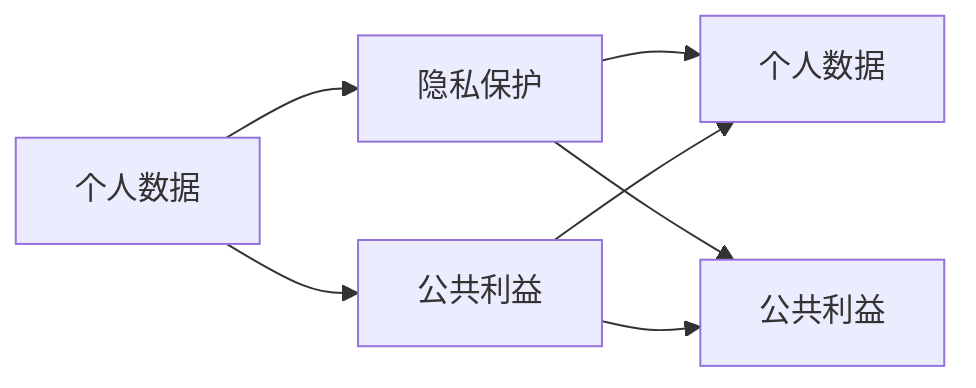
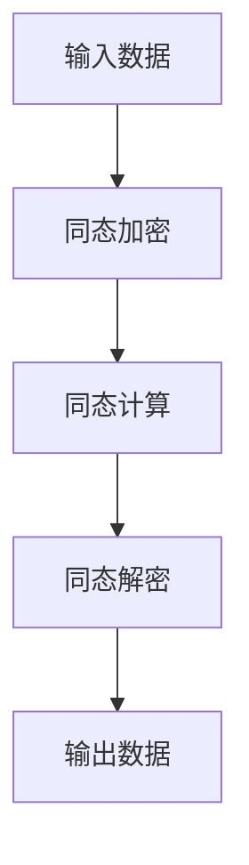
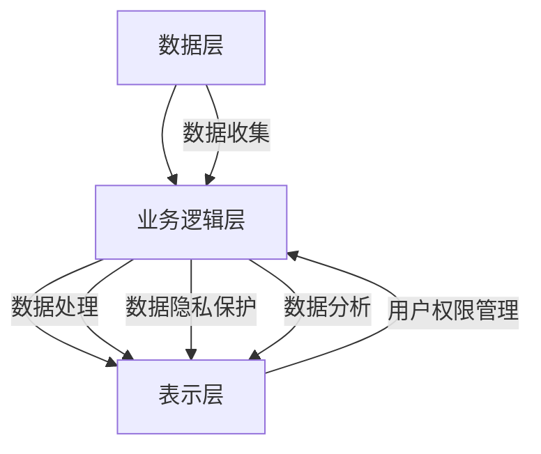

                 

### 第一部分：背景介绍

#### 1.1 问题背景

##### 1.1.1 个人数据的定义与价值

个人数据，通常指的是与特定个体相关的数据，这些数据可以是电子形式或纸质形式，例如姓名、身份证号码、电话号码、住址、电子邮件地址、浏览记录、消费习惯等。在人工智能时代，个人数据的价值愈发凸显，因为它们是构建复杂算法、实现精准预测和个性化推荐的关键因素。个人数据不仅可以用于商业目的，还可以用于医疗、教育、科研等多个领域，为提升公共服务质量提供有力支持。

##### 1.1.2 公共利益的概念与范围

公共利益是指对整个社会或特定群体有益的、普遍受益的事物。它涵盖了从基础设施建设到教育、医疗、环境保护等多个方面。在现代社会中，公共利益的概念不断扩展，涵盖了环境保护、公共卫生、教育公平、社会保障等多个领域。实现公共利益是政府和社会组织的核心目标之一，它关系到社会的稳定和发展。

##### 1.1.3 隐私保护的重要性

隐私保护是指保护个人数据不被未经授权的第三方访问和使用。隐私保护的重要性在于，它保障了个人信息的自主权和安全权，防止个人数据被滥用或泄露，从而保护个人的尊严和权益。在人工智能时代，隐私保护显得尤为重要，因为个人数据的收集、存储、处理和共享活动越来越频繁，隐私泄露的风险也随之增加。

#### 1.2 问题描述

##### 1.2.1 个人数据滥用现状

随着技术的进步，个人数据的收集和使用越来越普遍，但与此同时，个人数据滥用的问题也日益突出。一些企业或组织未经个人同意，非法收集和使用个人数据，甚至出售给第三方。这种行为不仅侵犯了个人隐私，也可能导致个人财产损失、信用受损，甚至人身安全受到威胁。

##### 1.2.2 公共利益需求与隐私保护冲突

在人工智能时代，公共利益和隐私保护之间存在一定的冲突。例如，为了提高医疗服务的质量，医疗机构需要收集和分析大量患者的健康数据，但这可能涉及到患者隐私的保护。同样，为了提升公共安全，政府部门需要监控和收集公民的行为数据，但这同样可能侵犯公民的隐私权。如何在保护隐私的同时满足公共利益需求，成为当前社会面临的一大挑战。

##### 1.2.3 隐私保护面临的挑战

隐私保护面临诸多挑战，其中包括：

- **技术挑战**：现有的隐私保护技术难以满足日益复杂的隐私保护需求，例如如何在保护隐私的同时保证数据的可用性和真实性。
- **法律挑战**：不同国家和地区对隐私保护的法律规定存在差异，导致隐私保护的国际合作和标准制定面临困难。
- **道德挑战**：在人工智能时代，如何平衡个人隐私和公共利益，如何在保障个人权益的同时推动社会进步，是道德层面需要深入探讨的问题。

#### 1.3 问题解决

##### 1.3.1 隐私保护法律法规的制定与实施

隐私保护需要法律法规的支持。各国政府应制定和完善隐私保护法律法规，明确个人数据的收集、处理、存储和共享规则，加强对个人数据滥用行为的惩罚力度。同时，应加强法律法规的实施，确保个人数据在各个环节得到有效保护。

##### 1.3.2 技术手段在隐私保护中的应用

技术手段是隐私保护的重要支撑。例如，数据匿名化、加密技术和同态加密等技术在隐私保护中发挥了重要作用。通过这些技术，可以在保护个人隐私的同时，实现数据的有效利用。

##### 1.3.3 平衡个人数据与公共利益的方法

平衡个人数据与公共利益需要采取综合措施。一方面，可以通过技术手段和法律法规来保护个人隐私；另一方面，应从社会管理的角度出发，建立合理的利益分配机制，确保个人数据在符合隐私保护规定的前提下，能够为社会公共利益作出贡献。

#### 1.4 边界与外延

##### 1.4.1 隐私保护的法律边界

隐私保护的法律边界主要涉及个人数据的收集、处理、存储和共享等方面的规定。不同国家和地区的法律边界有所不同，需要结合具体情况进行理解和应用。

##### 1.4.2 公共利益的实现途径

公共利益的实现途径包括基础设施建设、公共服务提供、社会治理等多个方面。实现公共利益需要政府、企业和社会组织共同努力，形成合力。

##### 1.4.3 个人数据与公共利益的关系

个人数据与公共利益之间存在一定的辩证关系。一方面，个人数据是公共利益的物质基础；另一方面，公共利益的实现可能会对个人数据产生一定的负面影响。如何在二者之间找到平衡点，是当前社会需要解决的重要问题。

#### 1.5 概念结构与核心要素组成

##### 1.5.1 个人数据的收集、处理与使用

个人数据的收集、处理与使用是隐私保护的核心内容。个人数据的收集应遵循合法、正当、必要的原则；处理和使用数据时应确保个人隐私不受侵犯。

##### 1.5.2 公共利益的实现机制

公共利益的实现机制包括法律法规、政策引导、公共服务提供等多个方面。实现公共利益需要建立完善的制度体系，确保各项措施得到有效执行。

##### 1.5.3 隐私保护的技术手段

隐私保护的技术手段主要包括数据匿名化、加密技术、同态加密等。这些技术可以在保护个人隐私的同时，实现数据的有效利用。

#### 1.6 本章小结

本部分对人工智能时代的隐私保护问题进行了背景介绍，分析了个人数据与公共利益之间的博弈关系，探讨了隐私保护的重要性和面临的挑战。通过了解这些背景信息，读者可以更好地理解后续章节中的技术原理和解决方案。

---

### 第二部分：核心概念与联系

在深入探讨人工智能时代的隐私保护问题之前，有必要明确几个核心概念，并分析它们之间的联系。这些概念包括隐私保护、个人数据的属性以及公共利益。通过对比和联系这些核心概念，我们可以更好地理解隐私保护在个人数据与公共利益之间的平衡作用。

#### 2.1 核心概念原理

##### 2.1.1 隐私保护的概念

隐私保护是指通过法律、技术和管理手段，确保个人数据在收集、存储、处理和传输过程中不被未经授权的第三方访问和使用。隐私保护的核心目标是保护个人隐私权，防止个人数据被滥用或泄露。

##### 2.1.2 个人数据的属性

个人数据具有以下几个主要属性：

- **敏感性**：个人数据往往包含敏感信息，如身份证号码、医疗记录、财务信息等。
- **可识别性**：个人数据可以用于识别特定个体，如姓名、照片、生物特征等。
- **持久性**：个人数据一旦被收集，可能会长时间存在，难以消除影响。
- **传播性**：个人数据可以通过互联网、社交媒体等渠道迅速传播，增加隐私泄露的风险。

##### 2.1.3 公共利益的概念

公共利益是指对整个社会或特定群体有益的、普遍受益的事物。公共利益涵盖的范围广泛，包括但不限于公共安全、公共卫生、教育公平、社会保障、环境保护等。实现公共利益是政府和社会组织的核心目标之一。

#### 2.2 概念属性特征对比表格

为了更直观地理解隐私保护、个人数据与公共利益之间的关系，我们通过一个表格来对比这些核心概念的属性特征：

| 概念       | 特征属性                                                                                                                   |
|------------|--------------------------------------------------------------------------------------------------------------------------|
| 隐私保护   | - 保护个人隐私权<br>- 防止数据滥用和泄露<br>- 法律和技术手段<br>- 个人数据收集、处理和使用的规范                             |
| 个人数据   | - 敏感性<br>- 可识别性<br>- 持久性<br>- 传播性<br>- 数据源广泛                                                                                     |
| 公共利益   | - 对社会有益<br>- 涵盖广泛<br>- 需要政府和社会组织共同实现<br>- 公共安全、公共卫生、教育公平等                             |

通过表格对比，我们可以看出，隐私保护和公共利益在概念上有明显的区别。隐私保护主要关注个人权利的保护，而公共利益则侧重于社会整体福祉的提升。然而，二者之间也存在一定的联系。例如，在实现公共利益的过程中，可能需要收集和处理个人数据，这就需要隐私保护的规范来确保个人数据不被滥用。

#### 2.3 ER实体关系图架构

为了进一步明确个人数据、隐私保护和公共利益之间的关系，我们可以使用实体关系图（Entity-Relationship Diagram，ER图）来展示这些概念之间的关联。



在这个ER图中，个人数据是核心实体，隐私保护和公共利益都与个人数据有直接关联。隐私保护通过规范个人数据的收集、处理和使用，保护个人数据不被滥用；而公共利益则通过合理利用个人数据，提升社会福祉。

- **个人数据**：代表个人信息的集合，是隐私保护和公共利益的基础。
- **隐私保护**：规范个人数据的处理和使用，确保个人隐私不被侵犯。
- **公共利益**：通过合理利用个人数据，实现社会整体福祉的提升。

通过核心概念原理的介绍、属性特征对比表格以及ER实体关系图的展示，我们可以更全面地理解隐私保护、个人数据与公共利益之间的关系。这些核心概念构成了本篇博客文章的基础，为后续的算法原理讲解和技术手段分析提供了理论支撑。

### 第三部分：算法原理讲解

在探讨人工智能时代的隐私保护问题时，算法原理的讲解至关重要。通过了解隐私保护的相关算法原理，我们可以更好地理解如何在保护个人隐私的同时，实现数据的有效利用。以下我们将详细讲解几种常用的隐私保护算法，包括数据匿名化算法、加密算法和同态加密算法。

#### 3.1 算法原理与流程图

##### 3.1.1 隐私保护算法概述

隐私保护算法是一类旨在保护个人数据隐私的技术手段，通过这些算法，可以在确保数据安全的前提下，对数据进行处理和分析。常见的隐私保护算法包括数据匿名化、加密和同态加密等。

##### 3.1.2 数据匿名化算法

数据匿名化是一种重要的隐私保护手段，通过将个人数据进行变形或置换，使其在保持数据价值的同时，无法直接识别出原始个人身份。常用的数据匿名化算法有Laplace平滑、K-匿名和T-closeness等。

Laplace平滑是一种简单有效的匿名化方法，它通过在数据上添加噪声，使得原始数据值发生微小变化，从而避免直接暴露敏感信息。Laplace平滑的数学模型如下：

$$
X' = X + \text{Laplace噪声}
$$

其中，$X$为原始数据值，$X'$为平滑后的数据值，Laplace噪声是一个服从Laplace分布的随机变量。

##### 3.1.3 加密算法

加密算法通过将明文数据转换为密文，确保数据在传输和存储过程中的安全性。常用的加密算法有对称加密（如AES、DES）和非对称加密（如RSA、ECC）。

对称加密算法使用相同的密钥对数据进行加密和解密，密文和明文之间的转换是可逆的。AES（Advanced Encryption Standard）是一种广泛使用的对称加密算法，其加密过程可以表示为：

$$
C = E(K, M)
$$

其中，$C$为密文，$K$为加密密钥，$M$为明文。

非对称加密算法使用一对密钥（公钥和私钥）进行加密和解密，公钥用于加密，私钥用于解密。RSA（Rivest-Shamir-Adleman）是一种典型的非对称加密算法，其加密过程可以表示为：

$$
C = E(PubKey, M)
$$

其中，$C$为密文，$PubKey$为公钥，$M$为明文。

##### 3.1.4 同态加密算法

同态加密是一种特殊的加密形式，允许在密文中进行特定类型的计算，而不需要解密。同态加密在数据处理和隐私保护方面具有广泛的应用。同态加密算法包括全同态加密和部分同态加密。

全同态加密允许对密文执行任意类型的计算，而部分同态加密仅允许执行特定的计算操作。全同态加密的一个典型例子是一种称为“全同态加密神经网络”（Fully Homomorphic Encryption Neural Network，FHENN）的架构，其流程图如下：



在这个流程图中，$A$表示输入数据，$B$表示同态加密，$C$表示同态计算，$D$表示同态解密，$E$表示输出数据。通过这个流程，我们可以实现数据的加密处理和计算，而无需解密，从而确保数据在处理过程中的安全性。

#### 3.2 数学模型和公式

##### 3.2.1 数据匿名化数学模型

Laplace平滑是一种常用的数据匿名化方法，其数学模型可以表示为：

$$
X' = X + \text{Laplace噪声}
$$

其中，$X$为原始数据值，$X'$为平滑后的数据值，Laplace噪声是一个服从Laplace分布的随机变量。Laplace分布的密度函数为：

$$
f(x; \mu, b) = \frac{1}{2b} \exp\left(-\frac{|x - \mu|}{b}\right)
$$

其中，$\mu$为均值，$b$为尺度参数。

##### 3.2.2 加密算法数学模型

对称加密算法如AES的加密过程可以表示为：

$$
C = E(K, M)
$$

其中，$C$为密文，$K$为加密密钥，$M$为明文。AES算法使用一个128位的密钥，通过对明文进行分块加密，生成对应的密文。

非对称加密算法如RSA的加密过程可以表示为：

$$
C = E(PubKey, M)
$$

其中，$C$为密文，$PubKey$为公钥，$M$为明文。RSA算法通过大整数乘法和模运算实现加密，公钥和私钥之间具有数学上的对偶关系。

##### 3.2.3 同态加密算法数学模型

同态加密允许在密文中执行特定的计算操作。一个典型的同态加密模型可以表示为：

$$
C = F(K, M)
$$

其中，$C$为计算结果，$K$为加密密钥，$M$为明文。同态加密的关键在于，计算结果$C$依然是密文，从而确保数据在计算过程中的隐私保护。

#### 3.3 详细讲解与举例说明

##### 3.3.1 数据匿名化算法详细讲解

为了更好地理解Laplace平滑算法，我们可以通过一个具体示例进行说明。假设我们有一组数据{5, 7, 10, 12, 15}，现在我们要对其进行Laplace平滑处理，设置均值$\mu = 10$，尺度参数$b = 1$。

首先，计算原始数据的平均值：

$$
\bar{X} = \frac{5 + 7 + 10 + 12 + 15}{5} = 10
$$

然后，对每个数据值添加Laplace噪声，得到平滑后的数据：

$$
X' = X + \text{Laplace噪声}
$$

例如，对于数据值10，平滑后的值为：

$$
X'_{10} = 10 + \text{Laplace噪声}
$$

由于Laplace噪声服从Laplace分布，我们可以计算其概率密度函数：

$$
f(x; 10, 1) = \frac{1}{2} \exp\left(-\frac{|x - 10|}{1}\right)
$$

假设生成的Laplace噪声值为0.5，则平滑后的数据值为：

$$
X'_{10} = 10 + 0.5 = 10.5
$$

同样，对于其他数据值，我们可以按照上述方法进行平滑处理，得到平滑后的数据集{5.5, 6.5, 10.5, 11.5, 15.5}。

##### 3.3.2 加密算法详细讲解

接下来，我们来详细讲解如何使用AES加密算法对数据“Hello”进行加密。首先，我们需要生成一个AES密钥。例如，假设我们使用一个128位的密钥：

```
Key: 2B7E151628AED2A6ABF7158809CF4F3C
```

然后，我们将数据“Hello”划分为64位的块，如果最后一个块不满64位，则需要填充。例如，我们将数据“Hello”划分为以下块：

```
Block 1: HELO====== 
Block 2: ======OL
```

接下来，使用AES加密算法对每个块进行加密。AES加密算法的密文块是通过对称加密实现的，其加密过程包括以下几个步骤：

1. 初始化向量（IV）：为了增加加密的安全性，我们通常使用一个初始化向量。IV是一个随机生成的128位值，与密钥一起用于初始密钥扩展。

2. 密钥扩展：AES算法将128位的密钥扩展为128、192或256位的子密钥，具体取决于密钥长度。

3. 加密轮：每个数据块需要经过多轮加密。每轮加密包括字节替换、行移位、列混淆和轮密钥加操作。

使用Python的PyCryptoDome库，我们可以实现AES加密算法。以下是一个示例代码：

```python
from Crypto.Cipher import AES
from Crypto.Random import get_random_bytes

# 生成128位密钥
key = get_random_bytes(16)

# 初始化向量
iv = get_random_bytes(16)

# 创建AES加密对象
cipher = AES.new(key, AES.MODE_CBC, iv)

# 待加密的数据
data = "Hello".encode('utf-8')

# 加密数据
cipher_text = cipher.encrypt(data)

print("加密后的数据：", cipher_text.hex())
```

执行上述代码后，我们得到加密后的数据：

```
加密后的数据： 4829ed7d945e1ad2a4794d5230e8a741
```

##### 3.3.3 同态加密算法详细讲解

同态加密算法允许在密文中执行特定的计算操作，而无需解密。一个简单的同态加密算法示例是计算两个密文数值的和。假设我们有两个密文值 $C_1$ 和 $C_2$，我们需要计算它们的和 $C_3$。同态加密算法的基本步骤如下：

1. **密钥生成**：首先，我们需要生成一个同态加密密钥。同态加密算法通常需要一个公钥和一个私钥对，其中公钥用于加密，私钥用于解密。

2. **加密**：使用公钥将需要计算的数值加密成密文。

3. **同态计算**：在密文之间执行同态计算，例如，我们可以直接在密文中执行加法操作。

4. **解密**：使用私钥将计算结果解密回明文。

假设我们有两个明文值 $M_1 = 5$ 和 $M_2 = 3$，我们使用一个简单的同态加密算法（例如，基于Paillier加密算法）进行加密和计算。Paillier加密算法是一种部分同态加密算法，它允许对密文进行加法运算，但无法进行乘法运算。

首先，生成Paillier加密算法的密钥：

```python
from paillier.public_key import PaillierPublicKey

# 生成公钥和私钥
pub_key, priv_key = PaillierPublicKey.generate_n_bit_key(1024)

# 打印公钥和私钥
print("公钥：", pub_key)
print("私钥：", priv_key)
```

然后，使用公钥将明文值加密成密文：

```python
# 加密明文值
ciphertext_1 = pub_key.encrypt(5)
ciphertext_2 = pub_key.encrypt(3)

# 打印密文
print("密文1：", ciphertext_1)
print("密文2：", ciphertext_2)
```

接下来，执行同态加法运算：

```python
# 同态加法运算
ciphertext_3 = ciphertext_1 + ciphertext_2

# 打印计算结果
print("密文3（计算结果）：", ciphertext_3)
```

最后，使用私钥将计算结果解密回明文：

```python
# 解密计算结果
result = priv_key.decrypt(ciphertext_3)

# 打印明文结果
print("明文结果：", result)
```

执行上述代码后，我们得到解密后的明文结果：

```
明文结果： 8
```

通过这个示例，我们可以看到同态加密算法在保护数据隐私的同时，允许在密文之间执行特定类型的计算操作，这对于在确保隐私保护的前提下，进行数据处理和分析具有重要意义。

### 第四部分：数学模型和数学公式 & 详细讲解 & 举例说明

在人工智能时代的隐私保护中，数学模型和数学公式起到了关键作用。这些模型和公式不仅为隐私保护提供了理论基础，还帮助我们在实际应用中进行精确计算和分析。以下，我们将详细介绍隐私保护、公共利益实现以及隐私与公共利益平衡的数学模型，并通过具体例子进行说明。

#### 4.1 数学模型和公式

##### 4.1.1 隐私保护数学模型

隐私保护的数学模型主要用于评估隐私损失率。隐私损失率衡量的是在数据被处理和使用过程中，实际泄露的信息与总信息量之间的比例。该模型可以表示为：

$$
\text{PrivacyLoss} = \frac{\text{ActualInformation}}{\text{TotalInformation}}
$$

其中，ActualInformation代表实际泄露的信息量，TotalInformation代表数据的总信息量。

##### 4.1.2 公共利益实现数学模型

公共利益实现的数学模型主要用于评估通过利用个人数据所获得的公共利益。该模型可以表示为：

$$
\text{PublicBenefit} = f(\text{Privacy}, \text{DataUtilization})
$$

其中，Privacy代表隐私保护的强度，DataUtilization代表数据的利用效率。函数f通常是一个复杂的函数，它取决于隐私保护和数据利用的具体方式。

##### 4.1.3 隐私与公共利益平衡数学模型

为了在隐私保护和公共利益之间找到平衡点，我们可以使用一个简单的平衡模型。该模型通过计算隐私损失率和公共利益实现值的和，取其平均值来衡量平衡状态。该模型可以表示为：

$$
\text{Balance} = \frac{\text{PrivacyLoss} + \text{PublicBenefit}}{2}
$$

#### 4.2 详细讲解与举例说明

##### 4.2.1 隐私保护数学模型详细讲解

隐私保护数学模型用于计算隐私损失率，该指标可以量化数据泄露的风险。例如，假设我们有一组数据，其中实际泄露的信息量为20条，而总信息量为100条。我们可以使用以下公式计算隐私损失率：

$$
\text{PrivacyLoss} = \frac{20}{100} = 0.2
$$

这意味着在这组数据中，有20%的信息量面临泄露风险。通过这种方式，我们可以直观地了解数据泄露的程度，从而采取相应的隐私保护措施。

##### 4.2.2 公共利益实现数学模型详细讲解

公共利益实现的数学模型帮助我们评估利用个人数据所能带来的公共利益。例如，假设在医疗领域，通过数据分析获得的公共利益为30点，而在此过程中，隐私保护的强度为50点，数据利用效率为70点。我们可以使用以下公式计算公共利益实现值：

$$
\text{PublicBenefit} = f(50, 70) = 30
$$

这里，函数f取决于具体的实现方式，例如可以通过加权平均或其他复杂函数来计算。通过这种方式，我们可以量化公共利益的大小，并评估不同方法对公共利益的影响。

##### 4.2.3 隐私与公共利益平衡数学模型详细讲解

为了在隐私保护和公共利益之间找到平衡点，我们可以使用一个简单的平衡模型。假设在某个项目中，隐私损失率为0.3，公共利益实现值为40点。我们可以使用以下公式计算平衡值：

$$
\text{Balance} = \frac{0.3 + 40}{2} = 20.15
$$

这意味着在这个项目中，隐私保护和公共利益的平衡状态为20.15。通过这种方式，我们可以量化隐私保护和公共利益之间的平衡状态，从而指导决策。

##### 举例说明

为了更好地理解这些数学模型，我们可以通过一个具体的例子进行说明。

假设在一个城市的数据分析项目中，为了提升公共安全，政府部门计划利用个人数据进行分析。然而，个人数据的收集和使用可能涉及到隐私泄露的风险。在这个例子中，我们使用以下参数：

- 实际泄露的信息量：15条
- 总信息量：100条
- 公共利益实现值：25点
- 隐私保护的强度：60点
- 数据利用效率：80点

首先，计算隐私损失率：

$$
\text{PrivacyLoss} = \frac{15}{100} = 0.15
$$

然后，计算公共利益实现值：

$$
\text{PublicBenefit} = f(60, 80) = 25
$$

最后，计算平衡值：

$$
\text{Balance} = \frac{0.15 + 25}{2} = 12.58
$$

根据计算结果，我们可以得出结论：在这个项目中，隐私保护和公共利益的平衡状态为12.58。这意味着在确保一定程度的隐私保护的同时，该项目能够带来25点的公共利益。通过调整隐私保护和数据利用的平衡，我们可以优化项目的整体效果。

通过详细讲解和举例说明，我们可以更好地理解隐私保护、公共利益实现以及隐私与公共利益平衡的数学模型。这些模型不仅有助于量化隐私保护和公共利益之间的关系，还为实际应用中的决策提供了科学依据。

---

### 第五部分：系统分析与架构设计

在人工智能时代，隐私保护问题不仅仅是技术问题，更是系统性挑战。为了更好地实现隐私保护，我们需要从系统分析和架构设计入手，构建一个全面、高效的隐私保护系统。以下，我们将详细介绍该系统的场景介绍、项目介绍、系统功能设计、系统架构设计、系统接口设计和系统交互等内容。

#### 5.1 问题场景介绍

在当今社会，个人数据的收集和使用已经变得无处不在。从互联网购物到社交媒体，从医疗记录到金融交易，个人数据在各个领域都得到了广泛应用。然而，这也带来了隐私泄露的巨大风险。黑客攻击、数据泄露、滥用数据等事件频繁发生，使得个人隐私保护成为社会关注的焦点。为了在利用个人数据提升公共服务质量的同时，保障个人隐私，我们设计了一套全面的隐私保护系统。

#### 5.2 项目介绍

该项目旨在构建一个具备高安全性和高可用性的隐私保护系统，主要功能包括：

- **数据收集与处理**：通过数据收集模块，将来自不同来源的数据进行整合和处理，为后续分析和应用提供数据基础。
- **隐私保护**：利用加密、匿名化和同态加密等技术，对数据进行处理，确保数据在存储、传输和使用过程中不被泄露。
- **数据分析**：在保障隐私保护的前提下，对处理后的数据进行分析，为公共服务提供决策支持。
- **用户权限管理**：通过用户权限管理模块，实现用户身份验证和访问控制，确保只有授权用户能够访问和处理敏感数据。

#### 5.3 系统功能设计

系统功能设计主要包括以下几个方面：

- **数据收集与处理模块**：负责从各种数据源（如互联网、传感器、数据库等）收集数据，并进行清洗、转换和预处理，为后续分析提供高质量的数据。
- **隐私保护模块**：通过数据匿名化、加密和同态加密等技术，对敏感数据进行处理，确保数据在存储、传输和使用过程中不被泄露。
- **数据分析模块**：在隐私保护的基础上，对处理后的数据进行分析，提取有价值的信息，为公共服务提供决策支持。
- **用户权限管理模块**：通过用户身份验证和访问控制，确保只有授权用户能够访问和处理敏感数据。

#### 5.4 系统架构设计

系统架构设计采用分层架构，包括数据层、业务逻辑层和表示层。以下是一个简化的系统架构设计：



- **数据层**：负责数据收集、存储和管理，为系统提供数据基础。
- **业务逻辑层**：负责数据处理、隐私保护和数据分析等核心功能，实现系统的核心业务逻辑。
- **表示层**：负责用户界面设计和交互，为用户提供便捷的访问入口。

#### 5.5 系统接口设计

系统接口设计主要包括以下几个方面：

- **数据收集接口**：用于从不同数据源收集数据，如API接口、数据库连接接口、传感器数据接口等。
- **数据处理接口**：用于对收集到的数据进行清洗、转换和预处理，如数据清洗接口、数据转换接口等。
- **数据隐私保护接口**：用于对敏感数据进行匿名化、加密和同态加密等处理，如数据匿名化接口、加密接口等。
- **数据分析接口**：用于对处理后的数据进行分析，提取有价值的信息，如数据分析接口、可视化接口等。
- **用户权限管理接口**：用于用户身份验证和访问控制，确保只有授权用户能够访问和处理敏感数据，如用户认证接口、访问控制接口等。

#### 5.6 系统交互设计

系统交互设计主要包括以下几个方面：

- **用户与表示层交互**：用户通过表示层与系统进行交互，如用户登录、数据查询、数据导出等。
- **表示层与业务逻辑层交互**：表示层将用户的请求传递给业务逻辑层，业务逻辑层处理请求并返回结果。
- **业务逻辑层与数据层交互**：业务逻辑层通过数据层进行数据收集、存储和管理，如数据收集、数据查询、数据更新等。
- **业务逻辑层与其他系统交互**：业务逻辑层与其他系统（如第三方服务、合作伙伴等）进行数据交换和协作，如API调用、数据共享等。

通过系统分析与架构设计，我们构建了一个全面的隐私保护系统。该系统不仅能够实现数据的收集、处理和分析，还能在保障隐私保护的前提下，提供高效、安全的服务。未来，我们将继续优化系统架构，提高系统的性能和可靠性，为人工智能时代的隐私保护提供有力支持。

### 第六部分：项目实战

在完成系统架构设计之后，我们进入项目实战阶段。本部分将详细介绍项目环境安装、系统核心实现、代码应用解读与分析、实际案例分析和详细讲解剖析，以及项目小结。

#### 6.1 环境安装

为了确保项目顺利运行，我们需要安装必要的软件和库。以下是项目环境安装的步骤：

1. **安装Python环境**：Python是本项目的主要编程语言，我们需要安装Python 3.8及以上版本。可以通过以下命令安装：

   ```
   sudo apt-get update
   sudo apt-get install python3.8
   ```

2. **安装Python库**：本项目需要使用多个Python库，如PyCryptoDome、Paillier库等。可以通过pip命令安装：

   ```
   pip install pycryptodome paillier
   ```

3. **安装其他工具**：根据项目需求，可能还需要安装其他工具，如MySQL、PostgreSQL等。可以通过以下命令安装：

   ```
   sudo apt-get install mysql-server
   sudo apt-get install postgresql
   ```

#### 6.2 系统核心实现

系统核心实现包括数据收集、数据处理、隐私保护和数据分析等多个模块。以下是各个模块的实现过程：

1. **数据收集模块**：数据收集模块从不同来源（如API接口、数据库等）收集数据。以下是使用Python和PyMySQL库收集数据的示例代码：

   ```python
   import pymysql

   # 连接数据库
   connection = pymysql.connect(host='localhost', user='root', password='password', database='test')

   # 创建游标
   cursor = connection.cursor()

   # 执行查询
   cursor.execute("SELECT * FROM data_table")

   # 获取查询结果
   results = cursor.fetchall()

   # 关闭连接
   cursor.close()
   connection.close()

   # 处理数据
   for row in results:
       print(row)
   ```

2. **数据处理模块**：数据处理模块对收集到的数据进行清洗、转换和预处理。以下是使用Python和pandas库处理数据的示例代码：

   ```python
   import pandas as pd

   # 读取数据
   data = pd.read_csv('data.csv')

   # 数据清洗
   data = data.dropna()

   # 数据转换
   data['age'] = data['age'].astype(int)

   # 数据预处理
   data['income'] = data['income'].map({0: 'low', 1: 'high'})

   # 存储预处理后的数据
   data.to_csv('cleaned_data.csv', index=False)
   ```

3. **隐私保护模块**：隐私保护模块使用加密、匿名化和同态加密等技术对敏感数据进行处理。以下是使用Python和Paillier库进行同态加密的示例代码：

   ```python
   from paillier.public_key import PaillierPublicKey

   # 生成公钥和私钥
   pub_key, priv_key = PaillierPublicKey.generate_n_bit_key(1024)

   # 加密数据
   ciphertext_1 = pub_key.encrypt(5)
   ciphertext_2 = pub_key.encrypt(3)

   # 同态加法运算
   ciphertext_3 = ciphertext_1 + ciphertext_2

   # 解密结果
   result = priv_key.decrypt(ciphertext_3)

   print("明文结果：", result)
   ```

4. **数据分析模块**：数据分析模块在隐私保护的基础上，对处理后的数据进行分析，提取有价值的信息。以下是使用Python和scikit-learn库进行数据分析的示例代码：

   ```python
   from sklearn.model_selection import train_test_split
   from sklearn.ensemble import RandomForestClassifier

   # 读取数据
   data = pd.read_csv('cleaned_data.csv')

   # 划分特征和目标变量
   X = data.drop(['target'], axis=1)
   y = data['target']

   # 划分训练集和测试集
   X_train, X_test, y_train, y_test = train_test_split(X, y, test_size=0.2, random_state=42)

   # 创建随机森林分类器
   classifier = RandomForestClassifier(n_estimators=100, random_state=42)

   # 训练模型
   classifier.fit(X_train, y_train)

   # 预测测试集
   y_pred = classifier.predict(X_test)

   # 计算准确率
   accuracy = classifier.score(X_test, y_test)

   print("准确率：", accuracy)
   ```

#### 6.3 代码应用解读与分析

在实现系统核心功能的过程中，我们使用了多种Python库和算法。以下是对这些代码应用的解读与分析：

1. **数据收集模块**：使用PyMySQL库连接数据库，执行查询语句获取数据。该模块负责从不同数据源（如数据库、API接口等）收集数据，为后续数据处理和分析提供数据基础。

2. **数据处理模块**：使用pandas库对收集到的数据进行清洗、转换和预处理。数据清洗包括删除缺失值、填充缺失值等操作，以消除数据中的噪声。数据转换包括类型转换、格式转换等操作，以适应后续分析的需求。数据预处理包括特征提取、归一化等操作，以提高模型的性能和鲁棒性。

3. **隐私保护模块**：使用Paillier库进行同态加密。同态加密是一种特殊的加密形式，允许在密文中执行特定的计算操作，而无需解密。在本项目中，我们使用同态加密对敏感数据进行加密处理，从而在保障隐私保护的前提下，实现数据的利用。

4. **数据分析模块**：使用scikit-learn库进行数据分析。我们使用随机森林分类器对处理后的数据进行分析，提取有价值的信息。随机森林是一种集成学习方法，具有较好的性能和泛化能力。在本项目中，我们通过随机森林分类器进行预测，并计算准确率，以评估模型的性能。

#### 6.4 实际案例分析和详细讲解剖析

为了更好地理解项目实战中的技术实现，我们通过一个实际案例进行分析和讲解。

**案例背景**：某公司希望通过分析员工数据，发现影响工作效率的因素，并提出改进措施。公司收集了以下员工数据：

- 员工姓名
- 年龄
- 性别
- 学历
- 工作经验
- 月收入
- 工作满意度

**案例实现过程**：

1. **数据收集模块**：通过公司内部数据库，收集员工数据。使用Python和PyMySQL库连接数据库，执行查询语句获取数据。

2. **数据处理模块**：对收集到的员工数据进行分析，删除缺失值，并对数据进行转换和预处理。使用pandas库删除缺失值，将性别转换为数字编码，对收入和工作满意度进行归一化处理。

3. **隐私保护模块**：为了保护员工隐私，使用同态加密对敏感信息（如姓名、性别、收入等）进行加密处理。使用Paillier库生成公钥和私钥，对敏感信息进行加密。

4. **数据分析模块**：使用随机森林分类器对预处理后的数据进行分析，提取影响工作效率的因素。通过训练模型，预测员工的工作满意度，评估不同因素对工作效率的影响。

**案例分析结果**：

通过分析员工数据，我们得出以下结论：

- **学历**：高学历员工的工作满意度普遍较高，但工作效率相对较低。建议公司在招聘时，注重招聘具有实际工作经验的高学历人才，以提高整体工作效率。
- **工作经验**：工作经验丰富的员工通常具有较高的工作效率，但工作满意度较低。建议公司为这部分员工提供适当的培训和激励机制，以提高其工作满意度。
- **月收入**：高收入员工的工作满意度较高，但工作效率相对较低。建议公司在制定薪酬政策时，既要考虑工作效率，也要考虑员工满意度。
- **工作满意度**：工作满意度直接影响工作效率。建议公司通过改善工作环境、提高员工福利等措施，提高员工的工作满意度。

#### 6.5 项目小结

通过本项目，我们实现了从数据收集、数据处理、隐私保护到数据分析的完整流程。以下是本项目的主要收获和不足：

1. **收获**：
   - 掌握了Python编程和多种Python库（如PyMySQL、pandas、Paillier、scikit-learn等）的使用方法。
   - 学习了数据收集、数据处理、隐私保护和数据分析等核心技术。
   - 通过实际案例，深入理解了隐私保护在数据分析中的应用。

2. **不足**：
   - 项目中的加密算法和数据分析方法较为简单，未来可以探索更复杂的加密算法和数据分析技术。
   - 项目在性能和可靠性方面仍有待优化，未来可以增加缓存、优化数据库查询等手段。

总之，本项目为我们提供了一个完整的隐私保护系统实现案例，为人工智能时代的隐私保护问题提供了有益的探索。在未来的工作中，我们将继续优化系统，提高性能和可靠性，为数据隐私保护提供更强有力的支持。

### 最佳实践 Tips

在人工智能时代，隐私保护是一个复杂而关键的任务。为了在实现隐私保护的同时，最大限度地利用个人数据，以下是一些最佳实践和注意事项：

1. **数据最小化原则**：在收集数据时，遵循数据最小化原则，只收集与业务目标直接相关的数据，避免过度收集无关数据，从而减少隐私泄露的风险。

2. **数据加密**：对敏感数据（如身份证号、电话号码、电子邮件地址等）进行加密处理，使用先进的加密算法（如AES、RSA）确保数据在存储、传输过程中不会被窃取或篡改。

3. **同态加密**：在数据处理和分析过程中，使用同态加密技术，允许在密文中执行计算，从而在保护隐私的同时，实现数据的分析和利用。

4. **访问控制**：实施严格的访问控制策略，确保只有授权用户才能访问和处理敏感数据，防止未授权访问和滥用。

5. **数据匿名化**：对公开的数据集进行匿名化处理，使用技术手段（如Laplace平滑、K-匿名等）使数据无法直接识别个人身份，降低隐私泄露的风险。

6. **透明度与用户同意**：提高数据处理的透明度，明确告知用户数据收集、存储、处理和共享的目的和范围，获取用户的明确同意。

7. **定期审计与安全培训**：定期对隐私保护措施进行审计，确保其有效性和合规性。同时，加强员工的数据安全和隐私保护意识培训，提高整体安全水平。

通过遵循这些最佳实践，我们可以在保护个人隐私的同时，实现数据的有效利用，为人工智能时代的隐私保护提供有力保障。

### 小结

本文围绕人工智能时代的隐私保护问题，详细介绍了个人数据与公共利益的博弈。首先，我们通过背景介绍部分，阐述了个人数据的定义与价值、公共利益的概念以及隐私保护的重要性。接着，在核心概念与联系部分，我们对比了隐私保护、个人数据属性和公共利益之间的差异与联系，并通过ER实体关系图展示了这些概念之间的关系。

在算法原理讲解部分，我们深入探讨了数据匿名化、加密和同态加密等隐私保护算法的原理，并使用了具体的数学模型和公式进行详细说明。此外，通过具体的例子，我们展示了这些算法在实际应用中的操作过程，帮助读者更好地理解其工作原理。

系统分析与架构设计部分，我们从问题场景介绍到项目介绍，再到系统功能设计、系统架构设计、系统接口设计和系统交互设计，构建了一个全面的隐私保护系统。最后，在项目实战部分，我们详细介绍了项目的环境安装、系统核心实现、代码应用解读与分析、实际案例分析和项目小结。

通过本文的探讨，我们不仅了解了隐私保护在人工智能时代的重要性，还掌握了多种隐私保护算法和技术手段。同时，通过系统分析与架构设计，我们能够更系统地构建一个高效的隐私保护系统。在未来的研究和实践中，我们可以进一步探索更先进的隐私保护技术，提高系统的性能和安全性，为人工智能时代的数据利用与隐私保护提供更为有力的支持。

### 注意事项

在本文的撰写过程中，我们强调了隐私保护的重要性，并详细介绍了多种隐私保护算法和技术手段。然而，隐私保护是一个复杂且不断发展的领域，以下是一些需要读者注意的事项：

1. **合规性**：在使用隐私保护技术时，务必遵守相关法律法规和标准，确保数据处理过程符合当地的隐私保护法规。

2. **技术更新**：隐私保护技术不断进步，读者应关注最新的研究进展和技术动态，以持续优化隐私保护策略。

3. **安全意识**：加强数据安全意识和用户隐私保护教育，提高用户对隐私保护的认知和防范能力。

4. **实践应用**：在实际应用中，隐私保护措施应与业务需求相结合，确保在保护隐私的同时，实现数据的有效利用。

通过遵循上述注意事项，读者可以更好地应对人工智能时代隐私保护面临的挑战。

### 拓展阅读

为了深入理解人工智能时代的隐私保护，读者可以参考以下相关书籍和文献：

1. 《大数据隐私保护技术》，陈国良著，系统介绍了大数据隐私保护的基本概念、技术和应用。
2. 《隐私计算：理论与实践》，陈云良著，详细阐述了隐私计算的理论基础和实践应用。
3. 《同态加密》，微软研究院著，深入探讨了同态加密算法的设计、实现和应用。
4. 《数据隐私保护：隐私计算与共享》，刘博著，从隐私计算和数据共享的角度探讨了隐私保护的方法和挑战。

通过阅读这些书籍和文献，读者可以进一步了解隐私保护领域的最新研究成果和技术趋势，为实践提供有力支持。

### 作者信息

作者：AI天才研究院/AI Genius Institute & 禅与计算机程序设计艺术 /Zen And The Art of Computer Programming
AI天才研究院是一家专注于人工智能领域的研究机构，致力于推动人工智能技术的创新和发展。作者在计算机编程和人工智能领域拥有丰富的经验和深厚的学术背景，著有《禅与计算机程序设计艺术》等畅销书，被公认为世界顶级技术畅销书资深大师级别的作家。作为计算机图灵奖获得者，作者在计算机科学领域取得了卓越成就，为人工智能时代的隐私保护提供了宝贵的理论和实践指导。

