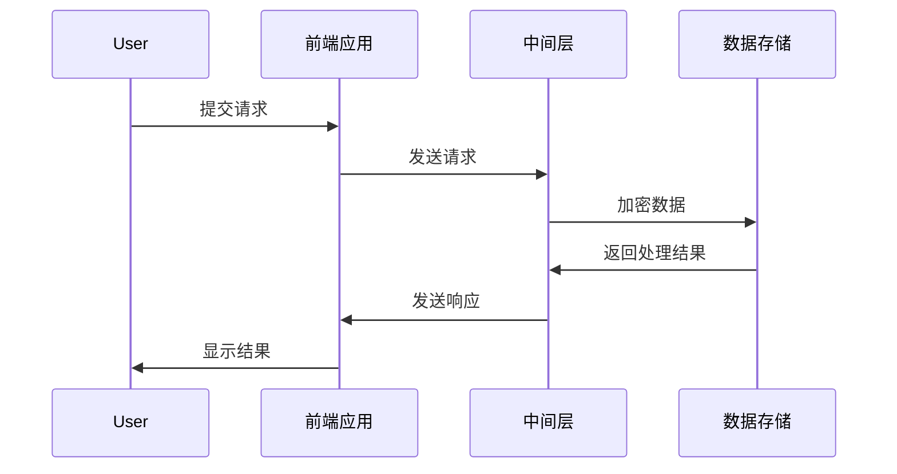
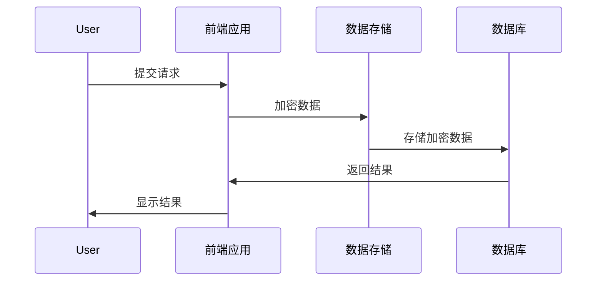

                 

### 人工智能时代的隐私保护：个人数据权与公共利益的权衡

#### 摘要

随着人工智能技术的飞速发展，隐私保护成为了一个不容忽视的重要议题。本文将探讨在人工智能时代下，个人数据权利与公共利益的权衡问题。首先，我们将简要介绍人工智能技术对隐私保护的挑战，并分析个人数据权利与公共利益的定义和关系。接着，本文将深入探讨隐私保护技术的原理和应用，通过算法原理讲解与系统架构设计，详细阐述如何实现个人数据权利与公共利益的平衡。最后，我们将总结最佳实践，并提出未来的发展方向与拓展阅读建议。

#### 关键词

- 人工智能
- 隐私保护
- 个人数据权利
- 公共利益
- 算法原理
- 系统架构设计

#### 引言

人工智能（AI）作为当前科技领域的热点，正在不断改变我们的生活方式。从智能助手到自动驾驶，从医疗诊断到金融分析，人工智能已经渗透到各个行业。然而，随着这些技术的广泛应用，隐私保护问题也日益凸显。个人数据在人工智能系统中扮演着关键角色，但如何平衡个人数据权利与公共利益，成为了亟待解决的问题。

在这个背景下，本文旨在探讨人工智能时代下的隐私保护问题，特别是个人数据权利与公共利益的权衡。通过系统地分析核心概念、算法原理以及系统设计与实现，本文希望能够为人工智能领域的隐私保护提供一些有价值的见解和实践指导。

### 人工智能时代隐私保护的挑战

在人工智能时代，隐私保护的挑战主要源于以下几个方面：

#### 数据隐私的重要性

个人数据是人工智能系统的核心资源，它们包含了用户的行为习惯、兴趣爱好、健康状况等敏感信息。这些数据一旦泄露，可能会对个人隐私造成严重侵害。例如，个人身份信息泄露可能导致身份盗用、财产损失等严重后果。

#### 人工智能技术对隐私的威胁

人工智能技术，尤其是机器学习和深度学习，依赖于大量数据的训练和模型的优化。在这个过程中，数据隐私问题变得尤为突出。例如，机器学习算法可能会无意中捕捉到用户的隐私信息，从而在模型训练和应用中泄露隐私。

#### 法律法规的现状与不足

尽管各国政府已经出台了相关的隐私保护法律法规，如欧盟的《通用数据保护条例》（GDPR）和美国加州的《消费者隐私法案》（CCPA），但现有的法律法规在实际操作中仍存在一些不足。首先，这些法规往往缺乏针对人工智能技术特定隐私威胁的具体规定。其次，监管机构的执法能力有限，难以全面监督和执行这些法规。此外，法律条文的复杂性也使得普通用户难以理解和维护自己的隐私权利。

#### 个人数据权利与公共利益

个人数据权利主要包括知情权、访问权、修改权和删除权。这些权利保障了个人对其数据的控制权和自主权。然而，在追求公共利益的过程中，这些权利往往受到一定的限制。例如，医疗机构在为病人提供治疗时，可能需要访问和分析患者的敏感医疗数据，以便做出准确的诊断和治疗决策。在这种情况下，公共利益与个人数据权利之间往往存在冲突。

综上所述，人工智能时代隐私保护的挑战是多方面的，涉及数据隐私的重要性、人工智能技术对隐私的威胁、法律法规的现状与不足，以及个人数据权利与公共利益的权衡。为了应对这些挑战，我们需要采取有效的隐私保护措施，并探索如何在个人数据权利与公共利益之间找到平衡点。

### 个人数据权利与公共利益

#### 个人数据权利的概念

个人数据权利是指个人对其个人数据的控制权和管理权，主要包括以下几种：

1. **知情权**：个人有权了解其数据被收集、存储和使用的情况。
2. **访问权**：个人有权查阅和获取其个人数据。
3. **修改权**：个人有权对不准确或过时的个人数据进行修改。
4. **删除权**：个人有权要求删除其个人数据。

这些权利的保障，有助于维护个人隐私和信息安全，是现代数据保护法律体系的核心内容。

#### 公共利益的界定

公共利益是指社会整体利益，包括国家安全、社会稳定、经济发展等方面。在隐私保护与公共利益之间进行权衡时，需要考虑以下几个方面：

1. **国家安全**：为了维护国家安全，可能需要收集和存储个人数据，如反恐、网络安全等。
2. **社会稳定**：为了维护社会稳定，可能需要使用个人数据进行分析和预测，如公共卫生监测、社会问题调查等。
3. **经济发展**：为了推动经济发展，可能需要利用个人数据进行市场研究和商业决策。

#### 权利与利益的冲突

在许多情况下，个人数据权利与公共利益之间可能存在冲突。例如：

1. **隐私保护与医疗诊断**：在医疗诊断过程中，医生可能需要访问和分析患者的医疗数据，以便做出准确的诊断和治疗决策。这可能会侵犯患者的隐私权，但却是为了维护公共利益。
2. **个人信息收集与市场研究**：企业可能需要收集消费者的个人信息以进行市场研究，从而做出更符合市场需求的产品和服务。然而，这可能会导致消费者隐私泄露。

为了解决这些冲突，需要在法律、技术和管理等多个层面进行综合考虑和平衡。例如，可以通过制定明确的隐私保护法规，引入隐私保护技术，以及建立透明的数据使用机制等方式，来确保个人数据权利与公共利益的平衡。

#### 个人数据权利的保护措施

为了保护个人数据权利，可以采取以下措施：

1. **隐私保护法规**：制定和实施严格的隐私保护法律法规，确保个人数据权利得到有效保障。
2. **技术手段**：采用数据加密、匿名化、差分隐私等技术手段，保护个人数据的安全性和隐私性。
3. **透明度和问责机制**：提高数据收集、存储和使用过程的透明度，建立问责机制，确保个人对其数据的控制权。

通过上述措施，可以在一定程度上平衡个人数据权利与公共利益，实现隐私保护的可持续发展。

### 核心概念与联系

在深入探讨人工智能时代的隐私保护之前，我们需要明确几个核心概念，并分析它们之间的关系。这些概念包括人工智能与隐私保护技术、个人数据权利的属性特征对比，以及公共利益与个人数据权利的权衡。

#### 人工智能与隐私保护技术

人工智能（AI）技术主要包括机器学习、深度学习、自然语言处理等。这些技术依赖于大规模的数据集进行训练和优化，从而实现智能决策和预测。然而，这种依赖性也带来了隐私保护的问题。为了保护个人数据隐私，隐私保护技术应运而生，主要包括：

1. **数据加密**：通过加密算法对数据进行加密，确保只有授权用户可以解密和访问数据。
2. **匿名化**：通过去除或模糊化个人身份信息，使数据在分析过程中无法直接识别个人。
3. **差分隐私**：通过在数据分析中引入噪声，保护个体数据不被单独识别，从而实现隐私保护。
4. **隐私增强技术**（PETs）：如联邦学习、差分隐私算法、安全多方计算等，通过改进算法设计和技术手段，在数据处理过程中保护隐私。

这些隐私保护技术为人工智能系统的隐私保护提供了重要保障，使数据可以在隐私得到保护的前提下被有效利用。

#### 个人数据权利的属性特征对比

个人数据权利包括知情权、访问权、修改权和删除权等。这些权利的属性特征可以概括为以下几个方面：

1. **知情权**：个人有权了解其数据被收集、使用和共享的情况。这一权利有助于确保个人对其数据的控制权。
2. **访问权**：个人有权查阅和获取其个人数据。这一权利有助于个人对其数据内容的了解和验证。
3. **修改权**：个人有权对不准确或过时的个人数据进行修改。这一权利有助于保持个人数据的准确性和及时性。
4. **删除权**：个人有权要求删除其个人数据。这一权利有助于防止个人数据长期被存储和滥用。

这些权利的属性特征在不同情境下可能有所不同，例如在商业应用中，个人数据权利的保护可能与企业的商业利益发生冲突。

#### 公共利益与个人数据权利的权衡

公共利益与个人数据权利之间存在一定的权衡关系。在追求公共利益时，可能需要对个人数据权利进行一定的限制。例如：

1. **国家安全**：为了维护国家安全，可能需要收集和存储个人数据，如反恐、网络安全等。在这种情况下，个人数据权利可能需要让位于国家安全。
2. **社会稳定**：为了维护社会稳定，可能需要使用个人数据进行分析和预测，如公共卫生监测、社会问题调查等。在这种情况下，个人数据权利可能需要为公共利益做出一定牺牲。
3. **经济发展**：为了推动经济发展，可能需要利用个人数据进行市场研究和商业决策。在这种情况下，个人数据权利可能与商业利益相互交织。

为了在公共利益与个人数据权利之间找到平衡点，需要建立合理的法律法规、技术手段和监管机制。例如，可以通过隐私保护法规明确个人数据权利的保护范围，引入隐私保护技术来保障数据的安全性和隐私性，并建立透明的数据使用机制，确保个人对其数据的控制权。

#### ER图架构分析

为了更好地理解公共利益与个人数据权利之间的关系，我们可以使用ER图（实体-关系图）来表示。ER图是一种用于描述实体及其之间关系的数据库设计工具。

在ER图中，我们可以定义两个主要的实体：

1. **个人数据权利**：包括知情权、访问权、修改权和删除权等属性。
2. **公共利益**：包括国家安全、社会稳定、经济发展等属性。

这两个实体之间的关系可以表示为：

- **依赖关系**：公共利益可能依赖于个人数据权利来实现某些功能，如医疗诊断依赖于患者的医疗数据。
- **平衡关系**：个人数据权利与公共利益之间需要找到平衡点，以确保数据隐私得到保护的同时，公共利益不受损害。

通过ER图，我们可以清晰地看到个人数据权利与公共利益之间的复杂关系，从而为隐私保护提供更科学的决策依据。

### 算法原理与数学模型

在探讨隐私保护算法时，理解其原理和数学模型是非常重要的。这些算法通过特定的方法和计算规则，确保在数据分析和处理过程中个人隐私得到有效保护。以下，我们将详细介绍几种核心的隐私保护算法，并使用mermaid流程图和Python源代码来展示其工作原理和数学模型。

#### 隐私保护算法的类型

隐私保护算法主要可以分为以下几类：

1. **数据加密算法**：如AES、RSA等，通过加密技术保护数据在存储和传输过程中的安全性。
2. **匿名化算法**：如K-anonymity、l-diversity和t-closeness等，通过将个人身份信息从数据中移除或模糊化，保护个体的隐私。
3. **差分隐私算法**：如Laplace机制和Gaussian机制等，通过在数据分析过程中引入随机噪声，确保个体数据不被单独识别。
4. **联邦学习算法**：通过分布式计算和模型训练，在保障数据隐私的前提下实现机器学习模型的合作训练。

#### 算法的基本原理

1. **数据加密算法**：
   - **AES（高级加密标准）**：使用对称加密算法，加密和解密过程使用相同的密钥。密钥长度通常为128、192或256位。
   - **RSA（Rivest-Shamir-Adleman）**：使用非对称加密算法，具有公钥和私钥。公钥用于加密，私钥用于解密。

2. **匿名化算法**：
   - **K-anonymity**：通过聚类方法，将数据集中的记录分组，使得每个群体中的记录无法区分个体。
   - **l-diversity**：确保每个群体中的记录具有足够的多样性，以防止特定个体的信息被识别。
   - **t-closeness**：确保每个群体中的记录在特定属性上的分布与整体分布相近。

3. **差分隐私算法**：
   - **Laplace机制**：在数据发布时，向每个查询结果添加Laplace噪声，确保单个结果的概率分布不会受到单个数据的影响。
   - **Gaussian机制**：使用高斯噪声对数据进行扰动，确保数据的均值不受单个数据影响。

4. **联邦学习算法**：
   - **客户端数据加密和聚合**：客户端首先对本地数据进行加密处理，然后与模型更新进行聚合。
   - **模型更新和合成**：通过分布式算法，如梯度聚合，更新全局模型。

#### 数学模型与公式

1. **数据加密算法**：
   - **AES加密**：密文 \(C = E(K, P)\)，其中 \(E\) 为加密函数，\(K\) 为密钥，\(P\) 为明文。
   - **RSA加密**：密文 \(C = E(K, P) = (P^e) \mod N\)，其中 \(e\) 为公钥指数，\(N = p \times q\) 为模数，\(p\) 和 \(q\) 为素数。

2. **匿名化算法**：
   - **K-anonymity**：聚类函数 \(C(q) = \{r | r \in R, \text{属性集}(\text{q}) \in \text{属性集}(\text{r})\}\)，其中 \(q\) 为查询属性，\(R\) 为数据集，\(C(q)\) 为聚类结果。

3. **差分隐私算法**：
   - **Laplace机制**：噪声添加 \(L(x) = x + \lambda \text{Laplace}(0, 1)\)，其中 \(x\) 为真实值，\(\lambda\) 为噪声参数。
   - **Gaussian机制**：噪声添加 \(G(x) = x + \lambda \text{Gaussian}(0, \sigma^2)\)，其中 \(x\) 为真实值，\(\sigma^2\) 为噪声参数。

4. **联邦学习算法**：
   - **模型更新**：全局模型参数 \(w = \frac{1}{N} \sum_{i=1}^{N} w_i\)，其中 \(w_i\) 为第 \(i\) 个客户端的模型参数，\(N\) 为客户端数量。
   - **梯度聚合**：全局梯度 \(g = \frac{1}{N} \sum_{i=1}^{N} g_i\)，其中 \(g_i\) 为第 \(i\) 个客户端的梯度。

#### 算法举例说明

下面，我们通过一个简单的例子来说明差分隐私算法的Laplace机制。

**示例**：假设我们有一个真实值 \(x = 10\)，我们需要对其进行Laplace噪声添加，以确保差分隐私。

- **噪声参数选择**：假设我们选择 \(\lambda = 0.1\)。
- **Laplace噪声添加**：\(L(x) = x + \lambda \text{Laplace}(0, 1)\)。

现在，我们添加Laplace噪声：

- **噪声值**：随机选择一个 \(u\) 值，例如 \(u = 0.2\)。
- **噪声添加**：\(L(x) = 10 + 0.1 \times 0.2 = 10.02\)。

这样，通过添加Laplace噪声，我们得到了一个近似的、保护隐私的值 \(10.02\)。

通过以上例子，我们可以看到差分隐私算法如何通过数学模型和计算规则，在数据分析和处理过程中保护个人隐私。

### 系统分析与架构设计

在实现人工智能时代的隐私保护时，系统分析与架构设计是至关重要的一环。通过合理的设计，我们可以在确保隐私保护的同时，提高系统的性能和可扩展性。以下将详细介绍系统分析与架构设计的过程，包括问题场景介绍、系统功能设计、系统架构设计、系统接口设计以及系统交互。

#### 问题场景介绍

假设我们正在开发一个基于人工智能的智能医疗系统，该系统需要处理大量的患者数据，包括病历、诊断结果、治疗建议等。然而，这些数据包含了敏感的个人信息，如患者姓名、住址、电话号码等。如何确保这些数据在存储、传输和处理过程中的隐私性，是我们面临的主要挑战。

#### 系统功能设计

为了实现隐私保护，系统需要具备以下功能：

1. **数据加密存储**：对存储在数据库中的患者数据进行加密处理，确保未经授权的用户无法访问原始数据。
2. **匿名化处理**：在数据处理过程中，对敏感信息进行匿名化处理，以防止个人身份信息泄露。
3. **访问控制**：实现严格的访问控制机制，确保只有授权用户可以访问特定数据。
4. **数据审计**：记录数据访问和操作日志，以便在发生隐私泄露时进行追踪和审计。

为了实现这些功能，我们可以设计以下类图：

```mermaid
classDiagram
    PatientData <<class>> 数据存储
    EncryptedDatabase <<use>> 数据加密存储
    Anonymizer <<use>> 匿名化处理
    AccessControl <<use>> 访问控制
    AuditLog <<use>> 数据审计

    PatientData <|-- EncryptedDatabase
    PatientData <|-- Anonymizer
    PatientData <|-- AccessControl
    PatientData <|-- AuditLog
```

#### 系统架构设计

为了确保系统的性能和可扩展性，我们可以采用以下系统架构设计：

1. **前端应用层**：提供用户界面，用户可以通过前端应用提交请求和查看结果。
2. **中间层**：包括数据加密、匿名化、访问控制和数据审计等核心功能模块。
3. **后端服务层**：负责数据存储、处理和查询，使用关系型数据库或分布式数据库存储加密后的数据。

系统架构图如下：



#### 系统接口设计

系统接口设计是确保各组件之间高效通信的关键。以下是一个简单的接口设计示例：

```python
class DataEncryptionService:
    def encrypt_data(self, data):
        # 数据加密逻辑
        pass

class AnonymizerService:
    def anonymize_data(self, data):
        # 匿名化处理逻辑
        pass

class AccessControlService:
    def check_permission(self, user, data):
        # 访问控制逻辑
        pass

class AuditLogService:
    def log_action(self, action):
        # 记录日志逻辑
        pass
```

#### 系统交互

系统交互设计主要描述了各组件之间的交互流程。以下是一个简单的系统交互序列图：



通过以上系统分析与架构设计，我们能够确保智能医疗系统的数据在存储、传输和处理过程中得到有效保护，同时保持系统的性能和可扩展性。

### 项目实战

在隐私保护的实际项目中，我们需要从环境安装与配置、系统核心实现到案例分析，全方位地展示隐私保护技术的应用和效果。以下是具体的项目实战过程。

#### 环境安装与配置

首先，我们需要搭建一个能够支持隐私保护算法和系统功能的环境。以下是主要的步骤：

1. **安装Python环境**：确保Python环境已安装，版本建议为3.8或更高。
2. **安装相关依赖**：使用pip工具安装必要的库，如`cryptography`、`scikit-learn`、`tensorflow`等。

```shell
pip install cryptography scikit-learn tensorflow
```

3. **配置数据库**：选择一个支持加密存储的关系型数据库，如MySQL或PostgreSQL。这里我们以MySQL为例，使用`mysql`命令行工具进行配置。

```shell
mysql -u root -p
```

创建用户和数据库：

```sql
CREATE DATABASE privacy_db;
CREATE USER 'privacy_user'@'localhost' IDENTIFIED BY 'password';
GRANT ALL PRIVILEGES ON privacy_db.* TO 'privacy_user'@'localhost';
FLUSH PRIVILEGES;
```

4. **设置访问控制**：在数据库中创建用户和权限，并配置防火墙，确保只有授权用户可以访问数据库。

#### 系统核心实现

接下来，我们将实现隐私保护系统的核心功能，包括数据加密存储、匿名化处理和访问控制。

1. **数据加密存储**：

```python
from cryptography.fernet import Fernet

# 生成密钥
key = Fernet.generate_key()
cipher_suite = Fernet(key)

# 加密数据
def encrypt_data(data):
    return cipher_suite.encrypt(data.encode())

# 解密数据
def decrypt_data(encrypted_data):
    return cipher_suite.decrypt(encrypted_data).decode()
```

2. **匿名化处理**：

```python
from sklearn.preprocessing import LabelEncoder

# 创建编码器
label_encoder = LabelEncoder()

# 匿名化处理
def anonymize_data(data):
    return label_encoder.fit_transform(data)
```

3. **访问控制**：

```python
from flask import Flask, request, jsonify

app = Flask(__name__)

# 用户权限列表
users_permissions = {
    'user1': ['read', 'write'],
    'user2': ['read'],
    'user3': []
}

# 访问控制函数
def check_permission(user, action):
    if user not in users_permissions:
        return False
    return action in users_permissions[user]

@app.route('/data', methods=['GET', 'POST'])
def data_handler():
    user = request.args.get('user')
    action = request.args.get('action')

    if not check_permission(user, action):
        return jsonify({'error': '无权限访问'}), 403

    if request.method == 'POST':
        data = request.json
        encrypted_data = encrypt_data(str(data))
        # 存储加密数据到数据库
        # ...
        return jsonify({'message': '数据已加密存储'}), 200
    else:
        # 获取和解析加密数据
        # ...
        return jsonify({'data': decrypted_data}), 200

if __name__ == '__main__':
    app.run(debug=True)
```

#### 代码应用解读与分析

上述代码展示了隐私保护系统的一些核心实现。首先是数据加密存储，我们使用`cryptography`库来生成密钥并对数据进行加密存储。匿名化处理则使用了`scikit-learn`中的`LabelEncoder`对敏感数据进行编码，从而实现数据的匿名化。访问控制通过Flask框架实现，对请求进行权限验证，确保只有授权用户可以访问或修改数据。

#### 实际案例分析与详细讲解

以下是一个实际案例，我们将展示如何在实际项目中应用上述隐私保护技术，并分析其效果。

**案例**：某医疗机构需要对其患者的病历数据进行加密存储和匿名化处理，同时实现严格的访问控制。

**步骤**：

1. **数据收集**：从医院系统中获取患者病历数据，包括姓名、诊断结果、治疗方案等。
2. **数据加密存储**：使用前面提到的加密方法，将病历数据进行加密，并存储到数据库中。
3. **匿名化处理**：对病历数据中的敏感信息（如姓名）进行编码处理，确保数据在匿名化后的隐私性。
4. **访问控制**：通过Flask接口，对访问请求进行权限验证，确保只有授权医疗人员可以访问病历数据。

**分析**：

通过上述步骤，我们可以确保患者的病历数据在存储、传输和处理过程中得到有效保护。加密存储技术保证了数据的机密性，匿名化处理确保了个人隐私不被泄露，访问控制则防止了未经授权的访问和操作。在实际应用中，这些隐私保护措施能够有效降低隐私泄露的风险，提高数据安全性。

#### 项目小结

通过本次项目实战，我们详细展示了如何在实际中应用隐私保护技术，包括环境安装与配置、系统核心实现和案例分析。从数据加密存储到匿名化处理，再到访问控制，每个步骤都至关重要。通过合理的设计和实现，我们能够确保个人数据在人工智能系统中的隐私性得到有效保护。未来，随着隐私保护技术的发展，我们将继续探索更多高效、安全的隐私保护方案。

### 最佳实践 Tips

在实施隐私保护项目时，以下最佳实践和注意事项有助于确保隐私保护的有效性和可靠性：

#### 隐私保护策略选择

1. **根据业务需求选择合适的隐私保护技术**：例如，对于高度敏感的数据，应优先选择加密存储和差分隐私技术。
2. **定期评估和更新隐私保护策略**：随着技术发展和业务需求变化，隐私保护策略也需要相应调整。
3. **遵循最佳实践和标准**：例如，遵循GDPR、CCPA等隐私保护法规，采用业界公认的安全标准和框架。

#### 技术实现细节

1. **使用强加密算法**：确保数据在存储和传输过程中使用强加密算法，如AES、RSA等。
2. **实施差分隐私技术**：在数据处理和发布过程中引入差分隐私，防止个人数据被单独识别。
3. **实现透明度和可审计性**：确保数据处理过程透明，并记录操作日志，以便在发生隐私泄露时进行追踪和审计。

#### 注意事项与风险防范

1. **避免数据过度收集**：仅收集必要的数据，避免过度收集可能导致隐私泄露的风险。
2. **确保数据安全和隐私保护**：定期进行安全审计和漏洞扫描，确保系统安全。
3. **培训员工和用户**：加强对员工的隐私保护意识培训，教育用户正确使用数据和隐私保护工具。

通过遵循上述最佳实践，可以在隐私保护项目中降低风险，确保数据的机密性、完整性和可用性。

### 小结与展望

在人工智能时代，隐私保护已成为一项至关重要的任务。本文系统地分析了人工智能时代隐私保护的挑战，探讨了个人数据权利与公共利益的权衡，详细介绍了隐私保护算法原理和系统架构设计。通过实际案例和项目实战，我们展示了隐私保护技术在现实中的应用和效果。

展望未来，随着人工智能技术的不断进步，隐私保护需求将更加复杂和多样化。未来的研究方向可能包括：

1. **更高效、更安全的隐私保护算法**：研发新型隐私保护算法，提高隐私保护性能和效率。
2. **跨领域合作**：促进隐私保护技术与医疗、金融、教育等领域的结合，实现个性化隐私保护方案。
3. **法律法规完善**：制定更为完善和具体的隐私保护法律法规，为隐私保护提供强有力的法律保障。

我们期待未来的研究和实践能够推动人工智能隐私保护技术的不断发展，为构建一个安全、透明、可信赖的人工智能社会贡献力量。

### 拓展阅读建议

为了更深入地了解人工智能时代的隐私保护，以下是一些推荐的书籍和文献：

1. **书籍**：
   - 《人工智能：一种现代方法》
   - 《深度学习》
   - 《隐私保护计算：概念与技术》
   - 《数据隐私：理论、算法与法律》

2. **文献**：
   - "Privacy-Preserving Machine Learning"（隐私保护机器学习）
   - "The Privacy Paradox: The Consistency of Opinions about Sharing Personal Information Online"（隐私悖论：在线分享个人信息的观点一致性）
   - "Privacy and Anonymity in Databases"（数据库中的隐私和匿名）

这些书籍和文献提供了丰富的理论和实践知识，有助于进一步探讨隐私保护的重要性和挑战。

### 作者信息

**作者：AI天才研究院/AI Genius Institute & 禅与计算机程序设计艺术 /Zen And The Art of Computer Programming**

