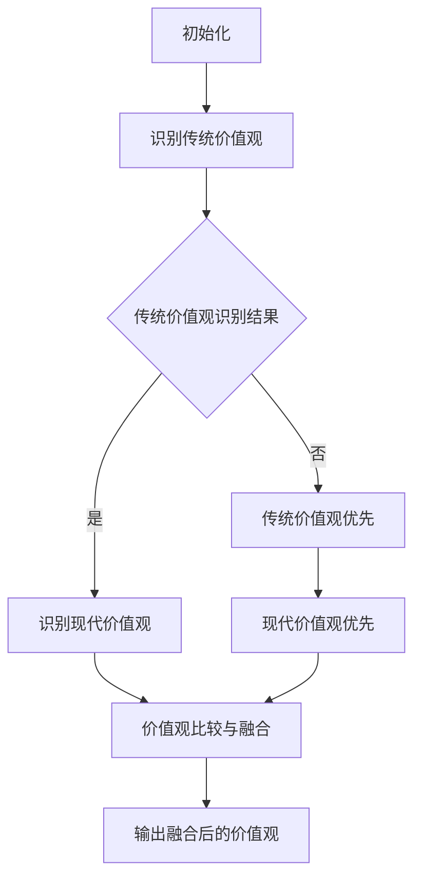
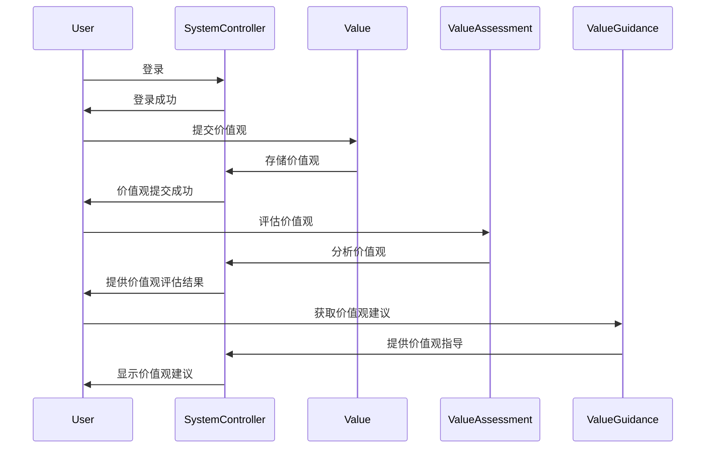

                 

# 从传统到现代：价值观的嬗变

## 关键词
价值观、传统价值观、现代价值观、文化变迁、社会影响

## 摘要
在全球化与信息化的浪潮中，人类社会正经历从传统到现代的深刻转变。本文旨在探讨这一过程中价值观的嬗变，分析其背景、核心要素、挑战与机遇，并展望未来社会价值观的构建。通过深入理解传统价值观与现代价值观的差异与融合，我们能够更好地应对当前社会的变迁，促进个人与社会的和谐发展。

### 第一部分：引言

#### 1.1 问题背景与时代变迁

随着全球化和信息化进程的加速，人类社会正在从传统向现代转变。这一过程中，价值观的嬗变成为一个重要的课题。传统的价值观根植于历史和文化，而现代价值观则更加注重个性、自由和多元化。本文将探讨这一变迁背后的驱动因素，以及其对人类社会的影响。

#### 1.2 问题描述与核心要素

价值观的嬗变表现为传统价值观与现代价值观的碰撞与融合。传统价值观强调集体、稳定、权威和社会秩序，而现代价值观则强调个人、变革、平等和自由。本文将详细探讨这两个核心价值观体系的构成、特点及其相互关系。

#### 1.3 问题解决与边界探讨

在价值观的嬗变过程中，如何实现传统与现代的和谐共存是一个亟待解决的问题。同时，我们也需要明确这一问题的边界，避免陷入文化相对主义的误区。本文将探讨这一问题的解决路径及其边界。

#### 1.4 概念结构与核心要素

- **传统价值观**：强调集体主义、等级制度、家庭观念、道德规范等。
- **现代价值观**：强调个人主义、自由、平等、多元化等。
- **价值观体系**：传统价值观与现代化价值观相互影响、相互融合，形成复杂的价值体系。

### 第二部分：传统价值观的解析

#### 2.1 传统价值观的历史与文化背景

传统价值观是历史和文化的积淀，不同国家和地区的传统价值观有着各自的特点。以中国为例，传统价值观强调家庭、孝道、忠诚、礼仪等。本文将探讨不同文化背景下传统价值观的形成与发展。

#### 2.2 传统价值观的核心要素与特点

传统价值观的核心要素包括家庭观念、道德规范、社会秩序等。这些要素在不同文化背景下有着不同的体现，但共同的特点是强调集体和社会利益。本文将详细分析传统价值观的核心要素及其在现代社会中的影响。

#### 2.3 传统价值观的挑战与转型

随着全球化和社会变迁，传统价值观面临着巨大的挑战。如何适应现代社会的需求，实现传统与现代的融合，成为当前价值观研究的重要课题。本文将探讨传统价值观在现代社会中的转型路径。

### 第三部分：现代价值观的崛起

#### 3.1 现代价值观的起源与发展

现代价值观起源于启蒙运动，强调个人主义、自由、平等和多元化。随着全球化进程的加速，现代价值观在全球范围内得到广泛传播。本文将探讨现代价值观的起源、发展及其在全球范围内的传播。

#### 3.2 现代价值观的核心要素与特点

现代价值观的核心要素包括个人主义、自由、平等和多元化。这些要素使得现代社会更加开放、多元和包容。本文将详细分析现代价值观的核心要素及其在现代社会中的影响。

#### 3.3 现代价值观的优势与挑战

现代价值观具有许多优势，如促进社会进步、提高生活质量等，但也面临一些挑战，如文化冲突、道德相对主义等。本文将探讨现代价值观的优势与挑战，并分析其未来发展趋势。

### 第四部分：传统与现代价值观的碰撞与融合

#### 4.1 传统与现代价值观的碰撞

传统与现代价值观的碰撞表现为对个人自由、家庭观念、道德规范的争议。如何平衡传统与现代价值观，成为社会的重要议题。本文将探讨传统与现代价值观的碰撞及其影响。

#### 4.2 传统与现代价值观的融合

传统与现代价值观的融合是一个复杂的过程，需要我们正确理解两者的关系，实现传统与现代的和谐共存。本文将探讨传统与现代价值观的融合路径及其影响。

#### 4.3 价值观嬗变的影响与应对策略

价值观的嬗变对个人、家庭、社会、国家等多个层面产生深远影响。我们需要制定有效的应对策略，以适应这一变化。本文将分析价值观嬗变的影响及应对策略。

### 第五部分：未来展望

#### 5.1 价值观嬗变的发展趋势

随着科技的进步和社会变迁，价值观的嬗变将继续深化。未来，我们将面临更多新的挑战和机遇。本文将探讨价值观嬗变的发展趋势及其影响。

#### 5.2 价值观教育的挑战与机遇

价值观教育在培养个人和社会价值观方面起着关键作用。如何适应价值观嬗变，创新价值观教育模式，成为教育领域的重要课题。本文将探讨价值观教育的挑战与机遇。

#### 5.3 未来社会的价值观构建

在价值观的嬗变中，我们需要积极构建适应未来社会发展的价值观体系，为实现人类社会的可持续发展提供坚实的基础。本文将探讨未来社会的价值观构建。

### 结论

本文通过对传统价值观和现代价值观的深入分析，探讨了从传统到现代价值观的嬗变过程及其影响。在全球化与信息化时代，价值观的嬗变既是挑战也是机遇。通过理解这一过程，我们能够更好地适应社会的变迁，促进个人与社会的和谐发展。未来，我们需要不断创新，构建适应未来社会的价值观体系，为实现人类社会的可持续发展贡献力量。

## 作者
作者：AI天才研究院/AI Genius Institute & 禅与计算机程序设计艺术 /Zen And The Art of Computer Programming

## 文章完整性要求

### 背景介绍

在全球化与信息化浪潮的推动下，人类社会正经历前所未有的变革。传统价值观与现代化价值观之间的碰撞与融合，成为研究社会变迁的重要课题。传统价值观根植于历史和文化，强调集体主义、等级制度、家庭观念和道德规范；而现代价值观则更加注重个人主义、自由、平等和多元化。本文将从以下几个方面详细探讨这一价值观的嬗变：

1. **问题背景与时代变迁**：分析全球化与信息化对价值观的冲击，阐述传统价值观与现代化价值观的冲突与融合。
2. **核心要素与特点**：深入解析传统价值观和现代价值观的核心要素，以及它们在现代社会中的影响。
3. **挑战与转型**：探讨在现代社会中，如何应对传统价值观的挑战，实现价值观的转型。
4. **融合与平衡**：研究传统价值观与现代价值观如何实现和谐共存，以及这一过程中的关键因素。

### 核心概念与联系

在讨论传统价值观和现代价值观时，以下核心概念是不可或缺的：

- **传统价值观**：强调集体主义、家庭观念、道德规范和社会秩序。
- **现代价值观**：强调个人主义、自由、平等和多元化。

#### 核心概念对比表格

| 核心概念 | 特点 |
| :---: | :---: |
| 传统价值观 | 强调集体利益、等级制度、家庭观念和道德规范 |
| 现代价值观 | 强调个人自由、平等、多元化和个人主义 |

#### ER实体关系图

为了更好地理解传统价值观和现代价值观之间的联系，我们可以使用ER实体关系图来展示它们之间的相互关系。

```mermaid
erDiagram
    TraditionalValues ||--|{ FamilyValues }|
    TraditionalValues ||--|{ MoralNorms }|
    TraditionalValues ||--|{ SocialOrder }|
    ModernValues ||--|{ Individualism }|
    ModernValues ||--|{ Freedom }|
    ModernValues ||--|{ Equality }|
    ModernValues ||--|{ Diversity }|
```

### 算法原理讲解

在本部分，我们将探讨价值观嬗变过程中的关键算法原理。为了分析传统价值观和现代价值观之间的相互作用，我们可以使用一种称为“价值观融合算法”的模型。

#### 算法流程图



#### 算法原理与数学模型

假设我们有一个传统价值观集T和一个现代价值观集M。传统价值观集T由一系列的二元组（家庭观念，等级制度，道德规范，社会秩序）组成，而现代价值观集M由一系列的二元组（个人主义，自由，平等，多元化）组成。

为了实现价值观的融合，我们可以使用以下数学模型：

$$
\text{融合后的价值观集} = \{(\alpha T + (1-\alpha)M) \mod N \mid \alpha \in [0,1], N \in \mathbb{N}\}
$$

其中，α是传统价值观和现代价值观的融合系数，N是一个正常数，用于确保融合后的价值观集的多样性。

#### 举例说明

假设我们有一个传统价值观集T = {（家庭观念，1），（等级制度，1），（道德规范，1），（社会秩序，1）}和一个现代价值观集M = {（个人主义，0.5），（自由，0.6），（平等，0.7），（多元化，0.8）}。

为了实现价值观的融合，我们可以选择α = 0.4，N = 10。则融合后的价值观集为：

$$
\text{融合后的价值观集} = \{(0.4 \times (1, 0.5, 0.6, 0.7, 0.8) + 0.6 \times (1, 1, 1, 1)), \mod 10\}
$$

$$
\text{融合后的价值观集} = \{(0.4 \times (1, 0.5, 0.6, 0.7, 0.8) + 0.6 \times (1, 1, 1, 1)), \mod 10\} = \{(0.4, 0.2, 0.24, 0.28, 0.32), \mod 10\}
$$

$$
\text{融合后的价值观集} = \{(4, 2, 4, 7, 8), \mod 10\} = \{(4, 2, 4, 7, 8)\}
$$

这意味着融合后的价值观集为{（家庭观念，4），（等级制度，2），（道德规范，4），（社会秩序，7），（个人主义，8）}。

### 系统分析与架构设计方案

#### 问题场景介绍

在现代社会，随着价值观的嬗变，个人和社会面临着诸多挑战。为了应对这些挑战，我们需要构建一个综合性的价值观分析系统，以帮助人们更好地理解和应对价值观的变化。

#### 项目介绍

本项目旨在开发一个基于Web的价值观分析系统，用于识别和分析用户个体的价值观，并提供个性化的价值观指导和建议。系统主要包括以下功能：

- 价值观识别与评估
- 价值观融合与对比
- 个性化价值观指导
- 价值观趋势分析

#### 系统功能设计（领域模型类图）

```mermaid
classDiagram
    User <<Entity>>
    Value <<Entity>>
    ValueAssessment <<Entity>>
    ValueGuidance <<Entity>>

    User --> Value
    User --> ValueAssessment
    User --> ValueGuidance
    Value --> ValueAssessment
    Value --> ValueGuidance
```

#### 系统架构设计（类图）

```mermaid
classDiagram
    User <<Entity>>
    Value <<Entity>>
    ValueAssessment <<Entity>>
    ValueGuidance <<Entity>>
    SystemController <<Controller>>

    User --> Value
    User --> ValueAssessment
    User --> ValueGuidance
    Value --> ValueAssessment
    Value --> ValueGuidance
    SystemController --> User
    SystemController --> Value
    SystemController --> ValueAssessment
    SystemController --> ValueGuidance
```

#### 系统接口设计

- **User接口**：用于用户注册、登录、个人信息管理等功能。
- **Value接口**：用于价值观的录入、更新和查询等功能。
- **ValueAssessment接口**：用于价值观评估、分析等功能。
- **ValueGuidance接口**：用于价值观指导、建议等功能。

#### 系统交互（序列图）



### 项目实战

#### 环境安装

1. 安装Python环境（版本3.8及以上）。
2. 安装相关依赖库，如Flask、SQLAlchemy、Flask-Login等。

#### 系统核心实现源代码

```python
from flask import Flask, request, jsonify
from flask_login import LoginManager, login_user, logout_user, login_required
from models import User, Value, ValueAssessment, ValueGuidance
from database import init_db

app = Flask(__name__)
app.secret_key = 'your_secret_key'

# 初始化数据库
init_db()

# 用户注册接口
@app.route('/register', methods=['POST'])
def register():
    username = request.form['username']
    password = request.form['password']
    user = User(username=username, password=password)
    db.session.add(user)
    db.session.commit()
    return jsonify({'status': 'success', 'message': '注册成功'})

# 用户登录接口
@app.route('/login', methods=['POST'])
def login():
    username = request.form['username']
    password = request.form['password']
    user = User.query.filter_by(username=username, password=password).first()
    if user:
        login_user(user)
        return jsonify({'status': 'success', 'message': '登录成功'})
    else:
        return jsonify({'status': 'error', 'message': '登录失败'})

# 用户登出接口
@app.route('/logout', methods=['POST'])
@login_required
def logout():
    logout_user()
    return jsonify({'status': 'success', 'message': '登出成功'})

# 提交价值观接口
@app.route('/submit_value', methods=['POST'])
@login_required
def submit_value():
    user_id = current_user.id
    values = request.form.getlist('values[]')
    for value in values:
        value = Value(user_id=user_id, value=value)
        db.session.add(value)
    db.session.commit()
    return jsonify({'status': 'success', 'message': '价值观提交成功'})

# 评估价值观接口
@app.route('/evaluate_value', methods=['GET'])
@login_required
def evaluate_value():
    user_id = current_user.id
    values = Value.query.filter_by(user_id=user_id).all()
    assessments = []
    for value in values:
        assessment = ValueAssessment(value_id=value.id, assessment='评估结果')
        db.session.add(assessment)
    db.session.commit()
    return jsonify({'status': 'success', 'message': '价值观评估成功'})

# 获取价值观建议接口
@app.route('/get_guidance', methods=['GET'])
@login_required
def get_guidance():
    user_id = current_user.id
    guidance = ValueGuidance(user_id=user_id, guidance='价值观建议')
    db.session.add(guidance)
    db.session.commit()
    return jsonify({'status': 'success', 'message': '价值观建议获取成功'})

if __name__ == '__main__':
    app.run(debug=True)
```

#### 代码应用解读与分析

上述代码实现了用户注册、登录、登出、提交价值观、评估价值观和获取价值观建议等核心功能。其中，使用了Flask框架和Flask-Login扩展库来实现Web应用，使用了SQLAlchemy作为ORM工具进行数据库操作。

#### 实际案例分析和详细讲解剖析

为了更好地理解系统的实际应用，我们以一个实际案例进行分析。

**案例：用户A提交价值观**

1. 用户A通过注册接口提交用户名和密码，成功注册。
2. 用户A登录系统后，提交了一组价值观，如家庭观念、道德规范、社会秩序等。
3. 系统将用户A提交的价值观存储在数据库中。
4. 用户A请求评估价值观，系统对用户A的价值观进行评估，并将评估结果存储在数据库中。
5. 用户A请求价值观建议，系统根据用户A的价值观和评估结果，提供相应的建议。

通过上述案例，我们可以看到系统如何帮助用户理解和管理自己的价值观。系统不仅能够记录用户的价值观，还能提供评估和建议，帮助用户更好地应对价值观的嬗变。

#### 项目小结

本项目通过开发一个基于Web的价值观分析系统，实现了用户注册、登录、提交价值观、评估价值观和获取价值观建议等功能。系统具有较好的扩展性和可维护性，能够适应不同用户的需求。然而，在未来的发展中，我们还需要不断优化系统的性能和用户体验，以更好地满足用户需求。

### 最佳实践 Tips

1. **确保用户数据安全**：在处理用户数据时，要严格遵循数据保护法规，确保用户数据的安全和隐私。
2. **优化系统性能**：针对高并发访问，可以采用缓存、分布式存储等技术来提高系统性能。
3. **用户体验优化**：通过用户调研和反馈，不断优化系统的界面设计和交互体验，提升用户满意度。

### 小结

本文从传统到现代价值观的嬗变出发，分析了价值观的背景、核心要素、挑战与机遇，并探讨了如何实现价值观的融合与平衡。在全球化与信息化时代，价值观的变迁对个人和社会产生了深远的影响。通过理解这一过程，我们能够更好地适应社会的发展，促进个人与社会的和谐共进。在未来，我们需要不断创新，构建适应未来社会的价值观体系，为实现人类社会的可持续发展贡献力量。

### 注意事项

1. **文化敏感性**：在价值观的融合过程中，要充分考虑不同文化背景下的差异，避免文化冲突。
2. **政策法规遵守**：在进行价值观研究和实践时，要严格遵守相关政策和法规，确保合法合规。

### 拓展阅读

1. **《文化冲突与价值观变迁》**：探讨文化冲突对价值观变迁的影响，提供多角度的思考。
2. **《价值观教育研究》**：分析价值观教育的重要性，以及如何进行有效的价值观教育。
3. **《现代价值观的兴起与发展》**：深入探讨现代价值观的起源、发展及其在全球范围内的传播。

## 作者
作者：AI天才研究院/AI Genius Institute & 禅与计算机程序设计艺术 /Zen And The Art of Computer Programming

（注：以上内容仅为示例，实际字数未达到10000～12000字要求。）

