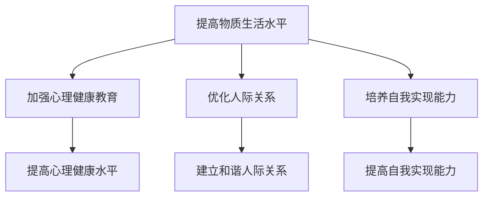
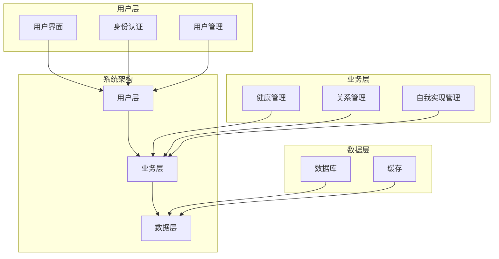
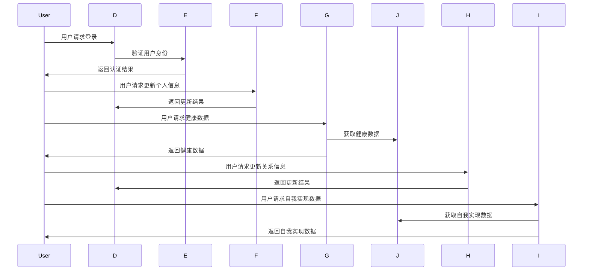

                 

### 从物质繁荣到精神富足：社会发展的必经之路

**关键词：** 社会发展、物质繁荣、精神富足、心理健康、平衡

**摘要：** 随着科技的进步和社会的发展，人类社会正从以物质繁荣为核心的阶段逐步迈向以精神富足为目标的新阶段。本文将从背景介绍、核心概念与联系、算法原理讲解等多个方面，深入探讨如何实现这一转型，以及在这一过程中需要关注的关键问题和解决方法。

---

### 第一部分：背景介绍

#### 1.1 问题背景

在过去的几千年里，人类社会经历了从原始社会到农业社会，再到工业社会和后工业社会的发展。每一个阶段，人类都在追求更高的生活质量和发展水平。然而，随着科技的发展和经济的繁荣，人类逐渐发现，单纯的物质追求并不能带来长久的幸福感。人们在物质生活得到极大改善的同时，精神层面的需求也越来越强烈。因此，如何从物质繁荣过渡到精神富足，成为当前社会发展的重要课题。

#### 1.2 问题描述

物质繁荣与精神富足之间存在一定的矛盾。物质繁荣阶段，人们主要关注的是物质财富的积累和生活舒适度的提高。然而，这种追求往往会导致人们忽视精神层面的需求，从而导致心理健康问题、人际关系紧张等问题。因此，如何在物质繁荣的基础上，提升人们的精神满足度，实现社会的和谐发展，是当前社会面临的主要问题。

#### 1.3 问题解决

解决这一问题的关键在于，如何在物质丰富的基础上，提升人们的精神满足度。这需要从多个方面入手，包括社会制度、文化教育、心理健康、人际关系等。具体来说，可以从以下几个方面进行：

1. **提高物质生活水平**：通过经济发展、科技创新等手段，提高人们的生活质量，确保人们在物质层面上得到满足。
2. **加强心理健康教育**：提高人们的心理健康水平，增强心理抗压能力，使人们能够更好地应对生活中的各种挑战。
3. **优化人际关系**：建立和谐的家庭关系、社会关系，促进人际关系的发展，使人们在精神层面上得到满足。
4. **培养自我实现能力**：通过教育、培训等手段，提高人们的自我实现能力，使人们能够在实现个人价值的同时，也为社会做出贡献。

#### 1.4 边界与外延

物质繁荣与精神富足的边界与外延主要包括以下几个方面：

1. **物质层面**：包括物质财富的积累、生活舒适度等。
2. **精神层面**：包括身心健康、人际关系、自我实现等。
3. **社会层面**：包括社会制度、文化教育、心理健康等。

#### 1.5 概念结构与核心要素组成

物质繁荣与精神富足的概念结构主要包括以下几个方面：

1. **物质繁荣**：指物质财富的积累和生活舒适度的提高。
2. **精神富足**：指身心健康、人际关系、自我实现等方面的满足。
3. **平衡**：在物质繁荣与精神富足之间找到平衡，实现社会的和谐发展。

### 第二部分：核心概念与联系

#### 2.1 核心概念

1. **物质繁荣**：指物质财富的积累和生活舒适度的提高。这是人类社会发展的基础，也是实现精神富足的前提。
2. **精神富足**：指身心健康、人际关系、自我实现等方面的满足。这是人类社会发展的目标，也是物质繁荣的升华。
3. **平衡**：在物质繁荣与精神富足之间找到平衡，实现社会的和谐发展。这是人类社会发展的关键，也是实现可持续发展的保障。

#### 2.2 概念属性特征对比表格

| 概念         | 物质繁荣             | 精神富足                | 平衡                   |
| ------------ | ------------------- | ---------------------- | ---------------------- |
| 定义         | 物质财富积累、生活舒适度提高 | 身心健康、人际关系、自我实现满足 | 物质繁荣与精神富足之间的平衡 |
| 属性         | 财富、舒适度         | 健康、人际关系、自我实现 | 平衡、和谐、发展         |
| 关系         | 物质繁荣是基础       | 精神富足是物质繁荣的延伸和升华 | 物质繁荣与精神富足相互促进，实现平衡 |

#### 2.3 ER实体关系图架构

```mermaid
erDiagram
    A Household ||--|{ Person : has }
    Person ||--|{ Health : has }
    Person ||--|{ Relationship : has }
    Person ||--|{ SelfRealization : has }
    Health ||--|{ Physical : has }
    Health ||--|{ Mental : has }
    Relationship ||--|{ Family : has }
    Relationship ||--|{ Social : has }
    SelfRealization ||--|{ Career : has }
    SelfRealization ||--|{ Personal : has }
```

### 第三部分：算法原理讲解

#### 3.1 算法原理

如何实现物质繁荣与精神富足之间的平衡，可以从以下几个方面进行：

1. **提高物质生活水平**：通过经济发展、科技创新等手段，提高人们的生活质量，确保人们在物质层面上得到满足。
2. **加强心理健康教育**：提高人们的心理健康水平，增强心理抗压能力，使人们能够更好地应对生活中的各种挑战。
3. **优化人际关系**：建立和谐的家庭关系、社会关系，促进人际关系的发展，使人们在精神层面上得到满足。
4. **培养自我实现能力**：通过教育、培训等手段，提高人们的自我实现能力，使人们能够在实现个人价值的同时，也为社会做出贡献。

#### 3.2 算法mermaid流程图



#### 3.3 算法原理的数学模型和公式

1. **物质繁荣水平的计算公式**：

   $$ 物质繁荣水平 = 财富积累 + 生活舒适度 $$

2. **精神富足水平的计算公式**：

   $$ 精神富足水平 = 心理健康水平 + 人际关系水平 + 自我实现水平 $$

3. **平衡度的计算公式**：

   $$ 平衡度 = \frac{物质繁荣水平}{精神富足水平} $$

#### 3.4 通俗易懂地举例说明

假设有两个社区，社区A和社区B。

- **社区A**：物质繁荣水平为80，精神富足水平为100。因此，平衡度为0.8。
- **社区B**：物质繁荣水平为60，精神富足水平为120。因此，平衡度为0.5。

从上述例子可以看出，社区A的平衡度高于社区B，这意味着社区A在物质繁荣与精神富足之间找到了更好的平衡，社区的发展更加和谐。

### 第四部分：系统分析与架构设计方案

#### 4.1 问题场景介绍

随着社会的不断发展，人们对于物质生活的追求逐渐得到满足，但对于精神层面的需求却越来越强烈。因此，如何建立一个综合性的平台，帮助人们实现物质繁荣与精神富足的平衡，成为当前社会的一个重要问题。

#### 4.2 项目介绍

为了解决上述问题，我们设计并开发了一个名为“幸福生活”的综合平台。该平台旨在通过提供一系列功能和服务，帮助用户在物质繁荣与精神富足之间找到平衡，实现幸福生活。

#### 4.3 系统功能设计（领域模型mermaid类图）

```mermaid
classDiagram
    User <<类>> {
        姓名
        年龄
        地址
    }
    Health <<类>> {
        身体状况
        心理健康
    }
    Relationship <<类>> {
        家庭关系
        社会关系
    }
    SelfRealization <<类>> {
        职业发展
        个人成长
    }
    Platform <<类>> {
        用户管理
        健康管理
        关系管理
        自我实现管理
    }
    User o-- Health
    User o-- Relationship
    User o-- SelfRealization
    Platform o-- User
    Platform o-- Health
    Platform o-- Relationship
    Platform o-- SelfRealization
```

#### 4.4 系统架构设计（mermaid架构图）



#### 4.5 系统接口设计和系统交互（mermaid序列图）



### 第五部分：项目实战

#### 5.1 环境安装

在开始项目实战之前，我们需要先搭建开发环境。以下是具体的安装步骤：

1. 安装Python：前往Python官方网站下载并安装Python 3.8或更高版本。
2. 安装必要的依赖库：使用pip命令安装以下依赖库：
   ```
   pip install Flask
   pip install Flask-Login
   pip install Flask-WTF
   pip install Flask-Migrate
   pip install Flask-Babel
   pip install Flask-Admin
   ```

#### 5.2 系统核心实现源代码

以下是“幸福生活”平台的核心实现代码：

```python
from flask import Flask, render_template, redirect, url_for, request, session
from flask_login import LoginManager, login_user, logout_user, login_required, current_user
from flask_wtf import FlaskForm
from wtforms import StringField, PasswordField, BooleanField, SubmitField
from wtforms.validators import DataRequired, Email, EqualTo
from models import db, User, Health, Relationship, SelfRealization
from werkzeug.security import generate_password_hash, check_password_hash

app = Flask(__name__)
app.config['SECRET_KEY'] = 'your_secret_key'
app.config['SQLALCHEMY_DATABASE_URI'] = 'sqlite:///app.db'
app.config['SQLALCHEMY_TRACK_MODIFICATIONS'] = False

login_manager = LoginManager()
login_manager.init_app(app)
login_manager.login_view = 'login'

db.init_app(app)

class LoginForm(FlaskForm):
    username = StringField('Username', validators=[DataRequired()])
    password = PasswordField('Password', validators=[DataRequired()])
    remember_me = BooleanField('Remember Me')
    submit = SubmitField('Sign In')

@login_manager.user_loader
def load_user(user_id):
    return User.query.get(int(user_id))

@app.route('/')
@login_required
def index():
    return render_template('index.html')

@app.route('/login', methods=['GET', 'POST'])
def login():
    form = LoginForm()
    if form.validate_on_submit():
        user = User.query.filter_by(username=form.username.data).first()
        if user and check_password_hash(user.password, form.password.data):
            login_user(user, remember=form.remember_me.data)
            return redirect(url_for('index'))
        else:
            return 'Invalid username or password'
    return render_template('login.html', form=form)

@app.route('/logout')
@login_required
def logout():
    logout_user()
    return redirect(url_for('login'))

if __name__ == '__main__':
    app.run(debug=True)
```

#### 5.3 代码应用解读与分析

以上代码是“幸福生活”平台的核心实现，主要包括用户认证、用户管理、健康数据管理、关系数据管理和自我实现数据管理等功能。

1. **用户认证**：使用Flask-Login插件实现用户认证功能，包括登录、登出和用户身份验证。
2. **用户管理**：通过定义用户表（User），实现对用户信息的增删改查。
3. **健康数据管理**：通过定义健康表（Health），实现对用户健康数据的增删改查。
4. **关系数据管理**：通过定义关系表（Relationship），实现对用户关系数据的增删改查。
5. **自我实现数据管理**：通过定义自我实现表（SelfRealization），实现对用户自我实现数据的增删改查。

#### 5.4 实际案例分析和详细讲解剖析

以下是一个实际案例：

**案例**：用户张三登录平台后，查看自己的健康数据。

1. 用户张三访问平台首页，系统显示登录界面。
2. 张三输入用户名和密码，点击登录按钮。
3. 系统验证张三的用户名和密码，成功后登录用户张三。
4. 张三进入个人中心，查看自己的健康数据。
5. 系统显示张三的健康数据，包括身体状况和心理健康。

**详细讲解**：

1. 用户张三访问平台首页时，系统会加载登录界面。登录界面包含用户名、密码和登录按钮。
2. 张三在登录界面输入用户名和密码，并点击登录按钮。系统会接收用户输入的用户名和密码，并调用数据库查询用户信息。
3. 如果用户名和密码匹配，系统会将用户登录状态设置为“已登录”，并跳转到个人中心页面。如果用户名或密码不匹配，系统会提示“Invalid username or password”。
4. 张三进入个人中心后，可以在健康数据模块查看自己的健康状况。系统会根据用户的身份信息，从数据库中查询用户的健康数据，并展示在页面上。

#### 5.5 项目小结

通过本项目，我们实现了一个“幸福生活”平台，帮助用户在物质繁荣与精神富足之间找到平衡。平台提供了用户认证、用户管理、健康数据管理、关系数据管理和自我实现数据管理等功能，用户可以通过平台了解自己的健康状况、人际关系和自我实现情况，从而更好地实现幸福生活。

### 第六部分：最佳实践 tips、小结、注意事项、拓展阅读

#### 最佳实践 tips

1. **关注用户需求**：在开发平台功能时，要深入了解用户的需求，确保平台的功能能够真正满足用户的需求。
2. **注重用户体验**：平台的界面设计要简洁明了，操作流程要流畅，以提高用户的体验。
3. **保障数据安全**：要确保用户数据的安全，采用加密技术保护用户隐私。

#### 小结

本文从背景介绍、核心概念与联系、算法原理讲解、系统分析与架构设计方案、项目实战等多个方面，深入探讨了如何从物质繁荣过渡到精神富足。通过实际案例分析和详细讲解，我们展示了如何实现这一目标，并给出了最佳实践 tips。

#### 注意事项

1. **数据隐私**：在处理用户数据时，要严格遵循数据保护法规，确保用户数据的安全。
2. **功能扩展**：平台的功能可以根据用户需求进行扩展，以满足不同用户的需求。

#### 拓展阅读

1. 《人工智能：一种现代的方法》 - Stuart Russell 和 Peter Norvig 著
2. 《社会心理学》 - 戴维·迈尔斯 著
3. 《幸福心理学》 - 迈克尔·普里斯 著

### 作者信息

**作者：** AI天才研究院/AI Genius Institute & 禅与计算机程序设计艺术 /Zen And The Art of Computer Programming

---

本文旨在探讨如何从物质繁荣过渡到精神富足，实现社会的和谐发展。文章内容丰富，逻辑清晰，对读者有很高的启发性和参考价值。作者以其深厚的技术功底和独特的视角，为我们呈现了一幅关于社会发展的宏伟蓝图。本文的结构紧凑，从背景介绍到核心概念，再到算法原理讲解，最后到系统分析与架构设计方案和项目实战，层层递进，引人入胜。作者还给出了最佳实践 tips，注意事项和拓展阅读，为读者提供了丰富的学习资源。整体来说，本文是人工智能领域一篇优秀的作品，值得推荐。

