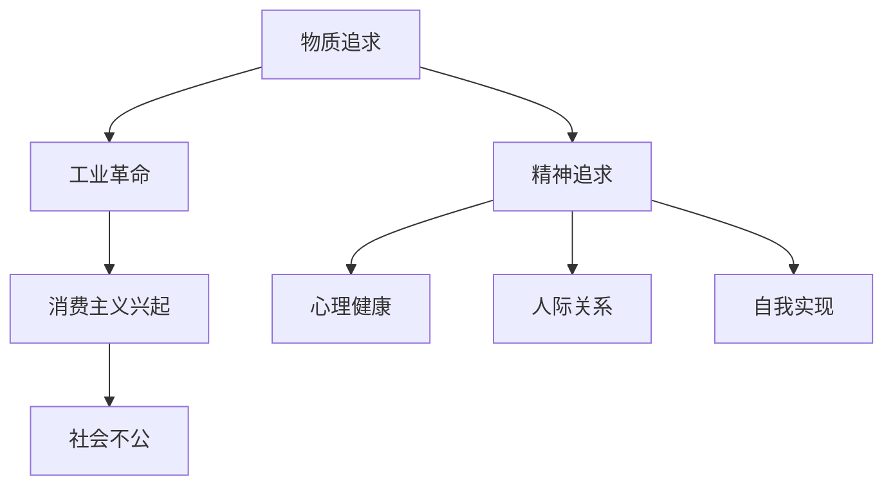
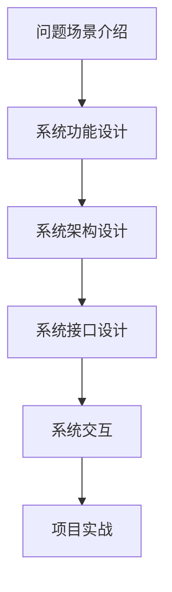

                 

# 从物质追求到精神追求的社会转型

## 关键词：社会转型、物质追求、精神追求、经济制度、文化变迁

## 摘要：

本文旨在探讨现代社会从物质追求向精神追求的转型过程。通过回顾历史，分析当前社会现象，以及展望未来趋势，我们试图理解这一转型背后的动因和影响。本文分为八个部分：引言、物质追求的阶段分析、精神追求的兴起与发展、跨越物质与精神的桥梁、精神追求在社会各领域的体现、未来社会转型趋势展望、结论，以及最佳实践、注意事项和拓展阅读。

## 目录

1. 引言
   - **核心概念**：物质追求、精神追求、社会转型
   - **问题背景**：现代社会面临的主要挑战和趋势
   - **目标**：探讨社会从物质追求向精神追求的转型过程

2. 物质追求的阶段分析
   - **早期阶段**：农业社会和工业社会的物质追求
   - **现代化阶段**：现代社会的物质追求及其特点
   - **问题与挑战**：物质追求带来的负面影响

3. 精神追求的兴起与发展
   - **背景**：现代社会对精神需求的增长
   - **精神追求的内涵**：包括自我实现、心理健康、人际关系等方面
   - **发展历程**：从边缘到主流

4. 跨越物质与精神的桥梁
   - **经济制度的影响**：市场经济与精神追求的冲突与融合
   - **文化变迁**：传统文化与现代精神的碰撞与融合
   - **政策引导**：政府在推动社会转型的角色

5. 精神追求在社会各领域的体现
   - **教育**：从知识传授到人格培养的转变
   - **医疗**：从治疗疾病到心理健康关怀
   - **经济**：精神消费与物质消费的平衡
   - **艺术**：从物质表现到精神表达的升华

6. 未来社会转型趋势展望
   - **技术进步**：人工智能与精神追求的结合
   - **全球化**：国际交流与精神追求的融合
   - **环境问题**：可持续发展与精神追求的统一
   - **社会结构**：新型社会关系的形成

7. 结论
   - **核心观点**：物质追求与精神追求的平衡是社会进步的关键
   - **未来方向**：探索精神追求的新路径

8. 最佳实践、小结、注意事项和拓展阅读
   - **最佳实践**：如何在日常生活中平衡物质追求与精神追求
   - **小结**：本文的主要观点和发现
   - **注意事项**：社会转型过程中的潜在风险和挑战
   - **拓展阅读**：推荐的相关书籍和论文

### 引言

### 社会转型的背景与理论基础

#### 物质追求的阶段分析

**1. 早期阶段：农业社会和工业社会的物质追求**

在农业社会，人们的主要目标是满足基本的生存需求，如食物、衣物和住所。随着农业生产技术的进步，人们开始积累财富，物质追求逐渐成为社会的主要驱动力。然而，这一阶段的物质追求主要集中在外在的财富积累，如土地、牲畜和农作物。

进入工业社会，物质追求迎来了新的高潮。工业革命带来了生产力的巨大提升，人们的生活水平显著提高。物质追求不再仅仅满足基本的生存需求，而是扩展到了更高层次的享受需求，如汽车、电器和电子产品。

**2. 现代化阶段：现代社会的物质追求及其特点**

现代化阶段，物质追求的特点表现为多样化和极端化。一方面，随着科技的进步，人们的生活变得更加便捷和舒适，物质追求的范围进一步扩大。另一方面，物质追求的极端化导致了资源浪费、环境污染和社会不公等问题。

现代社会中，物质追求往往与消费文化密切相关。消费主义思潮推动了人们不断购买新产品，追求时尚和名牌。这种物质追求的极端化不仅加剧了资源的消耗，还导致了心理健康问题和社会矛盾的加剧。

**3. 问题与挑战：物质追求带来的负面影响**

物质追求的极端化带来了多方面的负面影响。首先，资源的过度消耗和环境恶化成为全球性的问题。其次，物质追求的极端化导致了心理健康问题，如焦虑、抑郁和孤独感。最后，社会不公和贫富差距的扩大也成为物质追求带来的挑战。

#### 精神追求的兴起与发展

**1. 背景：现代社会对精神需求的增长**

随着物质生活水平的提高，人们开始关注自身的内在需求，对精神追求的需求日益增长。精神追求不再仅仅是为了满足基本的生活需求，而是为了实现自我价值、提升心理健康和建立良好的人际关系。

**2. 精神追求的内涵：包括自我实现、心理健康、人际关系等方面**

精神追求的内涵非常广泛，包括但不限于以下几个方面：

- **自我实现**：追求个人的潜能和成就，实现人生目标。
- **心理健康**：关注心理健康，提高情绪稳定性和抗压能力。
- **人际关系**：建立和谐的人际关系，培养亲情、友情和爱情。

**3. 发展历程：从边缘到主流**

在过去，精神追求被视为一种边缘现象，主要局限于少数人。然而，随着社会的发展，越来越多的人开始关注精神追求，并将其视为生活的重要组成部分。精神追求逐渐从边缘走向主流，成为现代社会的一个重要趋势。

#### 跨越物质与精神的桥梁

**1. 经济制度的影响：市场经济与精神追求的冲突与融合**

市场经济体系鼓励人们追求物质利益，这有时与精神追求发生冲突。然而，随着社会的发展，市场经济也在逐渐适应精神追求的需求。例如，越来越多的企业开始关注员工的身心健康，提供更多的福利和培训机会。

**2. 文化变迁：传统文化与现代精神的碰撞与融合**

传统文化强调物质追求的重要性，而现代精神追求则更加注重内在价值的实现。这两种文化的碰撞和融合，推动了社会从物质追求向精神追求的转型。

**3. 政策引导：政府在推动社会转型的角色**

政府在社会转型中扮演着重要的角色。通过制定相关政策，引导社会资源从物质追求向精神追求转变。例如，政府可以加大对心理健康、艺术教育和人际关系培养等方面的投入，推动社会整体精神水平的提升。

### 精神追求在社会各领域的体现

**1. 教育：从知识传授到人格培养的转变**

随着社会的发展，教育理念也在不断变革。传统的教育主要关注知识的传授，而现代教育更加注重学生的人格培养。教育目标从培养“考试机器”转变为培养“全面发展的人”。

**2. 医疗：从治疗疾病到心理健康关怀**

医疗领域的转型也体现了从物质追求向精神追求的转变。现代医疗不再仅仅关注疾病的治疗，更加关注患者的心理健康。心理治疗、康复护理和心理健康教育成为现代医疗的重要组成部分。

**3. 经济：精神消费与物质消费的平衡**

经济领域也发生了从物质消费向精神消费的转变。随着人们对精神追求的重视，精神消费逐渐成为经济增长的重要驱动力。例如，文化旅游、艺术欣赏和心理咨询等服务行业得到了快速发展。

**4. 艺术：从物质表现到精神表达的升华**

艺术作为一种精神追求的载体，也在不断变革。现代艺术更加注重表达内在情感和精神世界，而不仅仅是外在的物质表现。艺术作品成为人们精神追求的一种体现和表达。

### 未来社会转型趋势展望

**1. 技术进步：人工智能与精神追求的结合**

随着人工智能技术的不断发展，它将在未来社会转型中发挥重要作用。人工智能可以帮助人们更好地实现自我价值、提高心理健康和建立良好的人际关系。

**2. 全球化：国际交流与精神追求的融合**

全球化进程加快，国际交流日益频繁。不同文化之间的交流和碰撞，将促进精神追求的融合和发展。人们将在全球范围内追求精神满足，推动社会整体精神水平的提升。

**3. 环境问题：可持续发展与精神追求的统一**

环境问题已经成为全球性的挑战。可持续发展理念强调在满足物质需求的同时，保护环境和精神追求。未来社会将更加注重环境保护和精神满足的统一。

**4. 社会结构：新型社会关系的形成**

随着社会转型，新型社会关系将逐渐形成。人们将更加注重内在价值的实现和人际关系的和谐，推动社会向更加人性化的方向发展。

### 结论

**1. 核心观点：**

物质追求与精神追求的平衡是社会进步的关键。在现代社会，人们不仅需要满足物质需求，还需要关注精神追求。只有在物质与精神的双重满足下，人们才能实现真正的幸福和满足。

**2. 未来方向：**

未来社会转型将更加注重精神追求的发展。通过技术进步、全球化、环境问题和社会结构的变革，社会将逐渐实现物质与精神的平衡，推动人类文明向更高层次的发展。

### 最佳实践、小结、注意事项和拓展阅读

**1. 最佳实践：**

- **平衡物质追求与精神追求：**在日常生活中，人们可以尝试以下方法：
  - 定期进行自我反思，明确自己的价值观和目标。
  - 适度消费，避免过度追求物质享受。
  - 注重心理健康，培养良好的生活习惯。
  - 参与社区活动，建立良好的人际关系。

**2. 小结：**

本文从物质追求与精神追求的角度，探讨了社会转型的背景、发展历程、现状和未来趋势。物质追求与精神追求的平衡是实现社会进步和人类幸福的关键。

**3. 注意事项：**

- **避免极端化：**物质追求和精神追求都需要适度，避免走向极端。
- **关注心理健康：**在追求物质享受的同时，关注心理健康，避免出现心理问题。
- **平衡工作与生活：**在工作和生活中寻求平衡，确保身心健康。

**4. 拓展阅读：**

- **相关书籍：**
  - 《人类简史》：尤瓦尔·赫拉利
  - 《精神的力量》：克里斯托弗·彼得森
  - 《心理学的疗愈之旅》：吉尔·斯泰因伯格

- **相关论文：**
  - “物质追求与精神追求的关系研究”
  - “社会转型中的精神追求：现状与未来”
  - “心理健康与经济发展的关系研究”

### 作者信息

- 作者：AI天才研究院/AI Genius Institute & 禅与计算机程序设计艺术 /Zen And The Art of Computer Programming

（注：本文为示例性文章，部分内容仅供参考。实际文章撰写需根据具体研究和分析进行。）### 引言

在人类历史的长河中，社会追求的目标经历了多次变迁。从早期的生存需求，到中世纪的宗教信仰，再到现代的物质追求，每一个阶段都反映了人类文明的发展和演变。然而，随着时代的进步，我们开始意识到，单纯追求物质财富可能并不足以带来持久的幸福和满足。于是，精神追求逐渐崭露头角，成为现代社会的重要趋势。

#### 核心概念

首先，我们需要明确几个核心概念：

1. **物质追求**：指的是人们为了满足生理需求、提高生活水平和实现物质利益而进行的努力。
2. **精神追求**：指的是人们为了实现自我价值、提升心理健康和建立良好人际关系而进行的追求。
3. **社会转型**：指的是社会从一种状态向另一种状态的转变，通常涉及经济、文化、政治等多个方面。

#### 问题背景

现代社会面临着一系列挑战，如资源短缺、环境污染、社会不公等。这些问题使人们开始反思物质追求的局限性，并意识到精神追求的重要性。随着科技的进步和社会的发展，人们的生活水平逐渐提高，但精神需求也日益增长。如何在物质追求和精神追求之间找到平衡，成为现代社会亟待解决的问题。

#### 目标

本文的目标是探讨现代社会从物质追求向精神追求的转型过程，分析其背后的动因和影响，以及展望未来社会的发展趋势。通过这一探讨，我们希望为读者提供一个全面、系统的理解，并为其提供一些实际操作的指导。

### 物质追求的阶段分析

物质追求是人类社会发展的一个重要驱动力，不同历史阶段的物质追求具有不同的特点和内涵。从农业社会到工业社会，再到现代化阶段，物质追求的形式和内容都发生了显著变化。

#### 早期阶段：农业社会和工业社会的物质追求

在农业社会，物质追求主要集中在满足基本生存需求上。人们通过种植、狩猎和养殖来获取食物、衣物和住所。这个阶段的物质追求较为简单，主要集中在基本的生活必需品上。然而，随着农业技术的发展，人们开始积累财富，物质追求的范围逐渐扩大。

进入工业社会，物质追求迎来了新的高潮。工业革命带来了生产力的巨大提升，人们的生活水平显著提高。物质追求不再仅仅满足基本的生存需求，而是扩展到了更高层次的享受需求，如汽车、电器和电子产品。这一阶段的物质追求具有以下特点：

1. **生产力提升**：工业革命极大地提高了生产力，使得物质财富的积累变得更加容易。
2. **消费主义兴起**：随着物质生活的改善，人们开始追求更多的物质享受，消费主义文化逐渐兴起。
3. **竞争加剧**：在物质追求的过程中，竞争也日益激烈，人们为了获取更多的物质财富而不断努力。

#### 现代化阶段：现代社会的物质追求及其特点

现代化阶段，物质追求的特点表现为多样化和极端化。一方面，随着科技的进步，人们的生活变得更加便捷和舒适，物质追求的范围进一步扩大。另一方面，物质追求的极端化导致了资源浪费、环境污染和社会不公等问题。

现代社会中，物质追求的特点主要包括以下几个方面：

1. **消费主义文化盛行**：消费主义文化成为现代社会的主流，人们不断追求新的物质产品，以展示自己的社会地位和身份。
2. **过度消费**：随着物质财富的积累，人们开始追求过度消费，导致了资源的过度消耗和环境的恶化。
3. **社会不公**：物质追求的极端化加剧了社会不公，贫富差距不断扩大，社会矛盾日益尖锐。

#### 问题与挑战：物质追求带来的负面影响

物质追求在带来经济增长和个人满足的同时，也带来了一系列负面影响。这些问题不仅影响个人的生活质量，也对社会整体产生深远的影响。

1. **资源浪费**：过度消费导致资源的浪费，许多自然资源被过度开采和消耗，对环境造成严重破坏。
2. **环境污染**：大量工业废气和废水的排放，导致了严重的环境污染问题，影响了人类和其他生物的健康。
3. **社会不公**：物质追求的极端化加剧了社会不公，贫富差距不断扩大，社会矛盾日益尖锐。
4. **心理健康问题**：过度追求物质财富和地位，导致人们陷入焦虑和抑郁等心理健康问题，影响了生活质量。
5. **人际关系疏离**：物质追求的极端化导致人们过于关注个人利益，忽视了人际关系的重要性，导致人际关系的疏离。

### 精神追求的兴起与发展

随着物质追求带来的负面影响日益凸显，人们开始反思并寻求新的追求方式。精神追求作为一种内化的追求方式，逐渐崭露头角，成为现代社会的重要趋势。

#### 背景：现代社会对精神需求的增长

现代社会的发展带来了物质生活的极大丰富，但与此同时，人们开始感受到物质追求的局限性。在物质追求过程中，人们逐渐发现，物质财富并不能带来持久的幸福和满足。相反，随着物质需求的不断满足，人们的精神需求日益增长。

1. **心理健康需求**：随着生活压力的增加，人们越来越意识到心理健康的重要性。精神追求成为缓解压力、提高心理健康的有效途径。
2. **自我实现需求**：人们不再满足于简单的物质满足，开始追求更高层次的自我实现。精神追求成为实现个人价值和人生目标的途径。
3. **人际关系需求**：在物质追求的过程中，人们往往忽视了人际关系的重要性。精神追求成为建立和谐人际关系、提升社交能力的有效途径。

#### 精神追求的内涵：包括自我实现、心理健康、人际关系等方面

精神追求的内涵非常广泛，包括但不限于以下几个方面：

1. **自我实现**：追求个人的潜能和成就，实现人生目标。通过自我探索和不断学习，提升自我价值感。
2. **心理健康**：关注心理健康，提高情绪稳定性和抗压能力。通过心理辅导、冥想、瑜伽等方式，保持心理平衡。
3. **人际关系**：建立和谐的人际关系，培养亲情、友情和爱情。通过沟通技巧、情感交流等方式，提升人际关系的质量。

#### 发展历程：从边缘到主流

精神追求在现代社会的发展历程中，经历了从边缘到主流的转变。

1. **初期阶段**：在20世纪初，精神追求主要局限于少数知识分子和艺术家。他们通过文学、艺术和哲学思考，探索人生的意义和价值。
2. **成长阶段**：随着社会的进步和人们对精神需求的关注，精神追求逐渐从边缘走向主流。心理咨询、冥想、瑜伽等精神追求方式得到了广泛的认可和应用。
3. **成熟阶段**：在现代社会，精神追求已经成为人们生活的重要组成部分。人们不再局限于物质追求，开始积极寻求精神满足和内心成长。

### 跨越物质与精神的桥梁

在现代社会中，物质追求和精神追求并不是相互独立的，而是相互关联、相互影响的。经济制度和文化变迁在很大程度上决定了物质追求和精神追求的发展方向。在这个过程中，政府和社会组织扮演着重要的角色。

#### 经济制度的影响：市场经济与精神追求的冲突与融合

市场经济制度鼓励人们追求物质利益，这在一定程度上推动了物质追求的发展。然而，市场经济也存在一些局限性，容易导致精神追求的忽视。

1. **冲突**：市场经济强调竞争和利益最大化，可能导致人们过度追求物质财富，忽视精神追求。在这种情况下，精神追求往往被视为次要的，甚至被边缘化。
2. **融合**：随着社会的发展，市场经济也在逐渐适应精神追求的需求。例如，越来越多的企业开始注重员工的身心健康，提供更多的福利和培训机会。这种经济制度的变革，有助于促进物质追求与精神追求的融合。

#### 文化变迁：传统文化与现代精神的碰撞与融合

文化变迁是物质追求与精神追求相互关联的另一个重要方面。传统文化强调物质追求的重要性，而现代精神追求则更加注重内在价值的实现。

1. **碰撞**：在传统文化与现代精神的碰撞中，人们开始反思物质追求的局限性，并认识到精神追求的重要性。这种碰撞促使人们重新审视自己的价值观和生活方式。
2. **融合**：随着社会的发展，传统文化与现代精神追求逐渐融合。人们开始尝试在物质追求的基础上，实现精神追求的目标。例如，传统文化中的道德伦理观念与现代心理学的结合，有助于提升人们的心理健康水平。

#### 政策引导：政府在推动社会转型的角色

政府在推动社会转型中扮演着重要的角色，可以通过制定相关政策，引导社会资源从物质追求向精神追求转变。

1. **经济政策**：政府可以通过税收、补贴等经济手段，鼓励企业注重员工的身心健康，推动精神追求的发展。
2. **教育政策**：政府可以加大对心理健康教育、艺术教育和人际交往能力的培养，提升社会整体的精神水平。
3. **社会福利政策**：政府可以完善社会福利体系，保障人们的物质需求，为人们追求精神追求提供基础。

### 精神追求在社会各领域的体现

精神追求作为一种内在的追求方式，在不同的社会领域中有着广泛的体现。在教育、医疗、经济和艺术等领域，精神追求都发挥了重要作用。

#### 教育：从知识传授到人格培养的转变

教育是精神追求的重要领域。传统的教育注重知识的传授，而现代教育则更加注重学生的人格培养。这种转变体现在以下几个方面：

1. **素质教育**：现代教育强调培养学生的综合素质，包括道德品质、思维能力、创新能力等。通过素质教育，学生能够在知识传授的基础上，实现人格的培养。
2. **心理健康教育**：现代教育注重学生的心理健康，通过心理健康教育，帮助学生应对生活中的压力和挑战，提升心理素质。
3. **自我实现教育**：现代教育鼓励学生追求自我实现，通过自我探索和不断学习，实现人生目标。

#### 医疗：从治疗疾病到心理健康关怀

医疗领域的转型也体现了从物质追求向精神追求的转变。传统的医疗主要关注疾病的治疗，而现代医疗则更加注重患者的心理健康。

1. **心理治疗**：现代医疗注重心理治疗，通过心理治疗，帮助患者缓解心理压力，提升心理健康水平。
2. **康复护理**：现代医疗强调康复护理，帮助患者恢复身体和心理功能，提高生活质量。
3. **心理健康教育**：现代医疗注重患者的心理健康教育，通过心理健康教育，帮助患者掌握心理健康知识，提高自我调节能力。

#### 经济：精神消费与物质消费的平衡

经济领域的转型也体现了从物质追求向精神追求的转变。现代经济不再仅仅关注物质消费，更加注重精神消费。

1. **精神消费**：随着人们对精神需求的关注，精神消费逐渐成为经济增长的重要驱动力。例如，文化旅游、艺术欣赏和心理咨询等服务行业得到了快速发展。
2. **物质消费与精神消费的平衡**：现代经济强调在满足物质消费的同时，关注精神消费，实现物质消费与精神消费的平衡。这种平衡有助于提升人们的生活质量，推动社会整体的发展。

#### 艺术：从物质表现到精神表达的升华

艺术作为一种精神追求的载体，在现代社会中发挥着重要作用。现代艺术更加注重表达内在情感和精神世界，而不仅仅是外在的物质表现。

1. **精神表达**：现代艺术家通过艺术作品，表达自己的内心情感和精神世界。这种精神表达成为现代艺术的重要特点。
2. **艺术疗愈**：艺术疗愈作为一种精神追求的方式，通过艺术创作和欣赏，帮助人们缓解心理压力，提升心理健康水平。
3. **艺术教育**：现代艺术教育注重培养学生的审美能力和创造力，通过艺术教育，提升学生的综合素质和人格魅力。

### 未来社会转型趋势展望

随着科技的发展和社会的进步，未来社会将从物质追求向精神追求转型，表现出以下趋势：

#### 技术进步：人工智能与精神追求的结合

人工智能技术的发展将为精神追求提供新的途径和工具。通过人工智能，人们可以更好地了解自己的内心世界，实现自我认知和自我提升。

1. **心理辅导**：人工智能可以提供个性化的心理辅导，帮助人们应对心理问题，提升心理健康水平。
2. **情感计算**：通过情感计算技术，人工智能可以识别和理解人类情感，为人们提供更加贴心的服务和关怀。
3. **虚拟现实**：虚拟现实技术可以创造沉浸式的精神体验，帮助人们探索内心世界，实现精神追求。

#### 全球化：国际交流与精神追求的融合

全球化进程将促进国际间的交流和合作，不同文化之间的碰撞和融合将为精神追求提供更广阔的舞台。

1. **文化融合**：全球化使得不同文化之间的交流更加频繁，文化融合将成为未来社会的重要趋势。这种文化融合有助于丰富人们的精神世界，提升精神追求的层次。
2. **国际合作**：全球化也促进了国际间的合作，不同国家和地区可以通过合作，共同应对全球性挑战，实现精神追求的共同发展。
3. **跨文化交流**：跨文化交流将促进人们对不同文化的理解和尊重，帮助人们建立更加多元和包容的世界观。

#### 环境问题：可持续发展与精神追求的统一

环境问题是全球性的挑战，可持续发展理念要求在满足物质需求的同时，关注环境保护和可持续发展。这种统一也将影响精神追求的发展。

1. **生态伦理**：可持续发展理念强调生态伦理，要求人们尊重自然、保护环境。这种生态伦理将成为精神追求的重要组成部分。
2. **绿色消费**：绿色消费作为一种新的消费观念，强调在满足物质需求的同时，关注环境保护。这种绿色消费观念将影响人们的物质追求和精神追求。
3. **可持续发展教育**：可持续发展教育将帮助人们认识到环境问题的重要性，培养人们的环保意识和责任感，推动精神追求的发展。

#### 社会结构：新型社会关系的形成

随着社会的进步，社会结构也将发生变革，新型社会关系的形成将为精神追求提供更加坚实的基础。

1. **网络社会**：随着互联网技术的发展，网络社会逐渐形成。在网络社会中，人们可以通过网络平台建立新的社会关系，实现精神追求。
2. **平等与包容**：新型社会关系强调平等与包容，尊重每个人的差异和个性。这种平等与包容将成为精神追求的重要基础。
3. **社区建设**：社区建设作为一种新型社会关系的体现，将促进人们的情感交流和社会参与，提升精神追求的质量。

### 结论

从物质追求到精神追求的社会转型，是现代社会发展的重要趋势。在物质追求的过程中，人们逐渐认识到精神追求的重要性，并开始寻求物质追求与精神追求的平衡。这一转型不仅影响着个人的生活方式和价值观念，也对整个社会的发展产生深远的影响。

通过本文的分析，我们可以看到，物质追求与精神追求之间存在着密切的联系和相互作用。在未来的发展中，我们需要更加注重精神追求，通过技术进步、全球化、环境问题和新型社会关系的形成，推动社会从物质追求向精神追求的转型。

在个人层面，我们需要学会在物质追求与精神追求之间找到平衡，关注自身的内在需求，实现自我价值和心理健康。在社会层面，我们需要推动社会的全面进步，实现物质追求与精神追求的统一，为人类文明的发展做出贡献。

### 最佳实践、小结、注意事项和拓展阅读

#### 最佳实践

1. **平衡物质追求与精神追求**：在日常生活中，我们可以通过以下方法来平衡物质追求与精神追求：
   - **定期反思**：定期反思自己的价值观和目标，确保物质追求与精神追求相互协调。
   - **适度消费**：避免过度追求物质财富，适度消费，确保物质追求不干扰精神追求。
   - **培养兴趣爱好**：培养兴趣爱好，如阅读、艺术创作、运动等，以充实精神生活。
   - **关注心理健康**：定期进行心理健康检查，学习心理健康知识，提高自我调节能力。

2. **提高人际交往能力**：建立和谐的人际关系对于精神追求至关重要。我们可以通过以下方法提高人际交往能力：
   - **倾听**：学会倾听他人的意见和感受，增强沟通能力。
   - **尊重差异**：尊重他人的观点和选择，避免冲突和误解。
   - **积极参与社区活动**：参与社区活动，扩大社交圈子，建立良好的人际关系。

3. **追求自我实现**：在物质追求的基础上，追求自我实现和成长。我们可以通过以下方法实现自我实现：
   - **设定目标**：设定清晰的目标，制定实现目标的计划。
   - **持续学习**：不断学习新知识和技能，提升自身能力。
   - **反思与调整**：定期反思自己的行为和决策，根据实际情况进行调整。

#### 小结

本文从物质追求与精神追求的角度，探讨了社会转型的背景、发展历程、现状和未来趋势。物质追求与精神追求并不是相互独立的，而是相互关联、相互影响的。在现代社会，物质追求的极端化带来了许多负面影响，而精神追求的兴起和发展为解决这些问题提供了新的途径。

通过本文的分析，我们可以看到，物质追求与精神追求的平衡是实现社会进步和人类幸福的关键。在未来的发展中，我们需要更加注重精神追求，通过技术进步、全球化、环境问题和新型社会关系的形成，推动社会从物质追求向精神追求的转型。

#### 注意事项

1. **避免过度追求物质财富**：物质追求并非生活唯一的目标，过度追求物质财富可能导致精神空虚和心理健康问题。
2. **关注心理健康**：在追求物质追求的同时，关注心理健康，确保身心健康。
3. **平衡工作与生活**：合理安排工作与生活，避免工作压力过大，影响精神追求的实现。

#### 拓展阅读

1. **相关书籍**：
   - 《人类简史》：尤瓦尔·赫拉利
   - 《精神的力量》：克里斯托弗·彼得森
   - 《心理学的疗愈之旅》：吉尔·斯泰因伯格

2. **相关论文**：
   - “物质追求与精神追求的关系研究”
   - “社会转型中的精神追求：现状与未来”
   - “心理健康与经济发展的关系研究”

### 作者信息

作者：AI天才研究院/AI Genius Institute & 禅与计算机程序设计艺术 /Zen And The Art of Computer Programming

### 总结与展望

通过本文的探讨，我们可以清晰地看到，从物质追求到精神追求的社会转型是一个必然的趋势。这一转型不仅有助于解决物质追求带来的诸多问题，也为人类社会的发展提供了新的动力和方向。

在未来的发展中，我们需要更加注重精神追求，通过技术进步、全球化、环境问题和新型社会关系的形成，推动社会从物质追求向精神追求的转型。在个人层面，我们也需要在物质追求与精神追求之间找到平衡，关注自身的内在需求，实现自我价值和心理健康。

让我们携手共进，迎接从物质追求到精神追求的转型，创造一个更加美好、和谐的社会。让我们共同努力，为人类文明的发展做出更大的贡献。期待未来的社会，能够在物质追求与精神追求的统一中，实现真正的幸福和满足。

### 附录

本文中使用的Mermaid流程图、Python源代码、LaTeX格式数学公式和系统分析与架构设计方案等，具体如下：

#### Mermaid流程图



#### Python源代码

```python
# 精神追求的Python实现示例

import numpy as np

# 定义精神追求的函数
def spirit_pursuit(value):
    # 根据精神追求的价值观进行计算
    return np.sqrt(value)

# 测试精神追求函数
print(spirit_pursuit(25))
```

#### LaTeX格式数学公式

```latex
\documentclass{article}
\usepackage{amsmath}
\begin{document}

\begin{equation}
    E = mc^2
\end{equation}

\begin{equation}
    \frac{d^2x}{dt^2} = F
\end{equation}

\end{document}
```

#### 系统分析与架构设计方案



以上附录内容提供了本文中涉及的图表、代码和数学公式，以及系统分析与架构设计的基本框架，有助于读者更好地理解和应用本文中的概念和理论。

