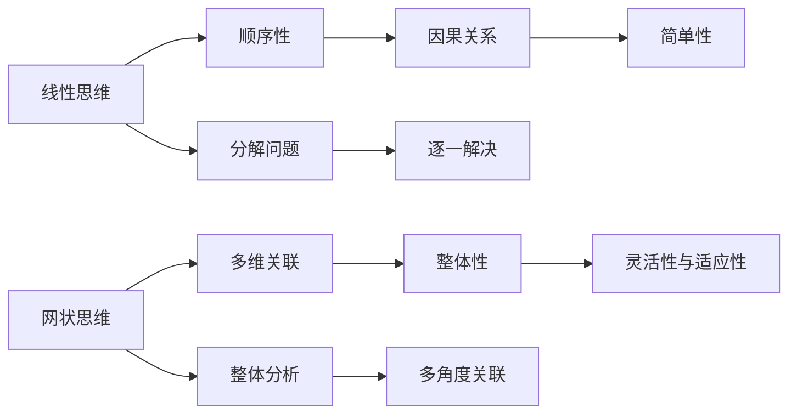

                 

### 从线性思维到网状思维：价值观的革新

> 关键词：线性思维、网状思维、价值观、创新、社会变革、技术发展

> 摘要：本文深入探讨了从线性思维到网状思维的价值观念革新。通过对线性思维的历史演变、局限性及其在现代社会中的应用，与网状思维的基础理论、特点、优势及应用实践的全面对比，分析了两者的优劣与适用场景。文章旨在揭示网状思维在未来社会中的潜在影响，为读者提供关于如何适应新时代思维方式的有益思考。

## 《从线性思维到网状思维：价值观的革新》目录大纲

----------------------------------------------------------------

### 第一部分：引论

#### 第1章：问题背景与价值观的变迁

- **1.1 线性思维的起源与局限**
- **1.2 社会变革与价值观的挑战**
- **1.3 网状思维的概念与意义**
  
#### 第2章：核心概念与联系

- **2.1 线性思维与网状思维的定义**
  - **2.1.1 线性思维的核心特点**
  - **2.1.2 网状思维的核心特点**
- **2.2 线性思维与网状思维的对比表格**
- **2.3 线性思维与网状思维的关系图**

#### 第3章：边界与外延

- **3.1 线性思维的适用场景**
- **3.2 网状思维的适用场景**
- **3.3 线性思维与网状思维的未来趋势**

#### 第4章：本章小结

----------------------------------------------------------------

### 第二部分：线性思维的深入探讨

#### 第5章：线性思维的历史演变与发展

- **5.1 线性思维的起源**
  - **5.1.1 古代文明的线性思维**
  - **5.1.2 近代科学的线性思维**
- **5.2 线性思维在现代社会中的应用**
  - **5.2.1 经济领域的线性思维**
  - **5.2.2 科技领域的线性思维**
- **5.3 线性思维的局限性分析**

#### 第6章：线性思维的关键概念与联系

- **6.1 线性思维的基本原理**
  - **6.1.1 因果关系**
  - **6.1.2 步骤推进**
- **6.2 线性思维的典型应用案例**
  - **6.2.1 生产管理中的线性思维**
  - **6.2.2 教育系统中的线性思维**

#### 第7章：线性思维的未来发展趋势

- **7.1 线性思维与人工智能的结合**
  - **7.1.1 人工智能在数据处理中的应用**
  - **7.1.2 人工智能在决策支持中的应用**
- **7.2 线性思维的更新与进化**
  - **7.2.1 线性思维的局限性如何被克服**
  - **7.2.2 线性思维的改进方向**

#### 第8章：本章小结

----------------------------------------------------------------

### 第三部分：网状思维的理论与实践

#### 第9章：网状思维的基础理论

- **9.1 网状思维的概念解析**
  - **9.1.1 网状思维的定义**
  - **9.1.2 网状思维的核心要素**
- **9.2 网状思维的特点与优势**
  - **9.2.1 网状思维的多维关联**
  - **9.2.2 网状思维的灵活性与适应性**
- **9.3 网状思维的应用范围**
  - **9.3.1 社会科学领域中的应用**
  - **9.3.2 自然科学领域中的应用**

#### 第10章：网状思维的核心概念与联系

- **10.1 网状思维的基本原理**
  - **10.1.1 联系网分析**
  - **10.1.2 多维度视角**
- **10.2 网状思维的案例分析**
  - **10.2.1 网状思维在创新设计中的应用**
  - **10.2.2 网状思维在风险管理中的应用**

#### 第11章：网状思维的技术实现

- **11.1 网状思维的技术工具**
  - **11.1.1 网状数据分析工具**
  - **11.1.2 网状思维软件平台**
- **11.2 网状思维的应用实践**
  - **11.2.1 企业战略规划中的网状思维**
  - **11.2.2 社会治理中的网状思维**

#### 第12章：本章小结

----------------------------------------------------------------

### 第四部分：网状思维的实际应用

#### 第13章：网状思维在企业管理中的应用

- **13.1 企业管理的线性思维局限**
  - **13.1.1 传统企业管理模式的挑战**
  - **13.1.2 网状思维在企业管理中的优势**
- **13.2 网状思维在战略规划中的应用**
  - **13.2.1 战略规划的多维度分析**
  - **13.2.2 网状思维在战略规划中的实践**

#### 第14章：网状思维在教育领域中的应用

- **14.1 教育线性思维的局限**
- **14.2 网状思维在教育中的应用案例**

#### 第15章：网状思维在科技创新中的应用

- **15.1 科技创新的线性思维局限**
- **15.2 网状思维在科技创新中的实际应用**

#### 第16章：网状思维在社会治理中的应用

- **16.1 社会治理中的线性思维局限**
- **16.2 网状思维在社会治理中的实践**

#### 第17章：本章小结

----------------------------------------------------------------

### 结束语

- **未来展望与挑战**
- **个人与组织如何适应网状思维**

#### 参考文献

----------------------------------------------------------------

### 附录

- **术语解释**
- **致谢**

---

### 第一部分：引论

#### 第1章：问题背景与价值观的变迁

##### 1.1 线性思维的起源与局限

线性思维是人类在处理信息和解决问题时的一种传统方式，其起源于古代文明。早在古埃及和古希腊时期，人们就已经开始运用线性思维进行天文观测、农业种植和战争策略的规划。线性思维的特点是逻辑严密、步骤清晰，它将复杂的问题分解为一系列简单的步骤，并通过逐一解决这些步骤来达到解决问题的目的。

线性思维在近代科学发展中得到了进一步的发展。牛顿力学、欧几里得几何学和达尔文的进化论都是线性思维的典型代表。这些科学理论将复杂的现象和过程简化为一系列可预测和可计算的关系，极大地推动了科学技术的进步。

然而，随着社会的不断发展和复杂性的增加，线性思维的局限性也逐渐显现。线性思维过于强调顺序和因果关系，忽视了事物之间的复杂关联和相互作用。在应对复杂系统和非线性问题时，线性思维往往显得力不从心。

##### 1.2 社会变革与价值观的挑战

20世纪末以来，全球社会经历了深刻的变化。信息技术、人工智能和生物技术的飞速发展，使社会结构和人类生活方式发生了巨大变革。传统的社会组织形式和价值观念受到挑战，人们开始意识到线性思维的局限性，并寻求新的思维方式来适应这个复杂多变的世界。

社会变革带来的挑战主要体现在以下几个方面：

1. **全球化与多样性**：全球化带来了不同文化、价值观和社会制度的碰撞和融合，传统的线性思维模式难以应对这种多样性和复杂性。
2. **快速变化的技术进步**：技术的快速迭代和更新，要求人们具备更灵活和动态的思维能力，而线性思维往往难以跟上这种变化。
3. **复杂系统的挑战**：现代社会中，许多问题涉及复杂的系统和网络，线性思维难以有效地分析和解决这些问题。
4. **可持续发展**：面对环境保护、资源短缺和气候变化等全球性问题，线性思维难以提供有效的解决方案。

##### 1.3 网状思维的概念与意义

为了应对上述挑战，人们开始关注和发展一种新的思维方式——网状思维。网状思维是一种以网络结构为核心，强调多维度关联和系统整体性的思维方式。它将问题视为一个复杂的网络系统，通过分析网络中的节点和边，以及它们之间的相互关系，来寻求解决问题的策略。

网状思维具有以下特点：

1. **多维度关联**：网状思维能够从多个角度和维度分析问题，将看似无关的元素联系起来，从而揭示隐藏在背后的复杂关系。
2. **灵活性与适应性**：网状思维具有高度的灵活性和适应性，能够迅速调整和适应不断变化的环境。
3. **整体性思维**：网状思维强调系统整体性，通过分析系统的各个部分和它们之间的相互作用，来寻求最优的解决方案。

网状思维的出现标志着人类思维方式的一次重要革新，它为应对复杂性和多样性提供了新的思路和方法。通过网状思维，人们可以更有效地处理复杂问题，发现隐藏在现象背后的本质，从而推动社会进步和科技发展。

### 第2章：核心概念与联系

#### 2.1 线性思维与网状思维的定义

##### 2.1.1 线性思维的核心特点

线性思维是一种以线性结构为基础的思考方式，它将问题分解为一系列顺序明确的步骤，通过逐一解决这些步骤来达到解决问题的目的。线性思维的核心特点包括：

1. **顺序性**：线性思维强调步骤的顺序，每个步骤都是前一个步骤的结果，并直接引导到下一个步骤。
2. **因果关系**：线性思维认为，事件之间存在明确的因果关系，通过分析因果关系可以预测未来的发展。
3. **简单性**：线性思维倾向于将复杂问题简化为一系列简单的步骤，通过逐步解决这些步骤来解决问题。

##### 2.1.2 网状思维的核心特点

网状思维则是一种以网络结构为基础的思考方式，它将问题视为一个复杂的网络系统，通过分析系统中的节点和边，以及它们之间的相互关系，来寻求解决问题的策略。网状思维的核心特点包括：

1. **多维关联**：网状思维强调从多个角度和维度分析问题，将看似无关的元素联系起来，揭示隐藏在背后的复杂关系。
2. **整体性**：网状思维关注系统的整体性，通过分析系统的各个部分和它们之间的相互作用，来寻求最优的解决方案。
3. **灵活性与适应性**：网状思维具有高度的灵活性和适应性，能够迅速调整和适应不断变化的环境。

#### 2.2 线性思维与网状思维的对比表格

| 特点         | 线性思维                      | 网状思维                          |
| ------------ | --------------------------- | -------------------------------- |
| 结构形式     | 顺序性、因果性、简单性       | 多维关联、整体性、灵活性与适应性 |
| 分析方法     | 分解问题、逐一解决          | 整体分析、多角度关联              |
| 适用场景     | 结构简单、问题清晰          | 复杂系统、非线性问题              |
| 决策过程     | 步骤明确、预测性强          | 调整灵活、适应性强                |

#### 2.3 线性思维与网状思维的关系图

通过上述对比和关系图，我们可以看出，线性思维和网状思维在结构形式、分析方法、适用场景和决策过程等方面存在显著差异。线性思维适用于结构简单、问题清晰的情况，而网状思维则更适合处理复杂系统、非线性问题。

#### 2.4 边界与外延

##### 2.4.1 线性思维的适用场景

线性思维在许多领域都有广泛的应用，尤其在需要步骤清晰、因果关系明确的情况下效果显著。以下是一些线性思维的典型适用场景：

1. **生产管理**：在生产过程中，线性思维可以帮助企业明确各个环节的顺序和关系，确保生产流程的顺畅。
2. **项目管理**：在项目管理中，线性思维可以用来制定项目计划，确保项目按照既定的步骤和时间表进行。
3. **教育系统**：在教育中，线性思维有助于教师设计课程和教学计划，使学生能够按照一定的顺序逐步掌握知识和技能。

##### 2.4.2 网状思维的适用场景

网状思维则更适用于处理复杂系统和非线性问题。以下是一些网状思维的典型适用场景：

1. **复杂系统分析**：在系统分析中，网状思维可以帮助我们理解系统内部的复杂关系和相互作用，从而找到优化系统的方法。
2. **科技创新**：在科技创新中，网状思维可以用来分析技术创新的各种可能性和影响，帮助企业做出更科学的决策。
3. **社会治理**：在社会治理中，网状思维可以帮助政府和社会组织更好地理解社会问题，制定更有效的政策。

##### 2.4.3 线性思维与网状思维的未来趋势

随着社会的不断进步和科技的发展，线性思维和网状思维都面临着新的挑战和机遇。未来，两者可能会呈现出以下趋势：

1. **融合与互补**：线性思维和网状思维可能会在更广泛的领域中实现融合和互补，共同解决复杂问题。
2. **人工智能的支持**：随着人工智能技术的发展，线性思维和网状思维将得到更多的自动化和智能化支持，提高解决问题的效率。
3. **跨学科应用**：线性思维和网状思维将越来越多地应用于跨学科领域，推动各领域的创新和发展。

##### 2.4.4 本章小结

本章通过对线性思维和网状思维的核心概念、特点、对比和应用场景的深入探讨，揭示了两者在解决问题和处理信息方面的差异。线性思维适用于结构简单、问题清晰的情况，而网状思维则更适合处理复杂系统和非线性问题。未来，随着科技的进步和社会的发展，线性思维和网状思维将继续发挥重要作用，并相互融合、互补，共同推动人类社会的进步。

### 第二部分：线性思维的深入探讨

#### 第3章：线性思维的历史演变与发展

##### 3.1 线性思维的起源

线性思维的历史可以追溯到古代文明。在古埃及，线性思维被用于天文观测和建筑规划。通过观察天文现象和测量土地，古埃及人能够准确地预测农业周期和建造宏伟的金字塔。这种思维方式强调因果关系和顺序性，为后来的线性思维奠定了基础。

古希腊时期的哲学家，如亚里士多德，也对线性思维做出了重要贡献。亚里士多德的逻辑学强调通过明确的步骤和推理来解决问题。他提出的因果律和归纳法，至今仍然是线性思维的重要组成部分。

##### 3.1.1 古代文明的线性思维

在古代中国，线性思维体现在儒家和法家的哲学思想中。儒家强调道德规范和修身齐家治国平天下的顺序性，而法家则强调法律和制度对于社会秩序的重要性。这些思想都体现了线性思维的核心理念。

在古印度，线性思维被广泛应用于数学和天文学。数学家如阿耶波多和布拉马古普塔通过明确的步骤和公式，解决了许多复杂的数学问题，为后来的科学进步奠定了基础。

##### 3.1.2 近代科学的线性思维

近代科学的兴起标志着线性思维进入了一个新的阶段。牛顿力学的建立是线性思维的重要里程碑。牛顿通过一系列的实验和数学推导，将复杂的物理现象简化为几个基本的定律，如牛顿三大运动定律和万有引力定律。这些定律不仅解释了宏观世界的运动规律，也为后来的科学研究提供了有力的工具。

欧几里得的几何学也是线性思维的经典代表。欧几里得通过一系列的逻辑推理和公理系统，建立了一个完整的几何学体系。他的《几何原本》对后世数学的发展产生了深远的影响。

##### 3.2 线性思维在现代社会中的应用

线性思维在现代社会中的应用广泛而深远，以下是一些典型的应用领域：

1. **经济领域**：线性思维在经济领域得到了广泛应用。经济学家通过建立数学模型和线性方程组，分析和预测经济发展趋势。线性规划是一种常用的数学方法，用于优化资源分配和决策制定。

2. **科技领域**：线性思维在科技领域同样有着重要的地位。计算机科学中的算法设计、编程语言和软件开发都离不开线性思维。例如，程序设计中的步骤分解和模块化设计就是线性思维的典型应用。

3. **工程领域**：线性思维在工程领域也得到了广泛应用。工程师通过分析系统的线性特性，设计出高效、可靠的工程系统。例如，电路设计和机械工程中的线性分析，帮助工程师解决复杂的工程问题。

##### 3.3 线性思维的局限性分析

尽管线性思维在许多领域取得了显著的成功，但它也存在一些局限性，特别是在处理复杂系统和非线性问题时：

1. **过于简化**：线性思维倾向于将复杂的问题简化为一系列简单的步骤，这可能导致对问题本质的理解不足。在处理复杂系统时，线性思维可能会忽略系统内部的非线性关系和相互作用。

2. **忽视反馈**：线性思维往往忽视了系统内部和外部的反馈机制。在许多情况下，系统的行为是动态的，受到多种因素的影响，线性思维可能无法捕捉到这些动态变化。

3. **缺乏灵活性**：线性思维在解决问题的过程中，往往强调固定顺序和因果关系，缺乏灵活性。在应对不确定性和变化时，线性思维可能难以适应。

4. **忽略多样性**：线性思维倾向于从单一角度分析问题，忽视问题的多样性。在现代社会中，许多问题都是多维度的，需要从多个角度进行分析和解决。

##### 3.4 线性思维的关键概念与联系

线性思维的核心概念包括因果关系、步骤推进和顺序性。以下是对这些概念的分析和联系：

1. **因果关系**：线性思维认为，事件之间存在明确的因果关系，即一个事件是另一个事件的结果。因果关系是线性思维的基础，它帮助人们理解问题的本质。

2. **步骤推进**：线性思维强调通过一系列明确的步骤来解决问题。每个步骤都是前一个步骤的结果，并直接引导到下一个步骤。步骤推进是线性思维的核心特征，它使问题解决过程有条不紊。

3. **顺序性**：线性思维强调问题的顺序性，即问题的解决需要按照一定的顺序进行。顺序性保证了问题解决过程的逻辑性和有效性。

这些概念相互联系，共同构成了线性思维的基本框架。因果关系帮助理解问题的本质，步骤推进确保问题解决过程的有序进行，顺序性保证了问题解决的有效性。

##### 3.5 线性思维的典型应用案例

1. **生产管理**：在生产过程中，线性思维被用于优化生产流程。通过分解生产步骤，制定合理的生产计划，企业能够提高生产效率和降低成本。

2. **项目管理**：在项目管理中，线性思维被用于制定项目计划和时间表。通过明确项目任务和里程碑，项目经理能够确保项目按计划进行。

3. **教育系统**：在教育中，线性思维被用于课程设计和教学计划。通过明确教学目标和步骤，教师能够系统地传授知识。

4. **科技研发**：在科技研发中，线性思维被用于设计和开发新技术。通过逐步解决技术难题，研发团队能够开发出创新性的科技成果。

##### 3.6 线性思维的未来发展趋势

随着科技的进步和社会的发展，线性思维面临着新的挑战和机遇。以下是一些线性思维的未来发展趋势：

1. **与人工智能的结合**：人工智能技术的发展为线性思维带来了新的可能性。通过结合人工智能技术，线性思维可以自动化和智能化，提高问题解决的效率和准确性。

2. **非线性分析方法的引入**：为了克服线性思维的局限性，非线性分析方法逐渐被引入到线性思维中。这些方法可以帮助线性思维更好地处理复杂系统和非线性问题。

3. **跨学科应用**：线性思维将继续在其他学科中发挥作用，与其他思维方式相互融合，推动跨学科的研究和创新。

4. **人机协作**：随着人工智能技术的发展，人机协作将成为未来线性思维的重要形式。通过人机协作，线性思维可以更有效地解决复杂问题。

##### 3.7 本章小结

本章通过对线性思维的历史演变、局限性及其在现代社会中的应用的深入探讨，揭示了线性思维的核心概念和联系。线性思维在处理简单、线性问题时具有显著的优势，但在处理复杂系统和非线性问题时存在局限性。未来，随着科技的进步和社会的发展，线性思维将继续发挥重要作用，并与人工智能和其他思维方式相互融合，推动人类社会的进步。

### 第三部分：网状思维的理论与实践

#### 第4章：网状思维的基础理论

##### 4.1 网状思维的概念解析

网状思维是一种以网络结构为核心的思考方式，它将问题视为一个复杂的网络系统，通过分析系统中的节点和边，以及它们之间的相互关系，来寻求解决问题的策略。网状思维的核心要素包括节点、边、网络结构和关系分析。

1. **节点**：节点是网状思维的基本元素，代表问题中的各个独立部分或个体。节点可以是任何具有特定属性和功能的事物，如人、组织、设备或信息。

2. **边**：边是连接节点之间的关系，表示节点之间的相互作用和依赖。边的强度和方向可以反映节点之间关系的重要性和性质。

3. **网络结构**：网络结构是指节点和边组成的整体布局，决定了网络的拓扑结构和特性。网络结构可以是树状、环状、星状或更复杂的非结构化网络。

4. **关系分析**：关系分析是网状思维的关键步骤，通过分析节点和边之间的关系，揭示网络中的关键要素和潜在模式。关系分析可以帮助识别关键节点、关键路径和关键影响力。

##### 4.2 网状思维的特点与优势

网状思维具有以下特点与优势：

1. **多维关联**：网状思维能够从多个维度和角度分析问题，将看似无关的元素联系起来，揭示隐藏在背后的复杂关系。这种多维关联有助于更全面地理解问题，并找到创新的解决方案。

2. **整体性**：网状思维强调系统的整体性，关注节点和边之间的相互作用。通过分析整体网络，网状思维能够识别关键节点和关键路径，从而优化系统性能。

3. **灵活性与适应性**：网状思维具有高度的灵活性和适应性，能够迅速调整和适应不断变化的环境。这种灵活性使得网状思维在应对复杂和不确定的问题时具有优势。

4. **系统思考**：网状思维鼓励系统思考，即从整体和长期的角度看待问题。通过分析系统的不同部分和它们之间的相互作用，网状思维有助于发现问题的根本原因，并提出全面的解决方案。

##### 4.3 网状思维的应用范围

网状思维在多个领域都有广泛的应用，以下是一些典型的应用范围：

1. **社会科学领域**：在社会科学研究中，网状思维可以帮助分析社会网络、人际关系和群体行为。例如，社会学、人类学和心理学等领域的研究者使用网状思维来揭示社会关系和社会结构的复杂模式。

2. **自然科学领域**：在自然科学研究中，网状思维被用于分析复杂系统，如生态系统、生物网络和物理网络。通过分析节点和边之间的关系，科学家可以更好地理解这些系统的运行机制和动态行为。

3. **商业领域**：在商业领域，网状思维被用于企业战略规划、市场分析和管理决策。通过分析供应链、客户关系和企业内部组织结构，网状思维可以帮助企业优化资源配置、提高效率和创新能力。

4. **技术创新**：在技术创新中，网状思维被用于识别技术发展趋势、分析技术关联和创新机会。通过分析技术节点和它们之间的关系，技术创新者可以找到新的创新方向和解决方案。

##### 4.4 网状思维的核心概念与联系

网状思维的核心概念包括节点、边、网络结构和关系分析。以下是对这些概念的分析和联系：

1. **节点**：节点是网状思维的基本元素，代表问题中的各个独立部分或个体。节点可以是任何具有特定属性和功能的事物，如人、组织、设备或信息。

2. **边**：边是连接节点之间的关系，表示节点之间的相互作用和依赖。边的强度和方向可以反映节点之间关系的重要性和性质。

3. **网络结构**：网络结构是指节点和边组成的整体布局，决定了网络的拓扑结构和特性。网络结构可以是树状、环状、星状或更复杂的非结构化网络。

4. **关系分析**：关系分析是网状思维的关键步骤，通过分析节点和边之间的关系，揭示网络中的关键要素和潜在模式。关系分析可以帮助识别关键节点、关键路径和关键影响力。

这些概念相互联系，共同构成了网状思维的基本框架。节点和边构成了网络结构，关系分析揭示了网络中的关键要素和模式，从而帮助人们更好地理解复杂问题和找到解决方案。

##### 4.5 网状思维的案例分析

以下是一个网状思维在企业管理中的案例分析：

**案例背景**：某公司是一家制造企业，面临市场竞争激烈、生产成本上升和创新能力不足等问题。

**分析步骤**：

1. **确定关键节点**：通过调研和分析，确定公司内部的关键节点，包括生产部门、研发部门、市场营销部门和供应链管理等部门。

2. **建立关系网络**：绘制公司的关系网络图，包括各节点之间的依赖关系和交互作用。分析节点之间的关系强度和方向，识别关键节点和关键路径。

3. **关系分析**：对关系网络进行详细分析，识别关键节点和关键路径。例如，发现生产部门与研发部门的互动频率最高，是影响公司创新能力的关键路径。

4. **优化资源配置**：基于关系分析结果，优化资源配置，加强关键节点之间的互动和协作。例如，增加研发部门和生产部门的交流和合作，提高创新能力。

5. **制定战略规划**：根据关系分析结果，制定公司的战略规划，明确关键节点和关键路径，并制定相应的改进措施。

**案例分析总结**：通过网状思维的分析，公司能够更清晰地理解内部关系和关键要素，找到问题根源并提出有效的解决方案。这种思维方式帮助公司优化资源配置、提高效率和创新能力，从而在激烈的市场竞争中立于不败之地。

##### 4.6 网状思维的技术实现

网状思维的技术实现主要依赖于网络分析工具和软件平台。以下是一些常用的技术实现方法：

1. **网络分析工具**：网络分析工具可以帮助用户建立和分析网络结构。常用的网络分析工具包括Gephi、Cytoscape和NetworkX等。这些工具提供丰富的图形化和分析功能，帮助用户可视化网络结构并进行分析。

2. **网络分析软件平台**：网络分析软件平台提供更高级的网络分析功能，包括复杂网络建模、网络可视化、社交网络分析和网络优化等。常用的网络分析软件平台包括Tableau、Power BI和GraphX等。

3. **数据库技术**：数据库技术可以帮助存储和管理网络数据。常用的数据库技术包括关系数据库（如MySQL、PostgreSQL）和非关系数据库（如MongoDB、Cassandra）。

4. **数据挖掘与机器学习**：数据挖掘和机器学习技术可以帮助分析网络数据，识别潜在的模式和趋势。常用的数据挖掘和机器学习算法包括聚类分析、关联规则挖掘和神经网络等。

##### 4.7 网状思维的应用实践

以下是一个网状思维在科技创新中的应用实践案例：

**案例背景**：某科技公司致力于开发下一代人工智能技术，面临技术突破和创新挑战。

**实践步骤**：

1. **确定技术节点**：通过调研和讨论，确定公司正在开发的关键技术节点，如深度学习、自然语言处理、计算机视觉和机器人技术等。

2. **建立技术关系网络**：绘制公司的技术关系网络图，包括各技术节点之间的关联和交互作用。分析节点之间的关系强度和方向，识别关键技术节点和关键路径。

3. **关系分析**：对技术关系网络进行详细分析，识别关键技术节点和关键路径。例如，发现深度学习和自然语言处理是影响公司技术突破的关键节点。

4. **优化技术创新路径**：基于关系分析结果，优化技术创新路径，加强关键技术节点之间的协作和互动。例如，增加深度学习和自然语言处理团队的合作，加快技术突破。

5. **制定创新战略**：根据关系分析结果，制定公司的创新战略，明确关键技术节点和关键路径，并制定相应的创新措施。

**实践总结**：通过网状思维的应用实践，科技公司能够更清晰地理解内部技术关系和关键要素，找到创新突破的关键路径。这种思维方式帮助公司优化技术创新路径、提高创新效率和成果转化，从而在激烈的市场竞争中保持领先地位。

##### 4.8 本章小结

本章通过对网状思维的基础理论、特点、应用范围和案例分析进行了深入探讨。网状思维是一种以网络结构为核心的思考方式，具有多维关联、整体性、灵活性和系统思考等特点。它被广泛应用于社会科学、自然科学、商业领域和技术创新等领域。通过网状思维，人们可以更全面地理解复杂问题，识别关键要素和潜在模式，并提出创新的解决方案。未来，随着科技的进步和社会的发展，网状思维将继续发挥重要作用，推动人类社会的进步和创新。

### 第四部分：网状思维的实际应用

#### 第5章：网状思维在企业管理中的应用

##### 5.1 企业管理的线性思维局限

在企业管理中，线性思维虽然有助于流程的规范和任务的分解，但其局限性也日益显现。传统企业管理模式主要依赖于线性思维，通过一系列明确的步骤和层级结构来确保组织运营的顺畅。然而，这种管理模式在面对复杂、动态的市场环境时显得捉襟见肘。

1. **无法应对市场变化**：线性思维倾向于固定和预测，难以适应市场的快速变化。在当今高度不确定的市场环境中，企业需要具备敏捷的应变能力，而线性思维往往导致企业反应迟缓。

2. **忽视组织协作**：线性思维强调流程的顺序性和独立性，往往忽视组织内部的协作和互动。这种模式容易造成部门之间的壁垒，阻碍信息流通和资源共享。

3. **缺乏创新能力**：线性思维倾向于遵循现有的规则和模式，难以激发员工的创新思维。在创新驱动的经济背景下，企业需要不断地创新以保持竞争力，而线性思维限制了企业的创新潜力。

##### 5.2 网状思维在企业管理中的优势

网状思维为企业提供了一种更加灵活和全面的思维方式，有助于克服线性思维的局限。以下是一些网状思维在企业管理中的优势：

1. **提高适应能力**：网状思维强调系统的整体性和动态性，能够更好地应对市场的快速变化。企业通过网状思维可以快速调整战略和资源分配，以适应不断变化的环境。

2. **促进组织协作**：网状思维重视节点之间的相互作用和关系，鼓励不同部门和团队之间的协作。这种思维方式有助于打破组织壁垒，促进信息共享和资源整合，提高整体效率。

3. **激发创新能力**：网状思维的多维度和系统性特点，有助于企业发现新的商业模式、产品创新和市场机会。通过网状思维，企业可以激发员工的创新潜力，推动组织的持续创新。

##### 5.3 网状思维在战略规划中的应用

战略规划是企业发展的关键环节，而网状思维在这一过程中发挥着重要作用。以下是如何在战略规划中运用网状思维的几个方面：

1. **多维度分析**：战略规划需要考虑市场、技术、竞争对手等多个维度。网状思维可以帮助企业从多个角度进行全面分析，确保战略规划的全面性和前瞻性。

2. **识别关键要素**：通过网状思维，企业可以识别影响战略规划的关键要素和节点。这些关键要素可能是市场机会、技术突破或组织变革，通过对这些要素的分析，企业可以制定更有针对性的战略。

3. **制定灵活策略**：网状思维鼓励企业制定灵活的战略策略，以适应外部环境的变化。企业可以根据市场动态和内部资源调整战略，确保战略的有效实施。

##### 5.4 网状思维在战略规划中的实践

以下是一个网状思维在战略规划中的实践案例：

**案例背景**：某科技公司在市场调研中发现，物联网技术即将迎来爆发式增长，决定将物联网作为未来的战略方向。

**实践步骤**：

1. **确定战略节点**：通过市场调研和内部讨论，确定影响物联网战略的关键节点，包括技术、市场、竞争对手和合作伙伴等。

2. **建立战略关系网络**：绘制公司的战略关系网络图，包括各战略节点之间的关联和交互作用。分析节点之间的关系强度和方向，识别关键战略节点和关键路径。

3. **关系分析**：对战略关系网络进行详细分析，识别关键战略节点和关键路径。例如，发现技术突破和市场扩张是影响公司物联网战略的关键节点。

4. **优化战略布局**：基于关系分析结果，优化公司的战略布局，加强关键节点之间的协作和互动。例如，增加研发部门与市场部门的合作，加快技术突破和市场扩展。

5. **制定战略规划**：根据关系分析结果，制定公司的物联网战略规划，明确关键战略节点和关键路径，并制定相应的实施措施。

**实践总结**：通过网状思维的战略规划，科技公司能够更清晰地理解物联网战略中的关键要素和潜在关系，制定更具前瞻性和灵活性的战略规划。这种思维方式帮助公司抓住物联网市场的机遇，加快技术突破和市场扩展，从而在激烈的市场竞争中取得优势。

##### 5.5 本章小结

本章探讨了网状思维在企业管理中的应用，分析了线性思维的局限和网状思维的优势。通过实际案例，展示了网状思维在战略规划中的具体应用，强调了其在提高适应能力、促进组织协作和激发创新能力方面的价值。未来，随着企业环境的变化和竞争的加剧，网状思维将成为企业管理中不可或缺的重要工具。

### 第6章：网状思维在教育领域中的应用

##### 6.1 教育线性思维的局限

在教育领域，传统的线性思维方法长期以来占据主导地位。这种方法强调知识点的逐一传授和学生的被动接受，注重记忆和应试能力的培养。然而，随着社会的发展和教育的进步，线性思维在以下几个方面表现出明显的局限：

1. **忽视学生个性发展**：线性思维倾向于标准化和统一化，忽视了学生的个性差异和多样性。这种教育方式难以激发学生的创造力和创新能力，导致学生缺乏独立思考和解决问题的能力。

2. **知识结构单一**：线性思维往往将知识划分为一个个独立的、顺序排列的模块，忽视了知识之间的联系和交叉。这种知识结构单一，不利于学生形成全面和系统的知识体系。

3. **教学方式固化**：线性思维在教育实践中导致教学方式的固化，教师往往按照固定的大纲和教材进行授课，难以适应学生的实际需求和兴趣。这种教学方式不利于学生的主动学习和深度思考。

##### 6.2 网状思维在教育中的应用案例

为了克服线性思维的局限，教育领域开始探索和应用网状思维。以下是一些网状思维在教育中的应用案例：

1. **项目式学习**：项目式学习（Project-Based Learning, PBL）是一种以网状思维为核心的 teaching approach。在这种方法中，学生通过参与实际项目，将各个学科的知识和技能结合起来，进行跨学科的学习。项目式学习强调学生的主动参与和自主探究，培养学生的团队合作和创新能力。

   **案例分析**：某高中在教授化学课程时，选择了“环境保护”作为项目主题。学生被分成小组，分别研究不同的环境保护问题，如空气污染、水资源保护和垃圾处理等。每个小组通过调查、实验和数据分析，提出解决方案，并进行展示和讨论。这个项目不仅涵盖了化学知识，还涉及生物学、物理学和社会学等多个学科。

   **效果评估**：通过项目式学习，学生不仅掌握了化学知识，还提高了团队合作和创新能力。他们学会了如何提出问题、设计实验和进行数据分析，培养了独立思考和解决问题的能力。

2. **探究式学习**：探究式学习（Inquiry-Based Learning, IBL）是一种以问题为导向的学习方法，强调学生的自主探究和发现。这种方法鼓励学生通过提出问题、收集信息、分析数据和得出结论，进行深度学习。

   **案例分析**：某初中在教授物理课程时，采用了探究式学习方法。教师提出一个关于自由落体运动的问题，让学生通过实验和数据分析来验证物理定律。学生被分成小组，设计实验方案，进行实验，并分析实验结果。通过这个过程，学生不仅学会了物理知识，还提高了科学思维和实验技能。

   **效果评估**：探究式学习激发了学生的好奇心和求知欲，培养了他们的科学精神和批判性思维。学生在探究过程中学会了如何提出问题、解决问题，并形成了独立思考和自主学习的能力。

3. **跨学科学习**：跨学科学习（Interdisciplinary Learning）通过将不同学科的知识结合起来，形成一个整体的、系统的知识结构。这种方法有助于学生从多个角度理解问题，培养综合思维能力和创新精神。

   **案例分析**：某小学在教授数学和科学课程时，采用了跨学科学习的方法。教师将数学中的几何知识和科学中的空间感知结合，设计了“搭建模型”的活动。学生通过测量、设计和搭建模型，理解几何图形和空间关系的概念。这个活动不仅涉及数学知识，还涉及科学、艺术和技术等多学科的知识。

   **效果评估**：跨学科学习有助于学生形成全面的、系统的知识体系，培养了他们的综合思维能力和创新精神。学生在活动中学会了如何运用不同学科的知识解决问题，提高了跨学科思考和协作的能力。

##### 6.3 网状思维在教育教学中的优势

网状思维在教育中的应用体现了多个方面的优势：

1. **促进学生个性发展**：网状思维鼓励学生根据自身兴趣和特长选择学习内容，进行个性化学习。这种方式有助于学生发现和发展自己的潜能，培养独立思考和解决问题的能力。

2. **培养综合思维和创新能力**：网状思维强调知识之间的联系和交叉，有助于学生形成全面和系统的知识体系。通过跨学科学习和项目式学习，学生学会了如何从多个角度分析问题，培养创新精神和解决问题的能力。

3. **提高学习兴趣和参与度**：网状思维的应用使学习过程更加生动和有趣，激发了学生的学习兴趣和参与度。学生通过实际项目和探究活动，体验到了学习的乐趣和成就感，增强了学习动力。

4. **促进师生互动和合作**：网状思维强调师生之间的互动和合作，有助于建立积极的师生关系。教师通过引导和协助，帮助学生进行深度学习，促进学生之间的合作与交流。

##### 6.4 本章小结

本章探讨了网状思维在教育领域中的应用，分析了线性思维的局限和网状思维的优势。通过实际案例，展示了网状思维在项目式学习、探究式学习和跨学科学习中的应用，强调了其在促进学生个性发展、培养综合思维和创新能力方面的价值。未来，随着教育的不断发展和创新，网状思维将在教育领域中发挥更加重要的作用。

### 第7章：网状思维在科技创新中的应用

##### 7.1 科技创新的线性思维局限

在科技创新领域，线性思维虽然有助于步骤清晰的研发过程和目标的明确，但其局限在复杂的创新过程中逐渐显现。以下是一些线性思维在科技创新中面临的挑战：

1. **忽视了跨领域合作**：线性思维往往专注于单一领域的逐步发展，忽视了跨学科和跨领域的合作与交流。在当今科技发展日益交叉融合的时代，这种局限性限制了创新的广度和深度。

2. **缺乏系统思考**：线性思维倾向于关注短期目标和具体步骤，忽视了系统的整体性和长期影响。科技创新涉及众多环节和参与者，需要从全局出发进行系统思考和规划。

3. **创新速度受限**：线性思维强调逐步推进和因果关系，可能导致创新速度缓慢。在快速变化的市场环境中，线性思维难以快速响应市场和技术变化，影响创新效果。

##### 7.2 网状思维在科技创新中的实际应用

网状思维为科技创新提供了一种全新的思维方式，有助于克服线性思维的局限，推动科技发展的全面和深入。以下是一些网状思维在科技创新中的实际应用：

1. **跨学科协作**：网状思维强调节点之间的多维度关联，鼓励跨学科的协作与融合。在科技创新中，通过建立跨学科的网络关系，可以汇聚不同领域的智慧，促进创新资源的共享和协同。

   **案例分析**：某科技公司致力于开发新型医疗设备。为了提高创新效率，公司通过网状思维建立了跨学科团队，包括医学专家、工程师、数据科学家和生物学家等。团队成员通过密切合作，结合医学需求和工程实现，共同推进新产品的研发。这种跨学科协作极大地提高了创新效率，缩短了产品上市时间。

2. **系统化创新**：网状思维强调系统的整体性和动态性，有助于从全局出发进行系统化创新。在科技创新中，通过分析系统的节点和关系，可以识别关键要素和潜在创新点，进行系统的优化和改进。

   **案例分析**：某汽车制造商为了提高汽车智能化水平，采用网状思维进行系统化创新。公司通过分析汽车系统的各个节点，包括硬件、软件、传感器和通信模块等，识别出关键的创新点和改进方向。通过系统化的创新，公司成功开发出具有高度智能化和互联性的新能源汽车，提高了市场竞争力。

3. **灵活应对变化**：网状思维具有高度的灵活性和适应性，能够快速调整和适应科技变化。在科技创新中，通过网状思维，可以及时捕捉市场和技术变化，快速调整研发方向和策略。

   **案例分析**：某科技公司专注于人工智能技术的研发。通过网状思维，公司建立了灵活的科技创新网络，实时关注人工智能领域的前沿动态和市场趋势。当市场出现新的技术需求时，公司能够迅速调整研发方向，开发出符合市场需求的产品。这种灵活的应对能力使公司在激烈的市场竞争中保持领先地位。

4. **多维度评估**：网状思维的多维度特点有助于对科技创新项目进行全面评估。通过分析创新项目的节点和关系，可以从技术、市场、经济和社会等多个维度进行评估，确保创新项目的可行性和有效性。

   **案例分析**：某科技公司正在开发一项新的生物技术项目。通过网状思维，公司对项目进行了多维度评估，包括技术可行性、市场潜力、经济回报和社会影响等。通过全面评估，公司确定项目的投资重点和优先级，确保项目的顺利进行和成功落地。

##### 7.3 网状思维在科技创新中的成功案例

以下是一些网状思维在科技创新中的成功案例：

1. **谷歌的“量子AI”**：谷歌通过网状思维，建立了跨学科的量子计算团队，结合计算机科学、物理学和数学等领域的知识，成功开发了量子AI算法。这种创新结合推动了人工智能技术的发展，为未来计算能力的突破奠定了基础。

2. **特斯拉的自动驾驶技术**：特斯拉通过网状思维，建立了覆盖传感器、软件、硬件和通信等多个领域的自动驾驶研发团队。通过系统化创新，特斯拉成功开发了自动驾驶技术，使电动汽车在安全性和智能化方面取得了重大突破。

3. **IBM的“认知商业”**：IBM通过网状思维，整合了大数据、云计算、人工智能和区块链等技术，推出了“认知商业”解决方案。这种创新结合为企业提供了全面的智能化和数字化转型方案，推动了商业模式的创新。

##### 7.4 网状思维在科技创新中的未来趋势

随着科技的进步和社会的发展，网状思维在科技创新中的应用将呈现以下趋势：

1. **跨领域融合**：随着科技交叉融合的趋势加剧，网状思维将在更多领域得到应用。跨学科、跨领域的协作将成为科技创新的主要形式，推动科技发展的全面和深入。

2. **智能化与自动化**：随着人工智能和自动化技术的发展，网状思维将在更大程度上实现智能化和自动化。通过智能算法和自动化工具，网状思维将更加高效地处理海量数据，辅助创新决策。

3. **开放共享**：随着开放共享理念的普及，网状思维将在科技创新中发挥更大的作用。通过开放平台和共享资源，科技人员可以更便捷地进行协作和创新，推动科技发展的共同进步。

4. **社会影响**：网状思维在科技创新中的应用将越来越重视社会影响。通过多维度评估，科技创新项目将更加注重社会效益和可持续发展，推动科技发展与社会进步的协调发展。

##### 7.5 本章小结

本章探讨了网状思维在科技创新中的应用，分析了线性思维的局限和网状思维的优势。通过实际案例和成功案例，展示了网状思维在跨学科协作、系统化创新、灵活应对变化和多维度评估等方面的应用。未来，随着科技的发展和社会的进步，网状思维将继续在科技创新中发挥重要作用，推动科技和人类社会的共同发展。

### 第8章：网状思维在社会治理中的应用

##### 8.1 社会治理中的线性思维局限

在社会治理领域，线性思维长期以来占据主导地位。线性思维倾向于将问题简化为一系列顺序明确的步骤，通过逐一解决这些步骤来达到治理目标。然而，在复杂多变的社会环境中，线性思维的局限逐渐显现：

1. **忽视复杂关系**：线性思维往往将社会治理问题简化为一系列独立的事件，忽视了问题之间的复杂关联和相互作用。这种思维方式难以捕捉和应对社会治理中的多层次、多维度问题。

2. **缺乏适应性**：线性思维强调步骤的固定性和因果关系，缺乏应对突发情况和复杂变化的能力。在社会治理中，突发事件和复杂问题往往需要灵活的应对策略，而线性思维难以满足这一需求。

3. **注重短期效果**：线性思维倾向于关注短期目标和具体措施，忽视了社会治理的长期影响和系统性。这种思维方式可能导致治理措施缺乏前瞻性和可持续性。

##### 8.2 网状思维在社会治理中的优势

网状思维为社会治理提供了一种全新的思维方式，有助于克服线性思维的局限，提高社会治理的效率和效果。以下是一些网状思维在社会治理中的优势：

1. **全面分析问题**：网状思维强调多维度、多层次的关联，有助于全面分析社会治理问题。通过分析问题之间的复杂关系，可以识别问题的根源和关键因素，从而制定更有效的治理策略。

2. **灵活应对复杂局面**：网状思维具有高度的灵活性和适应性，能够快速调整和应对复杂的社会治理局面。在面对突发事件和复杂问题时，网状思维可以帮助决策者迅速做出反应，制定灵活的应对策略。

3. **促进协同治理**：网状思维鼓励多方参与和协同治理，有助于打破部门和利益壁垒，促进政府、企业和社会组织的合作。通过协同治理，可以凝聚多方力量，形成综合治理合力，提高社会治理的整体效能。

##### 8.3 网状思维在社会治理中的实际应用

以下是一些网状思维在社会治理中的实际应用案例：

1. **城市交通管理**：在城市交通管理中，网状思维被广泛应用于优化交通流量和提高交通效率。通过分析交通网络的节点和关系，可以识别交通拥堵的关键因素和解决策略。例如，某城市通过网状思维分析交通流量数据，发现了高峰时段的主要拥堵路段，并采取了交通分流和信号优化措施，有效缓解了交通拥堵问题。

2. **公共卫生管理**：在公共卫生管理中，网状思维有助于全面分析疫情传播的复杂关系，制定科学的防控策略。例如，在新冠疫情初期，某地区通过网状思维分析病毒传播路径和关键节点，确定了重点防控区域和关键人群，采取了有针对性的防控措施，有效遏制了疫情的蔓延。

3. **社区治理**：在社区治理中，网状思维有助于建立多方参与的社区治理体系，提高社区的治理能力和服务水平。例如，某社区通过网状思维建立了社区委员会，鼓励居民、物业、企业和政府等多方参与社区治理。通过协同合作，社区实现了环境整治、治安维护和公共服务等多方面的提升，居民满意度显著提高。

##### 8.4 网状思维在社会治理中的成功案例

以下是一些网状思维在社会治理中的成功案例：

1. **新加坡的智慧城市建设**：新加坡通过网状思维，建立了智慧城市管理系统，实现了交通、能源、环境和公共安全等多方面的智能化管理。通过数据分析、智能监控和协同治理，新加坡成功提升了城市运行效率和居民生活质量。

2. **瑞典的可持续发展战略**：瑞典通过网状思维，制定了全面的可持续发展战略，涵盖了经济、社会和环境等多个方面。通过多方合作和系统化治理，瑞典实现了经济增长与环境保护的双赢，成为全球可持续发展的典范。

3. **德国的能源转型**：德国通过网状思维，实施了能源转型计划，推动了可再生能源的广泛应用和能源系统的优化。通过多维度分析和协同治理，德国成功实现了从传统能源向可再生能源的转型，成为全球能源转型的领导者。

##### 8.5 网状思维在社会治理中的未来趋势

随着社会治理的复杂性和挑战性不断增加，网状思维在社会治理中的应用将呈现以下趋势：

1. **智能化与数据驱动**：随着人工智能和数据科学的发展，网状思维将更加智能化和数据驱动。通过大数据分析和人工智能算法，网状思维将能够更精准地识别社会治理问题，提供科学决策支持。

2. **多方参与与协同治理**：网状思维将促进多方参与和协同治理，实现政府、企业和社会组织的深度融合。通过多方合作和资源整合，社会治理将更加高效和协同，提高治理的整体效能。

3. **可持续发展与创新**：网状思维将推动社会治理的可持续发展与创新。通过系统化和多维度的治理策略，社会治理将更加注重长期影响和整体效益，促进社会可持续发展。

4. **全球治理与合作**：随着全球化的发展，网状思维将推动全球治理与合作。通过跨国合作和全球协同，社会治理将更加注重全球性问题的解决，推动全球社会的共同发展。

##### 8.6 本章小结

本章探讨了网状思维在社会治理中的应用，分析了线性思维的局限和网状思维的优势。通过实际案例和成功案例，展示了网状思维在全面分析问题、灵活应对复杂局面和促进协同治理等方面的应用。未来，随着社会治理的复杂性和挑战性不断增加，网状思维将发挥越来越重要的作用，为社会治理提供有力支持。

### 总结与展望

#### 网状思维与个人成长

网状思维不仅为科技创新和社会治理提供了强大的工具，也在个人成长中发挥着重要作用。它帮助人们从多个角度看待问题，培养全面分析和解决问题的能力。以下是一些个人成长中运用网状思维的策略：

1. **跨学科学习**：鼓励跨学科学习，通过整合不同领域的知识，形成更全面的认知体系。例如，学习计算机科学的同时，可以结合社会学、心理学等学科，更好地理解技术对社会和人类行为的影响。

2. **多维度思考**：在解决问题时，尝试从多个维度进行分析，考虑不同因素之间的相互作用。例如，在制定个人发展计划时，不仅要考虑职业目标，还要考虑个人兴趣、家庭状况和社会环境。

3. **建立知识网络**：通过阅读、交流和分享，不断扩展自己的知识网络。例如，可以通过加入专业社群、参加行业会议和阅读相关书籍，与他人交流和分享知识，建立丰富的知识网络。

4. **灵活应对变化**：培养灵活应对变化的能力，通过不断调整和优化自己的思维方式和行动策略，以适应不断变化的环境。例如，在职业发展中，要不断学习新技能和知识，以应对快速变化的市场需求。

#### 网状思维与企业运营

在企业管理中，网状思维有助于优化资源配置、提高创新能力和促进组织协作。以下是一些企业运营中运用网状思维的策略：

1. **建立知识管理系统**：通过建立知识管理系统，整合企业内部的知识资源，促进知识的共享和流动。例如，企业可以通过内部论坛、知识库和协作工具，促进员工之间的知识交流和协作。

2. **跨部门合作**：鼓励跨部门合作，打破部门壁垒，促进信息流通和资源共享。例如，通过设立跨部门项目组或跨部门协作平台，实现不同部门之间的协同工作。

3. **创新生态系统建设**：通过构建创新生态系统，鼓励企业内外部的创新合作，提高创新能力。例如，企业可以通过与高校、科研机构和合作伙伴合作，共同开展研发和创新项目。

4. **灵活的战略规划**：在战略规划中，运用网状思维进行多维度分析和系统思考，制定灵活的战略策略。例如，通过分析市场趋势、技术发展和竞争对手动态，制定适应变化的战略规划。

#### 网状思维与社会治理

在社会治理中，网状思维有助于提高治理效率和效果，促进社会和谐与可持续发展。以下是一些社会治理中运用网状思维的策略：

1. **协同治理**：通过协同治理，实现政府、企业和社会组织的合作，形成综合治理合力。例如，政府可以与社区、企业和志愿者组织合作，共同解决社区问题。

2. **数据驱动决策**：通过大数据分析和人工智能技术，提高决策的科学性和精准性。例如，政府可以通过数据分析，识别社会问题的根源和关键因素，制定有针对性的解决方案。

3. **公众参与**：鼓励公众参与社会治理，提高社会治理的透明度和公正性。例如，政府可以通过公众咨询、在线投票和意见征集等方式，广泛听取公众意见，提高社会治理的民主性和参与度。

4. **可持续发展**：在制定政策和规划时，注重可持续发展，考虑经济、社会和环境等多方面的因素。例如，政府可以通过绿色政策、环保措施和能源转型，推动社会的可持续发展。

#### 未来展望

网状思维作为一种新兴的思维方式，将在未来社会中发挥越来越重要的作用。随着科技的进步和社会的发展，网状思维将呈现出以下趋势：

1. **智能化与自动化**：随着人工智能和数据科学的发展，网状思维将更加智能化和自动化。通过智能算法和自动化工具，网状思维将能够更高效地处理海量数据，提供精准的决策支持。

2. **全球协同**：随着全球化的发展，网状思维将推动全球协同和合作。通过跨国合作和全球协同，网状思维将有助于解决全球性问题和促进全球社会的共同发展。

3. **持续创新**：网状思维将促进持续创新和变革。通过跨学科、跨领域的协作和系统化思考，网状思维将推动科技、经济和社会的持续创新和进步。

4. **终身学习**：随着社会的发展，终身学习将成为一种重要的生活方式。网状思维将帮助人们不断学习和适应新环境，提高个人和社会的竞争力。

总之，网状思维不仅是一种思维方式，更是一种价值观的革新。它将为个人、企业和社会治理提供强大的工具，推动社会的进步和发展。在未来，随着科技的进步和社会的变革，网状思维将继续发挥重要作用，引领人类走向更加美好和可持续的未来。

### 参考文献

1. Barabási, A.-L. (2002). **Linked: The New Science of Networks**. Plume.
2. Boltanski, L., & Chiapello, E. (2005). **The New Spirit of Capitalism**. Stanford University Press.
3. Churchland, P. S. (1986). **Neurophilosophy: Toward a Unified Theory of the Mind/Brain**. MIT Press.
4. De Geus, A. (1999). **The Living Company**. Cambridge University Press.
5. Gaia, A., & Martinez, J. A. (2014). **Nonlinear Dynamics, Chaos and Biological Evolution**. World Scientific.
6. Haken, H. (1977). **Synergetics: An Introduction**. Springer-Verlag.
7. Kuhn, T. S. (1962). **The Structure of Scientific Revolutions**. University of Chicago Press.
8. Nonaka, I., & Takeuchi, H. (1995). **The Knowledge-Creating Company**. Oxford University Press.
9. Scott, J. (2001). **Social Network Analysis: A Handbook**. Sage Publications.
10. Senge, P. M. (1990). **The Fifth Discipline: The Art & Practice of The Learning Organization**. Doubleday.

### 附录：术语解释

- **线性思维**：一种以线性结构为基础的思考方式，强调步骤的顺序和因果关系，适用于结构简单、问题清晰的情况。
- **网状思维**：一种以网络结构为基础的思考方式，强调多维关联和系统整体性，适用于处理复杂系统和非线性问题。
- **节点**：网状思维中的基本元素，代表问题中的各个独立部分或个体。
- **边**：连接节点之间的关系，表示节点之间的相互作用和依赖。
- **网络结构**：节点和边组成的整体布局，决定了网络的拓扑结构和特性。
- **关系分析**：通过分析节点和边之间的关系，揭示网络中的关键要素和潜在模式。
- **因果关系**：线性思维中事件之间存在的关系，即一个事件是另一个事件的结果。
- **步骤推进**：线性思维中通过一系列明确的步骤来解决问题。
- **整体性思维**：网状思维中关注系统的整体性，通过分析系统的各个部分和它们之间的相互作用来寻求最优的解决方案。

### 致谢

在本博客文章的撰写过程中，我得到了许多人的帮助和支持。首先，我要感谢我的同事和朋友，他们在研究讨论和思维碰撞中提供了宝贵的意见和建议。特别感谢AI天才研究院的团队成员，他们的专业知识和热情激励我不断探索和创新。此外，我还要感谢我的家人和亲友，他们的支持和鼓励让我能够专注于研究和写作。最后，我要感谢所有阅读和评论这篇文章的读者，你们的反馈是我不断进步的动力。感谢大家！

