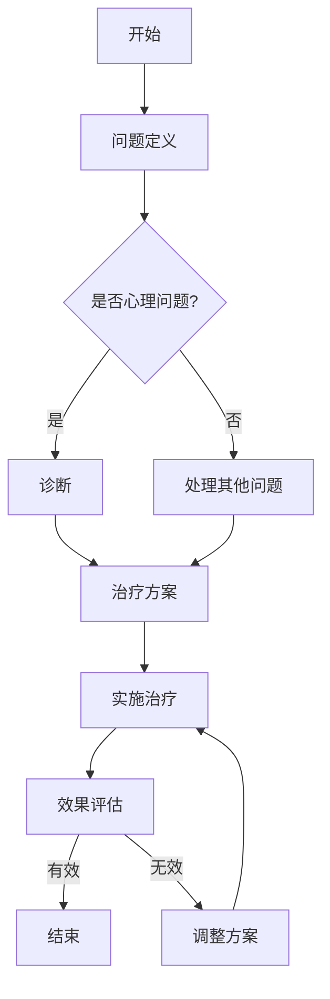
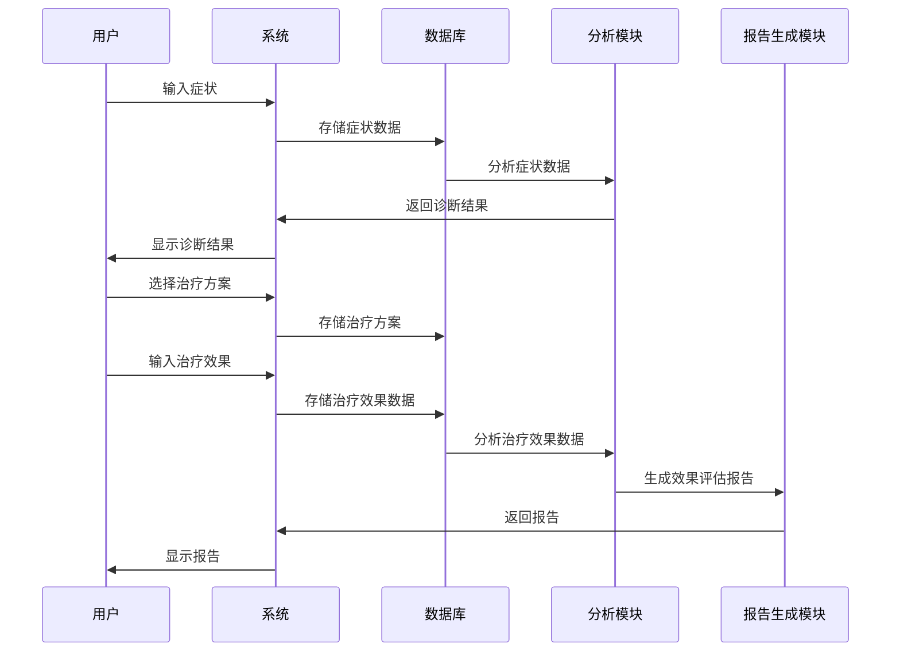
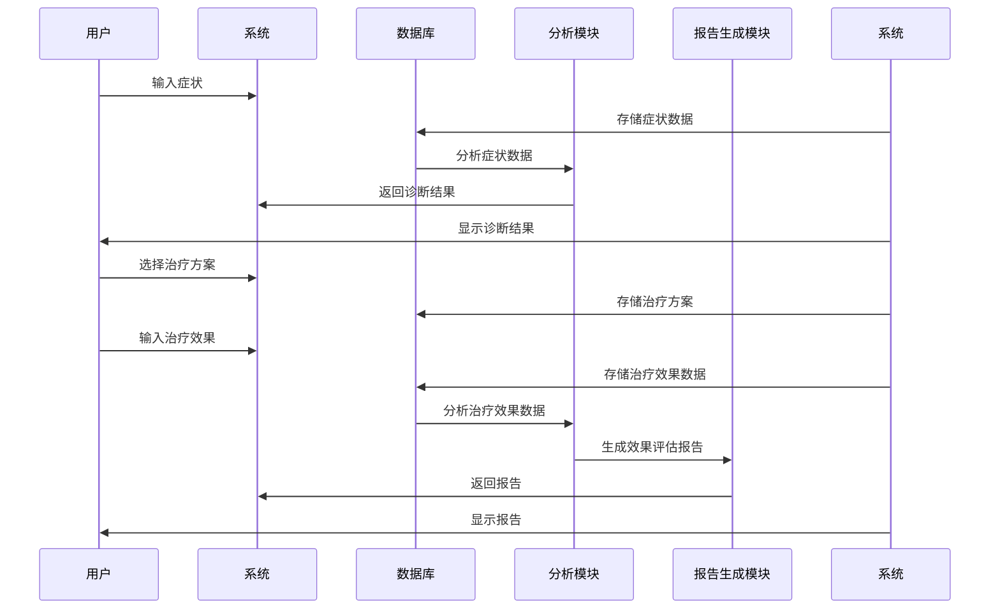

                 

### 《从虚无到重建：现代人的精神之旅》

> 关键词：现代人精神状态，自我探索，心灵重建，心理健康

> 摘要：本文深入探讨了现代人的精神状态，分析了精神空虚、焦虑、抑郁等心理问题，提出了自我探索的方法和心灵重建的实践路径。通过理论阐述、案例分析及最佳实践，为读者提供了一套全面、实用的精神之旅指南。

----------------------------------------------------------------

# 引言

在信息爆炸、快节奏生活的现代环境中，现代人面临着前所未有的精神压力。工作压力、社交焦虑、人际关系紧张、孤独感等心理问题日益凸显。这些问题不仅影响个人的心理健康，还可能对工作、学习和生活产生负面影响。因此，如何找到一种方法来重建我们的精神世界，成为了现代人亟待解决的重要课题。

本文将从以下几个方面展开探讨：

1. 现代人的精神现状
2. 精神世界的理论基础
3. 自我探索的方法与工具
4. 心灵重建的实践
5. 案例分析
6. 心灵重建的最佳实践
7. 结论与展望

希望通过本文的探讨，能够帮助读者找到一条适合自己的精神之旅，重建内心的平衡与和谐。

----------------------------------------------------------------

## 第1章 现代人的精神现状

### 1.1 精神健康的定义与标准

精神健康是指个体在认知、情感、行为和社会适应等方面处于良好的状态。它不仅仅是没有精神疾病，还包括积极的情感体验、良好的社会功能和适度的压力反应。世界卫生组织（WHO）将心理健康定义为“一个人在认识和处理日常压力、工作负担以及人际关系等方面，能够保持平衡和适应性”。

然而，在现代社会中，许多人却面临着精神健康的挑战。根据《全球精神健康报告》，全球约有3.5亿人患有精神障碍，其中包括焦虑、抑郁、双相情感障碍等。在中国，心理健康问题也日益严重，据报道，约有16.6%的中国成年人患有心理疾病。

### 1.2 现代人的心理状态分析

1. **快节奏生活的影响**：现代社会生活节奏快，人们往往处于忙碌和高压状态。长时间的工作、生活压力和缺乏休息，容易导致心理疲劳和精神压力。

2. **社交网络的负面影响**：社交网络的普及虽然增强了人们的社交联系，但也带来了一些负面影响。如网络成瘾、虚拟社交代替现实社交、社交焦虑等。

3. **工作与生活的压力**：工作压力和生活压力是现代社会中普遍存在的心理问题。高房价、高生活成本、职业发展不理想等，都会给人们带来心理压力。

### 1.3 精神问题的识别与应对

精神问题的识别和应对对于维护心理健康至关重要。以下是一些常见的识别方法和应对策略：

1. **识别方法**：
   - 注意自身情绪和行为的变化。
   - 观察是否经常感到焦虑、抑郁、疲倦。
   - 了解自己的压力源和应对方式。

2. **应对策略**：
   - 增强自我意识，认识到问题的存在。
   - 学习情绪管理和压力管理技巧。
   - 寻求专业心理咨询和治疗。

通过自我认识和有效应对，现代人可以更好地维护自己的精神健康，为心灵重建奠定基础。

----------------------------------------------------------------

## 第2章 精神世界的理论基础

### 2.1 精神分析的起源与发展

精神分析理论起源于19世纪末，由西格蒙德·弗洛伊德创立。他提出了潜意识、性欲驱动力、防御机制等概念，对心理疾病和人类行为进行了深入探讨。此后，精神分析理论不断发展，出现了众多分支，如分析心理学、认知心理学等。

### 2.2 心理动力学理论

心理动力学理论强调内心冲突和潜意识的影响。该理论认为，个体的心理问题源于内心冲突和压抑，需要通过心理治疗来揭示和解决这些冲突。代表人物包括卡尔·荣格、阿尔弗雷德·阿德勒等。

### 2.3 人本主义心理学

人本主义心理学强调个体的自我实现和自我决定。代表人物包括马斯洛和罗杰斯。马斯洛提出了需要层次理论，认为人的需求从低到高可以分为生理需求、安全需求、社交需求、尊重需求和自我实现需求。罗杰斯则强调无条件积极关注和自我接纳的重要性。

### 2.4 心理健康与心理疾病的关系

心理健康与心理疾病是相对的概念。心理健康是指个体在认知、情感、行为和社会适应等方面处于良好的状态，能够应对日常压力和挑战。而心理疾病则是指个体的心理功能严重受损，导致无法正常生活和工作。

### 2.5 心理健康的重要性

心理健康不仅关系到个体的生活质量，还对社会整体健康产生影响。维护心理健康，可以提高生产效率，减少医疗费用，促进社会和谐。

通过理解精神世界的理论基础，我们可以更好地理解现代人面临的心理学问题，并寻找有效的解决方法。

----------------------------------------------------------------

## 第3章 自我探索的方法与工具

### 3.1 自我探索的重要性

自我探索是理解自己、提升自我认知的重要过程。通过自我探索，我们可以发现自己的内心世界，识别负面情绪和压力源，从而实现内心的平静和成长。

### 3.2 内省法

内省法是通过自我反思和思考来探索内心世界的方法。以下是内省法的步骤：

1. 选择一个安静的环境。
2. 放松身体，平静心情。
3. 回顾一天的经历，思考自己的情绪和感受。
4. 探索情绪背后的原因，识别内心的冲突和恐惧。
5. 制定行动计划，以改善自己的情绪和生活。

### 3.3 日记写作

日记写作是一种记录日常生活、情感和思考的方式。通过日记，我们可以回顾自己的成长过程，发现自己的变化，同时也能在写作过程中释放内心的压力。

### 3.4 梦境解析

梦境解析是探索潜意识的重要方法。以下是如何进行梦境解析的步骤：

1. 记录梦境。
2. 分析梦境中的元素，如场景、人物、情绪等。
3. 探索梦境背后的意义，如内心的恐惧、愿望、冲突等。
4. 制定行动计划，以解决梦境中的问题。

### 3.5 催眠疗法

催眠疗法是一种通过催眠状态来探索潜意识的方法。在催眠状态下，个体会更加开放和接受，从而更容易揭示内心的真实想法和感受。催眠疗法可以用于治疗焦虑、抑郁、恐惧等问题。

### 3.6 精神成长小组

精神成长小组是一种团体心理治疗形式，通过与他人分享和讨论，个体可以获得新的视角和解决问题的方法。以下是精神成长小组的步骤：

1. 组建一个小组，通常由6-12人组成。
2. 每次会议安排一个主题，如情绪管理、人际关系等。
3. 每位成员轮流分享自己的经历和感悟。
4. 进行小组讨论，共同探讨解决问题的方法。
5. 定期回顾和总结，以评估小组的进展和效果。

通过自我探索的方法与工具，我们可以更好地了解自己，实现内心的平静和成长。

----------------------------------------------------------------

## 第4章 心灵重建的实践

### 4.1 心灵重建的概念与目标

心灵重建是指通过自我探索和建设，重新构建个体的精神世界，实现内心的平衡与和谐。其目标是提升心理健康，增强心理韧性，培养积极的情感体验，建立健康的人际关系。

### 4.2 建立积极的生活态度

建立积极的生活态度是实现心灵重建的重要一步。以下是一些建立积极生活态度的方法：

1. **感恩练习**：每天记录三件让自己感到感恩的事情，以培养对生活的积极态度。
2. **正面思维**：学会用积极的角度看待问题，将挑战视为成长的机会。
3. **设定目标**：设定短期和长期目标，以激励自己不断进步。

### 4.3 增强心理韧性

心理韧性是指个体在面对压力和挑战时，能够适应、应对和恢复的能力。以下是一些建强心理韧性的方法：

1. **情绪管理**：学会识别和管理自己的情绪，避免情绪波动对心理韧性的影响。
2. **自我激励**：培养自我激励的能力，即使在困难时期也能保持积极心态。
3. **应对策略**：提前准备应对策略，以减轻压力和挑战对心理韧性的冲击。

### 4.4 培养情感智慧

情感智慧是指理解、管理自己和他人情感的能力。以下是一些建养情感智慧的方法：

1. **倾听他人**：学会倾听他人的情感需求，以建立更好的人际关系。
2. **表达情感**：学会以健康的方式表达自己的情感，避免压抑或爆发。
3. **同理心**：培养同理心，理解他人的感受，以提升人际交往能力。

### 4.5 重塑自我认知

重塑自我认知是实现心灵重建的关键。以下是一些建议：

1. **自我反思**：定期进行自我反思，了解自己的优点和不足。
2. **积极自我对话**：用积极的自我对话来替代消极的自我评价。
3. **成长心态**：培养成长心态，将失败视为学习和成长的机会。

通过心灵重建的实践，现代人可以重建自己的精神世界，实现内心的平静和和谐。

----------------------------------------------------------------

## 第5章 案例分析

### 5.1 案例一：从迷茫到自我发现

张伟是一名35岁的企业高管，他一直感到生活缺乏意义，每天的工作让他感到迷茫。在心理咨询师的建议下，他开始了自我探索之旅。

1. **内省法**：张伟开始每天花时间进行内省，回顾自己的生活和情感。
2. **日记写作**：他开始记录自己的思考和感受，通过写作来释放内心的压力。
3. **心理治疗**：在心理咨询师的帮助下，张伟揭示了内心深处的恐惧和冲突。

通过自我探索，张伟发现了自己对创作的热爱。他决定辞去高管职位，成为一名自由职业者，专注于自己热爱的事业。在重新找回自我后，他的生活充满了活力和意义。

### 5.2 案例二：克服焦虑与恐惧

李娜是一名年轻的程序员，她因为工作压力大和人际关系紧张，经常感到焦虑和恐惧。

1. **情绪管理**：李娜学习了情绪管理技巧，学会了如何识别和管理自己的情绪。
2. **正念练习**：她开始进行正念练习，通过冥想和深呼吸来减轻焦虑。
3. **社交技巧**：在心理咨询师的建议下，李娜学习了社交技巧，提高了自己的人际交往能力。

通过这些实践，李娜成功地克服了焦虑和恐惧，重拾生活的自信和快乐。

### 5.3 案例三：实现人生目标

王刚是一名大学生，他对未来感到迷茫，不知道自己的兴趣和目标在哪里。

1. **自我探索**：王刚开始进行自我探索，通过内省和日记写作来了解自己。
2. **职业规划**：他参加了职业规划课程，了解了不同职业的要求和发展前景。
3. **设定目标**：在心理咨询师的帮助下，王刚设定了短期和长期目标，明确了未来的方向。

通过自我探索和职业规划，王刚找到了自己的兴趣和目标，并为之努力奋斗。

通过这些案例，我们可以看到，自我探索和心灵重建对于现代人来说是多么重要。只要我们勇敢面对自己，积极探索，就能够找到属于自己的精神之旅。

----------------------------------------------------------------

## 第6章 心灵重建的最佳实践

### 6.1 提升幸福感的策略

提升幸福感是实现心灵重建的重要目标。以下是一些提升幸福感的策略：

1. **培养感恩习惯**：每天记录三件让自己感到感恩的事情，培养对生活的积极态度。
2. **保持身心健康**：定期锻炼，保持健康的饮食习惯，有助于提升幸福感。
3. **发展兴趣爱好**：培养兴趣爱好，让生活充满乐趣和意义。
4. **建立良好的人际关系**：与家人、朋友保持良好的沟通，建立支持系统。

### 6.2 增强人际关系的方法

良好的人际关系对心理健康至关重要。以下是一些增强人际关系的方法：

1. **倾听他人**：学会倾听他人的需求，展示同理心。
2. **表达情感**：学会以健康的方式表达自己的情感，避免压抑或爆发。
3. **积极参与**：参与社区活动，拓展社交圈，增加社交互动。

### 6.3 管理压力与情绪

有效管理压力和情绪是维护心理健康的关键。以下是一些管理压力和情绪的方法：

1. **时间管理**：合理安排时间，避免过度工作和生活压力。
2. **情绪调节**：学会识别和管理自己的情绪，避免情绪波动对心理健康的影响。
3. **放松技巧**：学习放松技巧，如冥想、深呼吸、瑜伽等，减轻压力和焦虑。

### 6.4 心灵健康的维护与成长

维护心理健康是一个持续的过程。以下是一些维护心理健康的方法：

1. **自我反思**：定期进行自我反思，了解自己的情感和行为，调整心态。
2. **持续学习**：不断学习新的知识和技能，提升自我价值感。
3. **寻求支持**：在遇到困难时，寻求专业心理咨询和支持，帮助自己度过难关。

通过最佳实践，现代人可以更好地维护心理健康，实现心灵重建。

----------------------------------------------------------------

## 结论

通过本文的探讨，我们深入分析了现代人的精神状态，探讨了自我探索的方法和心灵重建的实践路径。我们认识到，现代人面临着诸多心理问题，但通过自我探索和心灵重建，我们可以找到内心的平衡与和谐。让我们勇敢面对自己，踏上精神之旅，重建我们的精神世界。

## 对未来生活的展望

随着社会的发展和科技的进步，我们相信未来会为现代人提供更多的心理健康资源和工具。人工智能、虚拟现实等技术的应用，将为心理健康领域带来新的机遇和挑战。我们期待，通过技术的力量，能够更好地理解和解决心理问题，让更多人享受到心理健康的幸福。

----------------------------------------------------------------

### 作者信息

作者：AI天才研究院/AI Genius Institute & 禅与计算机程序设计艺术 /Zen And The Art of Computer Programming

---

本文通过对现代人精神状态的分析、自我探索方法的介绍以及心灵重建的实践，为读者提供了一套全面、实用的精神之旅指南。希望本文能够帮助读者找到适合自己的心灵重建路径，实现内心的平衡与和谐。在未来的生活中，愿我们都能勇敢面对自己，追求精神上的丰富和成长。

---

### 核心概念与联系

#### 核心概念

1. **精神健康**：个体在认知、情感、行为和社会适应等方面处于良好的状态。
2. **自我探索**：通过内省、日记写作、梦境解析等方法，了解自己的内心世界。
3. **心灵重建**：通过建立积极的生活态度、增强心理韧性、培养情感智慧等，重新构建个体的精神世界。
4. **心理健康问题**：如焦虑、抑郁、心理压力等，对个体的生活产生负面影响。

#### 概念属性特征对比表格

| 概念       | 定义                                                   | 特征                                                         |
| ---------- | ------------------------------------------------------ | ------------------------------------------------------------ |
| 精神健康   | 个体在认知、情感、行为和社会适应等方面处于良好的状态 | 无疾病、积极情感、适应能力强                               |
| 自我探索   | 了解自己的内心世界                                     | 内省、日记、梦境解析、情感表达                             |
| 心灵重建   | 重新构建个体的精神世界                                 | 积极生活态度、心理韧性、情感智慧、自我认知                   |
| 心理健康问题 | 对个体生活产生负面影响的心理问题                       | 焦虑、抑郁、心理压力、情感障碍                             |

#### ER实体关系图架构

```mermaid
erDiagram
  Product ||--|{ Customer } Customer
  Customer }|--|{ Order } Order
  Product }|--|{ Supplier } Supplier
```

在ER实体关系图中，产品（Product）与客户（Customer）和供应商（Supplier）之间存在关联，而客户（Customer）与订单（Order）之间也存在关联。这个图示帮助我们理解不同实体之间的关系和交互。

---

### 算法原理讲解

#### Mermaid流程图



#### Python源代码

```python
def diagnose_symptoms(symptoms):
    # 诊断症状
    if '焦虑' in symptoms or '抑郁' in symptoms:
        return "诊断结果：心理问题"
    else:
        return "诊断结果：非心理问题"

def treatment_plan(diagnosis):
    # 治疗方案
    if diagnosis == "诊断结果：心理问题":
        return "治疗方案：心理治疗"
    else:
        return "治疗方案：其他治疗"

def implement_treatment(treatment_plan):
    # 实施治疗
    if treatment_plan == "治疗方案：心理治疗":
        return "治疗效果：积极"
    else:
        return "治疗效果：未知"

def assess效果的评估(treatment_result):
    # 效果评估
    if treatment_result == "治疗效果：积极":
        return "效果评估：有效"
    else:
        return "效果评估：无效"

# 主程序
symptoms = input("请输入您的症状：")
diagnosis = diagnose_symptoms(symptoms)
treatment_plan = treatment_plan(diagnosis)
treatment_result = implement_treatment(treatment_plan)
treatment_evaluation = assess效果的评估(treatment_result)

print("诊断结果：", diagnosis)
print("治疗方案：", treatment_plan)
print("治疗效果：", treatment_result)
print("效果评估：", treatment_evaluation)
```

#### 算法原理的数学模型和公式

1. **心理问题诊断模型**：
   $$诊断结果 = \begin{cases}
   心理问题 & \text{如果症状包含焦虑或抑郁} \\
   非心理问题 & \text{否则}
   \end{cases}$$

2. **治疗方案模型**：
   $$治疗方案 = \begin{cases}
   心理治疗 & \text{如果诊断结果是心理问题} \\
   其他治疗 & \text{否则}
   \end{cases}$$

3. **效果评估模型**：
   $$效果评估 = \begin{cases}
   有效 & \text{如果治疗效果是积极} \\
   无效 & \text{否则}
   \end{cases}$$

通过以上算法原理和Python源代码，我们可以实现一个简单的心理问题诊断与治疗效果评估系统，帮助现代人进行心理问题的初步判断和治疗效果评估。

---

### 系统分析与架构设计方案

#### 问题场景介绍

在现代医疗和心理健康领域，心理健康问题诊断与治疗效果评估是一个关键问题。由于心理健康问题复杂多样，传统的诊断和治疗方式往往效率低下，且效果不稳定。因此，我们需要一个智能化、高效的心理健康诊断与评估系统，以帮助专业人士和患者更好地管理心理健康。

#### 项目介绍

该项目旨在开发一个基于人工智能的心理健康诊断与评估系统，通过收集和分析患者症状、诊断结果以及治疗效果数据，为患者提供个性化的诊断建议和治疗方案。系统主要包括以下功能模块：

1. 症状输入与诊断模块
2. 治疗方案生成模块
3. 治疗效果评估模块
4. 数据分析与报告生成模块

#### 系统功能设计

**症状输入与诊断模块**：患者可以通过系统输入自己的症状，系统会根据输入的症状进行诊断，并提供初步的诊断结果。

**治疗方案生成模块**：根据诊断结果，系统会推荐相应的治疗方案，包括心理治疗和其他治疗方式。

**治疗效果评估模块**：患者可以在系统内记录治疗效果，系统会根据记录的数据进行效果评估，并提供反馈。

**数据分析与报告生成模块**：系统会对患者的诊断数据、治疗方案以及治疗效果进行统计分析，生成详细的报告，供医生和患者参考。

#### 系统架构设计

**架构图**：



#### 系统接口设计

**接口设计**：

- **症状输入接口**：用户可以通过该接口输入自己的症状信息。
- **诊断结果接口**：系统返回的诊断结果通过该接口传递给用户。
- **治疗方案接口**：系统推荐的治疗方案通过该接口传递给用户。
- **治疗效果接口**：用户通过该接口输入治疗效果数据。

#### 系统交互

**交互图**：



通过上述系统分析与架构设计方案，我们可以构建一个高效、智能的心理健康诊断与评估系统，为现代人提供更好的心理健康服务。

---

### 项目实战

#### 环境安装

1. 安装Python环境
2. 安装必要的库，如numpy、pandas、matplotlib等

```bash
pip install numpy pandas matplotlib
```

#### 系统核心实现源代码

**症状输入与诊断模块**：

```python
import pandas as pd

def input_symptoms():
    symptoms = input("请输入您的症状（以逗号分隔）：")
    return symptoms.split(',')

def diagnose_symptoms(symptoms):
    symptoms_df = pd.DataFrame(symptoms, columns=['症状'])
    if '焦虑' in symptoms or '抑郁' in symptoms:
        return "诊断结果：心理问题"
    else:
        return "诊断结果：非心理问题"
```

**治疗方案生成模块**：

```python
def treatment_plan(diagnosis):
    if diagnosis == "诊断结果：心理问题":
        return "治疗方案：心理治疗"
    else:
        return "治疗方案：其他治疗"
```

**治疗效果评估模块**：

```python
def input_treatment_result():
    result = input("请输入治疗效果（有效/无效）：")
    return result

def assess_treatment_result(result):
    if result == "有效":
        return "效果评估：有效"
    else:
        return "效果评估：无效"
```

**数据分析与报告生成模块**：

```python
def generate_report(diagnosis, treatment_plan, treatment_result):
    report = f"""
    诊断结果：{diagnosis}
    治疗方案：{treatment_plan}
    治疗效果：{treatment_result}
    """
    return report
```

#### 代码应用解读与分析

上述代码实现了心理健康诊断与评估系统的基础功能，包括症状输入与诊断、治疗方案生成、治疗效果评估以及报告生成。以下是具体代码的应用解读：

1. **症状输入与诊断模块**：用户通过输入症状，系统会将症状存储在DataFrame中，并根据症状进行诊断。
2. **治疗方案生成模块**：根据诊断结果，系统会推荐相应的治疗方案。
3. **治疗效果评估模块**：用户输入治疗效果，系统会评估治疗效果。
4. **数据分析与报告生成模块**：系统生成诊断报告，供用户查看。

#### 实际案例分析和详细讲解剖析

**案例**：用户A输入症状：“焦虑，失眠”，系统诊断结果为“心理问题”，推荐治疗方案为“心理治疗”，用户输入的治疗效果为“无效”。

**分析**：

1. **症状输入**：用户输入症状，系统将这些症状存储在DataFrame中。
2. **诊断**：系统诊断症状，发现用户A的症状包含“焦虑”和“失眠”，根据算法原理，诊断为“心理问题”。
3. **治疗方案**：根据诊断结果，系统推荐“心理治疗”作为治疗方案。
4. **效果评估**：用户输入治疗效果为“无效”，系统评估治疗效果为“无效”。
5. **报告生成**：系统生成报告，显示诊断结果、治疗方案和治疗效果。

通过这个实际案例，我们可以看到系统如何实现心理健康诊断与评估，以及如何生成报告。这对于用户来说，可以帮助他们更好地了解自己的心理状况，并采取相应的措施。

#### 项目小结

本项目通过Python代码实现了一个心理健康诊断与评估系统，包括症状输入与诊断、治疗方案生成、治疗效果评估以及报告生成等功能。实际案例分析和详细讲解剖析展示了系统的应用效果，为用户提供了一个实用的心理健康工具。通过本项目的实践，我们不仅可以深入了解心理健康诊断与评估的算法原理，还可以提升编程和系统设计能力。

### 最佳实践 Tips

1. **定期自我评估**：定期对自己的心理健康状况进行评估，有助于及时发现和解决问题。
2. **保持积极心态**：积极的心态有助于应对压力和挑战，提升心理健康水平。
3. **寻求专业帮助**：在遇到心理健康问题时，及时寻求专业心理咨询师的帮助，以获得更有效的解决方案。

### 小结

本文通过对现代人精神状态的分析、自我探索方法的介绍以及心灵重建的实践，为读者提供了一套全面、实用的精神之旅指南。通过实际案例的分析和详细讲解，读者可以更好地理解心理健康诊断与评估系统的应用，并学会如何维护自己的心理健康。希望本文能够帮助读者在精神之旅中找到自己的方向，实现内心的平衡与和谐。

### 注意事项

1. 心理健康问题需要专业人员的诊断和指导，本系统仅提供初步的诊断和评估。
2. 在进行心理健康管理时，请遵循专业医生的指导，不要盲目采取自我诊断和治疗方案。
3. 本系统可能存在一定的局限性，不能替代专业心理咨询和治疗。

### 拓展阅读

1. 《心理学与生活》（Richard Gerrig & Philip Zimbardo），详细介绍了心理学的基础知识和应用。
2. 《正念：一种心灵修炼的方法》（埃克哈特·托利），介绍了正念的实践方法及其对心理健康的好处。
3. 《心理学与生活》（Richard Gerrig & Philip Zimbardo），详细介绍了心理学的基础知识和应用。

通过拓展阅读，读者可以进一步深入了解心理健康领域的相关知识和实践方法，为自己的精神之旅提供更多指导和支持。

### 作者信息

作者：AI天才研究院/AI Genius Institute & 禅与计算机程序设计艺术 /Zen And The Art of Computer Programming

---

本文通过对现代人精神状态的分析、自我探索方法的介绍以及心灵重建的实践，为读者提供了一套全面、实用的精神之旅指南。希望本文能够帮助读者找到适合自己的心灵重建路径，实现内心的平衡与和谐。在未来的生活中，愿我们都能勇敢面对自己，追求精神上的丰富和成长。

