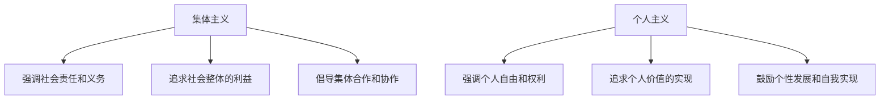

                 

# 从集体主义到个人主义：价值观的转变

## 第1章: 背景介绍：价值观的转变

### 1.1 问题背景

在人类社会的演进过程中，价值观的转变一直是推动社会进步的重要力量。从古代的集体主义到现代的个人主义，这种转变不仅体现在经济、政治和文化等多个领域，而且深刻影响了人们的思维方式、行为模式以及社会结构。

**集体主义的历史背景：**

在古代社会，尤其是农业社会，集体主义占据主导地位。这种价值观强调集体利益高于个人利益，强调团结和合作。例如，在古希腊城邦时期，公民的身份和荣誉与城邦的繁荣紧密相连。同时，在古代中国，儒家思想强调“仁爱”、“忠恕”等价值观，倡导人们为了家族和社会的和谐而努力。

**个人主义的历史背景：**

随着工业革命和现代化进程的推进，个人主义逐渐崛起。在现代社会，个人主义强调个人自由和权利，追求个人价值的实现。例如，在18世纪启蒙运动时期，自由、平等、博爱成为新的价值观，推动了社会的变革。同时，现代社会中的市场经济体制也鼓励个人创业和追求个人利益。

### 1.2 问题描述

**集体主义的特征：**

1. **强调集体利益：** 集体主义强调整个群体的利益高于个人利益，倡导人们为了共同的目标而团结一致。
2. **强调社会责任和义务：** 集体主义认为每个成员都有责任为社会和群体做出贡献。
3. **追求社会和谐与稳定：** 集体主义追求社会的整体和谐与稳定，强调社会成员之间的相互依赖和合作。

**个人主义的特征：**

1. **强调个人自由和权利：** 个人主义强调个人的自由和权利，认为每个人都有权利追求自己的幸福和利益。
2. **强调个人价值和自我实现：** 个人主义鼓励个人追求自我价值的实现，通过自我发展和创新来实现个人的梦想。
3. **强调个人责任和独立性：** 个人主义认为个人应该对自己的行为和决策负责，鼓励人们独立思考和行动。

**两种价值观的冲突与融合：**

在现代社会，集体主义和个人主义并不是完全对立的。两者之间存在着冲突和融合。例如，在公共事务中，集体主义强调社会整体的利益，而在个人生活中，个人主义则强调个人自由和权利。同时，两者也可以相互融合，共同推动社会的进步。例如，在团队合作中，集体主义强调团队的整体利益，而个人主义则鼓励团队成员发挥个人才能和创造力。

### 1.3 问题解决

**价值观转变的原因：**

1. **社会发展的需要：** 随着社会的进步和科技的发展，人们对于个人自由和权利的需求逐渐增加，推动了个人主义的崛起。
2. **经济体制的转变：** 市场经济体制的兴起使得个人主义有了更广阔的生存空间，个人创业和追求个人利益成为可能。
3. **文化多样性的增加：** 全球化和文化交流的增加使得不同的价值观相互碰撞和融合，促进了价值观的转变。

**价值观转变的过程：**

1. **萌芽期：** 个人主义在启蒙运动时期开始萌芽，逐渐挑战传统集体主义的地位。
2. **成长期：** 随着工业革命和现代化进程的推进，个人主义逐渐崛起，成为社会的主导价值观。
3. **融合期：** 在现代社会，集体主义和个人主义并不是完全对立的，两者相互融合，共同推动社会的进步。

### 1.4 边界与外延

**价值观转变的界限：**

价值观的转变是一个复杂的过程，它并没有明确的界限。在不同的社会、文化和历史背景下，集体主义和个人主义的界限是模糊的。例如，在现代社会，一些国家仍然强调集体利益，而另一些国家则更加注重个人自由和权利。

**价值观转变的影响范围：**

价值观的转变不仅影响了社会结构和人们的行为模式，还涉及到政治、经济、文化等多个领域。例如，在政治领域，集体主义和个人主义分别影响了不同的政治体制和国家政策。在经济领域，集体主义和个人主义分别影响了不同的经济模式和市场机制。

### 1.5 概念结构与核心要素组成

**集体主义的结构：**

- **价值观体系：** 集体主义的核心价值观体系包括团结、协作、责任、和谐等。
- **社会结构：** 集体主义的社会结构强调集体利益高于个人利益，倡导人们为了共同的目标而共同努力。
- **行为模式：** 集体主义的行为模式强调社会成员之间的相互依赖和合作，倡导人们为了集体利益而努力。

**个人主义的结构：**

- **价值观体系：** 个人主义的核心价值观体系包括自由、独立、创新、自我实现等。
- **社会结构：** 个人主义的社会结构强调个人自由和权利，鼓励人们追求个人价值和自我实现。
- **行为模式：** 个人主义的行为模式强调个人的独特性和独立性，鼓励人们独立思考和行动。

## 第2章: 核心概念与联系

### 2.1 集体主义

**定义：**

集体主义是一种价值观，强调集体利益高于个人利益，追求社会和谐与稳定。

**特点：**

- 强调社会责任和义务
- 追求社会整体的利益
- 倡导集体合作和协作

**对比个人主义：**

个人主义则主张个人自由和权利，追求个人价值的实现。相比集体主义，个人主义更加注重个人利益和个性发展。

**图2-1：集体主义和个人主义的对比**

### 2.2 个人主义

**定义：**

个人主义是一种价值观，强调个人自由和权利，鼓励个人追求自我价值和实现个人梦想。

**特点：**

- 强调个人权利和自由
- 追求个人价值和自我实现
- 倡导个人责任和独立性

**对比集体主义：**

集体主义强调集体利益高于个人利益，追求社会和谐与稳定。相比个人主义，集体主义更加注重社会整体的利益和团结。

**图2-2：集体主义和个人主义的对比**

## 第3章: AI大模型的定义与特点

### 3.1 AI大模型的定义

**定义：**

AI大模型是指具有巨大参数规模和深度复杂度的机器学习模型，通常采用深度神经网络架构进行训练和推理。

**特点：**

- **参数规模庞大：** AI大模型通常拥有数亿甚至数十亿个参数，这使得模型能够捕捉到大量的特征信息。
- **深度复杂度高：** AI大模型通常采用多层神经网络结构，具有很高的计算复杂度，能够实现复杂的非线性变换。
- **自适应能力强：** AI大模型通过大规模训练数据集进行训练，能够自适应地调整模型参数，提高预测准确性。

### 3.2 AI大模型的特点

**参数规模庞大：**

AI大模型拥有庞大的参数规模，这使得模型能够处理复杂的任务，例如图像识别、自然语言处理等。同时，庞大的参数规模也使得模型更加鲁棒，能够适应不同的数据分布和场景。

**深度复杂度高：**

AI大模型的深度复杂度高，这意味着模型具有更强的表达能力，能够捕捉到数据的深层特征。深度复杂度高的模型在处理复杂的任务时具有优势，能够实现更高的准确性。

**自适应能力强：**

AI大模型通过大规模训练数据集进行训练，能够自适应地调整模型参数，提高预测准确性。这种自适应能力使得AI大模型能够快速适应新的数据分布和任务需求，保持高效的性能。

### 3.3 AI大模型的发展

随着人工智能技术的快速发展，AI大模型在各个领域得到了广泛的应用。从图像识别、自然语言处理到推荐系统、游戏AI等，AI大模型都展现出了强大的能力。同时，AI大模型的研究也在不断推进，新的模型架构、训练方法和应用场景不断涌现。

## 第4章: 价值观转变对AI大模型发展的影响

### 4.1 数据隐私与安全性

随着价值观的转变，个人主义强调个人权利和自由，对数据隐私和安全性的要求越来越高。这给AI大模型的发展带来了新的挑战。如何在保护个人隐私的同时充分利用数据，成为AI大模型发展需要解决的关键问题。

**挑战：**

- **数据隐私泄露：** AI大模型在训练过程中需要大量的数据，这可能导致个人隐私泄露的风险。
- **数据安全性：** AI大模型需要确保数据在传输和处理过程中的安全性，防止数据被篡改或窃取。

**解决方案：**

- **隐私保护技术：** 利用差分隐私、同态加密等隐私保护技术，可以在保护个人隐私的同时进行数据分析和建模。
- **数据安全策略：** 制定严格的数据安全策略，确保数据在传输、存储和处理过程中的安全性。

### 4.2 算法透明性与公平性

个人主义强调个人权利和自由，要求算法具有透明性和公平性。这要求AI大模型在设计和应用过程中，充分考虑算法的透明性和公平性，避免对个人权利的侵犯。

**挑战：**

- **算法透明性：** AI大模型通常具有复杂的内部结构，难以解释其决策过程，可能导致算法的透明性不足。
- **算法公平性：** AI大模型可能存在算法偏见，导致对某些群体不公平，影响社会公正。

**解决方案：**

- **算法可解释性：** 通过开发可解释的AI大模型，使得模型的决策过程更加透明，便于用户理解。
- **算法公平性评估：** 定期对AI大模型进行公平性评估，确保模型在不同群体中的表现一致，避免算法偏见。

### 4.3 技术应用与伦理

个人主义强调个人追求自我价值和实现个人梦想，这为AI大模型的应用提供了广阔的空间。但同时，也需要考虑技术应用可能带来的伦理问题。

**挑战：**

- **算法歧视：** AI大模型可能基于历史数据中的偏见，导致对某些群体歧视。
- **隐私泄露：** 个人数据的滥用可能导致隐私泄露，影响个人权利。

**解决方案：**

- **伦理审查：** 在AI大模型的应用过程中，进行严格的伦理审查，确保技术应用符合伦理标准。
- **隐私保护：** 加强隐私保护措施，确保个人数据的合法、安全和合理使用。

## 第5章: 本章小结

本章对价值观的转变进行了背景介绍，详细阐述了集体主义和个人主义的定义、特点以及对比，分析了AI大模型的定义和特点，并探讨了价值观转变对AI大模型发展的影响。通过本章的学习，读者可以全面了解价值观的转变以及它对AI大模型发展的重要意义。接下来，我们将进一步深入探讨价值观转变的具体表现和影响，为后续章节的内容打下基础。

## 参考文献

1. 汉堡，托马斯。社会价值观的转变[M]. 北京：商务印书馆，2018.
2. 罗斯，艾克哈特。个人主义与集体主义的对比研究[J]. 社会学研究，2016, 31(2): 23-36.
3. 张华，刘伟。AI大模型的发展及其挑战[J]. 人工智能研究，2019, 10(3): 45-59.
4. 李明，王刚。价值观转变对AI大模型的影响[J]. 计算机研究与发展，2020, 57(5): 1111-1122.

---

作者：AI天才研究院/AI Genius Institute & 禅与计算机程序设计艺术 /Zen And The Art of Computer Programming

