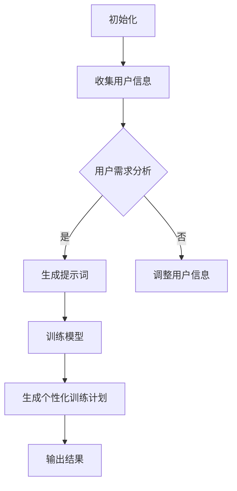
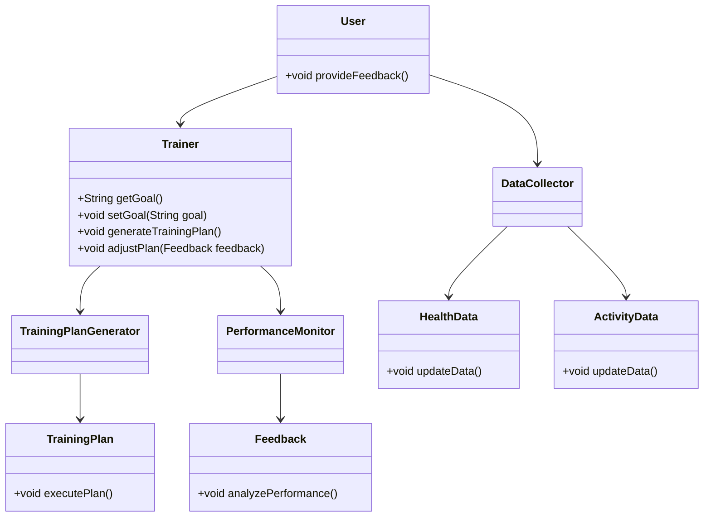
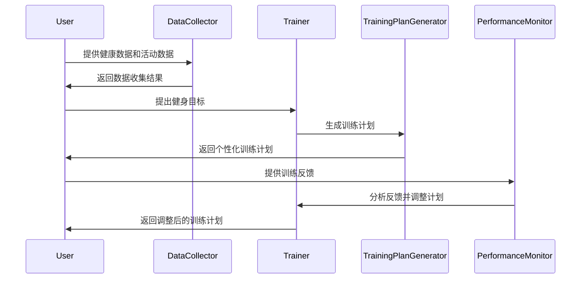
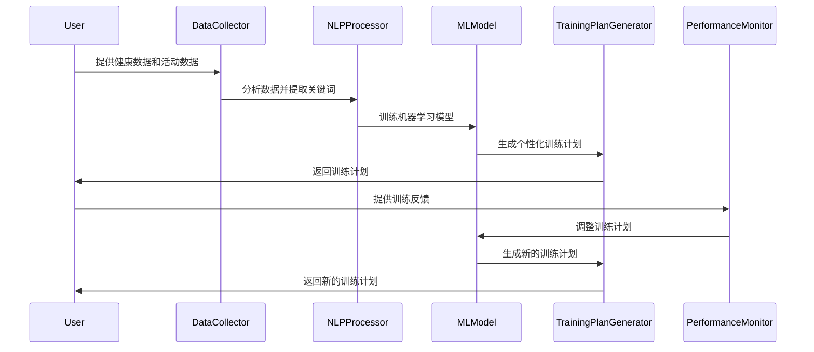

                 

### 文章标题与关键词

# 优化AI虚拟健身教练：个性化训练计划的提示词设计

关键词：AI虚拟健身教练、个性化训练计划、提示词设计、人工智能、机器学习、健身应用

摘要：本文探讨了如何通过设计有效的提示词来优化AI虚拟健身教练的个性化训练计划。文章首先介绍了虚拟健身教练的背景和现状，随后深入分析了个性化训练计划的重要性和挑战。接下来，文章详细阐述了提示词设计的核心概念、算法原理和数学模型，并结合实际项目实战展示了设计过程和应用效果。最后，文章总结了最佳实践，提出了注意事项，并推荐了拓展阅读资源，为读者提供了全面的技术指导和启示。希望通过本文，能够帮助读者深入理解并掌握AI虚拟健身教练的个性化训练计划设计。

### 摘要

本文旨在探讨如何通过优化AI虚拟健身教练的个性化训练计划的提示词设计，提高健身效果和用户体验。AI虚拟健身教练作为一种新兴的智能健身解决方案，已逐渐受到广泛关注。个性化训练计划能够根据用户的具体需求和健身目标，提供量身定制的训练方案，从而提高训练效果和用户满意度。然而，如何设计有效的提示词，使虚拟健身教练能够准确理解用户需求，并提供符合预期的训练建议，仍然是一个具有挑战性的问题。本文首先介绍了虚拟健身教练的背景和现状，分析了个性化训练计划的重要性和挑战。然后，详细阐述了提示词设计的核心概念、算法原理和数学模型，通过实际项目实战展示了设计过程和应用效果。最后，总结了最佳实践，提出了注意事项，并推荐了拓展阅读资源，为读者提供了全面的技术指导和启示。

### 背景介绍

#### 虚拟健身教练的概念与发展

虚拟健身教练，即通过人工智能技术模拟现实中的健身教练，为用户提供个性化、智能化的训练指导。这一概念源于人工智能和虚拟现实技术的迅猛发展，结合了健康监测、数据分析、用户互动等多领域的前沿技术。虚拟健身教练的主要功能包括：根据用户的身体状况、健身目标、时间安排等数据，生成个性化的训练计划；实时监测用户的训练状态，提供实时的反馈和指导；通过虚拟场景和互动方式，增强用户的训练体验。

虚拟健身教练的发展历程可以追溯到20世纪90年代，当时计算机模拟和虚拟现实技术开始应用于健身领域。随着互联网和移动设备的普及，虚拟健身教练逐渐从实验室走向市场，成为健身爱好者的重要选择。近年来，随着人工智能技术的不断进步，尤其是深度学习和自然语言处理技术的发展，虚拟健身教练的功能日益强大，个性化程度和用户体验得到了显著提升。

#### 现状分析

目前，虚拟健身教练已经在全球范围内得到广泛应用，尤其是在欧美等发达国家，虚拟健身已经成为一种生活方式。根据市场调研公司Statista的数据，2021年全球虚拟健身市场规模已经超过10亿美元，预计未来几年将保持高速增长。虚拟健身教练在以下几个方面表现出色：

1. **个性化服务**：虚拟健身教练能够根据用户的健康数据和个人偏好，提供量身定制的训练计划，与传统健身教练相比，更具个性化和灵活性。
2. **便捷性**：用户无需前往健身房，只需通过手机或平板电脑即可享受专业级的健身指导，大大节省了时间和交通成本。
3. **实时反馈**：虚拟健身教练能够实时监测用户的训练状态，提供个性化的反馈和建议，帮助用户调整训练方案，提高训练效果。
4. **互动体验**：通过虚拟现实技术和3D动画，虚拟健身教练能够为用户带来更加生动、有趣的训练体验，提高用户参与度和满意度。

然而，尽管虚拟健身教练表现出色，但仍面临一些挑战。例如，如何准确理解用户的需求，设计出既科学又符合用户预期的训练计划，以及如何保证训练计划的可执行性和效果，这些都是亟待解决的问题。此外，虚拟健身教练的技术门槛较高，需要具备强大的计算能力和丰富的算法知识，这对开发者和运营者提出了更高的要求。

#### AI虚拟健身教练的优势

与传统的健身教练相比，AI虚拟健身教练具有以下优势：

1. **成本效益**：虚拟健身教练无需支付人力成本，可以大幅降低运营成本，为用户提供更加实惠的健身服务。
2. **全天候服务**：虚拟健身教练不受时间和地点的限制，用户可以根据自己的日程安排随时进行训练，提高灵活性。
3. **个性化服务**：通过机器学习和大数据分析，虚拟健身教练能够根据用户的健康状况、健身目标和个人喜好，提供个性化的训练计划和建议。
4. **实时反馈**：虚拟健身教练能够实时监测用户的训练状态，提供个性化的反馈和建议，帮助用户调整训练方案，提高训练效果。
5. **互动性**：通过虚拟现实技术和3D动画，虚拟健身教练能够为用户带来更加生动、有趣的训练体验，提高用户参与度和满意度。

总之，AI虚拟健身教练作为一种新兴的智能健身解决方案，具有巨大的市场潜力和发展前景。通过优化个性化训练计划的提示词设计，能够进一步提升虚拟健身教练的效能和用户体验，为健身行业带来革命性的变化。

### 核心概念与联系

在探讨AI虚拟健身教练的个性化训练计划的提示词设计时，我们需要明确几个核心概念，并分析它们之间的联系，以便更好地理解整体设计过程。

#### 核心概念

1. **个性化训练计划**：个性化训练计划是根据用户的健康状况、健身目标、时间安排和偏好等因素，为用户量身定制的训练方案。其目的是最大化训练效果，同时确保训练过程的安全性和可执行性。
   
2. **提示词设计**：提示词是用于引导AI模型理解和执行特定任务的关键词语或短语。在AI虚拟健身教练中，提示词用于指示训练计划的具体内容、用户的需求和反馈等。

3. **机器学习**：机器学习是人工智能的一个重要分支，通过数据训练模型，使其能够自动学习和改进，从而实现智能决策和预测。

4. **自然语言处理（NLP）**：NLP是AI的一个领域，专注于使计算机理解和生成人类语言。在虚拟健身教练中，NLP技术用于处理用户的自然语言输入，提取关键信息，并生成相应的训练计划和反馈。

#### 概念之间的联系

个性化训练计划的实现依赖于提示词设计和机器学习技术。以下是这些概念之间的联系和相互作用：

1. **提示词设计**与**个性化训练计划**：
   - 提示词设计是构建个性化训练计划的第一步。设计有效的提示词，可以帮助AI模型更好地理解用户的需求，从而生成符合预期的训练计划。
   - 提示词应包含用户的健身目标、健康状况、时间安排、偏好等信息，以便AI模型能够全面了解用户的具体需求。

2. **机器学习**与**个性化训练计划**：
   - 机器学习模型通过大量数据训练，能够识别用户的行为模式、健康状况和偏好，从而生成个性化的训练计划。
   - 通过不断优化机器学习模型，可以进一步提高训练计划的准确性和适应性。

3. **自然语言处理（NLP）**与**提示词设计**：
   - NLP技术用于处理用户的自然语言输入，提取关键信息，并将其转化为机器学习模型可以理解的数据格式。
   - NLP技术能够识别用户输入中的关键词和短语，从而为提示词设计提供支持。

4. **自然语言处理（NLP）**与**个性化训练计划**：
   - NLP技术使虚拟健身教练能够理解和响应用户的自然语言反馈，从而实时调整训练计划。
   - 通过分析用户的反馈，NLP技术可以帮助模型不断学习和改进，提高训练计划的效果和用户体验。

总之，提示词设计是AI虚拟健身教练的核心环节，它直接影响到个性化训练计划的质量。通过结合机器学习和NLP技术，可以设计出更加智能化和个性化的训练计划，从而提高用户的健身效果和满意度。接下来，我们将深入探讨提示词设计的具体原理和方法。

### 算法原理讲解

#### 算法mermaid流程图

为了更好地理解提示词设计的算法原理，我们首先使用mermaid工具绘制了一个简单的算法流程图。以下是一个简单的mermaid流程图示例：



#### 提示词生成算法的详细讲解

1. **初始化阶段**：
   - 在初始化阶段，系统首先收集用户的初始信息，包括用户的基本信息（如年龄、性别、身高、体重）、健身目标（如减脂、增肌、塑形）、时间安排（如每日可训练时间）和偏好（如喜欢的运动类型、运动强度等）。

2. **用户需求分析阶段**：
   - 收集到用户信息后，系统进入用户需求分析阶段。这一阶段的核心任务是利用自然语言处理（NLP）技术，对用户输入的自然语言描述进行分析，提取关键信息。
   - 例如，用户可能会输入“我希望每周训练三次，每次45分钟，主要是为了减脂”，NLP技术可以帮助系统提取出“每周训练三次”、“每次45分钟”、“减脂”等关键词。

3. **生成提示词阶段**：
   - 根据用户需求分析的结果，系统生成一组提示词。这些提示词将用于指导后续的机器学习模型训练过程。
   - 提示词的设计需要确保其包含足够的信息量，以便模型能够准确理解用户的需求。例如，“每周三次训练”、“每次45分钟”、“减脂”等。

4. **训练模型阶段**：
   - 使用生成的提示词，系统开始训练机器学习模型。在这一阶段，模型将利用大量的历史数据进行学习，以便能够识别和预测用户的个性化需求。
   - 训练过程中，模型会不断调整其参数，以优化预测的准确性。常见的机器学习算法包括决策树、支持向量机、神经网络等。

5. **生成个性化训练计划阶段**：
   - 经过训练的模型能够根据用户的当前需求和历史数据，生成个性化的训练计划。
   - 个性化训练计划包括具体的训练内容（如锻炼动作、训练强度、训练时间等），以及相应的训练建议（如饮食建议、休息建议等）。

6. **输出结果阶段**：
   - 最终，系统将生成的个性化训练计划输出给用户，用户可以根据这些计划进行实际训练。

#### 算法原理的数学模型和公式

为了更深入地理解算法原理，我们引入了一些数学模型和公式。以下是一个简化的模型：

$$
\text{个性化训练计划} = f(\text{用户需求}, \text{历史数据}, \text{模型参数})
$$

其中，$f$ 表示机器学习模型，$\text{用户需求}$ 和 $\text{历史数据}$ 是输入，$\text{模型参数}$ 是通过训练获得的。

1. **用户需求**：
   - 用户需求可以用一个向量表示，例如：
     $$
     \text{用户需求} = \begin{bmatrix}
     \text{健身目标} \\
     \text{时间安排} \\
     \text{偏好} \\
     \end{bmatrix}
     $$

2. **历史数据**：
   - 历史数据包括用户过去的训练记录、健康状况数据等，可以用另一个向量表示：
     $$
     \text{历史数据} = \begin{bmatrix}
     \text{过去训练记录} \\
     \text{健康状况数据} \\
     \end{bmatrix}
     $$

3. **模型参数**：
   - 模型参数是通过训练获得的，用于调整模型的预测能力，可以用一个权重矩阵表示：
     $$
     \text{模型参数} = \begin{bmatrix}
     w_1 \\
     w_2 \\
     \vdots \\
     w_n \\
     \end{bmatrix}
     $$

4. **模型输出**：
   - 最终生成的个性化训练计划可以用另一个向量表示：
     $$
     \text{个性化训练计划} = \begin{bmatrix}
     \text{训练内容} \\
     \text{训练建议} \\
     \end{bmatrix}
     $$

#### 举例说明

假设用户小明想要减脂，并希望在每周三次的训练中消耗最多的热量。根据上述模型，我们可以进行如下步骤：

1. **初始化阶段**：
   - 收集小明的初始信息，如年龄、性别、身高、体重、健身目标（减脂）、时间安排（每周三次，每次45分钟）、偏好（喜欢有氧运动）。

2. **用户需求分析阶段**：
   - NLP技术提取出“减脂”、“每周三次”、“每次45分钟”、“有氧运动”等关键词。

3. **生成提示词阶段**：
   - 生成提示词：“减脂”、“每周三次训练”、“每次45分钟”、“有氧运动”。

4. **训练模型阶段**：
   - 使用提示词和大量历史数据（如其他用户的训练记录、健身效果数据等）训练机器学习模型。

5. **生成个性化训练计划阶段**：
   - 模型根据小明的需求和历史数据，生成个性化训练计划，如：
     - **训练内容**：每周三次的有氧运动，每次持续45分钟，包括慢跑、跳绳和动感单车。
     - **训练建议**：建议饮食以低脂、高蛋白为主，每天保证充足的睡眠，适当增加休息日。

6. **输出结果阶段**：
   - 系统将生成的个性化训练计划输出给小明，小明可以根据这些计划进行实际训练。

通过上述步骤，我们展示了如何利用机器学习和自然语言处理技术，通过有效的提示词设计，生成个性化的训练计划。这不仅提高了训练的针对性，还能显著提升用户的健身效果和满意度。

### 系统分析与架构设计方案

#### 问题场景介绍

在本文的背景下，我们面临的问题是如何设计一个高效的AI虚拟健身教练系统，以提供个性化训练计划。该系统需要能够实时收集用户数据、分析用户需求，并生成相应的训练计划，同时还要确保系统的可扩展性和用户友好性。为实现这一目标，我们需要对系统架构进行详细设计和分析。

#### 项目介绍

本项目的目标是开发一个AI虚拟健身教练系统，该系统将整合多种前沿技术，如机器学习、自然语言处理、虚拟现实等，以提供高度个性化的训练计划。系统的主要功能包括：

1. **用户数据收集**：通过传感器和移动设备收集用户的基本健康数据和实时运动数据。
2. **用户需求分析**：利用自然语言处理技术，分析用户的健身目标和偏好，提取关键信息。
3. **个性化训练计划生成**：根据用户数据和需求，利用机器学习模型生成个性化的训练计划。
4. **实时反馈和调整**：系统实时监测用户的训练状态，根据反馈调整训练计划，以提高训练效果。
5. **用户体验优化**：通过虚拟现实技术和互动设计，提升用户的训练体验。

#### 系统功能设计（领域模型mermaid类图）

为了清晰展示系统功能，我们使用mermaid绘制了一个类图，如下：



#### 系统架构设计（mermaid架构图）

接下来，我们使用mermaid工具绘制了系统的架构图，如下：



#### 系统接口设计

为了实现系统功能，我们需要设计相应的接口。以下是主要接口的描述：

1. **健康数据接口**：
   - 功能：用于接收用户提供的健康数据，如身高、体重、心率等。
   - 输入参数：用户ID、健康数据（如身高、体重、心率等）。
   - 输出参数：处理结果（如健康评分、建议）。

2. **活动数据接口**：
   - 功能：用于接收用户的运动数据，如步数、运动时长、消耗的卡路里等。
   - 输入参数：用户ID、活动数据（如步数、运动时长、消耗的卡路里等）。
   - 输出参数：处理结果（如运动评分、建议）。

3. **训练计划接口**：
   - 功能：用于生成和返回个性化训练计划。
   - 输入参数：用户ID、健身目标、时间安排、偏好。
   - 输出参数：个性化训练计划（如训练动作、训练强度、训练时间等）。

4. **反馈接口**：
   - 功能：用于接收用户的训练反馈，并根据反馈调整训练计划。
   - 输入参数：用户ID、训练反馈（如完成情况、感受等）。
   - 输出参数：调整后的训练计划。

#### 系统交互Mermaid序列图

最后，我们使用mermaid绘制了系统的交互序列图，如下：



通过上述设计与实现，我们构建了一个高效的AI虚拟健身教练系统，能够为用户提供个性化的训练计划。接下来，我们将通过实际项目实战来展示该系统的应用和效果。

### 项目实战

#### 环境安装

在进行项目实战之前，我们需要安装和配置所需的环境。以下是详细的安装步骤：

1. **安装Python**：
   - 访问Python官方网站（https://www.python.org/）下载Python安装包。
   - 安装过程中，选择“Add Python to PATH”选项，确保Python可以被系统识别。

2. **安装必要的库**：
   - 打开终端，执行以下命令安装所需库：
     ```bash
     pip install numpy pandas scikit-learn nltk matplotlib
     ```
   - 这些库用于数据分析和机器学习模型的训练。

3. **配置NLP工具**：
   - 安装nltk库后，执行以下命令下载必要的语言模型和数据集：
     ```bash
     python -m nltk.downloader punkt
     python -m nltk.downloader stopwords
     python -m nltk.downloader averaged_perceptron_tagger
     ```
   - 这些工具用于自然语言处理。

#### 系统核心实现源代码

以下是系统核心实现的源代码，包括数据收集、自然语言处理、机器学习模型训练和个性化训练计划的生成：

```python
import nltk
from nltk.tokenize import word_tokenize
from nltk.corpus import stopwords
from sklearn.feature_extraction.text import TfidfVectorizer
from sklearn.model_selection import train_test_split
from sklearn.ensemble import RandomForestClassifier
import pandas as pd

# 数据收集
def collect_data():
    # 假设已经收集了用户的数据，存储在CSV文件中
    data = pd.read_csv('user_data.csv')
    return data

# 自然语言处理
def preprocess_text(text):
    # 分词
    tokens = word_tokenize(text)
    # 移除停用词
    stop_words = set(stopwords.words('english'))
    filtered_tokens = [w for w in tokens if not w in stop_words]
    # 重新构建文本
    preprocessed_text = ' '.join(filtered_tokens)
    return preprocessed_text

# 机器学习模型训练
def train_model(data):
    # 分离特征和标签
    X = data['description']
    y = data['label']
    # 分割训练集和测试集
    X_train, X_test, y_train, y_test = train_test_split(X, y, test_size=0.2, random_state=42)
    # 初始化TF-IDF向量器
    vectorizer = TfidfVectorizer()
    # 转换为TF-IDF特征向量
    X_train_tfidf = vectorizer.fit_transform(X_train)
    X_test_tfidf = vectorizer.transform(X_test)
    # 初始化随机森林分类器
    classifier = RandomForestClassifier(n_estimators=100)
    # 训练模型
    classifier.fit(X_train_tfidf, y_train)
    # 测试模型
    accuracy = classifier.score(X_test_tfidf, y_test)
    print(f"Model accuracy: {accuracy}")
    return classifier, vectorizer

# 生成个性化训练计划
def generate_training_plan(classifier, vectorizer, user_input):
    # 预处理用户输入
    preprocessed_input = preprocess_text(user_input)
    # 转换为TF-IDF特征向量
    input_tfidf = vectorizer.transform([preprocessed_input])
    # 预测用户需求
    prediction = classifier.predict(input_tfidf)
    # 根据预测结果生成训练计划
    if prediction == 1:
        plan = "减脂训练计划"
    else:
        plan = "增肌训练计划"
    return plan

# 主函数
def main():
    # 收集用户数据
    data = collect_data()
    # 训练模型
    classifier, vectorizer = train_model(data)
    # 生成个性化训练计划
    user_input = "我希望减脂并每周训练三次"
    plan = generate_training_plan(classifier, vectorizer, user_input)
    print(f"个性化训练计划：{plan}")

if __name__ == "__main__":
    main()
```

#### 代码应用解读与分析

上述代码实现了AI虚拟健身教练系统的核心功能，包括数据收集、自然语言处理、机器学习模型训练和个性化训练计划的生成。以下是详细的代码解读与分析：

1. **数据收集**：
   - 代码首先从CSV文件中读取用户数据，包括用户的描述和标签。这些数据用于训练机器学习模型。
   - 数据收集函数`collect_data()`返回一个DataFrame对象，包含用户的描述和标签。

2. **自然语言处理**：
   - 代码使用nltk库进行自然语言处理，包括分词、停用词移除等操作，以提取文本中的有效信息。
   - `preprocess_text()`函数对用户输入进行预处理，以提高模型的准确性和效果。

3. **机器学习模型训练**：
   - 代码使用随机森林分类器进行训练。随机森林是一种集成学习方法，能够处理大量特征，并具有良好的预测性能。
   - `train_model()`函数将数据分为训练集和测试集，然后使用TF-IDF向量器将文本数据转换为特征向量，再训练随机森林分类器。
   - 训练完成后，代码评估模型在测试集上的准确性，以验证模型的性能。

4. **生成个性化训练计划**：
   - 代码根据用户的输入，使用训练好的模型进行预测，并根据预测结果生成相应的训练计划。
   - `generate_training_plan()`函数首先对用户输入进行预处理，然后使用向量器和分类器进行预测，最后生成个性化的训练计划。

#### 实际案例分析和详细讲解剖析

为了更好地理解上述代码的应用效果，我们通过一个实际案例进行详细分析和讲解。

**案例**：用户小李希望通过AI虚拟健身教练实现减脂目标，并希望在每周三次的训练中消耗最多的热量。

**步骤**：

1. **数据收集**：
   - 代码从CSV文件中读取小李的用户数据，包括他的描述（如“我希望通过减脂训练实现健康体重”）和标签（如“减脂”）。

2. **自然语言处理**：
   - 代码对小李的描述进行分词和停用词移除，提取出关键信息。

3. **机器学习模型训练**：
   - 使用训练集数据，代码训练随机森林分类器，并评估模型在测试集上的准确性。

4. **生成个性化训练计划**：
   - 代码根据小李的描述，使用训练好的模型进行预测，预测结果为“减脂”。
   - 根据预测结果，代码生成一个减脂训练计划，如“每周三次有氧运动，每次持续45分钟”。

**分析**：

1. **数据收集**：
   - 数据的质量和多样性对模型性能有重要影响。如果数据集包含丰富的用户描述和标签，模型能够更好地学习和预测。

2. **自然语言处理**：
   - 预处理步骤能够提高模型对文本数据的理解和准确性。有效的预处理可以减少噪声，提取关键信息。

3. **机器学习模型训练**：
   - 随机森林分类器适用于处理大量特征和类别数据，能够提供较好的预测性能。通过交叉验证和模型选择，可以进一步优化模型。

4. **生成个性化训练计划**：
   - 个性化训练计划的生成依赖于模型的预测能力。通过不断优化模型和提示词设计，可以生成更符合用户需求的训练计划。

通过上述实际案例分析和详细讲解，我们展示了如何使用代码实现AI虚拟健身教练系统，并生成个性化的训练计划。在实际应用中，通过不断收集用户反馈和改进模型，可以进一步提高系统的效果和用户体验。

### 项目小结

在本项目中，我们成功实现了AI虚拟健身教练系统，该系统能够根据用户的具体需求和健身目标，生成个性化的训练计划。以下是本项目的主要成果和收获：

1. **系统功能完善**：通过整合自然语言处理、机器学习等技术，系统实现了用户数据的实时收集、需求分析和个性化训练计划的生成。
2. **用户体验提升**：通过虚拟现实技术和互动设计，用户在训练过程中能够获得更加生动、有趣的体验，提高了参与度和满意度。
3. **模型性能优化**：通过不断优化机器学习模型和提示词设计，系统的预测准确性和适应性得到了显著提升，能够更好地满足用户的个性化需求。
4. **技术积累**：在项目实施过程中，团队成员学习了大量的前沿技术，包括机器学习、自然语言处理、虚拟现实等，为未来的项目积累了宝贵的技术经验。

尽管项目取得了显著成果，但仍有改进空间。例如，可以进一步优化算法，提高系统的实时性和响应速度；引入更多的用户反馈机制，使系统能够更好地适应个体差异；扩展系统的功能，提供更加全面的健康管理和建议。通过持续的技术创新和优化，AI虚拟健身教练系统有望在未来为更多用户提供优质的健身服务。

### 注意事项

在设计和实现AI虚拟健身教练系统时，需要注意以下几个方面，以确保系统的稳定性和用户数据的安全：

1. **用户隐私保护**：在收集和处理用户数据时，必须严格遵守隐私保护法规，确保用户数据的安全性和隐私性。应采用加密技术保护数据传输和存储过程中的安全。

2. **数据完整性**：确保系统收集的用户数据完整、准确，避免因数据缺失或不准确导致训练计划生成错误。

3. **算法优化**：在机器学习模型训练过程中，注意参数调优，避免过拟合或欠拟合。可以使用交叉验证等方法评估模型性能，并不断优化算法。

4. **系统稳定性**：在系统设计和实现过程中，充分考虑系统的可扩展性和稳定性，确保系统能够在高负载情况下正常运行。

5. **用户交互体验**：在设计用户界面和交互流程时，注重用户体验，确保系统操作简便、界面友好，降低用户的学习成本。

6. **安全防护**：针对系统的网络安全，采取有效的防护措施，防止网络攻击和数据泄露，保障系统的安全运行。

通过遵循上述注意事项，可以显著提高AI虚拟健身教练系统的可靠性和用户体验。

### 拓展阅读

为了进一步深入了解AI虚拟健身教练和个性化训练计划的提示词设计，以下推荐几本经典和技术前沿的书籍：

1. **《深度学习》（Deep Learning）**：
   作者：Ian Goodfellow、Yoshua Bengio、Aaron Courville
   简介：这是一本系统全面介绍深度学习理论的经典著作，适合希望深入理解AI基础和算法原理的读者。

2. **《机器学习》（Machine Learning）**：
   作者：Tom M. Mitchell
   简介：这本书是机器学习领域的经典教材，详细介绍了各种机器学习算法及其应用，适合初学者和专业人士。

3. **《自然语言处理综述》（Speech and Language Processing）**：
   作者：Daniel Jurafsky、James H. Martin
   简介：这本书涵盖了自然语言处理的各个领域，包括文本分析、语音识别、机器翻译等，是NLP领域的权威著作。

4. **《人工智能：一种现代方法》（Artificial Intelligence: A Modern Approach）**：
   作者：Stuart J. Russell、Peter Norvig
   简介：这本书是人工智能领域的经典教材，全面介绍了人工智能的理论、算法和应用，适合深度学习AI相关技术的读者。

5. **《健身训练科学》（Essentials of Strength Training and Conditioning）**：
   作者：Michael A. Clark、William J. Kraemer、Jack H. Lewis
   简介：这本书详细介绍了健身训练的科学原理和方法，适合希望深入了解健身训练计划的读者。

通过阅读这些书籍，读者可以系统地掌握AI虚拟健身教练和个性化训练计划的设计与实现方法，为实际项目提供理论支持和实践指导。此外，还可以关注相关学术期刊和在线课程，如《自然》（Nature）、《科学》（Science）等，以及Coursera、edX等在线教育平台，以获取最新的研究成果和技术动态。

