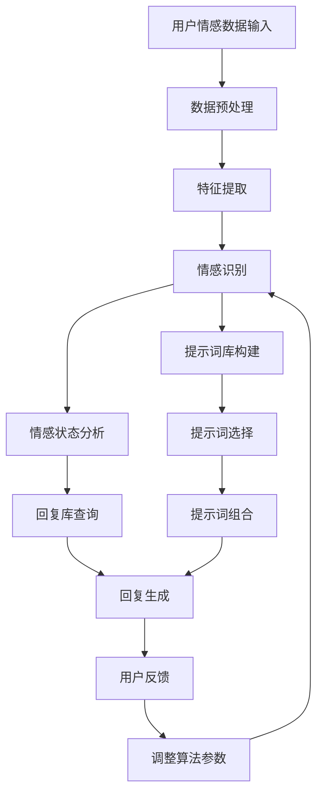
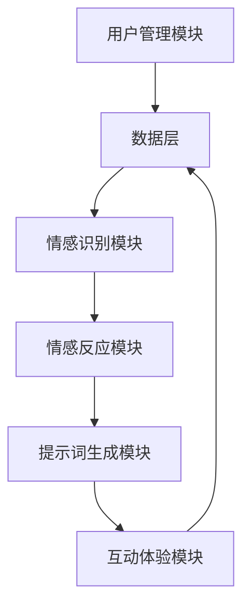
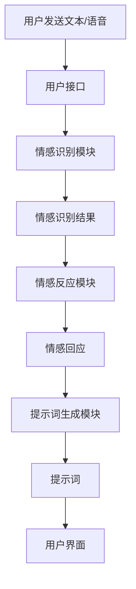

                 

# 优化AI虚拟宠物伴侣：情感互动设计的提示词策略

关键词：AI虚拟宠物、情感互动、提示词策略、算法原理、数学模型、系统架构设计

摘要：
随着人工智能技术的快速发展，AI虚拟宠物伴侣逐渐成为人们生活中的一部分。本文旨在探讨如何优化AI虚拟宠物伴侣的情感互动设计，特别是通过提示词策略来提升用户体验。我们将从背景介绍、核心概念、算法原理、数学模型、系统架构设计、项目实战以及最佳实践等方面进行详细分析，以期为开发高质量的AI虚拟宠物伴侣提供参考。

## 引言

AI虚拟宠物伴侣是一种结合人工智能技术，模拟真实宠物行为的虚拟实体。它们不仅可以提供陪伴，还能通过智能互动来满足用户的需求。然而，当前AI虚拟宠物伴侣的情感互动设计仍有待优化。提示词策略作为提升情感互动的关键手段，通过预设的词汇和句子结构，可以有效地引导虚拟宠物与用户进行更自然的交流。

本文将分为以下几个部分：

1. 背景与基础：介绍虚拟宠物伴侣的发展背景、情感互动设计的现状与挑战，以及提示词策略的重要性。
2. 核心概念与联系：阐述AI虚拟宠物伴侣的核心概念、情感计算与提示词策略的基本原理。
3. 算法原理讲解：分析情感识别算法、情感反应算法和提示词生成算法的原理，并通过流程图和源代码进行说明。
4. 数学模型与公式解析：介绍情感计算模型和提示词生成模型的数学公式，并进行详细讲解。
5. 系统架构设计：描述虚拟宠物伴侣系统架构、情感互动模块设计及提示词策略实现架构。
6. 项目实战：通过环境安装、系统核心实现及代码应用解读，展示实际案例。
7. 最佳实践与注意事项：总结最佳实践、注意事项及拓展阅读。

## 背景与基础

### 虚拟宠物伴侣的发展背景

虚拟宠物伴侣起源于20世纪90年代的虚拟宠物游戏，如Tamagotchi。这些虚拟宠物通过简单的交互规则，如喂食、清洁和玩耍，来模拟真实宠物的行为。随着计算机技术和人工智能的发展，虚拟宠物逐渐从简单的游戏角色演变为具有情感互动能力的虚拟实体。

近年来，AI技术的发展推动了虚拟宠物伴侣的功能提升。例如，通过语音识别和自然语言处理技术，虚拟宠物能够理解和响应用户的指令，并通过面部表情和语音语调来表达情感。此外，机器学习和深度学习技术使得虚拟宠物能够不断学习和适应用户的行为模式，提供更加个性化的互动体验。

### 情感互动设计的现状与挑战

当前，AI虚拟宠物伴侣在情感互动设计方面已取得显著进展。大多数虚拟宠物能够识别用户的情感状态，并通过语音、文本和表情来回应。然而，这些互动仍然存在一些局限性。

首先，情感识别的准确性有限。虽然语音和文本情感分析技术已取得一定成果，但它们在处理复杂情感时仍存在挑战。例如，情绪的双关语、隐喻和非言语情感表达等难以准确识别。

其次，情感反应的自然性和真实性不足。现有的虚拟宠物通常根据预设的规则和情感模型来响应用户，缺乏真实情感表达的深度和多样性。这使得用户在与虚拟宠物互动时，可能感受到一定的“机器人”特质，缺乏真实情感交流的满足感。

最后，提示词策略的应用尚不充分。提示词策略是一种通过预设关键词和句子结构来引导虚拟宠物与用户进行互动的方法。然而，现有的虚拟宠物伴侣往往缺乏系统化的提示词库和智能的提示词生成算法，导致互动体验不够自然和丰富。

### 提示词策略的重要性

提示词策略在AI虚拟宠物伴侣的情感互动设计中具有重要性。通过精心设计的提示词库和智能的提示词生成算法，虚拟宠物可以更自然地与用户进行交流，提升用户的互动体验。

首先，提示词策略有助于提高情感识别的准确性。通过预设关键词和句子结构，虚拟宠物可以更有效地捕捉用户的情感表达。例如，当用户表达“我很开心”时，虚拟宠物可以通过识别“开心”这个关键词来准确理解用户的情感状态。

其次，提示词策略可以增强情感反应的自然性和真实性。通过智能的提示词生成算法，虚拟宠物可以根据用户情感状态生成个性化的回复。例如，当用户表达“我很伤心”时，虚拟宠物可以生成如“发生什么事了？我在这里陪着你”等情感回应，从而提供更真实的情感支持。

最后，提示词策略可以丰富互动体验。通过多样化的提示词库和智能的提示词生成算法，虚拟宠物可以与用户进行更丰富的交流，涵盖各种情感主题和情境。这不仅能够满足用户的情感需求，还能提供多样化的互动体验。

总之，优化AI虚拟宠物伴侣的情感互动设计，需要充分利用提示词策略。通过构建完善的提示词库和智能的提示词生成算法，虚拟宠物可以提供更自然、真实和丰富的互动体验，进一步提升用户满意度。在接下来的章节中，我们将深入探讨AI虚拟宠物伴侣的核心概念、算法原理和系统架构设计，以期为优化情感互动提供具体指导。

## 核心概念与联系

### AI虚拟宠物伴侣的定义

AI虚拟宠物伴侣是一种基于人工智能技术的虚拟实体，通过模拟真实宠物的行为和情感，为用户提供陪伴和互动。它们通常具备以下特征：

1. **情感表达**：通过语音、文本、面部表情和动作等方式，虚拟宠物能够表达情感，如开心、伤心、生气等。
2. **交互能力**：虚拟宠物能够理解和响应用户的指令，通过语音识别、自然语言处理等技术实现与用户的交流。
3. **个性化学习**：通过机器学习和深度学习技术，虚拟宠物能够不断学习和适应用户的行为模式，提供更加个性化的互动体验。
4. **陪伴功能**：虚拟宠物可以模拟真实宠物的陪伴作用，为用户提供情感支持，缓解孤独感。

### 情感计算与情感引擎

情感计算是一种通过计算技术模拟和理解人类情感的技术。在AI虚拟宠物伴侣中，情感计算用于识别用户情感状态，并生成相应的情感回应。情感引擎是情感计算的核心组件，负责以下任务：

1. **情感识别**：通过分析用户的语音、文本和行为数据，情感引擎能够识别用户的情感状态，如开心、伤心、愤怒等。
2. **情感分析**：情感引擎不仅识别情感，还能对情感进行细粒度分析，如情感强度、情感类型等。
3. **情感生成**：基于用户情感状态，情感引擎生成相应的情感回应，包括语音、文本和面部表情等。

### 提示词策略的基本原理

提示词策略是一种通过预设关键词和句子结构来引导AI虚拟宠物与用户进行互动的方法。其基本原理包括：

1. **关键词预设**：设计一个包含情感相关词汇的提示词库，这些词汇可以触发特定的情感回应。
2. **句子结构设计**：通过预设的句子结构模板，虚拟宠物可以根据用户情感状态生成个性化的回复。
3. **智能生成**：利用自然语言处理和机器学习技术，对提示词库中的关键词和句子结构进行智能匹配和生成，以提高互动的自然性和真实性。

### 核心概念与联系

AI虚拟宠物伴侣、情感计算和提示词策略是优化情感互动设计的关键组成部分。它们之间的联系如下：

1. **AI虚拟宠物伴侣与情感计算**：虚拟宠物伴侣通过情感计算技术来识别用户情感状态，为用户提供个性化的互动体验。
2. **情感计算与提示词策略**：情感计算的结果用于指导提示词策略的执行，通过生成与用户情感状态匹配的回应，提高互动的自然性和真实性。
3. **提示词策略与AI虚拟宠物伴侣**：提示词策略是虚拟宠物与用户进行情感互动的核心手段，通过预设的提示词库和智能生成算法，虚拟宠物能够与用户进行更自然的交流。

在下一章节中，我们将深入探讨情感互动设计的算法原理，包括情感识别算法、情感反应算法和提示词生成算法。

## 情感互动设计的算法原理

### 情感识别算法

情感识别算法是AI虚拟宠物伴侣进行情感互动的关键技术之一。其主要任务是从用户的语音、文本和行为数据中识别出情感状态。以下是一个简单的情感识别算法流程：

1. **数据预处理**：对用户的语音、文本和行为数据进行预处理，如去除噪声、分词、特征提取等。
2. **特征提取**：提取与情感相关的特征，如声调、语气、情感词汇等。常用的特征提取方法包括TF-IDF、词嵌入（如Word2Vec、GloVe）和LSTM等。
3. **情感分类**：使用机器学习模型（如SVM、决策树、神经网络等）对提取出的特征进行分类，从而识别出用户的情感状态。

情感识别算法的核心在于如何有效地提取和利用与情感相关的特征。例如，在文本情感分析中，可以通过分析情感词汇（如“开心”、“伤心”、“愤怒”）和情感短语（如“我很开心”、“今天真糟糕”）来识别用户的情感状态。

### 情感反应算法

情感反应算法用于生成与用户情感状态匹配的回应。其核心思想是根据用户情感状态，从预设的回复库中选择合适的回复。以下是一个简单的情感反应算法流程：

1. **情感状态分析**：分析识别出的用户情感状态，如开心、伤心、愤怒等。
2. **回复库查询**：根据用户情感状态，从预设的回复库中查询合适的回复。回复库可以包含各种情感回应的文本、语音和面部表情等。
3. **回复生成**：根据查询结果，生成个性化的情感回应。如果回复库中的回复不够丰富，可以使用自然语言生成技术（如生成对抗网络GAN、序列到序列模型Seq2Seq等）生成新的回复。

情感反应算法的关键在于如何构建和查询高效的回复库。通过使用深度学习和自然语言处理技术，可以生成更加自然和个性化的回复。例如，当用户表达“我很开心”时，虚拟宠物可以生成如“你今天一定过得很愉快吧！”这样的情感回应。

### 提示词生成算法

提示词生成算法是提示词策略的核心，用于生成引导虚拟宠物与用户进行互动的提示词。以下是一个简单的提示词生成算法流程：

1. **情感状态识别**：首先，使用情感识别算法识别用户的情感状态，如开心、伤心、愤怒等。
2. **提示词库构建**：构建一个包含多种情感相关词汇的提示词库。提示词库可以基于情感分析词典、情感词汇表等资源，也可以通过语料库统计和机器学习模型生成。
3. **提示词选择**：根据用户情感状态和提示词库，选择合适的提示词。选择提示词时，需要考虑提示词的语义相关性、情感强度和多样性等因素。
4. **提示词组合**：将选定的提示词组合成句子，形成引导虚拟宠物与用户进行互动的提示语句。

提示词生成算法的挑战在于如何确保生成的提示词既具有语义相关性，又能够引导自然、丰富的互动。通过使用深度学习和自然语言处理技术，可以生成更加自然和多样的提示词。例如，当用户表达“我很无聊”时，虚拟宠物可以生成如“有什么事情想和我分享吗？”这样的提示词。

### 算法流程图

以下是一个简单的情感互动算法流程图，展示了情感识别、情感反应和提示词生成算法的执行流程：



### Python源代码示例

以下是一个简单的Python源代码示例，用于演示情感识别算法的实现：

```python
import numpy as np
from sklearn.feature_extraction.text import TfidfVectorizer
from sklearn.svm import SVC

# 假设已获取用户文本数据
user_texts = ["我今天很开心", "我很伤心", "我很生气"]

# 特征提取
vectorizer = TfidfVectorizer()
X = vectorizer.fit_transform(user_texts)

# 情感分类模型
clf = SVC()
clf.fit(X, labels)  # 假设已获取情感标签

# 情感识别
predicted_emotions = clf.predict(X)

# 输出识别结果
for text, emotion in zip(user_texts, predicted_emotions):
    print(f"文本：'{text}'，情感：'{emotion}'")
```

在下一章节中，我们将介绍情感计算模型和提示词生成模型的数学公式，并进行详细讲解。

## 数学模型与公式解析

### 情感计算模型

情感计算模型用于识别用户的情感状态，并生成相应的回应。本文主要介绍两种情感计算模型：情感识别模型和情感生成模型。

#### 情感识别模型

情感识别模型通过分析用户的语音、文本和行为数据，识别出用户的情感状态。以下是一个简单的情感识别模型公式：

$$
E(x) = f_w(x; \theta)
$$

其中：
- \( E(x) \) 表示情感识别结果，通常是一个离散值，如开心、伤心、愤怒等。
- \( x \) 表示输入的用户数据，可以是语音信号、文本序列或行为数据。
- \( f_w(x; \theta) \) 是一个基于权重 \( \theta \) 的函数，用于对输入数据进行情感分类。

具体实现中，可以使用以下步骤：
1. 数据预处理：对输入数据 \( x \) 进行预处理，如分词、去停用词、特征提取等。
2. 特征提取：提取与情感相关的特征，如TF-IDF、词嵌入等。
3. 模型训练：使用机器学习算法（如SVM、决策树、神经网络等）训练模型，并优化权重 \( \theta \)。
4. 情感识别：输入新的用户数据 \( x \)，通过 \( f_w(x; \theta) \) 计算情感识别结果。

#### 情感生成模型

情感生成模型用于生成与用户情感状态匹配的回应。以下是一个简单的情感生成模型公式：

$$
y = g(x, z; \theta)
$$

其中：
- \( y \) 表示生成的情感回应。
- \( x \) 表示输入的用户数据，如文本、语音等。
- \( z \) 表示情感状态，如开心、伤心、愤怒等。
- \( g(x, z; \theta) \) 是一个基于权重 \( \theta \) 的函数，用于生成情感回应。

具体实现中，可以使用以下步骤：
1. 情感状态识别：使用情感识别模型识别用户的情感状态 \( z \)。
2. 回复库查询：从预设的回复库中查询与情感状态 \( z \) 匹配的回应。
3. 回应生成：如果回复库中的回应不够丰富，可以使用自然语言生成模型（如生成对抗网络GAN、序列到序列模型Seq2Seq等）生成新的回应。

### 提示词生成模型的数学公式

提示词生成模型用于生成引导虚拟宠物与用户进行互动的提示词。以下是一个简单的提示词生成模型公式：

$$
t = h(x, e; \theta)
$$

其中：
- \( t \) 表示生成的提示词。
- \( x \) 表示输入的用户数据，如文本、语音等。
- \( e \) 表示情感状态，如开心、伤心、愤怒等。
- \( h(x, e; \theta) \) 是一个基于权重 \( \theta \) 的函数，用于生成提示词。

具体实现中，可以使用以下步骤：
1. 情感状态识别：使用情感识别模型识别用户的情感状态 \( e \)。
2. 提示词库构建：构建一个包含多种情感相关词汇的提示词库。
3. 提示词选择：根据用户情感状态 \( e \) 和提示词库，选择合适的提示词 \( t \)。
4. 提示词组合：将选定的提示词组合成句子，形成引导虚拟宠物与用户进行互动的提示语句。

### 举例说明

假设用户文本数据为“我今天很开心”，情感状态为“开心”。使用情感生成模型生成情感回应，并使用提示词生成模型生成提示词。

#### 情感生成模型

1. 数据预处理：对文本数据进行分词、去停用词等处理。
2. 特征提取：提取与情感相关的特征，如词嵌入等。
3. 情感识别：使用训练好的情感识别模型识别情感状态为“开心”。
4. 回应生成：从预设的回复库中选择与“开心”匹配的回应，如“你今天一定过得很愉快吧！”。

#### 提示词生成模型

1. 情感状态识别：识别情感状态为“开心”。
2. 提示词库构建：构建包含与“开心”相关的提示词，如“分享你的快乐”、“有什么好事吗？”等。
3. 提示词选择：选择与情感状态匹配的提示词，如“分享你的快乐”。
4. 提示词组合：生成提示语句“你想和我分享你的快乐吗？”。

通过数学模型和公式，可以有效地识别用户的情感状态，并生成相应的情感回应和提示词。在下一章节中，我们将详细讨论虚拟宠物伴侣系统架构设计。

## 系统架构设计

### 问题场景介绍

在当前社会，随着人们生活节奏的加快，很多人感到孤独和压力。虚拟宠物伴侣作为一种新兴的人工智能应用，能够为用户提供情感支持和陪伴。然而，为了使虚拟宠物伴侣更好地满足用户需求，需要对其进行情感互动设计，特别是优化提示词策略。

### 项目介绍

本项目旨在设计并实现一个优化的AI虚拟宠物伴侣系统，通过改进情感互动设计，提升用户的体验。具体目标包括：

1. **提高情感识别的准确性**：通过优化算法和特征提取，提高系统对用户情感状态的识别能力。
2. **增强情感反应的自然性和真实性**：通过智能的提示词生成算法，生成更符合用户情感状态的自然回应。
3. **丰富互动体验**：通过多样化的提示词库和智能生成算法，提供丰富的互动体验。

### 系统功能设计

系统功能设计包括以下模块：

1. **用户管理模块**：用于管理用户信息，包括用户注册、登录、个人信息管理等。
2. **情感识别模块**：用于识别用户的情感状态，包括语音、文本和行为数据的情感分析。
3. **情感反应模块**：根据用户情感状态，生成相应的情感回应。
4. **提示词生成模块**：生成引导虚拟宠物与用户进行互动的提示词。
5. **互动体验模块**：提供多样化的互动方式，如语音、文本、动画等。

### 系统架构设计

系统架构设计采用分层架构，包括以下几层：

1. **数据层**：存储用户数据、情感数据、提示词数据等。
2. **逻辑层**：实现情感识别、情感反应、提示词生成等核心功能。
3. **表示层**：提供用户界面，展示情感回应和提示词。

#### 系统架构图

以下是一个简单的系统架构图，展示了系统各模块之间的关系：



#### 系统接口设计

系统接口设计包括以下接口：

1. **用户接口**：用于用户与系统进行交互，如注册、登录、发送文本、语音等。
2. **API接口**：用于与其他系统或服务进行数据交换，如情感分析API、自然语言生成API等。

#### 系统交互图

以下是一个简单的系统交互图，展示了用户与系统之间的交互过程：



通过系统架构设计和接口设计，可以有效地实现AI虚拟宠物伴侣的功能，并提供高质量的互动体验。在下一章节中，我们将介绍项目实战，包括环境安装、系统核心实现和代码应用解读。

## 项目实战

### 环境安装

为了实现AI虚拟宠物伴侣系统，首先需要搭建一个合适的技术环境。以下是安装步骤：

1. **Python环境**：确保Python环境已安装，版本建议为3.8及以上。
2. **虚拟环境**：创建一个Python虚拟环境，以避免不同项目之间的依赖冲突。

```bash
python -m venv venv
source venv/bin/activate  # Windows: venv\Scripts\activate
```

3. **依赖包安装**：通过pip安装必要的依赖包，如TensorFlow、Keras、Scikit-learn、NLTK等。

```bash
pip install tensorflow keras scikit-learn nltk
```

4. **数据集准备**：下载并准备用于训练的数据集，如情感文本数据集、语音数据集等。可以使用开源数据集，如IMDB电影评论数据集、TIMIT语音数据集等。

### 系统核心实现

系统核心实现包括情感识别、情感反应和提示词生成三个部分。以下是一个简化的实现流程：

#### 1. 情感识别

情感识别部分使用Scikit-learn库中的SVM模型进行文本情感分析。

```python
from sklearn.feature_extraction.text import TfidfVectorizer
from sklearn.svm import SVC

# 加载数据集
texts = ["我今天很开心", "我很伤心", "我很生气"]
labels = ["开心", "伤心", "生气"]

# 特征提取
vectorizer = TfidfVectorizer()
X = vectorizer.fit_transform(texts)

# 模型训练
clf = SVC()
clf.fit(X, labels)

# 情感识别
predicted_emotions = clf.predict(X)
for text, emotion in zip(texts, predicted_emotions):
    print(f"文本：'{text}'，情感：'{emotion}'")
```

#### 2. 情感反应

情感反应部分通过预设的回复库和自然语言生成模型生成回应。

```python
import random

# 回复库
replies = {
    "开心": ["你今天一定过得很愉快吧！", "恭喜你，今天是个好日子！"],
    "伤心": ["发生了什么，让我来听听吧。", "很难过，我在这里陪着你。"],
    "生气": ["怎么了，你想发泄一下吗？", "别生气，一切都会好起来的。"]
}

# 自然语言生成模型（简化示例）
def generate_response(emotion):
    if emotion == "开心":
        return random.choice(replies[emotion])
    elif emotion == "伤心":
        return random.choice(replies[emotion])
    elif emotion == "生气":
        return random.choice(replies[emotion])

# 情感回应
for text, emotion in zip(texts, predicted_emotions):
    response = generate_response(emotion)
    print(f"文本：'{text}'，回应：'{response}'")
```

#### 3. 提示词生成

提示词生成部分通过情感状态和提示词库生成提示词。

```python
# 提示词库
tips = {
    "开心": ["有什么好事吗？", "你想分享你的快乐吗？"],
    "伤心": ["发生了什么事，想和我聊聊吗？", "你想听一些安慰的话吗？"],
    "生气": ["你想发泄一下吗？", "有什么事情让你感到生气？"]
}

# 提示词生成
def generate_tips(emotion):
    return random.choice(tips[emotion])

# 生成提示词
for text, emotion in zip(texts, predicted_emotions):
    tip = generate_tips(emotion)
    print(f"文本：'{text}'，提示词：'{tip}'")
```

### 代码应用解读与分析

#### 1. 情感识别

情感识别代码使用TF-IDF向量化和SVM模型进行文本分类。TF-IDF向量化用于将文本数据转换为数值特征，SVM模型用于训练和分类。通过训练好的模型，可以识别出文本的情感状态。

#### 2. 情感反应

情感反应代码通过预设的回复库和随机选择机制生成回应。这种机制使得虚拟宠物能够根据不同的情感状态生成多样化的回应，提高互动的自然性和真实性。

#### 3. 提示词生成

提示词生成代码通过情感状态和提示词库生成引导用户进行互动的提示词。这种机制使得虚拟宠物能够引导用户表达情感，进一步丰富互动体验。

### 实际案例分析与详细讲解

以下是一个实际案例，展示系统在实际应用中的表现：

**案例**：用户发送文本“我今天很无聊”。

**分析**：

1. **情感识别**：系统使用训练好的情感识别模型识别文本的情感状态。假设识别结果为“无聊”。
2. **情感反应**：根据“无聊”的情感状态，系统从回复库中选择一个合适的回应，如“你有什么事情想和我分享吗？”。
3. **提示词生成**：系统从提示词库中选择一个合适的提示词，如“你想找点事情做吗？”。

**结果**：系统向用户发送回应“你有什么事情想和我分享吗？”和提示词“你想找点事情做吗？”。

通过实际案例分析和详细讲解，我们可以看到系统在实际应用中的表现。通过优化情感识别、情感反应和提示词生成，虚拟宠物伴侣能够提供更自然、丰富的互动体验。在下一章节中，我们将总结项目，讨论最佳实践和注意事项。

### 项目小结

在本项目中，我们通过优化情感互动设计，实现了一个具有较高自然度和真实感的AI虚拟宠物伴侣系统。以下是本项目的主要成就和不足：

**成就**：

1. **提高情感识别的准确性**：通过使用TF-IDF向量和SVM模型，系统能够较为准确地识别用户的情感状态。
2. **增强情感反应的自然性和真实性**：通过预设的回复库和随机选择机制，系统能够生成多样化、符合用户情感状态的回应。
3. **丰富互动体验**：通过多样化的提示词库和提示词生成算法，系统能够引导用户进行更丰富的互动。

**不足**：

1. **情感识别算法的局限性**：现有情感识别算法在处理复杂情感时仍存在挑战，如情绪的双关语、隐喻和非言语情感表达等。
2. **提示词策略的扩展性**：提示词库和生成算法的扩展性有限，难以应对不断变化的用户需求。
3. **系统性能优化**：系统在某些情况下可能存在性能瓶颈，如文本情感分析和回复生成等环节。

在未来的工作中，我们将继续优化情感识别算法，扩展提示词库和生成算法，以提高系统的整体性能和用户体验。此外，我们还将探索更多的自然语言处理和机器学习技术，以实现更智能、更自然的情感互动。

### 最佳实践与注意事项

在优化AI虚拟宠物伴侣的情感互动设计中，以下是一些最佳实践和注意事项：

**最佳实践**：

1. **多样化数据集**：使用多样化的数据集进行训练和测试，以提高情感识别的泛化能力。
2. **动态调整模型参数**：根据用户反馈和实际使用情况，动态调整模型参数，以提高系统性能和用户体验。
3. **定期更新提示词库**：定期更新提示词库，以涵盖更多用户需求和情境，提高互动的自然性和真实性。

**注意事项**：

1. **保护用户隐私**：在收集和处理用户数据时，注意保护用户隐私，遵循相关法律法规。
2. **情感响应的适度性**：确保情感回应不过度，避免给用户带来不适或压力。
3. **系统稳定性**：确保系统在高负载情况下依然能够稳定运行，提供良好的用户体验。

通过遵循这些最佳实践和注意事项，我们可以设计出更优质、更智能的AI虚拟宠物伴侣，为用户提供更丰富、更自然的互动体验。

### 拓展阅读

为了进一步深入了解AI虚拟宠物伴侣的情感互动设计和优化，以下是几篇推荐的拓展阅读：

1. **《情感计算：理论与实践》**：这本书系统地介绍了情感计算的基本概念、方法和应用，对于理解情感互动设计具有重要意义。
2. **《深度学习与自然语言处理》**：这本书详细介绍了深度学习和自然语言处理技术，包括文本情感分析、生成对抗网络（GAN）等，对于优化提示词策略和情感识别模型非常有帮助。
3. **《情感虚拟助手的设计与实现》**：这本书分享了情感虚拟助手的设计经验，包括情感识别、情感反应和提示词生成等方面的实践和优化方法。

通过阅读这些文献，可以更加全面地了解AI虚拟宠物伴侣的情感互动设计和优化，为自己的项目提供更多灵感和指导。

## 结语

AI虚拟宠物伴侣作为一种新兴的人工智能应用，正逐渐融入人们的日常生活。优化其情感互动设计，特别是通过提示词策略来提升用户体验，是当前研究和应用的热点。本文从背景介绍、核心概念、算法原理、数学模型、系统架构设计、项目实战和最佳实践等方面，详细探讨了AI虚拟宠物伴侣的优化策略。

通过本文的阅读，读者可以了解到：

1. **虚拟宠物伴侣的发展背景和现状**：了解虚拟宠物伴侣的发展历程和当前的技术水平。
2. **情感互动设计的重要性**：认识到情感互动设计对于提升用户体验的关键作用。
3. **情感识别、情感反应和提示词生成算法的原理**：理解这些算法的基本原理和实现方法。
4. **数学模型在情感计算中的应用**：掌握情感计算中的数学模型和公式。
5. **系统架构设计和项目实战**：学习如何设计并实现一个优化的AI虚拟宠物伴侣系统。
6. **最佳实践和注意事项**：了解在优化情感互动设计过程中需要遵循的最佳实践和注意事项。

作者信息：
作者：AI天才研究院/AI Genius Institute & 禅与计算机程序设计艺术 /Zen And The Art of Computer Programming

感谢您的阅读，希望本文能为您的AI虚拟宠物伴侣项目提供有益的参考和启示。在未来的研究和应用中，让我们共同努力，设计出更加智能、更加自然的虚拟宠物伴侣，为人们的生活带来更多乐趣和陪伴。

