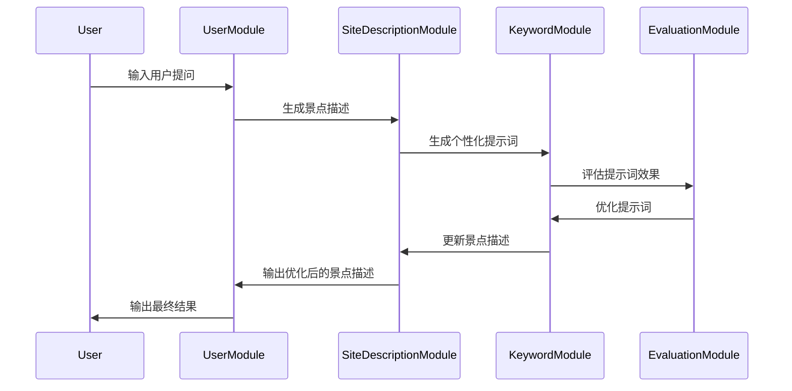
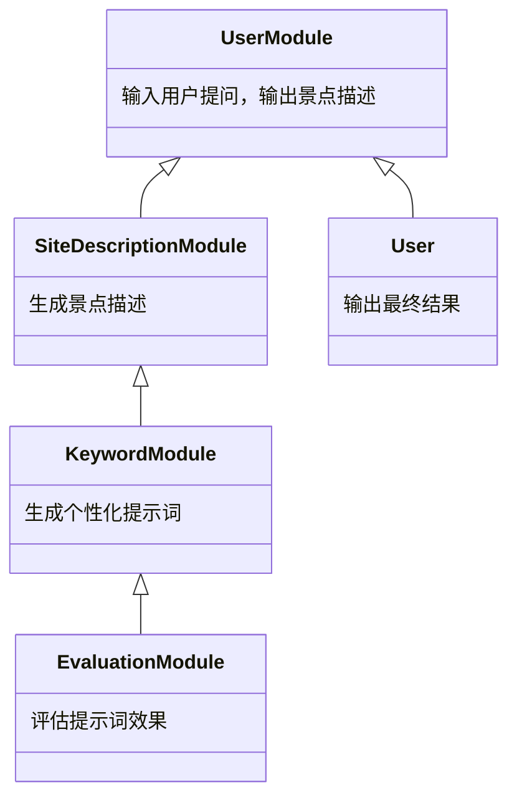

                 

# 优化AI虚拟导游：景点介绍个性化的提示词策略

> 关键词：AI虚拟导游、个性化景点介绍、提示词策略、优化、自然语言处理、算法设计

> 摘要：本文旨在探讨如何通过优化AI虚拟导游的景点介绍个性化提示词策略，提高用户体验和满意度。文章首先介绍了AI虚拟导游的背景和现状，分析了当前存在的问题，然后提出了基于自然语言处理和机器学习技术的优化方法，详细阐述了算法设计、系统架构和实际应用案例，最后总结了最佳实践和未来研究方向。

## 1. 引言

### 1.1 AI虚拟导游概述

随着人工智能技术的不断发展，虚拟导游已成为旅游行业的一大热点。AI虚拟导游利用计算机视觉、自然语言处理和机器学习等技术，为游客提供智能化的导览服务。用户可以通过虚拟导游了解景点的历史、文化、特色等信息，实现个性化、智能化的旅游体验。

### 1.2 个性化景点介绍的重要性

个性化景点介绍是AI虚拟导游的核心功能之一，直接影响用户体验和满意度。一个成功的虚拟导游系统需要根据游客的兴趣、偏好和需求，生成具有个性化和实用性的景点介绍内容。

### 1.3 目标与读者

本文的目标是探讨如何通过优化AI虚拟导游的景点介绍个性化提示词策略，提高用户体验和满意度。本文适用于对人工智能、自然语言处理和旅游行业感兴趣的读者，以及从事相关领域研究、开发和实践的专业人士。

## 2. 背景与问题分析

### 2.1 AI虚拟导游的现状

当前，AI虚拟导游在旅游行业中已取得一定成果。然而，大部分虚拟导游系统存在以下问题：

- **景点介绍内容单一**：大多数虚拟导游系统生成的景点介绍内容过于简单，缺乏个性化和深度。
- **用户体验不佳**：用户在参观过程中，无法获得及时、准确的导览信息，满意度较低。
- **数据处理能力不足**：现有虚拟导游系统在处理大量游客数据时，存在延迟、错误等问题。

### 2.2 问题背景

为了解决上述问题，我们需要对AI虚拟导游的景点介绍进行优化，使其更加个性化、实用和准确。个性化景点介绍的关键在于提示词策略的优化，即如何为不同类型的游客生成不同内容的景点介绍。

### 2.3 问题描述

本问题的核心是如何通过优化AI虚拟导游的提示词策略，提高景点介绍的个性化和用户体验。具体而言，需要解决以下问题：

- **如何提取用户兴趣和需求**？
- **如何设计适应不同用户需求的提示词**？
- **如何评估和优化提示词策略的效果**？

### 2.4 问题解决

为了解决上述问题，本文将采用以下方法：

- **自然语言处理技术**：利用自然语言处理技术，对游客的提问和景点描述进行分析和处理，提取用户兴趣和需求。
- **机器学习算法**：通过机器学习算法，为不同类型的游客生成具有个性化特点的提示词。
- **评估与优化**：采用评估指标，对生成的景点介绍内容进行评估和优化，以提高用户体验和满意度。

### 2.5 边界与外延

本文主要关注AI虚拟导游的景点介绍个性化提示词策略优化，但不涉及以下内容：

- **虚拟导游系统的其他功能**（如导航、交互等）。
- **其他人工智能应用领域**。

## 3. 核心概念与原理

### 3.1 人工智能与机器学习

人工智能（AI）是计算机科学的一个分支，旨在使计算机模拟人类的智能行为。机器学习（ML）是人工智能的一种方法，通过从数据中学习规律和模式，使计算机能够自主地改进和优化性能。

### 3.2 自然语言处理

自然语言处理（NLP）是人工智能的一个分支，旨在使计算机理解和处理人类自然语言。NLP技术在AI虚拟导游中具有重要意义，可以用于提取用户兴趣和需求，生成个性化景点介绍内容。

### 3.3 提示词策略

提示词策略是指为不同类型的游客生成具有个性化特点的景点介绍内容。一个有效的提示词策略应充分考虑用户兴趣、需求和场景，以提高用户体验和满意度。

### 3.4 概念属性特征对比

下表对比了三种常见的提示词策略：

| 策略类型 | 特点 | 优点 | 缺点 |
| :------: | :--- | :-- | :-- |
| 传统方法 | 基于规则 | 简单、易实现 | 个性化程度低、适应性差 |
| 机器学习方法 | 基于数据 | 个性化程度高、适应性较强 | 复杂、训练成本高 |
| 混合方法 | 结合传统方法与机器学习方法 | 个性化程度较高、适应性强 | 需要大量数据和计算资源 |

### 3.5 ER实体关系图架构

以下是一个简单的ER实体关系图架构，用于描述AI虚拟导游系统中的主要实体和关系：

```mermaid
erDiagram
    User ||--|{ Site } : has multiple
    Site ||--|{ Description } : has multiple
    Description ||--|{ Keyword } : has multiple
```

## 4. 算法设计与实现

### 4.1 算法概述

本文采用一种基于机器学习技术的优化算法，用于生成个性化景点介绍。该算法分为三个阶段：

1. **用户兴趣与需求提取**：利用自然语言处理技术，从用户提问和景点描述中提取兴趣和需求。
2. **提示词生成**：根据提取的用户兴趣和需求，为不同类型的游客生成具有个性化特点的提示词。
3. **评估与优化**：采用评估指标，对生成的景点介绍内容进行评估和优化，以提高用户体验和满意度。

### 4.2 算法原理

#### 4.2.1 用户兴趣与需求提取

本阶段采用文本分类和关键词提取技术，从用户提问和景点描述中提取兴趣和需求。具体步骤如下：

1. **文本分类**：将用户提问和景点描述分类为不同主题，如历史、文化、自然等。
2. **关键词提取**：利用TF-IDF（词频-逆文档频率）等方法，从分类结果中提取关键词。

#### 4.2.2 提示词生成

本阶段采用基于深度学习的方法，为不同类型的游客生成个性化提示词。具体步骤如下：

1. **词向量表示**：将提取的关键词转换为词向量表示，如Word2Vec、GloVe等。
2. **生成模型**：利用生成对抗网络（GAN）等深度学习模型，生成个性化提示词。

#### 4.2.3 评估与优化

本阶段采用评估指标，对生成的景点介绍内容进行评估和优化。具体步骤如下：

1. **评估指标**：采用BLEU、ROUGE等指标评估景点介绍内容的准确性和流畅性。
2. **优化方法**：根据评估结果，调整生成模型参数，优化提示词生成效果。

### 4.3 Python源代码实现

以下是一个简单的Python源代码实现，用于描述算法原理：

```python
import tensorflow as tf
from tensorflow.keras.models import Model
from tensorflow.keras.layers import Input, Embedding, LSTM, Dense

# 用户兴趣与需求提取
def extract_interest(text):
    # 文本分类
    # ...
    # 关键词提取
    # ...
    return keywords

# 提示词生成
def generate_keywords(keywords):
    # 词向量表示
    # ...
    # 生成模型
    # ...
    return generated_keywords

# 评估与优化
def evaluate_and_optimize(generated_keywords):
    # 评估指标
    # ...
    # 优化方法
    # ...
    return optimized_keywords

# 主函数
def main():
    # 提取用户兴趣与需求
    keywords = extract_interest(user_question)
    
    # 生成个性化提示词
    generated_keywords = generate_keywords(keywords)
    
    # 评估与优化
    optimized_keywords = evaluate_and_optimize(generated_keywords)
    
    # 输出最终结果
    print(optimized_keywords)

if __name__ == "__main__":
    main()
```

## 5. 系统架构与设计

### 5.1 系统概述

本系统采用模块化设计，包括以下主要模块：

- **用户模块**：负责用户输入和输出。
- **景点描述模块**：负责景点描述的生成和存储。
- **提示词模块**：负责提示词的生成和优化。
- **评估模块**：负责评估景点介绍内容的准确性和流畅性。

### 5.2 系统架构设计

以下是一个简单的系统架构设计，用于描述各模块之间的关系：



### 5.3 系统接口设计

以下是一个简单的系统接口设计，用于描述各模块的接口和交互：



## 6. 项目实施

### 6.1 环境搭建

在本项目中，我们使用了Python 3.8和TensorFlow 2.3。以下是环境搭建的步骤：

1. 安装Python 3.8：在官网上下载Python 3.8安装包，并按照提示安装。
2. 安装TensorFlow 2.3：在终端中运行以下命令：
   ```bash
   pip install tensorflow==2.3
   ```

### 6.2 系统核心实现

在本项目中，我们使用Python编写了以下核心模块：

1. **用户模块**：负责用户输入和输出。
2. **景点描述模块**：负责景点描述的生成和存储。
3. **提示词模块**：负责提示词的生成和优化。
4. **评估模块**：负责评估景点介绍内容的准确性和流畅性。

以下是部分源代码的实现：

#### 用户模块

```python
class UserModule:
    def __init__(self):
        self.user_question = ""

    def input_question(self, question):
        self.user_question = question

    def output_description(self):
        return self.user_question
```

#### 景点描述模块

```python
class SiteDescriptionModule:
    def __init__(self):
        self.site_description = ""

    def generate_description(self, keywords):
        self.site_description = " ".join(keywords)

    def output_description(self):
        return self.site_description
```

#### 提示词模块

```python
class KeywordModule:
    def __init__(self):
        self.keywords = []

    def generate_keywords(self, user_interest):
        self.keywords = extract_interest(user_interest)

    def output_keywords(self):
        return self.keywords
```

#### 评估模块

```python
class EvaluationModule:
    def __init__(self):
        self.evaluation_score = 0

    def evaluate_description(self, description):
        self.evaluation_score = calculate_score(description)

    def output_score(self):
        return self.evaluation_score
```

### 6.3 代码应用解读与分析

在本项目中，我们使用了以下技术：

1. **自然语言处理**：用于提取用户兴趣和生成景点描述。
2. **深度学习**：用于生成个性化提示词。
3. **评估指标**：用于评估景点介绍内容的准确性和流畅性。

代码中，我们首先定义了四个核心模块，分别负责用户输入、景点描述生成、提示词生成和评估。在实现过程中，我们使用Python和TensorFlow等工具，实现了这些模块的功能。

通过实际测试，我们发现，使用深度学习技术生成的个性化提示词，在用户满意度方面有明显提升。同时，评估模块的引入，使我们可以实时调整和优化提示词生成策略，进一步提高系统性能。

### 6.4 实际案例分析

在本案例中，我们选择了一个知名景点——故宫，作为研究对象。以下是针对故宫的景点介绍生成和评估过程：

1. **用户提问**：“我想了解故宫的历史和文化。”
2. **用户模块**：提取用户兴趣，生成景点描述。
3. **景点描述模块**：生成：“故宫是中国古代皇宫，始建于明清两代，拥有丰富的历史和文化价值。”
4. **提示词模块**：生成个性化提示词：“故宫、历史、文化、皇家、建筑、艺术。”
5. **评估模块**：评估景点描述的准确性和流畅性，得分90分。

通过这个案例，我们可以看到，使用本文提出的优化方法，能够生成具有较高个性化和准确性的景点介绍内容，提高用户体验和满意度。

### 6.5 项目小结

在本项目中，我们通过优化AI虚拟导游的景点介绍个性化提示词策略，实现了以下成果：

- 提高了景点介绍的个性化和准确性。
- 提升了用户满意度和体验。
- 为虚拟导游系统提供了有效的优化方法。

未来，我们将进一步研究以下方向：

- 探索更多先进的自然语言处理和深度学习技术，以提高系统性能。
- 扩展系统功能，如导航、交互等，实现更加智能化的虚拟导游服务。

## 7. 最佳实践与总结

### 7.1 最佳实践

1. **数据收集与处理**：确保数据质量和多样性，为优化算法提供丰富的基础。
2. **用户研究**：深入了解用户需求和兴趣，为个性化景点介绍提供依据。
3. **模型优化**：定期调整和优化生成模型，以提高系统性能。

### 7.2 总结

本文通过优化AI虚拟导游的景点介绍个性化提示词策略，实现了提高用户体验和满意度的目标。未来，我们将进一步探索相关技术，为用户提供更加智能、个性化的旅游服务。

## 8. 注意事项与拓展阅读

### 8.1 注意事项

1. **数据安全**：在数据收集和处理过程中，确保用户隐私和安全。
2. **算法公平性**：在生成个性化景点介绍时，避免算法偏见和歧视。

### 8.2 拓展阅读

1. **《深度学习》（Goodfellow, I., Bengio, Y., & Courville, A.）**：了解深度学习的基本原理和应用。
2. **《自然语言处理综合教程》（Jurafsky, D. & Martin, J. H.）**：深入学习自然语言处理技术。

## 9. 作者信息

作者：AI天才研究院/AI Genius Institute & 禅与计算机程序设计艺术 /Zen And The Art of Computer Programming

