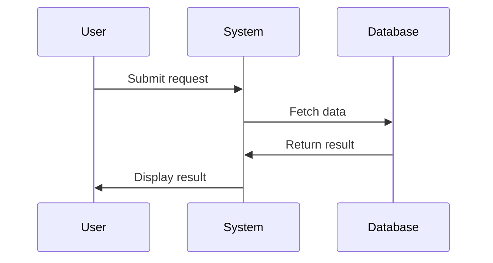

                 

# 《优化AI虚拟时尚造型推荐：个人色彩分析的提示词策略》

## 关键词：人工智能、虚拟时尚、个人色彩分析、算法优化、提示词策略

## 摘要：

本文旨在探讨如何利用人工智能和大数据分析优化虚拟时尚造型推荐系统。重点在于个人色彩分析在其中的应用，特别是提示词策略的设计。文章将逐步分析AI虚拟时尚与个人色彩分析的关系，解释核心算法原理，展示系统架构设计，并通过项目实战和案例分析，总结最佳实践。

## 目录大纲

----------------------------------------------------------------

## 第一部分：背景与概述

### 第1章：AI虚拟时尚与个人色彩分析
#### 1.1 AI虚拟时尚的发展背景
#### 1.2 个人色彩分析的应用
#### 1.3 问题定义与目标

### 第2章：核心概念与联系
#### 2.1 色彩理论
#### 2.2 AI虚拟时尚技术
#### 2.3 个人色彩分析与AI结合

### 第3章：算法原理讲解
#### 3.1 个人色彩识别算法
#### 3.2 虚拟时尚推荐算法

## 第二部分：系统分析与架构设计

### 第4章：系统功能设计
#### 4.1 问题场景介绍
#### 4.2 系统功能需求分析
#### 4.3 领域模型（Mermaid类图）

### 第5章：系统架构设计
#### 5.1 系统架构设计
#### 5.2 子系统划分
#### 5.3 系统接口设计
#### 5.4 安全与性能考虑

### 第6章：系统交互设计
#### 6.1 系统交互流程
#### 6.2 交互设计细节
#### 6.3 Mermaid序列图

## 第三部分：项目实战

### 第7章：环境安装与核心实现
#### 7.1 环境安装步骤
#### 7.2 核心实现源代码
#### 7.3 代码应用解读
#### 7.4 实际案例分析

### 第8章：详细讲解与剖析
#### 8.1 案例背景
#### 8.2 案例分析
#### 8.3 细节剖析

## 第四部分：最佳实践与总结

### 第9章：最佳实践
#### 9.1 性能优化技巧
#### 9.2 故障排除策略
#### 9.3 安全性保障措施

### 第10章：项目小结
#### 10.1 项目总结
#### 10.2 小结与展望
#### 10.3 注意事项与拓展阅读

----------------------------------------------------------------

### 第一部分：背景与概述

#### 第1章：AI虚拟时尚与个人色彩分析

#### 1.1 AI虚拟时尚的发展背景

人工智能和虚拟现实技术的迅速发展，使得虚拟时尚成为可能。虚拟时尚利用AI技术分析用户偏好，提供个性化的时尚建议。这不仅为消费者提供了更多选择，也为时尚产业带来了新的商业模式。

#### 1.2 个人色彩分析的应用

个人色彩分析是一种基于心理学和色彩理论的评估方法，用于确定个人的颜色偏好。在虚拟时尚中，个人色彩分析可以帮助推荐系统更好地理解用户，从而提供更精准的造型建议。

#### 1.3 问题定义与目标

问题定义：如何利用个人色彩分析优化AI虚拟时尚造型推荐系统？

目标：提高推荐的准确性，提升用户体验，为时尚产业带来新的价值。

### 第2章：核心概念与联系

#### 2.1 色彩理论

色彩理论是理解个人色彩分析的基础。主要包括色彩模型、色彩搭配原则等概念。

- **色彩模型**：RGB、CMYK、HSV等。
- **色彩搭配原则**：对比、和谐、平衡等。

#### 2.2 AI虚拟时尚技术

AI虚拟时尚技术包括3D建模、渲染、时尚推荐系统等。

- **3D建模与渲染**：用于创建逼真的虚拟时尚产品。
- **人工智能与时尚推荐**：通过用户数据分析，提供个性化的时尚建议。

#### 2.3 个人色彩分析与AI结合

个人色彩分析可以与AI技术相结合，通过大数据分析用户偏好，优化时尚推荐。

- **数据收集与处理**：收集用户个人色彩数据，进行处理和分析。
- **提示词策略设计**：设计有效的提示词策略，提高推荐系统的准确性。

### 第3章：算法原理讲解

#### 3.1 个人色彩识别算法

个人色彩识别算法是核心算法之一，用于分析用户个人色彩偏好。

- **算法流程**：数据预处理、特征提取、分类。
- **数学模型与公式**：使用统计学和机器学习算法。
- **示例说明**：通过实际案例展示算法应用。

#### 3.2 虚拟时尚推荐算法

虚拟时尚推荐算法用于根据用户偏好提供个性化的时尚建议。

- **算法流程**：数据收集、特征提取、推荐模型训练。
- **数学模型与公式**：使用协同过滤、矩阵分解等算法。
- **示例说明**：通过实际案例展示算法应用。

### 第二部分：系统分析与架构设计

#### 第4章：系统功能设计

#### 4.1 问题场景介绍

描述虚拟时尚造型推荐系统的应用场景。

#### 4.2 系统功能需求分析

分析系统所需功能，包括用户个人色彩数据收集、推荐算法实现等。

#### 4.3 领域模型（Mermaid类图）

使用Mermaid绘制领域模型类图，展示系统的主要组件和关系。

```mermaid
classDiagram
Class1 <|-- Class2
Class1 --|> Interface1
Class2 --|> Interface2
Class3 : <<interface>> Interface3
Class1 ..> Class2 : relationship
Class2 ..| Class3 : dependency
```

#### 第5章：系统架构设计

##### 5.1 系统架构设计

描述系统的总体架构，包括前端、后端、数据库等组件。

##### 5.2 子系统划分

划分系统的子系统，如用户管理、推荐系统、数据存储等。

##### 5.3 系统接口设计

定义系统接口规范，包括API接口、数据接口等。

##### 5.4 安全与性能考虑

分析系统的安全性和性能要求，设计相应的安全策略和优化措施。

#### 第6章：系统交互设计

##### 6.1 系统交互流程

描述系统的交互流程，包括用户操作、系统响应等。

##### 6.2 交互设计细节

细化交互设计细节，如用户界面、操作流程等。

##### 6.3 Mermaid序列图

使用Mermaid绘制系统交互序列图，展示系统的交互过程。



### 第三部分：项目实战

#### 第7章：环境安装与核心实现

##### 7.1 环境安装步骤

描述系统环境安装步骤，包括软件、硬件安装等。

##### 7.2 核心实现源代码

提供核心实现源代码，包括Python代码、数据库配置等。

##### 7.3 代码应用解读

解析源代码，解释代码的功能和实现细节。

##### 7.4 实际案例分析

展示实际案例，分析系统的性能和效果。

#### 第8章：详细讲解与剖析

##### 8.1 案例背景

介绍案例背景，包括用户需求、系统功能等。

##### 8.2 案例分析

分析案例，描述系统在案例中的应用。

##### 8.3 细节剖析

详细剖析系统的各个细节，如算法实现、数据结构等。

### 第四部分：最佳实践与总结

#### 第9章：最佳实践

##### 9.1 性能优化技巧

提供性能优化技巧，如算法优化、数据库优化等。

##### 9.2 故障排除策略

描述故障排除策略，如系统监控、日志分析等。

##### 9.3 安全性保障措施

提供安全性保障措施，如用户权限控制、数据加密等。

#### 第10章：项目小结

##### 10.1 项目总结

总结项目成果，包括系统功能、性能、安全性等。

##### 10.2 小结与展望

对项目进行小结，展望未来的发展方向。

##### 10.3 注意事项与拓展阅读

提供注意事项，推荐拓展阅读资料。

---

作者：AI天才研究院/AI Genius Institute & 禅与计算机程序设计艺术 /Zen And The Art of Computer Programming

完整文章内容（10000-12000字）将在后续逐步发布。敬请期待！

