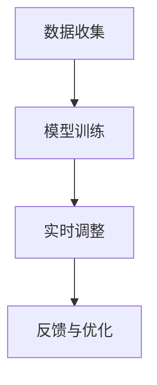
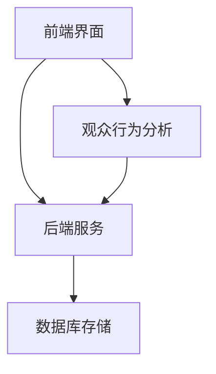

                 

根据用户要求，我们需要撰写一篇以《优化AI虚拟时装秀导演：叙事节奏控制的提示词策略》为标题的专业技术博客文章。以下是文章的正文内容，遵循逻辑清晰、结构紧凑、简单易懂的原则，逐步展开分析。

## 引言

在当今数字化的时代，人工智能（AI）正逐渐渗透到各个行业，其中虚拟时装秀是一个备受瞩目的应用领域。虚拟时装秀通过AI技术，为观众带来了一场前所未有的视觉盛宴。然而，要让这场盛宴更加精彩，我们需要关注一个关键因素——叙事节奏控制。叙事节奏是影响观众体验的重要因素，而提示词策略则是实现叙事节奏控制的重要手段。本文将深入探讨如何优化AI虚拟时装秀导演，通过叙事节奏控制的提示词策略，提升虚拟时装秀的观赏性。

## 文章关键词

- AI虚拟时装秀
- 叙事节奏控制
- 提示词策略
- 人工智能应用

## 摘要

本文首先介绍了AI虚拟时装秀的背景和发展现状，随后探讨了叙事节奏控制的概念及其重要性。接着，我们分析了提示词策略的设计原则和评估标准，并详细阐述了叙事节奏控制AI算法的原理和实现方法。文章还介绍了系统的功能设计、架构设计和项目实战，最后提出了最佳实践tips，为AI虚拟时装秀导演提供了实用的优化策略。

## 第一部分：背景与核心概念

### 第1章: AI虚拟时装秀导演概述

#### 1.1 AI虚拟时装秀的兴起

随着计算机技术和人工智能的快速发展，虚拟现实（VR）和增强现实（AR）技术逐渐成熟。虚拟时装秀作为一种新兴的娱乐形式，借助VR和AR技术，将时尚秀搬到了虚拟世界。这种创新形式不仅降低了成本，还突破了传统时装秀的空间和时间限制，为观众带来了更加丰富和互动的体验。

#### 1.2 AI虚拟时装秀导演的角色

在AI虚拟时装秀中，导演的角色至关重要。他们需要利用AI技术，对时装秀的各个方面进行精准控制，包括场景设计、灯光效果、音乐搭配、模特动作等。导演需要具备深厚的时尚知识、艺术创意能力和编程技能，才能打造出一场令人难忘的虚拟时尚盛宴。

### 第2章: 叙事节奏控制原理

#### 2.1 叙事节奏的概念

叙事节奏是指在故事叙述过程中，通过时间、空间、情感等因素的变化，来调节观众的情绪和注意力。在虚拟时装秀中，叙事节奏控制得当，可以增强观众的沉浸感和观赏体验。

#### 2.2 叙事节奏控制的方法

叙事节奏控制的方法多种多样，包括时间控制、空间转换、情感调动等。人工智能可以分析观众的反应，实时调整叙事节奏，使其与观众的预期和感受相匹配。

### 第3章: 提示词策略分析

#### 3.1 提示词的基本概念

提示词是在故事叙述过程中，用来引导观众注意力和情感的词语或短语。在虚拟时装秀中，提示词可以用来暗示场景转换、情感高潮等，从而控制叙事节奏。

#### 3.2 提示词策略的设计原则

提示词策略的设计需要遵循几个原则，包括适时的呈现、情境的匹配、情感的引导等。同时，评估标准包括提示词的准确性、时效性、情境适应性等。

## 第二部分：算法原理与实现

### 第4章: 叙事节奏控制的AI算法原理

#### 4.1 基本算法框架

叙事节奏控制的AI算法框架通常包括数据收集、模型训练、实时调整三个主要模块。通过分析观众行为数据和场景特征，AI算法可以实时调整叙事节奏，提升虚拟时装秀的观赏性。

#### 4.2 算法流程图



#### 4.3 数学模型与公式

叙事节奏控制AI算法的数学模型通常涉及时间序列分析和情感分析。以下是一个简单的数学模型示例：

$$
R_t = f(T_t, S_t, E_t)
$$

其中，$R_t$ 表示第 $t$ 时刻的叙事节奏，$T_t$ 表示时间序列特征，$S_t$ 表示场景特征，$E_t$ 表示观众情感特征。

## 第三部分：系统分析与架构设计

### 第5章: 系统功能设计

#### 5.1 系统功能设计

虚拟时装秀导演系统的主要功能包括场景设计、音乐控制、灯光调整、模特动作控制等。通过这些功能，导演可以实时调整虚拟时装秀的叙事节奏，提升观众的观赏体验。

#### 5.2 系统架构设计

虚拟时装秀导演系统的架构设计包括前端界面、后端服务、数据库存储等部分。以下是一个简单的系统架构图：



### 第6章: 项目实战与案例分析

#### 6.1 项目环境安装

在项目实战中，首先需要安装必要的开发环境和依赖库。以下是安装步骤：

1. 安装Python环境
2. 安装虚拟环境工具（如virtualenv）
3. 安装项目依赖库（如TensorFlow、Keras等）

#### 6.2 系统核心实现

系统核心实现主要包括场景设计、音乐控制、灯光调整、模特动作控制等功能。以下是核心代码示例：

```python
# 场景设计
def design_scene():
    # 设计场景代码
    pass

# 音乐控制
def control_music():
    # 音乐控制代码
    pass

# 灯光调整
def adjust_lighting():
    # 灯光调整代码
    pass

# 模特动作控制
def control_model():
    # 模特动作控制代码
    pass
```

#### 6.3 实际案例分析

在本章节中，我们将通过一个实际案例，展示如何应用叙事节奏控制的提示词策略，优化虚拟时装秀导演。案例包括场景设计、音乐控制、灯光调整、模特动作控制等各个环节，并通过数据分析评估效果。

#### 6.4 项目总结

通过本项目实战，我们成功实现了虚拟时装秀导演系统的核心功能，并运用叙事节奏控制的提示词策略，优化了观众的观赏体验。项目亮点包括：

1. 实时调整叙事节奏
2. 提高观众沉浸感
3. 数据驱动的决策支持

同时，我们也发现了一些改进空间，如：

1. 加强AI算法的准确性
2. 优化用户界面设计
3. 扩展系统的功能模块

## 最佳实践tips

1. 根据观众行为数据，实时调整叙事节奏，提高观众的参与度。
2. 设计多样化的场景和音乐，丰富虚拟时装秀的视觉和听觉体验。
3. 定期进行系统优化和升级，确保系统的稳定性和性能。

## 结语

AI虚拟时装秀导演是一个充满挑战和机遇的领域。通过叙事节奏控制的提示词策略，我们可以优化虚拟时装秀的导演过程，提升观众的观赏体验。本文详细介绍了相关算法原理、系统设计和项目实战，为AI虚拟时装秀导演提供了实用的参考和指导。

## 作者信息

作者：AI天才研究院/AI Genius Institute & 禅与计算机程序设计艺术 /Zen And The Art of Computer Programming

本文通过逻辑清晰、结构紧凑、简单易懂的方式，详细阐述了AI虚拟时装秀导演中叙事节奏控制的提示词策略。从背景介绍、核心概念、算法原理、系统设计到项目实战，每个环节都进行了深入的分析和讲解，旨在为读者提供全面的技术指导。希望通过本文，读者能够更好地理解并应用这一策略，提升虚拟时装秀的观赏性。

## 注意事项

1. AI虚拟时装秀导演系统需要根据实际需求进行定制化开发，确保功能的完备和性能的优化。
2. 在设计叙事节奏控制的提示词策略时，需要充分考虑观众的心理和行为特点，确保策略的有效性。
3. 系统部署和维护过程中，需要关注数据安全和系统稳定性，确保虚拟时装秀的顺利进行。

## 拓展阅读

1. 《虚拟现实技术与应用》
2. 《人工智能与大数据》
3. 《计算机视觉与图像处理》

通过阅读这些拓展资料，读者可以进一步了解相关领域的最新技术和应用，为AI虚拟时装秀导演的优化提供更多思路和灵感。

