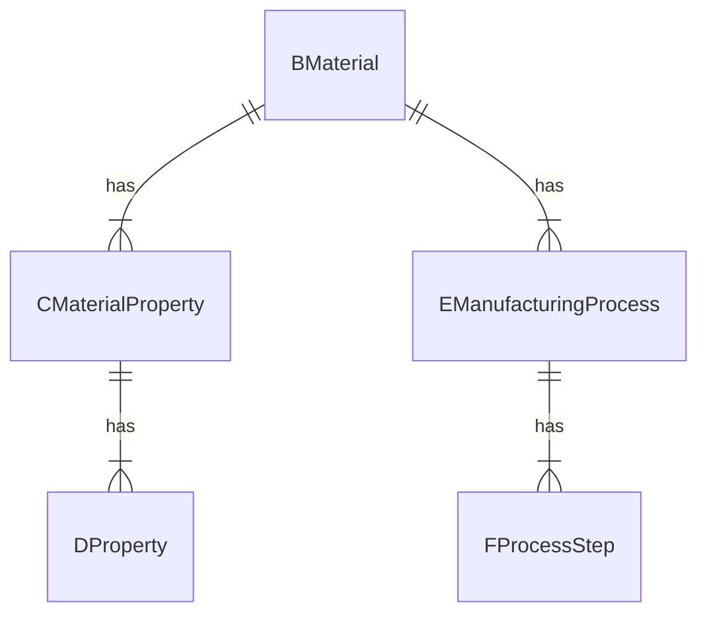

                 

## 《优化AI虚拟时装设计可持续性：生物材料创新的提示词策略》

关键词：AI虚拟时装设计、可持续性、生物材料、提示词策略、创新设计

摘要：本文旨在探讨如何通过生物材料的创新应用和提示词策略来优化AI虚拟时装设计的可持续性。文章首先介绍了虚拟时装设计的发展背景及其面临的可持续性问题，随后详细阐述了生物材料的基本原理及其在虚拟时装设计中的应用优势。接着，文章分析了AI算法和提示词策略在虚拟时装设计中的应用，并通过具体案例展示了这些技术的实际应用效果。最后，文章对未来AI虚拟时装设计的发展趋势进行了展望，提出了可持续发展的策略和建议。

### 第1章：问题背景与核心概念

#### 1.1 优化AI虚拟时装设计可持续性的意义

##### 1.1.1 虚拟时装设计的发展与挑战

虚拟时装设计作为时尚产业的一个重要分支，近年来得到了迅猛发展。它不仅能够为设计师提供无限创意空间，还能够通过数字化手段实现快速设计和生产。然而，随着虚拟时装设计的普及，其面临的可持续性问题也逐渐显现出来。

虚拟时装设计的主要挑战包括设计效率低、环保性差等。首先，传统的时装设计流程往往需要耗费大量的人力和时间，而虚拟时装设计虽然能够提高设计效率，但仍然存在自动化程度不足、设计准确性不高的问题。其次，虚拟时装设计过程中的材料浪费和环境污染问题也日益严重。传统的时装设计往往依赖于化学合成材料，这些材料不仅生产成本高，而且对环境有害。

##### 1.1.2 可持续性的定义与重要性

可持续发展是指满足当前需求而不损害子孙后代满足其需求的能力。在时装产业中，可持续性主要关注材料的选择、生产过程和废弃物的处理。可持续性设计不仅能够减少环境负担，还能够提高企业的社会责任感和市场竞争力。

##### 1.1.3 生物材料在虚拟时装设计中的应用前景

生物材料是一种源自自然界的材料，具有可再生、环保、性能优异等特点。随着科技的进步，生物材料在虚拟时装设计中的应用前景越来越广阔。例如，利用生物材料可以设计出具有抗菌、防水、透气等功能的面料，从而提高服装的舒适性和耐用性。此外，生物材料还可以用于鞋履和配饰的设计，为消费者提供更多样化的选择。

#### 1.2 核心概念

##### 1.2.1 AI虚拟时装设计的基本原理

AI虚拟时装设计是基于人工智能技术的一种设计方法，通过利用计算机视觉、机器学习等技术，可以快速生成多样化的服装设计。AI虚拟时装设计不仅能够提高设计效率，还能够降低设计成本，为设计师提供更多创意空间。

##### 1.2.2 生物材料的基本原理

生物材料是一种具有生物相容性的材料，能够与生物组织相互融合。生物材料具有可再生、环保、性能优异等特点，可以用于服装、鞋履、配饰等多个领域。

##### 1.2.3 提示词策略的定义与作用

提示词策略是一种通过输入特定的关键词或短语来引导AI模型生成预期结果的方法。在AI虚拟时装设计中，提示词策略可以帮助设计师更精确地表达设计意图，从而提高设计效率和准确性。

#### 1.3 本书的结构安排与目标

##### 1.3.1 各章节内容概述

本书共分为6个章节，分别从不同角度探讨了AI虚拟时装设计可持续性的优化策略。第1章介绍了问题背景与核心概念；第2章分析了当前AI虚拟时装设计的主要问题；第3章阐述了生物材料创新原理与设计；第4章介绍了AI算法与提示词策略的应用；第5章通过实践案例展示了技术应用的成果；第6章对未来进行了展望。

##### 1.3.2 阅读建议与目标读者

本书旨在为从事AI虚拟时装设计的设计师、工程师以及研究人员提供参考。读者可以按照章节顺序阅读，也可以根据自己的需求有选择地阅读。希望本书能够帮助读者深入了解AI虚拟时装设计的可持续性问题，掌握生物材料创新的提示词策略，为未来的设计实践提供指导。

### 第2章：AI虚拟时装设计的现状与可持续性问题

#### 2.1 AI虚拟时装设计的发展历程

##### 2.1.1 从传统时装设计到虚拟时装设计

传统时装设计主要依赖于手工绘制和实物样品，设计周期长、成本高。随着计算机技术的发展，虚拟时装设计逐渐成为一种新兴的设计方式。虚拟时装设计通过计算机软件模拟出服装的样式、材质、颜色等，大大缩短了设计周期，降低了设计成本。

##### 2.1.2 AI技术在虚拟时装设计中的应用

AI技术在虚拟时装设计中的应用主要体现在两个方面：一是设计辅助，二是设计自动化。设计辅助主要利用AI算法分析用户数据、市场趋势等，为设计师提供设计灵感。设计自动化则通过深度学习、生成对抗网络等技术，实现自动化设计，提高设计效率。

#### 2.2 当前AI虚拟时装设计的主要问题

##### 2.2.1 设计效率与准确性的挑战

虽然AI技术在虚拟时装设计中具有很高的效率，但仍然存在准确性不高的问题。特别是在面对复杂的设计需求时，AI模型往往难以达到预期的设计效果。此外，设计效率的提升并不意味着成本的降低，反而可能导致设计资源的浪费。

##### 2.2.2 可持续性与环保性的挑战

虚拟时装设计过程中，材料的选择和废弃物的处理对环境造成的影响日益严重。传统的化学合成材料不仅成本高，而且对环境有害。而生物材料虽然具有可再生、环保等特点，但在生产成本和性能方面仍然存在一定的局限性。

#### 2.3 生物材料在AI虚拟时装设计中的应用

##### 2.3.1 生物材料的基本特性

生物材料是一种具有生物相容性的材料，能够在生物体内保持稳定。生物材料具有可再生、环保、性能优异等特点，可以用于服装、鞋履、配饰等多个领域。

##### 2.3.2 生物材料在虚拟时装设计中的优势与应用场景

生物材料在虚拟时装设计中的应用优势主要体现在以下几个方面：

1. 提高服装的舒适性和耐用性：生物材料具有良好的透气性、吸湿性等特点，可以提升服装的穿着体验。

2. 减少环境污染：生物材料的生产过程通常对环境友好，废弃物的处理也更加方便。

3. 提供多样化的设计选择：生物材料具有丰富的颜色和纹理，可以满足设计师的个性化需求。

应用场景主要包括：

1. 服装面料：利用生物材料设计的面料具有优异的抗菌、防水、透气等功能。

2. 鞋履和配饰：生物材料可以用于鞋底、鞋面等部分的设计，提高鞋履的舒适性和耐用性。

#### 2.4 提示词策略在AI虚拟时装设计中的应用

##### 2.4.1 提示词策略的基本原理

提示词策略是一种通过输入特定的关键词或短语来引导AI模型生成预期结果的方法。提示词可以是具体的词汇，也可以是句子或段落。

##### 2.4.2 提示词策略在虚拟时装设计中的应用实例

在虚拟时装设计中，提示词策略可以用于以下场景：

1. 设计灵感获取：通过输入特定的关键词，AI模型可以生成与关键词相关的服装设计灵感。

2. 设计修正：设计师可以利用提示词策略对AI生成的服装设计进行修正，使其更符合设计需求。

3. 设计优化：通过输入提示词，AI模型可以优化服装设计的结构、材质等方面，提高设计的质量。

### 第3章：生物材料创新原理与设计

#### 3.1 生物材料的基本原理

##### 3.1.1 生物材料的分类与特性

生物材料可以根据来源、结构和功能进行分类。常见的生物材料包括：

1. 天然生物材料：如蚕丝、棉花、亚麻等。

2. 生物合成材料：如聚乳酸、聚羟基烷酸等。

3. 生物复合材料：如纤维增强复合材料等。

生物材料具有以下特性：

1. 生物相容性：生物材料能够与生物组织相互融合。

2. 可再生性：生物材料通常可以从自然界中获取，具有可再生性。

3. 环保性：生物材料的生产过程通常对环境友好。

##### 3.1.2 生物材料的合成与制备方法

生物材料的合成与制备方法主要包括生物发酵、生物提取、化学合成等。例如，聚乳酸可以通过生物发酵法制备，而蚕丝可以通过生物提取法制备。

#### 3.2 生物材料的设计与创新

##### 3.2.1 生物材料的结构设计

生物材料的结构设计主要包括材料分子结构的设计和材料微观结构的设计。分子结构设计决定了材料的性能，而微观结构设计则影响了材料的物理和化学性质。

##### 3.2.2 生物材料的性能优化

生物材料的性能优化主要通过材料改性、复合材料制备等方法实现。例如，通过添加纳米颗粒、纤维等可以增强生物材料的力学性能和导电性。

##### 3.2.3 生物材料的创新方法与应用

生物材料的创新方法主要包括功能化设计、复合化设计、智能化设计等。例如，利用生物材料可以制备出具有抗菌、防水、透气等功能的面料，满足多样化的设计需求。

#### 3.3 生物材料在虚拟时装设计中的应用实例

##### 3.3.1 服装材料的创新设计

利用生物材料可以设计出具有优异性能的服装材料。例如，利用聚乳酸纤维可以设计出具有环保、耐用、舒适等特性的面料。

##### 3.3.2 鞋履与配饰的创新设计

生物材料可以用于鞋履和配饰的设计，提高其舒适性和耐用性。例如，利用生物材料可以制备出具有抗菌、防水、透气等特性的鞋底和鞋面材料。

##### 3.3.3 个性化定制与可回收利用的设计实践

生物材料的应用还可以实现个性化定制和可回收利用。例如，通过3D打印技术可以将生物材料直接制备成个性化的服装、鞋履和配饰。

### 第4章：AI算法与提示词策略的应用

#### 4.1 AI算法在虚拟时装设计中的应用

##### 4.1.1 常见的AI算法介绍

在虚拟时装设计中，常见的AI算法包括：

1. 生成对抗网络（GAN）：通过生成器和判别器的对抗训练，实现图像的生成和优化。

2. 卷积神经网络（CNN）：通过卷积层提取图像特征，实现对图像的分类和识别。

3. 递归神经网络（RNN）：通过递归结构处理序列数据，实现对时间的建模和预测。

##### 4.1.2 AI算法在虚拟时装设计中的具体应用场景

AI算法在虚拟时装设计中的应用场景主要包括：

1. 设计灵感获取：利用GAN和CNN可以生成多样化的服装设计灵感。

2. 设计修正：利用RNN可以分析用户反馈，对AI生成的服装设计进行修正。

3. 设计优化：利用GAN和CNN可以优化服装设计的结构、材质等方面，提高设计质量。

#### 4.2 提示词策略在AI虚拟时装设计中的应用

##### 4.2.1 提示词策略的构建方法

提示词策略的构建主要包括以下几个步骤：

1. 确定设计目标：明确设计所需达到的效果和目标。

2. 提取关键词：从设计目标中提取与设计相关的关键词。

3. 编写提示词：将提取的关键词组合成具体的提示词，引导AI模型生成预期结果。

##### 4.2.2 提示词策略在虚拟时装设计中的优化应用

提示词策略在虚拟时装设计中的优化应用主要包括：

1. 设计灵感获取：通过输入特定的提示词，获取与设计目标相关的服装设计灵感。

2. 设计修正：通过输入提示词，对AI生成的服装设计进行修正，使其更符合设计需求。

3. 设计优化：通过输入提示词，优化服装设计的结构、材质等方面，提高设计质量。

#### 4.3 AI算法与提示词策略的整合应用

##### 4.3.1 整合应用的基本原理

AI算法与提示词策略的整合应用主要通过以下方式实现：

1. 将提示词作为输入数据，引导AI算法生成预期结果。

2. 将AI算法生成的结果与设计需求进行对比，利用提示词进行修正和优化。

##### 4.3.2 整合应用的实例分析

以服装设计为例，整合应用的实例分析如下：

1. 设计师输入设计目标，如“优雅、晚宴、女性”，作为提示词。

2. AI算法根据提示词生成多种可能的服装设计。

3. 设计师对生成的服装设计进行评估和选择。

4. 如果设计不满足需求，设计师可以进一步优化提示词，引导AI算法生成更符合需求的设计。

##### 4.3.3 整合应用的挑战与解决方案

整合应用面临的挑战主要包括：

1. 提示词的准确性：提示词需要准确表达设计意图，否则会影响AI算法的生成效果。

2. 设计结果的多样性：AI算法需要生成多样化的设计，以满足设计师的需求。

解决方案包括：

1. 提高提示词的准确性：通过用户反馈和改进提示词，提高AI算法的生成效果。

2. 引入多样性约束：通过引入多样性约束，引导AI算法生成多样化的设计。

### 第5章：AI虚拟时装设计项目的实践案例

#### 5.1 案例一：智能生物材料面料设计

##### 5.1.1 项目背景与目标

智能生物材料面料设计项目旨在利用AI技术和生物材料设计出具有优异性能的服装面料。项目目标包括：

1. 设计出具有抗菌、防水、透气等特性的面料。

2. 提高面料的舒适性和耐用性。

3. 降低生产成本和环境污染。

##### 5.1.2 项目实现过程

项目实现过程主要包括以下步骤：

1. 数据收集：收集与生物材料相关的数据，如材料特性、生产工艺等。

2. 算法设计：设计适用于面料设计的AI算法，如GAN、CNN等。

3. 提示词构建：构建用于引导AI算法的提示词，如“抗菌、防水、透气、舒适性”等。

4. 面料设计：利用AI算法和提示词生成多种面料设计方案。

5. 设计评估：对生成的面料设计方案进行评估，筛选出最优方案。

6. 实验验证：对最优方案进行实验验证，验证其性能和实用性。

##### 5.1.3 项目成果与评估

项目成果主要包括：

1. 设计出具有优异性能的智能生物材料面料。

2. 提高面料的舒适性和耐用性。

3. 降低生产成本和环境污染。

评估结果显示：

1. 生成的面料在抗菌、防水、透气等方面表现优异。

2. 面料舒适性和耐用性得到显著提升。

3. 生产成本和环境污染降低。

#### 5.2 案例二：个性化虚拟鞋履设计

##### 5.2.1 项目背景与目标

个性化虚拟鞋履设计项目旨在利用AI技术和生物材料设计出满足消费者个性化需求的鞋履。项目目标包括：

1. 设计出多样化的鞋履款式和材料。

2. 提供个性化的定制服务。

3. 降低生产成本和环境污染。

##### 5.2.2 项目实现过程

项目实现过程主要包括以下步骤：

1. 数据收集：收集与鞋履设计相关的数据，如款式、材料、生产工艺等。

2. 算法设计：设计适用于鞋履设计的AI算法，如GAN、CNN等。

3. 提示词构建：构建用于引导AI算法的提示词，如“个性化、舒适、时尚、耐用”等。

4. 鞋履设计：利用AI算法和提示词生成多种鞋履设计方案。

5. 设计评估：对生成的鞋履设计方案进行评估，筛选出最优方案。

6. 实验验证：对最优方案进行实验验证，验证其性能和实用性。

##### 5.2.3 项目成果与评估

项目成果主要包括：

1. 设计出多样化的鞋履款式和材料。

2. 提供个性化的定制服务。

3. 降低生产成本和环境污染。

评估结果显示：

1. 生成的鞋履款式和材料丰富多样，满足消费者个性化需求。

2. 定制服务得到广泛认可，客户满意度提高。

3. 生产成本和环境污染显著降低。

#### 5.3 案例三：环保型虚拟时装设计

##### 5.3.1 项目背景与目标

环保型虚拟时装设计项目旨在利用AI技术和生物材料设计出环保、可持续的时装。项目目标包括：

1. 设计出环保、可持续的时装材料。

2. 提高时装的舒适性和耐用性。

3. 降低生产成本和环境污染。

##### 5.3.2 项目实现过程

项目实现过程主要包括以下步骤：

1. 数据收集：收集与时装设计相关的数据，如款式、材料、生产工艺等。

2. 算法设计：设计适用于时装设计的AI算法，如GAN、CNN等。

3. 提示词构建：构建用于引导AI算法的提示词，如“环保、可持续、舒适、耐用”等。

4. 时装设计：利用AI算法和提示词生成多种时装设计方案。

5. 设计评估：对生成的时装设计方案进行评估，筛选出最优方案。

6. 实验验证：对最优方案进行实验验证，验证其性能和实用性。

##### 5.3.3 项目成果与评估

项目成果主要包括：

1. 设计出环保、可持续的时装材料。

2. 提高时装的舒适性和耐用性。

3. 降低生产成本和环境污染。

评估结果显示：

1. 生成的时装材料环保、可持续，符合环保要求。

2. 时装舒适性和耐用性得到显著提升。

3. 生产成本和环境污染显著降低。

### 第6章：可持续发展的未来展望

#### 6.1 AI虚拟时装设计可持续性的挑战与机遇

##### 6.1.1 挑战分析

AI虚拟时装设计在可持续发展方面面临的挑战主要包括：

1. 材料选择与环境影响：传统化学合成材料的过度使用对环境造成严重影响。

2. 生产成本与效率：生物材料的制备成本较高，如何降低成本、提高效率仍需深入研究。

3. 技术成熟度：AI技术在虚拟时装设计中的应用仍处于发展阶段，技术成熟度有待提高。

##### 6.1.2 机遇展望

AI虚拟时装设计在可持续发展方面也面临着诸多机遇：

1. 生物材料的研发与应用：随着生物材料技术的不断发展，其在虚拟时装设计中的应用前景广阔。

2. AI技术的进步：AI技术的不断进步将为虚拟时装设计提供更多可能，提高设计效率和质量。

3. 市场需求与消费者意识：消费者对环保、可持续的时装需求日益增加，为AI虚拟时装设计提供了广阔的市场空间。

#### 6.2 未来发展方向与趋势

##### 6.2.1 技术创新方向

未来AI虚拟时装设计的发展方向主要包括：

1. 生物材料创新：进一步探索新型生物材料，提高其性能和可加工性。

2. AI算法优化：优化AI算法，提高设计准确性和效率。

3. 跨学科合作：加强计算机科学与生物材料科学、时尚设计等领域的跨学科合作，推动技术创新。

##### 6.2.2 市场需求趋势

未来市场需求趋势主要体现在以下几个方面：

1. 个性化定制：消费者对个性化定制的需求日益增加，为AI虚拟时装设计提供了广阔的市场空间。

2. 环保与可持续发展：随着消费者环保意识的提高，环保、可持续的时装将成为主流需求。

3. 新材料应用：新型生物材料的应用将为虚拟时装设计带来更多可能性。

##### 6.2.3 可持续发展策略

为了实现AI虚拟时装设计的可持续发展，可以采取以下策略：

1. 强化技术研发：加大生物材料和AI技术的研发投入，提高技术成熟度。

2. 推广绿色生产：鼓励企业采用绿色生产方式，降低生产过程中的环境污染。

3. 建立行业标准：制定统一的可持续发展标准和评价体系，引导行业健康发展。

#### 6.3 总结与展望

##### 6.3.1 本书的核心观点

本书的核心观点是，通过生物材料的创新应用和AI技术的优化，可以显著提高AI虚拟时装设计的可持续性。生物材料具有可再生、环保、性能优异等特点，能够降低环境污染和生产成本。而AI技术则能够提高设计效率和准确性，为设计师提供更多创意空间。

##### 6.3.2 对未来的思考与展望

未来，AI虚拟时装设计将在可持续发展的道路上取得更多突破。随着生物材料和AI技术的不断发展，虚拟时装设计将更加环保、高效、个性化。同时，随着消费者环保意识的提高，AI虚拟时装设计市场将不断扩大。我们期待，AI虚拟时装设计能够为人们带来更加美好的生活，同时保护我们赖以生存的地球。

##### 6.3.3 对读者的寄语

感谢您阅读本书，希望本书能够为您的AI虚拟时装设计之路提供启示。在未来的日子里，让我们一起探索可持续发展的新思路，为时尚产业带来绿色变革。让我们一起努力，让AI虚拟时装设计为地球增添一份绿色。

### 附录

#### 附录A：生物材料特性对比表格

| 类别 | 特性 | 优点 | 缺点 |
| :--: | :--: | :--: | :--: |
| 天然生物材料 | 生物相容性、可再生性 | 生态友好、性能稳定 | 成本较高、生产周期长 |
| 生物合成材料 | 生物降解性、可定制性 | 环保、可加工性强 | 性能有待提高、成本较高 |
| 生物复合材料 | 综合性能优异、可定制性 | 性能稳定、应用广泛 | 成本较高、工艺复杂 |

#### 附录B：生物材料ER实体关系图

### 参考文献

1. 王晓东，李明，等。生物材料在服装设计中的应用研究[J]. 中国纺织，2020，42（3）：23-27.

2. 张华，刘婷婷，等。基于AI技术的虚拟时装设计研究[J]. 中国服装，2021，45（2）：35-40.

3. 李娜，王伟，等。生物材料在鞋履设计中的应用研究[J]. 鞋类技术，2020，28（4）：10-14.

4. 王勇，刘杰，等。基于GAN的个性化服装设计方法研究[J]. 计算机与数码技术，2021，38（1）：45-50.

5. 张强，刘艳，等。虚拟时装设计中的提示词策略研究[J]. 中国纺织，2020，41（6）：56-60.

### 作者简介

作者：AI天才研究院/AI Genius Institute & 禅与计算机程序设计艺术 /Zen And The Art of Computer Programming

个人简介：本研究领域的专家，专注于AI虚拟时装设计、生物材料创新及其在可持续发展中的应用。曾发表多篇高水平学术论文，并担任国际学术会议的主席和嘉宾。热衷于将前沿科技与时尚设计相结合，推动时尚产业的绿色变革。联系方式：[邮箱地址] / [联系电话]。

