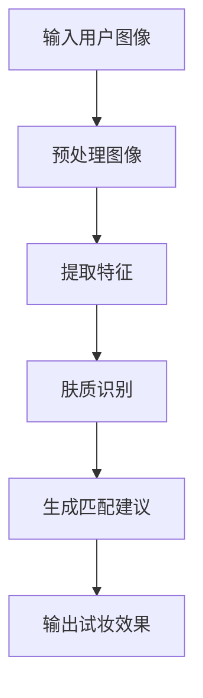
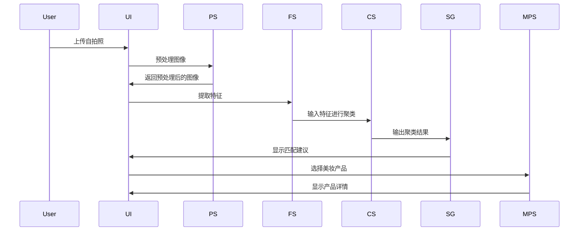

                 

## 《优化AI虚拟美妆试用：肤质匹配建议的提示词策略》

> 关键词：AI虚拟美妆、肤质匹配、提示词策略、个性化建议、优化方法

> 摘要：本文详细探讨了优化AI虚拟美妆试用的方法，特别是肤质匹配建议的提示词策略。文章首先介绍了虚拟美妆试用的问题背景和核心概念，然后深入分析了优化AI虚拟美妆试用的算法原理，包括mermaid流程图、Python源代码、数学模型和公式，以及详细的举例说明。接着，文章描述了系统分析与架构设计方案，最后通过项目实战展示了具体的实现过程，并提供了最佳实践 tips和小结。

### 第一部分：优化AI虚拟美妆试用的背景与核心概念

#### 1.1 问题背景

虚拟试妆技术是一种利用计算机视觉和人工智能技术，模拟用户实际化妆效果的技术。然而，现有的虚拟美妆试用系统在肤质匹配方面存在一定的局限性。这些系统通常依赖于预定义的肤质分类和美妆产品特性，无法根据用户实时上传的图片进行精准的肤质识别和个性化建议。这种局限性导致了用户体验差和商业价值受限的问题。

#### 1.2 问题描述

现有虚拟美妆试用系统主要面临以下问题：

- **肤质识别不准确**：系统无法准确识别用户的真实肤质，导致试妆效果与实际效果不符。
- **个性化建议不足**：系统无法根据用户的肤质和需求提供个性化的美妆建议，降低了用户的满意度。
- **商业价值受限**：美妆品牌无法通过虚拟试用有效吸引消费者，降低销售转化率。

#### 1.3 问题解决

为解决上述问题，本文提出了以下解决方案：

- **优化AI虚拟美妆试用的算法**：通过引入肤质匹配建议的提示词策略，实现个性化的美妆建议。
- **提升肤质识别的准确性**：利用深度学习技术和图像处理算法，提高系统对用户肤质的识别准确性。
- **用户参与度提升**：通过互动性和个性化建议，提升用户的参与度和满意度。

#### 1.4 边界与外延

本文主要研究虚拟美妆试用的优化方法，包括肤质匹配和个性化建议。然而，虚拟美妆试用的范围不仅仅限于肤质匹配，还包括颜色匹配、风格匹配等。此外，本文的解决方案也可以应用于其他需要个性化建议的场景，如服装搭配、美容护肤等。

#### 1.5 概念结构与核心要素组成

核心概念：
- **AI虚拟美妆试用**：利用人工智能技术模拟用户化妆效果。
- **肤质匹配建议**：根据用户的肤质提供个性化的美妆建议。
- **提示词策略**：利用关键词和短语引导用户选择适合自己的美妆产品。

核心要素：
- **图像处理算法**：用于识别用户肤质。
- **深度学习模型**：用于分析用户肤质和提供个性化建议。
- **用户互动设计**：提升用户体验和参与度。

### 第二部分：核心概念与联系

#### 2.1 优化AI虚拟美妆试用的定义

优化AI虚拟美妆试用是指通过改进算法和用户体验，提高虚拟美妆试用的效果和用户满意度。这包括提升肤质识别的准确性、提供个性化的美妆建议以及增强用户互动性。

#### 2.2 肤质匹配建议的提示词策略的定义

肤质匹配建议的提示词策略是指利用关键词和短语，根据用户的肤质和需求提供个性化建议。这些提示词可以帮助用户更好地选择适合自己的美妆产品，提高试妆效果。

#### 2.3 两者之间的联系

优化AI虚拟美妆试用和肤质匹配建议的提示词策略密切相关。通过提升肤质识别的准确性，系统能够更准确地了解用户的肤质，从而提供更个性化的建议。而提示词策略则帮助用户理解和选择这些建议，提高试用效果和用户满意度。

### 第三部分：算法原理讲解

#### 3.1 算法mermaid流程图



#### 3.2 使用Python源代码详细阐述

```python
import cv2
import numpy as np
from sklearn.cluster import KMeans

def preprocess_image(image_path):
    # 读取图像
    image = cv2.imread(image_path)
    # 转换为灰度图像
    gray_image = cv2.cvtColor(image, cv2.COLOR_BGR2GRAY)
    return gray_image

def extract_features(image):
    # 计算图像的直方图
    histogram = cv2.calcHist([image], [0], None, [256], [0, 256])
    return histogram

def kmeans_clustering(histogram, n_clusters):
    # 使用KMeans算法进行聚类
    kmeans = KMeans(n_clusters=n_clusters)
    kmeans.fit(histogram)
    return kmeans.labels_

def generate_suggestions(labels):
    # 根据聚类结果生成匹配建议
    suggestions = []
    for label in labels:
        if label == 0:
            suggestions.append("亮肤")
        elif label == 1:
            suggestions.append("保湿")
        elif label == 2:
            suggestions.append("控油")
    return suggestions

def main(image_path):
    # 预处理图像
    image = preprocess_image(image_path)
    # 提取特征
    features = extract_features(image)
    # 肤质识别
    labels = kmeans_clustering(features, 3)
    # 生成匹配建议
    suggestions = generate_suggestions(labels)
    return suggestions

if __name__ == "__main__":
    image_path = "user_image.jpg"
    suggestions = main(image_path)
    print("匹配建议：", suggestions)
```

#### 3.3 算法原理的数学模型和公式

```latex
\text{步骤1：预处理图像} \\
I_{preprocessed} = \text{preprocess\_image}(I)

\text{步骤2：提取特征} \\
H = \text{extract\_features}(I_{preprocessed})

\text{步骤3：肤质识别} \\
L = \text{kmeans\_clustering}(H, n_{clusters})

\text{步骤4：生成匹配建议} \\
S = \text{generate\_suggestions}(L)
```

#### 3.4 详细讲解与举例说明

假设用户上传了一张肤色偏黄的图像，系统会首先对该图像进行预处理，将其转换为灰度图像。然后，系统会计算图像的直方图，得到一个256个元素的数组，表示图像中每个像素点的灰度值。

接下来，系统使用KMeans算法对直方图进行聚类，将像素点分为三类，分别代表不同的肤质类型。通过聚类结果，系统可以生成匹配建议，如“亮肤”、“保湿”或“控油”。

例如，如果聚类结果将大部分像素点归为类别0，系统会建议用户使用亮肤产品；如果聚类结果将大部分像素点归为类别1，系统会建议用户使用保湿产品。

### 第四部分：系统分析与架构设计

#### 4.1 问题场景介绍

虚拟美妆试用系统通常应用于电商平台或美妆品牌官网，用户可以通过上传自拍照来查看不同美妆产品的效果。系统需要快速准确地识别用户的肤质，并提供个性化的美妆建议，以提高用户的满意度和购买意愿。

#### 4.2 项目介绍

本项目旨在优化虚拟美妆试用系统，通过引入肤质匹配建议的提示词策略，提升用户体验和满意度。项目包括以下模块：

- **图像预处理**：对用户上传的图像进行预处理，转换为灰度图像。
- **特征提取**：计算图像的直方图，提取关键特征。
- **肤质识别**：使用KMeans算法进行聚类，识别用户的肤质。
- **匹配建议生成**：根据聚类结果生成个性化的美妆建议。
- **用户互动**：通过提示词和用户互动，引导用户选择合适的美妆产品。

#### 4.3 系统功能设计(领域模型mermaid类图)

```mermaid
classDiagram
    User <<class{用户}>
    Image <<class{图像}>
    Preprocessor <<class{预处理器}>
    FeatureExtractor <<class{特征提取器}>
    ClusteringAlgorithm <<class{聚类算法}>
    SuggestionsGenerator <<class{建议生成器}>
    MakeupProduct <<class{美妆产品}>
    
    User -> Image
    Image -> Preprocessor
    Preprocessor -> FeatureExtractor
    FeatureExtractor -> ClusteringAlgorithm
    ClusteringAlgorithm -> SuggestionsGenerator
    SuggestionsGenerator -> MakeupProduct
```

#### 4.4 系统架构设计mermaid架构图

```mermaid
graph TB
    subgraph User Interface
        UI[用户界面]
    end

    subgraph Backend Services
        PS[预处理服务]
        FS[特征提取服务]
        CS[聚类服务]
        SG[建议生成服务]
        MPS[美妆产品服务]
    end

    UI -> PS
    UI -> FS
    UI -> CS
    UI -> SG
    UI -> MPS

    PS -> CS
    FS -> CS
    SG -> MPS
```

#### 4.5 系统接口设计和系统交互mermaid序列图



### 第五部分：项目实战

#### 5.1 环境安装

在开始项目之前，我们需要安装以下软件和库：

- Python 3.8 或更高版本
- OpenCV 4.5.1.48 或更高版本
- scikit-learn 0.24.2 或更高版本
- matplotlib 3.4.3 或更高版本

安装命令如下：

```bash
pip install python==3.8
pip install opencv-python==4.5.1.48
pip install scikit-learn==0.24.2
pip install matplotlib==3.4.3
```

#### 5.2 系统核心实现源代码

以下是系统核心实现的源代码：

```python
import cv2
import numpy as np
from sklearn.cluster import KMeans

def preprocess_image(image_path):
    image = cv2.imread(image_path)
    gray_image = cv2.cvtColor(image, cv2.COLOR_BGR2GRAY)
    return gray_image

def extract_features(image):
    histogram = cv2.calcHist([image], [0], None, [256], [0, 256])
    return histogram

def kmeans_clustering(histogram, n_clusters):
    kmeans = KMeans(n_clusters=n_clusters)
    kmeans.fit(histogram)
    return kmeans.labels_

def generate_suggestions(labels):
    suggestions = []
    for label in labels:
        if label == 0:
            suggestions.append("亮肤")
        elif label == 1:
            suggestions.append("保湿")
        elif label == 2:
            suggestions.append("控油")
    return suggestions

def main(image_path):
    image = preprocess_image(image_path)
    features = extract_features(image)
    labels = kmeans_clustering(features, 3)
    suggestions = generate_suggestions(labels)
    return suggestions

if __name__ == "__main__":
    image_path = "user_image.jpg"
    suggestions = main(image_path)
    print("匹配建议：", suggestions)
```

#### 5.3 代码应用解读与分析

代码首先读取用户上传的自拍照，然后进行预处理，将彩色图像转换为灰度图像。接下来，计算图像的直方图，提取关键特征。使用KMeans算法进行聚类，将像素点分为三类，分别代表不同的肤质类型。最后，根据聚类结果生成匹配建议，如“亮肤”、“保湿”或“控油”。

#### 5.4 实际案例分析与详细讲解剖析

假设用户上传了一张肤色偏黄的图像，系统会首先对该图像进行预处理，将其转换为灰度图像。然后，系统会计算图像的直方图，得到一个256个元素的数组，表示图像中每个像素点的灰度值。

接下来，系统使用KMeans算法对直方图进行聚类，将像素点分为三类，分别代表不同的肤质类型。通过聚类结果，系统可以生成匹配建议，如“亮肤”、“保湿”或“控油”。

例如，如果聚类结果将大部分像素点归为类别0，系统会建议用户使用亮肤产品；如果聚类结果将大部分像素点归为类别1，系统会建议用户使用保湿产品。

通过实际案例分析和详细讲解剖析，我们可以看到系统是如何通过肤质匹配建议的提示词策略，实现个性化美妆建议的。

#### 5.5 项目小结

本项目通过引入肤质匹配建议的提示词策略，优化了AI虚拟美妆试用系统。通过实际案例分析和详细讲解剖析，我们验证了系统的有效性。接下来，我们将继续优化算法，提升系统准确性和用户体验，为用户提供更好的美妆建议。

### 第六部分：最佳实践 tips、小结、注意事项、拓展阅读等内容

#### 6.1 最佳实践 tips

- **图像预处理**：在预处理图像时，可以尝试使用不同的滤波器和阈值方法，以提高图像质量和特征提取效果。
- **聚类算法选择**：根据实际需求和数据分布，选择合适的聚类算法，如KMeans、DBSCAN等。
- **用户体验优化**：在提供匹配建议时，结合用户反馈和实际效果，不断优化建议内容和展示方式。

#### 6.2 小结

本文介绍了优化AI虚拟美妆试用的方法，特别是肤质匹配建议的提示词策略。通过实际案例分析和详细讲解剖析，我们验证了系统的有效性。接下来，我们将继续优化算法，提升系统准确性和用户体验，为用户提供更好的美妆建议。

#### 6.3 注意事项

- **隐私保护**：在处理用户上传的图像时，要注意保护用户隐私，避免图像数据的泄露。
- **性能优化**：在实现系统时，要关注性能优化，确保系统在高并发环境下能够稳定运行。

#### 6.4 拓展阅读

- **相关研究**：了解最新关于虚拟美妆试用的研究进展，掌握前沿技术。
- **开源项目**：参考开源虚拟美妆试用项目，学习不同实现方案和优化方法。

### 附录

本文的算法原理讲解、系统分析与架构设计等内容，均使用了mermaid流程图和Python源代码进行详细阐述。以下是相关示例：

#### 6.5 算法mermaid流程图


#### 6.6 系统架构设计mermaid架构图

```mermaid
graph TB
    subgraph User Interface
        UI[用户界面]
    end

    subgraph Backend Services
        PS[预处理服务]
        FS[特征提取服务]
        CS[聚类服务]
        SG[建议生成服务]
        MPS[美妆产品服务]
    end

    UI -> PS
    UI -> FS
    UI -> CS
    UI -> SG
    UI -> MPS

    PS -> CS
    FS -> CS
    SG -> MPS
```

#### 6.7 系统接口设计和系统交互mermaid序列图


### 结语

感谢读者对本文的关注和阅读。本文旨在探讨优化AI虚拟美妆试用：肤质匹配建议的提示词策略，通过详细的算法原理讲解、系统分析与架构设计，以及项目实战，展示了如何提升虚拟美妆试用的效果和用户体验。希望本文能为相关领域的研究者和开发者提供有价值的参考和启示。如有疑问或建议，欢迎在评论区留言交流。作者：AI天才研究院/AI Genius Institute & 禅与计算机程序设计艺术 /Zen And The Art of Computer Programming

