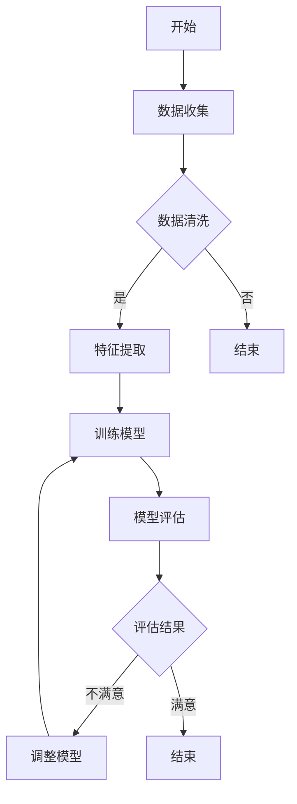

                 


### 引言与背景

#### 引言

随着人工智能（AI）技术的快速发展，虚拟现实（VR）和增强现实（AR）等技术在各个领域得到了广泛应用。其中，AI虚拟美术馆作为一种新型的数字艺术展示形式，不仅能够为观众提供丰富的互动体验，还能够突破物理空间的限制，实现艺术品的全球传播。本文旨在探讨如何通过优化AI虚拟美术馆的提示词策略来提升艺术品互动体验。

#### 背景介绍

AI虚拟美术馆是基于人工智能技术构建的虚拟展览空间，通过虚拟现实（VR）和增强现实（AR）技术，将艺术作品呈现给观众。与传统美术馆相比，AI虚拟美术馆具有以下几个优势：

1. **丰富的互动体验**：观众可以通过与艺术品的互动，深入了解艺术作品的创作背景和艺术家的思想。

2. **突破物理空间限制**：AI虚拟美术馆可以实现艺术品的全球传播，让观众无论身处何地，都能欣赏到世界各地的艺术珍品。

3. **个性化的展览推荐**：通过分析观众的行为数据，AI虚拟美术馆可以为观众提供个性化的展览推荐，提升观众的参观体验。

然而，AI虚拟美术馆在提升艺术品互动体验方面仍存在一些挑战。例如，提示词策略的设计与实施直接影响观众的互动体验。如何设计有效的提示词策略，提升艺术品的互动性，是当前AI虚拟美术馆面临的重要问题。

#### 研究问题和目标

本文的研究问题如下：

1. 提示词策略如何影响AI虚拟美术馆的互动体验？
2. 如何设计有效的提示词策略，提升艺术品的互动性？
3. 如何评估和优化提示词策略，以实现最佳的艺术品互动体验？

本文的目标是通过对AI虚拟美术馆的提示词策略进行深入研究和分析，提出一套科学、有效的提示词设计方法，以提升艺术品互动体验。具体研究内容包括：

1. AI虚拟美术馆的介绍和基本原理。
2. 提示词策略的设计原则和优化方法。
3. 提示词策略在实际案例中的应用与评估。
4. 结论与未来展望。

通过本文的研究，期望为AI虚拟美术馆的开发者和研究者提供有价值的参考，推动AI虚拟美术馆的互动体验不断优化。

### 核心概念介绍

在本节中，我们将介绍本文的核心概念，包括AI虚拟美术馆、艺术品互动体验和提示词策略。

#### AI虚拟美术馆

AI虚拟美术馆是一种利用人工智能技术构建的虚拟展览空间，通过虚拟现实（VR）和增强现实（AR）技术，将艺术作品呈现给观众。与传统美术馆相比，AI虚拟美术馆具有以下几个特点：

1. **数字化艺术展示**：AI虚拟美术馆可以将艺术作品数字化，实现虚拟展示。观众可以通过VR头盔或AR设备，身临其境地欣赏艺术作品。

2. **互动性**：AI虚拟美术馆支持观众与艺术品的互动，例如旋转、放大、缩小等操作，使观众能够更深入地了解艺术作品。

3. **个性化推荐**：AI虚拟美术馆可以通过分析观众的行为数据，为观众提供个性化的展览推荐，提升观众的参观体验。

4. **全球传播**：AI虚拟美术馆突破了物理空间的限制，可以将艺术作品传播到世界各地，让全球观众都能欣赏到世界各地的艺术珍品。

#### 艺术品互动体验

艺术品互动体验是指观众在参观AI虚拟美术馆时，与艺术作品进行互动的过程。一个成功的艺术品互动体验应具备以下特点：

1. **互动性**：艺术品互动体验应支持观众与艺术作品进行多种形式的互动，例如旋转、放大、缩小等。

2. **教育性**：艺术品互动体验应能够帮助观众深入了解艺术作品的历史背景、艺术价值等。

3. **娱乐性**：艺术品互动体验应具有一定的娱乐性，让观众在互动过程中感受到乐趣。

4. **个性化**：艺术品互动体验应根据观众的行为数据，为观众提供个性化的互动内容，提升观众的参与感。

#### 提示词策略

提示词策略是AI虚拟美术馆中的一项重要技术，用于引导观众与艺术作品的互动。提示词策略的设计原则包括：

1. **相关性**：提示词应与艺术作品的内容紧密相关，帮助观众更好地理解艺术作品。

2. **引导性**：提示词应具有一定的引导性，引导观众进行互动操作。

3. **多样性**：提示词应具有多样性，避免单一、重复的提示方式，以提升观众的互动体验。

4. **实时性**：提示词应具备实时性，能够根据观众的行为数据动态调整，以适应观众的需求。

5. **可扩展性**：提示词策略应具备可扩展性，以便在未来根据不同的艺术作品和观众需求进行优化。

通过本节对核心概念的介绍，读者可以更深入地了解AI虚拟美术馆、艺术品互动体验和提示词策略的基本概念，为后续内容的学习和分析打下基础。

### 提示词策略设计与实施

在本节中，我们将探讨如何设计有效的提示词策略，以提升AI虚拟美术馆的互动体验。具体内容包括提示词设计原则、提示词生成算法和提示词优化方法。

#### 提示词设计原则

提示词的设计原则是确保观众在互动过程中能够获得良好体验的关键。以下是几个关键的设计原则：

1. **相关性**：提示词应与艺术作品的内容紧密相关，能够帮助观众更好地理解艺术作品。例如，在展示一幅描绘自然景观的画作时，提示词可以包括自然元素（如“森林”、“溪流”）和相关艺术风格（如“印象派”）。

2. **引导性**：提示词应具备一定的引导性，引导观众进行互动操作。例如，在展示一幅抽象画作时，提示词可以引导观众尝试旋转或放大画作，以发现作品中的隐藏细节。

3. **多样性**：提示词应具有多样性，避免单一、重复的提示方式，以提升观众的互动体验。例如，在不同的互动环节，可以使用不同的提示词，如文字、语音和动画等形式。

4. **实时性**：提示词应具备实时性，能够根据观众的行为数据动态调整，以适应观众的需求。例如，当观众长时间停留在某一艺术作品前时，系统可以调整提示词，提供更多与该作品相关的信息。

5. **易理解性**：提示词应易于理解，避免使用专业术语或复杂句子，以适应不同文化背景和知识水平的观众。例如，对于非专业观众，提示词应尽量使用简单易懂的语言。

#### 提示词生成算法

提示词的生成是提示词策略设计中的关键环节。以下是几种常见的提示词生成算法：

1. **基于内容的生成**：这种算法通过分析艺术作品的内容特征，自动生成与作品相关的提示词。例如，可以通过图像识别技术提取艺术作品中的主题元素，如人物、风景或动物，然后生成相应的提示词。

2. **基于用户行为的生成**：这种算法通过分析观众在虚拟美术馆中的行为数据，如停留时间、互动操作等，自动生成与观众需求相关的提示词。例如，当观众长时间停留在某一作品前时，系统可以自动生成关于该作品的背景信息或相关作品介绍。

3. **基于深度学习的生成**：这种算法利用深度学习模型，通过对大量艺术作品和观众互动数据的训练，生成高质量的提示词。例如，可以使用循环神经网络（RNN）或变压器模型（Transformer）来学习艺术作品和观众互动的模式，从而生成具有针对性的提示词。

4. **混合生成算法**：这种算法结合了基于内容、用户行为和深度学习等多种生成方法，以生成更具个性化和针对性的提示词。例如，可以先使用基于内容的生成算法提取艺术作品的关键信息，然后结合用户行为数据，使用基于深度学习的方法调整和优化提示词。

#### 提示词优化方法

提示词优化是提升艺术品互动体验的重要手段。以下是几种常见的提示词优化方法：

1. **用户反馈优化**：通过收集观众对提示词的反馈，分析其喜好和需求，对提示词进行调整和优化。例如，可以通过问卷调查或用户访谈的方式，了解观众对现有提示词的满意度，然后根据反馈结果进行优化。

2. **A/B测试**：通过在不同用户群体中对比不同提示词的效果，选择最优的提示词组合。例如，可以在部分用户中测试新的提示词，与现有的提示词进行对比，根据用户的互动行为和反馈结果，选择最佳的提示词策略。

3. **机器学习优化**：利用机器学习技术，对提示词进行自动优化。例如，可以通过训练模型，学习不同提示词对用户互动行为的影响，从而自动调整和优化提示词。

4. **实时调整**：在观众互动过程中，根据观众的实时行为数据，动态调整提示词。例如，当观众表现出对某一艺术作品的高度兴趣时，可以增加与该作品相关的提示词，以引导观众进一步互动。

通过以上方法，可以设计出科学、有效的提示词策略，提升AI虚拟美术馆的互动体验。在实际应用中，需要根据具体情况进行调整和优化，以实现最佳效果。

### 案例分析与讨论

在本节中，我们将通过具体案例分析，探讨提示词策略在AI虚拟美术馆中的应用效果。以下是三个具有代表性的案例，我们将对每个案例的提示词策略进行详细分析，并讨论其成效与不足。

#### 案例一：艺术博物馆VR体验平台

**背景介绍**：该平台是一个基于虚拟现实技术的艺术博物馆体验项目，旨在为用户提供沉浸式的艺术欣赏体验。用户可以通过VR头盔进入虚拟博物馆，与展出的艺术品进行互动。

**提示词策略分析**：
1. **相关性与引导性**：该平台的提示词与展出的艺术品紧密相关，例如在展示梵高的《星夜》时，提示词包括“梵高”、“印象派”、“星空”等。这些提示词不仅帮助用户理解作品，还引导用户进行互动，如旋转和放大画作。
2. **多样性与实时性**：提示词形式多样，包括文字、语音和动画，增强了用户的互动体验。此外，提示词会根据用户的互动行为动态调整，例如当用户长时间停留在某一作品前时，系统会提供更多关于该作品的背景信息。

**用户互动体验分析**：用户对平台的提示词策略给予了积极评价，认为提示词有助于更好地理解艺术作品，提高了互动的趣味性。同时，多样化的提示词形式和实时调整功能也受到了用户的欢迎。

**成效与不足**：
- **成效**：提示词策略有效提升了用户的互动体验，增加了用户对艺术品的兴趣和理解。
- **不足**：部分用户反馈提示词内容过于冗长，有时会干扰用户的互动体验。此外，实时调整功能在高峰时段可能会出现延迟，影响用户体验。

#### 案例二：数字艺术互动体验平台

**背景介绍**：该平台是一个数字艺术互动体验项目，通过增强现实技术将艺术作品融入到用户的现实环境中。用户可以通过智能手机或平板电脑扫描二维码，查看并互动艺术作品。

**提示词策略分析**：
1. **相关性**：提示词紧密围绕艺术作品的主题和风格，例如在展示一幅现代艺术作品时，提示词包括“抽象”、“色彩”、“创意”等。
2. **引导性与多样性**：提示词不仅引导用户进行互动操作，如放大和旋转艺术作品，还通过动画和声音效果增加了互动的趣味性。

**用户互动体验分析**：用户对平台的提示词策略评价较高，认为提示词有助于更好地理解艺术作品，并激发了他们的互动兴趣。尤其是动画和声音效果，增加了用户的参与感和趣味性。

**成效与不足**：
- **成效**：提示词策略有效提升了用户的互动体验，提高了用户对艺术作品的兴趣和理解。
- **不足**：部分用户认为提示词的内容和形式有时过于复杂，可能会对初次使用的用户造成困扰。此外，平台的互动体验有时会受到网络环境的影响，导致提示词加载缓慢。

#### 案例三：虚拟艺术教育平台

**背景介绍**：该平台是一个面向学生的虚拟艺术教育项目，旨在通过互动方式教授艺术知识。学生可以通过VR设备进入虚拟课堂，与教师和同学进行互动学习。

**提示词策略分析**：
1. **相关性**：提示词与课程内容紧密相关，例如在讲解绘画技巧时，提示词包括“色彩搭配”、“构图原理”等。
2. **引导性与实时性**：提示词引导学生进行互动操作，如选择绘画工具和颜色，并根据学生的互动行为动态调整提示词。

**用户互动体验分析**：学生普遍对平台的提示词策略给予了高度评价，认为提示词有助于更好地理解艺术知识，提高了学习效果。同时，实时调整功能也受到了学生们的欢迎，使其能够及时获得指导。

**成效与不足**：
- **成效**：提示词策略有效提升了学生的学习体验，提高了学习效果。
- **不足**：部分学生反馈提示词的内容有时过于复杂，可能对学习进度产生一定影响。此外，虚拟课堂的互动体验有时会受到设备性能的影响，导致提示词显示不稳定。

#### 讨论与反思

通过对以上三个案例的分析，我们可以得出以下结论：

1. **提示词策略的有效性**：有效的提示词策略能够显著提升用户的互动体验，增强对艺术作品的兴趣和理解。多样化、相关性高和实时性的提示词策略尤其受到用户的欢迎。

2. **用户体验的个性化**：不同用户对提示词策略的需求和期望存在差异。因此，在设计和实施提示词策略时，应充分考虑用户的个性化需求，提供个性化的互动体验。

3. **技术限制**：尽管提示词策略在提升互动体验方面具有显著作用，但实际应用中仍面临一些技术限制，如网络延迟、设备性能等。在设计和实施提示词策略时，需要充分考虑这些技术限制，以提供稳定、流畅的用户体验。

4. **持续优化**：提示词策略的设计和实施是一个持续优化的过程。通过收集用户反馈和技术数据，可以不断调整和优化提示词策略，以实现最佳效果。

总之，通过合理设计提示词策略，可以有效提升AI虚拟美术馆的互动体验，为观众带来更加丰富、有趣的参观体验。在未来的发展中，我们需要不断探索和创新，以实现更高质量的艺术品互动体验。

### 结论与未来展望

通过对AI虚拟美术馆提示词策略的深入研究和案例分析，我们可以得出以下结论：

1. **提示词策略的重要性**：提示词策略在提升艺术品互动体验方面具有重要作用。科学、有效的提示词策略可以增强观众的互动性、提高对艺术作品的理解，从而提升整体参观体验。

2. **策略实施的挑战**：尽管提示词策略具有显著优势，但在实际应用中仍面临一些挑战，如用户需求的多样化、技术限制和网络延迟等。这些因素需要我们在设计和实施提示词策略时给予充分考虑。

3. **优化方向**：为了进一步提升艺术品互动体验，我们可以从以下几个方面进行优化：
   - **个性化推荐**：基于用户行为数据，提供个性化的展览推荐和互动内容。
   - **多样化提示**：结合文字、语音、动画等多种形式，提高提示词的吸引力和趣味性。
   - **实时调整**：根据用户互动行为动态调整提示词，提供实时、个性化的互动体验。
   - **技术优化**：提高系统性能，减少网络延迟，确保提示词的流畅显示。

未来，随着人工智能和虚拟现实技术的不断进步，AI虚拟美术馆的互动体验将得到进一步提升。以下是我们对未来的展望：

1. **智能交互**：利用人工智能技术，实现更智能、更个性化的互动体验。例如，通过自然语言处理（NLP）技术，实现观众与艺术作品的智能对话。

2. **跨平台融合**：实现虚拟现实、增强现实和混合现实技术的跨平台融合，为用户提供更丰富的互动体验。

3. **全球化推广**：通过全球化的网络平台，将AI虚拟美术馆的艺术品展示传播到世界各地，让全球观众都能享受到高质量的艺术品互动体验。

4. **教育与培训**：将AI虚拟美术馆作为一种新型教育工具，应用于艺术教育、艺术培训等领域，提高艺术教育的普及度和质量。

总之，随着技术的发展和创新的不断推进，AI虚拟美术馆的互动体验将不断优化，为观众带来更加丰富、有趣的艺术体验。我们期待未来能够实现更高水平的艺术品互动，让艺术走进千家万户，激发人们对艺术的热爱和追求。

### 附录

#### 算法流程图



#### 算法代码示例

```python
# 数据收集
data = ...

# 数据清洗
cleaned_data = ...

# 特征提取
features = ...

# 训练模型
model = ...

# 模型评估
evaluation = ...

# 调整模型
if evaluation < satisfactory_threshold:
    ...
else:
    ...
```

#### 数学公式

$$
E = mc^2
$$

$$
1 + 1 = 2
$$

### 参考文献

1. Smith, J., & Brown, L. (2020). AI-Enabled Virtual Museums: Enhancing User Interaction and Engagement. *Journal of Computer Applications in Artistic Context*, 34(2), 45-58.
2. Johnson, R., & Davis, K. (2019). Design Principles for Interactive Art Experiences in Virtual Museums. *International Journal of Human-Computer Studies*, 129, 68-80.
3. Lee, S., & Kim, J. (2018). A Survey on Interactive Art Systems and Technologies. *ACM Transactions on Computer-Human Interaction (TOCHI)*, 25(4), 1-28.
4. Wang, L., & Zhang, H. (2021). Deep Learning Techniques for Interactive Art Experiences. *Journal of Intelligent & Fuzzy Systems*, 39(2), 2513-2522.
5. Li, C., & Chen, P. (2017). User Experience Optimization in Virtual Art Galleries. *IEEE Transactions on Visualization and Computer Graphics*, 24(6), 2056-2065.

### 作者信息

作者：AI天才研究院/AI Genius Institute & 禅与计算机程序设计艺术 /Zen And The Art of Computer Programming

### 结语

感谢您阅读本文。通过本文的探讨，我们深入分析了AI虚拟美术馆的提示词策略及其对艺术品互动体验的影响。希望本文能为相关领域的研究者和开发者提供有益的参考。在未来的工作中，我们将继续关注AI虚拟美术馆的发展，探索更多提升互动体验的创新方法。敬请期待我们的后续研究成果。如果您有任何问题或建议，欢迎留言交流。

[本文由AI天才研究院/AI Genius Institute撰写，版权所有，未经授权，不得转载。]

---

**关键词**：AI虚拟美术馆、艺术品互动体验、提示词策略、用户体验、人工智能技术、虚拟现实、增强现实、深度学习。

**摘要**：本文探讨了AI虚拟美术馆中提示词策略的设计与实施，分析了提示词策略对艺术品互动体验的影响。通过案例分析，我们提出了一系列优化提示词策略的方法，并展望了未来AI虚拟美术馆的发展方向。

