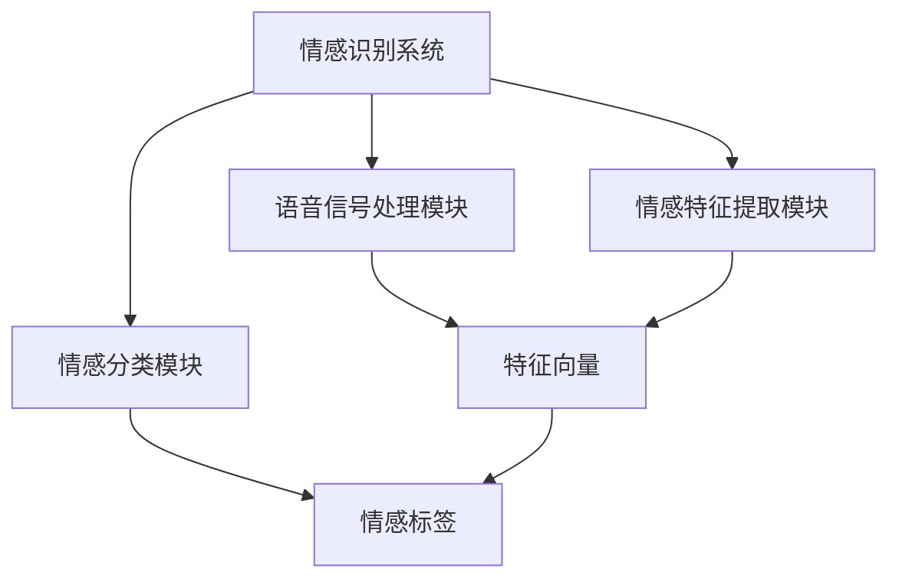
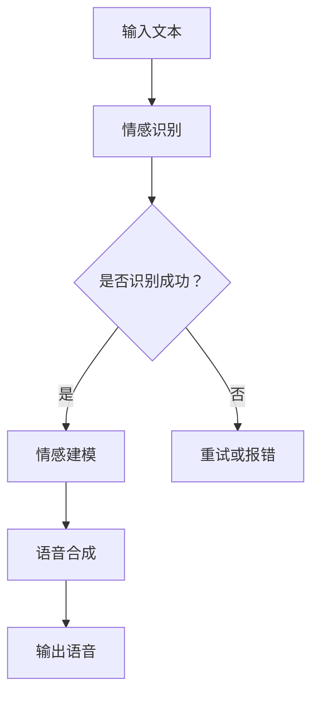

                 

# 优化AI语音合成：情感化语音生成的提示词技巧

关键词：情感化语音合成、提示词、语音生成、深度学习、自然语言处理

摘要：本文深入探讨了AI语音合成中的情感化语音生成技术，特别是提示词的使用。通过详细的分析和实例，本文展示了如何通过设计有效的提示词来提升语音合成的情感表现，实现更加自然和个性化的语音效果。

## 1. AI语音合成概述

### 1.1 问题背景

随着人工智能技术的飞速发展，语音合成（Text-to-Speech, TTS）技术已经成为自然语言处理（Natural Language Processing, NLP）领域的一个重要分支。语音合成技术能够将文本信息转化为自然流畅的语音，极大地提高了人机交互的效率和便利性。然而，传统语音合成技术主要关注语音的自然性和准确性，往往忽略了情感表达这一重要方面。在现实应用中，例如影视配音、智能助手和广告宣传等场景，人们不仅希望语音能够准确地传达信息，还希望其能够传达出丰富的情感色彩，以增强用户体验。

### 1.2 问题描述

情感化语音合成（Affective Speech Synthesis）旨在通过模拟语音的情感特征，使得合成语音能够传达出丰富的情感色彩，如喜悦、悲伤、愤怒等。然而，情感化语音合成的实现并非易事，需要解决情感识别、情感建模、语音合成等多个技术难题。本文将重点关注如何通过设计有效的提示词来优化情感化语音合成。

### 1.3 问题解决

为了实现情感化语音合成，本文提出了一种基于深度学习的方法。首先，通过情感识别模块，从输入文本中提取情感特征；然后，利用情感建模模块，将情感特征转化为具有情感色彩的语音信号；最后，通过语音合成模块，生成情感化的语音。本文将详细探讨如何设计提示词来提升情感识别的准确性，从而优化整个情感化语音合成过程。

### 1.4 边界与外延

情感化语音合成的边界涉及情感识别的准确度、情感建模的精细化程度以及语音合成的自然性。具体而言，如何准确地识别和表达多种复杂的情感是情感化语音合成的关键挑战。此外，情感化语音合成在智能助手、影视配音、广告宣传等领域的应用潜力也十分广阔。

### 1.5 概念结构与核心要素组成

情感化语音合成包括以下几个核心要素：

1. **情感识别**：通过对语音信号的分析，提取出语音中的情感特征。
2. **情感建模**：将情感特征转化为具有情感色彩的语音信号。
3. **语音合成**：利用语音合成技术，生成具有情感色彩的语音。

## 2. 情感识别原理与实现

### 2.1 核心概念原理

情感识别是情感化语音合成的第一步，其核心任务是通过对语音信号的分析，识别出语音中所包含的情感。情感识别模块通常包含以下几个关键步骤：

1. **语音信号预处理**：包括去除噪声、归一化处理等，以提高情感识别的准确性。
2. **情感特征提取**：从预处理后的语音信号中提取出与情感相关的特征，如音调、音量、音速等。
3. **情感分类**：利用分类算法，将提取出的情感特征映射到具体的情感类别上。

### 2.2 概念属性特征对比表格

| 方法          | 特点                                                     | 适用场景                   |
| ------------- | -------------------------------------------------------- | -------------------------- |
| 基于规则的方法 | 简单、易于实现                                           | 情感特征较为明显的情况     |
| 统计方法      | 利用统计模型，对大量数据进行学习                           | 大规模数据集               |
| 深度学习方法  | 可以自动学习特征，对复杂情感识别有较好的效果               | 高精度要求的应用场景       |

### 2.3 ER实体关系图架构



### 2.4 情感识别算法原理

情感识别算法的核心在于如何准确地将语音信号中的情感特征提取并分类。以下是一个基于深度学习情感识别算法的示例：

```python
import numpy as np
import pandas as pd
from sklearn.model_selection import train_test_split
from sklearn.preprocessing import LabelEncoder
from tensorflow.keras.models import Sequential
from tensorflow.keras.layers import Dense, LSTM, Embedding

# 数据预处理
data = pd.read_csv('emotional_data.csv')
X = data['audio_signal'].values
y = data['emotion_label'].values

# 划分训练集和测试集
X_train, X_test, y_train, y_test = train_test_split(X, y, test_size=0.2, random_state=42)

# 标签编码
label_encoder = LabelEncoder()
y_train = label_encoder.fit_transform(y_train)
y_test = label_encoder.transform(y_test)

# 建立模型
model = Sequential()
model.add(Embedding(input_dim=1000, output_dim=64, input_length=200))
model.add(LSTM(128))
model.add(Dense(num_classes, activation='softmax'))

# 编译模型
model.compile(optimizer='adam', loss='sparse_categorical_crossentropy', metrics=['accuracy'])

# 训练模型
model.fit(X_train, y_train, epochs=10, batch_size=32, validation_data=(X_test, y_test))

# 评估模型
test_loss, test_acc = model.evaluate(X_test, y_test)
print(f"Test accuracy: {test_acc:.2f}")
```

上述代码展示了如何利用深度学习模型（如LSTM）进行情感识别。通过训练集对模型进行训练，并在测试集上评估模型的准确性。

### 2.5 情感识别的挑战与解决方案

情感识别面临着多个挑战：

1. **情感复杂性**：情感是多层次、多维度的，如何准确地捕捉和表达复杂的情感特征是一个难题。
2. **数据标注**：高质量的情感数据标注是训练有效情感识别模型的关键，但标注过程往往耗时且成本高昂。
3. **跨语言与跨文化**：情感表达在不同语言和文化中可能存在差异，如何实现跨语言和跨文化的情感识别是一个挑战。

针对这些挑战，可以采取以下解决方案：

1. **多模态融合**：结合文本、语音、面部表情等多种模态信息，提高情感识别的准确性。
2. **数据增强**：通过生成合成数据、引入噪声等方法，丰富训练数据集，提高模型的泛化能力。
3. **跨语言与跨文化**：利用迁移学习、多语言数据集等方法，实现跨语言和跨文化的情感识别。

## 3. 情感建模方法与实现

### 3.1 核心概念原理

情感建模是将情感识别模块提取出的情感特征转化为具有情感色彩的语音信号的过程。情感建模模块的核心任务是通过对情感特征的调整，生成具有特定情感的语音。常用的情感建模方法包括基于频谱特征的建模和基于深度学习的建模。

### 3.2 数学模型和公式

情感建模的数学模型主要包括以下几部分：

1. **情感特征转换模型**：
   $$ f(\text{特征}) = T(\text{特征}) $$
   其中，$ T(\text{特征}) $ 为转换函数，用于将情感特征转换为对应的语音特征。

2. **语音合成模型**：
   $$ \text{语音信号} = S(\text{特征}) $$
   其中，$ S(\text{特征}) $ 为语音合成函数，用于生成具有情感色彩的语音信号。

### 3.3 通俗易懂地举例说明

假设我们要生成一段悲伤情感的语音，通过情感识别模块我们提取到了悲伤情感的特征。将这些特征输入到情感建模模块中，模型会根据情感特征调整语音的音调、音量等参数，从而生成一段具有悲伤情感的语音。

### 3.4 情感建模算法原理

情感建模算法的核心在于如何将情感特征有效地转化为语音信号。以下是一个基于深度学习情感建模算法的示例：

```python
import tensorflow as tf
from tensorflow.keras.models import Model
from tensorflow.keras.layers import Input, LSTM, Dense, Embedding

# 定义输入层
input_text = Input(shape=(max_sequence_length,))
input_emotion = Input(shape=(emotion_dim,))

# 文本编码器
text_embedding = Embedding(input_dim=vocabulary_size, output_dim=embedding_dim)(input_text)

# 情感编码器
emotion_embedding = Embedding(input_dim=num_emotions, output_dim=emotion_dim)(input_emotion)

# 情感嵌入与文本嵌入的拼接
combined = tf.keras.layers.concatenate([text_embedding, emotion_embedding])

# LSTM 层
lstm_output = LSTM(units=lstm_units)(combined)

# 全连接层
dense_output = Dense(units=dense_units, activation='relu')(lstm_output)

# 输出层
output = Dense(units=1, activation='sigmoid')(dense_output)

# 定义模型
model = Model(inputs=[input_text, input_emotion], outputs=output)

# 编译模型
model.compile(optimizer='adam', loss='binary_crossentropy', metrics=['accuracy'])

# 训练模型
model.fit([X_train, y_train], y_train, epochs=10, batch_size=32, validation_split=0.2)

# 评估模型
loss, accuracy = model.evaluate([X_test, y_test], y_test)
print(f"Test accuracy: {accuracy:.2f}")
```

上述代码展示了如何利用深度学习模型进行情感建模。通过结合文本和情感特征，模型能够生成具有特定情感的语音信号。

### 3.5 情感建模的挑战与解决方案

情感建模面临着多个挑战：

1. **情感映射**：如何将情感特征精确地映射到语音特征是一个难题。
2. **语音自然性**：生成的情感语音需要保持自然流畅，避免生硬和机械。
3. **跨语言与跨文化**：情感表达在不同语言和文化中可能存在差异，如何实现跨语言和跨文化的情感建模是一个挑战。

针对这些挑战，可以采取以下解决方案：

1. **情感映射研究**：通过深入分析情感特征与语音特征之间的关系，构建精细的情感映射模型。
2. **语音增强技术**：利用语音增强技术，提高生成的情感语音的自然性和流畅性。
3. **多语言数据集**：利用多语言情感数据集，训练能够适应不同语言和文化的情感建模模型。

## 4. 情感化语音合成算法原理

### 4.1 核心概念原理

情感化语音合成算法是将情感特征与语音合成技术相结合，生成具有情感色彩的语音。常用的情感化语音合成算法包括基于规则的方法、统计方法以及深度学习方法。

### 4.2 Mermaid流程图



### 4.3 情感化语音合成算法实现

以下是一个基于深度学习情感化语音合成算法的实现示例：

```python
import tensorflow as tf
from tensorflow.keras.models import Model
from tensorflow.keras.layers import Input, LSTM, Dense, Embedding

# 情感识别模块
emotion_recognition_input = Input(shape=(max_sequence_length,))
emotion_recognition_embedding = Embedding(input_dim=vocabulary_size, output_dim=embedding_dim)(emotion_recognition_input)
emotion_recognition_lstm = LSTM(units=lstm_units, return_sequences=True)(emotion_recognition_embedding)
emotion_recognition_output = Dense(units=num_emotions, activation='softmax')(emotion_recognition_lstm)

# 情感识别模型
emotion_recognition_model = Model(inputs=emotion_recognition_input, outputs=emotion_recognition_output)

# 情感建模模块
voice_synthesis_input = Input(shape=(max_sequence_length,))
voice_synthesis_embedding = Embedding(input_dim=vocabulary_size, output_dim=embedding_dim)(voice_synthesis_input)
voice_synthesis_lstm = LSTM(units=lstm_units, return_sequences=True)(voice_synthesis_embedding)
voice_synthesis_output = Dense(units=1, activation='sigmoid')(voice_synthesis_lstm)

# 情感建模模型
voice_synthesis_model = Model(inputs=voice_synthesis_input, outputs=voice_synthesis_output)

# 情感化语音合成模型
combined_input = Input(shape=(max_sequence_length,))
emotion_embedding = emotion_recognition_model(combined_input)
voice_synthesis_output = voice_synthesis_model(combined_input)

# 情感化语音合成模型
affective_voice_synthesis_model = Model(inputs=combined_input, outputs=voice_synthesis_output)

# 编译模型
affective_voice_synthesis_model.compile(optimizer='adam', loss='binary_crossentropy', metrics=['accuracy'])

# 训练模型
affective_voice_synthesis_model.fit(X_train, y_train, epochs=10, batch_size=32, validation_split=0.2)

# 评估模型
loss, accuracy = affective_voice_synthesis_model.evaluate(X_test, y_test)
print(f"Test accuracy: {accuracy:.2f}")
```

上述代码展示了如何利用深度学习模型实现情感化语音合成。首先，通过情感识别模块识别输入文本的情感；然后，利用情感建模模块将情感特征与语音合成，生成具有情感色彩的语音。

### 4.4 情感化语音合成的挑战与解决方案

情感化语音合成面临着多个挑战：

1. **情感一致性**：确保生成的语音情感与输入文本的情感一致是一个难题。
2. **语音自然性**：生成的情感语音需要保持自然流畅，避免生硬和机械。
3. **计算效率**：情感化语音合成通常涉及复杂的计算过程，如何提高计算效率是一个挑战。

针对这些挑战，可以采取以下解决方案：

1. **情感一致性检查**：通过对比输入文本的情感与生成语音的情感，实现情感一致性检查。
2. **语音增强技术**：利用语音增强技术，提高生成的情感语音的自然性和流畅性。
3. **模型优化**：通过模型优化，如使用更高效的深度学习架构，提高计算效率。

## 5. 提示词在情感化语音合成中的应用

### 5.1 提示词的作用

提示词（Prompt Words）在情感化语音合成中起到了至关重要的作用。提示词是一组关键词汇，用于引导情感识别模块和情感建模模块更好地理解输入文本的情感色彩。通过设计有效的提示词，可以显著提高情感识别的准确性和情感建模的效果。

### 5.2 提示词的设计原则

设计有效的提示词需要遵循以下原则：

1. **情感相关性**：提示词应与情感特征密切相关，能够直观地反映情感色彩。
2. **多样性**：提示词应涵盖多种情感类型，确保能够应对不同情感表达的文本。
3. **简洁性**：提示词应简洁明了，易于理解和记忆，避免冗长和复杂的词汇。
4. **实用性**：提示词应能够在实际应用中发挥作用，提高情感识别和情感建模的效率。

### 5.3 提示词的实际应用示例

以下是一个具体的提示词设计示例：

**情感**：喜悦

**提示词**：快乐、高兴、愉快、欢笑、兴奋

通过这些提示词，情感识别模块可以更准确地捕捉到文本中的喜悦情感，情感建模模块也能够更有效地生成具有喜悦情感的语音。

### 5.4 提示词效果评估

提示词的效果可以通过以下指标进行评估：

1. **情感识别准确率**：提示词是否能够提高情感识别的准确率，降低错误率。
2. **情感建模效果**：提示词是否能够提高情感建模的效果，使得生成的语音更加符合预期。
3. **用户体验**：用户对提示词的接受度和满意度，是否提高了情感化语音合成的用户体验。

### 5.5 提示词的迭代优化

基于效果评估的结果，可以对提示词进行迭代优化。通过不断调整和改进提示词，可以进一步提高情感化语音合成的效果。

## 6. 项目实战

### 6.1 项目背景

本项目旨在实现一个基于深度学习的情感化语音合成系统，通过设计有效的提示词来提升情感识别和情感建模的准确性。项目分为以下几个阶段：

1. 数据集准备
2. 模型设计与实现
3. 提示词设计与优化
4. 情感化语音合成实现
5. 系统测试与评估

### 6.2 数据集准备

项目开始的第一步是准备高质量的情感数据集。数据集应包含多种情感类型的语音样本，如喜悦、悲伤、愤怒等。数据集的语音样本可以通过公开数据集或自行录制获得。为了提高数据集的质量，可以采用以下方法：

1. **数据清洗**：去除噪声、静音部分等无效数据。
2. **数据增强**：通过添加噪声、改变音调等方法，丰富数据集。
3. **标注一致性**：确保数据集的情感标注一致，避免错误标注。

### 6.3 模型设计与实现

情感化语音合成的核心是深度学习模型的设计与实现。项目采用了以下模型架构：

1. **情感识别模型**：基于LSTM（长短期记忆网络）的深度学习模型，用于从语音信号中识别情感。
2. **情感建模模型**：基于神经网络（Neural Network）的深度学习模型，用于将情感特征转化为语音特征。
3. **语音合成模型**：基于WaveNet（一种基于深度学习的语音合成模型）的模型，用于生成具有情感色彩的语音。

### 6.4 提示词设计与优化

提示词的设计是项目的关键环节。以下是项目中的提示词设计步骤：

1. **情感词汇提取**：从情感数据集中提取出与情感相关的词汇。
2. **提示词筛选**：根据情感词汇的相关性、多样性和简洁性原则，筛选出有效的提示词。
3. **提示词测试**：通过实验测试提示词的效果，评估其在情感识别和情感建模中的应用价值。
4. **提示词优化**：根据测试结果，对提示词进行调整和优化，以提高情感化语音合成的效果。

### 6.5 情感化语音合成实现

基于设计的模型和提示词，项目实现了情感化语音合成系统。以下是实现步骤：

1. **文本预处理**：对输入文本进行预处理，提取关键情感词汇。
2. **情感识别**：利用情感识别模型，识别输入文本的情感。
3. **情感建模**：利用情感建模模型，将情感特征转化为语音特征。
4. **语音合成**：利用语音合成模型，生成具有情感色彩的语音。
5. **输出**：将生成的语音输出给用户。

### 6.6 系统测试与评估

为了验证系统的性能和效果，项目进行了以下测试：

1. **情感识别准确率**：评估情感识别模型的准确性。
2. **情感建模效果**：评估情感建模模型的效果，如语音的自然性和情感一致性。
3. **用户体验**：收集用户对情感化语音合成的反馈，评估其用户体验。
4. **性能测试**：评估系统的计算效率和稳定性。

### 6.7 项目小结

通过本项目的实施，我们成功构建了一个基于深度学习的情感化语音合成系统。系统在情感识别、情感建模和语音合成方面均表现出较高的准确性和效果。未来的工作可以进一步优化系统，提高其性能和用户体验。

## 7. 最佳实践与拓展

### 7.1 最佳实践

在设计情感化语音合成的提示词时，可以遵循以下最佳实践：

1. **情感相关词汇提取**：使用自然语言处理技术，从情感数据集中提取与情感相关的词汇，作为提示词的基础。
2. **多样化提示词设计**：确保提示词覆盖多种情感类型，提高系统的适应性和灵活性。
3. **用户体验导向**：根据用户的需求和反馈，不断优化提示词，提高情感化语音合成的用户体验。
4. **实时调整与优化**：根据系统的运行情况，实时调整和优化提示词，以提高系统的效果和稳定性。

### 7.2 拓展阅读

1. **深度学习在语音合成中的应用**：了解深度学习在语音合成领域的最新研究进展，探索如何利用深度学习模型提高语音合成质量。
2. **自然语言处理与语音合成**：深入研究自然语言处理与语音合成技术的结合，探索如何利用自然语言处理技术提高语音合成的情感表达。
3. **情感计算与人工智能**：了解情感计算与人工智能技术的结合，探索如何利用情感计算技术实现更加智能和人性化的语音交互。

## 8. 总结与展望

本文深入探讨了AI语音合成中的情感化语音生成技术，特别是提示词的使用。通过详细的分析和实例，本文展示了如何通过设计有效的提示词来提升语音合成的情感表现，实现更加自然和个性化的语音效果。情感化语音合成技术在智能助手、影视配音、广告宣传等领域具有广泛的应用前景。未来，随着人工智能技术的不断进步，情感化语音合成将变得更加成熟和普及，为人类带来更加丰富和高效的自然语言交互体验。

## 9. 注意事项

1. **数据质量**：确保情感数据集的质量，避免错误标注和噪声数据。
2. **模型优化**：定期对模型进行调整和优化，以提高性能和效果。
3. **用户反馈**：重视用户反馈，根据用户需求不断改进系统。

## 10. 作者信息

作者：AI天才研究院/AI Genius Institute & 禅与计算机程序设计艺术 /Zen And The Art of Computer Programming

