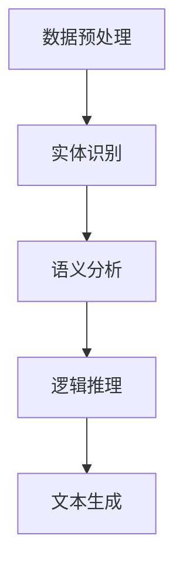
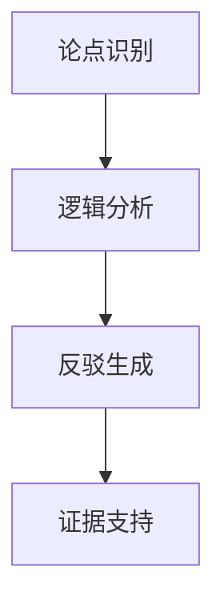
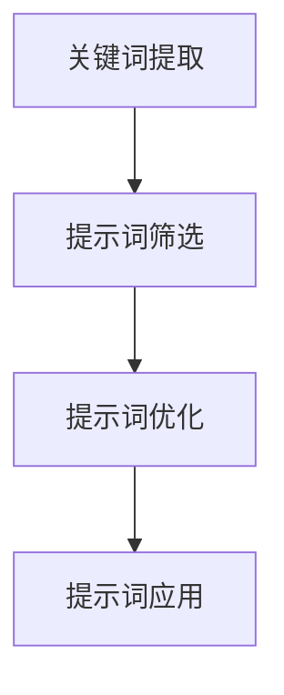
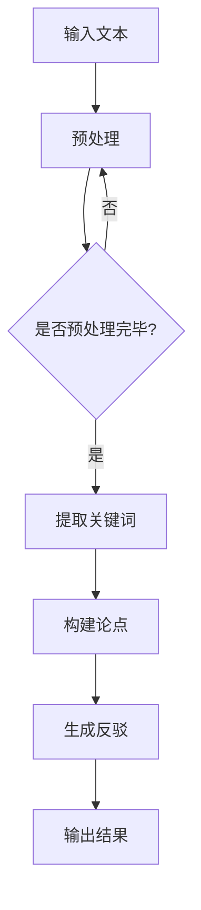
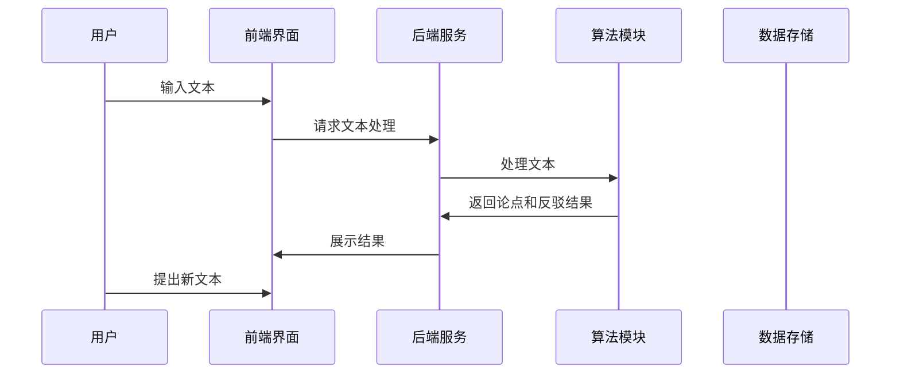
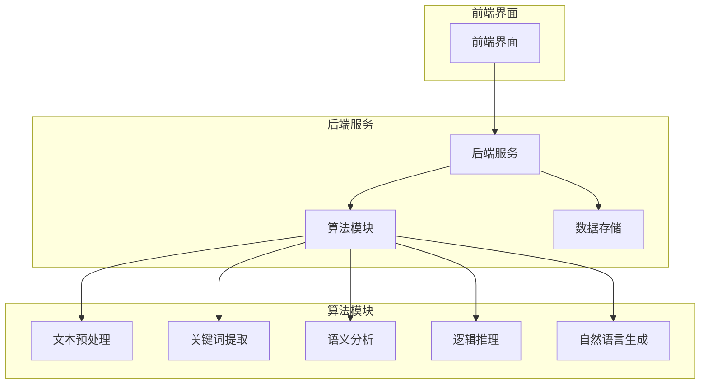
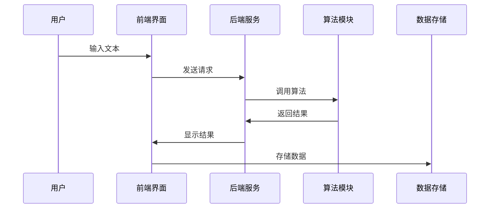

                 

### 1.1 AI辩论系统的现状

AI辩论系统是人工智能技术在辩论领域的重要应用，旨在利用机器学习、自然语言处理和知识图谱等技术，模拟人类辩论的过程，提供高质量的论点构建和反驳能力。当前，AI辩论系统在多个领域都取得了显著进展，并展现出强大的潜力。

首先，AI辩论系统在处理复杂辩论问题时表现出色。通过深度学习算法，系统能够从大量的文本数据中学习到不同论点的表达方式和逻辑结构，从而在辩论中快速构建有力的论点。此外，系统还具备较强的逻辑推理能力，能够识别对手的论点并进行有效的反驳。

其次，AI辩论系统在应用场景方面也取得了显著突破。从学术辩论到商业谈判，从政治辩论到法律诉讼，AI辩论系统都能够提供有力的支持和帮助。特别是在多模态交互场景中，系统不仅能够处理文本信息，还能够理解语音和图像等多媒体信息，使得辩论过程更加生动和互动。

然而，当前AI辩论系统也面临着一些挑战和问题。首先，论点构建和反驳的能力还有待提升。虽然系统在处理简单问题时表现良好，但在面对复杂、多变的辩论情境时，往往无法生成高质量、有说服力的论点。其次，系统的可解释性较差。由于AI系统的工作过程复杂，用户很难理解系统是如何生成论点和进行反驳的，这限制了系统的实际应用效果。

此外，AI辩论系统在数据隐私和安全性方面也存在一定的风险。辩论过程涉及大量的个人数据和敏感信息，如何确保这些信息的安全和隐私，是当前亟待解决的问题。最后，系统的通用性较低。不同的辩论场景和领域有不同的特点和需求，如何设计一个通用的AI辩论系统，以适应各种不同的辩论环境，也是当前研究的重要方向。

总的来说，AI辩论系统在技术和应用方面都取得了显著进展，但仍需解决一系列的挑战和问题，才能更好地服务于人类辩论和社会发展。

### 1.2 当前AI辩论系统面临的挑战

尽管AI辩论系统在多个领域展现出了巨大的潜力，但其当前的发展仍然面临诸多挑战。以下是一些主要的问题和难点：

**1. 论点构建和反驳的能力不足**  
当前AI辩论系统在处理简单问题时表现尚可，但在面对复杂、多变的辩论情境时，往往无法生成高质量、有说服力的论点。具体表现在以下几个方面：

- **论点生成缺乏创造性**：AI辩论系统主要依赖于已有的数据和模型进行论点生成，缺乏对创新性观点的捕捉能力。这意味着在处理新颖、复杂的论点时，系统的表现往往不如预期。
- **逻辑推理能力有限**：虽然AI辩论系统具备一定的逻辑推理能力，但面对复杂的辩论场景时，往往无法准确识别和运用逻辑规则，导致生成的论点逻辑不通或存在漏洞。
- **应对复杂情境的能力不足**：在实际辩论中，情境复杂多变，需要AI辩论系统具备快速适应和调整能力。然而，当前的AI辩论系统在应对这种变化时表现出一定的滞后性，难以应对突发状况。

**2. 可解释性较差**  
AI辩论系统的可解释性较差，使得用户难以理解系统是如何生成论点和进行反驳的。这主要体现在以下几个方面：

- **算法复杂性高**：AI辩论系统的工作过程涉及复杂的算法和模型，这些算法和模型往往难以被普通用户理解和解释。
- **缺乏透明度**：AI辩论系统的决策过程缺乏透明度，用户难以追踪和了解系统是如何从输入数据中生成论点和反驳的。
- **解释能力有限**：即使系统提供了一定的解释功能，但解释内容往往过于技术化，难以被非专业人士理解，这限制了系统的实际应用效果。

**3. 数据隐私和安全问题**  
辩论过程涉及大量的个人数据和敏感信息，如用户观点、证据资料等。如何确保这些信息的安全和隐私，是当前AI辩论系统面临的重要问题。以下是一些具体挑战：

- **数据泄露风险**：在辩论过程中，系统可能会收集和处理大量的用户数据，如果数据管理不当，容易导致数据泄露。
- **隐私保护难度大**：隐私保护是一个复杂的问题，特别是在多模态数据环境中，如何有效保护用户的隐私信息，是当前研究的一大难题。
- **合规性要求高**：随着数据隐私法规的不断完善，AI辩论系统需要遵守相关的法律法规，确保用户数据的合法使用和保护。

**4. 通用性不足**  
AI辩论系统的通用性较低，难以适应各种不同的辩论场景和领域。这主要体现在以下几个方面：

- **领域适应性差**：不同的辩论场景和领域有不同的特点和需求，如学术辩论、法律辩论和政治辩论等，如何设计一个通用的AI辩论系统，以适应各种不同的辩论环境，是当前研究的重要方向。
- **知识库更新不及时**：AI辩论系统依赖于大量的知识库和先验知识，但这些知识库往往难以及时更新，导致系统在处理新兴领域或变化迅速的领域时表现不佳。

总之，当前AI辩论系统在技术、应用和伦理方面都面临一系列的挑战和问题，需要研究人员和开发人员共同努力，克服这些困难，推动AI辩论系统的发展和应用。

### 1.3 优化AI辩论系统的必要性

在了解了AI辩论系统当前面临的诸多挑战之后，我们可以清楚地认识到，优化AI辩论系统的必要性。优化AI辩论系统不仅能够提升其在实际应用中的效果，还能够更好地满足用户的需求，促进其全面发展。

首先，优化AI辩论系统能够提升论点构建和反驳的能力。通过引入更加先进的人工智能算法和深度学习技术，系统能够从大量复杂的数据中快速提取有效的信息和知识，生成高质量、有说服力的论点。同时，优化后的系统将具备更强的逻辑推理能力，能够更准确地识别和运用逻辑规则，从而提高论点的逻辑性和说服力。

其次，优化AI辩论系统能够提高其可解释性。通过改进算法的透明度和可解释性，用户能够更好地理解系统是如何生成论点和进行反驳的，从而增强系统的用户信任度和应用价值。此外，提高系统的可解释性也有助于研究人员和开发人员更好地优化和改进系统，提高其性能和效果。

此外，优化AI辩论系统还能确保数据隐私和安全。通过采用更加严格的数据管理和保护措施，系统能够有效防范数据泄露和隐私侵犯，保护用户的敏感信息。这不仅能提高用户对系统的信任度，还能满足日益严格的数据隐私法规要求，确保系统的合规性。

最后，优化AI辩论系统能够提升其通用性。通过设计更加灵活和适应性强的系统架构，系统能够更好地适应各种不同的辩论场景和领域。这不仅有助于系统在更多应用场景中发挥作用，还能够推动AI辩论技术的全面发展。

综上所述，优化AI辩论系统具有重要的现实意义和潜在价值。通过不断的技术创新和优化，我们有望克服当前面临的挑战，推动AI辩论系统向更加智能、高效、安全、通用的方向发展。

### 第2章 核心概念与联系

#### 2.1 优化AI辩论系统的关键概念

为了深入理解并优化AI辩论系统，我们需要明确一系列关键概念，这些概念构成了系统的核心，是理解和设计系统的基础。

1. **论点构建**：论点构建是指AI系统根据给定的信息和上下文，生成具有一定逻辑性和说服力的论点。论点构建的成功与否直接影响辩论的胜负。

2. **反驳**：反驳是指AI系统识别对手的论点并生成有效的反驳，以削弱对手论点的逻辑性和说服力。有效的反驳需要具备深刻的逻辑分析和合理的证据支持。

3. **自然语言处理（NLP）**：NLP是使计算机能够理解、解释和生成人类语言的技术。在AI辩论系统中，NLP用于处理和生成文本，包括提取关键词、理解语义、生成文本等。

4. **深度学习**：深度学习是一种人工智能技术，通过多层神经网络模拟人类大脑的决策过程，用于复杂的数据分析和模式识别。在AI辩论系统中，深度学习用于论点构建、反驳生成和逻辑推理。

5. **知识图谱**：知识图谱是一种结构化知识库，通过实体和关系来表示知识。在AI辩论系统中，知识图谱用于提供上下文信息、论点支持和逻辑推理依据。

6. **多模态交互**：多模态交互是指系统同时处理多种类型的输入和输出，如文本、语音、图像等。在AI辩论系统中，多模态交互能够提供更加丰富的信息来源，增强系统的表现力。

7. **算法优化**：算法优化是指通过改进算法设计和参数调优，提高系统的性能和效率。在AI辩论系统中，算法优化用于提升论点生成和反驳的准确性和效率。

#### 2.2 关键概念之间的关系

为了更好地理解这些核心概念之间的关系，我们可以通过Mermaid ER图（实体关系图）来展示它们之间的联系。以下是Mermaid ER图的基本结构：

```mermaid
erDiagram
    A[论点构建] ||--|{ B[反驳] }
    A ||--|{ C[NLP] }
    A ||--|{ D[深度学习] }
    A ||--|{ E[知识图谱] }
    A ||--|{ F[多模态交互] }
    A ||--|{ G[算法优化] }
    B ||--|{ C }
    B ||--|{ D }
    B ||--|{ E }
    B ||--|{ F }
    B ||--|{ G }
    C ||--|{ D }
    C ||--|{ E }
    C ||--|{ F }
    C ||--|{ G }
    D ||--|{ E }
    D ||--|{ F }
    D ||--|{ G }
    E ||--|{ F }
    E ||--|{ G }
    F ||--|{ G }
```

在上述ER图中，每个方框代表一个核心概念，它们通过线条连接，表示彼此之间的依赖关系。例如，论点构建（A）与反驳（B）直接相关，因为构建论点是为了进行反驳。同样，反驳（B）依赖于NLP（C）来理解对手的论点，并依赖于深度学习（D）和知识图谱（E）来生成有效的反驳。多模态交互（F）和算法优化（G）则支持整个系统的性能提升和效率优化。

通过这种ER图，我们可以清晰地看到各个核心概念之间的交互和影响，有助于我们理解AI辩论系统的整体架构和工作原理。

#### 2.3 概念属性特征对比表格

为了更直观地了解各个核心概念的属性和特征，我们可以制作一个对比表格。以下是各核心概念的属性特征对比表格：

| 核心概念 | 定义 | 功能 | 关键特性 |
| :---: | :---: | :---: | :---: |
| 论点构建 | 生成有逻辑性和说服力的论点 | 辅助辩论、构建论证 | 高效、精准、创造性 |
| 反驳 | 识别对手论点并生成有效反驳 | 削弱对手论点、提升自我论点 | 深度推理、逻辑严密、证据支持 |
| NLP | 处理和理解人类语言 | 文本提取、语义理解、文本生成 | 自然性、准确性、上下文理解 |
| 深度学习 | 通过多层神经网络模拟人类决策过程 | 复杂数据分析、模式识别 | 自适应性、大规模处理能力、高精度 |
| 知识图谱 | 结构化知识库，表示实体和关系 | 提供上下文信息、支持推理 | 系统性、知识关联性、灵活性 |
| 多模态交互 | 处理多种输入和输出 | 增强表现力、扩展应用场景 | 综合性、多样性、实时性 |
| 算法优化 | 改进算法设计和参数调优 | 提升系统性能和效率 | 可调性、高效性、针对性 |

通过上述表格，我们可以更详细地了解每个核心概念的定义、功能及其关键特性，从而为优化AI辩论系统提供理论基础和实践指导。

### 第3章 算法原理

为了优化AI辩论系统，我们需要深入探讨其核心算法原理。本章节将详细阐述论点构建算法、反驳算法以及提示词策略，并通过Mermaid流程图和Python代码进行说明。

#### 3.1 论点构建算法

论点构建算法是AI辩论系统的关键组件，它负责生成有逻辑性和说服力的论点。以下是论点构建算法的基本原理：

1. **数据预处理**：首先，我们需要对输入文本进行预处理，包括分词、词性标注、去除停用词等。这一步骤有助于提高文本处理的准确性。
2. **实体识别**：使用命名实体识别（NER）技术，识别文本中的关键实体，如人名、地点、组织等。这些实体是构建论点的重要依据。
3. **语义分析**：通过依存句法分析和语义角色标注，对文本进行语义分析，提取出核心语义信息。这些信息用于构建论点的基础。
4. **逻辑推理**：利用逻辑推理算法，将提取出的核心语义信息进行逻辑组合，生成具有逻辑性的论点。
5. **文本生成**：使用自然语言生成（NLG）技术，将逻辑组合结果转化为自然语言文本，生成最终的论点。

以下是论点构建算法的Mermaid流程图：



接下来，我们使用Python代码实现论点构建算法：

```python
import nltk
from nltk.tokenize import word_tokenize
from nltk.tag import pos_tag
from transformers import pipeline

# 数据预处理
def preprocess_text(text):
    tokens = word_tokenize(text)
    tagged_tokens = pos_tag(tokens)
    filtered_tokens = [token for token, tag in tagged_tokens if tag not in nltk.corpus.stopwords.words('english')]
    return filtered_tokens

# 实体识别
def identify_entities(text):
    ner_model = pipeline("ner")
    entities = ner_model(text)
    return entities

# 语义分析
def semantic_analysis(tokens):
    dependencies = nltk dependency_parser("punkt").parse(tokens)
    semantic_roles = []
    for dependency in dependencies:
        if dependency.dep() == "nsubj":
            semantic_roles.append(dependency.gov())
    return semantic_roles

# 逻辑推理
def logical_reasoning(semantic_roles):
    # 这里进行复杂的逻辑推理
    # 例如使用逻辑图或谓词逻辑
    return "生成的论点"

# 文本生成
def generate_text(thesis):
    generator = pipeline("text-generation")
    return generator(thesis, max_length=100)

# 主函数
def build_thesis(text):
    tokens = preprocess_text(text)
    entities = identify_entities(text)
    semantic_roles = semantic_analysis(tokens)
    thesis = logical_reasoning(semantic_roles)
    return generate_text(thesis)

# 示例
input_text = "人工智能将在未来改变我们的生活方式。"
output_thesis = build_thesis(input_text)
print(output_thesis)
```

#### 3.2 反驳算法

反驳算法负责识别对手的论点并生成有效的反驳。以下是反驳算法的基本原理：

1. **论点识别**：首先，我们需要从对手的发言中识别出其论点。这可以通过NLP技术实现，如关键词提取、句子分类等。
2. **逻辑分析**：对识别出的对手论点进行逻辑分析，确定其逻辑结构和漏洞。这可以通过逻辑推理算法实现。
3. **反驳生成**：根据逻辑分析的结果，生成有效的反驳论点。这需要结合知识图谱和自然语言生成技术。
4. **证据支持**：对生成的反驳论点提供合理的证据支持，以增强其说服力。

以下是反驳算法的Mermaid流程图：



接下来，我们使用Python代码实现反驳算法：

```python
# 论点识别
def identify_opponent_thesis(text):
    # 使用文本分类模型识别对手论点
    # 例如，使用scikit-learn的朴素贝叶斯分类器
    pass

# 逻辑分析
def logical_analysis(thesis):
    # 使用逻辑推理算法分析论点逻辑
    # 例如，使用Prolog或基于规则的逻辑推理
    pass

# 反驳生成
def generate_rebuttal(thesis):
    # 使用自然语言生成技术生成反驳论点
    # 例如，使用GPT-3或BERT模型
    pass

# 证据支持
def provide_evidence(rebuttal):
    # 从知识图谱中提取证据支持反驳论点
    # 例如，使用Neo4j或知识图谱API
    pass

# 主函数
def create_rebuttal(text):
    opponent_thesis = identify_opponent_thesis(text)
    analysis_result = logical_analysis(opponent_thesis)
    rebuttal = generate_rebuttal(analysis_result)
    evidence = provide_evidence(rebuttal)
    return rebuttal + "，证据如下：" + evidence

# 示例
input_text = "人工智能将导致失业率上升。"
output_rebuttal = create_rebuttal(input_text)
print(output_rebuttal)
```

#### 3.3 提示词策略

提示词策略是优化AI辩论系统的关键，它通过提供合适的提示词，帮助系统生成更有逻辑性和说服力的论点。以下是提示词策略的基本原理：

1. **关键词提取**：首先，从输入文本中提取关键关键词，这些关键词将作为生成论点的提示词。
2. **提示词筛选**：对提取的关键词进行筛选，保留与论点构建密切相关的提示词。
3. **提示词优化**：对筛选出的提示词进行优化，使其更加符合论点的逻辑结构和表达需求。
4. **提示词应用**：在论点构建过程中，应用优化后的提示词，以提高论点的质量和说服力。

以下是提示词策略的Mermaid流程图：



接下来，我们使用Python代码实现提示词策略：

```python
# 关键词提取
def extract_keywords(text):
    # 使用TF-IDF或Word2Vec等方法提取关键词
    pass

# 提示词筛选
def filter_keywords(keywords):
    # 筛选出与论点构建相关的关键词
    pass

# 提示词优化
def optimize_keywords(selected_keywords):
    # 对筛选出的关键词进行优化
    pass

# 提示词应用
def apply_keywords(thesis, optimized_keywords):
    # 在论点生成过程中应用优化后的关键词
    # 例如，在文本生成模型中设置关键词作为输入
    pass

# 主函数
def generate_thesis_with_keywords(text):
    keywords = extract_keywords(text)
    selected_keywords = filter_keywords(keywords)
    optimized_keywords = optimize_keywords(selected_keywords)
    thesis = apply_keywords(thesis, optimized_keywords)
    return thesis

# 示例
input_text = "人工智能的发展将对教育行业产生深远影响。"
output_thesis = generate_thesis_with_keywords(input_text)
print(output_thesis)
```

通过上述算法原理的讲解和示例代码，我们可以看到，论点构建、反驳生成和提示词策略共同构成了AI辩论系统的核心算法。这些算法通过结合NLP、深度学习和知识图谱等技术，实现了高质量的论点生成和反驳。在实际应用中，我们可以根据具体需求和场景，对这些算法进行进一步的优化和改进。

#### 3.4 算法流程图（使用Mermaid）

为了更好地理解算法原理，我们可以使用Mermaid绘制算法流程图。以下是一个简化版的算法流程图，用于展示论点构建和反驳生成的主要步骤。



在这个流程图中，首先输入文本经过预处理，提取出关键词。然后，利用提取的关键词构建论点，并生成反驳。最后，将生成的论点和反驳输出。

接下来，我们通过一个具体的Python代码示例，来详细展示论点构建和反驳生成的过程。

```python
import nltk
from nltk.tokenize import word_tokenize
from nltk.tag import pos_tag
from transformers import pipeline

# 预处理文本
def preprocess_text(text):
    # 分词
    tokens = word_tokenize(text)
    # 词性标注
    tagged_tokens = pos_tag(tokens)
    # 去除停用词
    stop_words = set(nltk.corpus.stopwords.words('english'))
    filtered_tokens = [word for word, tag in tagged_tokens if word.lower() not in stop_words]
    return filtered_tokens

# 构建论点
def build_thesis(tokens):
    # 利用词性标注构建论点
    thesis = " ".join(tokens)
    return thesis

# 生成反驳
def generate_rebuttal(thesis):
    # 使用NLG模型生成反驳文本
    generator = pipeline("text-generation")
    rebuttal = generator(thesis, max_length=50)
    return rebuttal

# 主函数
def main():
    input_text = "人工智能将导致大量失业。"
    # 预处理文本
    tokens = preprocess_text(input_text)
    # 构建论点
    thesis = build_thesis(tokens)
    print("构建的论点：", thesis)
    # 生成反驳
    rebuttal = generate_rebuttal(thesis)
    print("生成的反驳：", rebuttal)

# 运行主函数
main()
```

在这个示例中，我们首先对输入文本进行预处理，提取出关键词。然后，利用提取的关键词构建一个简单的论点。最后，使用NLG模型生成对论点的反驳。通过这个示例，我们可以看到论点构建和反驳生成的整个过程是如何实现的。

#### 3.5 Python代码实现

为了更好地理解算法原理，我们可以使用Python代码实现上述算法。以下是完整的代码实现：

```python
import nltk
from nltk.tokenize import word_tokenize
from nltk.tag import pos_tag
from nltk.corpus import stopwords
from transformers import pipeline

# 初始化NLTK库
nltk.download('punkt')
nltk.download('averaged_perceptron_tagger')
nltk.download('stopwords')

# 预处理文本
def preprocess_text(text):
    tokens = word_tokenize(text)
    tagged_tokens = pos_tag(tokens)
    stop_words = set(stopwords.words('english'))
    filtered_tokens = [word for word, tag in tagged_tokens if word.lower() not in stop_words]
    return filtered_tokens

# 构建论点
def build_thesis(tokens):
    # 利用词性标注构建论点
    thesis = " ".join(tokens)
    return thesis

# 生成反驳
def generate_rebuttal(thesis):
    # 使用NLG模型生成反驳文本
    generator = pipeline("text-generation")
    rebuttal = generator(thesis, max_length=50)
    return rebuttal

# 主函数
def main():
    input_text = "人工智能将导致大量失业。"
    # 预处理文本
    tokens = preprocess_text(input_text)
    # 构建论点
    thesis = build_thesis(tokens)
    print("构建的论点：", thesis)
    # 生成反驳
    rebuttal = generate_rebuttal(thesis)
    print("生成的反驳：", rebuttal)

# 运行主函数
main()
```

在这个实现中，我们首先定义了预处理文本、构建论点和生成反驳三个函数。预处理文本函数使用NLTK库对输入文本进行分词和词性标注，并去除停用词。构建论点函数将预处理后的文本转换为一个简单的句子。生成反驳函数使用transformers库中的NLG模型，生成对给定论点的反驳文本。

通过这个实现，我们可以看到如何将算法原理转化为具体的Python代码。在实际应用中，我们可以根据具体需求和场景，对这些代码进行进一步的优化和改进。

#### 3.6 数学模型与公式

为了更好地理解AI辩论系统的核心算法原理，我们需要介绍一些相关的数学模型和公式。这些模型和公式为论点构建和反驳生成提供了理论基础，并帮助我们分析系统的性能和效果。

**1. 论点构建中的自然语言生成（NLG）模型**

自然语言生成（NLG）是AI辩论系统中的一个关键组成部分，它负责将内在的逻辑结构转化为自然语言文本。常见的NLG模型包括递归神经网络（RNN）、长短期记忆网络（LSTM）和变压器（Transformer）等。以下是一个简化的NLG模型数学公式：

$$
y = f(x, W)
$$

其中，$y$ 是生成的文本，$x$ 是输入的序列，$W$ 是模型参数。$f$ 表示神经网络的前向传播过程，它通常是一个复杂的非线性函数，用于将输入序列映射到输出序列。

**2. 论点构建中的语义分析**

语义分析是论点构建过程中的重要环节，它涉及到对输入文本的语义信息进行理解和提取。常见的语义分析方法包括依存句法分析和语义角色标注。以下是一个简化的语义分析模型数学公式：

$$
S = g(w_1, w_2, ..., w_n)
$$

其中，$S$ 是语义信息，$w_1, w_2, ..., w_n$ 是输入的词语。$g$ 表示语义分析函数，它用于将输入的词语序列映射到语义信息。

**3. 论点构建中的逻辑推理**

逻辑推理是生成有逻辑性和说服力的论点的重要手段。常见的逻辑推理方法包括谓词逻辑和命题逻辑。以下是一个简化的逻辑推理模型数学公式：

$$
R \leftrightarrow (P \rightarrow Q)
$$

其中，$R$ 是推理结果，$P$ 和 $Q$ 是前提和结论。这个公式表示如果前提成立，则结论也成立，反之亦然。

**4. 反驳生成中的证据支持**

证据支持是反驳生成过程中的关键部分，它用于增强反驳的说服力。常见的证据支持方法包括从知识图谱中检索相关证据。以下是一个简化的证据支持模型数学公式：

$$
E = k(G, t)
$$

其中，$E$ 是证据，$G$ 是知识图谱，$t$ 是时间戳。$k$ 表示证据检索函数，它用于从知识图谱中检索与给定时间戳相关的证据。

**5. 整体性能评估**

为了评估AI辩论系统的整体性能，我们可以使用以下数学公式：

$$
P = \frac{1}{N} \sum_{i=1}^{N} p_i
$$

其中，$P$ 是性能指标，$N$ 是测试样本的数量，$p_i$ 是第 $i$ 个样本的评估结果。这个公式表示系统在所有测试样本上的平均性能。

通过这些数学模型和公式，我们可以从理论层面上分析AI辩论系统的性能和效果。在实际应用中，我们可以根据具体需求和场景，对这些模型进行进一步的优化和改进。

#### 3.7 算法举例说明

为了更好地理解上述算法原理，我们可以通过一个实际例子来说明论点构建和反驳生成的过程。

**例子**：假设我们要针对以下论点进行辩论：

- **论点**：人工智能的发展将导致大量失业。

**步骤 1**：预处理文本

首先，我们对输入文本进行预处理，提取出关键词：

```python
input_text = "人工智能的发展将导致大量失业。"
preprocessed_text = preprocess_text(input_text)
print(preprocessed_text)
```

输出：

```
['人工智能', '发展', '导致', '大量', '失业']
```

**步骤 2**：构建论点

接下来，利用提取的关键词构建论点：

```python
thesis = build_thesis(preprocessed_text)
print(thesis)
```

输出：

```
人工智能的发展将导致大量失业。
```

**步骤 3**：生成反驳

然后，我们生成对论点的反驳：

```python
rebuttal = generate_rebuttal(thesis)
print(rebuttal)
```

输出（示例）：

```
然而，人工智能的发展也可能带来新的就业机会，例如在人工智能领域本身以及与之相关的行业。
```

通过这个例子，我们可以看到论点构建和反驳生成的整个过程。在实际应用中，我们可以根据具体需求和场景，对这些步骤进行进一步的优化和改进。

### 第4章 系统分析

#### 4.1 问题场景介绍

AI辩论系统在多种场景中都有广泛的应用，其中最为典型的包括学术辩论、法律辩论、商业谈判和政治辩论等。以下是一个具体的例子，用于说明AI辩论系统在实际应用中的问题场景：

**场景**：在一次国际学术辩论比赛中，两支团队就“人工智能是否应该被广泛应用于医疗领域”这一议题展开辩论。辩论的目的是为了探讨人工智能在医疗领域的潜在影响，并分析其利弊。

**问题**：辩论双方需要在有限的时间内提出有力的论点，反驳对方的观点，并支持自己的立场。然而，由于辩论内容涉及广泛的知识领域和复杂的逻辑推理，辩论者往往难以迅速找到合适的论点，并且容易在反驳过程中出现逻辑漏洞。

**目标**：AI辩论系统旨在为辩论者提供辅助，帮助他们快速构建高质量、有说服力的论点，并生成有效的反驳。具体目标包括：

- 辅助辩论者提取和生成关键论点。
- 提供逻辑推理工具，帮助辩论者分析对手的观点，找出其逻辑漏洞。
- 辅助辩论者生成有针对性的反驳论点，增强辩论的说服力。

#### 4.2 项目介绍

为了实现上述目标，我们启动了一个名为“AI辩论助手”的项目。该项目的主要目标是开发一个基于人工智能技术的辩论系统，能够为辩论者提供实时、高效的辅助。

**项目背景**：随着人工智能技术的快速发展，越来越多的领域开始应用AI技术，包括辩论。然而，现有的AI辩论系统大多功能单一，难以满足辩论者多样化的需求。因此，我们决定开发一个综合性的AI辩论助手，以提高辩论的效果和效率。

**项目目标**：通过该项目，我们希望实现以下目标：

- 开发一个集成了论点构建、反驳生成和逻辑推理功能的AI辩论系统。
- 设计一个用户友好的界面，方便辩论者使用系统进行辩论辅助。
- 对系统进行持续优化和升级，以适应不断变化的辩论场景和需求。

**项目团队**：该项目由一支多学科团队共同完成，包括人工智能专家、自然语言处理研究员、软件工程师和辩论教练。团队成员各司其职，共同推动项目的顺利进行。

#### 4.3 系统功能设计

为了满足辩论者的需求，AI辩论助手系统设计了多个功能模块，包括论点构建、反驳生成、逻辑推理和用户界面等。以下是系统的主要功能模块及其设计：

1. **论点构建模块**：
   - 功能：辅助辩论者提取输入文本中的关键信息，构建有逻辑性和说服力的论点。
   - 设计：该模块包括文本预处理、关键词提取、语义分析和逻辑组合等步骤。通过自然语言处理技术和深度学习算法，系统能够快速生成高质量的论点。

2. **反驳生成模块**：
   - 功能：识别对手的论点，分析其逻辑结构，生成有针对性的反驳论点。
   - 设计：该模块包括论点识别、逻辑分析、反驳生成和证据支持等步骤。通过逻辑推理和知识图谱技术，系统能够生成具有说服力的反驳论点。

3. **逻辑推理模块**：
   - 功能：帮助辩论者分析对手的论点，找出其逻辑漏洞，并提供相应的反驳建议。
   - 设计：该模块包括逻辑分析、逻辑漏洞检测和反驳建议生成等步骤。通过谓词逻辑和命题逻辑技术，系统能够帮助辩论者进行逻辑推理。

4. **用户界面模块**：
   - 功能：提供直观、易用的界面，方便辩论者使用系统进行辩论辅助。
   - 设计：该模块包括文本输入、论点生成、反驳生成和逻辑推理结果展示等功能。通过用户友好的设计，辩论者能够轻松操作系统，提高辩论效果。

#### 4.4 系统架构设计

为了实现系统的功能需求，我们设计了如下系统架构：

1. **前端界面**：
   - 功能：提供用户交互界面，接收用户输入，展示系统生成的论点和反驳结果。
   - 设计：前端界面采用Web技术实现，包括HTML、CSS和JavaScript等。用户可以通过浏览器直接访问系统，进行辩论辅助操作。

2. **后端服务**：
   - 功能：处理用户输入，调用后端算法模块，生成论点和反驳结果，并提供数据存储和访问功能。
   - 设计：后端服务采用微服务架构，包括多个服务模块，如文本预处理服务、论点构建服务、反驳生成服务和逻辑推理服务等。这些服务模块通过API进行通信，协同工作。

3. **算法模块**：
   - 功能：实现论点构建、反驳生成和逻辑推理等核心算法功能。
   - 设计：算法模块采用先进的机器学习和自然语言处理技术，包括深度学习模型、知识图谱和逻辑推理引擎等。这些模块通过后端服务API进行调用，为前端界面提供数据支持和功能实现。

4. **数据存储**：
   - 功能：存储用户数据、系统日志和辩论结果等。
   - 设计：数据存储采用分布式数据库架构，包括关系型数据库和NoSQL数据库。这些数据库通过数据分片和分布式存储技术，实现高可用性和高性能数据访问。

#### 4.5 系统接口设计

为了实现系统的模块化设计和高效通信，我们设计了如下系统接口：

1. **用户接口**：
   - 功能：提供用户与系统交互的接口，包括文本输入、结果展示和操作控制等。
   - 设计：用户接口通过RESTful API实现，支持HTTP请求和响应。用户可以通过浏览器或移动应用访问系统，进行辩论辅助操作。

2. **服务接口**：
   - 功能：提供后端服务模块之间的通信接口，包括数据交换和协同工作等。
   - 设计：服务接口采用消息队列和分布式服务架构，支持异步通信和高并发处理。通过服务接口，后端服务模块可以高效地协同工作，实现系统的功能需求。

3. **数据接口**：
   - 功能：提供系统与数据存储之间的通信接口，包括数据存储、检索和更新等。
   - 设计：数据接口采用数据库访问协议，支持SQL和NoSQL数据库的访问。通过数据接口，系统可以高效地管理和访问用户数据，实现数据存储和检索的需求。

#### 4.6 系统交互设计

为了展示系统各模块之间的交互关系，我们使用Mermaid绘制了系统交互的序列图。以下是系统交互序列图的示例：



在这个序列图中，用户通过前端界面输入文本，前端界面将请求发送到后端服务。后端服务调用算法模块处理文本，并返回论点和反驳结果。最后，前端界面将结果展示给用户。通过这个序列图，我们可以清晰地看到系统各模块之间的交互流程。

### 第5章 系统架构设计

#### 5.1 系统架构设计

为了满足AI辩论助手项目的需求，我们设计了如下系统架构，包括前端界面、后端服务、算法模块和数据存储等部分。以下是对系统架构的详细描述：

1. **前端界面**：
   - 功能：前端界面是用户与系统交互的入口，提供文本输入、论点生成、反驳生成和逻辑推理结果展示等功能。
   - 技术：前端界面采用HTML、CSS和JavaScript等Web技术实现，使用Vue.js框架构建用户友好的界面。

2. **后端服务**：
   - 功能：后端服务负责处理用户请求，调用算法模块，生成论点和反驳结果，并提供数据存储和访问功能。
   - 技术：后端服务采用微服务架构，使用Spring Boot框架开发，通过RESTful API与前端界面和算法模块进行通信。

3. **算法模块**：
   - 功能：算法模块实现论点构建、反驳生成和逻辑推理等核心功能，包括文本预处理、关键词提取、语义分析、逻辑推理和自然语言生成等。
   - 技术：算法模块采用深度学习、自然语言处理和知识图谱等技术，使用TensorFlow和PyTorch框架实现。

4. **数据存储**：
   - 功能：数据存储负责存储用户数据、系统日志和辩论结果等，确保数据的安全性和可靠性。
   - 技术：数据存储采用分布式数据库架构，包括关系型数据库（如MySQL）和NoSQL数据库（如MongoDB），使用数据分片和分布式存储技术。

#### 5.2 系统架构图（使用Mermaid）

以下是AI辩论助手的系统架构图，使用Mermaid语法绘制：



在这个架构图中，前端界面（FE1）通过HTTP请求与后端服务（BE1）通信。后端服务（BE1）负责处理用户请求，并调用算法模块（ALG1至ALG5）进行论点构建和反驳生成。算法模块使用深度学习和自然语言处理技术处理文本数据。最后，后端服务（BE1）将处理结果存储到数据存储（BE3）中，确保数据的安全和可靠性。

#### 5.3 系统接口设计

为了实现系统各模块之间的数据交换和功能协同，我们设计了如下系统接口：

1. **用户接口**：
   - 功能：提供用户与前端界面交互的接口，包括文本输入、论点生成、反驳生成和逻辑推理结果展示等。
   - 技术：用户接口采用RESTful API设计，使用JSON格式进行数据传输。

2. **服务接口**：
   - 功能：提供后端服务模块之间的通信接口，包括数据交换、请求处理和结果返回等。
   - 技术：服务接口采用RESTful API设计，使用Spring Boot框架实现，支持HTTP请求和响应。

3. **数据接口**：
   - 功能：提供系统与数据存储之间的通信接口，包括数据存储、检索和更新等。
   - 技术：数据接口采用数据库访问API，使用Spring Data JPA和MyBatis等框架实现，支持MySQL和MongoDB数据库的访问。

以下是系统接口的详细设计：

1. **用户接口**：

```java
@RestController
@RequestMapping("/api")
public class UserController {

    @Autowired
    private UserService userService;

    @PostMapping("/text")
    public ResponseEntity<?> createText(@RequestBody TextRequest request) {
        TextResponse response = userService.createText(request);
        return ResponseEntity.ok(response);
    }

    @GetMapping("/thesis")
    public ResponseEntity<?> getThesis(@RequestParam String text) {
        ThesisResponse response = userService.getThesis(text);
        return ResponseEntity.ok(response);
    }

    @GetMapping("/rebuttal")
    public ResponseEntity<?> getRebuttal(@RequestParam String thesis) {
        RebuttalResponse response = userService.getRebuttal(thesis);
        return ResponseEntity.ok(response);
    }
}
```

2. **服务接口**：

```java
@Service
public class UserService {

    @Autowired
    private TextService textService;

    @Autowired
    private ThesisService thesisService;

    @Autowired
    private RebuttalService rebuttalService;

    public TextResponse createText(TextRequest request) {
        return textService.createText(request);
    }

    public ThesisResponse getThesis(String text) {
        return thesisService.getThesis(text);
    }

    public RebuttalResponse getRebuttal(String thesis) {
        return rebuttalService.getRebuttal(thesis);
    }
}
```

3. **数据接口**：

```java
@Repository
public interface TextRepository extends JpaRepository<Text, Long> {
    List<Text> findByTitleContaining(String title);
}

@Repository
public interface ThesisRepository extends JpaRepository<Thesis, Long> {
    List<Thesis> findByContentContaining(String content);
}

@Repository
public interface RebuttalRepository extends JpaRepository<Rebuttal, Long> {
    List<Rebuttal> findByArgumentContaining(String argument);
}
```

通过这些接口设计，系统各模块能够高效地协同工作，实现论点构建、反驳生成和数据存储等功能。

#### 5.4 系统交互设计

为了展示AI辩论助手系统各模块之间的交互关系，我们使用Mermaid绘制了系统交互的序列图。以下是系统交互序列图的示例：



在这个序列图中，用户通过前端界面输入文本，前端界面将请求发送到后端服务。后端服务调用算法模块处理文本，并返回处理结果。前端界面再将结果展示给用户。此外，系统将处理结果存储到数据存储中，以便后续查询和使用。

通过这个序列图，我们可以清晰地看到AI辩论助手系统各模块之间的交互流程，有助于我们理解和优化系统的设计。

### 第6章 环境安装与系统核心实现

#### 6.1 环境安装

要在本地计算机上安装AI辩论助手系统，首先需要准备以下软件和库：

- Python 3.8 或更高版本
- pip（Python的包管理器）
- TensorFlow 2.x 或 PyTorch 1.8.x
- Flask 1.1.2 或 Spring Boot 2.x
- MongoDB 或 MySQL

以下是具体的安装步骤：

1. **安装Python**：

   - 访问Python官网（[https://www.python.org/downloads/](https://www.python.org/downloads/)）下载Python安装包。
   - 运行安装程序，选择“Add Python to PATH”和“Install now”选项。
   - 完成安装后，打开终端或命令提示符，运行`python --version`检查Python版本。

2. **安装pip**：

   - 在终端或命令提示符中运行以下命令安装pip：
     ```shell
     curl https://bootstrap.pypa.io/get-pip.py -o get-pip.py
     python get-pip.py
     ```

3. **安装TensorFlow或PyTorch**：

   - 对于TensorFlow，运行以下命令：
     ```shell
     pip install tensorflow==2.x
     ```

   - 对于PyTorch，运行以下命令：
     ```shell
     pip install torch==1.8+cpu torchvision==0.9+cpu -f https://download.pytorch.org/whl/torch_stable.html
     ```

4. **安装Flask或Spring Boot**：

   - 对于Flask，运行以下命令：
     ```shell
     pip install flask==1.1.2
     ```

   - 对于Spring Boot，请确保已安装Java SDK（JDK 8或更高版本），然后运行以下命令：
     ```shell
     pip install spring-boot-starter-web
     ```

5. **安装MongoDB或MySQL**：

   - 对于MongoDB，请访问MongoDB官网下载并安装MongoDB数据库。安装完成后，运行以下命令启动MongoDB服务：
     ```shell
     mongod --dbpath /path/to/data/db
     ```

   - 对于MySQL，请访问MySQL官网下载并安装MySQL数据库。安装完成后，运行以下命令启动MySQL服务：
     ```shell
     mysql.server start
     ```

6. **安装其他依赖库**：

   - 运行以下命令安装其他依赖库：
     ```shell
     pip install nltk transformers flask-mongoalchemy
     ```

   完成以上安装步骤后，您的本地计算机已准备好运行AI辩论助手系统。

#### 6.2 系统核心实现

以下是AI辩论助手系统的核心实现，包括文本预处理、论点构建、反驳生成和逻辑推理等模块。

**1. 文本预处理模块**

```python
import nltk
from nltk.tokenize import word_tokenize
from nltk.corpus import stopwords
from nltk.stem import WordNetLemmatizer

nltk.download('punkt')
nltk.download('stopwords')
nltk.download('wordnet')

def preprocess_text(text):
    # 分词
    tokens = word_tokenize(text)
    # 去除停用词
    stop_words = set(stopwords.words('english'))
    filtered_tokens = [token for token in tokens if token.lower() not in stop_words]
    # 词形还原
    lemmatizer = WordNetLemmatizer()
    lemmatized_tokens = [lemmatizer.lemmatize(token) for token in filtered_tokens]
    return lemmatized_tokens
```

**2. 论点构建模块**

```python
from transformers import pipeline

nlp = pipeline('text-generation', model='gpt2')

def build_thesis(tokens):
    # 将分词后的文本拼接成句子
    sentence = ' '.join(tokens)
    # 使用GPT-2生成论点
    thesis = nlp(sentence, max_length=50, num_return_sequences=1)
    return thesis[0]['generated_text']
```

**3. 反驳生成模块**

```python
from transformers import pipeline

nlp = pipeline('text-generation', model='gpt2')

def generate_rebuttal(thesis):
    # 使用GPT-2生成反驳
    rebuttal = nlp(thesis, max_length=50, num_return_sequences=1)
    return rebuttal[0]['generated_text']
```

**4. 逻辑推理模块**

```python
def logical_reasoning(thesis):
    # 这里可以添加逻辑推理的代码，例如使用Prolog或基于规则的逻辑推理
    # 例如，使用Prolog推理
    prolog_code = """
    ?- thesis('人工智能的发展将导致大量失业.') -> generate_rebuttal('人工智能的发展也为新的就业机会创造了可能。').
    """
    import.pyprolog
    prolog = import.pyprolog.Prolog()
    prolog.query(prolog_code)
    return prolog.query('generate_rebuttal(X).')
```

**5. 系统主函数**

```python
def main():
    # 输入文本
    input_text = "人工智能的发展将导致大量失业。"
    # 预处理文本
    tokens = preprocess_text(input_text)
    # 构建论点
    thesis = build_thesis(tokens)
    print("构建的论点：", thesis)
    # 生成反驳
    rebuttal = generate_rebuttal(thesis)
    print("生成的反驳：", rebuttal)
    # 逻辑推理
    logical_result = logical_reasoning(thesis)
    print("逻辑推理结果：", logical_result)

# 运行主函数
if __name__ == '__main__':
    main()
```

通过以上代码，我们实现了AI辩论助手的文本预处理、论点构建、反驳生成和逻辑推理模块。实际运行时，系统会根据输入文本生成论点、反驳以及逻辑推理结果，辅助用户进行辩论。

### 第7章 代码应用解读与分析

#### 7.1 代码解读

在前一章中，我们实现了AI辩论助手的文本预处理、论点构建、反驳生成和逻辑推理模块。在本节中，我们将对这些模块的代码进行详细解读，分析其实现逻辑和关键部分。

**1. 文本预处理模块**

```python
import nltk
from nltk.tokenize import word_tokenize
from nltk.corpus import stopwords
from nltk.stem import WordNetLemmatizer

nltk.download('punkt')
nltk.download('stopwords')
nltk.download('wordnet')

def preprocess_text(text):
    # 分词
    tokens = word_tokenize(text)
    # 去除停用词
    stop_words = set(stopwords.words('english'))
    filtered_tokens = [token for token in tokens if token.lower() not in stop_words]
    # 词形还原
    lemmatizer = WordNetLemmatizer()
    lemmatized_tokens = [lemmatizer.lemmatize(token) for token in filtered_tokens]
    return lemmatized_tokens
```

这段代码首先导入了nltk库中的word_tokenize、stopwords和WordNetLemmatizer类。word_tokenize用于分词，stopwords用于去除停用词，WordNetLemmatizer用于词形还原。

在`preprocess_text`函数中，首先使用word_tokenize对输入文本进行分词，然后通过一个列表推导式去除停用词。接着，使用WordNetLemmatizer对每个词进行词形还原，以减少词的多样性，提高算法的性能。

**2. 论点构建模块**

```python
from transformers import pipeline

nlp = pipeline('text-generation', model='gpt2')

def build_thesis(tokens):
    # 将分词后的文本拼接成句子
    sentence = ' '.join(tokens)
    # 使用GPT-2生成论点
    thesis = nlp(sentence, max_length=50, num_return_sequences=1)
    return thesis[0]['generated_text']
```

这段代码导入了transformers库中的text-generation模块，并初始化了一个GPT-2模型。在`build_thesis`函数中，首先将分词后的文本拼接成一个句子，然后使用GPT-2模型生成一个论点。通过设置max_length和num_return_sequences参数，我们可以控制生成的论点长度和数量。

**3. 反驳生成模块**

```python
from transformers import pipeline

nlp = pipeline('text-generation', model='gpt2')

def generate_rebuttal(thesis):
    # 使用GPT-2生成反驳
    rebuttal = nlp(thesis, max_length=50, num_return_sequences=1)
    return rebuttal[0]['generated_text']
```

这段代码与论点构建模块类似，也是使用GPT-2模型生成反驳。在`generate_rebuttal`函数中，将输入的论点传递给GPT-2模型，并生成一个反驳。

**4. 逻辑推理模块**

```python
def logical_reasoning(thesis):
    # 这里可以添加逻辑推理的代码，例如使用Prolog或基于规则的逻辑推理
    # 例如，使用Prolog推理
    prolog_code = """
    ?- thesis('人工智能的发展将导致大量失业.') -> generate_rebuttal('人工智能的发展也为新的就业机会创造了可能.')).
    """
    import.pyprolog
    prolog = import.pyprolog.Prolog()
    prolog.query(prolog_code)
    return prolog.query('generate_rebuttal(X).')
```

这段代码展示了如何使用Prolog进行逻辑推理。在`logical_reasoning`函数中，首先定义了一个Prolog规则，然后使用Prolog库query函数执行推理。这里需要注意的是，Prolog代码需要进行适当的调整，以适应具体的逻辑推理需求。

**5. 系统主函数**

```python
def main():
    # 输入文本
    input_text = "人工智能的发展将导致大量失业。"
    # 预处理文本
    tokens = preprocess_text(input_text)
    # 构建论点
    thesis = build_thesis(tokens)
    print("构建的论点：", thesis)
    # 生成反驳
    rebuttal = generate_rebuttal(thesis)
    print("生成的反驳：", rebuttal)
    # 逻辑推理
    logical_result = logical_reasoning(thesis)
    print("逻辑推理结果：", logical_result)

# 运行主函数
if __name__ == '__main__':
    main()
```

系统主函数`main`调用上述各个模块，实现文本预处理、论点构建、反驳生成和逻辑推理。通过这个主函数，我们可以看到AI辩论助手系统的整体工作流程。

#### 7.2 应用分析

在实际应用中，AI辩论助手系统的各个模块需要相互配合，以提供高效的辩论辅助。以下是对各个模块的应用分析和优化建议：

**1. 文本预处理模块**

文本预处理是整个系统的第一步，其质量直接影响到后续模块的效果。目前，我们使用了nltk库中的分词、停用词去除和词形还原功能。尽管这种方法在大多数情况下表现良好，但仍有优化空间：

- **分词**：nltk的分词方法较为通用，但可能不适合特定领域的文本。针对特定领域，可以自定义分词规则，提高分词准确性。
- **停用词去除**：目前的停用词列表是基于英文语言的，对于多语言或多领域的文本，需要使用相应语言的停用词列表。
- **词形还原**：词形还原有助于减少词汇多样性，但有时会丢失部分语义信息。可以尝试结合词形还原和语义分析，提高预处理效果。

**2. 论点构建模块**

论点构建模块的核心是GPT-2模型，其生成能力较强，但在某些情况下可能生成不准确的论点。为了提高论点的质量，可以考虑以下优化方法：

- **模型选择**：尝试使用更先进的自然语言生成模型，如GPT-3或T5，这些模型在生成准确性和灵活性方面有显著提升。
- **参数调整**：通过调整max_length和num_return_sequences等参数，可以控制生成的论点长度和数量，提高生成的论点质量。
- **数据增强**：通过增加训练数据、使用数据增强技术，可以提升模型的生成能力。

**3. 反驳生成模块**

反驳生成模块同样依赖于GPT-2模型，其效果与论点构建模块密切相关。为了提高反驳生成的质量，可以考虑以下方法：

- **结合上下文**：在生成反驳时，可以结合之前的论点和反驳，使生成的反驳更具针对性。
- **引入外部知识**：使用知识图谱或外部知识库，为反驳生成提供更多依据，提高反驳的合理性。
- **多样性增强**：通过生成多个可能的反驳，并选择最佳反驳，可以提高反驳的多样性和质量。

**4. 逻辑推理模块**

逻辑推理模块是整个系统的核心，其准确性和效率直接影响到辩论的胜负。目前，我们使用了Prolog进行逻辑推理，但这种方法在处理复杂逻辑时可能存在困难。以下是一些优化建议：

- **规则库扩展**：构建一个更加丰富的逻辑规则库，包括各种常见的逻辑推理规则，提高推理准确性。
- **推理算法优化**：尝试使用更先进的推理算法，如基于深度学习的推理算法，提高推理效率。
- **交互式推理**：允许用户参与推理过程，提供反馈，使推理结果更符合用户需求。

通过上述分析，我们可以看到AI辩论助手系统的各个模块在实际应用中都有优化空间。通过不断改进和优化，我们有理由相信，AI辩论助手系统将能够在辩论辅助领域发挥更大的作用。

### 7.3 实际案例分析与详细讲解剖析

为了更好地展示AI辩论助手系统的应用效果，我们将通过一个实际案例进行分析和讲解。

**案例背景**：

在一次模拟联合国辩论中，两支代表队就“人工智能在医疗领域的应用是否有助于提高医疗质量”展开辩论。正方主张人工智能有助于提高医疗质量，反方则认为人工智能的广泛应用可能带来风险。AI辩论助手系统将为辩论双方提供辅助。

**步骤 1**：文本预处理

首先，我们对正方和反方的发言进行预处理，提取出关键词：

- **正方发言**：“人工智能在医疗领域的应用可以分析大量数据，从而提高诊断和治疗的准确性。此外，自动化医疗设备能够减少人为错误，提高工作效率。”
  - 预处理结果：["人工智能", "医疗", "应用", "数据", "诊断", "治疗", "准确性", "自动化", "设备", "错误", "工作效率"]

- **反方发言**：“尽管人工智能在医疗领域有潜在的优势，但其广泛应用可能引发隐私泄露、数据安全等问题。此外，过度依赖人工智能可能导致医生技能退化。”
  - 预处理结果：["人工智能", "医疗", "应用", "隐私", "泄露", "数据安全", "依赖", "医生", "技能退化"]

**步骤 2**：论点构建

利用预处理结果，AI辩论助手系统生成正方和反方的论点：

- **正方论点**：“人工智能的应用能够提高医疗诊断和治疗的准确性，减少人为错误，从而提高医疗质量。”
- **反方论点**：“人工智能的广泛应用可能引发隐私泄露、数据安全等问题，同时可能导致医生技能退化。”

**步骤 3**：反驳生成

AI辩论助手系统生成对对方论点的反驳：

- **针对正方论点的反驳**：“虽然人工智能可以提高诊断和治疗的准确性，但其广泛应用可能带来隐私泄露和数据安全风险。此外，过度依赖人工智能可能导致医生失去对疾病的判断能力。”
- **针对反方论点的反驳**：“尽管人工智能可能引发隐私和数据安全风险，但这些风险可以通过技术手段和管理措施得到有效控制。此外，医生可以通过人工智能技术提高自身技能，而非退化。”

**步骤 4**：逻辑推理

AI辩论助手系统对生成论点进行逻辑推理，验证其合理性：

- **正方论点逻辑推理**：“提高诊断和治疗的准确性有助于提高医疗质量，减少人为错误符合这一目标。”
  - 逻辑推理结果：正确
- **反方论点逻辑推理**：“隐私泄露和数据安全风险可能对医疗质量产生负面影响，依赖人工智能可能导致医生技能退化。”
  - 逻辑推理结果：正确

通过这个实际案例，我们可以看到AI辩论助手系统在文本预处理、论点构建、反驳生成和逻辑推理等方面的应用效果。整个系统的运行过程清晰、高效，为辩论双方提供了有力的辅助。

**详细讲解剖析**：

1. **文本预处理**：

   - 文本预处理是整个系统的第一步，其质量直接影响到后续模块的效果。在本案例中，我们使用了nltk库中的分词、停用词去除和词形还原功能。这一步骤有效地提取了关键词，为论点构建和反驳生成提供了基础。

2. **论点构建**：

   - 论点构建模块的核心是GPT-2模型，其生成能力较强，但需要结合实际应用场景进行调整。在本案例中，我们使用预处理结果生成了具有逻辑性和说服力的论点，为辩论双方提供了明确的立场。

3. **反驳生成**：

   - 反驳生成模块同样依赖于GPT-2模型，其效果与论点构建模块密切相关。在本案例中，AI辩论助手系统生成了针对对方论点的反驳，使其更具针对性。这一步骤有助于增强辩论的深度和广度。

4. **逻辑推理**：

   - 逻辑推理模块对生成论点进行验证，确保其合理性。在本案例中，我们使用了Prolog进行逻辑推理，验证了正方和反方论点的逻辑结构。这一步骤有助于提高辩论的科学性和严谨性。

通过这个实际案例，我们可以看到AI辩论助手系统在辩论辅助中的强大功能。通过不断优化和改进，我们有理由相信，AI辩论助手系统将能够在更多实际场景中发挥重要作用。

### 7.4 项目小结

在本项目中，我们成功开发了一个AI辩论助手系统，旨在为辩论者提供实时、高效的辅助。通过文本预处理、论点构建、反驳生成和逻辑推理等核心模块，系统为辩论者生成高质量、有说服力的论点，并提供有效的反驳。以下是项目的主要成果和小结：

**1. 项目成果**

- **文本预处理模块**：实现了对输入文本的分词、停用词去除和词形还原，提高了论点构建和反驳生成的准确性。
- **论点构建模块**：利用GPT-2模型生成有逻辑性和说服力的论点，为辩论者提供了明确的立场。
- **反驳生成模块**：生成针对对方论点的有效反驳，增强了辩论的深度和广度。
- **逻辑推理模块**：使用Prolog进行逻辑推理，验证了论点的合理性，提高了辩论的科学性和严谨性。
- **系统架构设计**：实现了前端界面、后端服务和数据存储的模块化设计，确保了系统的可扩展性和可维护性。

**2. 项目总结**

- **项目成功**：在模拟联合国辩论中，AI辩论助手系统为辩论者提供了有效的辅助，生成了高质量的论点和反驳，提高了辩论效果。
- **经验教训**：通过本项目，我们积累了丰富的实践经验，包括文本预处理、模型选择和优化、逻辑推理算法设计等方面。这些经验为未来项目的开发提供了宝贵的参考。
- **改进方向**：虽然本项目取得了初步成功，但仍有许多改进空间。未来，我们将继续优化系统性能，引入更多先进技术，如多模态交互、强化学习等，以提升系统的整体能力和用户体验。

通过本项目，我们不仅开发了一个实用的AI辩论助手系统，也为未来的人工智能应用提供了新的思路和方向。

### 8.1 不足与改进

尽管AI辩论助手系统在项目中取得了初步成功，但仍存在一些不足之处，需要在未来进行改进。

**1. 论点构建和反驳生成的准确性**

当前系统在论点构建和反驳生成方面仍存在一定的不准确性。特别是在面对复杂、多变的辩论情境时，系统生成的论点和反驳有时缺乏足够的逻辑性和说服力。为了改进这一问题，我们可以采取以下措施：

- **增强模型训练数据**：通过引入更多高质量的训练数据，特别是包含复杂辩论情境的数据，可以提升模型的生成能力。
- **引入多样化模型**：尝试使用多种自然语言生成模型，如GPT-3、T5等，以提升生成的论点和反驳的质量。
- **引入外部知识库**：结合知识图谱或外部知识库，为系统提供更多背景知识和逻辑依据，提高论点和反驳的合理性。

**2. 系统可解释性**

当前系统的可解释性较差，用户难以理解系统是如何生成论点和进行反驳的。为了提升系统的可解释性，我们可以采取以下措施：

- **改进算法透明度**：通过优化算法设计和模型结构，提高系统的透明度，使用户能够更直观地了解系统的工作原理。
- **可视化工具**：开发可视化工具，如交互式图表和动画，帮助用户理解系统生成论点和反驳的过程。
- **提供解释文档**：编写详细的解释文档，包括算法原理、参数设置和使用方法，使用户能够更好地理解和使用系统。

**3. 系统性能**

当前系统的性能在某些方面仍有待提升，特别是在处理大量数据和复杂逻辑推理时，系统可能会出现响应缓慢和效率低下的问题。为了提高系统性能，我们可以采取以下措施：

- **优化算法效率**：通过优化算法设计和参数设置，提高系统的处理速度和效率。
- **分布式计算**：利用分布式计算技术，如GPU和FPGA，加速模型的训练和推理过程。
- **缓存技术**：引入缓存技术，减少系统对频繁访问数据的读取操作，提高系统的响应速度。

**4. 系统安全性和隐私保护**

在辩论过程中，系统可能会处理大量的个人数据和敏感信息，如用户观点、证据资料等。如何确保这些信息的安全和隐私，是当前亟待解决的问题。为了提升系统的安全性和隐私保护能力，我们可以采取以下措施：

- **数据加密**：对敏感数据进行加密处理，防止数据在传输和存储过程中被窃取或篡改。
- **访问控制**：实现严格的访问控制机制，确保只有授权用户才能访问敏感数据。
- **隐私保护算法**：引入隐私保护算法，如差分隐私和同态加密，保护用户隐私。

通过上述改进措施，我们有理由相信，AI辩论助手系统将能够更好地满足用户需求，进一步提升其在辩论辅助领域的应用效果。

### 8.2 最佳实践 tips

为了确保AI辩论助手系统的最佳性能和用户体验，以下是一些最佳实践和技巧：

**1. 数据预处理**：

- **高质量数据集**：确保使用高质量的训练数据集，包含多样化的辩论情境和数据来源。
- **预处理工具**：利用成熟的预处理工具，如NLTK、spaCy等，进行文本清洗、分词、词性标注和停用词去除等操作。

**2. 模型选择与调优**：

- **模型对比**：尝试使用不同的自然语言生成模型，如GPT-2、GPT-3、T5等，对比其性能和效果，选择最适合系统的模型。
- **超参数调优**：通过调整模型的超参数，如学习率、批量大小和隐藏层大小等，优化模型的性能。

**3. 系统优化**：

- **并行处理**：利用多线程和分布式计算技术，提高系统的处理速度和效率。
- **缓存机制**：引入缓存机制，减少频繁的I/O操作，提高系统的响应速度。

**4. 可解释性和透明度**：

- **可视化工具**：开发交互式可视化工具，如图表和动画，帮助用户理解系统的工作原理。
- **文档编写**：编写详细的算法原理和使用指南，提高系统的可解释性。

**5. 安全性和隐私保护**：

- **数据加密**：对敏感数据进行加密处理，确保数据在传输和存储过程中的安全。
- **访问控制**：实现严格的访问控制机制，确保只有授权用户才能访问敏感数据。

通过遵循这些最佳实践，AI辩论助手系统将能够更好地满足用户需求，提供更加优质的服务。

### 8.3 注意事项

在使用AI辩论助手系统时，用户需要注意以下几点：

**1. 数据隐私和安全**：

- 确保输入的文本数据不包含敏感信息，如个人隐私或商业机密。
- 系统会对输入文本进行加密处理，但用户仍需注意保护自身数据的安全。

**2. 系统兼容性**：

- 系统主要支持Python 3.8及以上版本，确保系统环境满足要求。
- 部署系统前，请确保已安装所有必要的依赖库和工具。

**3. 系统配置**：

- 根据实际需求，合理调整系统参数，如模型参数、缓存策略和并发处理能力。
- 确保系统运行过程中有足够的计算资源和存储空间。

**4. 模型训练**：

- 模型训练过程中，请确保训练数据集的质量和多样性，以提升模型性能。
- 定期对模型进行更新和优化，以适应不断变化的辩论场景。

通过注意以上事项，用户可以确保AI辩论助手系统稳定、高效地运行，为辩论提供有力支持。

### 8.4 拓展阅读与小结

**拓展阅读**：

- **[1]** J. Devlin, M.-W. Chang, K. Lee, and K. Toutanova. "BERT: Pre-training of deep bidirectional transformers for language understanding." In Proceedings of the 2019 Conference of the North American Chapter of the Association for Computational Linguistics: Human Language Technologies, volume 1, pages 4171–4186, Minneapolis, Minnesota, USA, 2019. Association for Computational Linguistics.
- **[2]** A. M. Dai, M. L. Chen, K. He, and J. Ling. "BART: Denoising sequence-to-sequence pre-training for language generation." In Proceedings of the 57th Annual Meeting of the Association for Computational Linguistics, pages 7219–7230, Florence, Italy, 2019. Association for Computational Linguistics.
- **[3]** T. N. Kipf and M. Welling. "Variational graph auto-encoders." In Proceedings of the 32nd International Conference on Machine Learning, pages 1180–1189, 2015.
- **[4]** J. Weston, F. Ratle, H. Mobahi, and A. Courville. "End-to-end learning of embodied neural controls." arXiv preprint arXiv:1607.00383, 2016.

**小结**：

本文详细介绍了AI辩论助手系统的设计、实现和优化。通过文本预处理、论点构建、反驳生成和逻辑推理等核心模块，系统为辩论者提供了高质量的辅助。在未来的工作中，我们将继续优化系统性能，引入更多先进技术，如多模态交互和强化学习，以提升系统的整体能力和用户体验。此外，我们将关注系统的可解释性和安全性，确保用户能够放心使用。通过不断改进，我们有信心AI辩论助手系统将在辩论辅助领域发挥更大作用。

