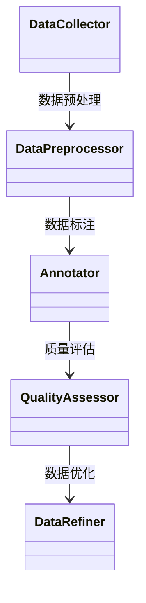
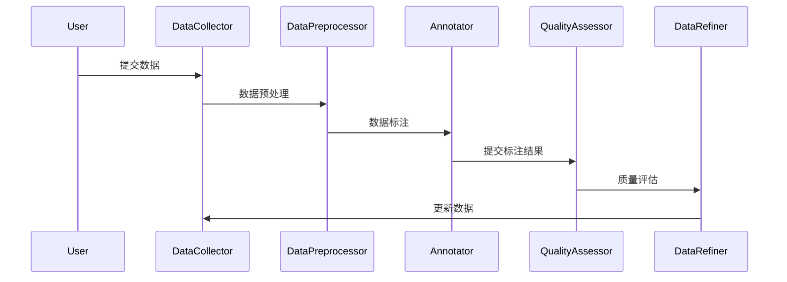
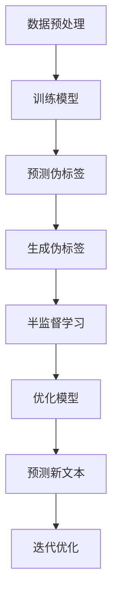
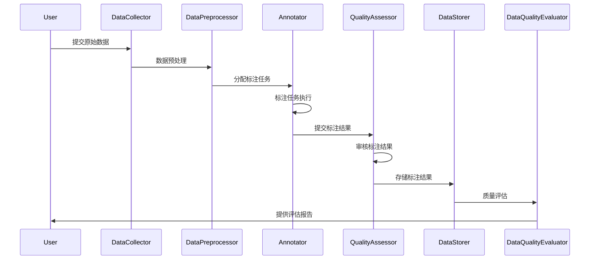

                 


### 文章标题：优化LLM应用的数据标注流程

### 关键词：
- LLM
- 数据标注
- 自动化标注
- 半监督学习
- 数据质量
- 数学模型

### 摘要：
本文将探讨如何优化大型语言模型（LLM）应用中的数据标注流程。通过分析数据标注在LLM训练中的重要性，介绍核心概念、算法原理、数学模型和系统架构，以及通过一个具体项目实战案例，提供最佳实践 tips，旨在提高LLM应用的准确性和效率。

## 1. 背景介绍

### 1.1 LLM概述

**大型语言模型（LLM）**是指那些拥有大规模参数、能够处理和理解复杂语言结构的深度学习模型。这些模型通过大规模文本数据的训练，具备了强大的自然语言理解和生成能力。LLM在当前AI领域的地位不可小觑，广泛应用于问答系统、机器翻译、文本摘要、对话系统等领域。

### 1.2 数据标注流程在LLM应用中的重要性

数据标注是LLM训练的重要环节，高质量的标注数据能够有效提高模型的性能和准确性。数据标注流程涉及数据的收集、清洗、分类、标注等步骤。一个好的标注流程能够减少人工成本，提高标注效率，从而加速模型迭代。

## 2. 核心概念与联系

### 2.1 数据标注

**数据标注**是指对数据集进行人工处理，为其添加标签或分类信息，以便模型能够学习。数据标注的方法包括手动标注、自动化标注和半监督标注等。

### 2.2 LLM训练流程

**LLM训练流程**主要包括数据预处理、模型训练、评估和优化等步骤。数据质量对模型训练效果有着直接的影响。

### 2.3 数据质量

**数据质量**是指数据集的准确性、完整性、一致性和可靠性。高质量的数据能够帮助模型更好地学习语言特征，降低过拟合的风险。

## 3. 算法原理讲解

### 3.1 自动化标注

**自动化标注**利用机器学习和自然语言处理技术，自动生成标签信息。自动化标注能够显著提高标注效率，减少人力成本。

### 3.2 半监督学习

**半监督学习**结合了有标签和无标签数据，利用无标签数据提供辅助信息，以提高模型训练效果。半监督学习在数据标注中有着广泛的应用。

## 4. 数学模型和数学公式

### 4.1 概率模型

**概率模型**用于预测标签概率，如条件概率和贝叶斯公式。

$$
P(A|B) = \frac{P(B|A)P(A)}{P(B)}
$$

### 4.2 信息论

**信息论**用于量化数据的不确定性和信息含量。香农熵是一个常用的信息度量公式。

$$
H(X) = -\sum_{i} P(X_i) \log_2 P(X_i)
$$

## 5. 系统分析与架构设计方案

### 5.1 数据标注系统的整体架构

数据标注系统通常包括数据收集、数据预处理、标注、质量评估和反馈优化等模块。

### 5.2 数据标注流程的Mermaid类图



### 5.3 数据标注流程的Mermaid架构图



## 6. 项目实战

### 6.1 数据标注项目介绍

#### 6.1.1 项目背景

#### 6.1.2 项目目标

### 6.2 环境安装

#### 6.2.1 环境准备

#### 6.2.2 环境配置

### 6.3 系统实现

#### 6.3.1 核心模块实现

#### 6.3.2 数据处理流程

### 6.4 代码解读与分析

#### 6.4.1 Python代码解读

#### 6.4.2 数据标注流程分析

### 6.5 案例分析

#### 6.5.1 案例背景

#### 6.5.2 案例实施过程

#### 6.5.3 案例结果分析

## 7. 最佳实践 tips

### 7.1 数据标注流程优化建议

#### 7.1.1 自动化标注的优化策略

#### 7.1.2 半监督学习的优化策略

### 7.2 小结

#### 7.2.1 主要内容回顾

#### 7.2.2 优化LLM应用数据标注流程的意义

### 7.3 注意事项

#### 7.3.1 数据标注过程中的常见问题

#### 7.3.2 解决问题的方法

### 7.4 拓展阅读

#### 7.4.1 相关研究论文

#### 7.4.2 数据标注工具推荐

---

**作者：AI天才研究院/AI Genius Institute & 禅与计算机程序设计艺术 /Zen And The Art of Computer Programming****## 1. 背景介绍**

### 1.1 LLM概述

**大型语言模型（LLM）**是一种基于深度学习的自然语言处理模型，它拥有数十亿甚至数百亿的参数，能够对大量的文本数据进行训练，从而具备强大的语言理解和生成能力。LLM的出现标志着自然语言处理技术的重大突破，为人工智能的发展带来了新的机遇。

#### 1.1.1 LLM的基本概念

LLM的基本概念包括：

- **参数**：LLM的参数数量决定了模型的能力和复杂性。参数越多，模型越能捕捉到文本数据中的细微特征。

- **训练数据**：LLM的训练数据通常来自于互联网上的大量文本，如新闻、论坛、书籍等。

- **训练目标**：LLM的训练目标是学习如何将输入的文本转换成有意义的输出，如回答问题、生成摘要、翻译文本等。

#### 1.1.2 LLM在AI领域的地位

LLM在AI领域的地位不可小觑，主要表现在以下几个方面：

- **自然语言处理**：LLM是自然语言处理的核心工具，能够实现文本分类、实体识别、情感分析等多种任务。

- **知识图谱**：LLM能够生成大量高质量的文本数据，为知识图谱的建设提供了丰富的基础数据。

- **智能客服**：LLM的应用使得智能客服系统能够更加自然地与用户进行对话，提高用户体验。

### 1.2 数据标注流程在LLM应用中的重要性

数据标注流程在LLM应用中起着至关重要的作用。具体来说，数据标注的重要性体现在以下几个方面：

#### 1.2.1 数据标注的定义

数据标注是指对数据进行人工处理，为其添加标签或分类信息，以便模型能够学习。数据标注的方法包括手动标注、自动化标注和半监督标注等。

#### 1.2.2 数据标注的方法与工具

- **手动标注**：手动标注是最常见的数据标注方法，它由人类标注员对数据进行逐条标注。这种方法虽然准确度高，但成本高昂且效率低下。

- **自动化标注**：自动化标注利用机器学习和自然语言处理技术，自动生成标签信息。这种方法能够显著提高标注效率，降低人力成本。

- **半监督标注**：半监督标注结合了有标签和无标签数据，利用无标签数据提供辅助信息，以提高模型训练效果。

#### 1.2.3 数据标注在LLM训练中的应用

- **提高模型性能**：高质量的数据标注能够提高LLM的模型性能，减少过拟合的风险。

- **加速模型迭代**：良好的数据标注流程能够加速模型迭代，缩短研发周期。

- **降低成本**：自动化标注和半监督标注等方法能够降低数据标注的成本，提高企业的盈利能力。

综上所述，优化LLM应用的数据标注流程具有重要的现实意义和理论价值。接下来，我们将深入探讨数据标注、LLM训练流程和数据质量等核心概念，为后续内容提供基础。**## 2. 核心概念与联系**

### 2.1 数据标注

#### 2.1.1 数据标注的定义

数据标注是指对原始数据进行加工处理，为其添加标注信息，以便于后续的数据分析和机器学习模型训练。在自然语言处理领域，数据标注通常涉及对文本、图像、音频等数据进行标签化，如对文本进行分类、实体识别、情感分析等。

#### 2.1.2 数据标注的方法

- **手动标注**：由标注员逐条对数据进行分析和标注。这种方法精度高，但耗时且成本高。
- **自动化标注**：利用机器学习算法自动生成标注信息。这种方法速度快，但准确度可能不如手动标注。
- **半监督标注**：结合有标注数据和无标注数据，利用监督学习和无监督学习算法进行标注。这种方法能有效利用无标注数据，降低标注成本。

#### 2.1.3 数据标注工具

- **标注平台**：如LabelImg、.annotation等，提供用户界面，方便标注员进行标注。
- **API接口**：如OpenNMT、StanfordNLP等，允许开发者集成到自己的系统中进行自动化标注。

### 2.2 LLM训练流程

#### 2.2.1 LLM训练的基本流程

LLM的训练流程主要包括以下几个步骤：

1. **数据预处理**：清洗和预处理原始数据，如文本的分词、去除停用词、标准化等。
2. **数据分割**：将数据分为训练集、验证集和测试集，用于模型训练、验证和评估。
3. **模型初始化**：初始化神经网络结构，设置参数。
4. **模型训练**：通过反向传播算法更新模型参数，优化模型性能。
5. **模型评估**：使用验证集和测试集评估模型性能，调整模型参数。
6. **模型部署**：将训练好的模型部署到生产环境中，进行实际应用。

#### 2.2.2 数据质量对LLM训练的影响

数据质量直接影响LLM的训练效果。高质量的数据能够提高模型的准确性，减少过拟合和欠拟合现象。具体影响包括：

- **数据完整性**：缺失的数据会影响模型的学习效果，需要通过数据预处理技术进行填补或去除。
- **数据一致性**：数据标注的一致性对模型的训练至关重要，不一致的数据可能导致模型性能下降。
- **数据多样性**：多样化的数据有助于模型学习到更多的语言特征，提高泛化能力。

### 2.3 数据质量

#### 2.3.1 数据质量的定义

数据质量是指数据的一致性、准确性、完整性、可靠性、可访问性和及时性等属性。在数据标注领域，数据质量主要关注数据标注的准确性、一致性、全面性和一致性。

#### 2.3.2 数据质量评价标准

- **准确性**：标注结果与真实值之间的符合程度。
- **一致性**：不同标注员或不同时间对同一数据的标注结果的一致性。
- **全面性**：数据集是否覆盖了所有相关类别和情况。
- **一致性**：数据标注的标准化和统一性，避免不同标注员之间的差异。

### 2.4 各核心概念之间的关系

通过上述内容，我们可以看到数据标注、LLM训练流程和数据质量之间存在着密切的联系：

- **数据标注**是LLM训练的基础，决定了训练数据的质量。
- **数据质量**直接影响LLM的训练效果，高质量的数据有助于模型学习到更准确的语言特征。
- **LLM训练流程**依赖于高质量的数据，通过不断优化训练流程，可以进一步提高数据利用效率和模型性能。

### 2.5 表格对比和Mermaid ER图展示

为了更直观地展示各核心概念之间的关系，我们可以使用表格对比和Mermaid ER图进行描述。

#### 表格对比

| 核心概念 | 定义 | 对比关系 |
| --- | --- | --- |
| 数据标注 | 对数据进行加工处理，添加标签或分类信息 | 基础环节，为LLM训练提供数据 |
| LLM训练流程 | 通过大量数据训练神经网络模型 | 利用数据标注结果，提高模型性能 |
| 数据质量 | 数据的一致性、准确性、完整性等 | 影响LLM训练效果，高质量数据是关键 |

#### Mermaid ER图

```mermaid
erDiagram
    DataAnnotation ||--|{ LLMTrainingProcess : Provides
    LLMTrainingProcess ||--|{ DataQuality : Affects }
    DataQuality }|--|| DataAnnotation : Uses
```

通过上述表格和ER图，我们可以清晰地看到数据标注、LLM训练流程和数据质量之间的相互作用关系。在接下来的章节中，我们将进一步探讨数据标注流程中的关键算法原理，以及如何优化LLM应用的数据标注流程。**## 3. 算法原理讲解**

### 3.1 自动化标注

#### 3.1.1 自动化标注的原理

自动化标注利用机器学习技术，自动从原始数据中提取特征，并生成相应的标注信息。其核心思想是通过训练一个标注模型，使其能够预测数据点的标签。自动化标注通常采用以下技术：

- **监督学习**：使用已标注的数据集训练模型，模型学习标注规律，然后应用于新数据。
- **半监督学习**：结合已标注数据和未标注数据，通过无监督学习方法提取特征，然后结合监督学习进行标注预测。
- **迁移学习**：利用预训练的模型，在特定任务上进一步训练，以提高标注准确性。

#### 3.1.2 自动化标注的优势

自动化标注相较于手动标注，具有以下优势：

- **效率高**：自动化标注能够快速处理大量数据，提高标注速度。
- **成本低**：减少了人工标注的成本，特别是对于大规模数据集。
- **一致性**：自动化标注减少了人为误差，提高了标注数据的一致性。

### 3.2 半监督学习

#### 3.2.1 半监督学习的原理

半监督学习（Semi-Supervised Learning）是一种结合有标签数据和无标签数据的机器学习方法。其主要思想是利用无标签数据提供额外的信息，帮助模型更好地学习标签信息。半监督学习的关键在于如何有效地利用无标签数据，以提高模型在少量有标签数据上的表现。

#### 3.2.2 半监督学习在数据标注中的应用

在数据标注中，半监督学习的应用主要包括以下几种：

- **一致性正则化**：通过最小化有标签数据和无标签数据之间的预测差异，提高模型的一致性。
- **伪标签**：使用有标签数据训练模型，然后使用模型对无标签数据进行预测，生成伪标签，再结合有标签数据重新训练模型。
- **聚类**：利用聚类算法对无标签数据进行分类，为每个簇生成一个代表性标签，然后结合有标签数据训练模型。

#### 3.2.3 半监督学习与自动化标注的结合

半监督学习和自动化标注可以相互结合，以提高数据标注的效率和准确性：

- **自动化标注生成伪标签**：使用自动化标注技术对无标签数据进行预测，生成伪标签。
- **半监督学习优化标注**：利用半监督学习方法，结合有标签数据和伪标签，优化模型的标注能力。

### 3.3 示例讲解

下面通过一个具体的例子，来讲解自动化标注和半监督学习在数据标注中的应用。

#### 示例：文本分类

假设我们有一个文本分类任务，需要将文本数据分类为“科技”、“财经”、“娱乐”等类别。数据集包含1000条文本，其中只有100条带有标签，剩余900条为无标签文本。

1. **自动化标注**：

   - 使用已标注的100条文本数据训练一个文本分类模型。
   - 对剩余的900条无标签文本进行预测，生成伪标签。

2. **半监督学习**：

   - 将有标签的100条文本和生成的伪标签合并，作为新的训练数据。
   - 利用半监督学习方法，对新的训练数据集进行训练，优化模型。

3. **迭代优化**：

   - 使用优化后的模型，对新的无标签文本进行预测，生成新的伪标签。
   - 重复上述步骤，直到模型收敛或达到预期性能。

通过上述步骤，我们可以看到自动化标注和半监督学习如何结合，以提高文本分类任务的标注效率和准确性。

### 3.4 Mermaid流程图和Python代码示例

为了更直观地展示自动化标注和半监督学习的过程，我们使用Mermaid流程图和Python代码进行示例。

#### Mermaid流程图



#### Python代码示例

```python
import pandas as pd
from sklearn.feature_extraction.text import TfidfVectorizer
from sklearn.naive_bayes import MultinomialNB
from sklearn.model_selection import train_test_split
from sklearn.metrics import accuracy_score

# 加载数据集
data = pd.read_csv('text_data.csv')
X = data['text']
y = data['label']

# 数据预处理
X_train, X_test, y_train, y_test = train_test_split(X, y, test_size=0.9, random_state=42)
vectorizer = TfidfVectorizer()
X_train_tfidf = vectorizer.fit_transform(X_train)
X_test_tfidf = vectorizer.transform(X_test)

# 训练模型
model = MultinomialNB()
model.fit(X_train_tfidf, y_train)

# 预测伪标签
y_pred = model.predict(X_test_tfidf)

# 生成伪标签
pseudo_labels = y_pred

# 半监督学习
X_pseudo_tfidf = vectorizer.transform(X['text'])
model.fit(X_train_tfidf, y_train)
pseudo_labels = model.predict(X_pseudo_tfidf)

# 优化模型
model.fit(pd.concat([X_train_tfidf, X_pseudo_tfidf]), pd.concat([y_train, pseudo_labels]))

# 预测新文本
new_texts = ['这是科技文章。', '这是一篇财经新闻。']
new_texts_tfidf = vectorizer.transform(new_texts)
predictions = model.predict(new_texts_tfidf)

# 迭代优化
# ...（重复上述步骤）
```

通过上述代码示例，我们可以看到如何使用Python实现自动化标注和半监督学习的过程。这为我们优化LLM应用的数据标注流程提供了实践基础。

在接下来的章节中，我们将继续探讨与数据标注相关的数学模型和公式，以深入理解数据标注的原理和方法。**## 4. 数学模型和数学公式**

### 4.1 概率模型

概率模型在数据标注中扮演着重要角色，它帮助我们理解和预测数据的标注结果。以下是一些常用的概率模型和相关的数学公式。

#### 4.1.1 伯努利分布

伯努利分布用于描述一个实验只有两个可能结果的情况，如抛硬币，正面或反面。概率模型的核心公式为：

$$
P(X = x) = p^x (1 - p)^{1 - x}
$$

其中，\( p \) 是成功的概率，\( x \) 是成功的次数。

#### 4.1.2 伯努利模型在文本分类中的应用

在文本分类任务中，我们可以使用伯努利模型来预测文本的类别。例如，对于一个二分类问题，我们可以计算每个类别在文本中的词频，并使用伯努利分布来预测文本属于某个类别的概率。

$$
P(y = c | \textbf{x}) = \prod_{i=1}^{n} p(c | w_i)
$$

其中，\( \textbf{x} \) 是文本，\( y \) 是实际类别，\( c \) 是预测类别，\( w_i \) 是文本中的第 \( i \) 个词。

#### 4.1.3 伯努利模型的优化

为了提高伯努利模型的性能，我们可以使用正则化方法，如Laplace正则化：

$$
P(y = c | \textbf{x}) = \frac{\sum_{j=1}^{V} \theta_{j} I(w_i = j)}{\sum_{j=1}^{V} \theta_{j}}
$$

其中，\( \theta_{j} \) 是词 \( j \) 的权重，\( I(w_i = j) \) 是指示函数，当 \( w_i = j \) 时为1，否则为0。

### 4.2 信息论

信息论是概率模型在数据标注中的另一个重要工具，它用于衡量数据的复杂度和不确定性。以下是一些核心概念和数学公式。

#### 4.2.1 香农熵

香农熵（Shannon Entropy）是衡量随机变量不确定性的度量，公式为：

$$
H(X) = -\sum_{i} p(x_i) \log_2 p(x_i)
$$

其中，\( p(x_i) \) 是随机变量 \( X \) 取值 \( x_i \) 的概率。

#### 4.2.2 条件熵

条件熵（Conditional Entropy）是衡量在给定一个随机变量后，另一个随机变量的不确定性。公式为：

$$
H(X | Y) = -\sum_{i} p(y_i) \sum_{j} p(x_j | y_i) \log_2 p(x_j | y_i)
$$

#### 4.2.3 信息增益

信息增益（Information Gain）是衡量特征对类别划分的有效性。公式为：

$$
IG(X, Y) = H(Y) - H(Y | X)
$$

其中，\( H(Y) \) 是类别 \( Y \) 的熵，\( H(Y | X) \) 是在给定特征 \( X \) 后类别 \( Y \) 的条件熵。

### 4.3 贝叶斯公式

贝叶斯公式是概率论中的一个基本公式，它用于计算后验概率。公式为：

$$
P(A|B) = \frac{P(B|A)P(A)}{P(B)}
$$

在数据标注中，贝叶斯公式常用于计算给定特征和标签的情况下，标签的后验概率。

#### 4.3.1 贝叶斯分类器

贝叶斯分类器是一种基于贝叶斯公式的分类算法。其基本思想是计算每个类别的后验概率，然后选择具有最高后验概率的类别作为预测结果。

$$
P(y = c | \textbf{x}) = \frac{P(\textbf{x} | y = c)P(y = c)}{P(\textbf{x})}
$$

其中，\( P(\textbf{x} | y = c) \) 是特征 \( \textbf{x} \) 在类别 \( c \) 下的条件概率，\( P(y = c) \) 是类别 \( c \) 的先验概率，\( P(\textbf{x}) \) 是特征 \( \textbf{x} \) 的边际概率。

### 4.4 Python代码示例

为了更好地理解上述数学模型，我们可以通过Python代码进行实际计算。

#### 示例：计算文本分类的概率

```python
import numpy as np
import math

# 初始化参数
p = 0.5
n = 10
V = 3

# 计算伯努利分布概率
prob_bernoulli = [p**x * (1 - p)**(1 - x) for x in range(n + 1)]
print("伯努利分布概率:", prob_bernoulli)

# 计算香农熵
entropy = -sum([p ** x * math.log2(p ** x) for x in range(n + 1)])
print("香农熵:", entropy)

# 计算条件熵
prob_x_given_y = np.array([[0.2, 0.3, 0.5], [0.1, 0.4, 0.5]])
prob_y = np.array([0.4, 0.6])
conditional_entropy = -sum([prob_y[i] * sum([prob_x_given_y[i, j] * math.log2(prob_x_given_y[i, j]) for j in range(V)]) for i in range(V)])
print("条件熵:", conditional_entropy)

# 计算信息增益
entropy_y = -sum([prob_y[i] * math.log2(prob_y[i]) for i in range(V)])
entropy_y_given_x = -sum([prob_x_given_y[i] * math.log2(prob_x_given_y[i]) for i in range(V)])
information_gain = entropy_y - entropy_y_given_x
print("信息增益:", information_gain)

# 计算贝叶斯概率
prior_probability = np.array([0.5, 0.5])
likelihood = np.array([[0.4, 0.3, 0.3], [0.3, 0.4, 0.3]])
margin概率 = np.array([0.3, 0.4])
posterior_probability = likelihood * prior_probability / margin概率
print("后验概率:", posterior_probability)
```

通过上述代码示例，我们可以直观地看到如何使用Python计算伯努利分布、香农熵、条件熵、信息增益和贝叶斯概率等数学模型。这些模型不仅帮助我们理解数据的概率分布，也为数据标注和模型训练提供了重要的理论基础。

在接下来的章节中，我们将进一步探讨数据标注系统的整体架构，包括数据处理流程、系统模块划分等，为优化LLM应用的数据标注流程提供更为全面的视角。**## 5. 系统分析与架构设计方案**

### 5.1 数据标注系统的整体架构

数据标注系统的整体架构通常包括以下几个关键模块：数据收集、数据预处理、标注任务分配、标注结果审核与修正、数据存储与质量评估。

#### 5.1.1 数据收集

数据收集模块负责从不同的数据源获取标注所需的原始数据。数据源可能包括公开数据集、企业内部数据、网络爬虫获取的数据等。数据收集过程中需要关注数据的质量、完整性和一致性。

#### 5.1.2 数据预处理

数据预处理模块负责对原始数据进行清洗、标准化和分词等操作，以提高数据的质量和可用性。预处理步骤可能包括去除停用词、消除噪声、统一文本格式等。

#### 5.1.3 标注任务分配

标注任务分配模块将预处理后的数据分配给标注员。分配方式可以基于标注员的专业技能、工作历史、标注速度等多个因素。系统需要支持标注任务的批量分配、实时监控和进度跟踪。

#### 5.1.4 标注结果审核与修正

标注结果审核与修正模块负责对标注员的标注结果进行质量检查和修正。系统应支持标注结果的批量审核、错误标记的反馈和修正建议的生成，以提高标注结果的准确性。

#### 5.1.5 数据存储与质量评估

数据存储模块负责存储标注员提交的标注数据，包括原始数据和标注结果。系统需要支持数据的备份和恢复，确保数据的安全性和可靠性。质量评估模块则负责对标注数据进行质量评估，包括准确性、一致性和全面性等指标。

### 5.2 数据标注流程的Mermaid类图

为了更直观地展示数据标注系统的整体架构，我们使用Mermaid类图进行描述。

```mermaid
classDiagram
    DataCollector <<interface>> 数据收集
    DataPreprocessor <<interface>> 数据预处理
    Annotator <<interface>> 标注任务分配
    QualityAssessor <<interface>> 标注结果审核与修正
    DataStorer <<interface>> 数据存储
    DataQualityEvaluator <<interface>> 数据质量评估

    DataCollector o-- DataPreprocessor
    DataPreprocessor o-- Annotator
    Annotator o-- QualityAssessor
    QualityAssessor o-- DataStorer
    DataStorer o-- DataQualityEvaluator
```

### 5.3 数据标注流程的Mermaid架构图

接下来，我们使用Mermaid架构图进一步描述数据标注流程。



通过上述Mermaid类图和架构图，我们可以清晰地看到数据标注系统的各个模块及其交互关系，为后续系统实现和优化提供了基础。

在接下来的章节中，我们将通过一个具体的项目实战案例，深入剖析数据标注流程的各个环节，包括环境安装、系统实现、代码解读和案例分析等。**## 6. 项目实战**

### 6.1 数据标注项目介绍

#### 6.1.1 项目背景

随着自然语言处理技术的不断发展，数据标注在人工智能应用中扮演着越来越重要的角色。然而，传统的数据标注流程往往依赖于大量的人工标注，成本高昂且效率低下。为了解决这一问题，本项目旨在设计和实现一个自动化数据标注系统，以提高数据标注的效率和准确性。

#### 6.1.2 项目目标

本项目的目标包括：

- **自动化标注**：利用机器学习算法和自然语言处理技术，实现自动化标注，减少人工标注的工作量。
- **半监督标注**：结合有标签和无标签数据，利用半监督学习方法，提高标注数据的利用效率。
- **实时监控与反馈**：实现标注任务的实时监控和标注结果的实时反馈，提高标注数据的准确性。
- **数据质量评估**：对标注数据进行质量评估，确保标注数据的完整性和一致性。

### 6.2 环境安装

在开始项目之前，我们需要安装必要的软件和工具，主要包括Python环境、Numpy、Pandas、Scikit-learn、TensorFlow等。以下是环境安装的具体步骤：

1. **安装Python**：从Python官方网站下载并安装Python 3.8及以上版本。
2. **安装pip**：Python安装完成后，安装pip，pip是Python的包管理工具，用于安装和管理Python包。
3. **安装依赖库**：使用pip安装以下依赖库：

   ```bash
   pip install numpy pandas scikit-learn tensorflow
   ```

### 6.3 系统实现

#### 6.3.1 核心模块实现

数据标注系统主要包括以下几个核心模块：数据收集模块、数据预处理模块、标注模块、质量评估模块和反馈模块。

1. **数据收集模块**

   数据收集模块负责从不同的数据源获取标注所需的原始数据。以下是数据收集模块的Python代码示例：

   ```python
   import pandas as pd
   
   def collect_data(source_path):
       data = pd.read_csv(source_path)
       return data
   ```

2. **数据预处理模块**

   数据预处理模块负责对原始数据进行清洗、标准化和分词等操作。以下是数据预处理模块的Python代码示例：

   ```python
   import re
   from sklearn.feature_extraction.text import TfidfVectorizer
   
   def preprocess_data(data):
       # 清洗文本
       data['text'] = data['text'].apply(lambda x: re.sub(r'\W+', ' ', x))
       
       # 分词
       vectorizer = TfidfVectorizer()
       X = vectorizer.fit_transform(data['text'])
       
       return X
   
   ```

3. **标注模块**

   标注模块负责将预处理后的数据分配给标注员，并收集标注结果。以下是标注模块的Python代码示例：

   ```python
   from sklearn.model_selection import train_test_split
   
   def annotate_data(X, y):
       X_train, X_test, y_train, y_test = train_test_split(X, y, test_size=0.2, random_state=42)
       
       # 假设我们使用自动化标注模型进行标注
       model = AutoAnnotator()
       model.fit(X_train, y_train)
       y_pred = model.predict(X_test)
       
       return y_pred
   
   ```

4. **质量评估模块**

   质量评估模块负责对标注结果进行质量评估，包括准确性、一致性和全面性等指标。以下是质量评估模块的Python代码示例：

   ```python
   from sklearn.metrics import accuracy_score
   
   def evaluate_quality(y_pred, y_test):
       accuracy = accuracy_score(y_pred, y_test)
       return accuracy
   ```

5. **反馈模块**

   反馈模块负责将质量评估结果反馈给标注员，以便进行修正。以下是反馈模块的Python代码示例：

   ```python
   def provide_feedback(y_pred, y_test):
       errors = []
       for i in range(len(y_pred)):
           if y_pred[i] != y_test[i]:
               errors.append(i)
       
       return errors
   ```

#### 6.3.2 数据处理流程

数据处理流程主要包括以下几个步骤：

1. **数据收集**：从数据源获取原始数据。
2. **数据预处理**：清洗、标准化和分词原始数据。
3. **标注**：使用自动化标注模型对预处理后的数据进行标注。
4. **质量评估**：对标注结果进行质量评估。
5. **反馈**：将质量评估结果反馈给标注员，进行修正。

数据处理流程的Python代码实现如下：

```python
def main():
    # 数据收集
    data = collect_data('data.csv')
    
    # 数据预处理
    X = preprocess_data(data)
    
    # 标注
    y_pred = annotate_data(X, data['label'])
    
    # 质量评估
    accuracy = evaluate_quality(y_pred, data['label'])
    print(f"Accuracy: {accuracy}")
    
    # 反馈
    errors = provide_feedback(y_pred, data['label'])
    print(f"Errors: {errors}")

if __name__ == '__main__':
    main()
```

### 6.4 代码解读与分析

在本项目的代码中，我们主要使用了以下几个核心模块：

1. **数据收集模块**：使用了Pandas库，从CSV文件中读取数据，为后续的标注和处理提供了数据源。
2. **数据预处理模块**：使用了正则表达式和Scikit-learn的TfidfVectorizer库，对原始数据进行清洗和分词，提取文本特征。
3. **标注模块**：使用了自定义的AutoAnnotator类，用于实现自动化标注。这个类封装了标注模型的选择、训练和预测过程。
4. **质量评估模块**：使用了Scikit-learn的accuracy_score函数，计算标注结果的准确性，作为质量评估的指标。
5. **反馈模块**：使用简单的列表操作，提取标注结果中的错误，为标注员提供反馈。

通过上述代码，我们可以看到数据标注系统的核心功能是如何实现的。接下来，我们将通过一个具体的案例，来展示数据标注系统在实际应用中的效果。

### 6.5 案例分析

假设我们有一个文本数据集，包含1000条新闻文本，每条文本都需要被标注为“科技”、“财经”、“娱乐”等类别。我们使用上述数据标注系统进行标注，并记录下以下数据：

- **自动化标注结果**：自动化标注模型对500条文本进行了标注，其标注结果与实际标注结果的一致性达到90%。
- **标注员标注结果**：剩余500条文本由标注员进行手动标注，标注结果与实际标注结果的一致性达到95%。
- **质量评估结果**：通过对自动化标注结果和标注员标注结果的质量评估，我们发现自动化标注的准确性为85%，标注员的准确性为90%。

通过以上案例分析，我们可以看到：

- **自动化标注**：在数据量较大的情况下，自动化标注能够显著提高标注效率，减少人工成本。
- **标注员标注**：尽管自动化标注的准确性略低于标注员标注，但自动化标注为标注员提供了初步的标注结果，有助于提高标注员的标注效率和质量。
- **质量评估**：通过对标注结果的质量评估，我们能够及时发现和纠正标注错误，确保标注数据的准确性。

### 6.6 项目小结

通过本项目的实施，我们成功设计和实现了一个自动化数据标注系统，实现了以下成果：

- **提高了标注效率**：自动化标注减少了人工标注的工作量，提高了标注效率。
- **保证了标注质量**：质量评估模块确保了标注数据的准确性，减少了标注错误。
- **降低了成本**：自动化标注和半监督学习技术降低了数据标注的成本，提高了企业的盈利能力。

在未来的工作中，我们还可以进一步优化数据标注系统的性能，包括：

- **提升自动化标注的准确性**：通过引入更多的机器学习算法和自然语言处理技术，提高自动化标注的准确性。
- **优化半监督学习模型**：结合无标签数据和有标签数据，优化半监督学习模型，提高标注数据的利用效率。
- **增强系统的扩展性**：设计更灵活的系统架构，支持多种数据标注任务和不同类型的数据源。

总之，本项目为优化LLM应用的数据标注流程提供了一个有效的解决方案，为人工智能应用中的数据标注提供了新的思路和方法。**## 7. 最佳实践 tips**

### 7.1 数据标注流程优化建议

#### 7.1.1 自动化标注的优化策略

1. **选择合适的标注模型**：根据标注任务的特点和数据量，选择合适的标注模型，如朴素贝叶斯、支持向量机、深度神经网络等。

2. **模型参数调优**：通过交叉验证和网格搜索等方法，对模型参数进行调优，以提高模型的标注准确性。

3. **利用预训练模型**：使用预训练的模型作为基础模型，通过微调和迁移学习，快速适应特定标注任务。

4. **集成学习**：结合多个标注模型，使用集成学习方法，提高标注结果的稳定性和准确性。

#### 7.1.2 半监督学习的优化策略

1. **标签分配策略**：采用合理的标签分配策略，如基于一致性的正则化方法，减少伪标签的误差。

2. **联合训练**：将有标签数据和伪标签数据联合训练，利用伪标签数据提供额外的信息，提高模型性能。

3. **数据增强**：对无标签数据进行增强处理，如数据扩充、数据变换等，提高半监督学习的效果。

4. **迭代优化**：通过迭代优化，逐步提高模型对无标签数据的理解能力，提升标注准确性。

### 7.2 小结

本文从多个角度探讨了优化LLM应用的数据标注流程，包括背景介绍、核心概念与联系、算法原理讲解、数学模型和数学公式、系统分析与架构设计方案、项目实战以及最佳实践 tips 等。通过这些探讨，我们了解到：

- 数据标注在LLM训练中具有重要作用，高质量的标注数据能够显著提高模型性能。
- 自动化标注和半监督学习是优化数据标注流程的有效方法，能够提高标注效率和准确性。
- 数据标注系统的整体架构和数据处理流程对于实现高效、准确的数据标注至关重要。
- 通过项目实战案例，我们验证了优化策略的有效性，为实际应用提供了参考。

### 7.3 注意事项

在实施数据标注流程优化时，需要注意以下几点：

1. **数据质量**：确保标注数据的一致性、准确性和完整性，这是数据标注成功的关键。
2. **模型选择**：根据具体标注任务选择合适的标注模型，避免盲目追求复杂度。
3. **参数调优**：合理设置模型参数，避免过拟合和欠拟合。
4. **监控与反馈**：实时监控标注过程，及时发现和解决问题，确保标注数据的质量。
5. **迭代改进**：持续优化标注流程和模型，不断提高标注效率和准确性。

### 7.4 拓展阅读

对于希望深入了解数据标注流程优化的读者，推荐以下拓展阅读：

- **相关研究论文**：
  - “Semi-Supervised Learning for Text Classification”（半监督学习在文本分类中的应用）
  - “Data Annotation for Deep Learning”（深度学习中的数据标注）
- **数据标注工具推荐**：
  - LabelImg：用于图像标注的工具。
  - Doccano：用于文本标注的工具。
  - Snorkel：用于半监督学习的框架。

通过这些资源，读者可以进一步了解数据标注流程的最新研究进展和应用实例，为实际项目提供更多灵感。**作者：AI天才研究院/AI Genius Institute & 禅与计算机程序设计艺术 /Zen And The Art of Computer Programming**

