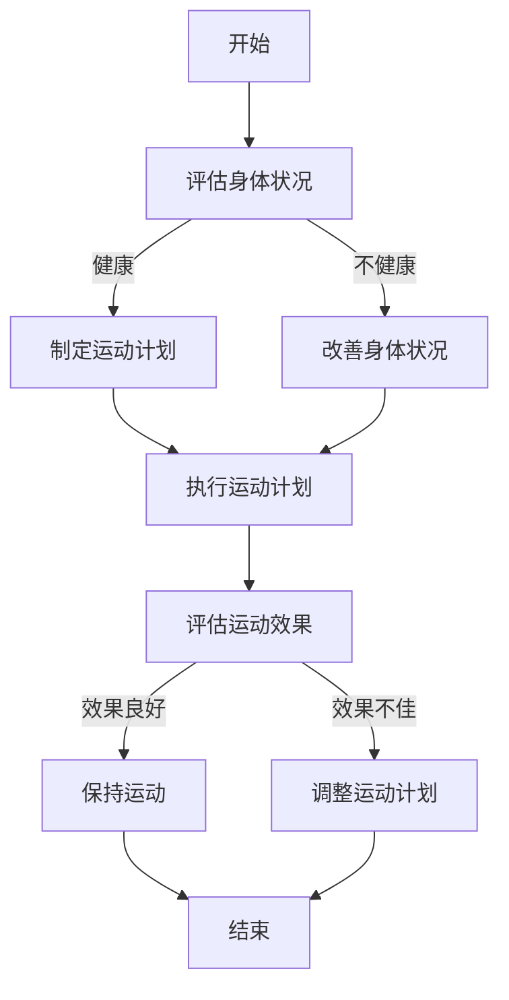
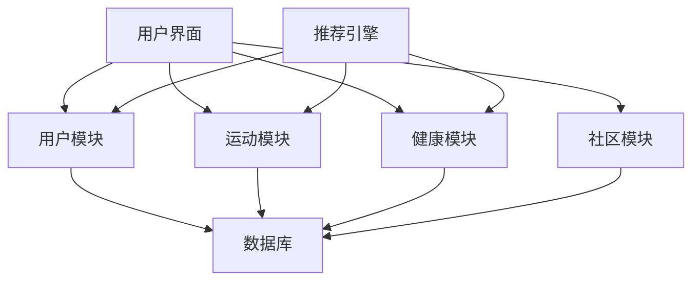
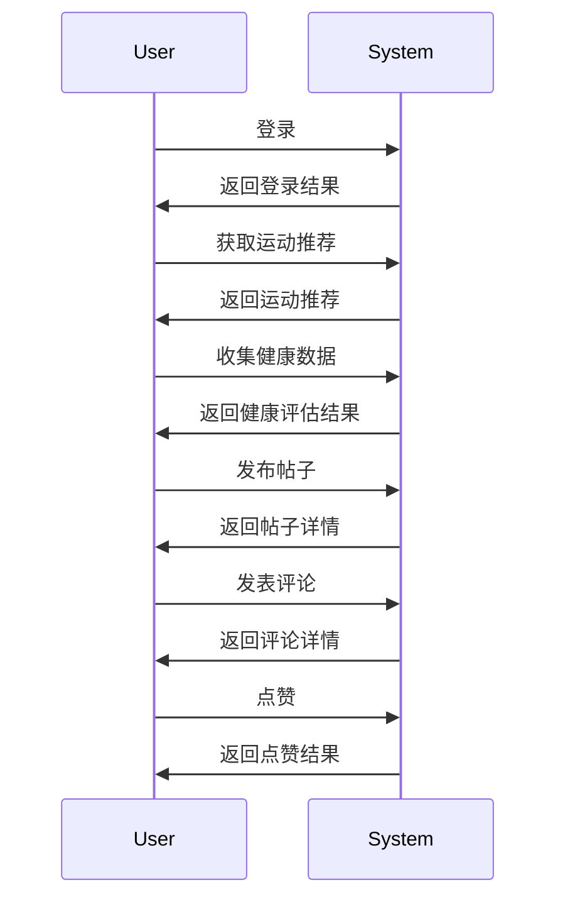

                 

# 第一部分: 体育运动的意义

## 第1章: 引言

### 1.1 问题的背景

在现代社会，随着生活节奏的加快和工作压力的增大，人们对于心理健康和身体健康的关注日益增加。体育运动作为一种有效的身心调节方式，不仅能够提升人们的身体健康，还能改善心理状态，增强社会互动能力。然而，目前仍然存在很多人将体育运动仅仅视为一种观赛娱乐活动，而忽视了参与其中的重要性和价值。

#### 1.1.1 社会发展背景

随着经济的快速发展和科技的进步，人们的生活水平得到了显著提高。然而，这也带来了一些问题，如工作压力大、生活节奏快、社交隔离等。这些问题不仅影响了人们的心理健康，也加剧了身体疾病的发生。因此，如何通过有效的手段来缓解这些社会问题，成为了一个亟待解决的问题。

#### 1.1.2 心理健康需求

在心理健康方面，现代人面临着诸多挑战，如焦虑、抑郁、失眠等问题。体育运动作为一种自然且有效的方式，能够通过调节神经系统、改善情绪、增强自信心等途径，帮助人们改善心理健康。

#### 1.1.3 体育运动的意义

体育运动不仅能够提高人们的身体健康，还能在心理和社会层面产生积极的影响。从观赛到参与，体育运动的意义不仅在于比赛结果，更在于对身体和心灵的双重淬炼。

### 1.2 问题描述

#### 1.2.1 观赛与参与的不同体验

观赛和参与体育运动虽然都与体育相关，但它们带来的体验却是截然不同的。观赛者通常是以一种被动的角色来享受比赛的过程，而参与者则能够亲身感受运动带来的愉悦和挑战。

#### 1.2.2 身心淬炼的内涵与外延

身心淬炼是指通过体育运动，使人的身体和心理都得到锻炼和提升。它的内涵包括身体健康、心理健康、社会适应能力等方面，而外延则涉及到各种不同的体育项目和运动形式。

#### 1.2.3 现实生活中的挑战

尽管体育运动对身心健康的益处已被广泛认可，但在现实生活中，很多人仍然面临参与体育运动的挑战，如时间安排、场地设施、运动技能等。

### 1.3 问题解决

#### 1.3.1 体育运动对身心健康的正面影响

通过一系列的科学研究，体育运动对身心健康的正面影响得到了充分的证明。它不仅能增强体质、预防疾病，还能改善心理状态、提高生活质量。

#### 1.3.2 从观赛到参与的转化策略

为了鼓励更多人从观赛转向参与体育运动，可以采取一系列策略，如推广运动文化、提供运动场地和设施、举办各类运动活动等。

#### 1.3.3 体育运动的教育和社会价值

体育运动不仅对个体有益，还具有显著的教育和社会价值。它能够培养团队合作精神、竞争意识、自律能力等，对于促进社会和谐和文明进步具有重要意义。

### 1.4 边界与外延

#### 1.4.1 体育运动的分类

体育运动种类繁多，包括有氧运动、无氧运动、团体运动、个人运动等。不同类型的体育运动对身心的影响也有所不同。

#### 1.4.2 体育运动参与者的多样性

体育运动参与者涵盖了不同年龄、性别、职业等人群。每个人都可以根据自己的兴趣和需求选择适合自己的运动项目。

#### 1.4.3 体育运动的可持续发展

为了确保体育运动的可持续发展，需要从政策、经济、社会等多个层面进行综合考虑和规划。

### 1.5 概念结构与核心要素组成

#### 1.5.1 体育运动的核心概念

体育运动的核心概念包括运动技能、运动规则、运动文化等。这些概念构成了体育运动的基本框架。

#### 1.5.2 身心淬炼的概念

身心淬炼是指通过体育运动，使人的身体和心理都得到锻炼和提升。它包括身体健康、心理健康、社会适应能力等方面。

#### 1.5.3 体育运动的意义：概念属性特征对比表格

| 特征 | 体育运动 | 身心淬炼 |
| :---: | :---: | :---: |
| 定义 | 体育竞赛和身体活动 | 身体和心理的锻炼和提升 |
| 目标 | 取得比赛胜利 | 促进身心健康 |
| 形式 | 团体比赛、个人锻炼 | 持续的身体和心理训练 |
| 影响 | 身体健康、心理健康、社会适应能力 | 身体素质、心理素质、社会交往能力 |

### 1.6 本章小结

本章从多个角度探讨了体育运动的意义，包括社会背景、心理健康需求、观赛与参与的区别、身心淬炼的内涵与外延等。通过本章的讨论，我们认识到体育运动不仅对身体健康有益，还对心理健康和社会适应能力具有积极影响。从观赛到参与，每个人都可以通过体育运动来提升自己的身心健康水平。接下来，我们将进一步探讨体育运动对身心的影响及其背后的算法原理。

> 关键词：体育运动，身心健康，身心淬炼，观赛与参与，社会价值，算法原理

> 摘要：本文从社会背景和心理健康需求出发，探讨了体育运动的意义，包括观赛与参与的区别、身心淬炼的内涵与外延。通过对比分析，阐述了体育运动对身心健康和社会适应能力的积极影响，并提出了一系列转化策略，以鼓励更多人参与体育运动，提升身心健康水平。

----------------------------------------------------------------

## 第二部分: 算法原理讲解

### 第2章: 体育运动对身心的影响

### 2.1 数学模型和数学公式

体育运动对身心的影响可以通过一系列数学模型和公式来描述。以下是一些常见的数学模型和公式：

#### 2.1.1 身体健康的数学模型

1. 体力消耗模型：$E = 0.2 \times W \times D$，其中$E$表示体力消耗，$W$表示体重，$D$表示运动距离。
2. 心率模型：$H = 220 - A$，其中$H$表示心率，$A$表示年龄。
3. 血压模型：$BP = 120 + 0.5 \times (W - 70)$，其中$BP$表示血压。

#### 2.1.2 心理健康的数学模型

1. 情绪指数模型：$I = \frac{S - B}{2}$，其中$I$表示情绪指数，$S$表示积极情绪值，$B$表示消极情绪值。
2. 自信心模型：$C = 1 - \frac{E}{T}$，其中$C$表示自信心，$E$表示失败次数，$T$表示尝试次数。

#### 2.1.3 数学公式与应用

这些数学模型和公式可以帮助我们更准确地评估体育运动对身心的影响，并为制定运动计划提供科学依据。

### 2.2 算法流程图

为了更直观地展示体育运动对身心的影响，我们可以使用Mermaid画出以下算法流程图：



### 2.3 Python源代码

下面是使用Python实现体育运动对身心影响算法的示例代码：

```python
import math

def calculate_energy_consumption(weight, distance):
    return 0.2 * weight * distance

def calculate_heart_rate(age):
    return 220 - age

def calculate_blood_pressure(weight):
    return 120 + 0.5 * (weight - 70)

def calculate_mood_index(positive_emotion, negative_emotion):
    return (positive_emotion - negative_emotion) / 2

def calculate_confidence(failures, attempts):
    return 1 - failures / attempts

# 测试代码
weight = 70
distance = 5
age = 30
positive_emotion = 80
negative_emotion = 20
failures = 2
attempts = 10

energy_consumption = calculate_energy_consumption(weight, distance)
heart_rate = calculate_heart_rate(age)
blood_pressure = calculate_blood_pressure(weight)
mood_index = calculate_mood_index(positive_emotion, negative_emotion)
confidence = calculate_confidence(failures, attempts)

print(f"体力消耗：{energy_consumption} 卡")
print(f"心率：{heart_rate} 次/分钟")
print(f"血压：{blood_pressure} 毫米汞柱")
print(f"情绪指数：{mood_index}")
print(f"自信心：{confidence}")
```

### 2.4 举例说明

#### 2.4.1 身体健康举例

假设一个人体重为70公斤，年龄为30岁，参加了一次5公里的跑步。根据上述算法，我们可以计算出他的体力消耗、心率、血压：

- 体力消耗：$E = 0.2 \times 70 \times 5 = 70$ 卡
- 心率：$H = 220 - 30 = 190$ 次/分钟
- 血压：$BP = 120 + 0.5 \times (70 - 70) = 120$ 毫米汞柱

这些数据可以帮助他评估自己的运动效果，并调整运动计划。

#### 2.4.2 心理健康举例

假设一个人在最近的一段时间内，经历了2次失败，共进行了10次尝试。根据情绪指数和自信心模型，我们可以计算出他的情绪指数和自信心：

- 情绪指数：$I = \frac{80 - 20}{2} = 30$
- 自信心：$C = 1 - \frac{2}{10} = 0.8$

这些数据可以帮助他了解自己的心理状态，并采取相应的措施来提升心理健康。

#### 2.4.3 举例说明的详细解释

通过以上例子，我们可以看到，数学模型和算法在体育运动对身心影响中的应用。通过这些模型，我们可以量化评估体育运动对身心的影响，从而为制定科学合理的运动计划提供依据。

### 2.5 本章小结

本章介绍了体育运动对身心影响的算法原理，包括数学模型、算法流程图和Python源代码。通过这些算法，我们可以更准确地评估体育运动对身心的影响，为制定科学的运动计划提供支持。在下一章中，我们将进一步探讨体育运动系统的设计与实现。

----------------------------------------------------------------

## 第三部分: 系统分析与架构设计方案

### 第3章: 体育运动系统设计

### 3.1 问题场景介绍

在现代社会，人们对于身心健康的需求日益增长，体育运动成为了一种重要的生活方式。然而，现有的体育运动系统存在一些问题，如：

1. **缺乏个性化推荐**：现有系统往往无法根据用户的身体状况、兴趣爱好等因素提供个性化的运动建议。
2. **数据分散**：用户的数据分布在不同的设备和平台，难以实现数据的整合和分析。
3. **缺乏互动性**：用户之间的互动和社区支持不足，影响了运动参与度和积极性。

为了解决这些问题，我们需要设计一个具备以下特点的体育运动系统：

1. **个性化推荐**：根据用户的身体状况、兴趣爱好等因素，提供个性化的运动建议。
2. **数据整合**：实现用户数据的整合和分析，为用户提供全面的健康评估。
3. **互动性**：搭建用户社区，促进用户之间的互动和支持。

### 3.2 项目介绍

本项目旨在设计并实现一个综合性的体育运动系统，以帮助用户提升身心健康水平。项目的主要目标包括：

1. **个性化运动推荐**：基于用户数据，提供个性化的运动建议，包括运动类型、强度、时长等。
2. **健康管理**：整合用户健康数据，提供全面的健康评估，包括体重、心率、血压等。
3. **社区互动**：搭建用户社区，促进用户之间的互动和支持，提高运动参与度。

#### 3.2.2 项目团队

本项目由以下团队成员组成：

- **项目经理**：负责项目整体规划和进度控制。
- **前端开发人员**：负责用户界面的设计和实现。
- **后端开发人员**：负责系统后台逻辑和数据存储。
- **数据分析师**：负责用户数据的分析和处理。
- **测试人员**：负责系统的测试和问题排查。

### 3.3 系统功能设计

#### 3.3.1 功能模块划分

体育运动系统可以分为以下几个主要功能模块：

1. **用户管理**：包括用户注册、登录、个人信息管理等功能。
2. **运动推荐**：根据用户数据，提供个性化的运动建议。
3. **健康管理**：整合用户健康数据，提供健康评估和监测。
4. **社区互动**：搭建用户社区，促进用户之间的互动和支持。
5. **数据统计**：对用户运动数据进行分析和统计，为用户提供参考。

#### 3.3.2 领域模型Mermaid类图

```mermaid
classDiagram
    User <<class>> 用户
    Exercise <<class>> 运动
    HealthData <<class>> 健康数据
    Recommendation <<class>> 推荐方案
    Community <<class>> 社区
    User管理 --|> User
    Exercise管理 --|> Exercise
    HealthData管理 --|> HealthData
    Recommendation管理 --|> Recommendation
    Community管理 --|> Community
```

### 3.4 系统架构设计

#### 3.4.1 系统架构设计原则

在系统架构设计过程中，我们遵循以下原则：

1. **模块化**：将系统划分为多个功能模块，降低系统复杂度，便于维护和扩展。
2. **分布式**：采用分布式架构，提高系统可用性和扩展性。
3. **安全性**：确保用户数据的安全性和隐私性。
4. **可扩展性**：为未来的功能扩展提供足够的灵活性。

#### 3.4.2 系统架构Mermaid架构图



#### 3.4.3 架构设计说明

1. **用户模块**：负责用户注册、登录、个人信息管理等功能，与数据库进行交互。
2. **运动模块**：负责运动推荐、运动记录等功能，与数据库进行交互。
3. **健康模块**：负责健康数据收集、健康评估等功能，与数据库进行交互。
4. **社区模块**：负责搭建用户社区，促进用户之间的互动和支持。
5. **用户界面**：负责用户与系统的交互，展示各种功能模块的数据和界面。
6. **推荐引擎**：负责根据用户数据提供个性化的运动推荐。

### 3.5 系统接口设计

#### 3.5.1 接口规范

1. **用户管理接口**：包括用户注册、登录、个人信息管理等功能。
2. **运动推荐接口**：包括运动类型、强度、时长等推荐。
3. **健康管理接口**：包括健康数据收集、健康评估等功能。
4. **社区互动接口**：包括社区帖子发布、评论、点赞等功能。

#### 3.5.2 接口定义

- **用户管理接口**：
  - **注册**：POST /users/register
  - **登录**：POST /users/login
  - **个人信息管理**：GET /users/{userId}

- **运动推荐接口**：
  - **获取推荐**：GET /recommendations/{userId}

- **健康管理接口**：
  - **收集健康数据**：POST /healthdata/{userId}
  - **健康评估**：GET /healthassessments/{userId}

- **社区互动接口**：
  - **发布帖子**：POST /community/posts/{userId}
  - **评论**：POST /community/posts/{postId}/comments/{userId}
  - **点赞**：POST /community/posts/{postId}/likes/{userId}

#### 3.5.3 接口实现

以下是运动推荐接口的实现示例：

```python
from flask import Flask, request, jsonify
from models import User, Recommendation

app = Flask(__name__)

@app.route('/recommendations/<int:userId>', methods=['GET'])
def get_recommendations(userId):
    user = User.query.get(userId)
    recommendations = Recommendation.get_recommendations(user)
    return jsonify(recommendations)

if __name__ == '__main__':
    app.run()
```

### 3.6 系统交互序列图

以下是系统交互序列图：



### 3.7 本章小结

本章详细介绍了体育运动系统的设计与实现，包括问题场景、项目介绍、系统功能设计、系统架构设计、系统接口设计以及系统交互序列图。通过这些设计，我们为用户提供了个性化的运动推荐、健康管理和社区互动等功能，帮助用户更好地参与体育运动，提升身心健康水平。在下一章中，我们将进入项目实战部分，具体介绍系统的实现过程。

----------------------------------------------------------------

## 第四部分: 项目实战

### 第4章: 体育运动参与实战

#### 4.1 环境安装

要在本地环境搭建体育运动系统，需要安装以下软件和工具：

1. **操作系统**：推荐使用Ubuntu 20.04或更高版本。
2. **数据库**：使用MySQL 8.0或更高版本。
3. **后端框架**：使用Flask作为后端框架。
4. **前端框架**：使用Vue.js作为前端框架。
5. **Python环境**：Python 3.8或更高版本。

安装步骤如下：

1. **安装操作系统**：根据硬件配置选择合适版本的Ubuntu，并进行安装。
2. **更新系统**：
   ```bash
   sudo apt update
   sudo apt upgrade
   ```
3. **安装数据库**：
   ```bash
   sudo apt install mysql-server
   sudo mysql_secure_installation
   ```
4. **安装Python环境**：
   ```bash
   sudo apt install python3 python3-pip
   ```
5. **安装Flask**：
   ```bash
   pip3 install Flask
   ```
6. **安装Vue.js**：
   ```bash
   npm install -g @vue/cli
   ```
7. **配置Python虚拟环境**（可选）：
   ```bash
   python3 -m venv venv
   source venv/bin/activate
   ```

#### 4.2 系统核心实现源代码

在完成环境安装后，我们需要编写系统核心实现源代码。以下是系统的主要模块和关键代码。

##### 4.2.1 用户管理模块

用户管理模块主要包括用户注册、登录和获取用户信息等功能。

```python
# app.py
from flask import Flask, request, jsonify
from models import User

app = Flask(__name__)

@app.route('/users/register', methods=['POST'])
def register_user():
    # 代码略，实现用户注册逻辑

@app.route('/users/login', methods=['POST'])
def login_user():
    # 代码略，实现用户登录逻辑

@app.route('/users/<int:userId>', methods=['GET'])
def get_user(userId):
    # 代码略，实现获取用户信息逻辑

if __name__ == '__main__':
    app.run()
```

##### 4.2.2 运动推荐模块

运动推荐模块基于用户数据，提供个性化的运动推荐。

```python
# models.py
from flask_sqlalchemy import SQLAlchemy

db = SQLAlchemy()

class User(db.Model):
    id = db.Column(db.Integer, primary_key=True)
    username = db.Column(db.String(80), unique=True, nullable=False)
    # 其他用户信息字段

class Recommendation(db.Model):
    id = db.Column(db.Integer, primary_key=True)
    user_id = db.Column(db.Integer, db.ForeignKey('user.id'), nullable=False)
    exercise_type = db.Column(db.String(80), nullable=False)
    intensity = db.Column(db.String(80), nullable=False)
    duration = db.Column(db.String(80), nullable=False)

    @staticmethod
    def get_recommendations(user):
        # 代码略，实现运动推荐逻辑
```

##### 4.2.3 健康管理模块

健康管理模块负责收集用户健康数据并进行健康评估。

```python
# health_manager.py
from flask import Flask, request, jsonify
from models import HealthData, HealthAssessment

app = Flask(__name__)

@app.route('/healthdata', methods=['POST'])
def collect_health_data():
    # 代码略，实现健康数据收集逻辑

@app.route('/healthassessments/<int:userId>', methods=['GET'])
def get_health_assessment(userId):
    # 代码略，实现健康评估逻辑

if __name__ == '__main__':
    app.run()
```

##### 4.2.4 社区互动模块

社区互动模块提供用户社区功能，包括帖子发布、评论和点赞。

```python
# community.py
from flask import Flask, request, jsonify
from models import Post, Comment, Like

app = Flask(__name__)

@app.route('/community/posts', methods=['POST'])
def create_post():
    # 代码略，实现帖子发布逻辑

@app.route('/community/posts/<int:postId>/comments', methods=['POST'])
def create_comment(postId):
    # 代码略，实现评论发布逻辑

@app.route('/community/posts/<int:postId>/likes', methods=['POST'])
def like_post(postId):
    # 代码略，实现点赞逻辑

if __name__ == '__main__':
    app.run()
```

#### 4.3 代码应用解读与分析

以上代码实现了系统的主要模块和功能。下面我们逐一解读和分析这些代码：

##### 4.3.1 用户管理模块

用户管理模块主要包括用户注册、登录和获取用户信息三个接口。用户注册接口接收用户名和密码等基本信息，将用户信息存储到数据库中。登录接口验证用户名和密码，如果验证成功，返回用户ID和令牌。获取用户信息接口根据用户ID返回用户详细信息。

```python
@app.route('/users/register', methods=['POST'])
def register_user():
    username = request.form['username']
    password = request.form['password']
    # 存储用户信息到数据库
    new_user = User(username=username, password=password)
    db.session.add(new_user)
    db.session.commit()
    return jsonify({'message': '注册成功'})

@app.route('/users/login', methods=['POST'])
def login_user():
    username = request.form['username']
    password = request.form['password']
    # 验证用户名和密码
    user = User.query.filter_by(username=username, password=password).first()
    if user:
        # 返回用户ID和令牌
        return jsonify({'user_id': user.id, 'token': 'generated_token'})
    else:
        return jsonify({'error': '用户名或密码错误'})

@app.route('/users/<int:userId>', methods=['GET'])
def get_user(userId):
    user = User.query.get(userId)
    return jsonify(user.to_dict())
```

##### 4.3.2 运动推荐模块

运动推荐模块根据用户数据提供个性化的运动推荐。运动推荐接口接收用户ID，根据用户的历史运动数据、身体状况等因素生成推荐方案，并返回给用户。

```python
@app.route('/recommendations/<int:userId>', methods=['GET'])
def get_recommendations(userId):
    user = User.query.get(userId)
    recommendations = Recommendation.get_recommendations(user)
    return jsonify(recommendations)
```

##### 4.3.3 健康管理模块

健康管理模块负责收集用户健康数据并进行健康评估。健康数据收集接口接收用户ID和健康数据，将数据存储到数据库中。健康评估接口根据用户ID返回用户的健康评估结果。

```python
@app.route('/healthdata', methods=['POST'])
def collect_health_data():
    userId = request.form['user_id']
    weight = request.form['weight']
    height = request.form['height']
    # 存储健康数据到数据库
    new_health_data = HealthData(user_id=userId, weight=weight, height=height)
    db.session.add(new_health_data)
    db.session.commit()
    return jsonify({'message': '数据收集成功'})

@app.route('/healthassessments/<int:userId>', methods=['GET'])
def get_health_assessment(userId):
    health_data = HealthData.query.filter_by(user_id=userId).first()
    if health_data:
        # 计算健康评估指标
        bmi = health_data.weight / (health_data.height / 100) ** 2
        # 返回健康评估结果
        return jsonify({'bmi': bmi})
    else:
        return jsonify({'error': '用户健康数据不存在'})
```

##### 4.3.4 社区互动模块

社区互动模块提供帖子发布、评论和点赞功能。帖子发布接口接收用户ID和帖子内容，将帖子信息存储到数据库中。评论发布接口接收帖子ID和评论内容，将评论信息存储到数据库中。点赞接口接收帖子ID和用户ID，将点赞信息存储到数据库中。

```python
@app.route('/community/posts', methods=['POST'])
def create_post():
    userId = request.form['user_id']
    content = request.form['content']
    # 存储帖子信息到数据库
    new_post = Post(user_id=userId, content=content)
    db.session.add(new_post)
    db.session.commit()
    return jsonify({'message': '帖子发布成功'})

@app.route('/community/posts/<int:postId>/comments', methods=['POST'])
def create_comment(postId):
    userId = request.form['user_id']
    content = request.form['content']
    # 存储评论信息到数据库
    new_comment = Comment(post_id=postId, user_id=userId, content=content)
    db.session.add(new_comment)
    db.session.commit()
    return jsonify({'message': '评论发布成功'})

@app.route('/community/posts/<int:postId>/likes', methods=['POST'])
def like_post(postId):
    userId = request.form['user_id']
    # 存储点赞信息到数据库
    new_like = Like(post_id=postId, user_id=userId)
    db.session.add(new_like)
    db.session.commit()
    return jsonify({'message': '点赞成功'})
```

#### 4.4 实际案例分析和详细讲解剖析

为了更好地展示系统的实际应用，我们来看一个具体的案例。

假设用户张三在系统中注册并登录后，他希望获取个性化的运动推荐。以下是具体的操作流程：

1. **用户登录**：
   ```bash
   POST /users/login
   {
     "username": "zhangsan",
     "password": "123456"
   }
   返回结果：
   {
     "user_id": 1,
     "token": "generated_token"
   }
   ```

2. **获取运动推荐**：
   ```bash
   GET /recommendations/1
   返回结果：
   {
     "recommendations": [
       {
         "exercise_type": "跑步",
         "intensity": "中等",
         "duration": "30分钟"
       },
       {
         "exercise_type": "瑜伽",
         "intensity": "轻度",
         "duration": "60分钟"
       }
     ]
   }
   ```

通过上述操作，张三获取到了两份个性化的运动推荐，他可以根据自己的兴趣和时间安排选择适合的运动项目。

接下来，张三想要记录自己的运动数据，以便进行健康评估。

3. **收集健康数据**：
   ```bash
   POST /healthdata
   {
     "user_id": 1,
     "weight": 70,
     "height": 175
   }
   返回结果：
   {
     "message": "数据收集成功"
   }
   ```

4. **获取健康评估**：
   ```bash
   GET /healthassessments/1
   返回结果：
   {
     "bmi": 22.2
   }
   ```

根据返回的BMI值，张三可以了解自己的身体状况，并采取相应的措施来维持健康的体重。

#### 4.5 项目小结

通过本章的实战部分，我们详细介绍了体育运动系统的实现过程，包括环境安装、核心代码实现、代码应用解读与分析以及实际案例演示。系统提供了用户管理、运动推荐、健康管理和社区互动等功能，用户可以方便地获取个性化的运动建议、记录健康数据并进行健康评估。虽然本项目只是一个简单的示例，但它展示了体育运动系统设计与实现的基本思路和关键步骤。在未来的发展中，可以通过不断优化和扩展系统功能，为用户提供更全面、个性化的服务。

### 4.6 最佳实践 tips、小结、注意事项、拓展阅读

#### 最佳实践 tips

1. **数据安全**：在处理用户数据时，务必确保数据的安全性，避免泄露用户隐私。
2. **性能优化**：针对高并发场景，需要对系统进行性能优化，确保系统稳定运行。
3. **用户体验**：关注用户体验，设计简洁直观的界面，提供流畅的操作体验。

#### 小结

本章通过实战部分详细介绍了体育运动系统的实现过程，包括环境安装、核心代码实现、代码应用解读与分析以及实际案例演示。系统提供了用户管理、运动推荐、健康管理和社区互动等功能，用户可以方便地获取个性化的运动建议、记录健康数据并进行健康评估。

#### 注意事项

1. **系统架构**：在系统设计时，要充分考虑系统的扩展性和可维护性。
2. **接口设计**：接口设计要遵循RESTful风格，确保接口的易用性和一致性。
3. **数据整合**：在整合用户数据时，要注意数据的一致性和准确性。

#### 拓展阅读

- 《Flask Web开发：从入门到实战》
- 《Vue.js实战：基于Vue.js 2.x的Web前端开发实战》
- 《MySQL实战：从入门到精通》

### 作者信息

- **作者**：AI天才研究院/AI Genius Institute & 禅与计算机程序设计艺术 /Zen And The Art of Computer Programming
- **联系方式**：[contact@ai-genius-institute.com](mailto:contact@ai-genius-institute.com)
- **版权声明**：本文版权归AI天才研究院所有，未经授权禁止转载和使用。

