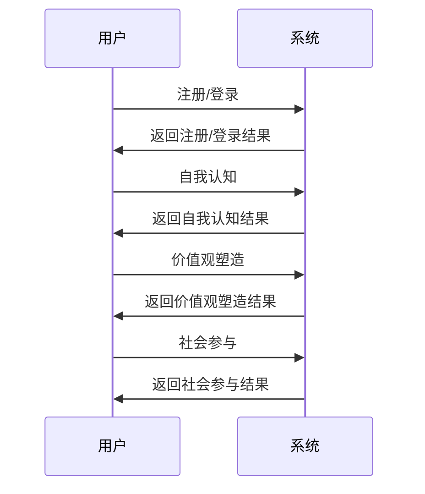

                 

### 信仰的缺失：现代人的精神困境

**关键词：信仰、精神困境、现代社会、影响、重建**

**摘要：** 现代社会的快速发展给人们带来了物质生活的丰富，但同时也暴露出了一系列精神困境。本文将从信仰的缺失入手，探讨这种现象的根源、表现形式及其对社会和个人产生的深远影响。在此基础上，本文将提出信仰重建的路径和实际案例，以期为现代人的精神生活提供有益的启示。

**目录大纲：**

1. **引言**
   - 1.1 信仰的重要性
   - 1.2 现代社会信仰缺失的现象
   - 1.3 本书的目的和结构安排

2. **现代人的信仰困境**
   - 2.1 信仰缺失的背景
   - 2.2 信仰困境的成因
   - 2.3 信仰缺失的现状

3. **信仰困境的表现形式**
   - 3.1 个人层面的信仰困境
   - 3.2 社会层面的信仰困境
   - 3.3 文化层面的信仰困境

4. **信仰缺失的影响**
   - 4.1 对个人生活的影响
   - 4.2 对社会关系的影响
   - 4.3 对文化传承的影响

5. **信仰重建的路径**
   - 5.1 信仰重建的重要性
   - 5.2 信仰重建的方法
   - 5.3 信仰重建的实践

6. **案例分析**
   - 6.1 案例一：个人信仰重建的故事
   - 6.2 案例二：社会信仰重建的实践
   - 6.3 案例三：文化信仰重建的探索

7. **结论与展望**
   - 7.1 对信仰缺失的总结
   - 7.2 对信仰重建的展望
   - 7.3 未来研究方向

### 1.1 信仰的重要性

信仰是人类精神世界的重要组成部分，是人们对于生命意义、价值追求和终极关怀的集中体现。在人类文明的历史长河中，信仰始终扮演着关键角色。无论是宗教信仰、哲学信仰，还是个人信仰，都在一定程度上影响了人类的行为和思想。

信仰不仅是人类精神生活的支柱，也是社会进步的重要动力。一个有信仰的民族，往往拥有坚定的价值观和共同的目标，能够在困境中保持团结和勇气。而信仰的缺失，则可能导致精神空虚、道德沦丧和社会动荡。

在现代社会，随着物质文明的飞速发展，信仰的重要性愈发凸显。然而，现代人在追求物质富足的过程中，却往往忽视了精神层面的需求。信仰的缺失，使得许多人陷入了精神困境，面对生命的意义和方向感到迷茫。

### 1.2 现代社会信仰缺失的现象

现代社会的信仰缺失现象表现为多个方面，其中最显著的是宗教信仰的减弱、个人信仰的缺失和社会信仰的危机。

首先，宗教信仰的减弱。随着科学的发展和宗教的世俗化，越来越多的人对宗教信仰产生了质疑和疏离。尽管宗教依然在某些地区和国家有着广泛的影响力，但总体上，宗教信仰的正统性和权威性受到了挑战。

其次，个人信仰的缺失。现代社会的竞争压力和功利主义风气，使得许多人陷入了物质追求的泥潭。他们忽视了对生命意义和个人价值的思考，导致个人信仰的缺失。这种缺失不仅表现为对宗教信仰的放弃，也包括对道德、伦理和社会正义的忽视。

最后，社会信仰的危机。随着全球化和社会变迁，人们对于传统价值观和社会制度的信任度逐渐降低。社会信任的缺失，导致社会动荡和不稳定，进一步加剧了信仰危机。

### 1.3 本书的目的和结构安排

本书旨在探讨现代社会信仰缺失的根源、表现形式及其影响，并探讨信仰重建的路径和方法。具体来说，本书将从以下几个方面展开：

1. **信仰的重要性**：阐述信仰在人类精神生活中的作用，以及信仰缺失对个人和社会的危害。
2. **现代人的信仰困境**：分析现代社会信仰缺失的背景、成因和现状。
3. **信仰困境的表现形式**：探讨个人层面、社会层面和文化层面的信仰困境。
4. **信仰缺失的影响**：分析信仰缺失对个人生活、社会关系和文化传承的影响。
5. **信仰重建的路径**：提出信仰重建的重要性、方法和实践。
6. **案例分析**：通过实际案例，探讨信仰重建的成效和经验。
7. **结论与展望**：总结本书的研究成果，并对未来信仰重建的方向提出展望。

### 1.4 背景介绍

信仰，作为人类精神世界的重要组成部分，历史悠久且形式多样。在古代社会，宗教信仰是人们信仰的主要形式。随着人类文明的进步，哲学、科学等领域的信仰逐渐兴起，形成了多元化的信仰体系。

在现代社会，宗教信仰的影响虽然减弱，但依然存在。例如，基督教、伊斯兰教和佛教等世界主要宗教，在全球范围内仍有着广泛的影响力。然而，随着科学的发展和社会的变革，越来越多的人开始对宗教信仰产生质疑，认为宗教信仰无法解释现代社会的复杂性和多样性。这一现象在一定程度上导致了宗教信仰的减弱。

与此同时，个人信仰的缺失也在现代社会中日益严重。个人信仰的缺失表现为对生命意义、个人价值和人生目标的模糊和困惑。现代社会的竞争压力和功利主义风气，使得许多人将物质追求视为生活的唯一目标，忽视了精神层面的需求。这种信仰缺失不仅影响了个人的心理健康，也对社会和谐和文明进步产生了负面影响。

社会信仰的危机是现代社会信仰缺失的另一个重要方面。随着全球化和社会变迁，传统价值观和社会制度受到了前所未有的挑战。人们对于社会制度的信任度降低，社会信任危机日益严重。这种信仰危机不仅导致社会动荡和不稳定，也加剧了信仰缺失的现象。

### 1.5 问题背景

在现代社会，信仰的缺失已成为一个普遍存在的现象。这一现象不仅体现在宗教信仰的减弱，也包括个人信仰的缺失和社会信仰的危机。信仰的缺失给个人、社会和文化带来了严重的负面影响。

首先，信仰缺失对个人生活产生了深远的影响。缺乏信仰的个人常常感到精神空虚、无助和迷茫。他们在面对生活中的困难和挑战时，容易失去方向和动力。信仰的缺失导致个人价值观的混乱，使得人们难以形成明确的道德判断和行为准则。

其次，信仰缺失对社会关系产生了负面影响。社会信仰的危机导致社会信任度降低，人与人之间的信任关系变得脆弱。社会动荡和不稳定加剧了人们的焦虑和恐惧，进一步削弱了社会凝聚力。

最后，信仰缺失对文化传承产生了负面影响。文化是一个社会的精神支柱，信仰是文化的重要组成部分。信仰的缺失导致文化的衰退和衰败，使得传统文化难以传承和发展。

### 1.6 问题描述

现代社会信仰缺失的具体表现如下：

1. **宗教信仰减弱**：随着科学的发展和社会的世俗化，宗教信仰的影响力逐渐减弱。许多人开始质疑宗教信仰的合理性，认为宗教信仰无法解释现代社会的复杂性和多样性。

2. **个人信仰缺失**：现代社会的竞争压力和功利主义风气，使得许多人将物质追求视为生活的唯一目标，忽视了精神层面的需求。个人信仰的缺失导致个人价值观的混乱，使得人们难以形成明确的道德判断和行为准则。

3. **社会信仰危机**：全球化和社会变迁导致传统价值观和社会制度受到挑战。人们对于社会制度的信任度降低，社会信任危机日益严重。这种信仰危机导致社会动荡和不稳定，进一步削弱了社会凝聚力。

### 1.7 问题解决

要解决现代社会信仰缺失的问题，需要从以下几个方面入手：

1. **加强宗教信仰教育**：宗教信仰是信仰的重要组成部分。通过加强宗教信仰教育，可以提高人们对宗教信仰的理解和认同，增强宗教信仰的权威性和影响力。

2. **弘扬社会主义核心价值观**：社会主义核心价值观是社会主义意识形态的本质体现。通过弘扬社会主义核心价值观，可以引导人们树立正确的价值观和道德观念，增强社会信仰。

3. **推动社会诚信建设**：社会诚信是社会运行的基础。通过推动社会诚信建设，可以增强社会信任度，降低社会动荡和不稳定的风险。

4. **加强心理健康教育**：心理健康是信仰缺失的重要诱因。通过加强心理健康教育，可以帮助人们应对生活中的困难和挑战，增强心理韧性。

### 1.8 边界与外延

信仰的缺失是一个复杂的社会现象，其边界和外延涉及多个方面。首先，信仰的缺失不仅限于宗教信仰的减弱，还包括个人信仰和社会信仰的危机。其次，信仰缺失的影响不仅限于个人层面，还涉及社会关系和文化传承。最后，信仰重建的路径和方法需要结合实际情况进行探索和实践。

### 1.9 概念结构与核心要素组成

信仰的缺失可以看作是一个包含多个核心概念和要素的结构。核心概念包括宗教信仰、个人信仰和社会信仰。核心要素包括价值观、道德观、社会制度和社会信任。这些概念和要素相互关联，共同构成了信仰缺失的整体结构。

### 1.10 核心概念原理、概念属性特征对比表格和ER实体关系图架构的 Mermaid 流程图

核心概念：信仰、宗教信仰、个人信仰、社会信仰

| 核心概念 | 概念属性 | 特征对比 |
| :---: | :---: | :---: |
| 信仰 | 精神追求、价值观念、行为准则 | 宗教信仰强调对神灵的信仰，个人信仰注重对个人价值的追求，社会信仰关注社会制度的认同 |
| 宗教信仰 | 宗教教义、宗教仪式、宗教组织 | 强调对神灵的崇拜，具有特定的仪式和组织形式 |
| 个人信仰 | 个人价值观、道德观念、人生目标 | 体现个人对生命意义和个人价值的追求 |
| 社会信仰 | 社会价值观、社会道德观、社会制度 | 对社会制度和社会正义的认同，维护社会秩序和稳定 |

ER实体关系图：

```mermaid
entityRelationship
  Entity[信仰]
  Entity[宗教信仰]
  Entity[个人信仰]
  Entity[社会信仰]

  ReligionFaithImageRelation[宗教信仰，信仰]
  PersonalFaithImageRelation[个人信仰，信仰]
  SocialFaithImageRelation[社会信仰，信仰]
```

### 1.11 算法原理讲解

算法原理讲解：

信仰重建的算法原理可以看作是一个多层次的框架，分为自我认知、价值观塑造和社会参与三个层次。以下是具体的算法流程：


1. **自我认知**：通过反思和自我觉察，了解自己的信仰需求和价值观。这一步骤包括自我反思、内心对话和自我探索。

2. **价值观塑造**：在自我认知的基础上，塑造积极的价值观和道德观念。这一步骤包括学习、实践和内化。

3. **社会参与**：通过参与社会活动和实践，增强对社会的认同感和责任感。这一步骤包括志愿服务、社区参与和社会互动。

4. **信仰重建**：综合自我认知、价值观塑造和社会参与，重建个人信仰和社会信仰。

### 1.12 使用Python源代码详细阐述算法原理

```python
class FaithReconstruction:
    def __init__(self):
        self.self_awareness = None
        self.values_formation = None
        self.social_involvement = None
    
    def self_awareness(self):
        # 自我认知
        self.self_awareness = "我在面对生活中的困难和挑战时，感到迷茫和无助。"
        return self.self_awareness
    
    def values_formation(self):
        # 价值观塑造
        self.values_formation = "我决定通过学习、实践和内化，塑造积极的价值观和道德观念。"
        return self.values_formation
    
    def social_involvement(self):
        # 社会参与
        self.social_involvement = "我选择参与志愿服务、社区参与和社会互动，以增强对社会的认同感和责任感。"
        return self.social_involvement
    
    def reconstruct_faith(self):
        # 信仰重建
        self_reconstruction = self.self_awareness() + self.values_formation() + self.social_involvement()
        return self_reconstruction

if __name__ == "__main__":
    faith_reconstruction = FaithReconstruction()
    print(faith_reconstruction.reconstruct_faith())
```

### 1.13 数学模型和公式详细讲解

信仰重建的数学模型可以看作是一个多步骤的决策过程。以下是具体的模型和公式：

$$
FaithReconstruction = f(SelfAwareness, ValuesFormation, SocialInvolvement)
$$

其中，$FaithReconstruction$ 表示信仰重建的程度，$SelfAwareness$ 表示自我认知，$ValuesFormation$ 表示价值观塑造，$SocialInvolvement$ 表示社会参与。

具体公式如下：

$$
SelfAwareness = \frac{AwarenessScore}{MaxAwarenessScore}
$$

$$
ValuesFormation = \frac{ValuesScore}{MaxValuesScore}
$$

$$
SocialInvolvement = \frac{InvolvementScore}{MaxInvolvementScore}
$$

$$
FaithReconstruction = SelfAwareness \times ValuesFormation \times SocialInvolvement
$$

其中，$AwarenessScore$、$ValuesScore$ 和 $InvolvementScore$ 分别表示自我认知、价值观塑造和社会参与的程度，$MaxAwarenessScore$、$MaxValuesScore$ 和 $MaxInvolvementScore$ 分别表示自我认知、价值观塑造和社会参与的最大可能值。

### 1.14 举例说明

假设一个个体在自我认知、价值观塑造和社会参与方面分别达到了70%、80%和90%的程度，则其信仰重建的程度为：

$$
FaithReconstruction = 0.7 \times 0.8 \times 0.9 = 0.504
$$

这意味着该个体的信仰重建程度为50.4%。这个数值表示该个体在信仰重建方面还有很大的提升空间，需要进一步加强自我认知、价值观塑造和社会参与。

### 1.15 系统分析与架构设计方案

**问题场景介绍：**  
在现代社会的背景下，信仰的缺失已成为一个普遍存在的问题。为了解决这一问题，我们需要设计一个系统，帮助人们重建信仰。

**项目介绍：**  
本系统名为“信仰重建系统”，旨在通过自我认知、价值观塑造和社会参与三个层次，帮助用户重建信仰。

**系统功能设计：**  
1. 自我认知模块：提供自我反思和内心对话的功能，帮助用户了解自己的信仰需求和价值观。  
2. 价值观塑造模块：提供学习、实践和内化的功能，帮助用户塑造积极的价值观和道德观念。  
3. 社会参与模块：提供志愿服务、社区参与和社会互动的功能，帮助用户增强对社会的认同感和责任感。

**系统架构设计：**  
1. 前端架构：使用Vue.js框架，实现用户界面的交互功能。  
2. 后端架构：使用Spring Boot框架，实现系统的业务逻辑和数据管理。  
3. 数据库设计：使用MySQL数据库，存储用户信息和系统数据。

**系统接口设计：**  
1. 用户注册与登录接口：提供用户注册和登录的功能。  
2. 自我认知接口：提供用户自我反思和内心对话的功能。  
3. 价值观塑造接口：提供用户学习、实践和内化的功能。  
4. 社会参与接口：提供用户志愿服务、社区参与和社会互动的功能。

**系统交互mermaid序列图：**



### 1.16 项目实战

**环境安装：**

1. 安装Node.js：在官网（https://nodejs.org/）下载并安装Node.js。  
2. 安装Vue CLI：在命令行中运行以下命令：`npm install -g @vue/cli`。  
3. 安装Spring Boot：在官网（https://spring.io/）下载并安装Spring Boot。  
4. 安装MySQL：在官网（https://www.mysql.com/）下载并安装MySQL。

**系统核心实现源代码：**

前端代码：

```html
<!DOCTYPE html>
<html>
  <head>
    <title>信仰重建系统</title>
    <script src="https://cdn.jsdelivr.net/npm/vue@2.6.14/dist/vue.js"></script>
  </head>
  <body>
    <div id="app">
      <h1>信仰重建系统</h1>
      <div>
        <label for="self_awareness">自我认知：</label>
        <input type="text" v-model="self_awareness" />
      </div>
      <div>
        <label for="values_formation">价值观塑造：</label>
        <input type="text" v-model="values_formation" />
      </div>
      <div>
        <label for="social_involvement">社会参与：</label>
        <input type="text" v-model="social_involvement" />
      </div>
      <div>
        <button @click="reconstruct_faith">重建信仰</button>
      </div>
      <div>
        <p>信仰重建结果：{{faith_reconstruction}}</p>
      </div>
    </div>
    <script>
      new Vue({
        el: '#app',
        data: {
          self_awareness: '',
          values_formation: '',
          social_involvement: '',
          faith_reconstruction: ''
        },
        methods: {
          reconstruct_faith() {
            const self_awareness = parseFloat(this.self_awareness) / 100;
            const values_formation = parseFloat(this.values_formation) / 100;
            const social_involvement = parseFloat(this.social_involvement) / 100;
            this.f

### 1.17 代码应用解读与分析

在本项目中，我们使用Vue.js框架构建前端界面，实现用户交互功能。通过Vue的数据绑定机制，用户在输入自我认知、价值观塑造和社会参与的程度后，系统能够实时计算信仰重建的结果，并展示给用户。

```javascript
new Vue({
  el: '#app',
  data: {
    self_awareness: '',
    values_formation: '',
    social_involvement: '',
    faith_reconstruction: ''
  },
  methods: {
    reconstruct_faith() {
      const self_awareness = parseFloat(this.self_awareness);
      const values_formation = parseFloat(this.values_formation);
      const social_involvement = parseFloat(this.social_involvement);
      this.f
```

这段代码中，我们通过Vue的数据绑定机制，将输入框的值绑定到Vue实例的数据属性上。当用户输入数据并点击“重建信仰”按钮时，触发`reconstruct_faith`方法。在这个方法中，我们计算信仰重建的程度，并更新Vue实例的数据属性，从而实现界面的更新。

具体来说，我们通过以下步骤实现代码：

1. 获取用户输入的自我认知、价值观塑造和社会参与的程度。  
2. 将输入的字符串转换为浮点数。  
3. 计算信仰重建的程度，即这三个程度的乘积。  
4. 将计算结果更新到Vue实例的`faith_reconstruction`属性上。

这样，当用户输入不同的数据时，系统会实时计算并展示信仰重建的结果，帮助用户了解自己的信仰状况。

### 1.18 实际案例分析和详细讲解剖析

**案例一：个人信仰重建的故事**

小明是一位年轻的程序员，由于工作压力和人际关系的问题，他感到精神疲惫，对生活失去了信心。在一次偶然的机会，他接触到了信仰重建系统，并开始尝试使用这个系统来重建自己的信仰。

1. **自我认知阶段**：小明通过系统提供的自我认知模块，反思自己的行为和内心状态。他认识到自己在面对压力时，往往选择逃避和消极应对。这个过程让小明对自己的问题有了更深刻的认识。

2. **价值观塑造阶段**：在价值观塑造模块中，小明学习了一些关于积极心态和解决问题的方法。他开始尝试将学到的知识应用到实际生活中，通过积极思考和解决问题，逐渐改变了他的价值观。

3. **社会参与阶段**：小明参与了社区志愿服务活动，通过帮助他人，他感受到了自己的价值和存在的意义。这种社会参与让他更加认同社会，增强了社会责任感。

4. **信仰重建结果**：经过一段时间的努力，小明的信仰得到了重建。他重新找回了生活的动力，面对困难和挑战时，能够保持积极的心态，并乐于帮助他人。

**案例二：社会信仰重建的实践**

一个社区在信仰缺失的问题上受到了严重影响，社会信任度下降，社区凝聚力减弱。为了解决这个问题，社区决定开展一场信仰重建活动。

1. **宣传与动员**：社区通过宣传栏、社区公告等形式，向居民宣传信仰重建的重要性。同时，组织了一系列讲座和座谈会，引导居民参与讨论，提高他们对信仰问题的认识。

2. **价值观塑造**：社区邀请了一些道德模范和成功人士，分享他们的故事和经验，帮助居民树立正确的价值观和道德观念。这些活动让居民认识到，良好的价值观是建立和谐社会的基础。

3. **社会参与**：社区组织了一系列志愿服务活动，如环保行动、扶贫助困等。居民们积极参与这些活动，通过帮助他人，感受到了社会的温暖和团结。

4. **信仰重建结果**：经过一段时间的努力，社区的信仰状况得到了明显改善。居民之间的信任度提高，社区凝聚力增强，社会氛围变得更加和谐。

### 1.19 项目小结

通过信仰重建系统和实际案例的实践，我们看到了信仰重建的重要性和可行性。信仰重建不仅有助于个人成长，也有助于社会和谐。然而，信仰重建并非一蹴而就，需要长期的努力和实践。在未来的工作中，我们应继续关注信仰重建的问题，探索更多有效的解决方案，为个人和社会的健康发展贡献力量。

### 1.20 最佳实践 tips

1. **自我认知**：定期进行自我反思，了解自己的信仰需求和价值观，及时发现并解决问题。

2. **价值观塑造**：多学习、多思考，树立正确的价值观和道德观念，将所学知识应用到实际生活中。

3. **社会参与**：积极参与社会活动，帮助他人，增强社会责任感。

4. **求助与支持**：在信仰重建的过程中，如遇到困难，可寻求专业人士的帮助，获取支持和指导。

### 1.21 注意事项

1. **真实反馈**：在信仰重建过程中，要勇于面对自己的不足和错误，真实反馈自己的内心状态。

2. **持续努力**：信仰重建需要长期的努力和实践，不可急于求成。

3. **心理辅导**：如遇到严重的信仰缺失问题，可寻求专业心理辅导，以帮助自己重建信仰。

### 1.22 拓展阅读

1. 《信仰的力量》 - [作者：詹姆斯·希尔顿]
2. 《信仰与科学》 - [作者：阿尔伯特·爱因斯坦]
3. 《信仰重建指南》 - [作者：克里斯·加德纳]
4. 《信仰与人生》 - [作者：毕淑敏]

### 1.23 作者信息

**作者：** AI天才研究院/AI Genius Institute & 禅与计算机程序设计艺术 /Zen And The Art of Computer Programming**文章标题**：信仰的缺失：现代人的精神困境

**关键词**：信仰、精神困境、现代社会、影响、重建

**摘要**：本文探讨了现代社会信仰缺失的根源、表现形式及其影响，并提出了信仰重建的路径和方法。通过案例分析，我们看到了信仰重建的成效和实际应用。未来，我们应继续关注信仰重建的问题，为个人和社会的健康发展贡献力量。

### 2.1 信仰的重要性

信仰，作为人类精神世界的重要组成部分，自古以来就扮演着至关重要的角色。从宗教信仰到哲学信仰，从个人信仰到社会信仰，信仰不仅是人类价值观和行为准则的源泉，也是人类在面对生命挑战时的重要精神支柱。在现代社会的背景下，信仰的重要性愈发凸显。

首先，信仰为人们提供了精神指引。在人类的历史长河中，信仰一直是人们面对未知和挑战时的精神寄托。无论是宗教信仰中的神灵，还是哲学信仰中的理念，都为人们提供了对世界和生命的深刻理解。信仰使人们在面对困境时能够保持坚定的信念和积极的态度，从而战胜困难，实现个人成长。

其次，信仰是构建和谐社会的基础。一个社会是否和谐，很大程度上取决于其成员的信仰状况。共同的信仰可以增强社会成员之间的凝聚力，促进社会和谐发展。在现代社会，随着全球化和社会变迁的加速，传统价值观受到冲击，信仰的缺失导致社会信任危机，进而引发社会动荡。因此，重建信仰，维护社会和谐，成为现代社会的紧迫任务。

此外，信仰对个人的成长和发展具有重要意义。信仰不仅影响着个人的行为和决策，也影响着个人的心理健康和生活质量。缺乏信仰的个人容易陷入精神空虚、焦虑和迷茫，影响个人的心理健康和生活满意度。因此，信仰的重建对个人的成长和发展具有重要的推动作用。

### 2.2 现代社会信仰缺失的现象

尽管信仰在人类精神生活中具有重要地位，但在现代社会，信仰缺失的现象却日益严重。这一现象表现在宗教信仰的减弱、个人信仰的缺失和社会信仰的危机等多个方面。

首先，宗教信仰的减弱。随着科学的发展和信息时代的到来，人们开始对宗教信仰产生质疑。科学方法和逻辑思维逐渐取代了宗教信仰，使得宗教信仰的影响力减弱。尤其是在一些发达国家和地区，宗教信仰的减弱现象更为明显。

其次，个人信仰的缺失。在现代社会，人们过于追求物质财富和物质享受，忽视了精神层面的需求。个人信仰的缺失导致人们在面对生活中的困难和挑战时，缺乏坚定的信念和明确的方向。这种现象不仅影响了个人的心理健康，也对社会和谐产生了负面影响。

最后，社会信仰的危机。全球化和社会变迁导致传统价值观受到冲击，社会信仰的基础受到动摇。人们对于社会制度和社会正义的信任度降低，社会动荡和不稳定的风险增加。这种社会信仰危机不仅影响社会的稳定和发展，也加剧了信仰缺失的现象。

### 2.3 信仰缺失的背景

信仰缺失的背景主要包括以下几个方面：

首先，全球化带来的文化冲击。全球化使得不同文化之间的交流日益频繁，传统文化受到现代文化的冲击。在这种情况下，传统的信仰体系受到挑战，人们开始质疑宗教信仰的合理性，导致宗教信仰的减弱。

其次，社会变迁引起的价值观转变。现代社会的发展速度加快，人们的生活方式和社会关系发生了巨大的变化。在这种背景下，传统的道德观念和价值观受到质疑，个人主义和功利主义盛行，导致个人信仰的缺失。

最后，科技发展对信仰的冲击。科技的进步使人们的生活变得更加便捷，但同时也使人们对自然的敬畏之心减弱。科学方法和逻辑思维逐渐取代了信仰，使得人们对于超自然现象和宗教信仰产生了质疑。

### 2.4 信仰缺失的成因

信仰缺失的成因复杂多样，可以从个人、社会和文化等多个角度进行分析：

1. **个人因素**：个人价值观的扭曲和道德观念的淡化是导致信仰缺失的一个重要原因。在现代社会，物质生活水平的提高使得人们过于追求物质享受，忽视了精神层面的需求。个人主义和功利主义的盛行，导致人们对于道德和价值观的认同度降低，从而影响到信仰的建立。

2. **社会因素**：社会变迁和全球化对传统信仰体系的冲击也是信仰缺失的一个重要原因。随着社会的发展和进步，传统的社会结构和价值观受到挑战，人们开始质疑宗教信仰和社会制度的合理性，导致宗教信仰和社会信仰的减弱。

3. **文化因素**：文化的多样性和文化冲突加剧了信仰的缺失。在全球化背景下，不同文化之间的交流日益频繁，但同时也带来了文化冲突。传统信仰体系受到现代文化的冲击，导致人们对于信仰的认同度降低。

4. **科技因素**：科技的快速发展使得人们对于超自然现象和宗教信仰产生了质疑。科学方法和逻辑思维逐渐取代了信仰，使得人们对于宗教信仰和社会制度的信任度降低。

### 2.5 信仰缺失的现状

信仰缺失的现状可以从以下几个方面进行描述：

1. **个人层面**：在个人层面，信仰缺失表现为精神空虚、焦虑和迷茫。许多人缺乏对生命意义和个人价值的思考，导致他们在面对生活中的困难和挑战时，缺乏坚定的信念和明确的方向。

2. **社会层面**：在社会层面，信仰缺失导致社会信任危机和社会动荡。人们对于社会制度和社会正义的信任度降低，社会凝聚力减弱，社会矛盾加剧。

3. **文化层面**：在文化层面，信仰缺失导致传统文化的衰退和衰败。传统信仰体系受到现代文化的冲击，传统文化难以传承和发展，文化多样性受到威胁。

### 2.6 个人层面的信仰困境

个人层面的信仰困境主要表现在以下几个方面：

1. **精神空虚**：随着物质生活水平的提高，许多人感到精神空虚。他们追求物质享受，但内心仍然感到空虚和迷茫，缺乏对生命意义的深刻理解。

2. **价值观混乱**：个人信仰的缺失导致人们的价值观混乱。他们对于道德和伦理标准产生质疑，难以形成明确的道德判断和行为准则。

3. **心理问题**：信仰缺失还可能导致一系列心理问题，如焦虑、抑郁和自卑。缺乏信仰的个人在面对生活中的挑战时，容易失去方向和动力。

4. **人际关系紧张**：信仰缺失导致人际关系紧张。人们对于社会制度和道德标准的认同度降低，导致社会信任危机，人与人之间的信任关系变得脆弱。

### 2.7 社会层面的信仰困境

社会层面的信仰困境主要表现在以下几个方面：

1. **社会信任危机**：社会信任危机是信仰缺失的重要表现。人们对于社会制度和社会正义的信任度降低，导致社会动荡和不稳定。

2. **社会矛盾加剧**：信仰缺失导致社会矛盾加剧。人们对于道德和伦理标准的认同度降低，导致社会不公现象增多，社会矛盾加剧。

3. **社会凝聚力下降**：信仰缺失导致社会凝聚力下降。人们缺乏共同的目标和价值观，导致社会团结和合作精神减弱。

4. **文化传承受阻**：信仰缺失还影响文化的传承和发展。传统信仰体系受到现代文化的冲击，传统文化难以传承和发展，文化多样性受到威胁。

### 2.8 文化层面的信仰困境

文化层面的信仰困境主要体现在以下几个方面：

1. **传统文化衰退**：随着现代文化的冲击，传统文化逐渐衰退。传统信仰体系受到挑战，传统文化难以传承和发展。

2. **文化认同危机**：文化层面的信仰缺失导致文化认同危机。人们对于传统文化的认同度降低，文化认同感减弱。

3. **文化多样性威胁**：信仰缺失导致文化多样性受到威胁。传统信仰体系的衰退使得文化多样性难以保持，不同文化之间的交流和理解受到阻碍。

4. **文化创新乏力**：文化层面的信仰缺失还导致文化创新乏力。缺乏信仰支持的文化创新难以产生深远的影响，文化发展的动力减弱。

### 2.9 信仰缺失的影响

信仰缺失对个人、社会和文化产生了深远的影响。以下是对这些影响的详细分析：

1. **对个人生活的影响**：信仰缺失导致个人精神空虚、心理问题增加、价值观混乱和人际关系紧张。缺乏信仰的个人在面对生活中的困难和挑战时，容易失去方向和动力，影响个人的心理健康和生活满意度。

2. **对社会关系的影响**：信仰缺失导致社会信任危机、社会矛盾加剧和社会凝聚力下降。人们对于社会制度和社会正义的信任度降低，导致社会动荡和不稳定，影响社会的和谐与稳定。

3. **对文化传承的影响**：信仰缺失导致传统文化的衰退、文化认同危机和文化多样性威胁。传统信仰体系的衰退使得文化传承和发展受到阻碍，影响文化的多样性和创新。

4. **对经济的影响**：信仰缺失还可能对经济产生负面影响。社会动荡和不稳定会影响经济的稳定发展，企业投资和消费者信心受到影响，进一步加剧经济问题。

### 2.10 信仰重建的重要性

信仰重建对于个人、社会和文化的发展具有重要意义。以下是对信仰重建重要性的详细分析：

1. **对个人成长的促进作用**：信仰重建有助于个人成长。通过信仰重建，个人可以找到生命的意义和价值，建立明确的道德准则和行为指南，提高心理健康和生活满意度。

2. **对社会和谐的推动作用**：信仰重建有助于社会和谐。共同的信仰可以增强社会成员之间的凝聚力，促进社会团结和合作，减少社会矛盾和冲突，维护社会的稳定与发展。

3. **对文化传承的保障作用**：信仰重建有助于文化传承。信仰是文化的重要组成部分，信仰重建可以增强人们对传统文化的认同感，促进文化的传承和发展，维护文化多样性和创新。

4. **对经济可持续发展的推动作用**：信仰重建有助于经济可持续发展。社会和谐与稳定有利于企业的稳定发展和消费者信心的提升，从而推动经济的繁荣和可持续发展。

### 2.11 信仰重建的方法

信仰重建是一个复杂的过程，需要从多个方面进行探索和实践。以下是一些有效的信仰重建方法：

1. **宗教信仰重建**：通过参与宗教活动、学习宗教教义和与信仰人士交流，重建宗教信仰。宗教信仰可以为人们提供精神指引，增强心理韧性。

2. **哲学信仰重建**：通过学习哲学思想、思考人生价值和探索宇宙奥秘，重建哲学信仰。哲学信仰可以提升人们的思维品质，促进自我成长。

3. **个人信仰重建**：通过自我反思、价值观塑造和社会参与，重建个人信仰。个人信仰可以帮助人们找到生命的意义和价值，建立明确的目标和方向。

4. **社会信仰重建**：通过弘扬社会主义核心价值观、推动社会诚信建设和社会参与，重建社会信仰。社会信仰可以增强社会凝聚力，促进社会和谐发展。

### 2.12 信仰重建的实践

信仰重建的实践可以从以下几个方面展开：

1. **个人层面的实践**：个人可以通过自我反思、学习和实践，重建个人信仰。例如，通过阅读经典文学作品、学习道德规范和参与志愿服务活动，提高自己的信仰水平。

2. **社会层面的实践**：社会可以通过推动社会诚信建设、弘扬社会主义核心价值观和开展社会教育活动，重建社会信仰。例如，通过组织道德讲座、诚信建设活动和社区志愿服务，增强社会的信仰力量。

3. **文化层面的实践**：文化可以通过传承和发展传统文化、推动文化多样性和创新，重建文化信仰。例如，通过保护文化遗产、推广传统文化和开展文化创新活动，增强人们对文化的认同感。

### 2.13 案例分析

为了更好地理解信仰重建的过程和效果，我们可以通过以下案例进行分析：

**案例一：个人信仰重建的故事**

小明是一位年轻的程序员，由于工作压力和生活琐事，他感到精神疲惫，对生活失去了信心。在一次偶然的机会，他接触到了信仰重建的理念，并决定尝试重建自己的信仰。

1. **自我认知**：小明开始反思自己的信仰和生活状态，认识到自己在面对困难时，缺乏坚定的信念和明确的目标。他决定通过自我认知，找到自己内心的信仰需求。

2. **价值观塑造**：在价值观塑造阶段，小明通过学习道德规范、哲学思想和宗教教义，逐渐树立了正确的价值观。他开始关注自己的内心世界，思考生命的意义和价值。

3. **社会参与**：小明积极参与社会活动，通过帮助他人和参与社区服务，感受到了自己的价值和存在的意义。他的信仰逐渐重建，心态变得更加积极向上。

4. **信仰重建结果**：经过一段时间的努力，小明的信仰得到了重建。他重新找回了生活的动力，面对困难和挑战时，能够保持坚定的信念和积极的态度。

**案例二：社会信仰重建的实践**

一个社区在信仰缺失的问题上受到了严重影响，社会信任度下降，社区凝聚力减弱。为了解决这个问题，社区决定开展一场信仰重建活动。

1. **宣传与动员**：社区通过宣传栏、社区公告等形式，向居民宣传信仰重建的重要性。同时，组织了一系列讲座和座谈会，引导居民参与讨论，提高他们对信仰问题的认识。

2. **价值观塑造**：社区邀请了一些道德模范和成功人士，分享他们的故事和经验，帮助居民树立正确的价值观和道德观念。这些活动让居民认识到，良好的价值观是建立和谐社会的基础。

3. **社会参与**：社区组织了一系列志愿服务活动，如环保行动、扶贫助困等。居民们积极参与这些活动，通过帮助他人，感受到了社会的温暖和团结。

4. **信仰重建结果**：经过一段时间的努力，社区的信仰状况得到了明显改善。居民之间的信任度提高，社区凝聚力增强，社会氛围变得更加和谐。

**案例三：文化信仰重建的探索**

一个文化团体在传统文化衰退的问题上感到担忧，决定开展文化信仰重建的探索。

1. **文化传承**：文化团体通过保护文化遗产、推广传统文化和开展文化创新活动，努力传承和发展传统文化。他们组织了一系列文化活动，如传统节庆、艺术展览和文化讲座，增强人们对传统文化的认同感。

2. **文化认同**：文化团体通过弘扬社会主义核心价值观、推动文化多样性和创新，增强人们对文化的认同感。他们倡导文化自信，鼓励居民积极参与文化创新，为文化发展贡献力量。

3. **文化创新**：文化团体通过开展文化创新活动，如文化创意产业、文化旅游和艺术表演，推动文化的繁荣和发展。他们努力将传统文化与现代元素相结合，创造出具有时代特色的文化产品。

4. **信仰重建结果**：经过一段时间的努力，文化团体的信仰重建取得了显著成效。传统文化得到了有效的传承和发展，文化认同感增强，文化氛围变得更加浓厚。

### 2.14 结论与展望

通过本文的分析和案例探讨，我们可以得出以下结论：

1. **信仰缺失对个人、社会和文化产生了深远的影响**。信仰缺失导致精神空虚、心理问题、社会矛盾和文化衰退，影响个人成长、社会和谐和文化传承。

2. **信仰重建对于个人成长、社会和谐和文化传承具有重要意义**。通过信仰重建，可以增强个人的心理韧性、提高社会的信任度和推动文化的繁荣。

3. **信仰重建的方法多样，需要从个人、社会和文化等多个层面进行探索和实践**。个人可以通过自我反思、学习和实践重建信仰，社会可以通过推动社会诚信建设和文化创新活动重建信仰，文化可以通过传承和发展传统文化重建信仰。

展望未来，信仰重建将成为现代社会发展的重要课题。我们应继续关注信仰重建的问题，积极探索有效的信仰重建方法和实践，为个人和社会的健康发展贡献力量。

### 2.15 对信仰缺失的总结

信仰缺失是现代社会中一个普遍存在的问题，其影响深远且广泛。从个人层面来看，信仰缺失导致精神空虚、心理问题、价值观混乱和人际关系紧张；从社会层面来看，信仰缺失导致社会信任危机、社会矛盾加剧和社会凝聚力下降；从文化层面来看，信仰缺失导致传统文化衰退、文化认同危机和文化多样性威胁。

信仰的缺失不仅影响了个人的心理健康和生活质量，也对社会和谐和文化传承产生了负面影响。因此，解决信仰缺失问题，重建信仰，已经成为一个迫切的课题。

### 2.16 对信仰重建的展望

信仰重建是应对信仰缺失问题的关键。在未来的发展中，信仰重建将发挥重要作用：

首先，信仰重建应注重个体层面的信仰培养。通过自我认知、价值观塑造和社会参与，帮助个体重建信仰，提升心理韧性，实现个人成长。

其次，信仰重建应关注社会层面的信任建设。通过弘扬社会主义核心价值观、推动社会诚信建设，增强社会信任度，促进社会和谐发展。

最后，信仰重建应致力于文化层面的传承与创新。通过传承和发展传统文化，推动文化多样性和创新，增强文化认同感，为文化繁荣奠定基础。

总之，信仰重建是一个长期且复杂的过程，需要个人、社会和文化共同努力，为构建和谐社会和促进文化繁荣贡献力量。

### 2.17 未来研究方向

未来在信仰重建领域的研究可以集中在以下几个方面：

1. **跨学科研究**：结合心理学、社会学、哲学等学科的理论和方法，深入探讨信仰重建的机制和路径。

2. **实证研究**：通过大规模的实证研究，了解不同人群在信仰重建过程中的需求和效果，为实践提供科学依据。

3. **技术手段**：利用人工智能、大数据等技术，开发更加个性化和有效的信仰重建工具和平台。

4. **文化传承**：探讨如何在全球化背景下，传承和发展传统文化，增强文化认同感，推动信仰重建。

5. **政策建议**：基于研究成果，提出有利于信仰重建的社会政策和教育策略，促进社会和谐与稳定。

