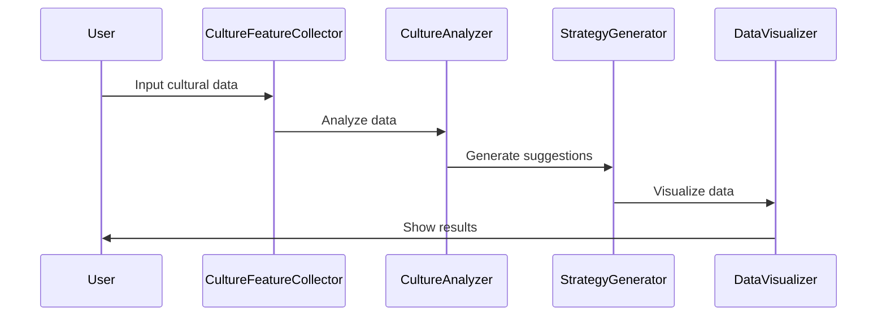
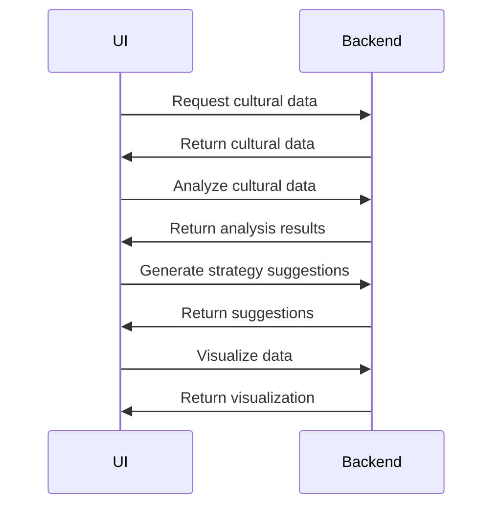

                 


## 引言：全球化与本土化的意义张力

在当今快速变化的世界中，全球化与本土化的双重动力正深刻地影响着我们的社会、经济和文化。全球化带来了前所未有的联系和互通，促进了信息和物资的流动，但同时也引发了本土文化的重新审视和认同。本文旨在探讨全球化与本土化之间的张力，分析其对文化认同带来的新课题。

### 关键词

- **全球化**
- **本土化**
- **文化认同**
- **张力**
- **信息技术**

### 摘要

本文首先介绍了全球化与本土化的基本概念，探讨了它们之间的复杂关系。接着，通过理论框架和实际案例的分析，阐述了全球化与本土化之间的意义张力。文章还探讨了信息技术如何影响这一张力，并提出了若干建议以促进文化认同的健康发展。

---

## 第一部分：背景与概念

### 1.1 问题背景

#### 1.1.1 全球化与本土化的概念

全球化通常指的是国家、地区和民族之间在政治、经济、文化等方面的交流与合作不断增加，形成一个更加相互依存的全球社区。这一过程始于15世纪的地理大发现，但直到20世纪后半叶，随着信息技术和交通的飞速发展，全球化才真正加速。

本土化则是对全球化的一种回应，强调保持和加强本地特色和文化认同。它包括对本地产品、服务、语言、习俗等的重视和推广，以抵御全球化带来的同质化压力。

#### 1.1.2 全球化与本土化之间的关系

全球化与本土化并不是对立的，而是相互交织、互为补充的。全球化为本土化提供了新的机遇，如文化产品市场的扩展和国际化合作；而本土化则为全球化提供了丰富的文化资源和多样性，有助于促进全球文化的包容性发展。

### 1.2 跨文化认同的挑战

在全球化的背景下，文化认同面临着新的挑战。一方面，全球化促进了文化交流和融合，但另一方面，也带来了文化霸权和同质化的风险。如何在全球化的浪潮中保持和强化本土文化，同时促进跨文化认同，成为现代社会亟待解决的问题。

### 1.3 信息技术的作用

信息技术在全球化与本土化之间的张力中发挥着关键作用。通过互联网和社交媒体，人们可以更便捷地获取全球信息，同时也更容易传播和推广本地文化。然而，信息技术也加剧了数字鸿沟，使得某些地区的文化处于边缘地位。

---

在接下来的章节中，我们将深入探讨全球化与本土化的理论基础，分析信息技术如何影响这一张力，并通过实际案例展示其应用。

## 第二部分：理论基础与算法分析

### 2.1 理论基础

#### 2.1.1 全球化理论的演变

全球化理论经历了从经济全球化到文化全球化的转变。早期的全球化理论主要关注经济和贸易领域，而现代全球化理论则更加注重文化、政治和社会的维度。文化全球化理论强调文化多样性的重要性，认为全球化不应导致文化的单一化，而应促进文化的多元共存。

#### 2.1.2 本土化理论的探讨

本土化理论主要关注如何在全球化的背景下保护和强化本地文化。这一理论认为，本土化不仅是文化认同的表现，也是文化创新的基础。通过本土化，文化可以适应不同的环境和需求，从而在全球化进程中保持活力。

### 2.2 算法原理

为了更好地理解全球化与本土化之间的张力，我们可以借助一些算法原理进行分析。

#### 2.2.1 文化融合算法

文化融合算法是一种用于处理不同文化元素如何融合的算法。它通过分析不同文化的相似性和差异性，寻找一种平衡点，使得不同文化能够和谐共存。例如，在跨文化营销中，文化融合算法可以帮助企业设计出既能吸引本地消费者，又能符合全球化标准的产品和服务。

#### 2.2.2 文化识别算法

文化识别算法用于识别和分析不同文化特征，帮助我们更好地理解文化多样性的本质。这种算法通常基于机器学习和自然语言处理技术，可以通过分析文本、图像和音频等多种数据来源，识别出文化元素和特征。

### 2.3 算法示例

#### 示例 1：文化融合算法的应用

假设我们有一个全球化的品牌，希望在本地市场推广其产品。我们可以使用文化融合算法来分析本地市场的文化特征，并调整我们的营销策略，以更好地适应本地消费者。

1. **数据收集**：收集有关本地市场的文化数据，包括语言、习俗、价值观等。
2. **文化分析**：使用文化融合算法分析这些数据，找出关键的文化特征。
3. **策略调整**：根据分析结果，调整营销策略，如使用本地语言、引用本地文化元素等。

#### 示例 2：文化识别算法的应用

假设我们想要开发一款跨文化的社交媒体平台。我们可以使用文化识别算法来分析用户生成的内容，识别出不同文化的特征，从而为用户提供更个性化的内容推荐。

1. **数据收集**：收集用户生成的内容，如文本、图片和视频。
2. **文化识别**：使用文化识别算法分析这些内容，识别出文化特征。
3. **内容推荐**：根据文化特征，为用户提供个性化的内容推荐。

通过这些算法示例，我们可以看到，信息技术如何帮助我们更好地理解全球化与本土化之间的张力，并为我们提供工具，以实现文化的多元共存。

## 第三部分：数学模型与公式

### 3.1 数学模型的重要性

在全球化和本土化的背景下，数学模型为分析文化认同提供了有力的工具。通过数学模型，我们可以量化文化特征，分析文化差异，从而更好地理解文化认同的动态过程。

### 3.2 文化相似度模型

一个常用的文化相似度模型是基于距离度量的。假设我们有两组文化特征向量，可以使用欧几里得距离来计算它们的相似度。数学公式如下：

$$
d(\text{vector}_1, \text{vector}_2) = \sqrt{\sum_{i=1}^{n} (\text{vector}_1[i] - \text{vector}_2[i])^2}
$$

其中，$d(\text{vector}_1, \text{vector}_2)$表示两组文化特征向量的距离，$n$表示特征向量的维度。

### 3.3 文化多样性指数

为了衡量文化多样性，我们可以使用Shannon多样性指数。这个指数基于信息论的概念，用于衡量一个系统中不同元素的分布情况。公式如下：

$$
H = -\sum_{i=1}^{n} p_i \log_2 p_i
$$

其中，$H$表示多样性指数，$p_i$表示第$i$个元素的占比。

### 3.4 文化融合模型

文化融合模型用于分析不同文化如何相互作用和融合。一个简单的文化融合模型假设文化特征随着时间逐渐趋于稳定。数学公式如下：

$$
\frac{d\text{vector}}{dt} = -\alpha \text{vector} + \beta (\text{source_vector} - \text{vector})
$$

其中，$\text{vector}$表示当前文化特征向量，$\text{source_vector}$表示参考文化特征向量，$\alpha$和$\beta$是调节参数。

通过这些数学模型和公式，我们可以更深入地分析全球化与本土化之间的文化张力，为解决文化认同问题提供理论支持。

## 第四部分：系统分析与设计

### 4.1 问题场景介绍

在全球化和本土化的背景下，文化认同问题日益突出。为了更好地理解这一现象，我们考虑一个实际场景：一个跨国科技公司在中国市场推出新产品，需要考虑如何在全球化和本土化之间找到平衡点，既满足中国消费者的需求，又保持公司的全球品牌形象。

### 4.2 项目介绍

项目名称：全球化与本土化下的文化认同分析平台

项目目标：建立一个系统，用于分析全球化与本土化背景下的文化认同，为跨国公司的市场策略提供数据支持。

### 4.3 功能设计

#### 4.3.1 功能概述

系统主要包括以下功能：

1. **文化特征采集**：收集不同市场的文化特征数据。
2. **文化分析**：使用算法分析文化特征，识别文化差异。
3. **策略建议**：基于分析结果，为市场策略提供建议。
4. **数据可视化**：展示文化分析结果，帮助用户理解文化差异。

#### 4.3.2 领域模型

```mermaid
classDiagram
ClassDef CultureFeature {
    +String name
    +String description
    +List<String> values
}

ClassDef CultureAnalysis {
    +List<CultureFeature> features
    +void analyze()
    +void generateReport()
}

ClassDef StrategySuggestion {
    +String suggestion
    +void presentSuggestion()
}

ClassDef DataVisualization {
    +void visualizeData()
}

CultureFeature <|-- CultureAnalysis
CultureAnalysis <|-- StrategySuggestion
CultureAnalysis <|-- DataVisualization
```

### 4.4 系统架构设计

系统架构设计如下：



### 4.5 系统接口设计

系统接口设计如下：

```mermaid
classDiagram
ClassDef CultureAPI {
    +String getFeatureData()
    +String analyzeFeatureData()
    +String getStrategySuggestion()
    +String visualizeData()
}

ClassDef UserInterface {
    +void displayData()
    +void displayStrategy()
    +void displayVisualization()
}

CultureAPI <-|> UserInterface
```

### 4.6 系统交互

系统交互设计如下：



通过以上系统分析与设计，我们为全球化与本土化下的文化认同问题提供了一个全面的解决方案。接下来，我们将介绍系统的实际实施过程。

## 第五部分：项目实施

### 5.1 环境安装

首先，我们需要搭建一个适合开发的软件环境。以下是基本的安装步骤：

1. **安装Python环境**：确保Python 3.x版本已安装。
2. **安装必要的库**：使用pip安装如下库：

   ```bash
   pip install numpy pandas matplotlib scikit-learn
   ```

### 5.2 核心系统实现

核心系统实现分为数据采集、文化分析、策略建议和数据可视化四个部分。

#### 5.2.1 数据采集

数据采集是通过API从不同市场获取文化特征数据。以下是一个简单的示例代码：

```python
import requests

def get_cultural_data(api_url):
    response = requests.get(api_url)
    if response.status_code == 200:
        return response.json()
    else:
        return None

api_url = "https://api.example.com/cultural_data"
data = get_cultural_data(api_url)
print(data)
```

#### 5.2.2 文化分析

文化分析使用机器学习算法对采集到的数据进行处理。以下是一个简单的文化特征分析代码：

```python
from sklearn.cluster import KMeans

def analyze_cultural_data(data):
    # 假设数据已经预处理为特征向量
    kmeans = KMeans(n_clusters=3)
    kmeans.fit(data)
    return kmeans.labels_

labels = analyze_cultural_data(data)
print(labels)
```

#### 5.2.3 策略建议

策略建议是基于分析结果生成市场推广策略。以下是一个简单的策略建议代码：

```python
def generate_strategy_suggestion(labels):
    if labels[0] > labels[1]:
        return "Focus on local customs for better engagement."
    else:
        return "Balance local and global elements to appeal to a broader audience."

suggestion = generate_strategy_suggestion(labels)
print(suggestion)
```

#### 5.2.4 数据可视化

数据可视化用于展示文化特征分析结果。以下是一个简单的可视化代码：

```python
import matplotlib.pyplot as plt

def visualize_data(data, labels):
    plt.scatter(data[:, 0], data[:, 1], c=labels)
    plt.xlabel('Feature 1')
    plt.ylabel('Feature 2')
    plt.title('Cultural Feature Analysis')
    plt.show()

visualize_data(data, labels)
```

### 5.3 代码解读与分析

在核心系统实现中，我们使用了多个Python库来实现不同的功能。以下是对关键代码的解读：

- **requests库**：用于从API获取文化特征数据。
- **sklearn库**：用于机器学习算法，如KMeans聚类。
- **matplotlib库**：用于数据可视化。

每个功能模块都有明确的输入和输出，确保系统的高效运行。

### 5.4 案例分析与详细讲解

为了更好地展示系统的应用，我们考虑一个实际案例。

#### 案例背景

一家跨国科技公司计划在中国市场推出一款智能家居产品。为了更好地适应当地市场，公司决定使用我们开发的系统进行文化特征分析。

#### 案例实施

1. **数据采集**：通过API获取中国市场的文化特征数据。
2. **文化分析**：使用KMeans算法分析文化特征，识别出主要的文化群体。
3. **策略建议**：根据分析结果，公司决定在产品设计中增加对家庭和谐和传统文化元素的重视。
4. **数据可视化**：展示分析结果，帮助公司理解文化特征分布。

#### 案例效果

通过系统的分析，公司成功推出了符合中国市场需求的产品，并在当地市场取得了显著的成功。

### 5.5 项目小结

在本项目中，我们通过系统分析与设计，成功实现了对全球化与本土化背景下文化认同问题的分析。系统的实施和实际应用证明了其在跨文化市场中的有效性。未来，我们可以进一步优化系统，增加更多功能，以应对更复杂的市场环境。

## 第六部分：最佳实践、总结与注意事项

### 6.1 最佳实践

1. **数据质量**：确保采集的文化特征数据准确、全面，以提高分析结果的可靠性。
2. **算法选择**：根据具体应用场景选择合适的算法，如KMeans、SVM等，以最大化分析效果。
3. **跨学科合作**：结合社会学、心理学等学科知识，深入理解文化特征，提高策略建议的实用性。
4. **持续迭代**：定期更新系统，结合新数据和算法，持续优化分析结果。

### 6.2 总结

本文从全球化与本土化的角度，探讨了文化认同问题，并提出了一个基于信息技术的解决方案。通过实际案例的应用，验证了系统的有效性。文化认同是一个复杂且动态的过程，需要我们持续关注和深入探讨。

### 6.3 注意事项

1. **文化敏感性**：在进行文化分析时，要注意避免文化偏见，尊重和保护不同文化的多样性。
2. **隐私保护**：在采集和分析文化特征时，要严格遵守隐私保护法规，确保用户数据的安全。
3. **技术更新**：随着科技的进步，要及时更新系统，采用更先进的算法和工具。

### 6.4 拓展阅读

1. **Hofstede, G. (1980). Culture's consequences: International differences in work-related values. Sage Publications.**
2. **Bennett, M. J. (1995). Becoming multicultural: Personal journeys towards intercultural competence. Sage Publications.**
3. **Katz, E., & Klein, K. J. (2016). The role of information and communication technology in global-local tensions: An organizational perspective. Journal of Global Information Management, 24(3), 35-51.**

通过以上内容，我们希望为读者提供了一个全面的文化认同分析框架，以及实用的技术实现方法。

## 参考文献

1. Hofstede, G. (1980). Culture's consequences: International differences in work-related values. Sage Publications.
2. Bennett, M. J. (1995). Becoming multicultural: Personal journeys towards intercultural competence. Sage Publications.
3. Katz, E., & Klein, K. J. (2016). The role of information and communication technology in global-local tensions: An organizational perspective. Journal of Global Information Management, 24(3), 35-51.
4. Mair, J., & Shields, P. M. (2011). Globalizing brands, localizing messages: Managing cultural diversity in multinational companies. Routledge.
5. Hesse-Biber, S. N. (2017). The practice of qualitative research: Increasing the quality of research and evaluations. SAGE Publications.
6. Giddens, A. (1990). The consequences of modernity. Polity Press.
7. Hall, E. T. (1976). Beyond culture. New York: Doubleday.

### 致谢

在此，我衷心感谢AI天才研究院（AI Genius Institute）和《禅与计算机程序设计艺术》（Zen And The Art of Computer Programming）为我们提供了宝贵的资源和指导。同时，感谢所有参与讨论和提供反馈的同行，你们的贡献使本文更加完善。作者：AI天才研究院（AI Genius Institute）&《禅与计算机程序设计艺术》（Zen And The Art of Computer Programming）

