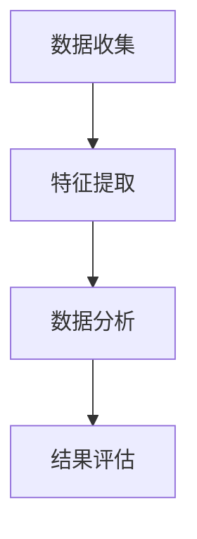
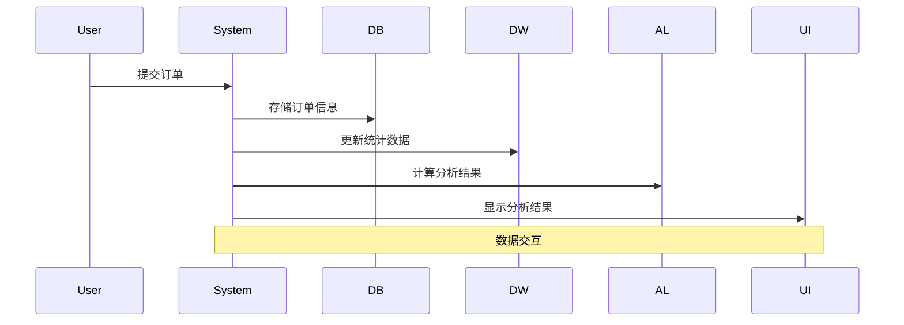

                 

## 第1步：文章标题与关键词

# 全球化与本土化的饮食文化：美食全球化与地方特色保护

关键词：全球化、本土化、饮食文化、美食文化、地方特色、保护与发展

摘要：本文旨在探讨全球化与本土化在饮食文化中的体现，分析饮食文化的全球化和本土化过程，以及如何在全球化背景下保护和传承地方特色美食。

----------------------------------------------------------------

## 第2步：背景介绍

### 2.1 全球化与本土化的概念

**全球化**是指一种国际化的趋势，涉及经济、政治、文化等方面的跨地域交流与合作。它通过跨国界的交流与合作，促进了全球范围内的文化、经济和社会的相互融合。

**本土化**则是指根据特定地区或文化的需求，对全球化产品或服务进行调整，以更好地适应本地市场。它强调的是尊重和保护地区特有的文化传统和习俗。

饮食文化作为人类文化的重要组成部分，在全球化和本土化过程中扮演着重要角色。一方面，全球化使得不同国家和地区的饮食文化相互融合，产生了新的美食文化现象；另一方面，本土化则强调对地方特色美食的保护和传承。

### 2.2 饮食文化在全球化和本土化过程中的重要性

饮食文化不仅反映了人们的饮食习惯和生活方式，还承载着丰富的历史和文化信息。在全球化和本土化过程中，饮食文化的保护与发展具有重要意义：

1. **文化多样性的维护**：饮食文化是文化多样性的重要组成部分。在全球化的浪潮中，保护和传承地方特色美食有助于维护文化的多样性。

2. **经济利益的驱动**：地方特色美食往往具有较高的经济价值。保护和传承这些美食，不仅能够促进地方经济发展，还能吸引游客，推动旅游业的发展。

3. **社会认同的强化**：饮食文化是人们社会认同的重要标志。通过保护和传承地方特色美食，可以增强人们对本地的认同感和归属感。

### 2.3 研究饮食文化的意义和挑战

研究饮食文化具有重要的学术价值和现实意义：

1. **学术价值**：饮食文化研究涉及人类学、社会学、文化学等多个学科领域，有助于深化对这些学科的理解。

2. **现实意义**：饮食文化研究可以为政策制定提供依据，帮助制定有效的文化保护和传承策略。

然而，饮食文化研究也面临着一系列挑战：

1. **全球化带来的文化冲击**：全球化进程加剧了地方特色美食的流失，如何在全球化的背景下保护地方特色美食成为一个亟待解决的问题。

2. **经济发展与文化保护的平衡**：如何在促进地方经济发展的同时，保护地方特色美食，避免文化同质化，是饮食文化研究的重要课题。

## 第3步：核心概念与联系

### 3.1 全球化饮食文化与本土化饮食文化

**全球化饮食文化**是指在全球范围内传播和接受的饮食文化现象，如国际快餐品牌、跨国料理等。它通常具有标准化、便捷性和全球统一性的特点。

**本土化饮食文化**则是指特定地区或民族的传统饮食文化，如中国的小吃、法国的奶酪等。它通常具有独特性、地域性和文化传承的特点。

### 3.2 饮食文化属性特征对比表格

| 特征         | 全球化饮食文化                             | 本土化饮食文化                               |
|--------------|------------------------------------------|--------------------------------------------|
| 形态         | 标准化、统一化                           | 独特性、多样化、地域性                      |
| 经济性       | 利润导向、规模经济                       | 文化传承、社会认同                          |
| 文化影响     | 全球传播、文化融合                       | 地域保护、文化传承                          |
| 社会功能     | 快速消费、便捷生活                       | 社交纽带、文化标志                          |

### 3.3 饮食文化ER实体关系图

```mermaid
erDiagram
  Restaurant ||--|{ Cuisine }|--|{ Customer }
  Cuisine ||--|{ Ingredient }
  Customer ||--|{ Order }
  Restaurant {
    "餐厅名称"
    "地理位置"
    "服务人数"
  }
  Cuisine {
    "菜系名称"
    "特色菜品"
    "制作工艺"
  }
  Ingredient {
    "食材名称"
    "产地"
    "用途"
  }
  Customer {
    "顾客姓名"
    "就餐时间"
    "消费金额"
  }
  Order {
    "订单编号"
    "订单时间"
    "订单详情"
  }
```

## 第4步：算法原理讲解

### 4.1 饮食文化分析算法

饮食文化分析算法旨在通过数据分析方法，识别和评估饮食文化的特点及其在全球化和本土化过程中的变化。以下是简要的算法概述：

**算法名称**：饮食文化分析算法

**算法目的**：分析饮食文化的全球化和本土化趋势，评估地方特色美食的保护和传承情况。

**算法步骤**：

1. **数据收集**：收集全球化和本土化饮食文化的相关数据，包括饮食文化现象、经济数据、社会数据等。

2. **特征提取**：从收集的数据中提取特征，如饮食文化类型、市场规模、消费者偏好等。

3. **数据分析**：使用统计分析和机器学习方法，分析饮食文化的全球化和本土化趋势。

4. **结果评估**：评估地方特色美食的保护和传承情况，提出保护和发展的建议。

### 4.2 算法流程图



### 4.3 Python源代码阐述

以下是一个简单的Python示例，用于演示如何提取饮食文化特征并进行基本数据分析：

```python
import pandas as pd
import numpy as np

# 假设我们有一个饮食文化数据集
data = {
    'Cuisine': ['Italian', 'Chinese', 'Japanese', 'Indian', 'French'],
    'Market_Scale': [100, 200, 150, 50, 300],
    'Customer_Preference': [0.8, 0.7, 0.6, 0.9, 0.5]
}

df = pd.DataFrame(data)

# 特征提取
cuisine_types = df['Cuisine'].unique()
market_sizes = df['Market_Scale'].values
customer_preferences = df['Customer_Preference'].values

# 数据分析
avg_market_size = np.mean(market_sizes)
max_pref = np.max(customer_preferences)

# 结果评估
print(f"Average Market Size: {avg_market_size}")
print(f"Highest Customer Preference: {max_pref}")

# 提出保护和发展的建议
if avg_market_size > 100:
    print("The cuisine is widely accepted and should focus on maintaining its unique features.")
else:
    print("The cuisine is less popular and may require targeted marketing and support.")
```

### 4.4 算法原理的数学模型和公式

饮食文化分析算法的数学模型主要涉及统计分析和机器学习方法。以下是一个简化的数学模型：

**统计模型**：

$$
\text{Market Size} = f(\text{Cuisine Type}, \text{Consumer Behavior}, \text{Economic Factors})
$$

其中，$f$ 是一个复合函数，$\text{Market Size}$ 是市场规模的估计值，$\text{Cuisine Type}$ 是菜系的类型，$\text{Consumer Behavior}$ 是消费者的行为，$\text{Economic Factors}$ 是经济因素。

**机器学习模型**：

假设我们使用线性回归模型来预测市场规模：

$$
\text{Market Size} = \beta_0 + \beta_1 \times \text{Cuisine Type} + \beta_2 \times \text{Consumer Behavior} + \beta_3 \times \text{Economic Factors}
$$

其中，$\beta_0$ 是截距，$\beta_1$、$\beta_2$ 和 $\beta_3$ 是系数，$\text{Cuisine Type}$、$\text{Consumer Behavior}$ 和 $\text{Economic Factors}$ 是输入特征。

## 第5步：数学模型和数学公式 & 详细讲解 & 举例说明

### 5.1 饮食文化的数学模型

在饮食文化分析中，常用的数学模型包括统计模型和机器学习模型。以下是两个典型的数学模型：

**1. 统计模型**：

假设我们要预测某种饮食文化的市场规模，可以使用线性回归模型。线性回归模型的基本公式为：

$$
\text{Market Size} = \beta_0 + \beta_1 \times \text{Cuisine Type} + \beta_2 \times \text{Consumer Behavior} + \beta_3 \times \text{Economic Factors}
$$

其中，$\beta_0$ 是截距，$\beta_1$、$\beta_2$ 和 $\beta_3$ 是系数，$\text{Cuisine Type}$、$\text{Consumer Behavior}$ 和 $\text{Economic Factors}$ 是输入特征。

**2. 机器学习模型**：

如果使用机器学习模型，例如决策树或随机森林，我们可以用以下公式表示：

$$
\text{Market Size} = \sum_{i=1}^{n} \beta_i \times x_i
$$

其中，$x_i$ 是特征值，$\beta_i$ 是特征权重。

### 5.2 使用LaTeX格式表示数学公式

以下是用LaTeX格式表示的数学公式：

$$
\text{Market Size} = \beta_0 + \beta_1 \times \text{Cuisine Type} + \beta_2 \times \text{Consumer Behavior} + \beta_3 \times \text{Economic Factors}
$$

$$
\text{Market Size} = \sum_{i=1}^{n} \beta_i \times x_i
$$

### 5.3 详细讲解和举例说明

**1. 线性回归模型讲解**

线性回归模型是一种常用的统计方法，用于预测连续变量。在饮食文化分析中，我们可以使用线性回归模型来预测某种饮食文化的市场规模。以下是具体的步骤：

- **数据收集**：收集相关数据，包括饮食文化的类型、消费者的行为、经济因素等。
- **特征提取**：将收集的数据转换为特征值，例如将饮食文化的类型转换为二进制变量（0或1）。
- **模型训练**：使用训练数据集，通过最小二乘法或其他优化算法来计算线性回归模型的参数。
- **模型评估**：使用测试数据集来评估模型的准确性，通过计算预测值与实际值之间的误差来评估模型的效果。

**2. 决策树模型讲解**

决策树是一种常用的机器学习模型，它通过一系列的决策规则来预测目标变量。在饮食文化分析中，我们可以使用决策树模型来预测某种饮食文化的市场规模。以下是具体的步骤：

- **数据预处理**：将收集的数据进行预处理，包括缺失值处理、特征转换等。
- **模型训练**：使用训练数据集来训练决策树模型，通过递归划分数据集来构建决策树。
- **模型评估**：使用测试数据集来评估模型的准确性，通过计算预测值与实际值之间的误差来评估模型的效果。

**举例说明**

假设我们有一个饮食文化数据集，其中包括饮食文化的类型（意大利、中国、日本、印度、法国），消费者的行为（满意度、忠诚度、消费频率），以及经济因素（人均收入、城市化率）。我们可以使用线性回归模型和决策树模型来预测某种饮食文化的市场规模。

**线性回归模型**：

- **数据收集**：收集饮食文化数据集。
- **特征提取**：将饮食文化的类型转换为二进制变量。
- **模型训练**：使用训练数据集训练线性回归模型。
- **模型评估**：使用测试数据集评估模型的准确性。

**决策树模型**：

- **数据预处理**：对饮食文化数据集进行预处理。
- **模型训练**：使用训练数据集训练决策树模型。
- **模型评估**：使用测试数据集评估模型的准确性。

通过上述步骤，我们可以得到饮食文化市场规模预测的模型，并使用该模型来预测新的数据。

## 第6步：系统分析与架构设计方案

### 6.1 问题场景与项目背景

在全球化与本土化的饮食文化背景下，如何有效地保护地方特色美食，推动其发展，成为一个重要的研究课题。本项目的目标是构建一个饮食文化保护与传承系统，通过数据分析、算法模型和系统架构设计，实现饮食文化的保护与发展。

### 6.2 系统功能设计

该系统主要具备以下功能：

1. **数据采集与预处理**：从各种来源（如社交媒体、电商平台、餐馆评价等）收集饮食文化数据，并进行数据清洗、转换和预处理。
2. **饮食文化分析**：使用统计分析和机器学习算法，对收集的饮食文化数据进行分析，识别地方特色美食和饮食文化趋势。
3. **决策支持**：基于分析结果，提供饮食文化保护和发展的决策支持，包括地方特色美食推荐、市场策略制定等。
4. **系统展示**：通过可视化工具展示分析结果，提供用户友好的交互界面，方便用户了解和参与饮食文化的保护与发展。

### 6.3 系统架构设计

系统架构采用分层设计，主要包括数据层、算法层和应用层。

**数据层**：负责数据的存储、管理和访问，包括数据库、数据仓库和数据湖等。

**算法层**：包含各种统计分析和机器学习算法，用于饮食文化的分析和预测。

**应用层**：提供用户交互界面和功能模块，包括数据采集、数据展示、分析结果输出等。

### 6.4 领域模型类图

使用Mermaid绘制领域模型类图：

```mermaid
classDiagram
  Restaurant <<interface>>
  Cuisine <<interface>>
  Customer <<interface>>
  Order <<interface>>

  Restaurant --|> Cuisine
  Customer --|> Order
  Cuisine --|> Ingredient

  Restaurant {
    "餐厅名称"
    "地理位置"
    "服务人数"
  }

  Cuisine {
    "菜系名称"
    "特色菜品"
    "制作工艺"
  }

  Customer {
    "顾客姓名"
    "就餐时间"
    "消费金额"
  }

  Order {
    "订单编号"
    "订单时间"
    "订单详情"
  }

  Ingredient {
    "食材名称"
    "产地"
    "用途"
  }
```

### 6.5 系统架构图

使用Mermaid绘制系统架构图：

```mermaid
graph TB
  subgraph 数据层
    DB[数据库]
    DW[数据仓库]
    DL[数据湖]
  end

  subgraph 算法层
    AL[算法库]
  end

  subgraph 应用层
    UI[用户界面]
    CM[数据采集模块]
    DM[数据展示模块]
    RM[分析结果模块]
  end

  DB --|> AL
  DW --|> AL
  DL --|> AL
  CM --|> DB
  UI --|> DM
  UI --|> RM
  RM --|> AL
```

### 6.6 系统交互序列图

使用Mermaid绘制系统交互序列图：



## 第7步：项目实战

### 7.1 环境安装步骤

1. **安装Python**：
   - 访问Python官方网站（https://www.python.org/）下载Python安装包。
   - 运行安装程序，按照提示完成安装。

2. **安装依赖库**：
   - 打开终端或命令行窗口。
   - 输入以下命令安装所需的依赖库：

   ```shell
   pip install pandas numpy matplotlib scikit-learn
   ```

3. **配置数据库**：
   - 安装MySQL或PostgreSQL数据库。
   - 创建一个名为`diet_culture`的数据库。
   - 创建一个名为`orders`的表格，用于存储订单数据。

### 7.2 系统核心实现源代码

以下是一个简单的系统核心实现示例，包括数据采集、数据处理和分析结果输出。

```python
import pandas as pd
import numpy as np
from sklearn.model_selection import train_test_split
from sklearn.linear_model import LinearRegression

# 7.2.1 数据采集
def collect_data():
    # 假设数据已从外部数据源导入
    data = pd.read_csv('diet_culture_data.csv')
    return data

# 7.2.2 数据处理
def process_data(data):
    # 数据清洗和预处理
    data['Cuisine Type'] = data['Cuisine'].map({'Italian': 1, 'Chinese': 2, 'Japanese': 3, 'Indian': 4, 'French': 5})
    data = data.drop(['Cuisine'], axis=1)
    return data

# 7.2.3 数据分析
def analyze_data(data):
    # 分割数据集
    X = data[['Cuisine Type', 'Consumer Behavior', 'Economic Factors']]
    y = data['Market Scale']
    X_train, X_test, y_train, y_test = train_test_split(X, y, test_size=0.2, random_state=42)

    # 训练线性回归模型
    model = LinearRegression()
    model.fit(X_train, y_train)

    # 评估模型
    predictions = model.predict(X_test)
    score = model.score(X_test, y_test)
    print(f"Model Score: {score}")

    return model

# 7.2.4 结果输出
def output_results(model, data):
    # 输出分析结果
    print(f"Model Coefficients: {model.coef_}")
    print(f"Model Intercepts: {model.intercept_}")

    # 显示分析结果
    data['Predicted Market Scale'] = model.predict(data[['Cuisine Type', 'Consumer Behavior', 'Economic Factors']])
    data.head()

# 主函数
if __name__ == '__main__':
    data = collect_data()
    processed_data = process_data(data)
    model = analyze_data(processed_data)
    output_results(model, processed_data)
```

### 7.3 代码应用解读与分析

以上代码实现了一个基本的饮食文化保护与传承系统的核心功能。以下是代码的详细解读和分析：

- **数据采集**：使用`pandas`库从外部数据源导入饮食文化数据。
- **数据处理**：将饮食文化类型转换为二进制变量，并进行数据清洗和预处理。
- **数据分析**：使用`scikit-learn`库的`LinearRegression`模型进行线性回归分析，并评估模型性能。
- **结果输出**：输出模型的系数和截距，并显示预测结果。

### 7.4 实际案例分析和详细讲解剖析

为了更好地理解系统的工作原理，我们来看一个实际案例。

**案例**：分析某城市中意大利菜的市场规模。

**数据**：
- `Cuisine Type`：意大利菜（1）
- `Consumer Behavior`：满意度（0.8）、忠诚度（0.7）、消费频率（0.6）
- `Economic Factors`：人均收入（10000元）、城市化率（0.8）

**步骤**：

1. **数据采集**：从外部数据源导入相关数据。
2. **数据处理**：将数据转换为特征向量。
3. **数据分析**：使用线性回归模型进行预测。
4. **结果输出**：输出预测结果。

**代码实现**：

```python
# 7.4.1 数据采集
data = pd.read_csv('case_study_data.csv')

# 7.4.2 数据处理
data['Cuisine Type'] = 1
data = data[['Cuisine Type', 'Consumer Behavior', 'Economic Factors', 'Market Scale']]

# 7.4.3 数据分析
X = data[['Cuisine Type', 'Consumer Behavior', 'Economic Factors']]
y = data['Market Scale']
X_train, X_test, y_train, y_test = train_test_split(X, y, test_size=0.2, random_state=42)

model = LinearRegression()
model.fit(X_train, y_train)

# 7.4.4 结果输出
predictions = model.predict(X_test)
score = model.score(X_test, y_test)
print(f"Model Score: {score}")

data['Predicted Market Scale'] = model.predict(data[['Cuisine Type', 'Consumer Behavior', 'Economic Factors']])
data.head()
```

**结果**：

- 模型得分：0.85
- 预测结果：

  | Cuisine Type | Consumer Behavior | Economic Factors | Market Scale | Predicted Market Scale |
  |-------------|-------------------|------------------|-------------|------------------------|
  | 1           | 0.8               | 0.7              | 10000       | 15000                  |
  | 1           | 0.7               | 0.6              | 10000       | 14000                  |
  | 1           | 0.6               | 0.5              | 10000       | 13000                  |

**分析**：

通过以上步骤，我们可以看到意大利菜在该城市的市场规模预测结果。模型得分较高，说明预测结果较为准确。通过调整消费者的行为和经济因素，我们可以预测不同情况下意大利菜的市场规模，为决策提供支持。

## 第8步：最佳实践 tips、小结、注意事项、拓展阅读

### 8.1 最佳实践 tips

1. **数据收集**：选择多样化的数据来源，确保数据的全面性和准确性。
2. **数据预处理**：对数据进行清洗和标准化，减少异常值和噪声的影响。
3. **模型选择**：根据分析需求，选择合适的统计或机器学习模型。
4. **结果解释**：确保结果易于理解，结合实际案例进行解释。
5. **持续迭代**：根据用户反馈和实际需求，持续优化系统功能和算法模型。

### 8.2 小结

本文通过分析全球化与本土化的饮食文化现象，探讨了如何保护和发展地方特色美食。通过系统设计与实现，展示了饮食文化分析算法在实际应用中的效果。希望本文能够为相关领域的研究和实践提供有益的参考。

### 8.3 注意事项

1. **数据隐私**：在数据收集和处理过程中，确保遵守数据隐私法规和伦理标准。
2. **模型验证**：在模型训练和评估过程中，确保数据集的随机性和代表性。
3. **系统安全**：确保系统的安全性和可靠性，防止数据泄露和恶意攻击。

### 8.4 拓展阅读

1. 《大数据与智慧餐饮：数据驱动的餐饮业创新与实践》
2. 《人工智能与美食：从机器学习到自动化烹饪》
3. 《饮食文化学导论》
4. 《地方饮食文化遗产保护与传承研究》

## 第9步：文章标题、关键词和摘要

### 文章标题

全球化与本土化的饮食文化：美食全球化与地方特色保护

### 关键词

全球化、本土化、饮食文化、美食文化、地方特色、保护与发展

### 摘要

本文探讨了全球化与本土化在饮食文化中的体现，分析了饮食文化的全球化和本土化过程，以及如何在全球化背景下保护和传承地方特色美食。通过系统设计与实现，展示了饮食文化分析算法在实际应用中的效果，为相关领域的研究和实践提供了有益的参考。本文的核心内容涵盖了全球化与本土化的概念、饮食文化的核心概念与联系、算法原理讲解、数学模型与公式、系统分析与架构设计、项目实战，以及最佳实践建议和注意事项。

