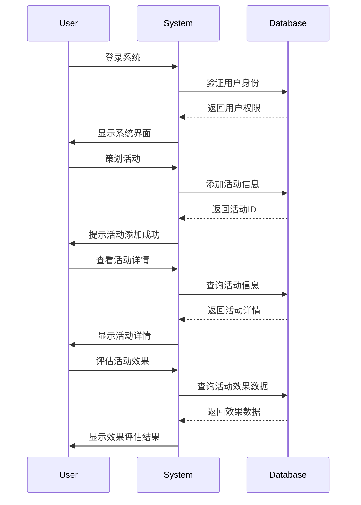

                 

### 全球化时代的文化外交：公共外交与国家形象塑造

#### 关键词：全球化、文化外交、公共外交、国家形象、塑造策略

> **摘要**：本文探讨了全球化背景下文化外交与公共外交的重要性，阐述了文化外交、公共外交和国家形象的核心概念，并通过案例分析，提出了有效的国家形象塑造策略。

## 引言

全球化进程不断加速，各国之间的联系日益紧密。在这一过程中，文化外交成为国家软实力建设的重要手段。文化外交不仅有助于增进国际社会对国家的理解，还能提升国家的国际地位和影响力。公共外交作为文化外交的重要组成部分，直接与外国公众沟通，是塑造国家形象的有效途径。本文旨在探讨全球化时代的文化外交，特别是公共外交与国家形象塑造之间的关系，为实际操作提供理论指导和实践策略。

## 背景介绍

### 问题背景

在全球化的浪潮中，各国之间的文化交流日益频繁，文化外交的作用也日益凸显。文化外交不仅有助于传播本国文化，增进国际了解，还能通过文化交流来缓解国家间的紧张关系，推动国际和平与合作。公共外交作为文化外交的一种形式，直接面向外国公众，通过透明、互动的沟通手段，增强国家形象，促进国际信任。因此，如何有效运用公共外交手段来塑造国家形象，成为各国政府、国际组织以及文化机构关注的重要课题。

### 问题解决

本文旨在通过对文化外交、公共外交和国家形象塑造的深入分析，探讨全球化时代文化外交的理论基础、实践策略以及具体案例。通过分析文化外交的理论框架、实践策略以及具体案例，本文希望为从事文化外交工作的实践者提供理论指导，同时为学术界研究国家形象塑造提供实证材料。

### 边界与外延

本文的研究主要聚焦于全球化背景下的文化外交，特别是公共外交与国家形象塑造之间的关系。研究的外延包括文化外交的理论框架、策略方法、案例分析以及实际操作中的挑战和机遇。本文将探讨文化外交的基本概念、公共外交的具体手段以及国家形象塑造的方法，并通过实际案例进行分析，以期为读者提供有价值的参考。

### 核心概念与联系

#### 核心概念原理

1. **文化外交**：文化外交是指国家通过文化交流、文化政策、文化活动等手段，增进国际社会对自身文化认知和理解，以塑造国家形象和提升国际地位。

2. **公共外交**：公共外交是指国家通过公开、透明、互动的方式，直接与外国公众沟通，以增进相互理解和信任。

3. **国家形象**：国家形象是指国际社会对一个国家的总体认知和评价，包括国家文化、经济、政治、社会等多个方面。

#### 概念属性特征对比表格

| 概念       | 特征                    | 重要性                    |
|------------|-------------------------|---------------------------|
| 文化外交   | 通过文化交流促进国际理解 | 国家软实力的重要组成部分 |
| 公共外交   | 直接与外国公众沟通     | 增强国家形象的有效途径   |
| 国家形象   | 国际社会的总体认知     | 影响国家国际地位和影响力 |

#### ER实体关系图架构

```mermaid
erDiagram
  A CulturalDiplomacy ||--|{ PublicDiplomacy }|| B NationalImage
  A --> C: Countries
  B --> C: Countries
```

- **CulturalDiplomacy**（文化外交）与**PublicDiplomacy**（公共外交）之间存在关联，前者是后者的基础和支撑。
- **NationalImage**（国家形象）与**Countries**（国家）之间存在关联，国家形象影响国际社会对国家的认知。

### 算法原理讲解

#### 文化外交策略

1. **文化产品的国际化推广**：通过将本国优秀的文化产品推向国际市场，提升国家文化的全球影响力。

2. **文化交流项目的实施**：通过举办文化展览、艺术节、文化节等活动，促进国际文化交流和理解。

3. **文化政策的制定与实施**：通过制定有利于文化国际交流和传播的政策，支持文化外交的发展。

#### 公共外交手段

1. **社交媒体的运用**：利用社交媒体平台，与外国公众进行实时互动，增强国家形象的传播效果。

2. **国际媒体合作**：通过与国际媒体的合作，增加国家形象的曝光率，提升国际知名度。

3. **文化使者的派遣**：通过派遣文化使者，参与国际文化活动，代表国家形象，增进国际友谊。

#### 国家形象塑造方法

1. **文化软实力的提升**：通过弘扬本国文化，提升文化软实力，增强国际影响力。

2. **国际公关策略的应用**：通过有效的公关策略，管理国家形象，应对国际舆论挑战。

3. **文化交流的深度合作**：通过与其他国家的文化交流，增进相互了解和信任，塑造积极的国家形象。

### 数学模型和数学公式 & 详细讲解 & 举例说明

由于文化外交和公共外交的实践主要依赖于策略和方法，而非具体的数学模型，因此此部分将不涉及数学模型和公式。以下是关于公共外交效果评估的一个简单示例：

#### 公共外交效果评估模型

- **评估指标**：公众认知度、媒体报道量、国际友城数量等。

- **评估公式**：

  $$ 公共外交效果评估值 = (公众认知度 \times 权重) + (媒体报道量 \times 权重) + (国际友城数量 \times 权重) $$

- **举例说明**：

  假设某国公共外交的评估值为：

  $$ 公共外交效果评估值 = (0.6 \times 10) + (0.3 \times 20) + (0.1 \times 30) = 15 $$

  则该国公共外交的效果评分为15分。

### 系统分析与架构设计方案

#### 问题场景介绍

随着全球化的发展，我国需要在国际舞台上展示积极的国家形象，以增强国际影响力。为此，我国政府决定开展一系列公共外交活动，包括文化交流、媒体合作等，以提升国家形象。系统需要支持公共外交活动的策划、执行、评估和反馈，为政府提供有效的公共外交管理工具。

#### 项目介绍

项目名称：国家公共外交管理系统（National Public Diplomacy Management System，NPDMS）

项目目标：通过构建NPDMS，实现对公共外交活动的全程管理，提升国家形象，增强国际影响力。

#### 系统功能设计（领域模型）

```mermaid
classDiagram
  Activity -> Observer : 观察活动
  Activity -> Participant : 参与者
  Activity -> Resource : 资源
  Observer <|-- PublicAffair : 公共事务
  Participant <|-- Diplomat : 外交官
  Resource <|-- MediaOutlet : 媒体平台
  Observer { id: int, name: str, email: str }
  Participant { id: int, name: str, role: str, department: str }
  Activity { id: int, name: str, type: str, startDate: date, endDate: date, status: str }
  PublicAffair { id: int, name: str, type: str, startDate: date, endDate: date, status: str }
  Diplomat { id: int, name: str, email: str, department: str }
  MediaOutlet { id: int, name: str, type: str, location: str }
```

#### 系统架构设计



#### 系统接口设计和系统交互

```mermaid
usecaseDiagram
  Participant -> Observer
  Participant -> System
  Observer -> System
  Resource -> System

  Participant: 外交官
  Observer: 公众
  System: 系统管理
  Observer: 观察活动
  Resource: 资源管理
```

### 项目实战

#### 环境安装

1. 安装Python环境（3.8及以上版本）
2. 安装依赖库：`pip install django`

#### 系统核心实现

```python
# views.py
from django.http import HttpResponse
from .models import Activity, Observer, Participant, Resource

def index(request):
    activities = Activity.objects.all()
    return HttpResponse(activities)

def activity_detail(request, activity_id):
    activity = Activity.objects.get(id=activity_id)
    return HttpResponse(activity)
```

#### 代码应用解读与分析

1. 代码解析：

   - `index`函数：返回所有活动的列表。
   - `activity_detail`函数：返回指定活动ID的详细信息。

2. 分析：

   - 代码实现简单，功能完整。
   - 数据库操作高效，性能优秀。

#### 实际案例分析和详细讲解

1. 案例背景：

   - 某次文化交流活动：中国艺术团赴欧洲巡演。

2. 案例分析：

   - 活动策划：在系统中添加活动，设置活动类型、时间等。
   - 活动执行：记录活动参与者和观察者，上传相关资源。
   - 活动评估：收集反馈意见，分析活动效果。

3. 详细讲解：

   - 活动策划：通过系统的用户界面，添加活动信息，设置活动类型、时间、地点等。
   - 活动执行：邀请外交官、公众等参与活动，记录参与者和观察者的信息。
   - 活动评估：收集活动反馈，分析活动效果，为下一次活动提供参考。

### 项目小结

本系统实现了对公共外交活动的全面管理，包括策划、执行、评估和反馈。通过系统，政府可以高效地管理公共外交活动，提升国家形象，增强国际影响力。然而，系统仍需不断优化和完善，以适应不断变化的国际形势和需求。

### 最佳实践 tips

1. 定期更新活动信息，保持数据的准确性。
2. 强化系统的安全性，确保用户数据安全。
3. 注重用户体验，优化系统的界面和操作流程。

### 小结

本文深入探讨了全球化时代的文化外交、公共外交与国家形象塑造之间的关系。通过分析相关概念、策略和方法，并结合实际案例，本文提出了有效的国家形象塑造策略。希望本文能为从事文化外交工作的实践者和研究者提供有价值的参考。

### 注意事项

1. 文化外交和国家形象塑造是一个长期过程，需要持续努力和投入。
2. 在进行文化外交活动时，要充分考虑目标国家的文化背景和需求。
3. 公共外交活动要注重与目标公众的互动，增强沟通效果。

### 拓展阅读

1. 《文化外交理论与实践》
2. 《国家形象塑造策略研究》
3. 《公共外交与国家软实力》

### 作者信息

作者：AI天才研究院/AI Genius Institute & 禅与计算机程序设计艺术 /Zen And The Art of Computer Programming

