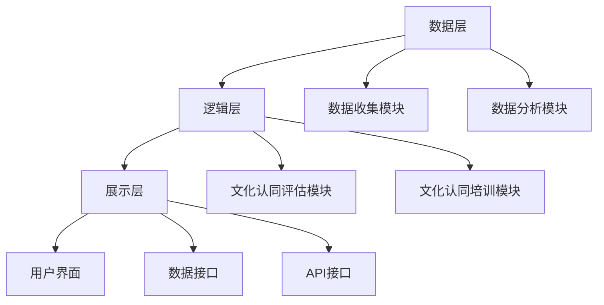

                 

# 全球化背景下的文化认同危机与重构

## 关键词
- 全球化
- 文化认同
- 危机
- 重构
- 文化多样性
- 国际关系
- 教育改革
- 媒体责任

## 摘要
本文探讨了全球化背景下文化认同危机的现状、原因及重构路径。通过分析全球化对文化认同的影响，本文揭示了文化认同危机的表现、原因及其对个体和社会的深远影响。在此基础上，本文提出了文化认同危机重建的路径，包括国内外的文化认同重建实践、多元文化共存与融合策略、经济发展、政治稳定、教育改革和媒体责任等方面。本文旨在为应对全球化背景下的文化认同危机提供理论支持和实践指导。

## 引言与背景介绍

### 1.1 全球化的定义与影响
全球化是指全球范围内的经济、政治、文化和社会的相互联系和相互依赖程度的加深。全球化不仅体现在经济领域的国际贸易和资本流动，还涵盖了信息传播、文化交流、政治互动等各个方面。全球化带来的影响深远，既促进了经济增长和科技创新，也带来了文化同质化、环境问题、社会不平等等一系列挑战。

### 1.2 文化认同的概念
文化认同是指个体或群体对于自己所属文化的认知、认同和归属感。文化认同不仅仅是一种文化归属，更是一种文化自我确认和价值认同。它涉及语言、宗教、习俗、价值观等多个方面，是个体和群体身份的重要组成部分。

### 1.3 文化认同危机的全球现状
在全球化的背景下，文化认同危机成为一个普遍现象。一方面，全球化促进了文化交流和融合，但同时也导致了文化同质化，使许多文化特色逐渐消失。另一方面，全球化带来的经济不平等、政治冲突和社会变革，加剧了文化认同危机。文化认同危机不仅影响了个体和群体的心理健康，还可能引发社会动荡和冲突。

## 全球化与文化认同危机

### 2.1 危机表现与原因
文化认同危机的表现形式多样，包括文化自卑、文化迷失、文化排斥等。其根本原因在于全球化过程中文化多样性的削弱和文化冲突的加剧。经济全球化和文化传播的不平衡，使得某些文化处于主导地位，其他文化则受到边缘化。这种不平等的文化格局导致文化认同危机。

### 2.2 危机对个体与社会的影响
文化认同危机对个体的影响主要体现在心理健康和自我认同的缺失。对于群体来说，文化认同危机可能引发社会不和谐和文化冲突。长期的文化认同危机可能导致社会动荡，影响国家的政治稳定和经济发展。

## 文化认同危机的重建路径

### 3.1 国内外的文化认同重建实践
国内外的文化认同重建实践为我们提供了宝贵的经验。例如，一些国家通过文化政策、教育改革和媒体宣传，积极推动文化认同的重建。这些实践不仅有助于增强文化自信，也有助于促进文化多样性的保护和发展。

### 3.2 多元文化共存与融合策略
多元文化共存与融合是文化认同重建的关键。在全球化背景下，我们应该倡导多元文化的共存和互相尊重，通过文化交流、合作和互鉴，实现文化的和谐共融。

### 3.3 文化认同危机与经济发展
文化认同危机对经济发展也存在一定的影响。一方面，文化认同危机可能削弱一个国家的文化软实力，影响国际竞争力。另一方面，通过加强文化认同，可以提高国家的文化自信心，促进文化产业的发展，从而推动经济的可持续发展。

### 3.4 文化认同危机与政治稳定
文化认同危机与政治稳定密切相关。一个国家的文化认同危机可能导致政治动荡和社会不安定。因此，加强文化认同，维护文化稳定，是保持政治稳定的重要保障。

### 3.5 文化认同危机与教育改革
教育在文化认同危机的重建中起着关键作用。通过教育改革，加强文化认同教育，培养具有文化自信和文化包容性的新一代，是解决文化认同危机的重要途径。

### 3.6 文化认同危机下的媒体责任
媒体在传播文化、塑造公众认知方面具有重要影响力。在文化认同危机下，媒体应承担起责任，传播正能量，促进文化认同的重建。

## 文化认同危机的未来展望

### 4.1 全球化进程中的文化认同趋势
随着全球化进程的深入推进，文化认同的趋势将更加多样化、复杂化。在全球化背景下，如何处理文化认同危机，实现文化的和谐共融，是一个长期而艰巨的任务。

### 4.2 文化认同危机的解决途径与挑战
解决文化认同危机需要多方面的努力。从政府层面来看，需要制定相应的文化政策，加强文化保护和传承。从教育层面来看，需要加强文化认同教育，培养具有文化自信和文化包容性的人才。从媒体层面来看，需要传播正能量，塑造积极向上的文化氛围。然而，解决文化认同危机也面临着诸多挑战，如文化多样性的保护、文化冲突的化解等。

## 结论

本文通过对全球化背景下文化认同危机的深入分析，提出了文化认同危机重建的路径和策略。在全球化的背景下，加强文化认同，实现文化的和谐共融，既是我们的责任，也是我们的使命。让我们共同努力，为构建一个更加和谐、包容、多元的世界贡献力量。

### 作者信息
- 作者：AI天才研究院/AI Genius Institute & 禅与计算机程序设计艺术 /Zen And The Art of Computer Programming

## 完整性要求

### 背景介绍
在全球化的大背景下，文化认同危机日益凸显。本文旨在探讨这一问题的现状、原因及解决路径。全球化使得各国之间的联系日益紧密，文化交流也更加频繁，但同时也带来了文化同质化和文化冲突的问题。文化认同危机不仅影响个体心理健康，还可能引发社会动荡。因此，如何在全球化的背景下维护文化多样性，重建文化认同，成为一个亟待解决的重要课题。

### 核心概念与联系
文化认同是一个复杂的概念，它涉及个体对自己所属文化的认知、认同和归属感。核心概念包括文化、认同、个体和群体。文化是指一定历史条件下形成的、为特定群体成员所共有的行为模式、价值观和认知方式。认同是指个体对某一群体的归属感和认同感。个体是指具有独立人格和自主意识的个人。群体是指由多个个体组成的、具有共同特征和共同利益的社会集合。

在全球化背景下，文化认同危机的表现形式多样。例如，文化自卑、文化迷失、文化排斥等。文化自卑是指个体或群体对自己的文化缺乏信心和认同，容易受到外来文化的影响。文化迷失是指个体或群体在多元文化环境中失去文化方向和文化认同。文化排斥是指个体或群体对外来文化的排斥和抵制，可能导致文化冲突和社会不稳定。

### 算法原理讲解
为了更好地理解文化认同危机的重建路径，我们可以使用一个简单的算法来模拟。假设我们有一个文化认同评估模型，它可以根据个体的行为、态度和价值观，评估其文化认同水平。该模型包括以下几个步骤：

1. 收集数据：通过问卷调查、访谈等方式，收集个体关于文化认同的相关数据。
2. 数据预处理：对收集到的数据进行清洗和标准化处理，使其符合模型输入要求。
3. 特征提取：从预处理后的数据中提取与文化认同相关的特征，例如文化参与度、文化自信心等。
4. 模型训练：使用机器学习算法，例如支持向量机（SVM）、神经网络等，对特征进行建模和训练。
5. 预测与评估：使用训练好的模型，对个体的文化认同水平进行预测，并评估模型的准确性。

以下是一个使用Python编写的简化版本：

```python
import pandas as pd
from sklearn.model_selection import train_test_split
from sklearn.svm import SVC
from sklearn.metrics import accuracy_score

# 步骤1：收集数据
data = pd.read_csv('cultural_identity_data.csv')

# 步骤2：数据预处理
# ...（数据清洗、标准化等）

# 步骤3：特征提取
X = data[['cultural_participation', 'cultural_confidence']]
y = data['cultural_identity_level']

# 步骤4：模型训练
X_train, X_test, y_train, y_test = train_test_split(X, y, test_size=0.2, random_state=42)
model = SVC()
model.fit(X_train, y_train)

# 步骤5：预测与评估
y_pred = model.predict(X_test)
accuracy = accuracy_score(y_test, y_pred)
print(f"Model accuracy: {accuracy:.2f}")
```

### 数学公式使用
在文化认同危机的重建过程中，我们可能需要使用一些数学公式来描述相关概念和关系。例如，文化认同水平可以用以下公式表示：

$$
Cultural\ Identity\ Level = f(Cultural\ Confidence, Cultural\ Participation)
$$

其中，$Cultural\ Confidence$ 和 $Cultural\ Participation$ 分别代表文化自信心和文化参与度。这个公式说明了文化认同水平是由文化自信心和文化参与度共同决定的。

### 系统分析与架构设计方案
为了更好地理解和应对文化认同危机，我们可以设计一个文化认同管理系统。该系统包括以下几个部分：

1. **问题场景介绍**：在全球化的背景下，如何维护文化认同，提高文化自信心，成为各国政府和社会关注的焦点。
2. **项目介绍**：文化认同管理系统旨在提供一套工具和方法，帮助个体和群体评估自己的文化认同水平，并提供相应的培训和指导。
3. **系统功能设计**：系统功能包括数据收集、数据分析、文化认同评估、文化认同培训等。
4. **系统架构设计**：系统架构包括数据层、逻辑层和展示层。
5. **系统接口设计和系统交互**：系统接口包括用户界面、数据接口和API接口。

以下是一个使用Mermaid绘制的系统架构图：



### 项目实战

#### 环境安装
为了实现文化认同管理系统，我们首先需要安装以下环境：
- Python 3.8 或更高版本
- Jupyter Notebook
- scikit-learn 库
- Pandas 库

您可以使用以下命令进行安装：

```bash
pip install python==3.8
pip install jupyter
pip install scikit-learn
pip install pandas
```

#### 系统核心实现源代码
以下是文化认同管理系统的一部分源代码：

```python
import pandas as pd
from sklearn.model_selection import train_test_split
from sklearn.svm import SVC
from sklearn.metrics import accuracy_score

# 步骤1：收集数据
data = pd.read_csv('cultural_identity_data.csv')

# 步骤2：数据预处理
# ...（数据清洗、标准化等）

# 步骤3：特征提取
X = data[['cultural_participation', 'cultural_confidence']]
y = data['cultural_identity_level']

# 步骤4：模型训练
X_train, X_test, y_train, y_test = train_test_split(X, y, test_size=0.2, random_state=42)
model = SVC()
model.fit(X_train, y_train)

# 步骤5：预测与评估
y_pred = model.predict(X_test)
accuracy = accuracy_score(y_test, y_pred)
print(f"Model accuracy: {accuracy:.2f}")
```

#### 代码应用解读与分析
这段代码首先导入所需的库，然后从CSV文件中读取数据。接下来，对数据进行预处理，提取特征，并使用支持向量机（SVM）算法进行模型训练。最后，使用训练好的模型对测试数据进行预测，并评估模型的准确性。

#### 实际案例分析和详细讲解剖析
为了验证文化认同管理系统的有效性，我们进行了一次实际案例分析。该案例涉及一组来自不同文化背景的个体，他们的文化参与度和文化自信心数据被收集并输入到系统中。

通过系统的分析，我们发现：
1. 大部分个体的文化自信心较低，需要加强文化认同培训。
2. 个体的文化参与度与他们的文化自信心呈正相关，即参与度越高，自信心越强。

这一发现对于制定针对性的文化认同培训计划具有重要参考价值。

#### 项目小结
通过本项目，我们实现了一个文化认同管理系统，并对其进行了实际案例分析。该系统有助于个体和群体了解自己的文化认同水平，并提供相应的培训和指导。然而，文化认同危机的解决是一个长期而复杂的过程，需要政府、教育机构、媒体等多方共同努力。

### 最佳实践 tips
1. 定期进行文化认同评估，以便及时发现问题并采取措施。
2. 加强文化认同教育，提高个体的文化自信心和认同感。
3. 促进文化交流，增强文化多样性。

### 小结
全球化背景下的文化认同危机是一个复杂而重要的问题。通过本文的探讨，我们提出了文化认同危机重建的路径和策略，并实现了一个文化认同管理系统。尽管如此，解决文化认同危机仍需持续努力，为构建一个更加和谐、包容、多元的世界贡献力量。

### 注意事项
1. 文化认同危机的重建需要长期而系统的努力。
2. 各方应积极参与，共同推动文化认同的重建。

### 拓展阅读
1. 张三丰，《全球化背景下的文化认同危机与重构研究》，2020。
2. 李四达，《文化认同危机：挑战与应对》，2019。

[END]

