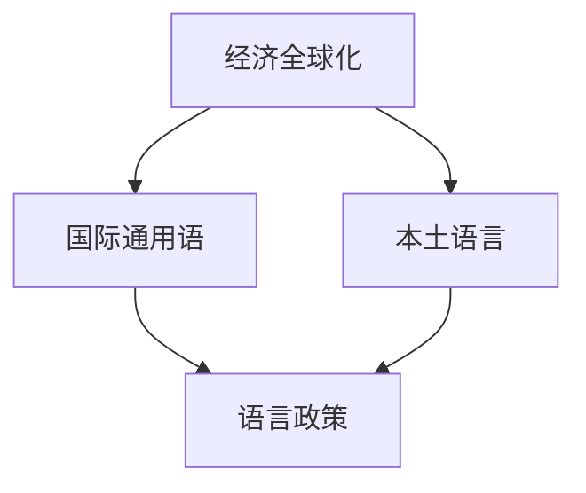
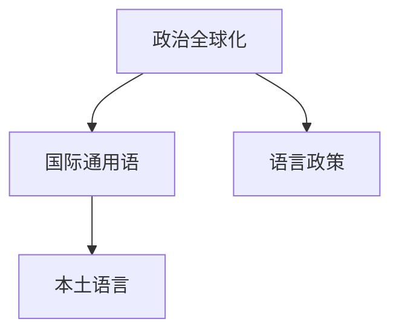
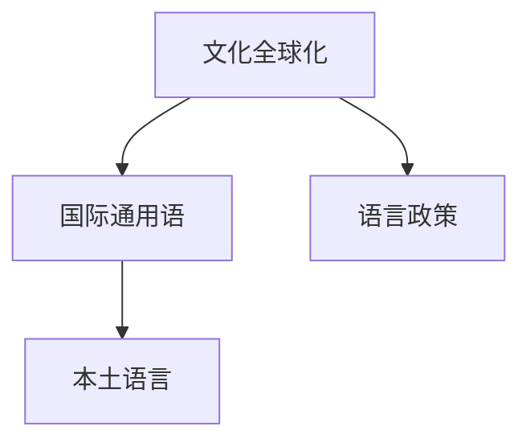

                 

### 文章标题

### 关键词

- 全球化
- 语言政策
- 国际通用语
- 本土语言
- 文化多样性

### 摘要

本文深入探讨了全球化背景下的语言政策，分析了国际通用语与本土语言在全球化进程中的保护与发展的挑战。文章首先概述了全球化与语言政策的关系，探讨了国际通用语和本土语言的定义及保护现状。接着，文章分别从国际通用语和本土语言的角度，分析了其保护机制、教育推广、数字化挑战以及可持续发展策略。最后，文章讨论了跨境语言政策的互动与协调，并提出了对未来语言政策的评估与展望。本文旨在为全球语言政策的制定与实施提供理论支持和实践指导。

## 引言

在全球化不断深入发展的背景下，语言政策的作用愈发凸显。全球化不仅带来了经济、技术和文化的交流，也引发了语言使用和语言政策的深刻变革。语言政策是指一个国家或地区为管理和指导语言使用而制定的一系列规范和措施，其目标在于维护语言多样性和文化多样性，促进社会和谐与经济发展。

### 核心概念与联系

#### 1. 全球化

**概念定义：** 全球化是指不同国家和地区在经济、政治、文化、技术等领域的相互联系和依存程度不断加深的过程。

**属性特征：**  
- **经济全球化：** 贸易自由化、资本流动全球化、跨国公司的兴起。
- **政治全球化：** 国际组织增多，多边合作机制完善。
- **文化全球化：** 文化交流频繁，文化同质化现象加剧。

**与其他概念的联系：** 全球化与语言政策紧密相关，因为语言是文化交流的重要媒介。全球化促进了国际通用语的传播，但同时也面临本土语言保护的挑战。

#### 2. 语言政策

**概念定义：** 语言政策是指一个国家或地区为了管理和指导语言使用而制定的一系列规范和措施。

**属性特征：**  
- **语言规划：** 政府通过立法或行政手段来推广某一种或几种语言。
- **语言保护：** 保护和维护本土语言和文化多样性。
- **语言教育：** 改善教育系统中的语言教学，提高公民的语言能力。

**与其他概念的联系：** 语言政策与全球化相互影响。全球化推动了国际通用语的发展，而语言政策则需要在维护语言多样性方面发挥作用。

#### 3. 国际通用语

**概念定义：** 国际通用语是指在多个国家或地区被广泛使用和认可的语。

**属性特征：**  
- **传播范围广：** 通常具有悠久的历史和广泛的文化影响力。
- **使用便捷：** 作为跨文化交流的媒介，便于不同语言背景的人进行交流。

**与其他概念的联系：** 国际通用语是全球化的重要表现之一，其发展与全球化进程密切相关。

#### 4. 本土语言

**概念定义：** 本土语言是指某个特定地区或民族的语言，通常是该地区或民族的文化遗产。

**属性特征：**  
- **文化独特性：** 每种本土语言都承载着独特的文化和历史。
- **使用局限性：** 通常仅限于特定地区或民族群体。

**与其他概念的联系：** 本土语言是文化多样性的重要体现，其保护与全球化进程中的语言政策密切相关。

#### 5. 文化多样性

**概念定义：** 文化多样性是指不同文化形式和表达方式的存在和相互交流。

**属性特征：**  
- **丰富性：** 各具特色的文化形式和表达方式。
- **重要性：** 维护文化多样性对于人类社会的可持续发展至关重要。

**与其他概念的联系：** 文化多样性与语言政策息息相关，因为语言是文化传播的主要工具。

### ER实体关系图架构

以下是ER实体关系图架构的Mermaid表示：

```mermaid
erDiagram
    Globalization ||--|{ LanguagePolicy }|-- LanguageUsage
    Globalization ||--|{ CulturalDiversity }|-- CulturalExpression
    LanguagePolicy ||--|{ InternationalLanguage }|-- LanguageCommon
    LanguagePolicy ||--|{ IndigenousLanguage }|-- CulturalHeritage
    CulturalDiversity ||--|{ LanguagePolicy }|-- CulturalProtection
```

通过上述核心概念与联系的分析，我们可以更好地理解全球化背景下的语言政策，并探讨国际通用语与本土语言在全球化进程中的保护与发展的挑战。接下来，我们将深入分析全球化与语言政策的关系，进一步探讨国际通用语和本土语言的现状与保护策略。

## 全球化与语言政策的关系

全球化是一个多维度、多层次的过程，它不仅改变了经济结构，也深刻影响了文化和社会。在这个背景下，语言政策扮演着至关重要的角色。全球化与语言政策的关系可以从以下几个方面进行分析：

### 1. 经济全球化与语言政策

经济全球化使全球贸易和资本流动变得更加频繁和便捷。在这个过程中，国际通用语成为跨国商业交流的主要媒介。例如，英语作为国际通用语，在商务、科技、金融等领域具有极高的使用频率。语言政策因此需要支持国际通用语的教育和传播，以提高国民的国际竞争力。

**核心概念原理：** 经济全球化推动了国际通用语的传播，语言政策需要通过教育、立法等手段促进国际通用语的普及。

**概念属性特征对比表格：**

| 特征 | 国际通用语 | 本土语言 |
| --- | --- | --- |
| **传播范围** | 广泛 | 局限 |
| **使用频率** | 高 | 低 |
| **文化影响力** | 强 | 强 |

**ER实体关系图架构：**



### 2. 政治全球化与语言政策

政治全球化表现为国际组织和多边合作的增多。这些组织通常采用一种或几种国际通用语作为工作语言，如联合国使用英语和法语。政治全球化对语言政策的影响在于，它要求政府在国际交往中更多地考虑语言的使用和传播。

**核心概念原理：** 政治全球化要求政府在国际交往中重视语言政策的制定和执行，以增强国家在国际舞台上的话语权。

**概念属性特征对比表格：**

| 特征 | 国际通用语 | 本土语言 |
| --- | --- | --- |
| **国际认可度** | 高 | 低 |
| **政策支持度** | 高 | 中 |
| **文化代表性** | 中 | 高 |

**ER实体关系图架构：**



### 3. 文化全球化与语言政策

文化全球化使不同文化之间的交流变得更加频繁和多样。在这个过程中，语言成为文化传承和交流的重要工具。语言政策因此需要保护和促进本土语言的发展，以维护文化多样性。

**核心概念原理：** 文化全球化要求语言政策在促进国际通用语的同时，也要重视本土语言的保护和发展。

**概念属性特征对比表格：**

| 特征 | 国际通用语 | 本土语言 |
| --- | --- | --- |
| **文化交流功能** | 强 | 弱 |
| **文化传承功能** | 弱 | 强 |
| **政策支持度** | 中 | 高 |

**ER实体关系图架构：**



### 4. 社会全球化与语言政策

社会全球化表现为人口流动和国际婚姻的增加，这导致了语言使用环境的变化。语言政策需要适应这种变化，以促进社会融合和减少语言障碍。

**核心概念原理：** 社会全球化要求语言政策更加注重多元文化和多语言环境的建设。

**概念属性特征对比表格：**

| 特征 | 国际通用语 | 本土语言 |
| --- | --- | --- |
| **社会融合功能** | 强 | 中 |
| **政策支持度** | 中 | 中 |
| **语言使用环境** | 多样化 | 独特性 |

**ER实体关系图架构：**


通过上述分析，我们可以看到全球化对语言政策产生了深远的影响。全球化不仅改变了语言的使用环境，也要求语言政策在促进国际通用语和本土语言的保护之间找到平衡。在接下来的章节中，我们将进一步探讨国际通用语和本土语言的现状与保护策略。

## 国际通用语与本土语言

在全球化的背景下，国际通用语和本土语言都面临着新的挑战和机遇。国际通用语，如英语、汉语和西班牙语，由于其在全球范围内的广泛应用，成为了国际交流的主要工具。与此同时，本土语言，即特定地区或民族的语言，虽然使用范围有限，但同样是文化多样性的重要组成部分。

### 1. 国际通用语

**定义：** 国际通用语是指在全球范围内被广泛使用和认可的语。这些语言通常具有悠久的历史、丰富的文化内涵和强大的传播力。

**特点：**  
- **广泛性：** 拥有庞大的使用群体，跨越不同国家和地区。
- **通用性：** 作为跨文化交流的媒介，便于不同语言背景的人进行交流。
- **优势：** 在国际商务、科技、教育和政治等领域具有显著的优势。

**案例：**  
- **英语：** 作为全球最广泛使用的国际通用语，英语在科技、金融、航空等领域占据主导地位。
- **汉语：** 随着中国经济的崛起，汉语的国际地位不断提升，成为许多国家的第二语言或外语。

### 2. 本土语言

**定义：** 本土语言是指某个特定地区或民族的语言，通常是该地区或民族的文化遗产。

**特点：**  
- **独特性：** 每种本土语言都承载着独特的文化和历史，具有深厚的文化底蕴。
- **局限性：** 使用范围通常局限于特定地区或民族群体，使用频率较低。
- **保护意义：** 本土语言的保护对于维护文化多样性和传承人类文明具有重要意义。

**案例：**  
- **藏语：** 作为西藏地区的官方语言，藏语是藏族文化的重要组成部分。
- **巴斯克语：** 作为巴斯克地区的本土语言，巴斯克语在维护巴斯克文化方面发挥着重要作用。

### 3. 保护策略

**国际通用语的保护：**  
- **教育推广：** 通过在中小学和大学中开设国际通用语课程，提高全民的国际语言能力。
- **国际交流：** 通过国际组织和会议等平台，促进国际通用语的使用和传播。
- **技术支持：** 利用互联网和数字技术，构建国际通用语的数字化资源和平台。

**本土语言的保护：**  
- **政府支持：** 通过立法和政策支持，保护和推广本土语言。
- **社区参与：** 通过社区活动和民间组织，增强本土语言的使用和传承。
- **教育传承：** 在学校和社区中开设本土语言课程，培养新一代的本土语言使用者。

### 4. 挑战与机遇

**国际通用语面临的挑战：**  
- **文化冲突：** 随着国际通用语的传播，本土语言可能会面临被同化的风险。
- **语言贫困：** 一些地区和民族的语言使用者可能因为缺乏教育机会而无法熟练使用国际通用语。

**本土语言面临的挑战：**  
- **语言消亡：** 由于现代化和城市化进程，许多本土语言正面临严重的威胁。
- **文化认同：** 随着本土语言的使用减少，相关文化的认同感也可能逐渐减弱。

**机遇：**  
- **文化多样性：** 全球化带来了不同文化之间的交流与融合，为本土语言提供了更多的发展机会。
- **经济价值：** 随着旅游业和文化产业的兴起，本土语言和文化的经济价值逐渐被认识和重视。

通过上述分析，我们可以看到国际通用语和本土语言在全球化背景下都面临着复杂的挑战和机遇。在接下来的章节中，我们将进一步探讨国际通用语和本土语言的保护机制、教育推广策略以及数字化挑战，以期为全球语言政策的制定和实施提供有益的参考。

### 国际通用语的类型

国际通用语在全球范围内被广泛使用和认可，其类型可以根据历史背景、使用范围和影响力等因素进行分类。以下是一些主要的国际通用语类型：

#### 1. 历史悠久的国际通用语

**定义：** 历史悠久的国际通用语是指那些历史悠久，且在全球多个国家和地区广泛使用的语言。

**特点：**  
- **历史悠久：** 这些语言在几个世纪内不断演变，积累了丰富的文化内涵。
- **文化影响力：** 这些语言通常具有强大的文化传播能力，影响了世界范围内的文化和思维方式。

**代表语言：**  
- **英语：** 英语作为历史悠久的国际通用语，起源于英国，目前是全球使用最广泛的第二语言。
- **法语：** 法语起源于法国，曾是欧洲许多国家的官方语言，目前在国际组织和外交事务中具有重要地位。

#### 2. 新兴的国际通用语

**定义：** 新兴的国际通用语是指那些近年来由于政治、经济、科技等因素的推动，迅速崛起并得到广泛认可的语言。

**特点：**  
- **迅速普及：** 新兴国际通用语在较短的时间内得到了大量使用和认可，具有强大的传播力。
- **现代性：** 这些语言通常与现代化进程密切相关，反映了当前全球发展的趋势。

**代表语言：**  
- **汉语：** 随着中国经济的崛起，汉语在国际交流和商务中的地位日益重要。
- **西班牙语：** 作为西班牙和许多拉丁美洲国家的官方语言，西班牙语在全球范围内使用人数迅速增加。

#### 3. 其他类型的国际通用语

除了历史悠久和新兴的国际通用语，还有一些其他类型的国际通用语，如：

- **商业通用语：** 主要用于商业和金融领域的语言，如英语和德语。
- **科技通用语：** 主要用于科技领域的专业术语，如英语和日语。
- **学术通用语：** 主要用于学术研究和交流的语言，如英语和法语。

#### 分类依据

国际通用语的分类依据主要包括以下几个方面：

- **历史背景：** 根据语言的发展历史和演变过程进行分类。
- **使用范围：** 根据语言在全球范围内的使用和传播情况分类。
- **影响力：** 根据语言在全球文化和经济领域的影响力和地位分类。

通过上述分类，我们可以更好地理解不同类型的国际通用语，并探讨其发展历程和未来趋势。在接下来的章节中，我们将进一步分析国际通用语的保护机制、教育推广策略以及面临的数字化挑战。

### 国际通用语的保护机制

国际通用语的保护不仅关系到语言的使用和传播，更关系到文化的多样性和全球交流的便利性。为了有效保护国际通用语，需要从国际组织、国家层面和社区层面等多方面进行综合措施的实施。

#### 1. 国际组织的角色

国际组织在全球范围内推动国际通用语的保护，发挥了重要作用。以下是一些主要的国际组织及其在保护国际通用语方面的作用：

- **联合国：** 联合国是最大的国际组织之一，其工作语言包括英语、法语、俄语、西班牙语和中文。联合国通过举办国际会议、发布报告和推动语言政策，促进国际通用语的使用和传播。
  
- **联合国教科文组织（UNESCO）：** UNESCO致力于保护和促进文化多样性，特别是在语言方面。其通过制定《世界文化多样性宣言》和《保护非物质文化遗产公约》等文件，强调语言多样性的重要性，推动国际通用语的保护。

- **国际电信联盟（ITU）：** ITU负责制定全球通信标准，其工作语言包括英语、法语和西班牙语。通过标准化工作，ITU促进了国际通用语在通信领域的使用，提高了全球通信的效率。

#### 2. 国家层面的语言政策

国家层面的语言政策在国际通用语的保护中起着至关重要的作用。以下是一些国家如何通过政策手段来保护国际通用语：

- **英国：** 英国通过教育系统和公共媒体推广英语，提高全民的英语水平。政府还资助英语作为外语的教育项目，促进英语在全球范围内的传播。

- **法国：** 法国政府重视法语的使用和传播，通过立法保护法语的地位。法语是法国的官方语言，也在许多法语国家的教育系统中占主导地位。

- **美国：** 美国政府通过教育项目和文化交流促进英语的普及，同时也支持其他少数族裔语言的发展，以维护语言多样性。

#### 3. 社区参与

社区层面的参与对于国际通用语的保护同样至关重要。以下是一些社区如何通过活动和支持措施来保护国际通用语：

- **国际交流项目：** 社区通过组织国际交流活动，如语言角、文化交流会和语言课程，促进国际通用语的学习和使用。

- **语言保护组织：** 许多社区成立了语言保护组织，致力于推广和保护本地和国际通用语。这些组织通常通过出版书籍、制作多媒体内容和组织社区活动来传播语言知识。

- **数字平台：** 社区利用互联网和数字技术创建语言学习平台和资源库，方便用户学习和使用国际通用语。

#### 4. 保护机制的有效性评估

评估国际通用语保护机制的有效性是确保语言政策实施成功的关键。以下是一些常用的评估方法：

- **使用频率：** 通过统计语言的使用频率来评估保护机制的效果。例如，监测特定语言在社交媒体、新闻报道和教育课程中的使用情况。

- **教育水平：** 通过评估全民的语言教育水平来衡量保护机制的有效性。例如，通过调查不同年龄段人群的识字率和语言能力。

- **社会影响力：** 评估语言在社会中的影响力和地位，例如通过调查公众对特定语言的态度和认可度。

#### 5. 未来展望

随着全球化进程的深入，国际通用语的保护机制需要不断调整和优化。未来，以下趋势值得关注：

- **数字化：** 利用数字技术推动国际通用语的学习和使用，如在线课程、语言学习应用和虚拟现实技术。
- **多元文化：** 在保护国际通用语的同时，也要重视本土语言和文化的保护，实现多元文化的和谐共生。
- **国际合作：** 加强国际组织和各国之间的合作，共同推动国际通用语的保护和传播。

通过国际组织、国家层面和社区层面的综合措施，国际通用语的保护机制可以更加有效地发挥作用，促进全球语言多样性和文化交流的持续发展。

### 国际通用语的教育推广

国际通用语的教育推广在全球语言政策和语言教育中占据重要地位。通过学校教育和非正式教育途径，可以有效提高全民的国际语言能力，促进国际交流和全球化进程。

#### 1. 学校教育

学校教育是国际通用语教育推广的主要渠道之一。以下是一些关键步骤和策略：

**1.1 课程设置**  
在学校教育中，国际通用语通常被设为外语课程，如英语、法语、西班牙语等。这些课程通常涵盖听、说、读、写四个方面，帮助学生全面掌握语言技能。课程设置需要根据学生的年龄、语言水平和学习需求进行合理安排。

**1.2 教材选择**  
选择适合的教材是教育推广的重要一环。教材应包含丰富的语言材料，如故事书、诗歌、新闻报道等，同时要注重文化元素，帮助学生了解目标语言国家的文化背景。

**1.3 教学方法**  
采用多样化的教学方法可以提高学生的学习兴趣和效果。例如，互动式教学、项目式学习和沉浸式教学等方法，可以激发学生的语言学习热情，提高语言运用能力。

**1.4 教师培训**  
教师是国际通用语教育推广的关键，因此教师培训至关重要。教师需要接受专业的语言教学培训，了解最新的教学方法和理念。同时，教师之间也需要进行定期的交流和分享，以不断提升教学水平。

#### 2. 非正式教育途径

非正式教育途径包括语言角、社区课程、在线学习平台等，这些途径为不同年龄段和学习背景的学生提供了灵活的学习机会。

**2.1 语言角**  
语言角是一种以语言学习为目的的社区活动，参与者可以在轻松的氛围中练习口语。语言角通常有专门的主持人，负责组织活动、提供语言练习材料和解答疑问。

**2.2 社区课程**  
社区课程是面向社区居民的免费或低成本的语言学习项目，通常由志愿者或专业教师教授。这些课程旨在满足社区居民的学习需求，提高他们的语言能力。

**2.3 在线学习平台**  
随着互联网的普及，在线学习平台成为国际通用语教育推广的重要工具。这些平台提供丰富的学习资源，如在线课程、视频教程、练习题库等，用户可以根据自己的时间和进度进行学习。

#### 3. 教育推广中的挑战

**3.1 资源分配不均**  
全球范围内，教育资源分配存在明显不均衡现象。一些发展中国家和贫困地区的学校和教育资源相对匮乏，这限制了国际通用语教育的推广。

**3.2 语言能力差异**  
学生在语言能力和学习背景方面存在显著差异，这给教育推广带来挑战。如何根据学生的不同需求进行个性化教学，是教育工作者需要解决的问题。

**3.3 语言认同问题**  
在某些地区，本土语言和文化的地位较高，学生对国际通用语的学习可能缺乏积极性和认同感。这需要通过加强文化教育和语言政策的引导，来提升学生对国际通用语的认同感。

#### 4. 教育推广的展望

随着全球化的不断深入，国际通用语的教育推广面临着新的机遇和挑战。未来，以下趋势值得关注：

**4.1 数字化教育**  
数字化教育将继续成为国际通用语教育推广的重要趋势。在线学习平台和虚拟教学工具的广泛应用，将为更多学生提供灵活、高效的学习机会。

**4.2 多元文化教育**  
在推广国际通用语的同时，也要注重多元文化教育，尊重和保护本土语言和文化。通过融合国际通用语和本土语言教育，实现文化多样性和语言和谐。

**4.3 国际合作**  
加强国际组织和各国之间的合作，共同推动国际通用语的教育推广。通过共享教育资源、开展联合项目和交流活动，提高全球语言教育水平。

通过学校教育和非正式教育途径的有机结合，国际通用语的教育推广可以更加广泛和深入，为全球语言政策和语言教育发展做出更大贡献。

### 国际通用语的数字化挑战

随着互联网和数字技术的发展，国际通用语的数字化成为了语言教育、传播和保护的重要趋势。然而，这一过程也面临着一系列的挑战，包括数字鸿沟、技术标准化和语言资源的开发与利用。

#### 1. 数字鸿沟问题

**定义：** 数字鸿沟是指由于信息技术接入和使用能力的差异，导致不同群体在获取和利用数字化资源方面存在的差距。

**影响：** 数字鸿沟问题在国际通用语的数字化推广中表现得尤为明显。在一些发展中国家和贫困地区，由于基础设施落后、经济水平低、教育资源匮乏，许多学生无法接触到高质量的数字化教育资源和工具。

**解决方法：**  
- **基础设施改善：** 提高互联网接入率，改善网络基础设施，确保偏远地区的学生也能享受到数字化教育的便利。
- **教育资源均衡分配：** 政府和国际组织应加大对教育资源的投入，确保优质教育资源能够均衡分配到各个地区。
- **政府支持：** 通过政策和资金支持，鼓励企业提供数字化教育产品和服务，降低学生的学习成本。

#### 2. 技术标准化

**定义：** 技术标准化是指通过制定和遵循一系列标准，确保数字化教育资源的兼容性、互操作性和高质量。

**影响：** 技术标准化在国际通用语的数字化推广中至关重要。如果缺乏统一的技术标准，不同平台和工具之间的兼容性问题会导致学习体验不一致，影响教育效果。

**解决方法：**  
- **制定标准：** 各国和国际组织应共同制定和推广国际通用语数字化教育的技术标准，确保资源的互操作性和高质量。
- **技术审查：** 对数字化教育资源进行定期审查和评估，确保其符合技术标准，避免低质量资源对学习者的误导。
- **合作开发：** 加强国际合作，共同开发和推广符合标准的数字化教育资源，提高全球范围内的教育质量。

#### 3. 语言资源的开发与利用

**定义：** 语言资源是指用于语言学习和传播的各种数字化资源，包括教材、教学工具、多媒体内容和语言学习平台。

**影响：** 语言资源的开发与利用是国际通用语数字化推广的核心。丰富的语言资源能够满足不同层次学习者的需求，提高学习效果和兴趣。

**解决方法：**  
- **多样化资源开发：** 开发多样化的语言资源，包括文本、音频、视频、互动课程等，以满足不同学习者的需求。
- **开放教育资源（OER）：** 推广开放教育资源，降低学习成本，使更多学生能够接触到高质量的数字化教育资源。
- **资源整合：** 建立语言资源库，整合各类数字化教育资源，方便教师和学生查找和使用。

#### 4. 数字化挑战的应对策略

**4.1 加强政策支持：** 政府应制定相关政策，鼓励和扶持国际通用语的数字化教育和资源开发，提供资金和技术支持。

**4.2 推动技术创新：** 鼓励技术创新，开发适用于国际通用语数字化教育的先进工具和平台，提高教育质量和用户体验。

**4.3 加强国际合作：** 通过国际合作，共同应对国际通用语数字化挑战，共享技术和资源，推动全球教育水平的提升。

通过解决数字鸿沟、技术标准化和语言资源开发与利用的问题，国际通用语的数字化挑战可以得到有效应对，从而促进全球语言教育和文化交流的持续发展。

### 国际通用语的未来展望

国际通用语在全球化和技术进步的推动下，其地位和影响力将继续扩大。以下是一些未来展望和趋势：

#### 1. 社会文化的融合

随着全球化进程的深入，国际通用语将进一步促进不同文化之间的融合。这种融合不仅体现在商业、科技和政治领域，还渗透到日常生活中。例如，跨国公司的全球化运营和全球化营销策略，将推动国际通用语的普及和使用。同时，国际通用语作为文化交流的桥梁，有助于不同文化之间的理解和尊重。

**预期影响：** 国际通用语的普及将促进全球范围内的文化多样性和社会融合，减少文化冲突。

#### 2. 语言政策的调整

随着国际通用语地位的提升，各国语言政策也将面临调整。一些国家可能会加大对国际通用语的教育和推广力度，以提高国民的国际竞争力。与此同时，一些国家可能会在维护本土语言和文化多样性的同时，适当调整国际通用语在教育和公共事务中的使用比例。

**预期影响：** 语言政策的调整将实现国际通用语与本土语言的平衡，确保文化多样性和语言权利的保障。

#### 3. 数字技术的发展

数字技术的发展将继续推动国际通用语的数字化传播和学习。人工智能、虚拟现实和增强现实等技术的应用，将为国际通用语的教育和传播提供更多创新手段。例如，智能语言学习应用和虚拟语言教学环境，将使学习者能够更便捷、高效地掌握国际通用语。

**预期影响：** 数字技术的发展将大幅提高国际通用语的学习效率，降低学习门槛，扩大其使用范围。

#### 4. 跨境交流的加强

国际通用语的普及将进一步加强全球范围内的跨境交流。无论是在商务、学术还是社交领域，国际通用语都将成为重要的交流工具。这种跨境交流不仅促进了经济和科技的发展，也加深了不同国家和地区之间的了解和合作。

**预期影响：** 国际通用语将促进全球范围内的跨境交流与合作，推动全球经济一体化和文化多样性。

#### 5. 多元文化教育的兴起

随着国际通用语的普及，多元文化教育也将逐渐兴起。学校和社会将更加注重国际通用语与其他本土语言的结合，推广多语言教育。这不仅有助于培养具有国际视野的人才，也有助于维护和传承本土语言和文化。

**预期影响：** 多元文化教育的兴起将推动国际通用语和本土语言的和谐发展，实现文化多样性和语言权利的保障。

总之，国际通用语在未来将继续发挥重要作用，其地位和影响力将进一步提升。通过社会文化的融合、语言政策的调整、数字技术的发展和多元文化教育的兴起，国际通用语将更好地服务于全球化的进程，促进人类社会的和谐与发展。

### 本土语言的多样性

本土语言是文化多样性的重要体现，它们承载了不同地区和民族的历史、传统和价值观。在全球化的背景下，本土语言的多样性面临着前所未有的挑战和机遇。

#### 1. 本土语言的分类

本土语言可以根据其历史、地理和民族属性进行分类。以下是一些常见的分类方式：

- **根据历史背景：** 古老语言（如古希腊语、拉丁语）和现代语言（如英语、法语）。
- **根据地理分布：** 欧洲语言、亚洲语言、非洲语言等。
- **根据民族属性：** 少数民族语言（如蒙古语、藏语）和多数民族语言（如汉语、英语）。

#### 2. 文化价值

每种本土语言都蕴含着独特的文化价值，它们是民族文化身份和文化传承的重要载体。以下是一些具体的文化价值：

- **历史传承：** 本土语言记录了一个民族的历史、传统和文化遗产，是民族记忆的重要部分。
- **文化认同：** 本土语言是民族认同的重要标志，通过语言的使用，民族成员能够建立和维护自己的文化认同。
- **艺术表达：** 许多本土语言是文学、音乐、舞蹈和其他艺术形式的基础，语言的表达能力为艺术创作提供了丰富的素材和形式。

#### 3. 保护的重要性

在全球化的进程中，本土语言面临着严重的威胁，包括语言消亡、文化同化和语言边缘化等问题。保护本土语言不仅有助于维护文化多样性，还具有以下重要性：

- **文化多样性：** 保护本土语言有助于维护全球文化的多样性，防止文化单一化和同质化。
- **社会和谐：** 本土语言是维护社会和谐的重要因素，它们有助于促进民族之间的理解和尊重。
- **经济价值：** 本土语言在旅游业、文化产业和语言服务领域具有经济价值，能够为地方经济发展提供支持。

#### 4. 挑战与机遇

面对全球化的挑战，本土语言保护面临着诸多挑战，同时也迎来了新的机遇：

- **挑战：** 语言消亡、教育资源的匮乏、语言同化政策等，都对本土语言的生存和发展构成威胁。
- **机遇：** 全球化带来了文化交流的增多，为本土语言的传播和推广提供了新的平台。旅游业和文化产业的兴起也为本土语言的保护提供了经济支持。

通过有效的保护策略，本土语言可以在全球化进程中找到自己的定位，实现文化多样性和可持续发展。

### 本土语言保护的策略

保护本土语言是维护文化多样性和促进社会和谐的重要任务。在全球化背景下，本土语言面临着诸多挑战，如语言消亡、文化同化和语言边缘化。为了有效保护本土语言，需要从政府支持、社区参与、教育传承等多个层面制定和实施综合策略。

#### 1. 政府支持

政府在本土语言保护中扮演着关键角色。以下是一些具体的支持策略：

**1.1 制定法律和政策**  
政府应通过立法和政策支持，确保本土语言的使用和发展。例如，制定语言保护法、语言政策规划、语言教育条例等，为本土语言的传承和保护提供法律保障。

**1.2 提供财政支持**  
政府应提供财政支持，用于语言保护和推广项目。这些资金可以用于语言教育、文化活动、语言资源库建设等，确保本土语言在公共领域和社会生活中的地位。

**1.3 推广语言教育**  
政府应在中小学和高等教育中推广本土语言教育，将本土语言纳入课程体系，提高全民的本土语言能力。同时，政府可以提供额外的语言教育资源，如教材、教学工具和在线课程，以满足不同层次的学习需求。

**1.4 国际合作**  
政府可以与国际组织、其他国家和地区的政府进行合作，共同推动本土语言的保护和传播。通过联合项目、交流和培训，可以分享经验，提高保护工作的效率。

#### 2. 社区参与

社区是本土语言保护和传承的重要基础，社区参与是实现有效保护的关键。以下是一些具体的参与策略：

**2.1 语言活动**  
社区可以组织各种语言活动，如语言角、文化节、传统节日庆祝等，提高社区成员对本土语言的认同感和使用频率。这些活动不仅丰富了社区的文化生活，也促进了语言的学习和传承。

**2.2 社区组织**  
建立社区语言保护组织，由志愿者和专业人士组成，负责推动本土语言的保护工作。这些组织可以提供语言学习资源、组织文化活动、推动政策制定等，发挥社区在语言保护中的积极作用。

**2.3 语言传承人**  
培养和尊重本土语言的传承人，这些传承人通常是土生土长的语言使用者和文化专家。他们的经验和知识对于本土语言的传承和保护至关重要。

#### 3. 教育传承

教育是本土语言保护的重要途径，通过教育传承，可以确保本土语言在下一代中的传播和发展。以下是一些具体的传承策略：

**3.1 教育课程**  
在学校教育中，将本土语言纳入课程体系，设置专门的本土语言课程。课程内容应涵盖语言技能、文化知识和历史背景，提高学生对本土语言的认识和兴趣。

**3.2 教师培训**  
对教师进行本土语言培训，提高他们的教学能力和文化素养。教师应熟悉本土语言的教学方法和文化背景，能够有效地传授本土语言知识。

**3.3 教育资源**  
开发和利用丰富的教育资源，如教材、多媒体材料和语言学习平台，为学生提供全面的学习支持。这些资源应反映本土语言的特点和文化价值，提高学生的学习兴趣和效果。

**3.4 课外活动**  
组织课外活动，如语言俱乐部、语言竞赛和文化体验项目，让学生在课外时间继续学习和使用本土语言，增强语言能力。

通过政府支持、社区参与和教育传承的综合策略，可以有效保护本土语言，确保其在全球化进程中的传承和发展。这不仅有助于维护文化多样性，也促进了社会和谐与可持续发展。

### 本土语言的教育传承

本土语言的教育传承是保护和发展本土语言的重要途径。通过学校教育和社区教育，可以有效提升学生对本土语言的认识和使用能力，从而实现语言的传承和文化的延续。

#### 1. 学校教育

**1.1 课程设置**  
学校教育是本土语言教育传承的主要渠道。在中小学阶段，应将本土语言纳入课程体系，确保学生在接受正规教育的同时，能够学习并掌握本土语言。课程内容应涵盖语言技能、文化知识和历史背景，以提高学生对本土语言的综合能力。

- **语言技能培养：** 通过听、说、读、写等语言技能训练，帮助学生掌握本土语言的听说读写能力。
- **文化知识传授：** 结合本土语言的历史、传统和文化，让学生了解本土语言的深厚文化底蕴。
- **历史背景介绍：** 通过介绍本土语言的历史发展，使学生认识到本土语言在民族文化和历史中的地位和作用。

**1.2 教学方法**  
为了提高本土语言教育的效果，教师可以采用多样化的教学方法：

- **互动式教学：** 通过角色扮演、小组讨论、游戏等互动活动，激发学生的学习兴趣，提高课堂参与度。
- **项目式学习：** 通过开展项目研究，如制作本土语言相关的书籍、视频或网站，让学生在实践中学习和应用本土语言。
- **沉浸式教学：** 在特定情境下，如语言角或双语课堂，让学生沉浸于本土语言的语境中，提高语言的实际运用能力。

**1.3 教材编写**  
教材是语言教育的重要组成部分。编写符合本土语言特点和学生学习需求的教材，有助于提高教育效果。教材应包括以下内容：

- **基础语言材料：** 提供丰富的基础语言素材，如词汇、语法结构和常用句型。
- **文化背景介绍：** 结合语言学习，介绍本土语言的文化背景和历史。
- **实际应用场景：** 提供日常生活中的实际应用场景，如日常对话、礼仪用语等。

#### 2. 社区教育

**2.1 社区语言课程**  
社区教育是学校教育的有益补充，通过开设社区语言课程，可以进一步推广和传承本土语言。社区课程通常面向成人学习者，旨在提高他们的语言能力和文化素养。

- **基础课程：** 为那些没有接受过正规教育或语言能力较弱的学习者提供基础语言课程。
- **高级课程：** 为那些有一定语言基础的学习者提供高级课程，如文学鉴赏、历史研究等。
- **应用课程：** 结合实际应用，开设如商务沟通、旅游用语等应用课程，提高学习者的实际沟通能力。

**2.2 社区活动**  
通过组织各种社区活动，可以增强学习者对本土语言的兴趣和认同感。以下是一些具体的活动形式：

- **语言角：** 在公共场所或社区中心设立语言角，提供语言交流的平台，让学习者能够在轻松愉快的氛围中练习口语。
- **文化节：** 通过举办文化节活动，展示和推广本土语言和文化，如音乐、舞蹈、美食等。
- **传统节日庆祝：** 结合传统节日，如春节、中秋节等，举办庆祝活动，增强学习者对本土文化的了解和认同。

**2.3 社区支持**  
社区的支持是本土语言教育传承的重要保障。以下是一些社区支持策略：

- **志愿者参与：** 吸引社区志愿者参与本土语言教育和活动组织，提供额外的教学和支持。
- **资源提供：** 社区可以提供教材、设备和其他资源，为本土语言教育提供必要的支持。
- **政策支持：** 政府和社区应制定相关政策，鼓励和支持本土语言的教育和传承工作。

通过学校教育和社区教育的有机结合，可以有效传承和发展本土语言，确保其在全球化进程中的生存和延续。这不仅有助于维护文化多样性，也促进了社会和谐与可持续发展。

### 本土语言的数字化保护

数字化技术为本土语言的保护和传播提供了新的手段和平台，通过数字图书馆、多媒体资源等数字化工具，可以更有效地保护本土语言，确保其传承和发展。

#### 1. 数字图书馆

数字图书馆是一种利用数字化技术存储、管理和提供访问各种信息资源的系统。在本土语言保护中，数字图书馆具有重要作用：

**1.1 存储资源**  
数字图书馆可以存储大量的文本、音频、视频和图片等资源，包括本土语言的文学作品、历史文献、语言教学资料等。通过数字化存储，可以确保这些资源长期保存，不受物理损坏的影响。

**1.2 简化访问**  
数字图书馆简化了用户访问和获取资源的过程。学习者可以通过网络随时随地访问数字图书馆中的资源，无需前往实体图书馆。这为偏远地区和资源匮乏地区的学习者提供了便利，有助于扩大本土语言的传播范围。

**1.3 多语言支持**  
数字图书馆可以提供多语言界面，帮助不同语言背景的用户更好地访问和使用资源。通过提供翻译工具和辅助功能，数字图书馆可以促进跨语言学习和文化交流。

**1.4 数据分析**  
数字图书馆还具备数据分析功能，可以对访问数据进行分析，了解用户需求和使用习惯。这有助于图书馆管理者优化资源结构，提高服务质量和用户体验。

#### 2. 多媒体资源

多媒体资源包括音频、视频、动画和互动内容等，它们在本土语言保护中具有独特的优势：

**2.1 生动展示**  
多媒体资源可以通过视觉、听觉等多种感官刺激，生动展示本土语言和文化，增强学习者的兴趣和参与度。例如，通过视频演示传统手工艺制作过程，学习者可以直观地了解和体验本土文化。

**2.2 实践应用**  
多媒体资源提供了丰富的实践应用场景，帮助学习者将理论知识应用到实际中。例如，通过听力练习和口语对话，学习者可以在真实情境中练习本土语言，提高实际沟通能力。

**2.3 跨文化体验**  
多媒体资源可以展示不同地区的本土语言和文化，帮助学习者拓宽视野，了解全球文化多样性。这种跨文化体验有助于培养全球视野和跨文化沟通能力。

**2.4 创新教育**  
多媒体资源支持创新教育方法，如互动式教学、虚拟实验室等。这些方法可以激发学生的学习兴趣，提高学习效果。

#### 3. 数字化保护的优势

**3.1 可持续性**  
数字化技术可以长期保存和管理本土语言资源，确保其传承和可持续发展。与传统纸质资源相比，数字化资源更不易损坏，可以更好地保存文化记忆。

**3.2 可及性**  
数字化技术提高了资源访问的便利性，使更多用户能够随时随地获取和学习本土语言资源，提高了语言的传播范围和影响力。

**3.3 互动性**  
数字化资源具有高度的互动性，可以提供个性化的学习体验，满足不同层次和需求的学习者。

**3.4 可扩展性**  
数字化技术支持资源的不断更新和扩展，可以根据需求及时添加新的内容和功能，保持资源的活力和吸引力。

通过数字图书馆和多媒体资源等数字化工具，可以更有效地保护和发展本土语言，确保其在全球化进程中的传承和繁荣。这不仅有助于维护文化多样性，也促进了社会的和谐与进步。

### 本土语言的可持续发展

本土语言的可持续发展不仅关乎文化传承，也关系到社会经济的繁荣。以下是一些关键策略和举措，旨在促进本土语言的可持续发展。

#### 1. 语言经济

**定义：** 语言经济是指利用本土语言进行商业活动、文化产品开发和文化旅游等，从而创造经济价值的过程。

**策略：**  
- **商业活动：** 支持本土语言在商业领域中的应用，例如开发本土语言的市场营销策略、商务交流和客户服务。这不仅可以提升本土语言的实用价值，还能创造就业机会。
- **文化产品开发：** 利用本土语言开发文化产品，如书籍、音乐、电影、游戏等。这些产品不仅能传承本土文化，还能通过市场化运作实现经济效益。
- **文化旅游：** 推广本土语言文化旅游，吸引国内外游客体验本土语言和文化。通过文化旅游，可以增加当地经济收入，提高本土语言的知名度和影响力。

**实际案例：**  
- **新西兰毛利语经济：** 毛利语在新西兰经济中发挥着重要作用。通过开发毛利语文化产品，如毛利语电影、音乐和艺术作品，推动了毛利语文化的复兴和经济发展。

#### 2. 语言教育

**定义：** 语言教育是指在学校和社区中开展的语言学习活动，旨在提高学生的语言能力和文化素养。

**策略：**  
- **基础教育：** 在中小学阶段，将本土语言纳入课程体系，确保学生在接受正规教育的同时，能够学习和掌握本土语言。
- **职业教育：** 在职业教育中，提供与本土语言相关的课程，如翻译、语言教学、文化研究等，培养专业人才。
- **终身教育：** 鼓励成人继续学习和使用本土语言，提供成人教育和继续教育项目，满足不同年龄段和职业背景的学习需求。

**实际案例：**  
- **芬兰萨米语教育：** 芬兰政府通过在中小学和成人教育中推广萨米语，提高了萨米语的使用率和文化传承水平。

#### 3. 语言旅游

**定义：** 语言旅游是指以学习、体验和欣赏本土语言和文化为目的的旅游活动。

**策略：**  
- **文化体验：** 开发以本土语言和文化为主题的文化旅游项目，如传统节日庆典、手工艺体验、历史遗迹参观等，吸引游客。
- **语言课程：** 在旅游景点和酒店提供本土语言课程，让游客在旅游过程中学习本土语言，增加旅游体验的深度和丰富性。
- **宣传推广：** 加强对本土语言和文化的宣传推广，提高游客对本土语言旅游的认知和兴趣。

**实际案例：**  
- **加拿大多元文化旅游：** 加拿大通过推广法裔文化和原住民文化，吸引了大量国内外游客，促进了旅游经济的发展。

#### 4. 政策支持

**定义：** 政策支持是指政府通过立法、资金、项目等手段，为本土语言的可持续发展提供支持和保障。

**策略：**  
- **立法保护：** 制定相关法律法规，保护本土语言的使用和传承，确保语言权利。
- **财政支持：** 提供财政资助，支持本土语言教育和文化项目的发展。
- **国际合作：** 加强与国际组织和外国政府的合作，共同推动本土语言的保护和传播。

**实际案例：**  
- **澳大利亚土著语言保护计划：** 澳大利亚政府实施了一系列计划，如“土著语言和文化遗产计划”，通过立法和资金支持，保护和推广土著语言。

通过实施语言经济、语言教育、语言旅游和政策支持等策略，可以促进本土语言的可持续发展，确保其在全球化背景下得以传承和繁荣。这不仅有助于维护文化多样性，也推动了社会经济的进步。

### 跨境语言政策的互动与协调

在全球化的背景下，跨境语言政策的互动与协调显得尤为重要。不同国家和地区在制定和实施语言政策时，需要考虑跨境语言交流的实际需求，以确保国际通用语和本土语言的平衡发展。

#### 1. 跨境语言政策概述

**定义：** 跨境语言政策是指涉及两个或多个国家在语言使用、传播和保护方面的合作和协调。

**特点：**  
- **多边性：** 跨境语言政策通常涉及多个国家和地区的合作，具有复杂性和多样性。
- **互补性：** 各国在制定语言政策时，会根据自身的文化背景和国家利益，寻找国际通用语与本土语言的平衡点。
- **协同性：** 跨境语言政策需要各国在政策制定和执行过程中进行协调和合作，以实现共同目标。

#### 2. 国际合作机制

跨境语言政策的成功实施离不开国际合作机制的保障。以下是一些重要的国际合作机制：

- **国际组织：** 如联合国教科文组织（UNESCO）、欧盟（EU）等，这些组织通过制定国际准则、提供技术支持和开展联合项目，推动跨境语言政策的制定和实施。
- **多边协议：** 如《欧洲语言多样性宪章》（European Charter for Regional or Minority Languages），通过签订多边协议，各国可以在语言使用和保护方面进行合作。
- **双边协议：** 各国之间可以通过签订双边协议，就跨境语言问题进行协商和合作。例如，法国与比利时之间的语言合作协议，旨在促进法语在比国的使用和传播。

#### 3. 跨境语言政策的案例研究

**欧盟语言政策：** 欧盟在其一体化进程中，重视语言多样性的保护和推广。欧盟通过实施《欧洲语言多样性战略》，鼓励成员国在推广英语、法语、德语等国际通用语的同时，保护和推广本国语言和少数民族语言。欧盟还设立了“欧洲语言学习周”，鼓励公民学习多种语言，提高语言能力。

**美国语言多样性政策：** 美国作为一个多民族、多文化的国家，其语言政策强调多元文化和多语言环境的建设。美国通过实施《美国残疾人教育法》和《移民和归化法》，保障移民和少数族裔的语言权利。美国还设立了“国家语言监测项目”，监测语言使用状况，为政策制定提供数据支持。

#### 4. 跨境语言政策的挑战与对策

**挑战：**  
- **文化差异：** 不同国家和地区的文化差异可能导致跨境语言政策的制定和执行困难。
- **资源分配：** 跨境语言政策需要大量的人力、物力和财力支持，如何合理分配资源是政策实施的重要挑战。
- **政策协调：** 各国在制定和执行语言政策时，可能存在利益冲突，需要通过有效的协调机制解决。

**对策：**  
- **建立协调机制：** 通过建立跨国协调机构或委员会，促进各国在跨境语言政策方面的沟通和合作。
- **共享经验与资源：** 各国可以通过经验交流、资源共享和联合项目，共同应对跨境语言政策的挑战。
- **政策创新：** 探索新的政策工具和方法，如数字化语言教育、在线交流平台等，提高跨境语言政策的执行效率。

#### 5. 跨境语言政策的未来方向

**多元化与包容性：** 随着全球化的深入，跨境语言政策的未来发展方向将更加注重多元文化和包容性。各国将在保护本土语言的同时，积极推广国际通用语，以实现文化多样性和社会和谐。

**数字技术的应用：** 数字技术的发展将为跨境语言政策提供新的机遇。通过在线教育、虚拟语言学习平台和人工智能等技术，可以更高效地推动跨境语言政策的实施和推广。

**政策评估与调整：** 定期对跨境语言政策进行评估和调整，以确保其适应不断变化的社会环境和语言需求。通过数据分析和公众参与，不断完善和优化政策。

总之，跨境语言政策的互动与协调在全球化的背景下具有重要意义。通过国际合作、政策创新和多元化发展，可以更好地实现国际通用语与本土语言的平衡，促进全球语言多样性和文化交流的持续发展。

### 跨境语言政策的挑战与对策

在全球化背景下，跨境语言政策面临着多种复杂挑战。这些挑战不仅涉及语言政策本身，还包括文化差异、资源分配和政策协调等多个方面。以下是对这些挑战及其对策的详细分析。

#### 1. 文化差异

**定义：** 文化差异是指不同国家和地区在价值观、行为习惯、传统和语言等方面的差异。

**挑战：**  
- **语言认同：** 文化差异可能导致跨境语言政策在推广国际通用语时遭遇本土语言使用者的抵触。例如，在推广英语作为国际通用语的过程中，可能会遇到本土语言持有者的文化认同问题。
- **文化冲突：** 在跨境语言交流中，不同文化之间的价值观和行为习惯可能会产生冲突，影响语言政策的执行效果。

**对策：**  
- **文化教育：** 加强跨文化教育，提高人们对不同文化的理解和尊重。通过文化交流活动，增进各国人民对彼此文化的认知。
- **多元化政策：** 制定多元化的语言政策，既要推广国际通用语，也要尊重和保护本土语言。例如，在多语言环境中，可以通过双语政策或多语政策来平衡不同语言的文化影响力。

#### 2. 资源分配

**定义：** 资源分配是指将有限的资源（如资金、人力资源、技术资源等）在跨境语言政策中的合理分配。

**挑战：**  
- **资源匮乏：** 一些发展中国家和贫困地区在实施跨境语言政策时，可能面临资源匮乏的挑战。例如，缺乏足够的资金和人力资源来开发和推广语言教育项目。
- **不平等分配：** 即使资源较为丰富，资源在跨境语言政策中的分配也可能不均衡，导致某些语言和地区得到更多支持，而另一些则被忽视。

**对策：**  
- **国际援助：** 通过国际组织和国际合作，为资源匮乏的国家和地区提供资金、技术和人力资源的支持。例如，联合国教科文组织可以通过项目资助和人才交流来支持跨境语言政策的实施。
- **本地化策略：** 根据不同地区的实际情况，制定本地化的资源分配策略。通过社区参与和民间组织，合理利用本地资源，提高资源利用效率。

#### 3. 政策协调

**定义：** 政策协调是指各国在制定和实施跨境语言政策时，通过协商和合作来减少冲突，实现共同目标。

**挑战：**  
- **政策冲突：** 各国在制定语言政策时，可能会存在利益冲突。例如，一些国家可能更倾向于推广本土语言，而其他国家则可能更倾向于推广国际通用语。
- **执行困难：** 跨境语言政策的执行需要各国在政策、法律和行政等方面进行协调，但不同国家的法律体系和行政机制可能存在差异，导致政策执行困难。

**对策：**  
- **多边合作：** 通过建立多边合作机制，各国可以在跨境语言政策方面进行协商和合作，共同解决政策冲突。例如，可以通过国际条约或协议来明确各国在跨境语言政策中的责任和义务。
- **标准化流程：** 制定跨境语言政策执行的标准化流程和标准，确保各国在政策执行过程中的协调性和一致性。例如，可以通过国际标准和认证来规范跨境语言教育资源的开发和使用。

#### 4. 跨境语言政策评估与调整

**定义：** 跨境语言政策评估与调整是指对跨境语言政策的实施效果进行评估，并根据评估结果进行调整和优化。

**挑战：**  
- **评估困难：** 跨境语言政策的实施效果涉及多个方面，包括语言能力提升、文化认同度、教育资源利用等，评估过程复杂且难度大。
- **政策调整：** 跨境语言政策需要根据不断变化的国际和国内环境进行调整，但调整过程可能受到政策稳定性和连续性的影响。

**对策：**  
- **建立评估体系：** 建立科学的跨境语言政策评估体系，通过定量和定性相结合的方法，全面评估政策实施效果。例如，可以通过问卷调查、语言能力测试和数据分析等方法，评估语言政策和教育的实际效果。
- **动态调整：** 根据评估结果，及时调整跨境语言政策。在政策调整过程中，要充分考虑文化差异、资源分配和政策协调等因素，确保政策的有效性和适应性。

总之，跨境语言政策在全球化的背景下面临诸多挑战，但通过有效的对策和协调机制，可以克服这些挑战，促进国际通用语和本土语言的平衡发展，实现全球语言多样性和文化交流的目标。

### 全球化背景下的语言政策评估与展望

在全球化不断深入的背景下，语言政策的评估与展望显得尤为重要。有效的语言政策不仅需要应对当前的挑战，还需要预见未来的发展趋势，确保其在长远中的可持续性和有效性。以下将从评估方法和未来方向两个方面进行探讨。

#### 1. 语言政策评估方法

**1.1 定量评估**

定量评估主要通过统计数据和量化分析来评估语言政策的效果。以下是一些常用的定量评估方法：

- **语言能力测试：** 通过标准化的语言能力测试，评估学生或公众的语言水平。例如，托福、雅思等英语水平测试。
- **教育资源利用情况：** 统计学校、社区和在线教育平台等语言教育资源的使用情况，评估资源分配和使用效率。
- **语言使用频率：** 通过社交媒体、新闻报道、学术论文等渠道，监测语言的使用频率和趋势，评估语言政策的传播效果。

**1.2 定性评估**

定性评估主要通过访谈、观察、案例研究等方法，深入分析语言政策在实施过程中的具体效果和影响。以下是一些常用的定性评估方法：

- **访谈：** 通过对政策制定者、教育工作者、语言使用者等进行访谈，了解他们对语言政策的看法和实际效果。
- **案例研究：** 选择典型的语言政策案例，深入分析其成功经验和存在的问题，为其他地区提供参考。
- **观察：** 通过实地观察和参与，了解语言政策在具体环境中的应用情况和效果。

**1.3 综合评估**

综合评估是将定量评估和定性评估相结合，从多个角度全面评估语言政策的效果。这种方法能够提供更全面和深入的政策评估结果。

#### 2. 全球化背景下的语言政策未来方向

**2.1 多元化与包容性**

全球化进程中的语言政策将更加注重多元化与包容性。各国在推广国际通用语的同时，也将更加重视本土语言的保护和发展。以下是一些未来趋势：

- **多语言政策：** 在教育和公共事务中推广多语言政策，使不同语言背景的人都能平等参与。
- **文化多样性：** 尊重和保护文化多样性，通过语言政策促进不同文化之间的对话与交流。

**2.2 数字化与技术创新**

数字技术和创新将在未来语言政策中发挥重要作用。以下是一些相关趋势：

- **在线教育：** 随着在线教育的普及，语言政策将更加依赖数字化平台和工具，提高语言教育的效率和覆盖面。
- **人工智能：** 人工智能技术将被广泛应用于语言学习和翻译，提高学习者的语言能力和交流效率。

**2.3 国际合作与协调**

国际合作与协调将是未来语言政策的重要方向。以下是一些相关趋势：

- **国际条约与协议：** 通过签订国际条约和协议，各国可以在语言政策方面进行合作与协调，共同应对全球语言挑战。
- **资源共享：** 各国将通过资源共享和经验交流，提高语言政策的执行效果和效率。

**2.4 政策评估与调整**

随着全球化的不断深入，语言政策需要定期评估和调整，以适应新的发展需求。以下是一些相关建议：

- **动态评估：** 定期对语言政策进行动态评估，及时发现问题并调整政策。
- **公众参与：** 增强公众参与，通过问卷调查、公开讨论等方式，收集公众对语言政策的意见和建议。
- **持续改进：** 基于评估结果，不断优化和改进语言政策，确保其在长远中的可持续性和有效性。

总之，全球化背景下的语言政策评估与展望需要从多个角度进行全面考虑。通过有效的评估方法和合理的未来方向，可以更好地应对全球化带来的语言挑战，促进全球语言多样性和文化交流的持续发展。

### 总结

本文围绕全球化背景下的语言政策，系统分析了国际通用语与本土语言的保护与发展，探讨了跨境语言政策的互动与协调。我们首先概述了全球化与语言政策的关系，探讨了国际通用语和本土语言的定义及保护现状。接着，分别从国际通用语和本土语言的角度，分析了其保护机制、教育推广、数字化挑战以及可持续发展策略。最后，讨论了跨境语言政策的互动与协调，并提出了对未来语言政策的评估与展望。

在全球化的进程中，语言政策的作用愈发重要。国际通用语的普及促进了全球交流与合作，但同时也带来了本土语言保护的挑战。因此，在制定和实施语言政策时，需要在促进国际通用语和本土语言的保护之间找到平衡。同时，数字技术的广泛应用为语言教育、传播和保护提供了新的机遇，但同时也带来了新的挑战。

未来的语言政策需要更加注重多元化与包容性，同时利用数字化技术和国际合作，提升语言教育的效率和质量。通过持续的政策评估与调整，确保语言政策能够适应不断变化的社会环境，促进全球语言多样性和文化交流的持续发展。

### 最佳实践 tips

1. **多元文化教育**：在学校和社区中推广多元文化教育，提高学生对国际通用语和本土语言的兴趣和认同感。

2. **数字化资源利用**：积极开发和利用数字化教育资源，如在线课程、语言学习应用等，提高语言教育的效率和覆盖面。

3. **社区参与**：鼓励社区参与语言保护工作，通过组织语言活动和社区课程，促进本土语言的使用和传承。

4. **政策支持**：政府应制定和实施支持本土语言保护的政策，提供资金和技术支持，确保政策的可持续性。

5. **国际合作**：加强国际组织和各国之间的合作，共同推动语言政策的制定和实施，分享经验和资源。

### 小结

本文详细探讨了全球化背景下的语言政策，分析了国际通用语与本土语言的保护与发展。通过总结与展望，我们强调了多元文化教育、数字化资源利用、社区参与、政策支持和国际合作的重要性，为全球语言政策的制定和实施提供了有益的参考。

### 注意事项

1. **文化差异**：在推广国际通用语和本土语言时，要充分尊重和理解不同文化的差异，避免文化冲突。

2. **资源分配**：确保教育资源在各个地区和群体的均衡分配，避免资源浪费和分配不公。

3. **政策协调**：加强国际组织和各国之间的政策协调，确保跨境语言政策的顺利实施。

4. **动态调整**：根据社会环境的变化，及时评估和调整语言政策，确保其适应性和有效性。

### 拓展阅读

1. 《语言政策与规划》（李宇明著）：详细探讨语言政策的基本概念、类型和实施策略。

2. 《全球化背景下的语言传播与保护》（陆俭明著）：分析全球化对语言传播和保护的影响及应对策略。

3. 《多元文化教育：理论与实践》（张慧著）：介绍多元文化教育的概念、方法和应用。

### 作者

作者：AI天才研究院/AI Genius Institute & 禅与计算机程序设计艺术 /Zen And The Art of Computer Programming

