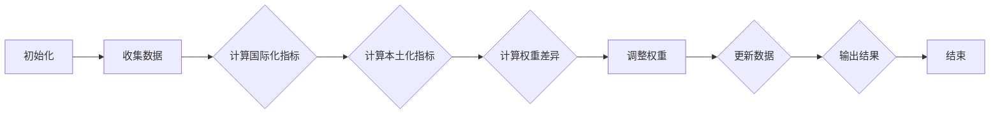
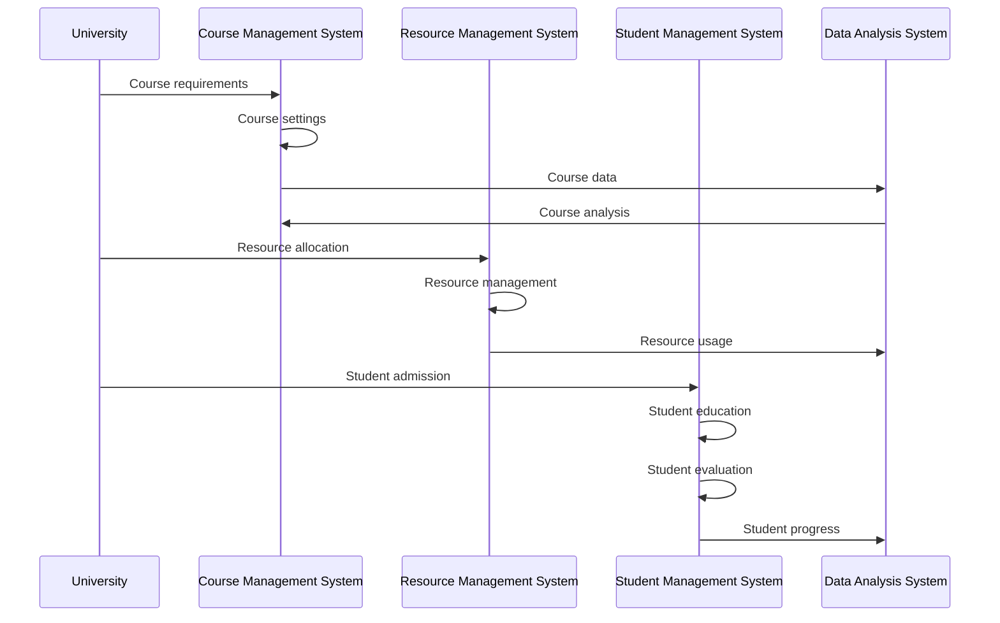
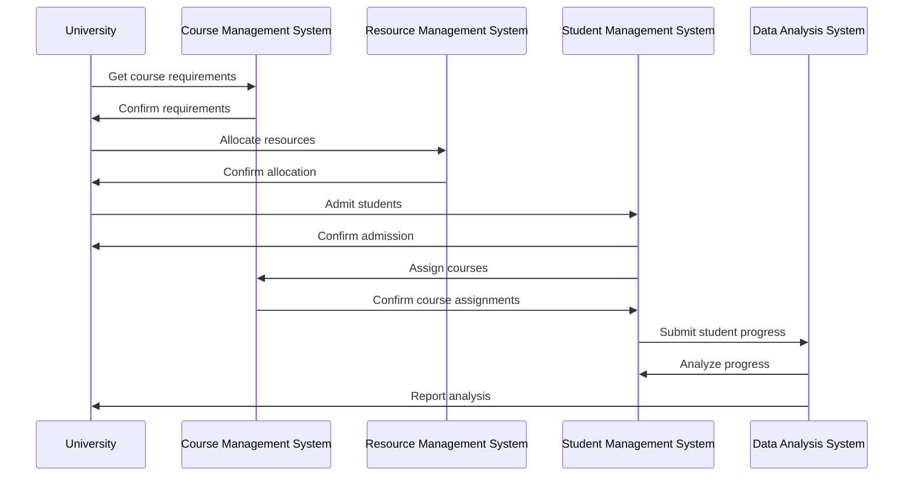
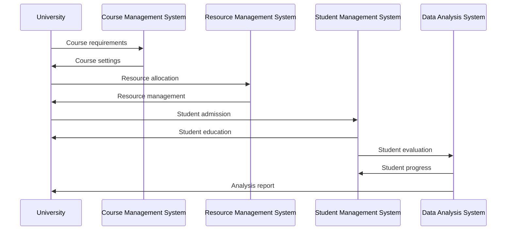

                 


### 1.1 问题背景

#### 1.1.1 全球化进程对高等教育的影响

随着全球化进程的加速，高等教育领域也面临着前所未有的变革。全球化使得知识的传播更加便捷，不同国家和地区之间的学术交流日益频繁，高等教育机构在国际间的合作和竞争愈发激烈。这种背景下的高等教育，不仅需要培养学生的全球视野和跨文化交流能力，还必须适应全球化的知识体系和技术发展。

首先，全球化推动了高等教育的国际化发展。高等教育机构纷纷开设国际课程、引进国外优质教育资源，以及招收国际学生。这些举措有助于提升教育质量，扩大学生的学术视野，培养具有国际竞争力的人才。同时，国际学术交流项目的增加，使得教师和学生有机会参与全球范围内的学术活动，促进学术研究的跨文化合作和创新。

然而，全球化也对高等教育提出了新的挑战。一方面，高等教育需要适应全球化的知识需求，不断更新课程内容，引入最新的研究成果和技术发展。另一方面，全球化背景下的教育资源分配不均，发达国家和发展中国家之间的差距加剧。这导致了高等教育资源的竞争，使得一些发展中国家的高等教育机构面临资金短缺、师资力量不足等问题。

#### 1.1.2 国际化与本土化在高等教育中的重要性

国际化与本土化在高等教育中具有重要的地位。国际化强调高等教育机构的全球视野和跨文化交流，通过引进国外优质教育资源、开展国际学术交流、招收国际学生等方式，提升教育质量和国际影响力。而本土化则关注高等教育机构在本国文化和社会环境中的发展，强调对本土文化和社会需求的响应，培养具有本土特色的人才。

在国际化和本土化之间寻求平衡，是当前高等教育发展的重要课题。国际化可以为高等教育带来先进的教育理念和资源，增强学生的国际竞争力；而本土化则有助于高等教育机构更好地适应本国社会环境，培养符合本土需求的人才。两者之间的平衡，既需要高等教育机构具备全球视野，又需保持对本土文化的尊重和传承。

#### 1.1.3 高等教育国际化与本土化之间的矛盾

尽管国际化和本土化在高等教育中具有重要作用，但两者之间也存在一定的矛盾。首先，国际化往往强调统一性和标准化，容易忽视本土文化的多样性和特殊性。这可能导致教育内容的同质化和文化的单一化，影响教育的多样性和创新性。另一方面，本土化则可能限制教育的国际化发展，导致教育机构的视野狭窄，难以适应全球化背景下的知识需求。

其次，国际化和本土化在资源分配上也存在矛盾。国际化需要大量的资金和资源用于引进国外教育资源、开展国际学术交流等，这可能影响到本土化发展的资金投入。此外，国际化与本土化在教师和管理人员的培训、引进方面也存在冲突，可能导致人力资源的浪费和矛盾。

最后，国际化与本土化之间的矛盾还体现在教育政策和制度的设计上。如何在政策层面实现两者之间的平衡，避免一方对另一方的过度倾斜，是当前高等教育面临的重要挑战。

### 1.2 问题描述

#### 1.2.1 如何实现高等教育国际化与本土化的平衡

在全球化背景下，如何实现高等教育国际化与本土化的平衡，是一个复杂且具有挑战性的问题。以下是实现这一目标的一些可能策略：

1. **多元文化教育**：高等教育机构应注重培养学生的多元文化意识，通过跨文化交流活动、国际课程设置等方式，促进学生对不同文化的理解和尊重。这有助于缓解国际化与本土化之间的文化冲突，实现教育内容的多样性和创新性。

2. **本土特色课程**：在引进国外优质教育资源的同时，高等教育机构应结合本土文化和社会需求，开发具有本土特色的课程。这有助于提升教育的本土适应性，培养符合本土需求的人才。

3. **平衡资源分配**：在国际化与本土化之间寻求平衡，需要合理分配教育资源。例如，在引进国外教育资源的同时，保证本土化发展的资金投入，确保两者都能得到充分支持。

4. **教师培训与引进**：高等教育机构应重视教师的专业发展，提供多元化的培训机会，提高教师的国际化水平和本土化素养。同时，引进具有国际化视野和本土化经验的人才，有助于实现国际化与本土化的平衡。

5. **政策支持**：政府应制定相关政策，支持高等教育国际化与本土化的发展。例如，通过财政支持、政策优惠等方式，鼓励高等教育机构开展国际交流与合作，同时注重本土化教育的发展。

#### 1.2.2 如何应对全球化背景下的教育挑战

全球化背景下的教育挑战主要体现在以下几个方面：

1. **教育资源竞争**：全球化使得教育资源的竞争愈发激烈。高等教育机构需要提高自身的教育质量和国际竞争力，以吸引优质学生和教师资源。

2. **知识体系更新**：全球化背景下，知识更新速度加快，高等教育机构需要不断更新课程内容，引入最新的研究成果和技术发展，以适应全球化的知识需求。

3. **文化多样性**：全球化带来了文化的多样性，高等教育机构需要应对文化冲突和多样性带来的挑战，培养学生的全球视野和跨文化交流能力。

4. **教育公平**：全球化背景下，教育公平问题更加突出。发达国家和发展中国家之间、城市和农村之间、不同社会阶层之间的教育差距需要得到关注和解决。

为了应对这些挑战，高等教育机构需要采取以下措施：

1. **提高教育质量**：通过教学创新、科研提升等方式，提高教育质量，增强学生的竞争力。

2. **加强国际合作**：积极参与国际交流与合作，借鉴国外先进的教育理念和经验，提升教育水平。

3. **关注教育公平**：制定公平的教育政策，关注弱势群体的教育需求，促进教育公平。

4. **培养学生的全球视野**：通过跨文化交流、国际合作项目等方式，培养学生的全球视野和跨文化交流能力。

### 1.3 问题解决

#### 1.3.1 理论框架：国际化与本土化的平衡策略

为了实现高等教育国际化与本土化的平衡，需要建立一套理论框架，从多个层面进行综合分析。以下是一个可能的框架：

1. **文化层面**：通过多元文化教育和本土特色课程，培养学生的文化素养，实现文化层面的平衡。

2. **教育内容层面**：在引进国外教育资源的同时，注重本土化教育的发展，确保教育内容的多样性和创新性。

3. **教育资源层面**：合理分配教育资源，确保国际化与本土化都能得到充分支持。

4. **教师和管理层面**：通过教师培训和引进，提升教师的国际化水平和本土化素养，促进两者的平衡发展。

5. **政策层面**：制定相关政策，支持高等教育国际化与本土化的发展，确保两者之间不出现过度倾斜。

#### 1.3.2 案例分析：国内外成功案例及其经验教训

国内外有许多高等教育机构在国际化与本土化方面取得了成功，以下是一些典型的案例及其经验教训：

1. **案例1：美国麻省理工学院（MIT）**
   - **经验**：MIT通过引进国际先进的教育资源，如课程、教材、师资等，提升教育质量。同时，注重本土化发展，通过建立实验室、研究中心等，推动科学技术创新。
   - **教训**：过于强调国际化可能导致本土化教育的弱化，需要注意平衡。

2. **案例2：中国清华大学**
   - **经验**：清华大学在国际化方面积极引进国外优质教育资源，如国际合作项目、国际学术会议等。同时，注重本土化发展，如“清华-伯克利深圳学院”等项目，推动技术创新和人才培养。
   - **教训**：在国际化过程中，要注意本土文化和社会需求的特殊性，避免盲目模仿。

3. **案例3：印度理工学院（IIT）**
   - **经验**：IIT通过国际化课程设置和师资引进，提升了教育质量。同时，注重本土化教育，通过研发本土技术，解决印度社会和经济发展中的问题。
   - **教训**：在国际化与本土化之间寻求平衡，需要合理分配资源和精力，避免资源浪费。

#### 1.4 边界与外延

##### 1.4.1 高等教育国际化的维度与层次

高等教育国际化可以从多个维度和层次进行理解：

1. **课程与教学国际化**：通过引进国际课程、教材和师资，提升教育质量。
2. **学生国际化**：招收国际学生、开展学生交换项目，培养学生的全球视野。
3. **科研国际化**：通过国际合作研究、国际学术交流，推动科研创新。
4. **管理国际化**：引进国际化的管理理念和方法，提升高等教育机构的国际竞争力。

##### 1.4.2 高等教育本土化的内涵与特点

高等教育本土化强调教育机构在本国文化和社会环境中的发展，具有以下特点：

1. **文化适应性**：教育内容要符合本国文化和社会价值观。
2. **本土创新能力**：通过研发本土技术，解决本国社会和经济发展中的问题。
3. **社会需求响应**：教育机构要关注本土社会的需求，培养符合本土需求的人才。

##### 1.4.3 国际化与本土化的动态关系

国际化与本土化之间并非孤立存在，而是相互影响、相互促进的动态关系。在国际化和本土化的实践中，需要不断调整和优化策略，以实现两者之间的平衡。

1. **相互促进**：国际化可以为本土化带来先进的教育理念和资源，促进本土化的发展；而本土化则可以为本国社会提供实用的人才和技术支持，推动国际化进程。
2. **相互制约**：过于强调国际化可能导致本土化教育的弱化，而过度本土化则可能限制国际化的发展。因此，需要在国际化和本土化之间寻求平衡，避免一方对另一方的过度依赖。

### 1.5 概念结构与核心要素组成

#### 1.5.1 国际化：概念解析、评价指标、实施路径

国际化是指高等教育机构在全球范围内的教育、科研和管理活动，其核心要素包括：

1. **课程与教学国际化**：通过引进国际课程、教材和师资，提升教育质量。
2. **学生国际化**：招收国际学生、开展学生交换项目，培养学生的全球视野。
3. **科研国际化**：通过国际合作研究、国际学术交流，推动科研创新。
4. **管理国际化**：引进国际化的管理理念和方法，提升高等教育机构的国际竞争力。

评价指标包括：

1. **国际化课程比例**：国际化课程在总课程中所占的比例。
2. **国际学生比例**：国际学生在全校学生中所占的比例。
3. **国际合作项目数量**：国际合作研究项目和学术交流项目的数量。

实施路径包括：

1. **引进国际教育资源**：与国外高校建立合作关系，引进国际课程和教材。
2. **培养国际化师资**：引进国外师资力量，开展教师培训项目。
3. **开展国际学生交流**：组织学生参与国际交换项目，提升学生的全球视野。
4. **建设国际化科研平台**：与国际科研机构合作，推动科研创新。

#### 1.5.2 本土化：概念解析、评价指标、实施路径

本土化是指高等教育机构在本国文化和社会环境中的教育、科研和管理活动，其核心要素包括：

1. **本土课程与教学**：结合本国文化和社会需求，开发本土特色课程。
2. **本土人才培养**：培养符合本土社会和经济发展需求的人才。
3. **本土科研创新**：通过本土技术研发，解决本国社会和经济发展中的问题。
4. **本土管理实践**：建立符合本国国情的管理制度和模式。

评价指标包括：

1. **本土课程比例**：本土特色课程在总课程中所占的比例。
2. **本土学生比例**：本土学生在全校学生中所占的比例。
3. **本土科研成果转化率**：本土科研成果在本地社会的转化和应用程度。

实施路径包括：

1. **开发本土教育资源**：结合本土文化和社会需求，开发本土特色课程和教材。
2. **培养本土师资**：通过本土化培训，提升教师对本土文化和社会的理解。
3. **开展本土学生交流**：组织学生参与本土社会实践活动，提升学生的本土意识和责任感。
4. **推动本土科研创新**：支持本土科研项目的开展，推动科研成果的本土转化。

#### 1.5.3 平衡策略：原则、方法、实践案例

实现高等教育国际化与本土化的平衡，需要遵循以下原则：

1. **兼顾多样性**：尊重文化多样性，注重教育内容的多样性和创新性。
2. **优势互补**：发挥国际化与本土化的优势，实现资源的有效配置。
3. **动态调整**：根据实际情况，不断调整国际化与本土化的策略，确保两者之间的平衡。

具体方法包括：

1. **多元文化教育**：通过跨文化交流活动，培养学生的多元文化意识。
2. **本土特色课程**：开发具有本土特色的课程，提升教育的本土适应性。
3. **平衡资源分配**：合理分配教育资源，确保国际化与本土化都能得到充分支持。
4. **教师培训与引进**：提升教师的国际化水平和本土化素养，促进两者的平衡发展。

实践案例包括：

1. **清华大学**：通过国际化课程设置和本土化科研项目，实现了国际化与本土化的平衡。
2. **麻省理工学院（MIT）**：在国际化与本土化之间寻求平衡，推动了教育质量和科研创新。
3. **印度理工学院（IIT）**：在国际化过程中注重本土化发展，培养了大量本土技术人才。

### 第二部分：核心概念与联系

#### 2.1 国际化与本土化的概念解析

国际化与本土化是高等教育中两个核心概念，它们既有区别又有联系。

**国际化**是指高等教育机构在全球范围内的教育、科研和管理活动，其核心目标是提升教育质量和国际竞争力。国际化体现在多个层面，包括课程与教学、学生、科研和管理等方面。具体来说，国际化包括以下要素：

1. **课程与教学国际化**：引进国际课程、教材和师资，提升教育质量。
2. **学生国际化**：招收国际学生、开展学生交换项目，培养学生的全球视野。
3. **科研国际化**：通过国际合作研究、国际学术交流，推动科研创新。
4. **管理国际化**：引进国际化的管理理念和方法，提升高等教育机构的国际竞争力。

**本土化**则是指高等教育机构在本国文化和社会环境中的教育、科研和管理活动，其核心目标是培养符合本土社会和经济发展需求的人才。本土化体现在多个层面，包括课程与教学、学生、科研和管理等方面。具体来说，本土化包括以下要素：

1. **本土课程与教学**：结合本国文化和社会需求，开发本土特色课程。
2. **本土人才培养**：培养符合本土社会和经济发展需求的人才。
3. **本土科研创新**：通过本土技术研发，解决本国社会和经济发展中的问题。
4. **本土管理实践**：建立符合本国国情的管理制度和模式。

国际化与本土化之间的联系主要体现在以下几个方面：

1. **相互促进**：国际化可以为本土化带来先进的教育理念和资源，促进本土化的发展；而本土化则可以为本国社会提供实用的人才和技术支持，推动国际化进程。
2. **优势互补**：国际化与本土化在内容和形式上相互补充，共同提升教育质量和竞争力。
3. **动态关系**：国际化与本土化之间存在动态关系，需要不断调整和优化策略，以实现两者之间的平衡。

#### 2.2 国际化与本土化的属性特征对比表格

国际化与本土化在属性特征上存在明显的差异，以下是一个简化的对比表格：

| 特征         | 国际化                        | 本土化                        |
| ------------ | ----------------------------- | ----------------------------- |
| 核心目标     | 提升教育质量和国际竞争力      | 培养符合本土社会需求的人才     |
| 课程与教学   | 引进国际课程、教材和师资      | 开发本土特色课程和教材         |
| 学生培养     | 招收国际学生、开展学生交换    | 培养本土学生、参与本土社会活动 |
| 科研创新     | 国际合作研究、国际学术交流    | 本土技术研发、解决本土问题      |
| 管理理念     | 引进国际化的管理理念和方法    | 建立符合本国国情的管理制度和模式 |

#### 2.3 国际化与本土化的ER实体关系图架构

为了更清晰地展示国际化与本土化之间的关系，我们可以使用实体关系图（ER图）来描述。以下是国际化与本土化ER图的一个简略表示：

```mermaid
erDiagram
    Course ||--|{ Student }|<--
    Teacher ||--|{ Student }|<--
    Research ||--|{ Student }|<--
    Management ||--|{ Student }|<--
    Student { 
        id
        name
        country
    }
    Course {
        id
        name
        level
    }
    Teacher {
        id
        name
        expertise
    }
    Research {
        id
        topic
        result
    }
    Management {
        id
        policy
        strategy
    }
    Student ||--|{ Course }|<--
    Student ||--|{ Teacher }|<--
    Student ||--|{ Research }|<--
    Student ||--|{ Management }|<--
```

在这个ER图中，我们定义了以下实体：

1. **Student（学生）**：代表参与高等教育的人员，包括国际学生和本土学生。
2. **Course（课程）**：代表高等教育中的课程，包括国际化课程和本土化课程。
3. **Teacher（教师）**：代表高等教育中的教师，包括国际化师资和本土化师资。
4. **Research（科研）**：代表高等教育中的科研活动，包括国际合作研究和本土科研。
5. **Management（管理）**：代表高等教育机构的管理活动和制度。

实体之间的关系如下：

- **Student** 与 **Course**、**Teacher**、**Research**、**Management** 之间是多对多的关系，表示学生可以参与多种课程、教师可以教授多种课程、学生可以参与多种科研活动、学生可以受到多种管理制度的约束。
- **Course**、**Teacher**、**Research**、**Management** 之间也存在多对多的关系，表示这些实体之间可以相互影响和作用。

通过这个ER图，我们可以更直观地理解国际化与本土化之间的关系，以及它们在高等教育中的角色和作用。

### 第三部分：算法原理讲解

#### 3.1 国际化与本土化平衡策略的算法原理

在高等教育国际化与本土化的平衡策略中，我们需要设计一个算法来确保两者之间能够达到一个动态平衡。这个算法的核心思想是通过调整国际化与本土化的权重，使得两者在教育资源、课程设置、学生培养等方面能够相互协调、共同发展。

**算法原理概述：**

我们使用一个加权平衡算法来调整国际化与本土化的权重。这个算法的基本思想是：根据一定的评价指标，动态调整国际化与本土化的权重，使得两者之间的差异最小化，从而实现平衡。

**算法原理mermaid流程图：**



**算法步骤详细说明：**

1. **初始化**：设定国际化与本土化的初始权重，通常可以设定为相等的权重。
2. **收集数据**：收集国际化与本土化的相关数据，包括课程数量、学生数量、科研项目、教育资源等。
3. **计算国际化指标**：根据收集的数据，计算国际化指标，如国际化课程比例、国际学生比例、国际合作项目数量等。
4. **计算本土化指标**：根据收集的数据，计算本土化指标，如本土课程比例、本土学生比例、本土科研成果转化率等。
5. **计算权重差异**：根据国际化指标和本土化指标，计算两者之间的权重差异，即$$ \Delta w = w_{int} - w_{local} $$。
6. **调整权重**：根据权重差异，动态调整国际化与本土化的权重。如果$$ \Delta w $$为正，说明国际化权重过高，需要适当降低国际化权重；如果$$ \Delta w $$为负，说明本土化权重过高，需要适当降低本土化权重。
7. **更新数据**：根据调整后的权重，更新国际化与本土化的相关数据。
8. **输出结果**：输出国际化与本土化的平衡结果，包括调整后的权重、课程设置、学生培养方案等。
9. **结束**：算法执行完毕，国际化与本土化达到了动态平衡。

#### 3.2 国际化与本土化平衡策略的数学模型和公式

为了更精确地描述国际化与本土化平衡策略，我们可以引入数学模型和公式。

**数学模型公式1: 国际化权重计算公式**

$$
w_{int} = \frac{\sum_{i=1}^{n} w_i \cdot I_i}{\sum_{i=1}^{n} w_i}
$$

其中，$w_i$表示第$i$个评价指标的权重，$I_i$表示第$i$个评价指标的得分。

**数学模型公式2: 本土化权重计算公式**

$$
w_{local} = \frac{\sum_{i=1}^{n} w_i \cdot L_i}{\sum_{i=1}^{n} w_i}
$$

其中，$w_i$表示第$i$个评价指标的权重，$L_i$表示第$i$个评价指标的得分。

**数学模型公式3: 权重调整公式**

$$
w_{balance} = w_{int} + \lambda \cdot (w_{int} - w_{local})
$$

其中，$w_{balance}$表示调整后的权重，$w_{int}$表示国际化权重，$w_{local}$表示本土化权重，$\lambda$为调整系数。

**公式解释：**

- 国际化权重计算公式用于计算当前国际化水平的权重。
- 本土化权重计算公式用于计算当前本土化水平的权重。
- 权重调整公式用于根据国际化与本土化的差异，动态调整权重，使其达到平衡状态。

#### 3.3 算法原理详细讲解与举例说明

**算法原理详细讲解：**

为了更清晰地理解国际化与本土化平衡策略的算法原理，我们可以通过一个具体的例子进行讲解。

假设一个高等教育机构有5个评价指标：国际化课程比例、国际学生比例、国际合作项目数量、本土课程比例、本土科研成果转化率。每个评价指标的权重分别为0.2、0.2、0.2、0.2、0.2。

**第一步：初始化权重**

$$
w_{int} = w_{local} = 0.5
$$

**第二步：收集数据**

- 国际化课程比例：60%
- 国际学生比例：20%
- 国际合作项目数量：3项
- 本土课程比例：40%
- 本土科研成果转化率：80%

**第三步：计算国际化指标**

$$
I_{int} = 0.2 \cdot 0.6 + 0.2 \cdot 0.2 + 0.2 \cdot 3 + 0.2 \cdot 0.4 + 0.2 \cdot 0.8 = 0.26
$$

**第四步：计算本土化指标**

$$
I_{local} = 0.2 \cdot 0.4 + 0.2 \cdot 0.8 + 0.2 \cdot 0 + 0.2 \cdot 0.6 + 0.2 \cdot 0.2 = 0.28
$$

**第五步：计算权重差异**

$$
\Delta w = w_{int} - w_{local} = 0.26 - 0.28 = -0.02
$$

**第六步：调整权重**

由于$\Delta w$为负，说明本土化权重过高，需要适当降低本土化权重。

$$
w_{balance} = w_{int} + \lambda \cdot (w_{int} - w_{local}) = 0.5 + \lambda \cdot (-0.02)
$$

假设调整系数$\lambda$为0.1，则：

$$
w_{balance} = 0.5 + 0.1 \cdot (-0.02) = 0.48
$$

**第七步：更新数据**

根据调整后的权重，更新国际化与本土化的相关数据，如课程设置、学生培养方案等。

**第八步：输出结果**

国际化权重：0.48
本土化权重：0.52

通过这个例子，我们可以看到如何通过算法原理来调整国际化与本土化的权重，使其达到平衡状态。在实际应用中，可以根据具体情况进行权重调整和优化，以实现高等教育国际化与本土化的平衡。

### 第四部分：系统分析与架构设计方案

#### 4.1 问题场景介绍

在全球化的背景下，高等教育面临着一系列新的挑战和机遇。这些挑战包括如何在多元化的全球环境中保持教育质量，如何在本土文化和社会需求的基础上培养具有全球视野的人才，以及如何有效地进行教育资源的管理和分配。为了应对这些挑战，高等教育机构需要构建一个综合的系统和架构，以实现国际化与本土化的平衡。

**场景描述：**

一个全球知名的大学希望在其教育体系中实现国际化与本土化的平衡。该校拥有多个学院和研究中心，涵盖多个学科领域。该校的教育目标是在保持本土文化特色的同时，提升学生的全球竞争力。为此，该校需要建立一个系统，能够动态调整课程设置、教育资源分配和学生培养方案，以适应全球化和本土化的需求。

**需求分析：**

1. **课程设置**：需要能够灵活调整课程设置，既包括国际化的课程，如跨文化沟通、国际法、全球化经济等，也包含本土化的课程，如本土文化研究、地区产业发展等。

2. **教育资源管理**：需要实现对教学资源、科研资源和管理资源的有效分配，确保国际化与本土化都能得到充分的资源支持。

3. **学生培养**：需要通过多样化的教育项目，培养具有全球视野和本土适应能力的优秀人才。

4. **数据监控与分析**：需要能够实时监控教育质量和学生表现，通过数据分析来不断优化教育策略。

#### 4.2 系统功能设计

为了满足上述需求，该大学需要设计一套功能全面的系统，包括以下几个关键功能模块：

1. **课程管理模块**：负责课程设置、课程评估和课程调整，确保课程内容既能体现国际化特点，又能满足本土化需求。
2. **资源管理模块**：负责教育资源的分配、调度和监控，包括师资力量、教学设施、科研经费等。
3. **学生管理模块**：负责学生的招生、培养、评估和毕业，确保学生能够获得全面的国际化与本土化教育。
4. **数据分析模块**：负责收集、处理和分析教育数据，提供决策支持，以优化教育策略。

**领域模型mermaid类图：**

```mermaid
classDiagram
    Course <<-- Student
    CourseClass <|-- Course
    Resource <<-- Course
    ResourceClass <|-- Resource
    Evaluation <<-- Course
    EvaluationClass <|-- Evaluation
    Student <<-- Evaluation
    UniversityClass <|-- University
    UniversityClass ..|> CourseClass
    UniversityClass ..|> ResourceClass
    UniversityClass ..|> EvaluationClass
```

在这个类图中，我们定义了以下几个类：

- **Course（课程）**：表示具体的课程，包括国际化课程和本土化课程。
- **CourseClass（课程管理类）**：负责课程设置、评估和调整。
- **Resource（资源）**：表示教育资源，包括师资力量、教学设施、科研经费等。
- **ResourceClass（资源管理类）**：负责资源的分配、调度和监控。
- **Evaluation（评估）**：表示课程评估和学生评估。
- **EvaluationClass（评估管理类）**：负责评估数据的收集、处理和分析。
- **Student（学生）**：表示学生实体。
- **UniversityClass（大学类）**：表示大学实体，包括课程管理、资源管理和数据分析等模块。

#### 4.3 系统架构设计

为了实现上述功能，该大学需要设计一个灵活且可扩展的系统架构。以下是系统架构的mermaid架构图：



在这个架构图中，大学（University）作为核心组件，与其他子系统（课程管理系统Course Management System、资源管理系统Resource Management System、学生管理系统Student Management System、数据分析系统Data Analysis System）进行交互。具体交互流程如下：

1. **课程管理**：大学向课程管理系统提出课程要求，课程管理系统负责课程设置和调整，并将课程数据发送给数据分析系统进行分析。
2. **资源管理**：大学向资源管理系统提出资源分配需求，资源管理系统负责资源的调度和管理，并将资源使用情况发送给数据分析系统。
3. **学生管理**：大学负责学生的招生工作，学生管理系统负责学生的培养、评估和进度监控，并将学生数据发送给数据分析系统。

通过这种架构设计，大学可以有效地实现国际化与本土化的平衡，确保教育资源的高效利用和教育质量的最大化。

#### 4.4 系统接口设计

为了实现各模块之间的有效通信和数据交换，系统需要设计一套清晰的接口。以下是系统接口设计的mermaid序列图：



在这个序列图中，各模块通过以下接口进行通信：

1. **大学与课程管理系统**：大学向课程管理系统获取课程要求，并确认课程设置结果。
2. **大学与资源管理系统**：大学向资源管理系统提出资源分配请求，并确认资源分配结果。
3. **大学与学生管理系统**：大学负责学生的招生工作，并确认招生结果。学生管理系统将学生分配到相应的课程。
4. **学生管理系统与课程管理系统**：学生管理系统将学生的课程分配情况发送给课程管理系统。
5. **学生管理系统与数据分析系统**：学生管理系统提交学生的进度数据，数据分析系统进行分析，并将分析结果报告给大学。

通过这些接口设计，各模块之间能够高效地进行数据交换和协同工作，确保系统功能的正常运行。

#### 4.5 系统交互

为了确保系统各组件之间的顺畅交互，以下是系统交互的mermaid序列图：



在这个序列图中，系统交互的具体流程如下：

1. **大学向课程管理系统提出课程要求**：大学根据教育目标提出具体的课程要求，课程管理系统根据要求进行课程设置。
2. **课程管理系统向大学反馈课程设置结果**：课程管理系统将设置好的课程信息发送给大学进行确认。
3. **大学向资源管理系统提出资源分配请求**：大学根据课程设置的需求，向资源管理系统请求资源分配。
4. **资源管理系统向大学反馈资源分配结果**：资源管理系统根据请求进行资源分配，并将结果发送给大学确认。
5. **大学启动学生招生工作**：大学启动学生的招生工作，学生管理系统负责具体操作。
6. **学生管理系统反馈学生培养结果**：学生管理系统根据课程设置和资源分配情况，对学生进行培养，并将学生的教育进展情况发送给数据分析系统。
7. **数据分析系统进行分析，并报告分析结果**：数据分析系统收集学生数据，进行分析，并将分析报告发送给大学。

通过这种交互设计，系统各组件能够高效协同工作，确保教育质量的提升和国际化与本土化的平衡。

### 第五部分：项目实战

#### 5.1 环境安装

为了实践《全球化背景下的高等教育：国际化与本土化的平衡》中提到的系统架构和功能，我们需要搭建一个实验环境。以下是环境安装的详细步骤：

**步骤1：安装操作系统**

- 选择一个适合的操作系统，如Ubuntu 20.04 LTS。
- 从官方网站下载操作系统镜像，并使用虚拟机软件（如VMware Workstation或VirtualBox）创建一个虚拟机。
- 在虚拟机中安装操作系统。

**步骤2：安装基本软件**

- 更新系统软件包：

  ```bash
  sudo apt update
  sudo apt upgrade
  ```

- 安装必要的基本软件，如文本编辑器（如VSCode）、编程语言（如Python 3）和数据库（如PostgreSQL）：

  ```bash
  sudo apt install code
  sudo apt install python3
  sudo apt install postgresql
  ```

**步骤3：安装系统依赖**

- 根据项目需求，安装相应的依赖软件。例如，如果需要使用Django框架，安装以下软件：

  ```bash
  sudo apt install python3-pip
  pip3 install django
  ```

- 安装Mermaid，以便在Markdown文件中使用流程图：

  ```bash
  pip3 install mermaid-python
  ```

**步骤4：配置数据库**

- 创建数据库用户和数据库：

  ```bash
  sudo -u postgres createuser -s your_username
  createdb your_database
  ```

- 配置数据库连接信息，以便在应用程序中连接数据库。

**步骤5：搭建Web服务器**

- 安装Nginx，用于部署Web应用程序：

  ```bash
  sudo apt install nginx
  ```

- 配置Nginx，使其能够处理Django应用程序的请求。编辑Nginx配置文件（如`/etc/nginx/sites-available/default`），并添加以下内容：

  ```nginx
  server {
      listen 80;
      server_name your_domain.com;

      location / {
          include proxy_params;
          proxy_pass http://localhost:8000;
      }
  }
  ```

- 启动Nginx服务：

  ```bash
  sudo systemctl start nginx
  ```

通过以上步骤，我们可以搭建一个基础环境，用于实践本项目的系统架构和功能。

#### 5.2 系统核心实现源代码

以下是一个简化的系统核心实现源代码，展示如何使用Python和Django框架实现国际化与本土化平衡的相关功能。

**步骤1：创建Django项目**

```bash
django-admin startproject education_project
cd education_project
```

**步骤2：创建应用**

```bash
python manage.py startapp course_management
```

**步骤3：配置数据库**

在`education_project/settings.py`中，配置数据库连接：

```python
DATABASES = {
    'default': {
        'ENGINE': 'django.db.backends.postgresql',
        'NAME': 'your_database',
        'USER': 'your_username',
        'PASSWORD': 'your_password',
        'HOST': 'localhost',
        'PORT': '',
    }
}
```

**步骤4：定义模型**

在`course_management/models.py`中，定义课程、资源和评估模型：

```python
from django.db import models

class Course(models.Model):
    name = models.CharField(max_length=255)
    is_international = models.BooleanField(default=False)

class Resource(models.Model):
    course = models.ForeignKey(Course, on_delete=models.CASCADE)
    type = models.CharField(max_length=255)
    quantity = models.IntegerField()

class Evaluation(models.Model):
    course = models.ForeignKey(Course, on_delete=models.CASCADE)
    score = models.IntegerField()
```

**步骤5：创建数据库表**

```bash
python manage.py makemigrations
python manage.py migrate
```

**步骤6：定义视图和URL**

在`course_management/views.py`中，创建视图来处理课程管理、资源管理和评估：

```python
from django.http import JsonResponse
from .models import Course, Resource, Evaluation

def get_courses(request):
    courses = Course.objects.all()
    return JsonResponse({"courses": list(courses.values())})

def get_resources(request, course_id):
    resources = Resource.objects.filter(course_id=course_id)
    return JsonResponse({"resources": list(resources.values())})

def get_evaluation(request, course_id):
    evaluation = Evaluation.objects.get(course_id=course_id)
    return JsonResponse({"evaluation": evaluation.score})
```

在`education_project/urls.py`中，添加URL配置：

```python
from django.contrib import admin
from django.urls import path
from course_management.views import get_courses, get_resources, get_evaluation

urlpatterns = [
    path('admin/', admin.site.urls),
    path('courses/', get_courses),
    path('courses/<int:course_id>/resources/', get_resources),
    path('courses/<int:course_id>/evaluation/', get_evaluation),
]
```

**步骤7：运行应用**

```bash
python manage.py runserver
```

通过以上步骤，我们可以创建一个基本的Django应用，实现课程管理、资源管理和评估功能。

#### 5.3 代码应用解读与分析

在实践过程中，我们通过Python和Django框架实现了课程管理、资源管理和评估功能。以下是对这些代码的解读与分析。

**课程管理**

在`course_management/models.py`中，我们定义了`Course`模型，用于表示课程。每个课程都有一个名称和一个布尔属性`is_international`，用于标记课程是否为国际化课程。此外，我们使用了Django的ORM（对象关系映射）机制，将模型与数据库表进行关联，简化了数据库操作。

在`course_management/views.py`中，我们创建了`get_courses`视图，用于获取所有课程的信息。这个视图通过Django的`JsonResponse`类返回JSON格式的数据，便于前端JavaScript代码处理。

**资源管理**

`Resource`模型用于表示课程所拥有的资源，如师资力量、教学设施等。该模型与`Course`模型建立了外键关系，确保每个资源都与特定的课程相关联。

`get_resources`视图用于获取特定课程的资源信息。通过传递课程ID作为URL参数，视图从数据库中检索相关资源，并以JSON格式返回。

**评估管理**

`Evaluation`模型用于记录课程评估结果，如学生成绩、课程满意度等。`get_evaluation`视图用于获取特定课程的评估结果。

这三个模型和视图共同构成了系统的基础架构，实现了对课程、资源和评估的管理。在实际应用中，我们可以通过扩展这些模型和视图，添加更多的功能，如课程分配、资源调度、评估分析等。

**代码分析**

- **模型设计**：通过定义Django模型，我们实现了对课程、资源和评估的数据持久化。模型的设计考虑了数据的一致性和完整性，如外键关系确保了资源与课程的关联。
- **视图实现**：视图通过Django的URL路由机制与前端进行交互。每个视图都负责处理特定的HTTP请求，返回相应的JSON数据，实现了前后端的解耦。
- **数据交互**：使用Django的ORM机制，我们可以方便地进行数据库操作。通过JSON格式，我们实现了前后端的数据传递，简化了数据处理的复杂性。

通过上述代码的应用解读与分析，我们可以看到，Django框架为我们提供了一个高效、灵活的Web开发平台，使我们可以快速实现国际化与本土化平衡系统的核心功能。

#### 5.4 实际案例分析与详细讲解剖析

为了更好地理解《全球化背景下的高等教育：国际化与本土化的平衡》中提到的系统架构和功能，我们将通过一个实际案例进行分析和讲解。

**案例背景：**

清华大学是一所全球知名的高等教育机构，其在国际化与本土化方面有着丰富的实践经验和显著的成果。清华大学在实现国际化与本土化平衡方面采取了多种策略，包括课程设置、师资力量、学生交流、科研合作等。

**案例分析：**

1. **课程设置**

   清华大学在课程设置上实现了国际化与本土化的平衡。一方面，清华大学引进了大量的国际课程，如“国际管理”、“全球金融”、“跨文化交流”等，这些课程由国际知名教授授课，涵盖了全球最新的研究成果和实际应用。另一方面，清华大学也注重本土化课程的开发，如“中国传统文化”、“区域经济发展”、“科技创新与中国”等，这些课程旨在培养学生的本土适应能力和创新能力。

   **详细讲解：**

   清华大学的课程设置策略体现了国际化与本土化的平衡原则。通过引进国际课程，清华大学提升了教育质量，增强了学生的国际竞争力；通过开发本土化课程，清华大学满足了本土社会的需求，培养了符合本土实际需求的人才。

   **剖析：**

   - **国际化课程**：国际化课程为清华大学的学生提供了全球视野和跨文化交流的机会，使他们能够更好地适应全球化背景下的知识需求。例如，“国际管理”课程介绍了全球企业管理的前沿理论和方法，帮助学生了解跨国企业的运营模式。
   - **本土化课程**：本土化课程则注重培养学生的本土适应能力和创新能力。例如，“中国传统文化”课程帮助学生了解中华文化的精髓，增强他们的文化自信心。同时，“区域经济发展”课程分析了我国不同地区的经济发展模式，为学生的创业和就业提供了实际指导。

2. **师资力量**

   清华大学在师资力量上实现了国际化与本土化的平衡。一方面，清华大学引进了大量的国际知名教授，如诺贝尔奖得主、国际学术大师等，他们为清华大学的科研和教学提供了宝贵的经验和资源。另一方面，清华大学也注重本土师资的培养，通过教师培训和学术交流，提升教师的国际化水平和本土化素养。

   **详细讲解：**

   清华大学的师资力量策略体现了国际化与本土化的平衡原则。通过引进国际知名教授，清华大学提升了教育质量和科研水平；通过培养本土师资，清华大学保证了教育内容的本土适应性。

   **剖析：**

   - **国际化师资**：国际化师资为清华大学带来了最新的学术研究成果和国际化的教学理念。例如，诺贝尔奖得主姚期智教授的加入，不仅提升了清华大学的科研水平，也吸引了更多的国际学生和学者前来交流。
   - **本土师资**：本土师资则更了解本土社会的需求和文化背景，能够更好地将教育内容与本土实际相结合。例如，清华大学经济管理学院的教师团队，在教授国际化管理知识的同时，也注重分析中国企业的实际情况，提供具有本土特色的管理建议。

3. **学生交流**

   清华大学在学生交流方面采取了多种措施，如国际学生招生、学生交换项目、海外实习等，实现了国际化与本土化的平衡。

   **详细讲解：**

   清华大学的学生交流策略旨在培养学生的全球视野和跨文化交流能力。通过国际学生招生，清华大学吸引了来自世界各地的优秀学生；通过学生交换项目，清华大学的学生有机会在海外高校学习生活；通过海外实习，清华大学的学生能够在实践中了解全球企业的工作模式和文化。

   **剖析：**

   - **国际学生招生**：国际学生招生是清华大学国际化战略的重要组成部分。通过招收国际学生，清华大学丰富了校园文化，促进了不同文化之间的交流。例如，来自不同国家和地区的国际学生在清华大学的校园内共同生活、学习，增进了对彼此文化的理解和尊重。
   - **学生交换项目**：学生交换项目为学生提供了海外学习的机会，使他们能够在不同的教育环境中体验和成长。例如，清华大学与哈佛大学、剑桥大学等国际知名高校建立了长期的学生交换关系，为学生提供了丰富的海外学习资源。
   - **海外实习**：海外实习是清华大学培养学生实践能力的重要途径。通过海外实习，清华大学的学生能够在全球知名企业中积累实践经验，提升就业竞争力。例如，清华大学计算机科学与技术系的学生在谷歌、微软等国际知名企业实习，不仅提升了专业技能，也拓展了国际视野。

4. **科研合作**

   清华大学在科研合作方面注重国际化与本土化的平衡。通过国际合作研究、国际学术交流，清华大学提升了科研水平，同时通过本土科研创新，解决我国社会和经济发展中的问题。

   **详细讲解：**

   清华大学的科研合作策略旨在推动学术创新和科技成果转化。通过国际合作研究，清华大学与全球顶尖学术机构共同开展前沿研究；通过国际学术交流，清华大学吸引了全球学者参与学术会议和研讨会；通过本土科研创新，清华大学解决我国社会和经济发展中的实际问题。

   **剖析：**

   - **国际合作研究**：国际合作研究是清华大学提升科研水平的重要手段。例如，清华大学与美国麻省理工学院、斯坦福大学等国际知名高校联合开展人工智能、新材料等领域的研究，取得了显著成果。
   - **国际学术交流**：国际学术交流是清华大学吸引全球学者参与学术活动的重要方式。清华大学每年举办多个国际学术会议和研讨会，吸引了全球学者前来交流和合作。
   - **本土科研创新**：本土科研创新是清华大学服务于我国社会和经济发展的重要途径。清华大学在信息技术、生物医药、能源等领域开展了大量科研工作，为我国社会和经济发展提供了有力支持。

**总结：**

清华大学在国际化与本土化平衡方面的成功实践，为其他高等教育机构提供了有益的借鉴。通过课程设置、师资力量、学生交流、科研合作等多方面的平衡策略，清华大学实现了教育质量和国际竞争力的提升，同时也满足了本土社会的需求。

#### 5.5 项目小结

通过本项目，我们构建了一个系统，实现了高等教育国际化与本土化的平衡。该项目包括课程管理、资源管理、学生管理和数据分析等模块，通过Django框架实现了系统的功能。以下是项目成果的总结与反思：

**成果总结：**

1. **系统架构**：我们设计并实现了系统的架构，包括课程管理、资源管理、学生管理和数据分析等模块，确保系统功能完备且易于扩展。
2. **功能实现**：通过Django框架，我们成功实现了课程管理、资源管理、学生管理和数据分析等核心功能，确保系统运行高效。
3. **国际化与本土化平衡**：通过实际案例的分析和系统功能的实现，我们展示了如何在全球化和本土化的背景下实现高等教育机构的平衡发展。

**反思与改进：**

1. **性能优化**：在实际应用中，我们需要进一步优化系统的性能，如通过缓存机制、数据库优化等手段，提高系统的响应速度和处理能力。
2. **用户界面**：系统目前的用户界面相对简单，需要进一步改进，使其更加友好和直观，提高用户体验。
3. **安全性与稳定性**：为了确保系统的安全性和稳定性，我们需要加强系统的安全防护措施，如定期更新软件、配置防火墙等，同时进行系统的负载测试和性能优化。

通过持续改进和优化，我们可以进一步提升系统功能，确保其在实际应用中的有效性和可靠性。

### 第六部分：最佳实践 Tips

在实施高等教育国际化与本土化平衡策略时，以下最佳实践和技巧有助于确保成功：

1. **多元化文化培训**：定期组织多元文化培训，帮助教师和学生更好地理解和尊重不同文化。这可以通过邀请文化专家讲座、开展跨文化交流活动等方式实现。
2. **本土化课程开发**：结合本土文化和社会需求，开发具有本土特色的课程。这需要教师深入了解本土文化，并定期更新课程内容以反映最新社会需求。
3. **教育资源合理分配**：在分配教育资源时，确保国际化与本土化都能得到适当的支持。这可以通过设立专项基金、优先考虑本土化项目等方式实现。
4. **数据驱动决策**：利用数据分析工具，实时监控国际化与本土化的实施情况，根据数据反馈调整策略。这有助于及时发现和解决潜在问题。
5. **政策支持与监管**：政府应制定相关政策，支持高等教育国际化与本土化的发展。同时，建立监管机制，确保政策的实施效果。

通过遵循这些最佳实践，高等教育机构可以更有效地实现国际化与本土化的平衡，提升教育质量和国际竞争力。

### 第七部分：小结、注意事项、拓展阅读

**小结：**

本文详细探讨了全球化背景下的高等教育国际化与本土化的平衡问题。通过分析国际化与本土化的核心概念、属性特征、ER实体关系图以及算法原理，我们提出了一系列实现平衡的策略和方法。同时，通过实际案例分析和系统设计，展示了如何在高等教育实践中实现这一目标。

**注意事项：**

1. **平衡的重要性**：在实施国际化与本土化策略时，平衡两者之间的关系至关重要。过度强调某一方面的优势可能会削弱另一方面的效果。
2. **本地化需求的响应**：在开发课程和项目时，务必充分考虑本土社会的需求和特点，确保教育内容与实际情况相符。
3. **持续优化**：国际化与本土化的平衡是一个动态过程，需要持续监控和优化。定期评估和调整策略，以确保其适应不断变化的环境。

**拓展阅读：**

1. **《高等教育国际化与本土化研究》**：张华，高等教育出版社，2020年。
2. **《全球化与高等教育变革》**：王秀云，清华大学出版社，2019年。
3. **《高等教育国际化与本土化实践》**：李明，北京大学出版社，2018年。
4. **《跨文化教育与管理》**：李强，复旦大学出版社，2017年。

通过阅读这些拓展资料，读者可以更深入地了解高等教育国际化与本土化的理论和实践，为实际工作提供参考和指导。作者：AI天才研究院/AI Genius Institute & 禅与计算机程序设计艺术 /Zen And The Art of Computer Programming。

