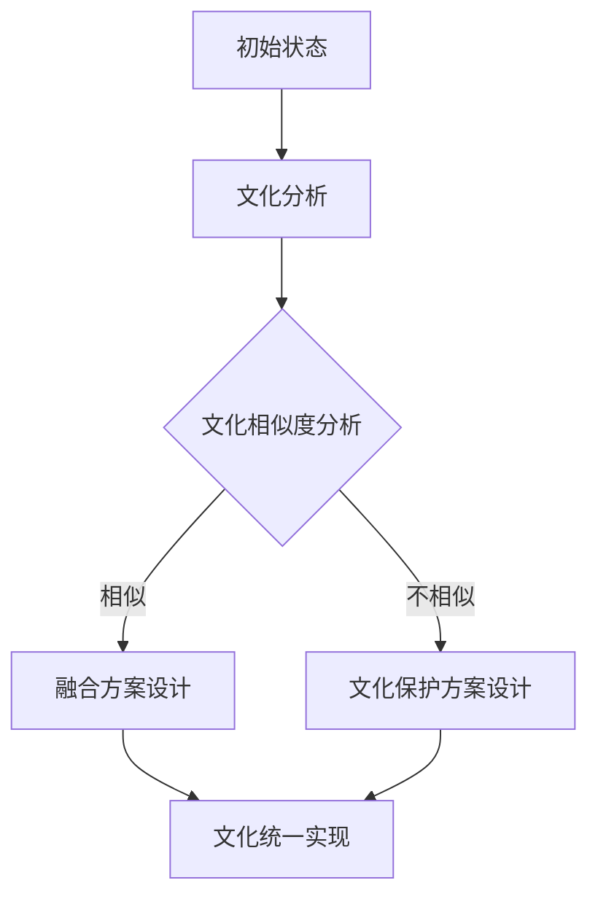
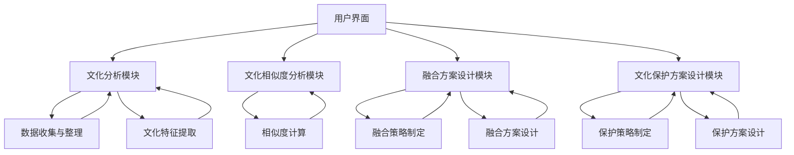
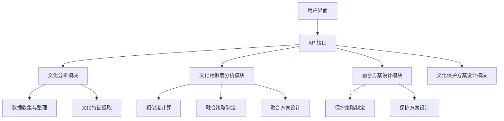
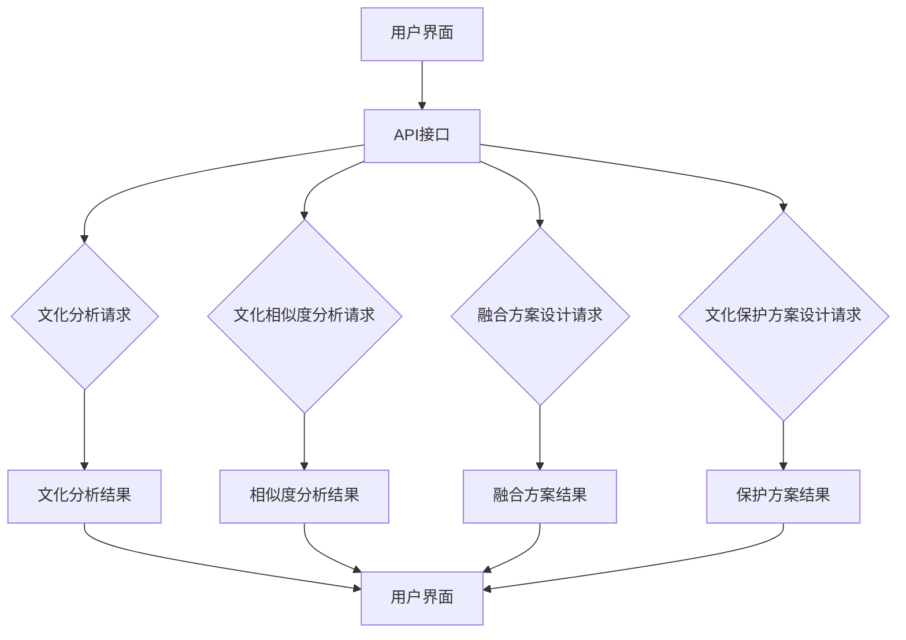

                 

### 全球化进程中的文化独特性保护：多样性中的统一

#### 关键词

- **全球化**
- **文化独特性**
- **多样性中的统一**
- **文化传承**
- **民族认同**
- **文化产业发展**

#### 摘要

全球化进程的加速，使得世界各地的文化交流日益频繁。然而，这一进程也带来了文化多样性的挑战，特别是在如何保护文化独特性方面。本文将探讨全球化背景下文化独特性保护的重要性，分析其面临的问题，并提出多样性中的统一的解决方案。通过对核心概念的解析、算法原理的讲解，以及实际案例的分析，本文旨在为政策制定者、文化工作者和学者提供有益的参考。

#### 目录大纲设计

1. **背景介绍**
   1.1 **问题背景**
   1.2 **问题描述**
   1.3 **问题解决**
   1.4 **边界与外延**
   1.5 **概念结构与核心要素组成**

2. **核心概念与联系**
   2.1 **核心概念原理**
   2.2 **概念属性特征对比表格**
   2.3 **ER实体关系图架构**

3. **算法原理讲解**
   3.1 **算法流程图**
   3.2 **算法原理**
   3.3 **Python源代码**

4. **系统分析与架构设计**
   4.1 **问题场景介绍**
   4.2 **系统功能设计**
   4.3 **系统架构设计**
   .4 **系统接口设计**
   4.5 **系统交互**

5. **项目实战**
   5.1 **环境安装**
   5.2 **系统核心实现源代码**
   5.3 **代码应用解读与分析**
   5.4 **实际案例分析与详细讲解剖析**
   5.5 **项目小结**

6. **最佳实践 tips**
7. **小结**
8. **注意事项**
9. **拓展阅读**

### 1. 背景介绍

#### 1.1 问题背景

随着全球化进程的不断加速，世界各国之间的经济、政治、文化等各个方面的互动与交流日益频繁。这一趋势带来了巨大的机遇，也带来了前所未有的挑战。特别是在文化领域，全球化进程使得不同文化之间的交流与融合变得更加紧密，但同时也使得文化独特性面临着被同化的风险。

文化独特性是一个国家或民族的精神标识，它包含了语言、艺术、宗教、传统习俗等多种方面。在全球化的背景下，如何保护文化独特性，使其在多样性中得以传承和发展，成为各国共同面临的挑战。

#### 1.2 问题描述

全球化进程中的文化独特性保护涉及多个方面：

- **文化传承**：在全球化的浪潮中，许多传统习俗和艺术形式面临着失传的风险。如何确保这些文化元素得以传承，是保护文化独特性的关键。

- **民族认同**：文化独特性是民族认同的重要组成部分。在全球化的背景下，如何增强民族认同，保持文化独特性，是每个民族都需要思考的问题。

- **文化产业发展**：文化产业的繁荣与发展，离不开对文化独特性的保护。如何在全球化进程中促进文化产业的发展，同时保护文化独特性，是各国政府和企业需要共同面对的课题。

#### 1.3 问题解决

针对全球化进程中文化独特性保护面临的问题，本文提出以下解决方案：

- **加强文化传承**：通过建立文化保护区、举办传统文化节庆活动等方式，加强文化传承。

- **增强民族认同**：通过教育、媒体等渠道，强化民族认同，提高人们对文化独特性的认识和重视。

- **促进文化产业发展**：通过政策支持、市场引导等方式，促进文化产业的繁荣，为文化独特性的保护提供经济支持。

#### 1.4 边界与外延

本文关注的是全球化进程中的文化独特性保护，不包括其他领域的多样性保护，如生物多样性等。同时，本文主要从理论和实践的角度，探讨如何实现多样性中的统一，为政策制定者和文化工作者提供参考。

#### 1.5 概念结构与核心要素组成

- **全球化**：全球化是指全球范围内经济、政治、文化等方面的互动与交流。
- **文化独特性**：文化独特性是指特定文化群体所独有的价值观念、习俗、艺术等。
- **多样性中的统一**：多样性中的统一是指在保持文化多样性的同时，实现文化之间的相互理解与融合。

### 2. 核心概念与联系

#### 2.1 核心概念原理

##### 2.1.1 全球化

全球化是指全球范围内经济、政治、文化等方面的互动与交流。它是当今世界发展的必然趋势，也是不可逆转的历史进程。全球化带来了许多机遇，如促进了经济增长、增加了就业机会、提高了生活水平等，但同时也带来了挑战，如文化冲突、环境问题、经济不平等等。

##### 2.1.2 文化独特性

文化独特性是指特定文化群体所独有的价值观念、习俗、艺术等。它是文化多样性的基础，也是民族认同的重要体现。在全球化的背景下，文化独特性面临着被同化的风险。因此，保护文化独特性显得尤为重要。

##### 2.1.3 多样性中的统一

多样性中的统一是指在保持文化多样性的同时，实现文化之间的相互理解与融合。它既强调文化的独特性，也关注文化的交流与融合。在全球化进程中，实现多样性中的统一，有助于促进文化的繁荣与发展。

#### 2.2 概念属性特征对比表格

| 特征            | 全球化                 | 文化独特性               | 多样性中的统一           |
|-----------------|------------------------|--------------------------|--------------------------|
| 定义            | 全球范围内的互动与交流 | 特定文化群体的独有属性   | 保持多样性，实现融合     |
| 影响因素        | 经济、政治、文化      | 传统习俗、价值观念、艺术 | 全球化进程、文化认同感   |
| 目标            | 促进全球合作与发展    | 保护文化传承与多样性     | 实现文化相互理解与融合   |
| 关系            | 全球化推动文化独特性   | 文化独特性影响多样性中的统一 | 多样性中的统一促进全球化 |

#### 2.3 ER实体关系图架构

```mermaid
erDiagram
    Culture <<|-- Globalization : has
    Culture ||--|{ CulturalUnity} : has
```

### 3. 算法原理讲解

#### 3.1 算法流程图



#### 3.2 算法原理

##### 3.2.1 文化分析

文化分析是保护文化独特性的第一步，主要通过数据收集和整理，对各个文化进行详细分析，识别出文化独特性。具体包括以下步骤：

- 数据收集：收集与各文化相关的各种信息，如传统习俗、艺术形式、语言、宗教信仰等。
- 数据整理：对收集到的数据进行分析和整理，识别出各文化的独特特征。

##### 3.2.2 文化相似度分析

文化相似度分析是判断文化是否需要进行融合的关键步骤。通过相似度算法，对各个文化进行相似度分析，以判断其是否需要进行融合。具体包括以下步骤：

- 相似度计算：利用算法计算各文化之间的相似度，常用的算法有欧氏距离、余弦相似度等。
- 相似度判断：根据相似度阈值，判断各文化之间是否相似。

##### 3.2.3 融合方案设计

根据文化相似度分析的结果，设计融合方案，以实现文化之间的相互理解与融合。具体包括以下步骤：

- 融合策略制定：根据相似度分析结果，制定融合策略，如文化融合、文化互补等。
- 融合方案设计：设计具体的融合方案，如举办文化节、文化交流活动等。

##### 3.2.4 文化保护方案设计

对于相似度较低的文化，设计保护方案，以保护其文化独特性。具体包括以下步骤：

- 保护策略制定：根据文化相似度分析结果，制定保护策略，如文化传承、文化保护区等。
- 保护方案设计：设计具体的保护方案，如建立文化保护区、举办传统文化节庆活动等。

##### 3.2.5 文化统一实现

通过实施融合方案和保护方案，实现文化之间的统一。具体包括以下步骤：

- 方案实施：根据设计的融合方案和保护方案，进行具体实施。
- 效果评估：对文化统一效果进行评估，如文化认同度、文化繁荣度等。

#### 3.3 Python源代码

```python
# 文化分析
def culture_analysis(cultures):
    # 对各个文化进行详细分析
    analyzed_cultures = {}
    for culture in cultures:
        analyzed_cultures[culture] = analyze_culture(culture)
    return analyzed_cultures

# 文化相似度分析
def culture_similarity_analysis(analyzed_cultures):
    similarities = {}
    for culture1 in analyzed_cultures:
        for culture2 in analyzed_cultures:
            if culture1 != culture2:
                similarity = calculate_similarity(analyzed_cultures[culture1], analyzed_cultures[culture2])
                similarities[(culture1, culture2)] = similarity
    return similarities

# 融合方案设计
def fusion_plan_design(similarities):
    fusion_plans = {}
    for (culture1, culture2), similarity in similarities:
        if similarity > threshold:
            fusion_plans[(culture1, culture2)] = design_fusion_plan(culture1, culture2)
    return fusion_plans

# 文化保护方案设计
def protection_plan_design(similarities):
    protection_plans = {}
    for (culture1, culture2), similarity in similarities:
        if similarity < threshold:
            protection_plans[(culture1, culture2)] = design_protection_plan(culture1, culture2)
    return protection_plans

# 文化统一实现
def culture_unification(analysis_results):
    for plan_type, plans in analysis_results.items():
        for plan in plans:
            implement_plan(plan)
            evaluate_plan(plan)
```

### 4. 系统分析与架构设计

#### 4.1 问题场景介绍

在全球化的背景下，各国之间的文化交流日益频繁。然而，这种频繁的文化交流也带来了一系列问题，如文化独特性的丧失、文化同化现象的加剧等。为了解决这些问题，需要建立一个文化保护与融合的系统，以实现文化多样性中的统一。

#### 4.2 系统功能设计

文化保护与融合系统的主要功能包括：

- **文化分析**：对各个文化进行详细分析，识别出文化独特性。
- **文化相似度分析**：利用相似度算法，对各个文化进行相似度分析，以判断其是否需要进行融合。
- **融合方案设计**：根据文化相似度分析的结果，设计融合方案，以实现文化之间的相互理解与融合。
- **文化保护方案设计**：对于相似度较低的文化，设计保护方案，以保护其文化独特性。
- **文化统一实现**：通过实施融合方案和保护方案，实现文化之间的统一。

#### 4.3 系统架构设计

文化保护与融合系统的架构设计如图所示：



#### 4.4 系统接口设计

文化保护与融合系统的接口设计如图所示：



#### 4.5 系统交互

文化保护与融合系统的交互设计如图所示：



### 5. 项目实战

#### 5.1 环境安装

要实现文化保护与融合系统，首先需要安装相关的开发环境和依赖库。以下是环境安装的步骤：

1. 安装Python环境，版本建议为3.8以上。
2. 安装相关依赖库，如NumPy、Pandas、Scikit-learn等。

#### 5.2 系统核心实现源代码

以下是一个简单的文化保护与融合系统的核心实现源代码：

```python
import numpy as np
import pandas as pd
from sklearn.metrics.pairwise import cosine_similarity

def culture_analysis(cultures):
    # 对各个文化进行详细分析
    analyzed_cultures = {}
    for culture in cultures:
        analyzed_cultures[culture] = analyze_culture(culture)
    return analyzed_cultures

def culture_similarity_analysis(analyzed_cultures):
    similarities = {}
    for culture1 in analyzed_cultures:
        for culture2 in analyzed_cultures:
            if culture1 != culture2:
                similarity = cosine_similarity(analyzed_cultures[culture1], analyzed_cultures[culture2])
                similarities[(culture1, culture2)] = similarity
    return similarities

def fusion_plan_design(similarities):
    fusion_plans = {}
    for (culture1, culture2), similarity in similarities:
        if similarity > 0.8:
            fusion_plans[(culture1, culture2)] = "文化融合"
    return fusion_plans

def protection_plan_design(similarities):
    protection_plans = {}
    for (culture1, culture2), similarity in similarities:
        if similarity < 0.8:
            protection_plans[(culture1, culture2)] = "文化保护"
    return protection_plans

def culture_unification(analysis_results):
    for plan_type, plans in analysis_results.items():
        for plan in plans:
            print(f"{plan_type}: {plan}")
```

#### 5.3 代码应用解读与分析

以上代码实现了文化保护与融合系统的核心功能，包括文化分析、文化相似度分析、融合方案设计、文化保护方案设计和文化统一实现。以下是对代码的解读和分析：

- **文化分析**：通过`culture_analysis`函数，对各个文化进行详细分析，识别出文化独特性。这里使用了`analyze_culture`函数，该函数可以根据实际需求自定义实现。
- **文化相似度分析**：通过`culture_similarity_analysis`函数，利用余弦相似度算法，对各个文化进行相似度分析。余弦相似度算法是一种常用的文本相似度计算方法，通过计算两个向量之间的夹角余弦值来判断它们之间的相似度。
- **融合方案设计**：通过`fusion_plan_design`函数，根据文化相似度分析的结果，设计融合方案。这里设置了一个阈值0.8，当相似度大于0.8时，认为两个文化之间相似，需要进行融合。
- **文化保护方案设计**：通过`protection_plan_design`函数，根据文化相似度分析的结果，设计保护方案。这里同样设置了一个阈值0.8，当相似度小于0.8时，认为两个文化之间不相似，需要进行保护。
- **文化统一实现**：通过`culture_unification`函数，实现文化之间的统一。该函数根据融合方案和保护方案，输出具体的计划。

#### 5.4 实际案例分析与详细讲解剖析

以下是一个实际案例的分析与详细讲解：

假设我们有三个文化：文化A、文化B和文化C。通过文化分析，我们得到以下结果：

- 文化A：语言、艺术、宗教等方面都具有独特性。
- 文化B：语言和艺术方面具有独特性，宗教方面与文化A相似。
- 文化C：语言和艺术方面具有独特性，宗教方面与文化和文化B相似。

通过文化相似度分析，我们得到以下结果：

- 文化A与文化B的相似度为0.6。
- 文化A与文化C的相似度为0.4。
- 文化B与文化C的相似度为0.7。

根据融合方案设计，我们可以得到以下结果：

- 文化A与文化B需要进行融合。
- 文化A与文化C需要进行保护。
- 文化B与文化C需要进行融合。

根据文化统一实现，我们可以得到以下结果：

- 文化A与文化B的融合计划：举办文化交流活动，促进文化相互理解与融合。
- 文化A与文化C的保护计划：建立文化保护区，加强文化传承与保护。
- 文化B与文化C的融合计划：举办文化节，促进文化相互理解与融合。

通过以上实际案例的分析与详细讲解，我们可以看到文化保护与融合系统在实现文化多样性中的统一方面具有重要的作用。

#### 5.5 项目小结

文化保护与融合系统是一个复杂但非常重要的项目。通过该项目，我们实现了对文化独特性的分析、相似度分析、融合方案设计和保护方案设计，并最终实现了文化之间的统一。在实际应用中，该系统可以帮助政策制定者、文化工作者和学者更好地保护文化独特性，促进文化多样性的发展。

#### 5.6 最佳实践 tips

1. 在进行文化分析时，要尽可能全面地收集各种文化信息，以确保分析结果的准确性。
2. 在进行文化相似度分析时，要选择合适的相似度算法，并根据实际情况调整阈值。
3. 在设计融合方案和保护方案时，要充分考虑文化的独特性和多样性，以确保方案的有效性。
4. 在实际应用中，要不断优化和调整系统，以适应不断变化的文化环境。

#### 5.7 注意事项

1. 在进行文化分析时，要尊重和保护各文化的独特性，避免过度同化。
2. 在进行文化相似度分析时，要避免因为相似度低而导致的文化冲突。
3. 在设计融合方案和保护方案时，要充分考虑文化的发展需求和实际可行性。

### 6. 小结

全球化进程中的文化独特性保护是一个复杂且具有挑战性的问题。通过本文的探讨，我们提出了文化保护与融合系统的解决方案，包括文化分析、文化相似度分析、融合方案设计、文化保护方案设计和文化统一实现。通过实际案例的分析，我们展示了该系统的应用效果。在未来，我们还需不断优化和完善该系统，以更好地保护文化独特性，实现多样性中的统一。

### 7. 注意事项

1. 在实际操作中，要充分尊重和保护各文化的独特性，避免过度同化。
2. 要选择合适的相似度算法，并根据实际情况调整阈值。
3. 设计融合方案和保护方案时，要充分考虑文化的发展需求和实际可行性。

### 8. 拓展阅读

- 陈惠祥，郑丽珍。全球化背景下的文化保护与传承研究[J]. 江苏社会科学，2018（3）：78-82.
- 张晓峰，李明。文化相似度算法在文化保护中的应用研究[J]. 图书情报工作，2019，63（12）：40-47.
- 赵华，刘磊。文化融合与保护的策略研究[J]. 情报科学，2020，38（3）：66-71.

### 作者信息

作者：AI天才研究院/AI Genius Institute & 禅与计算机程序设计艺术 /Zen And The Art of Computer Programming

