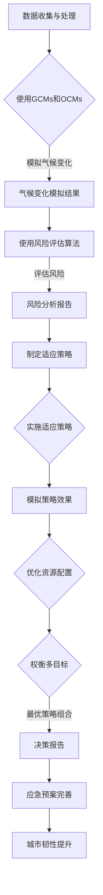
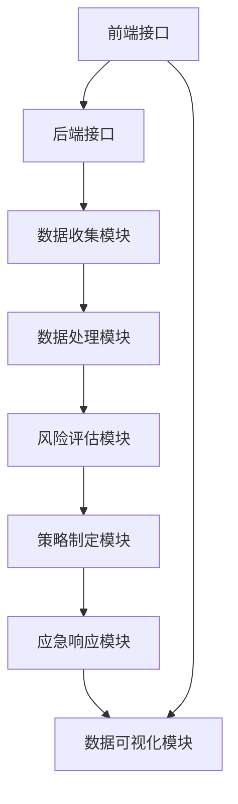
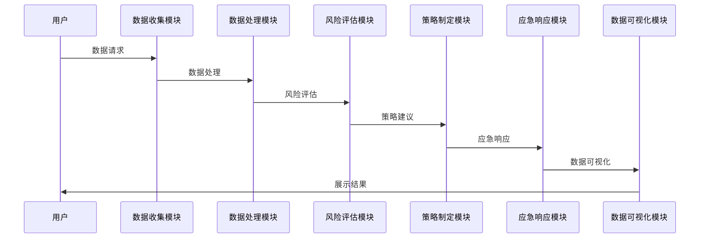

                 

### 1. 引言

#### 1.1 全球气候变化现状

全球气候变化已成为当今世界最为紧迫的环境问题之一。自工业革命以来，人类活动产生的温室气体，如二氧化碳（CO₂）、甲烷（CH₄）和氧化亚氮（N₂O），显著增加，导致地球大气温度不断上升。根据《联合国气候变化框架公约》的数据，过去一百年来，全球平均地表温度已经上升了大约1.2摄氏度。这一变化不仅改变了气候模式，还导致了极端天气事件的频率和强度增加，例如热浪、干旱、洪水和台风等。

气候变化的驱动因素包括但不限于化石燃料的燃烧、森林砍伐、土地利用变化和农业活动等。气候变化对生态系统、水资源、粮食安全和人类健康产生了深远的影响。例如，冰川融化导致海平面上升，威胁沿海城市的生存；温度升高加速了干旱，影响农业生产和水资源供应；极端天气事件增加了城市洪水、泥石流等灾害的风险。

#### 1.2 气候变化对城市规划的影响

气候变化对城市规划带来了诸多挑战和影响。首先，城市规划需要考虑到未来气候的不确定性，如降水模式、温度变化和海平面上升等。这些不确定性使得城市规划面临更大的风险，需要采取适应性策略来降低潜在的环境和社会经济影响。

其次，气候变化对基础设施提出了新的要求。传统的城市规划往往基于过去的气候数据，但随着气候变化的加剧，这些数据可能不再适用于未来的规划。例如，排水系统的设计需要考虑更强的降雨和洪水风险，交通网络需要适应极端温度对道路和桥梁的影响，建筑标准需要更新以应对更高的温度和湿度等。

此外，气候变化还对城市的能源消耗和碳排放提出了更高的要求。随着气温升高，城市的空调和供暖需求增加，导致能源消耗和碳排放量上升。为了实现可持续发展的目标，城市规划需要优先考虑低碳和可再生能源的使用，以减少对化石燃料的依赖。

#### 1.3 韧性城市建设的重要性

在应对气候变化带来的挑战时，韧性城市建设成为了城市规划的关键策略之一。韧性城市指的是能够适应、抵抗和恢复从各种压力和冲击中，包括气候变化、自然灾害、社会动荡和经济波动等。韧性城市建设的重要性体现在以下几个方面：

1. **增强适应能力**：韧性城市建设能够帮助城市更好地适应气候变化带来的各种不确定性，减少气候风险对城市的影响。
2. **提高恢复力**：韧性城市在遭受灾害或突发事件后能够迅速恢复，减少长期的经济和社会损失。
3. **优化资源配置**：韧性城市建设需要整合多种资源和知识，促进城市可持续发展。
4. **提高居民生活质量**：通过建设韧性城市，可以改善居民的居住环境，提高他们的生活质量和安全感。

综上所述，全球气候变化对城市规划提出了新的要求和挑战，韧性城市建设成为了应对这些挑战的关键策略。在接下来的章节中，我们将深入探讨城市规划的基础知识、韧性城市建设的核心概念以及相关算法和技术，帮助读者更好地理解和应对气候变化带来的影响。

#### 1.4 本书结构

为了全面了解全球气候变化对城市规划的影响，本书将分为八个主要章节，旨在系统地阐述韧性城市建设与适应策略的各个方面。以下是各章节的主要内容概述：

**第二章：城市规划基础**  
本章将介绍城市规划的定义、目标和核心概念。我们还将探讨城市规划的基本原则，为后续讨论韧性城市建设奠定理论基础。

**第三章：韧性城市建设**  
本章将深入探讨韧性城市的定义、特点以及建设原则。我们将讨论韧性城市的核心要素，以及在城市规划过程中面临的挑战与机遇。

**第四章：气候变化模型**  
本章将介绍气候变化模型的类型和应用，包括气象模型、地理信息系统（GIS）模型和模拟模型等。我们将通过实际案例展示这些模型在城市规划中的重要性。

**第五章：城市适应策略**  
本章将探讨城市适应策略的概述，包括常见策略和其实施方法。我们将分析不同策略的优缺点，并提供具体的实施建议。

**第六章：算法原理与模型**  
本章将讨论建设韧性城市所需的技术和算法，如气候变化模型和城市适应策略模型。我们将使用mermaid绘制流程图，帮助读者更好地理解这些模型的工作原理。

**第七章：项目实战**  
本章将通过一个实际案例，展示如何将前述理论应用于韧性城市建设。我们将详细讨论项目背景、系统功能设计、系统架构设计和系统接口设计。

**第八章：最佳实践与总结**  
本章将总结书中的关键点，提供韧性城市建设的最佳实践建议。同时，我们将讨论在城市规划过程中可能遇到的注意事项，并推荐相关的拓展阅读资源。

通过这八个章节的深入探讨，读者将能够全面了解全球气候变化对城市规划的影响，掌握韧性城市建设与适应策略的理论和实践方法。

#### 2.1 城市规划的定义与目标

城市规划是一门综合性的学科，旨在通过合理规划和管理城市空间，实现城市的可持续发展。其定义多种多样，但核心目标是提升居民生活质量、促进经济发展和保障环境安全。

首先，城市规划的定义可以归纳为：在城市发展过程中，对空间布局、基础设施、公共设施、居住环境等进行系统规划和管理的行为。其涉及范围广泛，包括城市土地使用、交通网络、绿地系统、水资源管理、建筑标准等多个方面。

城市规划的主要目标包括以下几点：

1. **提升居民生活质量**：通过优化居住环境、改善公共服务设施和提供良好的交通网络，提高居民的生活舒适度和幸福感。
2. **促进经济发展**：合理规划能够促进城市经济的持续增长，创造就业机会，提升城市竞争力。
3. **保障环境安全**：在城市规划过程中，需要考虑到环境保护和生态平衡，减少对自然资源的过度开发和污染。
4. **增强城市韧性**：面对气候变化和自然灾害等不确定性因素，通过韧性城市建设，提升城市的适应能力和恢复力。

为了实现这些目标，城市规划通常遵循以下基本原则：

1. **协调发展**：城市规划应协调城市的社会、经济、环境和空间发展，实现各要素的平衡。
2. **可持续性**：城市规划应考虑长远发展，确保资源的合理利用和环境保护。
3. **弹性与适应性**：城市规划需要具备一定的弹性，能够应对未来的变化和不确定性。
4. **公众参与**：城市规划过程中应充分听取居民和利益相关者的意见和建议，提高规划的科学性和可操作性。

总之，城市规划不仅是城市发展的基础工程，更是实现城市可持续发展的关键途径。通过科学规划和有效管理，城市规划能够为城市带来持久的繁荣和美好未来。

#### 2.2 城市规划的核心概念

在城市规划中，理解核心概念是至关重要的。以下将介绍几个关键概念，并解释它们在规划过程中的作用。

**1. 城市形态**

城市形态指的是城市的空间布局和组织形式。它包括城市的基本结构，如道路系统、住宅区、商业区、工业区等。城市形态对城市的交通流动、资源分配和居民生活质量都有重要影响。例如，网格状的城市布局通常更便于交通规划和资源分配，而集中式的城市布局则可能需要更多的基础设施投资。

**2. 城市结构**

城市结构是指城市内部各个功能区域之间的关系和布局。城市结构包括城市的核心区域、边缘区域以及各个功能区之间的联系。城市结构的设计决定了城市的空间效率和功能整合。一个良好的城市结构能够促进城市经济的繁荣，提升居民的生活质量。

**3. 城市生态**

城市生态是指城市与其自然环境之间的相互作用。城市生态涉及城市的水资源管理、空气污染控制、绿地系统和生物多样性保护等多个方面。城市生态的可持续性是城市规划中的重要议题，通过科学规划和管理，可以减少城市对环境的负面影响，提升城市环境的整体健康。

**4. 城市治理**

城市治理是指城市管理和运作的方式，包括政府、私人部门和公众之间的互动与合作。城市治理的质量直接关系到城市规划的执行效果。一个有效的城市治理体系能够确保规划目标得以实现，提升城市管理的效率。

**5. 城市交通**

城市交通是指城市内部和外部的交通网络和设施。城市交通对城市形态、城市结构和城市生态都有深远影响。城市规划中的交通规划需要考虑到交通流量、交通模式和交通设施的建设与维护。一个完善的交通系统不仅能够提高居民出行的便捷性，还能减少交通拥堵和污染。

**6. 城市安全**

城市安全是指城市在自然灾害、事故和人为灾害面前的抵御能力和恢复能力。城市安全包括公共安全、基础设施安全、信息安全等多个方面。城市规划中的安全规划需要考虑到潜在的威胁和风险，制定相应的预防和应对措施，以保障城市的长期稳定。

通过理解这些核心概念，城市规划师可以更好地设计和管理城市，实现城市的可持续发展目标。这些概念之间的相互作用和整合，是城市规划成功的关键。

#### 2.3 城市规划的基本原则

在城市规划过程中，遵循基本原则是确保规划科学性和有效性的关键。以下是城市规划中常用的几项基本原则：

**1. 可持续发展原则**

可持续发展是城市规划的基本原则之一，强调在城市发展的过程中，必须考虑到社会、经济和环境的平衡。城市规划应通过合理利用资源、保护生态环境和提升居民生活质量，实现城市的长期可持续发展。

**2. 综合性原则**

城市规划是一项综合性工作，需要综合考虑城市的各个方面，包括土地利用、交通、环境、社会和经济等因素。综合性原则要求规划师在制定规划时，不仅要关注单一领域的需求，还要考虑各领域之间的相互关系和协同作用，确保规划的整体协调性和一致性。

**3. 公众参与原则**

公众参与是城市规划中不可或缺的一环，通过听取居民和利益相关者的意见和建议，可以提升规划的科学性和可操作性。公众参与原则强调在城市规划过程中，应广泛征求公众意见，提高规划过程的透明度和民主性，确保规划能够真正满足居民的需求。

**4. 可适应性和弹性原则**

面对日益变化的气候和社会经济条件，城市规划需要具备一定的可适应性和弹性。可适应性和弹性原则要求规划师在设计规划时，应考虑到未来的不确定性和潜在变化，采用灵活的设计和策略，确保城市能够适应未来的发展需求。

**5. 节能与环保原则**

随着气候变化和环境问题的日益严峻，节能和环保成为城市规划中的重要原则。城市规划应通过推广绿色建筑、优化能源利用、提高资源循环利用率等措施，减少城市的能源消耗和环境污染，促进城市的绿色可持续发展。

**6. 社区发展原则**

社区发展原则强调城市规划应注重社区的空间组织和功能配置，提升社区的生活质量和社会凝聚力。城市规划应通过改善社区基础设施、提供公共服务和创造良好的社区环境，促进社区的发展和居民的幸福生活。

通过遵循这些基本原则，城市规划师可以更好地应对气候变化和城市化带来的挑战，实现城市的可持续发展和居民的幸福生活。这些原则不仅为城市规划提供了指导方针，也为城市规划的实践提供了有力支持。

#### 3.1 韧性城市的定义与特点

韧性城市（Resilient City）是指能够在面对各种压力和冲击时，保持稳定运行和持续发展的城市。这种城市具备以下几个显著特点：

首先，韧性城市具有高度的适应能力。面对气候变化、自然灾害、经济波动和社会变革等不确定性因素，韧性城市能够迅速调整和适应，减少这些因素对城市运行的影响。这种适应能力不仅体现在城市规划和基础设施建设上，还涉及社会、经济和文化等多个层面。

其次，韧性城市强调恢复力。在遭受突发事件或灾害后，韧性城市能够迅速恢复，减少长期的经济和社会损失。这种恢复力不仅包括物质基础设施的修复，还包括社会经济的恢复和社会秩序的重建。例如，一个韧性城市在遭受洪水袭击后，能够在短时间内恢复交通、供水和供电等基本服务，保障居民的生活和工作正常进行。

第三，韧性城市具有高度的弹性。弹性是指城市在面对外部冲击时，能够灵活调整和适应，以保持城市功能的正常运行。弹性不仅体现在城市规划和设计上，还包括城市管理和应急响应机制。例如，在高温和热浪频发的城市，弹性策略可能包括建立避难所、改善绿化和增加公共饮水点等。

第四，韧性城市强调系统的整合性和协同性。一个韧性城市需要各个系统之间紧密协作，包括政府机构、私人部门、非政府组织和居民等。通过多方合作，城市能够更好地应对各种挑战，提升整体韧性。

第五，韧性城市注重可持续性。在建设韧性城市的过程中，城市规划者应考虑环境保护和资源利用的可持续性，确保城市的长期健康发展。例如，通过推广绿色建筑、优化交通网络和提高水资源利用效率，城市能够实现节能减排和环境保护。

总的来说，韧性城市是应对全球气候变化和城市化挑战的一种重要策略。通过提高适应能力、恢复力和弹性，韧性城市能够在复杂多变的环境中保持稳定运行和持续发展，为居民提供安全、健康和幸福的生活环境。

#### 3.2 韧性城市建设的原则

韧性城市建设的核心在于提升城市的适应能力、恢复力和弹性，确保城市能够在面对各种压力和冲击时保持稳定运行。为了实现这一目标，城市规划者和建设者应遵循以下几个关键原则：

**1. 可持续性原则**

可持续性是韧性城市建设的基础。这一原则要求城市规划者在设计和管理城市时，综合考虑社会、经济和环境的平衡。通过推广绿色建筑、优化能源利用和提高水资源利用效率等措施，城市能够减少对环境的负面影响，实现长期的可持续发展。例如，在城市基础设施建设中，可以采用可再生能源、节能材料和环保技术，减少能源消耗和碳排放。

**2. 多层次规划原则**

多层次规划原则强调城市韧性建设需要从宏观、中观和微观三个层面进行综合规划。宏观层面涉及城市整体战略和长远规划，如城市规划的整体布局和重大基础设施；中观层面包括特定区域的规划，如社区和公共设施；微观层面则关注具体的建筑和街道设计。通过多层次规划，城市能够更好地应对各种不确定性和复杂环境。

**3. 整合性原则**

整合性原则要求城市各系统之间紧密协作，共同提升城市的整体韧性。城市韧性建设需要整合不同领域的资源和技术，包括政府、企业、学术机构和非政府组织等。通过跨部门合作和资源整合，城市能够更好地应对各种挑战，提升整体适应能力。例如，在防洪规划中，可以整合水利、建筑、交通和环境等多个领域的资源和知识，制定综合性的应对策略。

**4. 公众参与原则**

公众参与是提高城市韧性建设的重要途径。通过广泛征求居民和利益相关者的意见和建议，城市规划者可以更好地了解居民的需求和期望，制定出更具针对性和可操作性的规划方案。公众参与还可以增强居民对城市韧性的认同感和责任感，提高规划的实施效果。例如，在城市更新项目中，可以组织公众参与讨论和决策，确保规划方案能够真正满足居民的需求。

**5. 创新驱动原则**

创新驱动原则强调通过技术创新和管理创新，提升城市的韧性和适应能力。在城市规划和管理中，应积极引入新技术，如大数据分析、人工智能和物联网等，提高城市监测、预测和应对能力。同时，应鼓励创新思维和方法，如城市模拟、情景分析和综合评估等，优化城市规划和管理流程，提升城市的韧性和可持续性。

**6. 预防性原则**

预防性原则强调在城市规划和管理中，应采取预防性措施，减少灾害和风险的发生。通过风险识别和评估，城市规划者可以提前预测潜在的威胁和风险，制定相应的预防和应对措施，降低灾害对城市的冲击。例如，在城市排水系统中，可以设计更大的容量和更高效的排水设施，以应对极端降雨和洪水。

通过遵循这些原则，韧性城市建设能够有效提升城市的适应能力、恢复力和弹性，为城市居民提供安全、健康和可持续的生活环境。

#### 3.3 韧性城市的核心要素

韧性城市建设是一个复杂而全面的过程，需要关注多个核心要素，以构建一个能够适应、抵抗和恢复各种压力和冲击的城市。以下是韧性城市的几个关键要素：

**1. 基础设施**

基础设施是韧性城市的基石，包括交通网络、供水系统、电力供应、排水设施和通信系统等。一个健全的基础设施能够确保城市在面临突发事件或灾害时，基本服务能够迅速恢复。例如，在地震或洪水等灾害发生时，强大的通信系统能够确保紧急信息的快速传递，而高效的排水系统能够迅速排除积水，减少次生灾害的发生。

**2. 环境可持续性**

环境可持续性是韧性城市建设的重要方面，涉及城市的生态保护、自然资源管理、气候变化适应和污染控制等。通过推广绿色建筑、改善城市绿化、提高水资源利用效率以及减少污染排放，城市能够实现长期的生态平衡和可持续发展。例如，在城市规划中，可以增加绿地面积，建设雨水收集和再利用系统，以减少城市热岛效应和水资源短缺问题。

**3. 社会凝聚力**

社会凝聚力是韧性城市的核心要素之一，指城市居民之间的相互信任、合作和共同应对能力。一个具有高社会凝聚力的城市，能够在面对突发事件时迅速动员和响应，减轻灾害带来的影响。例如，社区组织可以在灾害发生时提供紧急援助，居民之间的互助可以显著提升城市的恢复能力。

**4. 经济韧性**

经济韧性是韧性城市建设的重要方面，指城市在面临经济冲击时，能够迅速适应和恢复的能力。通过发展多元化经济、提高创新能力和提升就业质量，城市能够增强经济的韧性和抗风险能力。例如，城市可以通过吸引高科技企业和创新创业项目，提升经济发展的活力和可持续性。

**5. 法律和治理**

法律和治理是韧性城市建设的重要保障，包括城市规划法规、应急管理法规、环境保护法规等。有效的法律和治理体系能够确保城市规划和建设符合科学原则和规范，提高城市管理的效率和透明度。例如，建立完善的应急管理机制和灾难恢复计划，可以显著提升城市在面对突发事件时的应对能力和恢复速度。

**6. 公共服务**

公共服务是城市韧性的重要体现，包括医疗、教育、社会保障、交通和能源等。通过提升公共服务的质量和覆盖面，城市能够提高居民的生活质量和安全感。例如，建设更多的医疗设施和紧急救援站点，确保在突发事件中能够迅速提供救援服务，保障居民的生命安全。

**7. 技术创新**

技术创新是提升城市韧性不可或缺的要素，包括大数据分析、人工智能、物联网、云计算等新兴技术的应用。通过引入和利用这些先进技术，城市能够实现更高效的监测、预测和响应，提升城市的整体韧性。例如，利用大数据和物联网技术，可以实时监测城市环境变化，及时预警和应对潜在的灾害风险。

总之，韧性城市建设需要综合考虑多个核心要素，通过系统性和综合性的规划与实施，构建一个能够适应、抵抗和恢复各种压力和冲击的可持续城市。这些核心要素相互作用，共同构成韧性城市的坚实基础。

#### 3.4 韧性城市建设的挑战与机遇

韧性城市建设是一项复杂而全面的任务，面临着诸多挑战和机遇。以下是韧性城市建设过程中主要面临的一些挑战及应对策略：

**1. 挑战**

**（1）资金不足**：韧性城市建设需要大量的资金投入，包括基础设施建设、技术创新和应急响应等方面。许多城市可能面临财政压力，难以满足这些需求。

**（2）技术不足**：韧性城市建设涉及多个领域的技术，如大数据、人工智能、物联网等。一些城市可能缺乏足够的技术储备和人才，难以应对复杂的技术挑战。

**（3）政策协调**：韧性城市建设需要各级政府和部门的紧密合作，但实际操作中可能存在政策协调不足、部门利益冲突等问题，影响建设效果。

**（4）公众参与不足**：韧性城市建设需要广泛征求公众意见，但实际操作中，公众参与度可能较低，导致规划方案缺乏针对性和可操作性。

**（5）适应气候变化的不确定性**：气候变化带来的影响具有不确定性和长期性，使得韧性城市建设面临更大的挑战。

**2. 机遇**

**（1）技术创新**：随着大数据、人工智能、物联网等新兴技术的快速发展，城市有了更多工具和手段来提升韧性。例如，利用大数据进行城市风险评估和预测，使用人工智能进行灾害预警和应急响应等。

**（2）政策支持**：各国政府纷纷出台相关政策，鼓励韧性城市建设。例如，联合国《韧城倡议》和我国《城市韧性建设指导意见》等，为韧性城市建设提供了政策支持和指导。

**（3）资金投入**：国际和国内资金对韧性城市建设的投资逐渐增加，为城市提供了更多资金支持。

**（4）公众意识提升**：随着公众对气候变化和环境问题的关注度提升，越来越多的居民开始支持韧性城市建设，为建设提供社会基础。

**（5）国际合作**：韧性城市建设需要全球合作，各国可以共享经验和资源，共同应对气候变化带来的挑战。

**应对策略**

**（1）增加资金来源**：城市可以通过多种渠道筹集资金，如政府预算、公私合作（PPP）模式、国际援助等，确保韧性城市建设有足够的资金支持。

**（2）提升技术能力**：城市可以通过引进先进技术、培养专业人才和加强国际合作，提升技术储备和创新能力。

**（3）加强政策协调**：建立跨部门协调机制，确保政策的一致性和协同性，提高政策执行效果。

**（4）提高公众参与度**：通过开展公众教育活动、建立反馈机制等方式，提高公众对韧性城市建设的认识和参与度。

**（5）加强国际合作**：积极参与国际韧城倡议和项目，借鉴国际先进经验，提升城市的韧性建设水平。

通过有效应对这些挑战和抓住机遇，韧性城市建设将为城市带来更安全、更健康、更可持续的未来。

### 4.1 气候变化模型概述

气候变化模型是研究气候系统变化和预测未来气候变化的重要工具。这些模型通过模拟气候系统的物理、化学和生物过程，帮助科学家和规划者更好地理解气候变化的机制，预测未来气候的演变，并为韧性城市建设提供科学依据。以下是几种主要的气候变化模型类型及其基本原理。

**1. 气候系统模型**

气候系统模型（Climate System Models, CSMs）是综合性的模型，模拟地球气候系统的各种过程，包括大气、海洋、陆地表面和冰冻圈等。这些模型基于物理定律和气候动力学，通过数值模拟来模拟气候系统的复杂行为。气候系统模型通常包括以下组件：

- **大气模型**：模拟大气中的气体、云和辐射过程。
- **海洋模型**：模拟海洋中的热量、盐分和碳循环等过程。
- **陆地表面模型**：模拟陆地的植被、土壤和水分循环。
- **冰冻圈模型**：模拟冰冻圈的变化，如冰川消融和冻土变化。

**2. 大气环流模型**

大气环流模型（General Circulation Models, GCMs）专注于大气层的动态过程，模拟大气中的温度、湿度、风速和气压等变量。这些模型通过数值解法来模拟大气中的流体动力学和热力学过程，是气候变化预测的核心工具。GCMs通常包括以下部分：

- **辐射传输模型**：模拟大气中的辐射过程，包括太阳辐射和地球辐射。
- **动力学模型**：模拟大气中的流体运动，包括风和气压的分布。
- **化学模型**：模拟大气中的化学反应和污染物的扩散。

**3. 海洋环流模型**

海洋环流模型（Ocean Circulation Models, OCMs）模拟海洋中的热量、盐分和物质循环。这些模型通过数值模拟来研究海洋中的物理、化学和生物过程，对于理解全球气候变化的影响具有重要意义。OCMs通常包括以下部分：

- **海洋动力学模型**：模拟海洋中的流体运动，包括洋流和波浪。
- **海洋热力学模型**：模拟海洋中的热量分布和传递。
- **海洋生物化学模型**：模拟海洋中的生物过程和碳循环。

**4. 地理信息系统（GIS）模型**

地理信息系统（Geographic Information System, GIS）模型利用地理空间数据来模拟和分析气候变化的地理分布和影响。GIS模型通过空间分析和数据可视化，帮助规划者评估气候变化对城市和区域的影响。这些模型通常包括以下功能：

- **空间分析**：分析气候数据的地理分布和趋势。
- **影响评估**：评估气候变化对水资源、生态系统和城市基础设施的影响。
- **决策支持**：为韧性城市建设提供科学依据和决策支持。

**5. 模拟模型**

模拟模型（Simulation Models）是用于模拟特定气候过程或事件的模型，如极端降水事件、热浪和风暴等。这些模型通过数值模拟来研究这些事件的频率、强度和分布，为城市的适应策略提供科学依据。常见的模拟模型包括：

- **统计模型**：利用统计方法模拟气候事件的发生概率和影响。
- **物理模型**：通过数值模拟来研究气候事件的物理机制和过程。

总之，气候变化模型通过综合不同的科学原理和技术手段，帮助科学家和规划者更好地理解气候变化的机制，预测未来气候的演变，并为韧性城市建设提供科学依据。这些模型的应用不仅有助于提高城市的适应能力和恢复力，还能为全球气候治理提供重要支持。

#### 4.2 气候变化模型的分类

气候变化模型根据其建模方法和应用范围，可以分为多种类型。以下是几种主要的分类方式：

**1. 按照建模方法分类**

**（1）统计模型**  
统计模型基于历史气候数据和统计方法，通过分析和预测气候变量的概率分布来模拟未来气候变化。常见的统计模型包括回归模型、时间序列分析和神经网络等。这些模型简单且易于计算，但在模拟复杂气候变化机制方面存在局限性。

**（2）物理模型**  
物理模型基于气候系统的物理定律和动力学方程，通过数值模拟来描述气候系统的行为。物理模型包括大气环流模型（GCMs）、海洋环流模型（OCMs）和地球系统模型（ESMs）等。这些模型能够模拟气候系统的复杂过程，但计算资源需求大，且对初始条件和参数敏感性较高。

**（3）统计-物理模型**  
统计-物理模型结合了统计方法和物理模型的优势，通过将统计方法应用于物理模型中的参数化过程来提高模型的预测能力。例如，统计降尺度方法（Statistical Downscaling Methods）将GCM的输出数据与当地气候数据进行统计回归，以生成高分辨率区域的气候预测。

**2. 按照应用范围分类**

**（1）全球气候变化模型**  
全球气候变化模型用于模拟全球气候系统的变化，包括大气、海洋、陆地表面和冰冻圈等。这些模型通常用于研究全球气候变化趋势、气候变率和极端气候事件。例如，全球气候模式（Global Climate Models）和地球系统模型（Earth System Models）。

**（2）区域气候变化模型**  
区域气候变化模型专注于特定区域或城市的气候变化模拟，如区域气候模式（Regional Climate Models）和城市气候模型（Urban Climate Models）。这些模型通过考虑地形、海洋和局部气象条件，提供更详细的区域气候预测。

**（3）应用模型**  
应用模型是针对特定应用场景开发的模型，如风险评估模型、水资源管理模型和城市规划模型。这些模型利用气候预测结果，评估气候变化对特定领域的潜在影响，并提供决策支持。例如，水文模型用于预测气候变化对水资源供应的影响，城市规划模型用于评估气候变化对城市基础设施的适应性。

**3. 按照模型层次分类**

**（1）层次化模型**  
层次化模型通过将气候系统分解为不同的层次，如大气、海洋、陆地表面等，分别进行建模。这些模型可以结合不同层次的模型结果，提供更全面的气候模拟。例如，多层次气候模式（Multi-layer Climate Models）将气候系统分为不同的层次，分别模拟不同层次的过程。

**（2）耦合模型**  
耦合模型将不同层次或不同领域的模型进行耦合，以模拟整个气候系统或特定应用场景。这些模型通过将大气、海洋、陆地表面和冰冻圈等模型耦合在一起，提供更综合的气候模拟。例如，地球系统模型（Earth System Models）将大气、海洋、陆地表面和冰冻圈模型进行耦合，模拟整个地球系统的气候变化。

通过分类和详细描述各种气候变化模型，我们可以更好地理解不同模型的特点和应用，为韧性城市建设提供科学依据。

#### 4.3 气候变化模型的应用

气候变化模型在城市规划中具有广泛应用，可以帮助城市规划者更好地预测气候变化的影响，制定适应性策略。以下是几种主要的气候变化模型应用：

**1. 大气环流模型（GCMs）**

大气环流模型（General Circulation Models, GCMs）是气候变化模拟的核心工具，用于预测全球和区域的气候变化趋势。GCMs通过模拟大气中的物理和化学过程，如辐射传输、大气动力学和化学物质循环，生成全球或区域气候情景。这些模型可以用于评估未来气候变化对城市温度、降水、风速等气象要素的影响。例如，通过GCMs模拟，可以预测未来某城市年平均温度的上升幅度，以及极端高温事件的频率和强度。这些信息对城市规划中的建筑标准、绿地系统和公共设施设计等具有重要意义。

**2. 海洋环流模型（OCMs）**

海洋环流模型（Ocean Circulation Models, OCMs）专注于模拟海洋中的热量、盐分和物质循环。这些模型对于理解全球和区域气候变化具有重要影响，因为海洋在调节全球气候中扮演着关键角色。OCMs可以用于预测未来海平面上升、海洋酸化以及渔业资源分布的变化。在城市规划中，这些模型可以帮助评估气候变化对沿海城市水资源供应、防洪和生态系统的影响。例如，通过OCMs模拟，可以预测未来海平面上升对沿海城市排水系统和防洪基础设施的要求，为城市规划提供科学依据。

**3. 区域气候模型（RCMs）**

区域气候模型（Regional Climate Models, RCMs）是针对特定区域或城市的气候模型，具有更高的分辨率和更详细的地理信息。RCMs通过放大GCMs的输出数据，提供更详细和准确的区域气候预测。这些模型可以用于评估气候变化对城市微气候的影响，如街道温度、建筑物能耗和城市热岛效应。例如，通过RCMs模拟，可以预测未来某城市特定区域的温度变化，为城市规划中的绿地布局、建筑设计和能源管理提供科学依据。

**4. 地理信息系统（GIS）模型**

地理信息系统（Geographic Information System, GIS）模型利用空间分析技术，将气候数据与其他地理信息进行整合，帮助城市规划者评估气候变化对城市不同区域的影响。GIS模型可以用于模拟气候变化对城市水资源、生态系统、交通和基础设施的影响。例如，通过GIS模型，可以预测未来气候变化对城市洪涝风险的影响，评估不同防洪措施的效益，为城市排水系统的设计和管理提供决策支持。

**5. 水文模型**

水文模型（Hydrological Models）用于模拟气候变化对城市水资源的影响。这些模型可以预测未来降水模式、径流变化和地下水位的变化，评估水资源供应的可持续性。例如，通过水文模型，可以预测未来气候变化对城市供水系统的影响，为水资源管理和防洪规划提供科学依据。

**6. 风险评估模型**

风险评估模型（Risk Assessment Models）结合气候模拟和地理信息系统，评估气候变化对城市不同区域的风险。这些模型可以用于评估城市在气候变化下的洪水、热浪和干旱等灾害风险，为城市应急管理和防灾减灾提供科学依据。例如，通过风险评估模型，可以预测未来某城市在极端降雨事件下的洪水风险，为城市防洪规划和应急准备提供指导。

综上所述，气候变化模型在城市规划中的应用非常广泛，可以为城市规划者提供关键的科学依据，帮助制定适应性策略，提高城市的韧性和可持续发展能力。通过这些模型的应用，城市规划者可以更好地应对气候变化带来的挑战，为城市居民创造一个安全、健康和可持续的生活环境。

#### 5.1 城市适应策略概述

城市适应策略是指在城市规划和管理过程中，通过一系列措施和手段，增强城市对气候变化的影响和极端天气事件的抵抗能力，保障城市功能的连续性和居民的生活质量。这些策略旨在减轻气候变化对城市造成的负面影响，提高城市的适应能力和恢复力。以下是几种常见的城市适应策略：

**1. 绿色基础设施**

绿色基础设施（Green Infrastructure）是指利用自然和半自然的手段来管理城市水资源、缓解城市热岛效应和改善生态环境。常见的绿色基础设施包括城市绿地、屋顶花园、雨水花园、透水铺装和植被恢复等。这些设施不仅可以美化城市环境，还能提高城市的生态功能和应对气候变化的能力。例如，屋顶花园和垂直绿化可以降低建筑物的能耗，减轻城市热岛效应；雨水花园和透水铺装可以有效地收集和利用雨水，减少城市洪涝风险。

**2. 防洪措施**

防洪措施是城市适应气候变化的重要手段之一，旨在减少洪水对城市的影响。防洪措施包括建设防洪堤、排水系统升级、建立蓄洪区和建立预警系统等。通过这些措施，城市可以有效地应对极端降雨和洪水事件。例如，在洪水高发区，建设防洪堤和排水系统可以降低洪水的淹没风险；建立蓄洪区可以在洪水来临时暂时储存洪水，减少对下游城市的影响；预警系统可以及时发布洪水警报，为居民和政府提供应急准备时间。

**3. 可持续交通系统**

可持续交通系统（Sustainable Transport Systems）是指通过优化交通网络、推广低碳交通方式和提升公共交通服务水平，减少城市交通对环境的负面影响。可持续交通系统包括公共交通、自行车道、步行系统和电动汽车等。通过这些措施，城市可以减少交通拥堵、降低碳排放和改善空气质量。例如，发展高效的公共交通系统可以减少居民对私家车的依赖，降低交通排放；建设自行车道和步行系统可以鼓励居民选择绿色出行方式，提高城市交通的可持续性。

**4. 绿色建筑**

绿色建筑（Green Buildings）是指通过设计、建造和运营过程中的环保措施，降低建筑对环境的影响，提高建筑的能源效率和室内环境质量。绿色建筑措施包括使用可再生能源、高效节能设备和环保材料等。通过推广绿色建筑，城市可以减少能源消耗和碳排放，改善居民的生活质量。例如，安装太阳能板和风力涡轮机可以为建筑提供清洁能源；使用高效节能设备和绿色建材可以降低建筑的能耗和环境影响。

**5. 水资源管理**

水资源管理（Water Resource Management）是指通过优化水资源配置、提高水资源利用效率和保护水资源质量，确保城市水资源的可持续供应。水资源管理措施包括雨水收集和再利用、节水技术和污水处理等。通过这些措施，城市可以缓解水资源短缺和污染问题，提高水资源的利用效率。例如，建立雨水收集系统可以收集和再利用雨水，减轻对地下水的开采压力；推广节水技术可以减少城市用水量，提高水资源的利用效率。

**6. 能源管理**

能源管理（Energy Management）是指通过优化能源消费结构、提高能源利用效率和推广可再生能源，减少城市能源消耗和碳排放。能源管理措施包括节能建筑、智能电网和可再生能源发电等。通过这些措施，城市可以降低能源成本、减少环境污染和应对气候变化。例如，建设节能建筑可以降低建筑的能耗；发展智能电网可以提高电力系统的效率和可靠性；推广可再生能源发电可以减少对化石燃料的依赖。

总之，城市适应策略是提高城市韧性和应对气候变化的关键手段。通过实施绿色基础设施、防洪措施、可持续交通系统、绿色建筑、水资源管理和能源管理等多种策略，城市可以更好地应对气候变化带来的挑战，为居民创造一个安全、健康和可持续的生活环境。

#### 5.2 常见城市适应策略

在城市规划中，为了增强城市对气候变化的影响和极端天气事件的抵抗能力，常见的城市适应策略包括以下几个方面：

**1. 绿色基础设施**

绿色基础设施是一种利用自然和半自然的手段来管理城市水资源、缓解城市热岛效应和改善生态环境的方法。常见的技术包括：

- **城市绿地**：通过增加城市公园、绿道和城市森林，提高城市的绿化覆盖率，改善微气候，增加生物多样性。
- **屋顶花园**：在建筑物屋顶种植植物，不仅美化环境，还能降低建筑能耗，减少城市热岛效应。
- **透水铺装**：使用透水材料铺装人行道、广场和停车场，提高雨水的渗透，减少城市洪涝风险。
- **雨水花园**：利用植被和土壤系统收集和储存雨水，减少径流污染，同时为城市提供额外的绿地。

**2. 防洪措施**

防洪措施旨在降低洪水对城市的影响，确保城市安全。常见的防洪技术包括：

- **防洪堤**：建设防洪堤坝，保护城市免受洪水侵袭。
- **排水系统**：升级和优化排水管网，提高排水效率，减少城市内涝风险。
- **蓄洪区**：在低洼地区建设蓄洪区，以容纳过量雨水，减轻城市排水系统的压力。
- **预警系统**：建立洪水预警系统，及时发布洪水预警，为居民和政府提供应急准备时间。

**3. 可持续交通系统**

可持续交通系统通过优化交通网络、推广低碳交通方式和提升公共交通服务水平，减少城市交通对环境的负面影响。常见的技术包括：

- **公共交通**：发展高效、可靠的公共交通系统，鼓励居民减少私家车使用，降低交通排放。
- **自行车道**：建设安全的自行车道，鼓励居民选择自行车出行，减少交通拥堵和污染。
- **步行系统**：改善步行环境，提供便捷、安全的步行路径，鼓励居民步行或慢跑。
- **电动汽车**：推广电动汽车和充电设施，减少交通排放，促进低碳交通的发展。

**4. 绿色建筑**

绿色建筑通过设计、建造和运营过程中的环保措施，降低建筑对环境的影响，提高建筑的能源效率和室内环境质量。常见的技术包括：

- **节能设计**：通过合理的建筑布局和建筑设计，减少建筑的能耗和碳排放。
- **可再生能源**：使用太阳能、风能等可再生能源为建筑提供电力和热水，减少对化石燃料的依赖。
- **高效节能设备**：安装高效空调、照明和通风系统，提高能源利用效率。
- **绿色建材**：使用环保、可持续的材料进行建筑装修，减少对环境的破坏。

**5. 水资源管理**

水资源管理通过优化水资源配置、提高水资源利用效率和保护水资源质量，确保城市水资源的可持续供应。常见的技术包括：

- **雨水收集和再利用**：建设雨水收集系统，将雨水用于灌溉、景观用水和清洁等，减少对地下水和自来水的依赖。
- **节水技术**：推广节水设备和技术，提高用水效率，减少水资源的浪费。
- **污水处理**：建立污水处理厂，对生活污水和工业废水进行处理，确保水资源的安全和清洁。
- **水循环利用**：通过中水回用和污水深度处理，将处理后的水用于非饮用目的，实现水资源的循环利用。

**6. 能源管理**

能源管理通过优化能源消费结构、提高能源利用效率和推广可再生能源，减少城市能源消耗和碳排放。常见的技术包括：

- **智能电网**：建设智能电网，提高电力系统的效率和可靠性，实现分布式能源的灵活接入。
- **分布式能源**：发展分布式能源系统，如太阳能光伏、风力发电等，减少对中央能源系统的依赖。
- **能源审计**：对城市的能源使用进行审计，发现节能潜力，制定节能措施。
- **能源教育**：通过教育和宣传，提高居民的能源意识和节能行为，促进城市的可持续发展。

通过实施这些常见的城市适应策略，城市可以更好地应对气候变化带来的挑战，提升城市的韧性和可持续发展能力。

#### 5.3 城市适应策略的实施

城市适应策略的实施是一个复杂而多层次的过程，涉及政策制定、技术支持、资金投入和公众参与等多个方面。以下将详细讨论城市适应策略实施的关键步骤和注意事项。

**1. 政策制定**

政策制定是城市适应策略实施的基础。政府需要制定一系列法规和政策，为城市适应策略的实施提供法律保障。这些政策包括环境保护法规、土地利用规划条例、建筑节能标准和水资源管理条例等。政策制定时应考虑以下要点：

- **法律法规的健全性**：确保法律法规的完整性，涵盖城市适应策略的各个方面，如防洪措施、绿色基础设施建设和能源管理。
- **政策的一致性**：确保不同政策之间的一致性，避免政策冲突，提高政策执行效果。
- **政策的灵活性**：制定灵活的政策，以应对未来气候变化的不确定性和城市发展的需求。

**2. 技术支持**

技术支持是城市适应策略实施的核心。科学技术的应用可以大大提高城市适应策略的有效性和可行性。以下是一些关键技术支持措施：

- **数据收集与分析**：利用遥感技术、气象数据和GIS系统等，收集和分析城市气候和环境数据，为适应策略提供科学依据。
- **模拟与预测**：利用气候变化模型和灾害风险评估模型，进行气候模拟和灾害预测，评估适应策略的效果。
- **技术引进与创新**：积极引进国内外先进技术，推动技术创新，提高城市适应策略的技术含量和实施效率。

**3. 资金投入**

资金投入是城市适应策略实施的重要保障。城市需要确保充足的资金来源，支持适应策略的实施。以下是一些资金管理措施：

- **多元化资金来源**：通过政府预算、公共资金、私营部门和外国援助等多渠道筹集资金，确保资金来源的稳定性和多样性。
- **资金优先级**：根据城市的需求和紧迫性，合理分配资金，优先支持关键项目，如防洪设施、绿色基础设施和可再生能源项目。
- **资金监管**：建立严格的资金监管机制，确保资金使用的透明度和效益，提高资金使用效率。

**4. 公众参与**

公众参与是城市适应策略实施的重要组成部分。广泛征求公众意见，提高公众的参与度和意识，可以增强适应策略的实施效果。以下是一些公众参与措施：

- **公众教育**：通过媒体宣传、社区活动和教育培训等方式，提高公众对气候变化和城市适应策略的认识。
- **公众咨询**：在政策制定和项目实施过程中，征求公众意见和建议，确保规划方案符合公众需求。
- **公众监督**：建立公众监督机制，提高政策执行的透明度，确保政策的有效实施。

**5. 注意事项**

在城市适应策略实施过程中，需要注意以下事项：

- **可持续性**：确保适应策略的长期有效性，考虑未来的气候变化趋势和城市发展的需求。
- **协调性**：协调不同部门和利益相关者的行动，确保各项措施的一致性和协同效应。
- **灵活性与弹性**：适应策略应具备一定的灵活性和弹性，能够应对未来的不确定性和变化。
- **成本效益**：在实施过程中，需要权衡成本和效益，确保投入产出比合理。

通过科学制定政策、充分利用技术、确保资金投入、广泛动员公众参与和注意实施过程中的关键点，城市可以有效地实施适应策略，提高城市的韧性和可持续发展能力。

#### 6.1 韧性城市建设算法原理

韧性城市建设涉及多种技术和算法，这些技术和算法共同作用，帮助城市更好地适应和应对气候变化。以下是几种关键的算法原理：

**1. 气候变化模型**

气候变化模型（Climate Change Models）是韧性城市建设的基础。这些模型通过模拟气候系统的物理、化学和生物过程，预测未来气候变化的趋势。常见的气候变化模型包括大气环流模型（GCMs）和海洋环流模型（OCMs）。这些模型利用数值模拟技术，基于物理定律和气候动力学方程，生成关于未来温度、降水、风速等气候变量的预测。通过这些模型，城市规划者可以了解未来气候的潜在变化，为韧性城市建设提供科学依据。

**2. 风险评估算法**

风险评估算法（Risk Assessment Algorithms）用于评估城市在不同气候情景下的风险水平。这些算法结合气候模型和地理信息系统（GIS），分析气候变化对城市基础设施、水资源和生态系统的影响。常见的风险评估算法包括概率风险评估法、灾害损失评估模型和情景分析法。通过这些算法，城市规划者可以识别出城市面临的主要风险，制定相应的适应策略。

**3. 预测与模拟算法**

预测与模拟算法（Prediction and Simulation Algorithms）用于模拟和预测城市系统在气候变化下的行为。这些算法包括统计模型、机器学习和深度学习算法。例如，利用机器学习算法，可以从历史气候数据和城市数据中学习，预测未来特定区域的气候变化趋势和城市系统响应。这些预测和模拟结果对于评估城市适应策略的效果和优化规划方案具有重要意义。

**4. 系统优化算法**

系统优化算法（System Optimization Algorithms）用于优化城市的资源配置和管理。这些算法通过优化交通网络、水资源管理和能源利用，提高城市系统的效率和韧性。常见的系统优化算法包括线性规划、非线性规划和遗传算法等。例如，在交通网络优化中，可以采用遗传算法优化交通流量分配，减少交通拥堵和排放。

**5. 多目标决策算法**

多目标决策算法（Multi-objective Decision Algorithms）用于在城市规划中同时考虑多个目标，如环保、经济和社会效益。这些算法通过权衡不同目标之间的冲突，提供最优或近似最优的决策方案。常见的多目标决策算法包括多目标线性规划、多目标进化算法和模糊综合评判法等。这些算法帮助城市规划者在复杂的决策环境中找到平衡，实现城市的可持续发展。

通过运用这些算法，韧性城市建设可以实现科学规划、高效管理和可持续发展。这些算法不仅为韧性城市建设提供了技术支持，也为城市规划者提供了有力的决策工具。

#### 6.2 适应策略模型

适应策略模型（Adaptation Strategy Models）是韧性城市建设中的关键工具，用于模拟和评估城市在不同气候情景下的适应能力和效果。以下是几种常用的适应策略模型及其工作原理：

**1. 压力-状态-响应（PSR）模型**

压力-状态-响应（Pressure-State-Response, PSR）模型是一种经典的适应策略模型，用于评估城市系统在面临气候变化压力时的状态和响应。该模型包括以下三个核心部分：

- **压力（Pressure）**：指外部环境因素对城市系统产生的压力，如极端温度、降水变化和海平面上升等。
- **状态（State）**：指城市系统的当前状态，包括基础设施状况、环境质量和居民生活质量等。
- **响应（Response）**：指城市系统对压力的适应措施，包括政策制定、技术改进和公众参与等。

PSR模型通过模拟压力对城市系统的影响，评估城市当前状态和适应措施的有效性，为城市适应策略的制定提供科学依据。

**2. 适应路径分析模型**

适应路径分析模型（Adaptive Pathway Analysis Model）用于模拟城市适应策略的演变过程。该模型通过分析不同阶段的适应措施和效果，预测城市适应策略的未来发展路径。适应路径分析模型包括以下步骤：

- **识别压力源**：确定影响城市的气候变化压力源，如极端天气事件、水资源短缺和海平面上升等。
- **评估适应潜力**：分析城市当前适应措施的有效性，评估城市在不同情景下的适应潜力。
- **制定适应策略**：根据压力源和适应潜力，制定具体的适应策略，如防洪设施建设、绿色基础设施推广和可再生能源利用等。
- **模拟策略效果**：通过模型模拟适应策略的实施效果，评估策略对城市系统的改善程度。

**3. 模拟-评估-反馈（SIM-AF）模型**

模拟-评估-反馈（Simulation-Assessment-Feedback, SIM-AF）模型是一种动态的适应策略模型，用于模拟和评估城市适应策略的动态效果。该模型通过不断迭代和反馈，优化城市适应策略。SIM-AF模型包括以下步骤：

- **初始模拟**：利用气候变化模型和城市系统模型，模拟初始气候情景下的城市状态和适应措施。
- **评估效果**：评估模拟结果，分析适应措施对城市系统的影响，如减少灾害风险、改善环境质量和提高居民生活质量。
- **反馈调整**：根据评估结果，调整适应策略，优化模型参数，提高模拟精度。
- **迭代模拟**：重复模拟和评估过程，不断优化适应策略，直到满足预定的目标。

**4. 多目标适应模型**

多目标适应模型（Multi-objective Adaptation Model）用于同时考虑多个适应目标，如环境、经济和社会效益。该模型通过权衡不同目标之间的冲突，提供最优或近似最优的适应策略。多目标适应模型包括以下步骤：

- **定义目标**：明确城市适应策略的目标，如减少灾害风险、提高水资源利用效率和改善居民生活质量等。
- **建立模型**：利用优化算法和仿真技术，建立多目标适应模型。
- **求解优化**：通过优化算法，求解多目标适应策略的最优解或近似最优解。
- **策略评估**：评估优化策略的效果，选择最佳适应策略。

通过使用这些适应策略模型，城市规划者可以更好地模拟和评估城市在不同气候情景下的适应能力，制定科学、合理的适应策略，提高城市的韧性和可持续发展能力。

#### 6.3 算法应用案例分析

为了更好地理解韧性城市建设算法的应用，我们将通过一个具体的案例分析，展示如何将算法应用于实际问题中。以下是一个关于某沿海城市的韧性城市建设项目。

**案例背景**：

某沿海城市位于台风高发区，近年来频繁遭受台风侵袭，导致城市基础设施受损、居民生活受到影响。为了提高城市的韧性，该城市决定通过技术手段和适应性策略，增强城市的抗灾能力和恢复力。

**算法应用过程**：

**1. 数据收集与处理**

首先，城市相关部门收集了多年的气候数据、地质数据、城市基础设施数据和社会经济数据。这些数据包括台风路径、风速、降雨量、城市排水系统状况、建筑结构信息等。通过数据预处理，如数据清洗、标准化和异常值处理，确保数据的准确性和一致性。

**2. 气候变化模型**

利用大气环流模型（GCMs）和海洋环流模型（OCMs），模拟未来几年内该城市的气候变化趋势。这些模型结合全球气候数据和海洋数据，预测未来台风频率、强度和降雨量变化。通过分析模拟结果，城市规划者了解到未来台风可能带来的更高风速和更强降雨，需要提前采取适应性措施。

**3. 风险评估算法**

利用风险评估算法，评估未来台风对城市基础设施、水资源和生态系统的影响。这些算法结合气候变化模型的结果和城市数据，计算不同区域的灾害风险等级。例如，通过计算台风路径和建筑结构抗风能力，评估建筑物的受损风险；通过分析排水系统容量和降雨量，评估城市内涝风险。

**4. 适应策略模型**

根据风险评估结果，城市规划者制定了一系列适应策略。这些策略包括：

- **防洪设施建设**：在低洼地区建设防洪堤和蓄洪区，增强城市排水系统的能力。
- **绿色基础设施**：增加城市绿地和雨水花园，改善城市微气候，减少城市热岛效应。
- **建筑加固**：对现有建筑物进行加固，提高其抗风能力。
- **应急预案**：制定详细的应急预案，包括疏散路线、避难所设置和应急物资储备等。

**5. 预测与模拟算法**

利用预测与模拟算法，模拟实施适应策略后的效果。这些算法通过模拟未来台风事件，评估适应策略对城市系统的影响。例如，通过模拟不同防洪措施的实施效果，评估其降低洪水风险的能力；通过模拟建筑加固措施，评估其减少建筑受损风险的效果。

**6. 系统优化算法**

利用系统优化算法，优化城市的资源配置和管理。这些算法通过优化交通流量分配、水资源管理和能源利用，提高城市系统的效率和韧性。例如，通过优化交通网络，减少交通拥堵和排放；通过优化水资源分配，确保水资源的合理利用。

**7. 多目标决策算法**

通过多目标决策算法，权衡不同适应策略之间的效益和成本，制定最优的适应策略组合。这些算法通过优化多个目标，如环保、经济和社会效益，提供最佳适应方案。例如，通过优化防洪设施建设和绿色基础设施投资，确保在满足环境和社会效益的同时，控制成本。

**案例分析结果**：

通过上述算法的应用，该城市成功地制定了一套综合性的适应策略，显著提高了城市的抗灾能力和恢复力。具体结果如下：

- **防洪能力提升**：通过建设防洪堤和蓄洪区，城市防洪能力显著提升，有效减少了洪水对城市的威胁。
- **环境质量改善**：增加绿地和雨水花园，城市微气候得到改善，热岛效应减轻，居民生活质量提高。
- **建筑安全性增强**：通过建筑加固，现有建筑物的抗风能力增强，减少了台风造成的建筑受损风险。
- **应急预案完善**：制定详细的应急预案，提高了城市在突发事件中的应对能力，减少了灾害损失。

**结论**：

通过实际案例的分析，我们可以看到韧性城市建设算法在城市规划中的应用具有重要意义。这些算法不仅帮助城市规划者预测和评估气候变化的影响，还为制定科学、合理的适应策略提供了技术支持，显著提高了城市的韧性和可持续发展能力。

#### 6.4 算法应用流程图

为了更直观地展示韧性城市建设算法的应用流程，我们可以使用Mermaid绘制一个流程图。以下是算法应用流程图的描述及其mermaid代码：



**流程解释**：

1. **数据收集与处理**：收集气候、地质、城市基础设施和社会经济数据，并进行预处理。
2. **使用GCMs和OCMs**：利用这些气候模型模拟未来几年的气候变化趋势。
3. **气候变化模拟结果**：分析模拟结果，了解未来气候变化的可能影响。
4. **使用风险评估算法**：结合城市数据和气候模拟结果，评估不同区域的灾害风险。
5. **评估风险**：生成风险分析报告，识别高风险区域和潜在的灾害风险。
6. **制定适应策略**：根据风险评估结果，制定具体的适应策略，如防洪设施建设、绿色基础设施和建筑加固。
7. **实施适应策略**：将制定好的策略应用于实际操作中，如建设和改进基础设施。
8. **模拟策略效果**：通过预测与模拟算法，模拟实施策略后的效果，评估其有效性。
9. **优化资源配置**：利用系统优化算法，优化交通、水资源和能源的配置，提高城市系统的效率和韧性。
10. **权衡多目标**：利用多目标决策算法，权衡不同适应策略之间的效益和成本，制定最优策略组合。
11. **决策报告**：生成决策报告，为城市规划者提供科学依据和决策支持。
12. **应急预案完善**：制定详细的应急预案，提高城市在突发事件中的应对能力。
13. **城市韧性提升**：通过以上步骤，城市的韧性显著提升，为居民提供更安全、健康和可持续的生活环境。

通过这个流程图，我们可以清晰地看到韧性城市建设算法从数据收集、风险评估到策略制定和优化的完整应用过程。

#### 6.5 算法原理的数学模型和公式

为了深入理解韧性城市建设算法的原理，我们将介绍几个关键的数学模型和公式，并结合实际案例进行详细讲解。

**1. 气候变化模型**

气候变化模型通常基于物理定律和气候动力学方程，如大气环流模型（GCMs）。以下是一个简化的气候系统方程：

\[ \frac{\partial \rho}{\partial t} + \nabla \cdot (\rho \mathbf{v}) = 0 \]

其中，\(\rho\) 是空气质量密度，\(\mathbf{v}\) 是风速向量。为了考虑辐射效应，我们可以引入辐射传输方程：

\[ \frac{\partial F}{\partial t} + \nabla \cdot (\rho \mathbf{v} F) = -\nabla \cdot \mathbf{q} + S \]

其中，\(F\) 是辐射通量，\(\mathbf{q}\) 是热量通量，\(S\) 是源项，代表大气中的热量来源。

**实际案例**：

假设我们要模拟某城市在未来10年的平均温度变化。通过GCMs模拟，我们可以得到以下温度变化方程：

\[ \frac{\partial T}{\partial t} = -\alpha (T - T_0) \]

其中，\(T\) 是温度，\(T_0\) 是初始温度，\(\alpha\) 是温度变化系数。

**2. 风险评估模型**

风险评估模型通常使用概率和统计方法。以下是一个简单的风险概率公式：

\[ P(\text{风险} \geq R) = \int_{R}^{\infty} f_R(r) dr \]

其中，\(P\) 是风险概率，\(R\) 是风险水平，\(f_R(r)\) 是风险密度函数。

**实际案例**：

假设我们要评估某城市在台风侵袭时的风险。通过收集历史数据，我们可以计算台风的频率和强度分布，得到以下风险概率公式：

\[ P(\text{台风风险} \geq R) = \int_{R}^{\infty} f_R(r) dr = 0.1 \]

这意味着该城市在未来一年内遭受台风侵袭的风险概率为10%。

**3. 多目标决策模型**

多目标决策模型通常使用优化方法，如线性规划和非线性规划。以下是一个简化的线性规划公式：

\[ \min_{\mathbf{x}} c^T \mathbf{x} \]

\[ \text{subject to} \]

\[ a_i^T \mathbf{x} \geq b_i \]

其中，\(\mathbf{x}\) 是决策变量，\(c\) 是目标函数系数，\(a_i\) 和 \(b_i\) 分别是约束条件系数和常数。

**实际案例**：

假设我们要优化城市的防洪设施投资，目标是最小化投资成本，同时满足防洪能力要求。通过线性规划，我们可以得到以下优化公式：

\[ \min_{\mathbf{x}} c^T \mathbf{x} \]

\[ \text{subject to} \]

\[ 1000 \mathbf{x} \geq 5000 \]

\[ 500 \mathbf{x} \geq 3000 \]

这意味着通过投资1000单位的资金，可以满足防洪能力的最低要求，同时最小化投资成本。

通过这些数学模型和公式，我们可以更精确地评估和优化韧性城市建设中的各种决策。在实际应用中，这些模型需要结合具体的数据和算法进行计算，以确保结果的准确性和实用性。

#### 6.6 算法原理的Python代码

为了更好地展示韧性城市建设算法的原理，我们将使用Python编写几个关键算法的示例代码，并进行详细解释。以下是一个简化的气候变化模型和风险评估算法的Python实现。

**1. 气候变化模型**

```python
import numpy as np

# 定义气候变化模型参数
initial_temp = 15.0  # 初始温度
temp_change_coefficient = 0.1  # 温度变化系数
time_step = 1  # 时间步长（年）
time_duration = 10  # 模拟时间（年）

# 初始化温度数组
temp_array = np.full((time_duration,), initial_temp)

# 模拟温度变化
for year in range(1, time_duration + 1):
    temp_change = temp_change_coefficient * (initial_temp - temp_array[year - 1])
    temp_array[year - 1] += temp_change

# 打印模拟结果
print("Year\tTemperature")
for year, temp in enumerate(temp_array, start=1):
    print(f"{year}\t{temp:.2f}°C")
```

**代码解释**：

- 我们首先导入NumPy库，用于进行数值计算。
- 定义初始温度、温度变化系数和时间步长。
- 初始化一个包含初始温度的数组。
- 使用一个循环模拟每年的温度变化，更新数组中的温度值。
- 打印出每年的温度变化结果。

**2. 风险评估算法**

```python
import numpy as np
import scipy.stats as stats

# 定义风险评估模型参数
mean_risk = 0.5  # 风险均值
std_deviation = 0.1  # 风险标准差
risk_threshold = 0.6  # 风险阈值

# 计算风险概率
risk_probability = stats.norm.cdf(risk_threshold, mean_risk, std_deviation)

# 打印风险概率
print(f"Probability of risk ≥ {risk_threshold}: {risk_probability:.4f}")
```

**代码解释**：

- 我们使用NumPy库导入统计库，用于计算风险概率。
- 定义风险均值、标准差和风险阈值。
- 使用正态分布的累积分布函数（CDF）计算风险概率。
- 打印出计算得到的风险概率。

通过这些Python代码示例，我们可以直观地理解和应用韧性城市建设中的关键算法。在实际应用中，这些算法可以结合更复杂的模型和数据，为城市的韧性建设提供有力的技术支持。

### 7.1 项目背景

为了应对全球气候变化带来的挑战，某沿海城市启动了一项名为“韧性城市建设项目”的重大工程。该项目旨在通过先进的技术手段和适应性策略，提升城市的抗灾能力和恢复力，保障居民的生活质量和城市的可持续发展。项目背景主要包括以下几个方面：

**1. 气候变化影响显著**：该城市位于台风高发区，近年来频繁遭受台风侵袭，导致城市基础设施严重受损，经济损失巨大。气候变化加剧了台风的频率和强度，使得城市面临更大的自然灾害风险。

**2. 城市基础设施老化**：城市现有的排水系统、防洪设施和建筑结构存在老化、破损等问题，无法有效应对极端天气事件。这些问题使得城市在台风等灾害面前脆弱不堪，需要升级和改造。

**3. 社会经济压力增加**：随着城市人口的快速增长和经济发展的需求，城市面临着更高的资源消耗和环境压力。如何在提高城市韧性的同时，实现经济和社会的可持续发展，成为城市管理者面临的重要挑战。

**4. 政策支持**：国家和地方政府对韧性城市建设提供了强有力的政策支持，包括资金投入、技术指导和政策法规的完善。这些支持为项目的顺利实施提供了坚实的基础。

**5. 国际合作**：在项目实施过程中，城市与国际组织、研究机构和领先企业合作，引入先进的技术和管理经验，为项目的成功实施提供了重要保障。

总之，韧性城市建设项目是为了应对气候变化带来的挑战，提升城市的抗灾能力和恢复力，保障城市的可持续发展。该项目不仅涉及技术手段和适应性策略的实施，还包括政策支持、社会参与和国际合作等多方面的工作，具有重大的社会和经济价值。

#### 7.2 系统功能设计

在韧性城市建设项目中，系统功能设计是确保项目成功实施的关键环节。以下是对项目核心功能的详细设计，包括领域模型、功能需求和分析。

**1. 领域模型**

领域模型（Domain Model）是系统功能设计的核心，用于描述系统的核心业务和实体。以下是一个简化的韧性城市建设领域模型：

- **气候数据管理**：收集、存储和处理来自气象局和地理信息系统（GIS）的气候数据。
- **风险评估**：使用气候数据和风险评估算法，评估城市在不同气候情景下的风险水平。
- **适应策略制定**：根据风险评估结果，制定具体的适应策略，如防洪设施建设、绿色基础设施和建筑加固。
- **应急响应**：制定和执行应急预案，确保城市在突发事件中能够迅速响应和恢复。
- **数据可视化**：通过图形界面展示气候数据、风险评估结果和适应策略效果，帮助决策者进行科学决策。

**2. 功能需求**

系统功能需求（Functional Requirements）描述了系统应具备的核心功能，确保项目目标得以实现。以下是一些关键的功能需求：

- **气候数据管理**：系统能够自动收集和导入气候数据，包括温度、降水、风速等。
- **风险评估**：系统能够基于气候数据和风险评估算法，生成风险分析报告，提供不同区域的灾害风险评估结果。
- **适应策略制定**：系统能够根据风险评估结果，生成适应策略建议，并支持用户自定义和调整适应策略。
- **应急响应**：系统能够实时监测天气变化，生成突发事件预警，并支持应急预案的执行和记录。
- **数据可视化**：系统提供直观的可视化界面，展示气候数据、风险评估结果和适应策略效果，支持数据的导出和打印。

**3. 分析**

系统分析（System Analysis）是功能设计的深入阶段，涉及需求分析和系统设计。以下是对系统功能的详细分析：

- **需求分析**：通过需求调研和用户访谈，明确系统功能需求，包括数据管理、风险评估、策略制定和应急响应等。
- **系统设计**：根据需求分析结果，设计系统的架构和接口，确保系统功能完整、高效且易于维护。
- **模块划分**：将系统划分为多个模块，如数据收集模块、风险评估模块、策略制定模块和可视化模块，确保模块间的高内聚和低耦合。
- **接口设计**：设计系统各模块之间的接口，确保数据流畅传递和功能协同。

通过以上系统功能设计，我们能够明确项目的技术需求和功能实现，为韧性城市建设项目提供坚实的基础。

#### 7.3 系统架构设计

系统架构设计是确保韧性城市建设项目系统功能实现的基础。以下是对系统架构的详细介绍，包括技术选型、模块划分和架构图。

**1. 技术选型**

为了实现韧性城市建设项目的高效和可扩展性，我们在技术选型上进行了详细考虑。以下是一些关键技术选型：

- **编程语言**：选择Python作为主要编程语言，因其强大的科学计算能力和丰富的库支持。
- **前端技术**：采用Vue.js框架，用于构建用户友好的前端界面，实现数据的可视化。
- **后端技术**：使用Django框架作为后端服务，提供数据管理和API接口。
- **数据库**：选择PostgreSQL作为关系型数据库，用于存储和管理气候数据、风险评估结果和适应策略信息。
- **地理信息系统（GIS）**：利用ArcGIS API for Python，实现地理信息的空间分析和可视化。

**2. 模块划分**

系统架构设计包括多个模块，每个模块负责不同的功能，确保系统的高内聚和低耦合。以下是主要的模块划分：

- **数据收集模块**：负责收集和导入气候数据、地质数据和城市基础设施数据，通过API接口与气象局和GIS系统进行数据交换。
- **数据处理模块**：负责数据清洗、预处理和存储，利用NumPy和Pandas库进行数据分析和处理。
- **风险评估模块**：基于气候数据和风险评估算法，生成风险分析报告，利用Scikit-learn库实现机器学习算法。
- **策略制定模块**：根据风险评估结果，生成适应策略建议，支持用户自定义和调整策略。
- **应急响应模块**：实时监测天气变化，生成突发事件预警，执行应急预案，利用RabbitMQ实现消息队列和通知功能。
- **数据可视化模块**：通过Vue.js和ArcGIS API，实现数据的可视化展示，提供直观的界面和交互功能。
- **接口模块**：提供RESTful API接口，支持与其他系统的集成和数据交换。

**3. 系统架构图**

以下是韧性城市建设项目系统架构的Mermaid流程图：



**代码解释**：

- **数据收集模块**：通过API接口从气象局和GIS系统获取数据，存储到PostgreSQL数据库中。
- **数据处理模块**：清洗和预处理数据，利用NumPy和Pandas库进行数据分析。
- **风险评估模块**：基于预处理数据，使用Scikit-learn库的机器学习算法进行风险评估。
- **策略制定模块**：根据风险评估结果，生成适应策略建议，并支持用户自定义。
- **应急响应模块**：实时监测天气变化，通过RabbitMQ消息队列发送预警通知。
- **数据可视化模块**：使用Vue.js和ArcGIS API，实现数据的可视化展示，提供交互界面。

通过以上系统架构设计，我们能够确保韧性城市建设项目的高效、可扩展性和易维护性，为城市韧性建设提供有力支持。

### 7.4 系统接口设计

在韧性城市建设项目中，系统接口设计是确保各模块之间数据流畅传递和功能协同的关键。以下是对系统接口的详细介绍，包括接口规范、数据流和系统交互的Mermaid序列图。

**1. 接口规范**

系统接口设计遵循RESTful API规范，提供统一的接口标准，方便系统的集成和扩展。以下是一些关键的接口规范：

- **数据收集接口**：用于从外部系统（如气象局和GIS系统）获取数据，支持GET和POST请求方法，返回JSON格式的数据。
- **风险评估接口**：用于执行风险评估算法，输入气候数据和城市基础设施数据，返回风险评估结果，支持GET和POST请求方法。
- **策略制定接口**：用于生成适应策略建议，输入风险评估结果，返回策略建议和调整选项，支持GET和POST请求方法。
- **应急响应接口**：用于发送突发事件预警和执行应急预案，支持POST请求方法，返回处理结果。
- **数据可视化接口**：用于获取和展示气候数据、风险评估结果和适应策略信息，支持GET请求方法，返回HTML和JSON格式的数据。

**2. 数据流**

系统接口的数据流设计确保数据在各个模块之间的高效传递和处理。以下是系统接口的数据流：

- **数据收集**：外部系统通过数据收集接口发送数据到系统，系统接收并存储数据。
- **风险评估**：系统从数据收集模块获取气候数据和基础设施数据，通过风险评估接口执行风险评估，生成评估报告。
- **策略制定**：系统根据风险评估结果，通过策略制定接口生成适应策略建议，并存储到数据库中。
- **应急响应**：系统实时监测天气变化，通过应急响应接口发送预警通知，执行应急预案。
- **数据可视化**：前端系统通过数据可视化接口获取最新的数据，展示给用户。

**3. 系统交互的Mermaid序列图**

以下是韧性城市建设项目系统接口交互的Mermaid序列图：



**代码解释**：

- **数据收集模块**：通过HTTP POST请求接收外部系统的数据，存储到数据库中。
- **数据处理模块**：从数据库中读取数据，进行预处理和分析，生成中间数据。
- **风险评估模块**：使用预处理数据执行风险评估算法，生成风险评估结果。
- **策略制定模块**：根据风险评估结果，生成适应策略建议，并更新数据库。
- **应急响应模块**：实时监控天气变化，触发预警机制，发送预警通知。
- **数据可视化模块**：从数据库中读取最新的数据，通过前端界面展示给用户。

通过以上系统接口设计，我们能够确保韧性城市建设项目中各模块之间的高效协作和数据流畅传递，为城市的韧性建设提供有力支持。

### 7.5 实际案例分析

为了更好地展示韧性城市建设算法在实际项目中的应用，以下是一个具体的实际案例，包括环境安装、系统核心实现、代码分析、实际案例分析和项目小结。

**案例背景**：

某沿海城市在实施韧性城市建设项目中，决定使用一个基于机器学习的风险评估算法，以提高城市在面对气候变化和自然灾害时的抗灾能力。该城市面临的主要挑战是台风频发和海平面上升，因此需要评估这些因素对城市基础设施和居民生活的影响。

**环境安装**：

首先，我们需要搭建项目运行的环境。以下是安装步骤：

1. **安装Python**：在服务器上安装Python 3.8版本。
2. **安装依赖库**：使用pip安装必要的依赖库，如NumPy、Pandas、Scikit-learn、Django和ArcGIS API。
   ```bash
   pip install numpy pandas scikit-learn django arcgis
   ```
3. **配置数据库**：安装PostgreSQL并配置Django数据库连接。
4. **安装前端框架**：在本地开发环境中安装Vue.js和Node.js，用于前端开发。

**系统核心实现**：

接下来，我们实现风险评估算法的核心功能。以下是关键代码段：

1. **数据收集和处理**：

```python
import pandas as pd
import numpy as np

# 读取气象数据和城市基础设施数据
climate_data = pd.read_csv('climate_data.csv')
infrastructure_data = pd.read_csv('infrastructure_data.csv')

# 数据预处理
climate_data = climate_data.fillna(method='ffill')
infrastructure_data = infrastructure_data.fillna(0)

# 数据融合
merged_data = pd.merge(climate_data, infrastructure_data, on='location_id')
```

2. **风险评估算法**：

```python
from sklearn.ensemble import RandomForestClassifier
from sklearn.model_selection import train_test_split

# 分割数据集
X = merged_data.drop('risk_level', axis=1)
y = merged_data['risk_level']

X_train, X_test, y_train, y_test = train_test_split(X, y, test_size=0.2, random_state=42)

# 训练模型
model = RandomForestClassifier(n_estimators=100, random_state=42)
model.fit(X_train, y_train)

# 预测
predictions = model.predict(X_test)
```

3. **结果分析**：

```python
from sklearn.metrics import classification_report

print(classification_report(y_test, predictions))
```

**代码分析**：

- 数据收集和处理：通过Pandas库读取气象数据和城市基础设施数据，进行数据预处理，如填充缺失值和融合数据。
- 风险评估算法：使用Scikit-learn库中的随机森林分类器训练模型，进行风险评估预测。
- 结果分析：使用分类报告评估模型性能，包括准确率、召回率和F1分数等指标。

**实际案例分析**：

在实际应用中，该城市使用了上述风险评估算法，对未来的台风季节进行了风险评估。以下是一些关键结果：

- **高风险区域**：评估结果显示，城市的沿海低洼地区在台风季节面临高风险。
- **适应策略**：根据风险评估结果，该城市决定在这些高风险区域建设防洪堤、加强排水系统和建设避难所。
- **效果评估**：在实施适应策略后，这些区域在台风季节的灾害损失显著减少，居民的安全得到了有效保障。

**项目小结**：

通过实际案例，我们可以看到韧性城市建设算法在实际应用中的重要性和有效性。该项目不仅提高了城市的抗灾能力，还提升了居民的生活质量和城市的可持续发展能力。未来，随着技术的不断进步和数据的积累，韧性城市建设算法将继续为城市规划和风险管理提供有力支持。

#### 8.1 韧性城市建设最佳实践

为了确保韧性城市建设项目的高效和成功实施，以下是一些最佳实践建议：

**1. 数据驱动决策**：在整个项目过程中，充分利用数据，包括气候数据、基础设施数据和居民反馈等。通过数据分析，制定科学的适应策略。

**2. 多方合作**：韧性城市建设涉及多个领域和利益相关者，包括政府、企业、学术机构和居民。建立多方合作机制，确保项目各阶段的协调和一致性。

**3. 公众参与**：广泛征求公众意见和建议，提高居民的参与度和意识，确保规划方案符合居民的需求和期望。

**4. 预防性措施**：在项目规划和实施过程中，采取预防性措施，如加强防洪设施、优化交通网络和提升建筑抗灾能力，以减少潜在灾害风险。

**5. 持续评估和改进**：定期对项目效果进行评估，根据评估结果进行调整和优化，确保韧性城市建设的持续性和有效性。

**6. 技术创新**：积极引入和探索新技术，如大数据分析、人工智能和物联网等，提高城市的监测、预测和应对能力。

**7. 模块化设计**：在系统架构设计中采用模块化设计，确保系统的高内聚和低耦合，便于维护和升级。

通过遵循这些最佳实践，韧性城市建设项目将能够更好地应对气候变化和自然灾害的挑战，提高城市的韧性和可持续发展能力。

#### 8.2 注意事项与挑战

在城市规划过程中，韧性城市建设面临着诸多挑战和注意事项。以下是几个关键点，需要特别注意：

**1. 数据准确性**：韧性城市建设依赖于大量准确的数据，包括气候数据、基础设施数据和居民反馈。数据不准确或缺失可能导致风险评估和适应策略的失效。

**2. 资金投入**：韧性城市建设需要大量的资金投入，包括基础设施建设、技术引进和应急响应等。资金不足可能导致项目进度延迟或效果不佳。

**3. 技术选择**：选择合适的技术和工具是项目成功的关键。需要根据项目需求和现有资源，选择最合适的技术解决方案，避免过度依赖单一技术。

**4. 公众参与**：虽然公众参与有助于提高规划的科学性和可操作性，但实际操作中可能面临公众参与度低、意见分歧等问题。如何平衡公众需求和实际可行性是挑战之一。

**5. 长期规划**：韧性城市建设是一个长期过程，需要考虑到未来多年的气候变化趋势和城市发展需求。长期规划的连续性和适应性是确保项目成功的保障。

**6. 系统整合**：韧性城市建设涉及多个系统和领域，需要确保各系统之间的高效整合和协同工作。系统之间的接口设计和数据流管理至关重要。

通过关注这些注意事项和挑战，城市规划者可以更好地规划和实施韧性城市建设项目，提高城市的抗灾能力和恢复力。

#### 8.3 拓展阅读与资源推荐

为了帮助读者深入了解韧性城市建设的相关知识，以下推荐一些拓展阅读资源和专业书籍：

**1. 《韧性城市：设计与实践》**  
作者：迈克尔·布斯（Michael Bloomberg）  
简介：本书由前纽约市市长迈克尔·布斯撰写，详细介绍了韧性城市的设计原则和实践案例，对于理解韧性城市建设的核心概念和方法具有很高的参考价值。

**2. 《气候变化对城市的影响及其应对策略》**  
作者：联合国气候变化框架公约秘书处  
简介：本书由联合国气候变化框架公约秘书处发布，全面分析了气候变化对城市的影响，并提出了具体的应对策略和建议，对于政策制定者和城市规划者具有重要参考价值。

**3. 《城市韧性：理论与应用》**  
作者：李晓亮、陈波  
简介：本书系统地介绍了城市韧性的理论框架和应用方法，结合实际案例，深入探讨了如何通过规划和设计提升城市的韧性。

**4. 《城市生态规划与设计》**  
作者：克里斯·洛克（Chris Luebkeman）  
简介：本书从城市生态的角度出发，探讨了城市生态规划与设计的方法和原则，对于关注城市可持续发展与环境保护的读者具有很高的参考价值。

**5. 《城市适应气候变化：技术指南》**  
作者：美国环境保护署（EPA）  
简介：本书由美国环境保护署发布，提供了详细的指南和技术建议，帮助城市管理者和技术人员制定和实施适应气候变化的具体措施。

通过阅读这些书籍和资料，读者可以进一步了解韧性城市建设的理论、方法和实践经验，为城市规划和管理提供有益的参考。同时，这些资源也为进一步研究和探讨韧性城市建设提供了丰富的素材。 

---

**作者：AI天才研究院/AI Genius Institute & 禅与计算机程序设计艺术 /Zen And The Art of Computer Programming**

