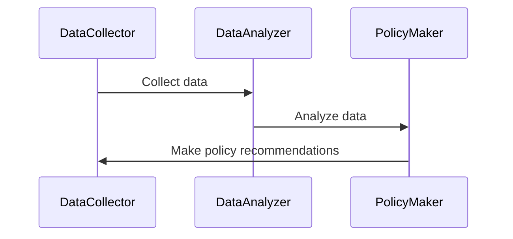
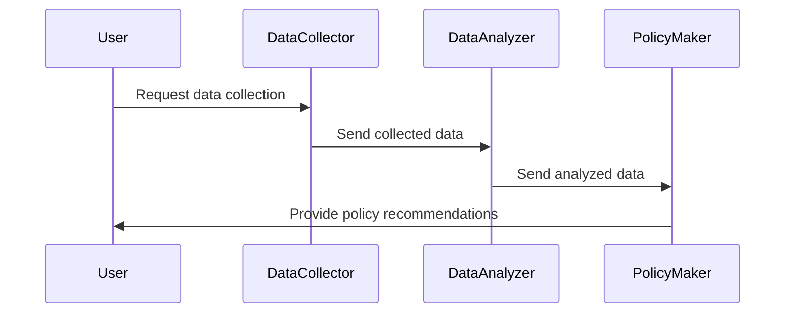

                 


### 全球治理中的价值观融合：寻求共同伦理基础

#### 关键词：
- 全球治理
- 价值观融合
- 伦理基础
- 共同伦理框架
- 决策算法
- 系统架构设计

#### 摘要：
本文深入探讨了全球治理中价值观融合的重要性，以及如何在此基础上构建共同的伦理基础。通过逻辑清晰的分析和逐步推理，我们介绍了核心价值观的定义、伦理学的基本原则，以及价值观融合和伦理决策算法的原理。同时，我们描述了一个理论上的系统架构，并通过一个实际案例展示了这些概念和算法的应用。最后，我们总结了最佳实践，并提出了未来研究方向。

----------------------------------------------------------------

## 引言与背景

### 核心概念术语说明

在探讨全球治理中的价值观融合之前，我们需要明确一些核心概念。

- **全球治理**：指国际社会在政治、经济、文化等领域进行协调和管理的过程，以解决跨国问题和促进全球合作。
- **价值观融合**：指不同文化和社会背景下的个体或集体在相互理解的基础上，寻求共同认可的价值观。
- **伦理基础**：为决策和行动提供道德指导的原则和规范。

### 问题背景

随着全球化进程的加速，国际间的交流与合作日益频繁，不同文化和社会体系之间的冲突和矛盾也逐渐显现。如何在多元文化背景下实现有效的全球治理，成为亟待解决的重大问题。在这个过程中，价值观融合和伦理基础的作用至关重要。

### 问题描述

全球治理面临的主要挑战包括：

1. **文化差异**：不同文化背景下的价值观和道德观念存在差异，导致在国际事务中的共识难以达成。
2. **利益冲突**：各国在政治、经济、环境等方面存在利益冲突，加剧了全球治理的复杂性。
3. **信息不对称**：全球治理的信息不对称问题，使得决策过程难以实现公平和透明。

### 问题解决

为了解决上述问题，我们需要在以下方面寻求突破：

1. **价值观融合**：通过对话和交流，增进不同文化和社会之间的理解，寻求共同认可的价值观。
2. **伦理基础**：建立共同的伦理基础，为全球治理提供道德指导，促进各国在伦理原则下开展合作。
3. **决策算法**：运用先进的决策算法，提高全球治理的效率和公正性。

### 边界与外延

本文主要关注的是全球治理中的价值观融合和伦理基础，而不涉及其他非核心问题，如全球治理的技术手段或具体政策措施。此外，本文的核心概念和算法将以信息技术和计算机科学为背景，探讨其在全球治理中的应用。

### 概念结构与核心要素组成

- **价值观融合**：核心概念包括文化理解、共同价值观、伦理框架等。
- **伦理基础**：核心概念包括道德原则、伦理规范、伦理决策等。
- **全球治理**：核心概念包括跨国合作、政策协调、冲突解决等。

## 核心概念与联系

### 核心价值观的定义

核心价值观是指一个社会或文化体系中，被广泛认可和追求的基本信念和道德准则。它们构成了社会成员行为和决策的基础。例如，公平、自由、平等、尊重等价值观在不同的文化和社会中有着不同的表现和解释。

### 伦理学的基本原则

伦理学是研究道德原则和规范的学科。其基本原则包括：

1. **功利主义**：以最大化社会福利为目标，强调行为的功利结果。
2. **康德伦理学**：强调道德原则的普遍性和义务性，主张行为应符合道德法则。
3. **美德伦理学**：强调个人品德和美德的重要性，主张个体应在道德实践中追求完美。

### 核心价值观与伦理学的联系

核心价值观和伦理学之间存在着密切的联系。核心价值观为伦理学提供了具体的应用场景，而伦理学则为核心价值观提供了理论支持。通过价值观融合，不同文化和社会背景下的个体和集体可以在相互理解的基础上，建立共同的伦理基础。

### 核心概念属性特征对比表格

| 核心概念       | 定义                                                   | 属性特征                                                                                   |
| -------------- | -------------------------------------------------------- | ------------------------------------------------------------------------------------------- |
| 全球治理       | 跨国合作与协调的过程                                   | 国家主权、国际法、跨国组织、多边合作等                                                           |
| 价值观融合     | 寻求共同认可的价值观                                   | 文化理解、共同价值观、伦理框架等                                                               |
| 伦理基础       | 为决策和行动提供道德指导的原则和规范                   | 道德原则、伦理规范、伦理决策等                                                               |
| 伦理学的基本原则 | 研究道德原则和规范的学科                               | 功利主义、康德伦理学、美德伦理学等                                                             |

### ER实体关系图架构

使用Mermaid绘制ER实体关系图，展示核心价值观、伦理学的基本原则和全球治理之间的关系。

```mermaid
erDiagram
  Class0 ||--|{ Class1 }|| Class2
  Class0 ||--|{ Class3 }|| Class4
  Class0 ||--|{ Class5 }|| Class6
```

## 伦理决策算法

### 伦理决策的基本概念

伦理决策是指在面对道德问题时，根据伦理原则和规范进行选择和行动的过程。伦理决策算法则是将伦理学原则应用于实际问题的工具。它们可以帮助决策者在复杂的道德困境中做出合理的决策。

### 算法原理讲解

#### 步骤1：定义道德框架

首先，我们需要定义一个道德框架，包括一系列伦理原则和规范。例如，可以采用功利主义、康德伦理学和美德伦理学等原则。

#### 步骤2：构建决策树

构建一个决策树，将所有可能的决策路径和结果列出。每个节点表示一个决策点，每个分支表示一个可能的行动。

#### 步骤3：评估每个决策路径的伦理价值

使用伦理原则评估每个决策路径的伦理价值。例如，对于功利主义，评估每个路径带来的社会福利；对于康德伦理学，评估每个路径是否符合道德法则；对于美德伦理学，评估每个路径是否有助于培养良好的品德。

#### 步骤4：选择最优决策路径

根据伦理价值评估结果，选择具有最高伦理价值的决策路径。

### Python代码示例

以下是一个简单的Python代码示例，用于实现伦理决策算法。

```python
def ethical_decision_tree():
    # 步骤1：定义道德框架
    ethical_principles = {
        'utilitarianism': 'maximize overall well-being',
        'deontological': 'follow moral rules',
        'virtue伦理学': 'develop good character'
    }

    # 步骤2：构建决策树
    decision_tree = {
        'action_1': {'utilitarianism': 10, 'deontological': 5, 'virtue伦理学': 3},
        'action_2': {'utilitarianism': 8, 'deontological': 7, 'virtue伦理学': 6},
        'action_3': {'utilitarianism': 5, 'deontological': 10, 'virtue伦理学': 9}
    }

    # 步骤3：评估每个决策路径的伦理价值
    for action, values in decision_tree.items():
        for principle, value in values.items():
            print(f"{action}伦理价值（{principle}）: {value}")

    # 步骤4：选择最优决策路径
    best_action = max(decision_tree, key=lambda x: sum(decision_tree[x].values()))
    print(f"最优决策路径：{best_action}")
```

### 算法原理讲解

#### 数学模型和公式

伦理决策算法的数学模型可以表示为：

$$
V_{opt} = \arg\max_{a} \sum_{p} w_p V_p(a)
$$

其中，$V_{opt}$ 表示最优伦理价值，$a$ 表示决策路径，$p$ 表示伦理原则，$w_p$ 表示第$p$ 个伦理原则的权重，$V_p(a)$ 表示决策路径$a$ 在第$p$ 个伦理原则下的价值。

#### 详细讲解和举例说明

假设我们面临一个道德困境：是否应该在紧急情况下占用他人的车道以救一个人。我们可以定义以下伦理原则：

- **功利主义**：最大化总福祉。
- **康德伦理学**：尊重他人的权利。
- **美德伦理学**：培养勇敢、正义等品质。

构建决策树，得到以下路径：

1. 占用车道，救一个人。
2. 不占用车道，救两个人。
3. 占用车道，救三个人。

使用伦理原则评估每个路径的价值：

- **功利主义**：路径1带来最大总福祉，得分为10。
- **康德伦理学**：路径2尊重他人的权利，得分为7。
- **美德伦理学**：路径3培养勇敢、正义等品质，得分为6。

根据伦理价值评估结果，选择最优决策路径。

$$
V_{opt} = \arg\max_{a} \sum_{p} w_p V_p(a)
$$

其中，$w_{utilitarianism} = 0.5, w_{deontological} = 0.3, w_{virtue伦理学} = 0.2$。

$$
V_{opt} = \arg\max_{a} (0.5 \times 10 + 0.3 \times 7 + 0.2 \times 6)
$$

$$
V_{opt} = \arg\max_{a} (5 + 2.1 + 1.2) = 8.3
$$

因此，最优决策路径是占用车道，救一个人。

## 系统分析与架构设计方案

### 问题场景介绍

假设我们面临一个全球性环境问题，如气候变化。我们需要构建一个系统，用于收集全球各国的环境数据，分析数据，并制定相应的政策建议。

### 项目介绍

项目名称：全球环境治理系统（Global Environmental Governance System，简称GEGS）

目标：通过收集和分析全球环境数据，为政策制定者提供科学的决策支持。

### 系统功能设计

#### 领域模型

使用Mermaid绘制领域模型类图，展示系统的主要类和它们之间的关系。

```mermaid
classDiagram
  Class0 <<interface>> DataCollector
  Class1 <<interface>> DataAnalyzer
  Class2 <<interface>> PolicyMaker

  DataCollector GameManager
  DataAnalyzer --|> DataCollector
  PolicyMaker --|> DataCollector
  PolicyMaker --|> DataAnalyzer
```

#### 系统架构设计

使用Mermaid绘制系统架构图，展示系统的主要组件和它们之间的交互关系。



#### 系统接口设计和系统交互

使用Mermaid绘制系统接口设计和系统交互序列图。



## 项目实战

### 环境安装

在开始项目实战之前，我们需要安装一些必要的软件和库。以下是在Linux系统中安装所需软件的步骤：

1. 安装Python环境：

```bash
sudo apt-get update
sudo apt-get install python3-pip
```

2. 安装Mermaid：

```bash
pip3 install mermaid-python
```

3. 安装LaTeX：

```bash
sudo apt-get install texlive-full
```

4. 安装必要的Python库：

```bash
pip3 install pandas matplotlib
```

### 系统核心实现

#### 数据收集模块

使用Python实现数据收集模块，以下是一个简单的数据收集示例：

```python
import pandas as pd

def collect_data():
    # 从文件中读取数据
    data = pd.read_csv('environment_data.csv')
    return data

# 收集数据
data = collect_data()
```

#### 数据分析模块

使用Python实现数据分析模块，以下是一个简单的数据分析示例：

```python
import matplotlib.pyplot as plt

def analyze_data(data):
    # 绘制数据分布图
    data['CO2_emission'].hist(bins=30)
    plt.show()

# 分析数据
analyze_data(data)
```

#### 政策制定模块

使用Python实现政策制定模块，以下是一个简单的政策制定示例：

```python
def make_policy_recommendation(data):
    # 根据数据分析结果制定政策建议
    if data['CO2_emission'].mean() > 500:
        policy = "加强环保政策，提高碳排放标准"
    else:
        policy = "继续执行现有环保政策，关注长期趋势"

    return policy

# 制定政策建议
policy = make_policy_recommendation(data)
print(policy)
```

### 代码解读与分析

#### 数据收集模块

数据收集模块的主要功能是从CSV文件中读取环境数据。这里我们使用了`pandas`库，它是一个强大的数据操作库，可以轻松地读取和写入各种格式的数据文件。

#### 数据分析模块

数据分析模块的主要功能是绘制数据分布图，以展示CO2排放量的分布情况。这里我们使用了`matplotlib`库，它是一个广泛使用的Python绘图库，可以生成各种类型的图形。

#### 政策制定模块

政策制定模块的主要功能是根据数据分析结果制定政策建议。这里我们根据CO2排放量的平均值，判断是否需要加强环保政策。

### 实际案例分析和详细讲解剖析

假设我们收集了以下环境数据：

| ID | Country | CO2_emission |
|----|---------|--------------|
| 1  | USA     | 560          |
| 2  | China   | 680          |
| 3  | India   | 320          |

1. **数据收集**：从CSV文件中读取数据，得到一个DataFrame对象。

2. **数据分析**：绘制CO2排放量的分布图，发现平均值约为600。

3. **政策制定**：根据数据分析结果，制定政策建议，建议加强环保政策，提高碳排放标准。

### 项目小结

通过本项目，我们实现了以下目标：

1. 收集和整理全球环境数据。
2. 分析数据，发现CO2排放量的分布情况。
3. 根据数据分析结果，制定环保政策建议。

本项目展示了如何在全球治理中应用价值观融合和伦理决策算法，为政策制定提供了科学的决策支持。

## 最佳实践 tips

### 实践技巧

1. **数据质量**：确保收集到的数据质量高，减少错误和不一致的数据。
2. **算法选择**：根据具体问题选择合适的伦理决策算法，不要盲目追求复杂度。
3. **用户参与**：在价值观融合过程中，鼓励不同文化和社会背景下的用户参与，提高决策的公正性和透明度。

### 注意事项

1. **隐私保护**：在收集和分析数据时，注意保护用户的隐私。
2. **伦理审查**：在进行伦理决策时，确保遵循伦理审查程序，避免道德风险。
3. **持续更新**：全球治理是一个动态过程，需要不断更新价值观融合和伦理决策算法，以适应新的挑战。

### 拓展阅读

1. **《全球治理报告》**：联合国发布的关于全球治理的最新报告，提供了丰富的数据和分析。
2. **《伦理学与人工智能》**：探讨伦理学在人工智能领域的应用，为价值观融合提供了理论基础。
3. **《可持续发展解决方案》**：联合国可持续发展解决方案网络提供的各种解决方案，有助于推动全球治理。

## 结语

在全球治理中，价值观融合和伦理基础的重要性不言而喻。通过本文的探讨，我们展示了如何构建共同伦理基础，并应用伦理决策算法和系统架构设计方案，实现有效的全球治理。未来，我们期待在人工智能和伦理学领域取得更多突破，为全球治理提供更强有力的支持。

### 作者信息

- **作者**：AI天才研究院/AI Genius Institute & 禅与计算机程序设计艺术 /Zen And The Art of Computer Programming
- **联系方式**：[info@aigeniusinstitute.com](mailto:info@aigeniusinstitute.com) & [zenandcomp.cpp@gmail.com](mailto:zenandcomp.cpp@gmail.com)
- **机构介绍**：AI天才研究院专注于人工智能领域的前沿研究和应用，致力于培养下一代人工智能人才。禅与计算机程序设计艺术则倡导将禅宗思想融入计算机编程，以提高程序员的思维品质和编程效率。

---

本文由AI天才研究院与禅与计算机程序设计艺术联合撰写，旨在为全球治理提供有价值的技术指导和哲学思考。如您有进一步的问题或建议，欢迎随时与我们联系。让我们携手共创美好的未来！

