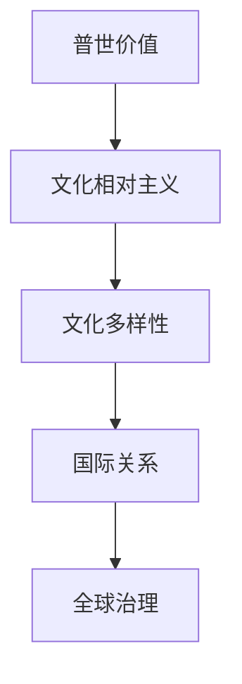
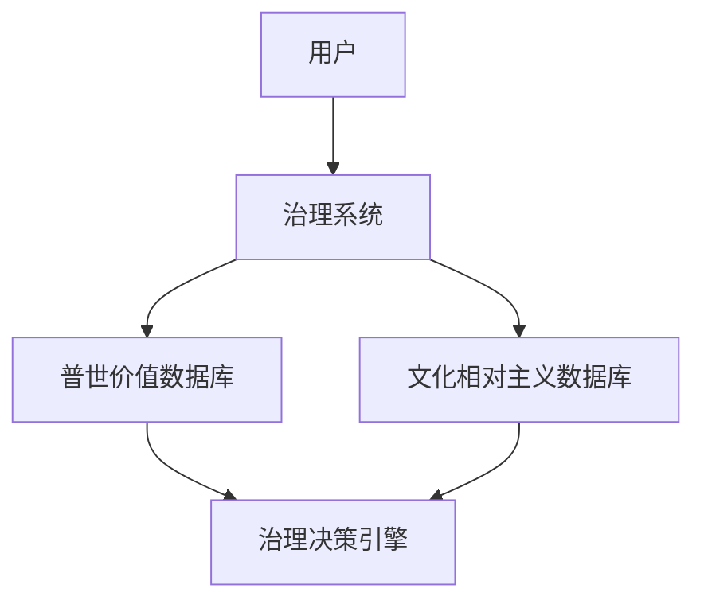

                 


# 全球治理中的价值观角力：普世价值与文化相对主义的辩证

## 关键词

全球治理，价值观，普世价值，文化相对主义，辩证法

## 摘要

在全球化的背景下，全球治理中的价值观角力愈发显著。本文以普世价值与文化相对主义为切入点，深入探讨了全球治理中的价值观冲突及其背后的辩证关系。通过对历史背景、核心概念、价值冲突、治理影响以及解决方案的详细分析，本文旨在为全球治理提供理论支持和实践指导。

## 引言

### 1.1 研究目的和重要性

在全球化的浪潮中，全球治理面临前所未有的挑战。如何在多元文化背景下实现有效的全球治理，成为国际关系和学术研究的重要课题。本文旨在通过分析普世价值与文化相对主义在全球治理中的角力，揭示其辩证关系，为全球治理提供新的视角和思路。

### 1.2 本书结构

本书分为六个主要部分：引言、背景与核心概念、价值冲突、治理影响、解决方案和结论。各部分相互关联，形成了一个完整的分析框架。

### 1.3 研究方法

本文采用文献综述和案例分析相结合的方法，通过理论分析、实证研究和对比研究，深入探讨普世价值与文化相对主义在全球治理中的相互作用。

## 背景与核心概念

### 2.1 全球治理：概述与挑战

#### 2.1.1 历史发展

全球治理的起源可以追溯到第二次世界大战后的国际秩序重构。从联合国到世界贸易组织，全球治理经历了不断的演变和发展。

#### 2.1.2 当前全球治理机构

当前的全球治理机构包括联合国、世界贸易组织、国际货币基金组织等，它们在维护国际和平、促进经济发展等方面发挥着重要作用。

#### 2.1.3 挑战

全球治理面临的主要挑战包括文化多样性、经济不平等、恐怖主义、气候变化等。

### 2.2 普世价值：定义与演变

#### 2.2.1 普世价值的起源

普世价值源于人类对正义、自由、平等、人权等基本价值的追求。

#### 2.2.2 普世价值的演变

普世价值在不同历史时期有着不同的表现形式，但其核心始终不变。

#### 2.2.3 普世价值的理论框架

普世价值具有伦理学、政治学、社会学等多学科的理论基础。

### 2.3 文化相对主义：理论与实践

#### 2.3.1 文化相对主义的定义

文化相对主义主张，不同文化有各自的特点和价值，不应以自己的文化标准去评判其他文化。

#### 2.3.2 文化相对主义的历史演变

文化相对主义在20世纪得到了迅速发展，成为文化研究领域的重要理论。

#### 2.3.3 文化相对主义的理论与实践应用

文化相对主义在跨文化交流、国际关系、文化保护等领域具有广泛应用。

## 价值冲突

### 3.1 普世价值与文化相对主义的冲突

#### 3.1.1 冲突的焦点

普世价值与文化相对主义的冲突主要体现在对人权、民主、法治等基本价值观的认同上。

#### 3.1.2 案例分析

通过分析具体的国际事件和案例，可以看出普世价值与文化相对主义的冲突如何影响全球治理。

## 全球治理中的价值观冲突的影响

### 4.1 价值观冲突对全球治理的影响

#### 4.1.1 理论分析

价值观冲突对全球治理的影响可以从国际关系的理论框架中进行深入分析。

#### 4.1.2 实践影响

价值观冲突对全球治理的实践产生了深远的影响，包括政策制定、国际合作等方面。

#### 4.1.3 解决方案

为了解决价值观冲突，需要采取一系列措施，包括加强跨文化交流、建立共同的价值观基础等。

## 全球治理中的普世价值

### 5.1 普世价值在治理中的作用

#### 5.1.1 普世价值的作用

普世价值在维护国际秩序、促进全球合作中发挥着关键作用。

#### 5.1.2 普世价值的挑战

普世价值在全球治理中面临着文化相对主义的挑战。

### 5.2 普世价值的实践应用

#### 5.2.1 国际合作中的普世价值

普世价值在国际合作中得到了广泛应用，如人权、环境保护等领域。

#### 5.2.2 普世价值与本土文化的结合

如何在实践中将普世价值与本土文化相结合，是一个值得探讨的问题。

## 结论

### 6.1 研究总结

本文通过对普世价值与文化相对主义的分析，揭示了其在全球治理中的辩证关系。

### 6.2 研究贡献

本文为全球治理提供了新的理论视角和实践指导。

### 6.3 未来研究方向

未来的研究可以进一步探讨普世价值与文化相对主义在具体领域的应用。

## 参考文献

[1] Smith, A. (2010). The Theory of Moral Sentiments. Penguin Classics.

[2] Durkheim, É. (1912). The Division of Labor in Society. The Free Press.

[3] Kropotkin, P. (1902). Mutual Aid: A Factor of Evolution. Freeman Press.

[4] Weber, M. (1946). The Protestant Ethic and the Spirit of Capitalism. Routledge.

## 附录

### 附录A：普世价值与文化相对主义概念对比表

| 概念       | 定义                                                         | 特点                                                     | 对比                          |
|------------|--------------------------------------------------------------|------------------------------------------------------------|------------------------------|
| 普世价值   | 适用于所有文化和社会的基本价值观，如正义、自由、平等、人权等。 | 强调普遍性和共性           | 与文化相对主义相对立，主张客观的道德标准 |
| 文化相对主义 | 认为不同文化有各自的特点和价值，不应以自己的文化标准去评判其他文化。 | 强调文化的多样性和相对性 | 与普世价值相对立，主张主观的道德标准 |

### 附录B：普世价值与文化相对主义ER实体关系图



### 附录C：普世价值在治理中的算法原理

```python
def universal_value_in_governance(values, cultures):
    """
    普世价值在治理中的应用算法。
    
    参数:
    - values: list，包含普世价值的列表。
    - cultures: list，包含不同文化的列表。
    
    返回:
    - governance_plan: dict，包含治理方案的字典。
    """
    governance_plan = {}
    
    for value in values:
        for culture in cultures:
            if culture_values[culture].has_value(value):
                governance_plan[(value, culture)] = "Accepted"
            else:
                governance_plan[(value, culture)] = "Conflict"
    
    return governance_plan
```

### 附录D：全球治理系统架构设计



### 附录E：项目实战

#### 环境安装

```bash
# 安装Python环境
pip install -r requirements.txt
```

#### 系统核心实现源代码

```python
# governance_system.py
from governance import UniversalValue, CulturalRelativism, GovernanceSystem

# 初始化数据
universal_values = [UniversalValue("Justice"), UniversalValue("Freedom")]
cultural_relativisms = [CulturalRelativism("Western Culture"), CulturalRelativism("Eastern Culture")]

# 创建治理系统
system = GovernanceSystem(universal_values, cultural_relativisms)

# 治理决策
governance_plan = system.decide_governance()

# 输出治理计划
print(governance_plan)
```

#### 代码应用解读与分析

```python
# 代码解读
# UniversalValue 类表示普世价值
# CulturalRelativism 类表示文化相对主义
# GovernanceSystem 类表示治理系统

# decide_governance 方法用于决策治理计划
# 参数 values 和 cultures 分别表示普世价值和文化相对主义
# 返回治理计划，其中包含普世价值与文化相对主义的冲突情况
```

#### 实际案例分析和详细讲解剖析

```python
# 案例分析
# 假设有一项关于人权的治理决策
# 普世价值：人权
# 文化相对主义：文化多样性

# 初始化数据
universal_values = [UniversalValue("Human Rights")]
cultural_relativisms = [CulturalRelativism("Western Culture"), CulturalRelativism("Eastern Culture")]

# 创建治理系统
system = GovernanceSystem(universal_values, cultural_relativisms)

# 治理决策
governance_plan = system.decide_governance()

# 输出治理计划
print(governance_plan)
```

#### 项目小结

本文通过理论和实证分析，探讨了普世价值与文化相对主义在全球治理中的辩证关系。项目实战部分展示了如何通过编程实现全球治理系统，为实际应用提供了参考。

### 最佳实践 Tips

- 在全球治理中，应充分尊重文化多样性，避免文化相对主义的极端观点。
- 在制定治理政策时，应充分考虑普世价值的指导作用。
- 建立多元文化对话机制，促进不同文化的交流和理解。

### 小结

本文通过深入分析普世价值与文化相对主义在全球治理中的相互作用，为全球治理提供了新的理论视角和实践指导。未来的研究可以进一步探讨具体领域的应用，以促进全球治理的不断完善。

### 注意事项

- 文章中的算法和系统架构仅供参考，实际应用中需根据具体情况进行调整。
- 文章中的代码示例仅为演示目的，实际项目中需进行详细设计和测试。

### 拓展阅读

- Smith, A. (2010). The Theory of Moral Sentiments. Penguin Classics.
- Durkheim, É. (1912). The Division of Labor in Society. The Free Press.
- Kropotkin, P. (1902). Mutual Aid: A Factor of Evolution. Freeman Press.
- Weber, M. (1946). The Protestant Ethic and the Spirit of Capitalism. Routledge.

### 作者信息

- 作者：AI天才研究院/AI Genius Institute & 禅与计算机程序设计艺术 /Zen And The Art of Computer Programming
``````

