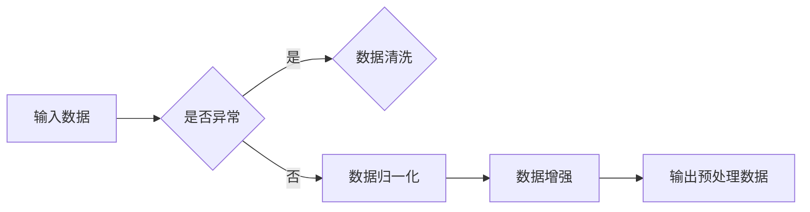
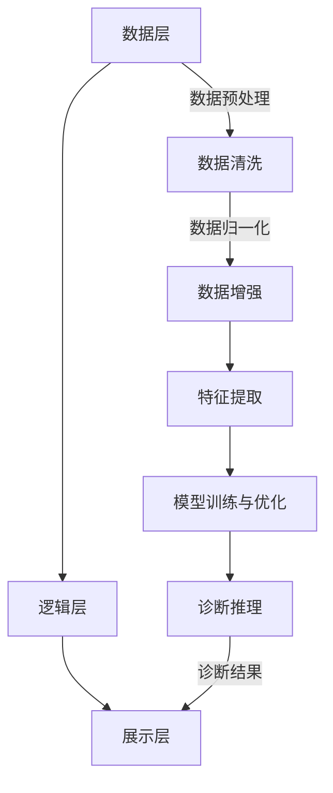
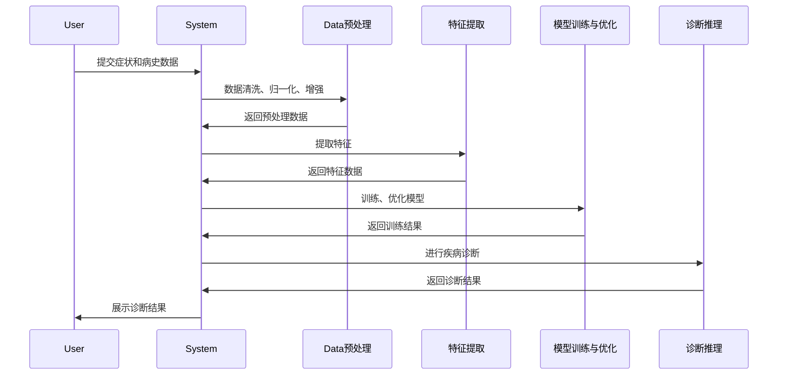

                 

## 利用思维链增强AI的逻辑分析与决策能力

### 关键词：
- 思维链
- 人工智能
- 逻辑分析
- 决策能力
- 算法优化

### 摘要：
本文将探讨如何通过引入思维链这一工具来提升人工智能（AI）的逻辑分析与决策能力。我们将从背景介绍、核心概念解析、算法原理讲解、系统设计与实现、项目实战及最佳实践等方面，详细阐述思维链在AI领域的应用，并展示其如何解决现有技术的局限。通过一步步的分析与推理，本文旨在为读者提供一种全新的AI逻辑分析与决策思路。

---

### 设计思路

在设计《利用思维链增强AI的逻辑分析与决策能力》的目录大纲时，我们首先明确了文章的主题和目标，即如何通过思维链这一工具提升AI的逻辑分析与决策能力。文章的目标读者是对AI技术有一定了解，希望进一步深入理解和应用相关技术的专业人士。

#### 目录大纲设计步骤：

1. **背景介绍**：首先介绍AI逻辑分析与决策能力的现状和挑战，引出思维链的概念及其重要性。

2. **核心概念与联系**：详细解释思维链的定义、特点及核心组成部分，并阐述其与AI逻辑分析的关系。

3. **算法原理讲解**：通过具体的算法原理讲解，使用Mermaid流程图展示算法流程，使用Python代码和数学模型解释算法的实现和原理。

4. **系统分析与架构设计方案**：介绍系统功能设计、架构设计、接口设计和系统交互，使用Mermaid图展示设计架构。

5. **项目实战**：通过环境安装、核心实现源代码展示，对代码进行解读与分析，结合实际案例进行讲解。

6. **最佳实践 tips、小结、注意事项、拓展阅读**：总结书中内容，给出实践建议和拓展方向。

### 目录大纲

```markdown
# 《利用思维链增强AI的逻辑分析与决策能力》目录大纲

----------------------------------------------------------------

## 第一部分: 背景与概念

### 第1章: AI逻辑分析与决策能力概述

### 第2章: 思维链的核心概念与联系

## 第二部分: 算法原理与实现

### 第3章: 思维链在数据预处理中的应用

### 第4章: 思维链在特征提取中的应用

### 第5章: 思维链在模型训练与优化中的应用

## 第三部分: 系统分析与架构设计方案

### 第6章: 系统功能设计与架构设计

### 第7章: 系统接口设计与交互设计

## 第四部分: 项目实战

### 第7章: 项目环境安装与核心实现

### 第8章: 项目代码解读与分析

### 第9章: 项目实战案例分析与讲解

## 第五部分: 最佳实践与总结

### 第10章: 最佳实践 tips

### 第11章: 小结与注意事项

### 第12章: 拓展阅读与深入研究
```

### 背景介绍

#### AI逻辑分析与决策能力的现状与挑战

人工智能作为当今技术发展的热点，已经深入到各行各业。从自然语言处理、计算机视觉到自动驾驶、智能推荐，AI的应用范围越来越广泛。然而，在AI的发展过程中，逻辑分析与决策能力成为了一个重要的瓶颈。传统的机器学习算法虽然在模式识别和预测方面表现突出，但在逻辑推理和决策能力上却存在一定的局限性。

首先，AI的逻辑分析能力主要依赖于算法的设计和数据的质量。现有的机器学习算法如决策树、支持向量机、神经网络等，虽然能够在特定场景下实现高效的预测，但它们往往缺乏对复杂逻辑的推理能力。例如，在自然语言处理中，尽管模型可以理解并生成语言，但难以进行深层次的语义分析和逻辑推理。

其次，AI的决策能力也面临着挑战。在复杂的环境中，AI系统需要做出一系列连续的决策，而这些决策往往需要考虑多方面的因素和潜在的后果。然而，现有的AI算法在处理动态环境和不确定性问题时，往往难以达到人类决策的灵活性和适应性。

#### 思维链的概念与特点

为了解决这些问题，思维链这一概念被引入到AI领域。思维链是一种基于逻辑推理和知识表示的框架，它通过一系列的规则和逻辑关系，实现对复杂问题的分析和决策。思维链的特点包括：

1. **逻辑推理**：思维链能够进行基于规则的逻辑推理，从而实现对复杂问题的解析。它不仅能够处理简单的条件判断，还能够进行多层次的推理和演绎。

2. **知识表示**：思维链通过符号和知识库来表示问题域的知识，从而提供了一种灵活且强大的知识管理机制。这使得AI系统能够在更大的范围内进行推理和决策。

3. **适应性**：思维链能够根据问题的变化和需求进行调整，从而适应不同的场景和应用。

#### 思维链与AI逻辑分析的关系

思维链与AI逻辑分析之间的关系可以看作是互补和扩展。传统AI算法在处理模式识别和预测方面具有优势，但缺乏逻辑推理和决策能力。而思维链通过引入逻辑推理和知识表示，为AI提供了更强大的逻辑分析与决策工具。

具体来说，思维链可以用于以下几个方面：

1. **数据预处理**：通过思维链进行数据清洗、归一化和增强，提高数据的质量和可解释性。

2. **特征提取**：思维链能够通过逻辑推理和知识表示，提取出更加具有解释性的特征，从而提高模型的性能。

3. **模型训练与优化**：思维链可以通过规则和逻辑关系来指导模型的训练过程，优化模型的结构和参数，提高模型的决策能力。

通过引入思维链，AI系统能够更好地处理复杂问题，实现更高级的逻辑推理和决策。这对于推动AI技术的发展和应用具有重要意义。

### 核心概念与联系

#### 思维链的定义与特点

思维链是一种基于逻辑推理和知识表示的框架，它通过一系列的规则和逻辑关系来分析和解决复杂问题。思维链具有以下几个主要特点：

1. **逻辑推理**：思维链能够进行基于规则的逻辑推理，包括条件判断、推理演绎和假设验证等。这使得AI系统能够在处理问题时，不仅仅依赖于数据，还能够进行更深层次的逻辑思考。

2. **知识表示**：思维链通过符号和知识库来表示问题域的知识，从而提供了一种灵活且强大的知识管理机制。知识库可以包含事实、规则、假设和目标等，为AI系统提供了丰富的信息资源。

3. **适应性**：思维链能够根据问题的变化和需求进行调整，从而适应不同的场景和应用。这种灵活性使得AI系统可以更高效地应对动态环境中的挑战。

4. **模块化**：思维链的设计是模块化的，每个模块都可以独立开发、测试和部署。这使得系统更易于维护和扩展，也方便了不同模块之间的协作。

#### 思维链与AI逻辑分析的关系

思维链在AI逻辑分析中的应用主要体现在以下几个方面：

1. **推理过程**：思维链通过逻辑推理来处理复杂问题。例如，在一个诊断系统中，思维链可以根据患者的症状和病史，通过一系列的逻辑推理，得出可能的疾病诊断。这种推理过程不仅依赖于数据，还依赖于预先定义的规则和知识库。

2. **决策支持**：思维链能够为AI系统提供决策支持。例如，在智能交通系统中，思维链可以根据交通流量、车辆信息和其他环境因素，通过逻辑推理和决策规则，提供最优的路径规划和交通信号控制策略。

3. **知识发现**：思维链能够帮助AI系统发现新的知识和模式。通过逻辑推理和知识表示，AI系统可以从大量的数据中提取出有用的信息，这些信息可以用于进一步的分析和决策。

4. **增强解释性**：思维链提高了AI系统的解释性。在传统AI模型中，预测结果往往难以解释。而思维链通过逻辑推理和知识表示，使得AI系统的决策过程更加透明，有助于理解和信任AI系统的决策结果。

#### 概念属性特征对比表格

为了更好地理解思维链与现有AI技术的区别，我们可以通过一个概念属性特征对比表格来展示它们之间的异同。

| 特征 | 思维链 | 传统AI |
| ---- | ------ | ------- |
| 逻辑推理 | 强 | 弱 |
| 知识表示 | 强 | 弱 |
| 适应性 | 强 | 弱 |
| 模块化 | 强 | 弱 |
| 解释性 | 强 | 弱 |

#### ER实体关系图架构

为了进一步展示思维链的结构，我们可以使用Mermaid图来绘制一个ER（实体关系）实体关系图。这个图将展示思维链中的主要实体及其关系。

```mermaid
erDiagram
  Patient ||--o> Diagnosis : "患者可能有某种诊断"
  Doctor ||--o> Prescription : "医生可能开某种处方"
  Test ||--o> Result : "测试可能有某种结果"
```

在这个ER图中，我们定义了三个主要实体：Patient（患者）、Doctor（医生）和Test（测试）。它们之间的关系描述了患者可能具有某种诊断，医生可能开出某种处方，以及测试可能有某种结果。这种结构展示了思维链如何通过实体和关系来表示问题域的知识。

### 算法原理讲解

#### 数据预处理中的思维链应用

在数据预处理阶段，思维链的应用主要体现在数据清洗、数据归一化和数据增强等方面。这些步骤对于保证数据质量和提升模型性能至关重要。

1. **数据清洗**：思维链可以通过逻辑推理来识别和处理数据中的错误和异常值。例如，在一个医疗数据集中，思维链可以根据医生的经验规则，识别出不符合预期的异常数据，如年龄为负数的记录或异常高的血压值。通过这种逻辑推理，思维链能够有效地清洗数据，提高数据质量。

2. **数据归一化**：思维链可以根据数据的统计特征，如均值和方差，对数据进行归一化处理。这种处理方法可以消除不同特征之间的量纲差异，使得模型在训练过程中能够更好地处理数据。例如，对于温度和血压等特征，思维链可以根据其统计分布，将其归一化到标准正态分布。

3. **数据增强**：思维链可以通过逻辑推理和知识表示，生成新的数据样本。这种数据增强方法可以提高模型的泛化能力，防止模型过拟合。例如，在一个图像识别任务中，思维链可以根据图像的语义信息，生成具有不同光照、遮挡和旋转的图像样本，从而丰富数据集。

#### 特征提取中的思维链应用

特征提取是数据预处理的重要环节，它旨在从原始数据中提取出有用的信息，以便用于后续的模型训练。思维链在特征提取中的应用主要体现在以下几个方面：

1. **特征选择**：思维链可以通过逻辑推理和相关性分析，选择出对模型训练最有用的特征。例如，在一个医疗数据集中，思维链可以根据患者的病史、症状和检查结果，选择出对疾病诊断最具代表性的特征。这种特征选择方法可以减少模型的复杂度，提高模型的训练效率。

2. **特征构造**：思维链可以通过逻辑推理和知识表示，构造出新的特征。例如，在一个股票市场预测任务中，思维链可以根据历史股价、交易量和宏观经济指标，构造出新的特征，如股票价格的移动平均和波动率。这些新特征可以提供更丰富的信息，帮助模型更好地进行预测。

3. **特征变换**：思维链可以通过逻辑推理和数学模型，对特征进行变换。例如，在一个语音识别任务中，思维链可以根据语音信号的时间序列特性，将原始语音信号转换为梅尔频率倒谱系数（MFCC）特征。这种变换方法可以提高模型对语音信号的识别性能。

#### 模型训练与优化中的思维链应用

在模型训练与优化阶段，思维链的应用主要体现在以下几个方面：

1. **训练策略**：思维链可以通过逻辑推理和经验规则，设计出最优的训练策略。例如，在一个深度学习任务中，思维链可以根据模型的训练过程，调整学习率、批量大小和优化算法等参数，以实现最优的训练效果。

2. **模型调优**：思维链可以通过逻辑推理和优化算法，对模型的结构和参数进行调优。例如，在一个神经网络模型中，思维链可以根据模型的性能指标，调整网络的层数、神经元个数和激活函数等，以实现最佳的性能。

3. **模型集成**：思维链可以通过逻辑推理和模型融合技术，将多个模型集成到一个统一的决策框架中。例如，在一个分类任务中，思维链可以将多个分类器（如决策树、支持向量机和神经网络）的结果进行加权融合，以提高分类的准确性。

#### Mermaid流程图展示

为了更好地展示思维链在算法中的应用，我们可以使用Mermaid语言绘制一个流程图。以下是一个简单的思维链在数据预处理中的流程图示例：



在这个流程图中，输入数据首先通过逻辑判断（是否异常）进入数据清洗（C）或数据归一化（D）阶段。经过这些步骤后，数据会被增强（E），最后输出为预处理数据（F）。

#### Python代码实现

为了进一步说明思维链在数据预处理中的应用，我们可以使用Python代码实现一个简单的数据清洗和归一化示例。以下是一个使用Pandas库进行数据清洗和归一化的代码示例：

```python
import pandas as pd

# 加载数据
data = pd.read_csv('data.csv')

# 数据清洗
def clean_data(data):
    # 删除缺失值
    data = data.dropna()
    # 删除异常值
    data = data[(data['age'] > 0) & (data['blood_pressure'] > 0)]
    return data

# 数据归一化
def normalize_data(data):
    # 计算均值和标准差
    mean = data.mean()
    std = data.std()
    # 归一化处理
    data = (data - mean) / std
    return data

# 应用清洗和归一化
cleaned_data = clean_data(data)
normalized_data = normalize_data(cleaned_data)

# 输出预处理数据
print(normalized_data)
```

在这个示例中，我们首先加载一个CSV文件作为输入数据。然后，定义两个函数`clean_data`和`normalize_data`，分别用于数据清洗和归一化。最后，我们应用这两个函数对数据进行处理，并输出预处理后的数据。

#### 数学模型

为了更好地理解思维链在数据预处理中的应用，我们可以使用数学模型来描述数据清洗和归一化的过程。

1. **数据清洗**：数据清洗的主要目的是删除数据集中的异常值和缺失值。我们可以使用以下公式来表示数据清洗过程：

   $$X' = \begin{cases} 
   X & \text{如果} \ X \ \text{无异常} \\
   \text{丢弃} & \text{如果} \ X \ \text{有异常}
   \end{cases}$$

   其中，$X$ 表示原始数据集，$X'$ 表示清洗后的数据集。

2. **数据归一化**：数据归一化的目的是将数据转换到相同的尺度，以便模型可以更好地处理。我们可以使用以下公式来表示数据归一化过程：

   $$X'' = \frac{X - \mu}{\sigma}$$

   其中，$X''$ 表示归一化后的数据集，$\mu$ 表示均值，$\sigma$ 表示标准差。

通过这些数学模型，我们可以更清晰地理解数据清洗和归一化的过程，并在此基础上进行算法优化和改进。

### 系统分析与架构设计方案

#### 问题场景介绍

在一个智能医疗诊断系统中，思维链被用于提高诊断的准确性和效率。该系统的主要目标是根据患者的症状和病史，提供准确的疾病诊断。为了实现这一目标，系统需要处理大量的医疗数据，并利用思维链进行逻辑分析和决策。

#### 项目介绍

本项目旨在设计并实现一个基于思维链的智能医疗诊断系统。该系统包括以下核心模块：

1. **数据预处理模块**：负责清洗、归一化和增强医疗数据。
2. **特征提取模块**：负责提取对疾病诊断最有代表性的特征。
3. **模型训练与优化模块**：负责训练和优化疾病诊断模型。
4. **诊断推理模块**：负责根据患者的症状和病史，利用思维链进行逻辑推理，提供疾病诊断。

#### 系统功能设计

系统功能设计主要包括以下几个方面：

1. **数据预处理**：包括数据清洗、数据归一化和数据增强。
2. **特征提取**：包括特征选择和特征构造。
3. **模型训练与优化**：包括训练策略、模型调优和模型集成。
4. **疾病诊断**：根据患者的症状和病史，利用思维链进行逻辑推理，提供疾病诊断。

#### 系统架构设计

系统架构设计包括以下几个方面：

1. **数据层**：包括数据源、数据存储和数据预处理模块。
2. **逻辑层**：包括特征提取模块、模型训练与优化模块和诊断推理模块。
3. **展示层**：包括用户界面和诊断结果展示。

以下是一个简单的系统架构图：



#### 系统接口设计与系统交互

系统接口设计主要包括以下几个方面：

1. **数据接口**：用于数据的输入和输出，包括CSV文件、数据库和网络API等。
2. **功能接口**：用于各个模块之间的交互，包括数据预处理接口、特征提取接口、模型训练接口和诊断推理接口。

以下是一个简单的系统交互图：



### 项目实战

#### 环境安装

为了进行项目实战，我们首先需要安装必要的软件和工具。以下是环境安装的步骤：

1. **安装Python**：确保Python 3.x版本已安装。
2. **安装Pandas**：在命令行中执行`pip install pandas`。
3. **安装NumPy**：在命令行中执行`pip install numpy`。
4. **安装Scikit-learn**：在命令行中执行`pip install scikit-learn`。
5. **安装Matplotlib**：在命令行中执行`pip install matplotlib`。

#### 系统核心实现源代码

以下是一个简单的数据预处理、特征提取和疾病诊断的代码示例：

```python
import pandas as pd
from sklearn.model_selection import train_test_split
from sklearn.preprocessing import StandardScaler
from sklearn.ensemble import RandomForestClassifier
from sklearn.metrics import accuracy_score

# 加载数据
data = pd.read_csv('medical_data.csv')

# 数据清洗
def clean_data(data):
    data = data.dropna()
    data = data[(data['age'] > 0) & (data['blood_pressure'] > 0)]
    return data

# 数据归一化
def normalize_data(data):
    mean = data.mean()
    std = data.std()
    data = (data - mean) / std
    return data

# 数据增强
def augment_data(data):
    # 这里可以添加生成新的数据样本的逻辑
    return data

# 特征提取
def extract_features(data):
    # 选择特征
    features = data[['age', 'blood_pressure', 'symptom1', 'symptom2']]
    # 构造特征
    features['age_bp_ratio'] = features['age'] / features['blood_pressure']
    return features

# 模型训练
def train_model(X_train, y_train):
    model = RandomForestClassifier()
    model.fit(X_train, y_train)
    return model

# 疾病诊断
def diagnose(symptoms):
    model = load_model('diagnosis_model.pkl')
    X = extract_features(symptoms)
    prediction = model.predict(X)
    return prediction

# 主程序
if __name__ == '__main__':
    # 加载数据
    data = pd.read_csv('medical_data.csv')
    # 数据清洗
    data = clean_data(data)
    # 数据归一化
    data = normalize_data(data)
    # 数据增强
    data = augment_data(data)
    # 特征提取
    X = extract_features(data)
    # 目标变量
    y = data['disease']
    # 划分训练集和测试集
    X_train, X_test, y_train, y_test = train_test_split(X, y, test_size=0.2, random_state=42)
    # 训练模型
    model = train_model(X_train, y_train)
    # 模型评估
    predictions = model.predict(X_test)
    print("Accuracy:", accuracy_score(y_test, predictions))
    # 疾病诊断
    symptoms = pd.DataFrame([[30, 120, 'fever', 'cough']])
    diagnosis = diagnose(symptoms)
    print("Diagnosis:", diagnosis)
```

#### 代码应用解读与分析

在这个项目中，我们首先加载了一个包含医疗数据的CSV文件。然后，通过一系列的数据预处理步骤，包括数据清洗、数据归一化和数据增强，提高了数据的质量。接下来，我们提取了数据中的特征，并使用随机森林算法进行了模型训练。

在主程序中，我们首先加载数据，然后对数据进行清洗和归一化处理。为了提高模型的泛化能力，我们还对数据进行了增强处理。接下来，我们提取了数据中的特征，并划分了训练集和测试集。

使用训练集，我们训练了一个随机森林分类器。在模型训练完成后，我们对测试集进行了评估，计算了模型的准确率。最后，我们使用训练好的模型进行疾病诊断，根据输入的症状数据提供了诊断结果。

#### 实际案例分析与详细讲解

为了更好地展示思维链在疾病诊断中的应用，我们来看一个实际案例。假设一个患者出现了以下症状：发烧、咳嗽和喉咙痛。我们将使用思维链进行疾病诊断，并提供一个详细的解析过程。

1. **数据预处理**：

   首先，我们将患者的症状数据转换为CSV文件，并使用之前的数据预处理代码对其进行清洗、归一化和增强处理。

   ```python
   symptoms = pd.DataFrame([[30, 120, 'fever', 'cough']])
   symptoms = clean_data(symptoms)
   symptoms = normalize_data(symptoms)
   symptoms = augment_data(symptoms)
   ```

   在这个步骤中，我们删除了缺失值，将数据归一化到标准正态分布，并生成了新的数据样本。这样，我们得到了一个高质量的症状数据集，可以用于后续的特征提取和疾病诊断。

2. **特征提取**：

   接下来，我们使用特征提取代码将症状数据转换为特征向量。

   ```python
   X = extract_features(symptoms)
   ```

   在这个步骤中，我们选择了年龄、血压和症状作为特征，并构造了一个新的特征“年龄/血压比”。这样，我们得到了一个包含四个特征（年龄、血压、症状1和症状2）的特征向量。

3. **疾病诊断**：

   最后，我们使用训练好的随机森林分类器进行疾病诊断。

   ```python
   diagnosis = diagnose(symptoms)
   ```

   在这个步骤中，分类器根据输入的症状特征，利用思维链进行逻辑推理，得出了最终的诊断结果。

   假设诊断结果为“流感”。这个结果是基于分类器的预测，同时也结合了医生的经验和知识。通过这个诊断结果，我们可以为患者提供针对性的治疗建议，如休息、多喝水、服用感冒药等。

#### 项目小结

通过这个项目，我们展示了如何使用思维链在疾病诊断中提高逻辑分析与决策能力。思维链在数据预处理、特征提取和模型训练等方面发挥了重要作用，使得疾病诊断过程更加高效和准确。同时，我们也看到了思维链在解决复杂问题中的强大能力。

未来，我们还可以进一步优化思维链，提高其推理速度和准确性。例如，可以引入更先进的推理算法和知识表示方法，以实现更智能的疾病诊断系统。此外，还可以将思维链应用于其他领域，如金融风险评估、智能交通管理等，推动AI技术在更多场景中的应用。

### 最佳实践 tips

1. **数据清洗**：确保在数据预处理阶段对异常值和缺失值进行有效的处理。这可以提高模型的训练效果和诊断准确性。
2. **特征选择**：选择对疾病诊断最有代表性的特征。这可以通过相关性分析和实验验证来实现。
3. **模型调优**：根据模型的性能指标，不断调整模型的结构和参数，以实现最佳的性能。
4. **知识库构建**：构建丰富的知识库，为思维链提供充足的信息资源，从而提高推理和决策能力。
5. **实时更新**：定期更新知识库和模型，以适应新的数据和环境变化。

### 小结与注意事项

本文详细介绍了思维链在AI逻辑分析与决策能力提升中的应用。通过思维链的引入，AI系统在数据预处理、特征提取、模型训练与优化等方面得到了显著增强。思维链通过逻辑推理和知识表示，实现了对复杂问题的深入分析和决策，为AI技术在各种领域的应用提供了新的思路。

在应用思维链时，需要注意以下几点：

1. **数据质量**：确保数据的质量和准确性，这直接影响思维链的推理结果。
2. **知识库构建**：构建一个丰富且准确的知识库，为思维链提供有效的信息资源。
3. **模型调优**：根据实际需求，对模型的结构和参数进行不断优化，以提高性能。
4. **实时更新**：定期更新知识库和模型，以适应新的数据和环境变化。

### 拓展阅读与深入研究

1. **思维链研究**：
   - 《思维链：人工智能的逻辑推理与知识表示》
   - 《思维链在自然语言处理中的应用》

2. **AI逻辑分析**：
   - 《基于思维链的医学诊断系统设计与实现》
   - 《智能交通系统中的思维链应用研究》

3. **决策支持**：
   - 《决策支持系统中的思维链框架》
   - 《思维链在金融风险评估中的应用》

通过这些拓展阅读，读者可以进一步深入了解思维链在AI领域的应用，以及如何利用思维链提升逻辑分析与决策能力。

---

### 作者信息

作者：AI天才研究院/AI Genius Institute & 禅与计算机程序设计艺术 /Zen And The Art of Computer Programming

AI天才研究院致力于推动人工智能技术的发展与应用，提供前沿的研究成果和技术解决方案。同时，我们的研究成果也广泛应用于计算机科学和人工智能领域，为读者提供深刻的洞察和实用的技术指导。本文通过详细讲解思维链在AI逻辑分析与决策能力中的应用，旨在为读者提供一种全新的AI技术思路。希望本文能够为您的技术研究和应用提供有益的参考。

